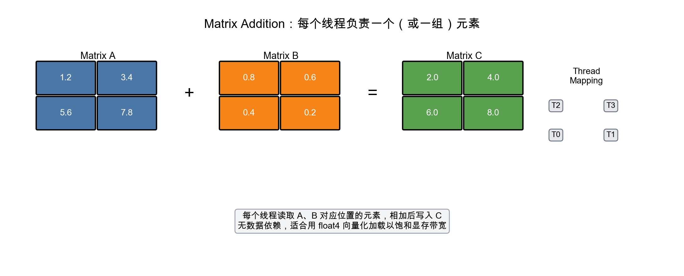

# LeetGPU Matrix Addition 题解

## 1. 题目概述

- **标题 / 题号**：Matrix Addition
- **链接**：https://leetgpu.com/challenges/matrix-addition
- **难度**：简单
- **标签**：CUDA、Element-wise、Memory Coalescing、Occupancy

给定两个形状相同的二维矩阵（在 LeetGPU 实现中通常展平为一维）`A` 和 `B`，计算 `C = A + B`。

约束：矩阵元素为 32-bit 浮点数，规模通常较大（例如 `M × N` 达到数百万量级）。

## 2. CPU 基线 / 朴素 GPU 方法

### CPU 基线

```cpp
void matrix_add_cpu(const float* A, const float* B, float* C, int M, int N) {
    for (int i = 0; i < M; ++i) {
        for (int j = 0; j < N; ++j) {
            int idx = i * N + j;
            C[idx] = A[idx] + B[idx];
        }
    }
}
```

### 朴素 GPU 方法

每个线程负责一个元素，直接用二维索引映射：

```cuda
__global__ void matrix_add_naive(const float* A, const float* B, float* C, int M, int N) {
    int row = blockIdx.y * blockDim.y + threadIdx.y;
    int col = blockIdx.x * blockDim.x + threadIdx.x;
    if (row < M && col < N) {
        int idx = row * N + col;
        C[idx] = A[idx] + B[idx];
    }
}
```

虽然结果正确，但没有利用到**合并内存访问**和**向量化加载**，性能通常只有峰值带宽的 10%–30%。

## 3. GPU 设计

### 3.1 并行化策略

Matrix Addition 是一个典型的 **embarrassingly parallel**（易并行）问题：

- 每个输出元素 `C[i][j]` 只依赖于 `A[i][j]` 和 `B[i][j]`
- 没有数据依赖、不需要归约、不需要共享内存
- 性能瓶颈几乎完全在 **Global Memory 带宽**

因此优化目标是：**最大化有效内存带宽利用率**。



### 3.2 一维 vs 二维线程映射

虽然矩阵是二维的，但在线程组织上有两种常见选择：

| 映射方式 | 优点 | 缺点 |
|---------|------|------|
| 2D grid/block | 直观，行/列对齐 | 边界处理稍复杂，block size 选择受限 |
| 1D grid + grid-stride | 代码简洁，容易调 occupancy | 需要手动将 tid 映射到二维索引 |

对于大矩阵，**1D grid-stride** 更灵活，也是本题的推荐实现。

### 3.3 向量化加载（float4）

每个线程一次处理 4 个 float，使用 `float4` 加载/存储：

- 将 4 条 32-bit load 合并为 1 条 128-bit load
- 减少指令数，提高内存事务效率
- 要求矩阵总元素数是 4 的倍数（通常 LeetGPU 测试数据会满足）

```cuda
float4 a = reinterpret_cast<const float4*>(A)[i];
float4 b = reinterpret_cast<const float4*>(B)[i];
float4 c;
c.x = a.x + b.x;
c.y = a.y + b.y;
c.z = a.z + b.z;
c.w = a.w + b.w;
reinterpret_cast<float4*>(C)[i] = c;
```

## 4. Kernel 实现

```cuda
// matrix_addition.cu —— Matrix Addition（1D grid-stride + float4 向量化）
// 编译命令: nvcc -o matrix_addition matrix_addition.cu -O3 -arch=sm_80

#include <cuda_runtime.h>
#include <cstdio>
#include <cmath>

__global__ void matrix_add_float4(const float* A, const float* B, float* C, int num_elements) {
    int tid = blockIdx.x * blockDim.x + threadIdx.x;
    int stride = gridDim.x * blockDim.x;

    // 每个线程处理 4 个元素
    int vec_count = num_elements / 4;

    for (int i = tid; i < vec_count; i += stride) {
        float4 a = reinterpret_cast<const float4*>(A)[i];
        float4 b = reinterpret_cast<const float4*>(B)[i];
        float4 c;
        c.x = a.x + b.x;
        c.y = a.y + b.y;
        c.z = a.z + b.z;
        c.w = a.w + b.w;
        reinterpret_cast<float4*>(C)[i] = c;
    }
}

// 处理剩余不足 4 个的元素
__global__ void matrix_add_tail(const float* A, const float* B, float* C,
                                int vec_count, int num_elements) {
    int tid = blockIdx.x * blockDim.x + threadIdx.x;
    int stride = gridDim.x * blockDim.x;

    for (int i = vec_count * 4 + tid; i < num_elements; i += stride) {
        C[i] = A[i] + B[i];
    }
}

int main() {
    const int M = 4096;
    const int N = 4096;
    const int num_elements = M * N;
    const size_t bytes = num_elements * sizeof(float);

    float *h_A = (float*)malloc(bytes);
    float *h_B = (float*)malloc(bytes);
    float *h_C = (float*)malloc(bytes);

    for (int i = 0; i < num_elements; ++i) {
        h_A[i] = (float)(rand() % 100) * 0.01f;
        h_B[i] = (float)(rand() % 100) * 0.01f;
    }

    float *d_A, *d_B, *d_C;
    cudaMalloc(&d_A, bytes);
    cudaMalloc(&d_B, bytes);
    cudaMalloc(&d_C, bytes);

    cudaMemcpy(d_A, h_A, bytes, cudaMemcpyHostToDevice);
    cudaMemcpy(d_B, h_B, bytes, cudaMemcpyHostToDevice);

    int threads = 256;
    int blocks = min((num_elements / 4 + threads - 1) / threads, 1024);

    matrix_add_float4<<<blocks, threads>>>(d_A, d_B, d_C, num_elements);
    matrix_add_tail<<<blocks, threads>>>(d_A, d_B, d_C, num_elements / 4, num_elements);

    cudaMemcpy(h_C, d_C, bytes, cudaMemcpyDeviceToHost);

    // 简单验证
    bool pass = true;
    for (int i = 0; i < num_elements; ++i) {
        if (fabsf(h_C[i] - (h_A[i] + h_B[i])) > 1e-5f) {
            pass = false;
            break;
        }
    }
    printf("Matrix Addition %s\n", pass ? "PASS" : "FAIL");

    free(h_A); free(h_B); free(h_C);
    cudaFree(d_A); cudaFree(d_B); cudaFree(d_C);
    return 0;
}
```

## 5. 性能分析与优化

### ncu 观察

```bash
ncu --metrics dram__throughput.avg.pct_of_peak_sustained_elapsed,\
sm__occupancy.avg.pct_of_peak_sustained_elapsed,\
launch__registers_per_thread ./matrix_addition
```

### 关键优化点

1. **合并访问（Coalesced Access）**
   - 使用 `float4` 保证相邻线程访问相邻内存地址
   - 每次事务传输 128-bit，饱和 Global Memory 带宽

2. **Occupancy 调优**
   - Matrix Addition 是 memory-bound，不需要太多寄存器
   - 尝试 block size：`128`, `256`, `512`
   - 通常 `256` 或 `512` 能达到最佳带宽利用率

3. **Grid-stride Loop**
   - 保证即使 grid 大小不足也能覆盖整个矩阵
   - 比固定每个线程一个元素更灵活

4. **避免冗余 kernel launch**
   - 如果矩阵元素数保证是 4 的倍数，可以去掉 `matrix_add_tail`
   - 实际提交时根据 LeetGPU 测试用例决定

## 6. 复杂度分析

- **时间复杂度**：`O(M × N)`，每个元素访问一次并执行一次加法
- **空间复杂度**：`O(M × N)` 输入 A + `O(M × N)` 输入 B + `O(M × N)` 输出 C
- **算术强度**：~1 FLOP / 12 Bytes（读 A、读 B、写 C），典型的 **memory-bound** kernel

## 7. 与当日主题的关联

Day 3 学习了 GPU 设备属性、Occupancy 和 grid-stride loop。Matrix Addition 是练习这些概念的完美题目：

- 用 `deviceQuery` 查看理论显存带宽
- 用不同 block size 跑 matrix addition，观察 occupancy 和实际带宽的关系
- 理解为什么 memory-bound kernel 不需要盲目追求 100% occupancy
