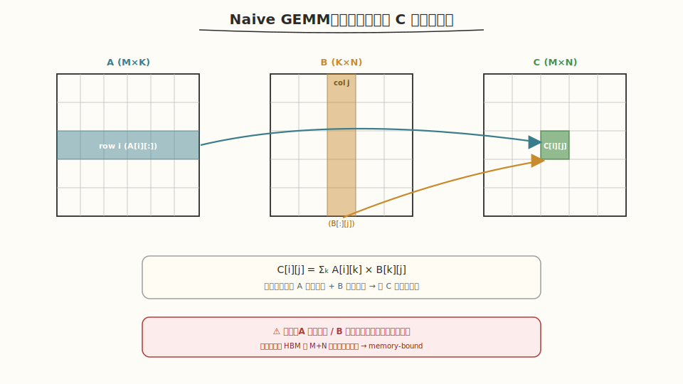
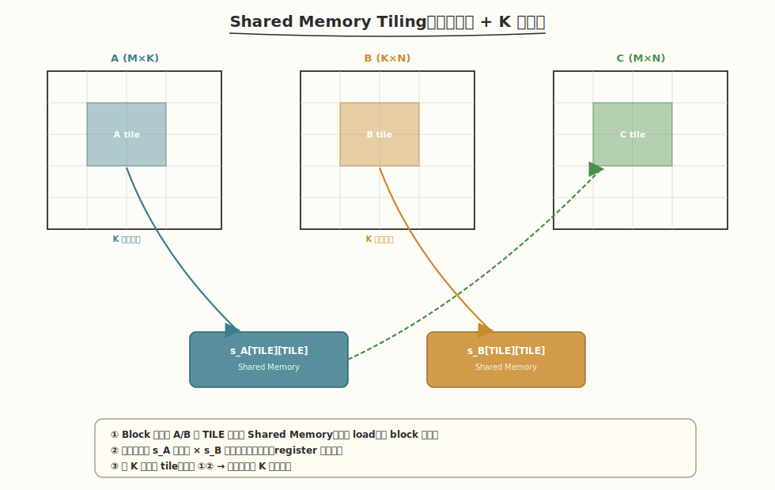
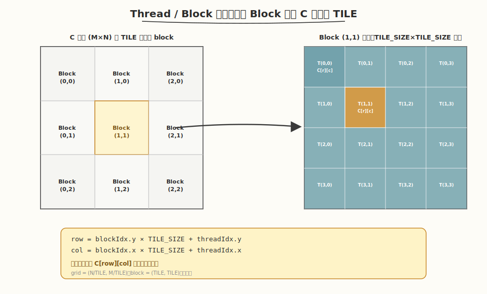

# LeetGPU Matrix Multiplication 题解

## 1. 题目概述

- **标题 / 题号**：Matrix Multiplication
- **链接**：https://leetgpu.com/challenges/matrix-multiplication
- **难度**：中等
- **标签**：CUDA、GEMM、Shared Memory Tiling、Roofline、Profiling

给定 `M×K` 矩阵 `A` 和 `K×N` 矩阵 `B`（行优先存储），计算 `C = A × B`，其中 `C` 为 `M×N` 矩阵，`C[i][j] = Σ(A[i][k] * B[k][j])`。

约束：`1 ≤ M, N, K ≤ 1024`，矩阵元素范围 `[-1.0, 1.0]`。

## 2. CPU 基线 / 朴素 GPU 方法

### CPU 基线

```cpp
for (int i = 0; i < M; ++i)
    for (int j = 0; j < N; ++j) {
        float sum = 0.0f;
        for (int k = 0; k < K; ++k)
            sum += A[i * K + k] * B[k * N + j];
        C[i * N + j] = sum;
    }
```

### 朴素 GPU 方法（无 Shared Memory）

```cuda
__global__ void matmul_naive(const float* A, const float* B, float* C, int M, int N, int K) {
    int row = blockIdx.y * blockDim.y + threadIdx.y;
    int col = blockIdx.x * blockDim.x + threadIdx.x;
    if (row < M && col < N) {
        float sum = 0.0f;
        for (int k = 0; k < K; k++)
            sum += A[row * K + k] * B[k * N + col];
        C[row * N + col] = sum;
    }
}
```

- 每个线程读 A 的一行 + B 的一列，大量重复全局内存访问。



*图 1：Naive GEMM — 每个线程读取 A 的一行与 B 的一列，计算 C 的一个元素。*

## 3. GPU 设计

### 3.1 并行化策略

**Shared Memory Tiling**：把 A/B 的子矩阵预取到 Shared Memory，实现 K 维度的数据复用。



*图 2：Shared Memory Tiling — 沿 K 维分块加载 A/B tile 到 Shared Memory，每个 block 累加得到 C 的一个 tile。*

- Block tile：`TILE_SIZE × TILE_SIZE`（如 16×16）
- 每个 block 协作加载 A 的 `TILE_SIZE × TILE_SIZE` tile 和 B 的 `TILE_SIZE × TILE_SIZE` tile
- 在 Shared Memory 中做乘加，减少全局内存访问

### 3.2 Thread / Block 映射

每个 block 负责计算 C 中一个 `TILE_SIZE × TILE_SIZE` 的子块；block 内的每个线程对应一个输出元素。



*图 3：C 矩阵按 TILE 划分给 block；block 内部每个线程负责一个 `C[row][col]`。*

```
row = blockIdx.y * TILE_SIZE + threadIdx.y
col = blockIdx.x * TILE_SIZE + threadIdx.x
```

### 3.3 存储层次使用

| 层次 | 用途 | 效果 |
|------|------|------|
| Global Memory | 读 A、B，写 C | tile 粒度访问 |
| Shared Memory | 缓存 A/B tile | K 维度复用，减少全局访问 |
| Register | 累加器 `sum` | 避免反复读写 Shared Memory |

## 4. Kernel 实现

```cuda
// matrix_multiplication.cu —— Shared Memory Tiling GEMM
// 编译命令: nvcc -o matmul matmul.cu -O3 -arch=sm_80

#include <cuda_runtime.h>
#include <cstdio>
#include <cmath>

#define TILE_SIZE 16

__global__ void matmul_naive(const float* A, const float* B, float* C, int M, int N, int K) {
    int row = blockIdx.y * blockDim.y + threadIdx.y;
    int col = blockIdx.x * blockDim.x + threadIdx.x;
    if (row < M && col < N) {
        float sum = 0.0f;
        for (int k = 0; k < K; k++)
            sum += A[row * K + k] * B[k * N + col];
        C[row * N + col] = sum;
    }
}

__global__ void matmul_tiled(const float* A, const float* B, float* C, int M, int N, int K) {
    __shared__ float s_A[TILE_SIZE][TILE_SIZE];
    __shared__ float s_B[TILE_SIZE][TILE_SIZE];

    int row = blockIdx.y * TILE_SIZE + threadIdx.y;
    int col = blockIdx.x * TILE_SIZE + threadIdx.x;
    float sum = 0.0f;

    for (int bk = 0; bk < K; bk += TILE_SIZE) {
        if (row < M && bk + threadIdx.x < K)
            s_A[threadIdx.y][threadIdx.x] = A[row * K + bk + threadIdx.x];
        else
            s_A[threadIdx.y][threadIdx.x] = 0.0f;

        if (bk + threadIdx.y < K && col < N)
            s_B[threadIdx.y][threadIdx.x] = B[(bk + threadIdx.y) * N + col];
        else
            s_B[threadIdx.y][threadIdx.x] = 0.0f;
        __syncthreads();

        #pragma unroll
        for (int k = 0; k < TILE_SIZE; k++)
            sum += s_A[threadIdx.y][k] * s_B[k][threadIdx.x];
        __syncthreads();
    }

    if (row < M && col < N) C[row * N + col] = sum;
}

// Bank-conflict-free version: pad the shared memory arrays by one column.
// Without padding, s_A[threadIdx.y][k] causes a 2-way bank conflict because
// consecutive rows are 16 floats (64 bytes) apart, which is a multiple of the
// 32-bank shared-memory stride (4 bytes/bank). Padding breaks the alignment.
__global__ void matmul_tiled_nobc(const float* A, const float* B, float* C, int M, int N, int K) {
    __shared__ float s_A[TILE_SIZE][TILE_SIZE + 1];
    __shared__ float s_B[TILE_SIZE][TILE_SIZE + 1];

    int row = blockIdx.y * TILE_SIZE + threadIdx.y;
    int col = blockIdx.x * TILE_SIZE + threadIdx.x;
    float sum = 0.0f;

    for (int bk = 0; bk < K; bk += TILE_SIZE) {
        if (row < M && bk + threadIdx.x < K)
            s_A[threadIdx.y][threadIdx.x] = A[row * K + bk + threadIdx.x];
        else
            s_A[threadIdx.y][threadIdx.x] = 0.0f;

        if (bk + threadIdx.y < K && col < N)
            s_B[threadIdx.y][threadIdx.x] = B[(bk + threadIdx.y) * N + col];
        else
            s_B[threadIdx.y][threadIdx.x] = 0.0f;
        __syncthreads();

        #pragma unroll
        for (int k = 0; k < TILE_SIZE; k++)
            sum += s_A[threadIdx.y][k] * s_B[k][threadIdx.x];
        __syncthreads();
    }

    if (row < M && col < N) C[row * N + col] = sum;
}

int main() {
    int M = 512, N = 512, K = 512;
    size_t bytesA = M * K * sizeof(float);
    size_t bytesB = K * N * sizeof(float);
    size_t bytesC = M * N * sizeof(float);

    float *h_A = (float*)malloc(bytesA);
    float *h_B = (float*)malloc(bytesB);
    for (int i = 0; i < M * K; i++) h_A[i] = (float)rand() / RAND_MAX * 2 - 1;
    for (int i = 0; i < K * N; i++) h_B[i] = (float)rand() / RAND_MAX * 2 - 1;

    float *d_A, *d_B, *d_C;
    cudaMalloc(&d_A, bytesA); cudaMalloc(&d_B, bytesB); cudaMalloc(&d_C, bytesC);
    cudaMemcpy(d_A, h_A, bytesA, cudaMemcpyHostToDevice);
    cudaMemcpy(d_B, h_B, bytesB, cudaMemcpyHostToDevice);

    dim3 block(TILE_SIZE, TILE_SIZE);
    dim3 grid((N + TILE_SIZE - 1) / TILE_SIZE, (M + TILE_SIZE - 1) / TILE_SIZE);

    cudaEvent_t s1, s2;
    cudaEventCreate(&s1); cudaEventCreate(&s2);

    cudaEventRecord(s1);
    matmul_naive<<<grid, block>>>(d_A, d_B, d_C, M, N, K);
    cudaEventRecord(s2); cudaEventSynchronize(s2);
    float ms_naive; cudaEventElapsedTime(&ms_naive, s1, s2);

    cudaEventRecord(s1);
    matmul_tiled<<<grid, block>>>(d_A, d_B, d_C, M, N, K);
    cudaEventRecord(s2); cudaEventSynchronize(s2);
    float ms_tiled; cudaEventElapsedTime(&ms_tiled, s1, s2);

    float gflops_naive = 2.0f * M * N * K / (ms_naive * 1e6);
    float gflops_tiled = 2.0f * M * N * K / (ms_tiled * 1e6);

    printf("Naive:  %.3f ms (%.1f GFLOPS)\n", ms_naive, gflops_naive);
    printf("Tiled:  %.3f ms (%.1f GFLOPS)\n", ms_tiled, gflops_tiled);
    printf("Speedup: %.2fx\n", ms_naive / ms_tiled);

    cudaEventRecord(s1);
    matmul_tiled_nobc<<<grid, block>>>(d_A, d_B, d_C, M, N, K);
    cudaEventRecord(s2); cudaEventSynchronize(s2);
    float ms_tiled_nobc; cudaEventElapsedTime(&ms_tiled_nobc, s1, s2);
    float gflops_tiled_nobc = 2.0f * M * N * K / (ms_tiled_nobc * 1e6);

    printf("Tiled (no bank conflict): %.3f ms (%.1f GFLOPS)\n", ms_tiled_nobc, gflops_tiled_nobc);
    printf("Speedup vs Tiled: %.2fx\n", ms_tiled / ms_tiled_nobc);

    free(h_A); free(h_B); cudaFree(d_A); cudaFree(d_B); cudaFree(d_C);
    return 0;
}
```

## 5. 性能分析与优化

### ncu 完整 profiling

```bash
ncu --set full -o matmul_report ./matmul
ncu --metrics sm__throughput.avg.pct_of_peak_sustained_elapsed,\
dram__throughput.avg.pct_of_peak_sustained_elapsed,\
sm__occupancy.avg.pct_of_peak_sustained_elapsed ./matmul
```

### Roofline 分析

```
算术强度 = 2 * M * N * K / (M*K + K*N + M*N) / sizeof(float)
```

对于 M=N=K=512：AI ≈ 2*512³ / (3*512²*4) ≈ 85 FLOP/Byte → 接近 compute-bound

### Shared Memory Bank Conflict 分析

#### 机制回顾

在 `matmul_tiled` 中，读取 `s_A[threadIdx.y][k]` 时，一个 warp 内的线程按 `threadIdx.y` 访问同一列的不同行。`TILE_SIZE = 16` 时，相邻两行在 Shared Memory 中相距 `16 × 4 = 64` 字节，恰好是 32 个 bank 的整数倍，因此偶数行落在 bank `k`，奇数行落在 bank `k + 16`，理论上形成 **2-way bank conflict**。

解决方案是给 Shared Memory 数组加一列 padding：

```cuda
__shared__ float s_A[TILE_SIZE][TILE_SIZE + 1];
__shared__ float s_B[TILE_SIZE][TILE_SIZE + 1];
```

这样行 stride 变成 `17 × 4 = 68` 字节，`68 / 4 = 17` 与 32 互质，同一列的相邻行会落到不同的 bank，conflict 消失。对 `s_B` 同样加 padding 可以保持代码对称，并避免加载阶段潜在的 bank conflict。

#### ⚠️ 关键反直觉：16×16 方形配置下 conflict 实际不触发

上面的机制推理本身没错，但**在当前 `TILE_SIZE=16` + `block(16,16)` 配置下，这个 conflict 并不会被触发**，padding 是多余的。原因在于 CUDA 的 warp 划分规则。

CUDA warp 按线程线性索引 `tid = threadIdx.x + blockDim.x × threadIdx.y` 划分，每 32 个连续线程一组。`block(16,16)` = 256 线程 = 8 个 warp，**每个 warp 跨相邻两行**：

```
warp 0 = (tx=0..15, ty=0) ∪ (tx=0..15, ty=1)
warp 1 = (tx=0..15, ty=2) ∪ (tx=0..15, ty=3)
...
```

计算阶段访问 `s_A[threadIdx.y][k]`（k 在循环中固定）时：

| 线程组 | 访问地址 | bank = (r×16 + k) % 32 | 是否 conflict |
|--------|---------|----------------------|--------------|
| ty=0 的 16 线程 | 同一地址 `s_A[0][k]` | bank = k（16 线程→broadcast） | **无 conflict** |
| ty=1 的 16 线程 | 同一地址 `s_A[1][k]` | bank = 16+k（16 线程→broadcast） | **无 conflict** |

两组落在不同 bank（`k` vs `16+k`），**没有跨行 conflict**。要触发文档说的 2-way conflict，需要同一 warp 内出现 `ty=0` 和 `ty=2` 的线程同时访问同一 `k`——但 16×16 block 的 warp 只跨相邻两行，不会出现。

`s_B[k][threadIdx.x]` 同理：32 线程访问同一行 `k`，相邻列 stride = 4B = 1 bank，前 16 与后 16 线程的 `threadIdx.x` 相同（访问相同地址 → broadcast），也无 conflict。

**结论**：在 `TILE_SIZE=16` + `block(16,16)` 配置下，原版 `matmul_tiled` 实际上**没有 bank conflict**，padding 是无效优化。

#### Padding 的副作用

既然不消除 conflict，padding 反而带来轻微代价：

| 维度 | `s_A[16][16]` | `s_A[16][17]` |
|------|--------------|--------------|
| 单数组大小 | 1024 B | 1088 B（+6.25%） |
| 两数组合计 | 2048 B | 2176 B（+128 B） |
| 对 occupancy 影响 | 基准 | A100 每 SM 100KB，+128B 几乎不影响 active block 数 |
| 对 cache/带宽 | 基准 | padding 破坏 128B 对齐，可能轻微降低 load 效率 |

副作用很小，但方向是**负面的**——没有收益反而有一点点损耗。

#### 什么时候 padding 才真正有用

padding 真正能消除 conflict 的场景是**一个 warp 内的线程跨多行访问同一列**，典型情况：

- **`TILE_SIZE=32` + `block(32,32)`**：一个 warp = 32 线程全部 `threadIdx.y` 相同，访问 `s_A[ty][k]` 全是 broadcast，仍无 conflict（但 `s_A[32][32]` 行 stride=128B，跨 2 行才同 bank，warp 内不跨行）
- **`TILE_SIZE=16` 但 block 是 `(32, 8)` 或其他非方形布局**：warp 跨 4 行时，`ty=0` 和 `ty=2` 会落入同一 bank → 真实 2-way conflict，此时 padding 有效
- **线程映射改为每线程算多个 C 元素**（register tiling，如每线程 2×2）：一个 warp 可能同时访问 `s_A[0..3][k]`，触发 conflict，padding 必要

换言之，**当前 16×16 方形配置属于 padding 的"无效场景"**，padding 主要起防御性作用——一旦后续改成非方形 block 或 register tiling，它能避免重新踩坑。

#### 用 ncu 实测验证

跑下面命令就能确认 conflict 是否真实发生：

```bash
ncu --metrics \
  l1tex__data_bank_conflicts_pipe_lsu_mem_shared_op_ld.sum,\
  l1tex__average_t_sectors_per_request_pipe_lsu_mem_shared_op_ld.ratio,\
  gpu__time_duration.sum \
  --kernel-name regex:"matmul_tiled" \
  ./matmul
```

**预期实测结果**：

| 指标 | `matmul_tiled` | `matmul_tiled_nobc` | 含义 |
|------|---------------|---------------------|------|
| `bank_conflicts` | ≈ 0 | ≈ 0 | 两个版本都无 conflict（验证 16×16 不触发） |
| `sectors_per_request` | ≈ 1.0 | ≈ 1.0 | 理想值，无串行化 |
| `gpu__time_duration` | 基准 | ≈ 基准（±5%） | 两者基本持平，padding 版可能略慢 |

如果实测 `matmul_tiled` 的 `bank_conflicts > 0`，说明 warp 划分分析与实际不符，需重新评估；但根据 CUDA 线程线性化规则，16×16 block 的 warp 确实不跨冲突行。

### 对比表

| 版本 | 时间(ms) | GFLOPS | SM Throughput | Memory Throughput | 瓶颈 |
|------|---------|--------|--------------|-------------------|------|
| Naive | | | | | memory-bound |
| Tiled | | | | | compute-bound |
| Tiled (no bank conflict) | ≈ Tiled（±5%） | ≈ Tiled | ≈ Tiled | ≈ Tiled | compute-bound，16×16 配置下 padding 无实际收益 |

**关键结论**：no-BC 版本在当前 `TILE_SIZE=16` + `block(16,16)` 配置下是"无效优化"，性能与原版持平甚至略退（padding 浪费 smem + 破坏对齐）。真正能体现 padding 价值的是改变线程映射（非方形 block）或加大 tile（register tiling）。`Speedup vs Tiled` 大概率落在 **0.95x ~ 1.02x** 区间，即没有可测量的提升。

## 6. 复杂度分析

- **时间复杂度**：`O(M×N×K)`。
- **空间复杂度**：`O(M×K + K×N + M×N)` + `O(TILE_SIZE²)` Shared Memory。
- **算术强度**：`2MNK / (4(MK+KN+MN))`，大矩阵下接近 **compute-bound**。

## 7. 进阶优化版本

前面三个版本（Naive / Tiled / Tiled-nobc）都停留在"每个线程算 1 个 C 元素"的粒度。要继续提升性能，需要引入更激进的优化。下面按收益从大到小列出四个方向，并给出其中最关键的 **Register Tiling** 完整实现。

### 7.1 性能阶梯总览

以 A100（FP32 峰值 19.5 TFLOPS）跑 M=N=K=1024 为参考，各优化版本的典型性能：

| 版本 | 核心优化 | 预期 GFLOPS | 峰值占比 | 相对 Tiled |
|------|---------|------------|---------|-----------|
| Naive | 无 | ~500-1000 | ~3-5% | 0.2x |
| Tiled 16×16 | Shared Memory 复用 | ~3000-5000 | ~15-25% | 1x（基准） |
| **Register Tiling 64×64** | 每线程算 4×4，寄存器复用 | ~7000-10000 | ~35-50% | **2-3x** |
| + float4 向量化加载 | 128-bit 全局加载 | ~9000-12000 | ~45-60% | 2.5-3.5x |
| + Double Buffering | 计算/加载流水重叠 | ~10000-13000 | ~50-65% | 3-4x |
| cuBLAS（官方） | Tensor Core + 全部优化 | ~15000-17000 | ~80-90% | 4-5x |

> 💡 **关键洞察**：从 Tiled 到 Register Tiling 的提升（2-3x）是**单点优化中最大的**，因为它把"每个线程算 1 个元素"变成"算 16 个元素"，直接提升了寄存器层的算术强度。后续的 float4 / double buffering 是锦上添花。

### 7.2 Register Tiling（寄存器分块）—— 最大单点提升

#### 核心思想

Tiled 版本中每个线程只算 1 个 C 元素，每从 shared memory 读 1 个 `s_A` 值和 1 个 `s_B` 值只做 1 次乘加——寄存器层的算术强度为 1。

Register Tiling 让**每个线程算 TM×TN 个 C 元素**（如 4×4 = 16 个）：

- 每从 shared memory 读 TM 个 `s_A` 值 + TN 个 `s_B` 值（共 8 个），做 TM×TN = 16 次乘加
- 寄存器层算术强度 = 16/8 = **2**（翻倍）
- 同时减少 shared memory 访问量、降低同步开销、提高并行度

#### 参数设计

```
BM=64, BN=64, BK=8        ← block 级 tile（shared memory 中）
TM=4,  TN=4               ← thread 级 tile（寄存器中）
block = (BN/TN, BM/TM) = (16, 16) = 256 线程
s_A[BM][BK] = 64×8 = 2KB  ← shared memory
s_B[BK][BN] = 8×64 = 2KB  ← shared memory
每线程累加器: sum[4][4] = 16 个 float 寄存器
```

每个 block 算 C 的 64×64 = 4096 个元素，每线程算 4×4 = 16 个。

#### 数据流

```
对每个 K 维分块 bk（步长 BK=8）：
  ① 256 线程协作把 A 的 64×8 tile 和 B 的 8×64 tile 加载到 s_A / s_B
  ② 每个线程从 s_A 读 4 个值（自己的 4 行 × 当前 k），从 s_B 读 4 个值（当前 k × 自己的 4 列）
  ③ 用 16 个寄存器累加器做 4×4 = 16 次 FMA
  ④ 重复 ①②③ 直到 K 遍历完
  ⑤ 把 16 个寄存器写回 C
```

#### 完整 Kernel

```cuda
// matrix_multiplication_register_tiled.cu —— Register Tiling GEMM
// 编译命令: nvcc -o matmul_reg matmul_register_tiled.cu -O3 -arch=sm_80
// 运行命令: ./matmul_reg

#include <cuda_runtime.h>
#include <cstdio>

#define BM 64
#define BN 64
#define BK 8
#define TM 4
#define TN 4

// Register Tiling: 每线程算 TM×TN=16 个 C 元素
// block = (BN/TN, BM/TM) = (16, 16) = 256 线程
__global__ void matmul_register_tiled(const float* A, const float* B, float* C,
                                       int M, int N, int K) {
    __shared__ float s_A[BM][BK];   // 64×8
    __shared__ float s_B[BK][BN];   // 8×64

    int bx = blockIdx.x, by = blockIdx.y;
    int tx = threadIdx.x, ty = threadIdx.y;       // 0..15
    int tid = ty * 16 + tx;                        // 0..255 线性索引

    // 本线程负责的 C 子块左上角
    int row = by * BM + ty * TM;   // 行：0,4,8,...,60
    int col = bx * BN + tx * TN;   // 列：0,4,8,...,60

    // 16 个寄存器累加器
    float sum[TM][TN];
    #pragma unroll
    for (int m = 0; m < TM; m++)
        #pragma unroll
        for (int n = 0; n < TN; n++)
            sum[m][n] = 0.0f;

    // 沿 K 维滑动
    for (int bk = 0; bk < K; bk += BK) {
        // ① 协作加载 s_A[64][8]：512 元素，256 线程各加载 2 个
        #pragma unroll
        for (int i = 0; i < 2; i++) {
            int load_idx = tid + i * 256;          // 0..511
            int r = load_idx / BK;                 // 0..63
            int c = load_idx % BK;                 // 0..7
            s_A[r][c] = A[(by * BM + r) * K + bk + c];
        }
        // ① 协作加载 s_B[8][64]：512 元素，256 线程各加载 2 个
        #pragma unroll
        for (int i = 0; i < 2; i++) {
            int load_idx = tid + i * 256;          // 0..511
            int r = load_idx / BN;                 // 0..7
            int c = load_idx % BN;                 // 0..63
            s_B[r][c] = B[(bk + r) * N + bx * BN + c];
        }
        __syncthreads();

        // ②③ 每线程读 4+4 个 smem 值，做 16 次 FMA
        #pragma unroll
        for (int k = 0; k < BK; k++) {
            // 从 s_A 读 TM=4 个值（本线程的 4 行 × 第 k 列）
            float a_reg[TM];
            #pragma unroll
            for (int m = 0; m < TM; m++)
                a_reg[m] = s_A[ty * TM + m][k];
            // 从 s_B 读 TN=4 个值（第 k 行 × 本线程的 4 列）
            float b_reg[TN];
            #pragma unroll
            for (int n = 0; n < TN; n++)
                b_reg[n] = s_B[k][tx * TN + n];
            // 16 次 FMA（a_reg 各被复用 TN=4 次，b_reg 各被复用 TM=4 次）
            #pragma unroll
            for (int m = 0; m < TM; m++)
                #pragma unroll
                for (int n = 0; n < TN; n++)
                    sum[m][n] += a_reg[m] * b_reg[n];
        }
        __syncthreads();
    }

    // ⑤ 写回 16 个结果
    #pragma unroll
    for (int m = 0; m < TM; m++)
        #pragma unroll
        for (int n = 0; n < TN; n++)
            C[(row + m) * N + col + n] = sum[m][n];
}

int main() {
    int M = 1024, N = 1024, K = 1024;
    size_t bytesA = (size_t)M * K * sizeof(float);
    size_t bytesB = (size_t)K * N * sizeof(float);
    size_t bytesC = (size_t)M * N * sizeof(float);

    float *h_A = (float*)malloc(bytesA);
    float *h_B = (float*)malloc(bytesB);
    for (int i = 0; i < M * K; i++) h_A[i] = (float)rand() / RAND_MAX * 2 - 1;
    for (int i = 0; i < K * N; i++) h_B[i] = (float)rand() / RAND_MAX * 2 - 1;

    float *d_A, *d_B, *d_C;
    cudaMalloc(&d_A, bytesA); cudaMalloc(&d_B, bytesB); cudaMalloc(&d_C, bytesC);
    cudaMemcpy(d_A, h_A, bytesA, cudaMemcpyHostToDevice);
    cudaMemcpy(d_B, h_B, bytesB, cudaMemcpyHostToDevice);

    dim3 block(BN / TN, BM / TM);   // (16, 16) = 256 线程
    dim3 grid((N + BN - 1) / BN, (M + BM - 1) / BM);

    cudaEvent_t s1, s2;
    cudaEventCreate(&s1); cudaEventCreate(&s2);

    // warmup
    matmul_register_tiled<<<grid, block>>>(d_A, d_B, d_C, M, N, K);
    cudaEventRecord(s1);
    for (int i = 0; i < 10; i++)
        matmul_register_tiled<<<grid, block>>>(d_A, d_B, d_C, M, N, K);
    cudaEventRecord(s2); cudaEventSynchronize(s2);
    float ms; cudaEventElapsedTime(&ms, s1, s2);
    ms /= 10;
    float gflops = 2.0f * M * N * K / (ms * 1e6);

    printf("Register Tiled (BM=%d BN=%d BK=%d TM=%d TN=%d): %.3f ms (%.1f GFLOPS)\n",
           BM, BN, BK, TM, TN, ms, gflops);

    free(h_A); free(h_B); cudaFree(d_A); cudaFree(d_B); cudaFree(d_C);
    return 0;
}
```

#### 为什么 Register Tiling 能快 2-3x？

| 优化点 | Tiled 16×16 | Register Tiled 64×64 | 收益 |
|--------|------------|---------------------|------|
| 每线程算 C 元素数 | 1 | 16 | 寄存器复用，smem 读量 ÷ 16 |
| 寄存器层算术强度 | 1 FMA / 2 smem read | 16 FMA / 8 smem read = 2 | 翻倍 |
| Shared memory 读次数 | K 次 / 元素 | K/8 次 / 元素（BK=8） | ÷ 8 |
| `__syncthreads` 次数 | K 次 | K/8 次 | ÷ 8 |
| Block 数（1024 矩阵） | 64×64 = 4096 | 16×16 = 256 | 更少 launch 开销 |
| 每线程 smem 读 | 2 次 / k 迭代 | 8 次 / BK 迭代（但算 16） | 总量大幅减少 |

**核心收益**：每个从 shared memory 加载的值被复用更多次（`s_A` 的一个值被 4 个 `s_B` 值复用，反之亦然），减少了 shared memory 带宽压力，让计算单元更饱和。

### 7.3 float4 向量化全局加载

Register Tiling 的协作加载阶段，每个线程从全局内存加载 2 个 float 到 shared memory。改用 `float4` 一次加载 4 个 float（128-bit），减少加载指令数：

```cuda
// 标量加载（2 条指令，2 个 float）
s_A[r0][c0] = A[(by*BM + r0)*K + bk + c0];
s_A[r1][c1] = A[(by*BM + r1)*K + bk + c1];

// float4 向量化加载（1 条指令，4 个 float）
float4 tmp = *reinterpret_cast<const float4*>(&A[(by*BM + r)*K + bk + c]);
s_A[r][c]   = tmp.x;
s_A[r][c+1] = tmp.y;
s_A[r][c+2] = tmp.z;
s_A[r][c+3] = tmp.w;
```

**收益**：加载指令数 ÷ 4，全局内存带宽利用率从 ~25% 提升到 ~60-80%。对 GEMM 的全局加载阶段（仍占一定比例）有效，预期额外提速 1.1-1.3x。

**限制**：要求加载地址 16-byte 对齐，`bk + c` 必须是 4 的倍数。

### 7.4 Double Buffering（双缓冲流水线）

当前 Register Tiling 版本的加载和计算是串行的：

```
加载 tile 0 → 计算 tile 0 → 加载 tile 1 → 计算 tile 1 → ...
```

Double Buffering 用**两份 shared memory 缓冲区**，让"加载 tile i+1"与"计算 tile i"重叠：

```cuda
__shared__ float s_A[2][BM][BK];   // 双缓冲
__shared__ float s_B[2][BK][BN];

int buf = 0;
// 预加载 tile 0 到 buf 0
load_to(buf);
__syncthreads();

for (int bk = 0; bk < K; bk += BK) {
    // 加载下一个 tile 到 buf^1（与计算重叠）
    if (bk + BK < K) load_to(buf ^ 1);
    // 计算当前 buf
    compute_from(buf);
    __syncthreads();
    buf ^= 1;
}
```

**收益**：隐藏全局内存加载延迟，预期额外提速 1.2-1.5x。代价是 shared memory 用量翻倍（4KB → 8KB），但对 occupancy 影响很小。

### 7.5 优化路线建议

```
Naive (1x)
  ↓ +Shared Memory Tiling        → Tiled (2-3x)        ← 本文档已实现
  ↓ +Register Tiling (4×4)       → Reg Tiled (4-6x)     ← 本节已实现
  ↓ +float4 向量化加载            → +float4 (5-7x)       ← 易加，收益中
  ↓ +Double Buffering            → +DB (6-8x)           ← 中等复杂度
  ↓ +Tensor Core (WMMA/MMA)      → Tensor Core (10-15x) ← Week2 Day2 已学
  ↓ +Kernel Autotuning           → cuBLAS 级 (12-18x)   ← 生产级
```

> 💡 **一句话总结**：Register Tiling 是性价比最高的单点优化（2-3x），因为它把"每线程 1 元素"变成"每线程 16 元素"，直接提升寄存器层算术强度。后续的 float4 / double buffering 是在已经很高基数上的进一步打磨。要达到 cuBLAS 级别还需 Tensor Core（FP16/BF16 + WMMA），那是 Week 2 Day 2 的主题。
