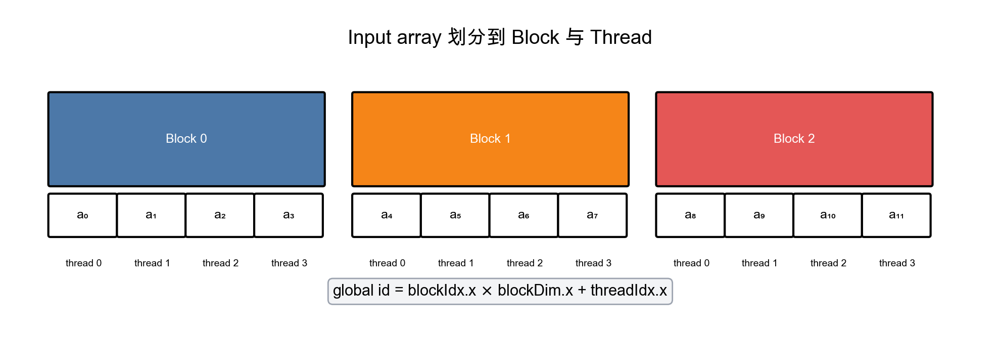
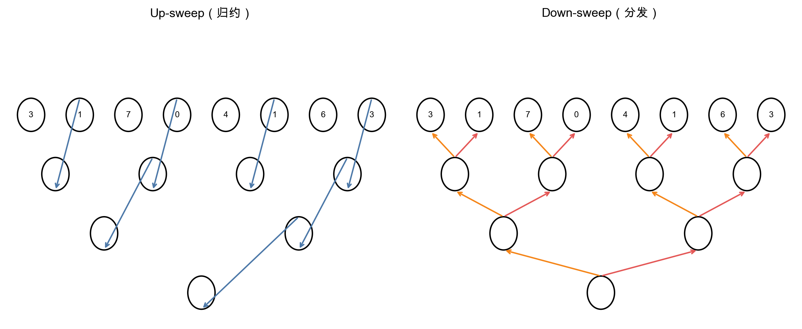

# LeetGPU Prefix Sum 题解

## 1. 题目概述

- **标题 / 题号**：Prefix Sum
- **链接**：https://leetgpu.com/challenges/prefix-sum
- **难度**：中等
- **标签**：CUDA、Scan、Prefix Sum、并行算法

给定一个长度为 `N` 的 32-bit 浮点数组 `input`，要求计算其**前缀和（inclusive prefix sum）**：

```
output[i] = input[0] + input[1] + ... + input[i]
```

约束：`1 ≤ N ≤ 100,000,000`，数值范围 `[-1000.0, 1000.0]`，输出不会溢出 float。

## 2. CPU 基线 / 朴素 GPU 方法

### CPU 基线

```cpp
for (int i = 1; i < n; ++i) {
    output[i] = output[i - 1] + input[i];
}
```

- 时间复杂度 `O(N)`，空间复杂度 `O(1)`（除输出外）。
- 瓶颈：单线程顺序执行，无法利用 GPU 并行性。

### 朴素 GPU 方法

每个线程 `i` 独立计算 `sum(input[0..i])`：

```cuda
__global__ void naive_prefix_sum(const float* input, float* output, int n) {
    int i = blockIdx.x * blockDim.x + threadIdx.x;
    if (i >= n) return;
    float sum = 0.0f;
    for (int j = 0; j <= i; ++j) sum += input[j];
    output[i] = sum;
}
```

- 时间复杂度 `O(N^2)`，大量重复计算，全局内存访问极度不合并，性能极差。

## 3. GPU 设计

### 3.1 并行化策略

Prefix sum 是一个经典的 **scan（扫描）** 问题。采用 **分块两阶段 scan**：

1. **Block 内 exclusive scan**：每个 block 独立计算其负责区间内元素的 exclusive prefix sum，并输出该 block 的总和。
2. **Block 间 scan**：对所有 block 总和再做一次 scan，得到每个 block 的**全局偏移量**。
3. **Add block offset**：把全局偏移量加回到 block 内的每个元素，得到最终的 inclusive prefix sum。

**线程/block 映射**：使用 1D grid，每个 block 处理 `BLOCK_SIZE` 个连续元素。`blockIdx.x * BLOCK_SIZE` 为 block 起始偏移。

**数据映射示意**：



*图注：数组被连续划分为多个 block，每个 block 内由 thread 0 到 BLOCK_SIZE-1 并行处理；global id = blockIdx.x × blockDim.x + threadIdx.x。*

### 3.2 存储层次使用

- **全局内存**：
  - 读 `input`：按线程 ID 连续读取，**合并访问**。
  - 写 `output`：按线程 ID 连续写入，**合并访问**。
- **共享内存**：每个 block 将数据加载到共享内存后，在共享内存内完成 Blelloch scan，避免频繁的全局内存访问。
- **寄存器**：每个线程维护少量临时变量（`tid`、`gid`、`t` 等），不会溢出。

## 4. Kernel 实现

完整实现包含三个 kernel：

- `block_exclusive_scan`：block 内 exclusive scan，输出 block 总和。
- `add_block_offsets`：将 block 偏移加回。
- `make_inclusive`：将 exclusive scan 转换为 inclusive prefix sum。

```cuda
#include <cuda_runtime.h>

#define BLOCK_SIZE 1024

__global__ void block_exclusive_scan(const float* input, float* output,
                                     float* block_sums, int n) {
    __shared__ float temp[BLOCK_SIZE];

    int tid = threadIdx.x;
    int gid = blockIdx.x * blockDim.x + tid;

    // 1. 加载到共享内存，越界补 0
    temp[tid] = (gid < n) ? input[gid] : 0.0f;
    __syncthreads();

    // 2. Up-sweep（归约阶段）
    for (int d = 1; d < blockDim.x; d *= 2) {
        int idx = (tid + 1) * d * 2 - 1;
        if (idx < blockDim.x) {
            temp[idx] += temp[idx - d];
        }
        __syncthreads();
    }

    // 3. 将最后一个元素清零，并记录 block 总和
    if (tid == blockDim.x - 1) {
        if (block_sums != nullptr) {
            block_sums[blockIdx.x] = temp[tid];
        }
        temp[tid] = 0.0f;
    }
    __syncthreads();

    // 4. Down-sweep（分发阶段）
    for (int d = blockDim.x / 2; d > 0; d /= 2) {
        int idx = (tid + 1) * d * 2 - 1;
        if (idx < blockDim.x) {
            float t = temp[idx - d];
            temp[idx - d] = temp[idx];
            temp[idx] += t;
        }
        __syncthreads();
    }

    // 5. 写回全局内存
    if (gid < n) {
        output[gid] = temp[tid];
    }
}

__global__ void add_block_offsets(float* output, const float* block_offsets, int n) {
    int gid = blockIdx.x * blockDim.x + threadIdx.x;
    if (gid >= n) return;
    if (blockIdx.x > 0) {
        output[gid] += block_offsets[blockIdx.x - 1];
    }
}

__global__ void make_inclusive(const float* input, float* output, int n) {
    int gid = blockIdx.x * blockDim.x + threadIdx.x;
    if (gid >= n) return;
    output[gid] += input[gid];
}

// 递归 scan block 总和
void scan_recursive(float* d_in, float* d_out, int n) {
    if (n <= 0) return;
    int num_blocks = (n + BLOCK_SIZE - 1) / BLOCK_SIZE;

    float* d_block_sums = nullptr;
    if (num_blocks > 1) {
        cudaMalloc(&d_block_sums, num_blocks * sizeof(float));
    }

    block_exclusive_scan<<<num_blocks, BLOCK_SIZE>>>(d_in, d_out, d_block_sums, n);

    if (num_blocks > 1) {
        float* d_block_offsets = nullptr;
        cudaMalloc(&d_block_offsets, num_blocks * sizeof(float));
        scan_recursive(d_block_sums, d_block_offsets, num_blocks);
        add_block_offsets<<<num_blocks, BLOCK_SIZE>>>(d_out, d_block_offsets, n);
        cudaFree(d_block_offsets);
    }

    if (d_block_sums) cudaFree(d_block_sums);
}

// solve 函数（LeetGPU 会调用此函数，签名需保持不变）
void solve(float* input, float* output, int N) {
    float *d_in, *d_out;
    cudaMalloc(&d_in, N * sizeof(float));
    cudaMalloc(&d_out, N * sizeof(float));
    cudaMemcpy(d_in, input, N * sizeof(float), cudaMemcpyHostToDevice);

    // 1. 做 exclusive scan，结果存入 d_out
    scan_recursive(d_in, d_out, N);

    // 2. 加上原数组，得到 inclusive prefix sum
    int num_blocks = (N + BLOCK_SIZE - 1) / BLOCK_SIZE;
    make_inclusive<<<num_blocks, BLOCK_SIZE>>>(d_in, d_out, N);

    cudaMemcpy(output, d_out, N * sizeof(float), cudaMemcpyDeviceToHost);
    cudaFree(d_in);
    cudaFree(d_out);
}
```

### 关键代码解释

- **`temp` 共享内存数组**：block 内所有线程共同操作，完成 Blelloch scan。
- **Up-sweep / Down-sweep**：Blelloch scan 的标准两阶段，work-efficient，`O(N)` work，`O(log N)` span。



*图注：Up-sweep 阶段自底向上归约，计算子树和；Down-sweep 阶段自顶向下分发前缀和。根节点在 Up-sweep 结束后被清零，再向下传播。*
- **`block_sums` 与递归 scan**：解决跨 block 前缀和依赖。递归深度约为 `log_{BLOCK_SIZE}(N)`，对于 `N = 10^8` 仅约 3 层。
- **`make_inclusive`**：因为 Blelloch scan 是 exclusive，最后需要把 `input[i]` 加回，得到题目要求的 inclusive prefix sum。

## 5. 优化步骤

| 版本 | 改动 | 预期性能 |
|------|------|----------|
| v0 朴素 GPU | 每个线程顺序求和 | 极慢，`O(N^2)` |
| v1 Blelloch block scan | 共享内存 + 两阶段 scan | 大幅加速，但递归分配内存有开销 |
| v2 迭代式 block sum scan | 用迭代替代递归，减少 `cudaMalloc` | 进一步降低 launch overhead |
| v3 warp shuffle 优化 | block 内用 `__shfl_up_sync` 替代共享内存 | 减少同步开销，适合小 block |
| v4 向量化加载 | 使用 `float4` 读取全局内存 | 提升全局内存带宽利用率 |

对于 LeetGPU 的通过性要求，**v1 版本已足够正确且高效**。后续版本属于锦上添花，可根据实际性能瓶颈选择是否实现。

## 6. 性能分析

- **计算强度**：每个元素约 1 次加法，读取 1 个 float、写入 1 个 float。算术强度 ≈ `1 FLOP / 8 bytes` = 0.125 FLOP/byte，**内存受限（memory-bound）**。
- **Roofline 定位**：完全位于 memory-bound 区域，优化重点应放在全局内存带宽利用率上。
- **带宽利用率**：合并读写 + 共享内存复用，理想情况下可接近设备峰值带宽。
- **Occupancy**：每个 block 1024 线程，共享内存占用 `1024 * 4 = 4 KB`，寄存器使用少，occupancy 较高。

## 7. 复杂度分析

- **时间复杂度**：
  - Work：`O(N)`（每个元素被常数次操作）
  - Span/Depth：`O(log N)`（由 Blelloch scan 的 tree 深度决定）
- **空间复杂度**：
  - 输出数组 `O(N)`
  - 临时 block 总和数组 `O(N / BLOCK_SIZE)`
- **通信量**：
  - Host → Device：`N * sizeof(float)`
  - Device → Host：`N * sizeof(float)`

## 8. 调试与验证

### 正确性验证

与 CPU 顺序前缀和对比：

```cpp
std::vector<float> cpu_ref(n);
cpu_ref[0] = input[0];
for (int i = 1; i < n; ++i) {
    cpu_ref[i] = cpu_ref[i - 1] + input[i];
}
// 比较 cpu_ref 与 GPU output
```

### 常用工具

- **`cuda-memcheck`** / `compute-sanitizer`：检查越界、未初始化共享内存。
- **Nsight Compute**：查看内存带宽、occupancy、warp divergence。
- **Nsight Systems**：分析 kernel launch 和同步开销。

### 常见陷阱

- **未处理越界**：`gid >= n` 时必须正确补 0，否则 block 总和会出错。
- **共享内存未同步**：每次修改共享内存后都要 `__syncthreads()`。
- **exclusive vs. inclusive 混淆**：题目要求 inclusive，最后必须加回 `input[i]`。
- **递归深度过大**：对于 `N = 10^8`，递归深度很小；但若 `BLOCK_SIZE` 过小会急剧增加深度。

## 9. 延伸阅读

- NVIDIA CUDA Samples：`scan` 示例
- Blelloch, Guy E. "Prefix sums and their applications." (1990)
- CUDA C Programming Guide：Shared Memory、Synchronization Functions
- LeetGPU 其他 scan 相关题目（如 Segmented Scan、Sparse Matrix Vector Multiplication）
