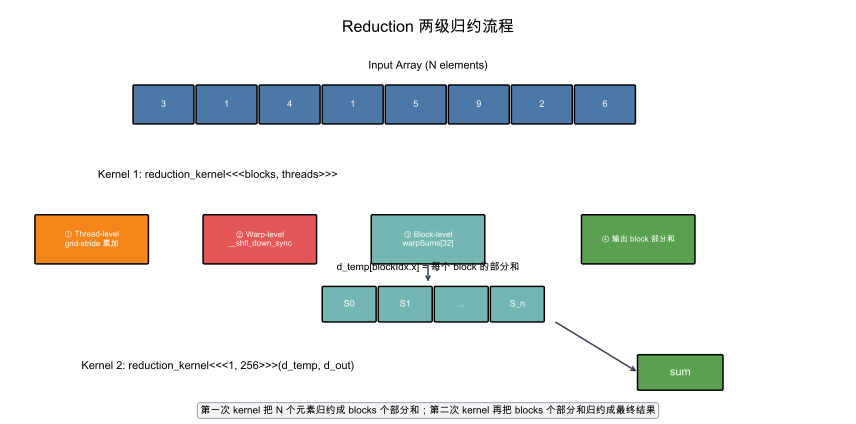
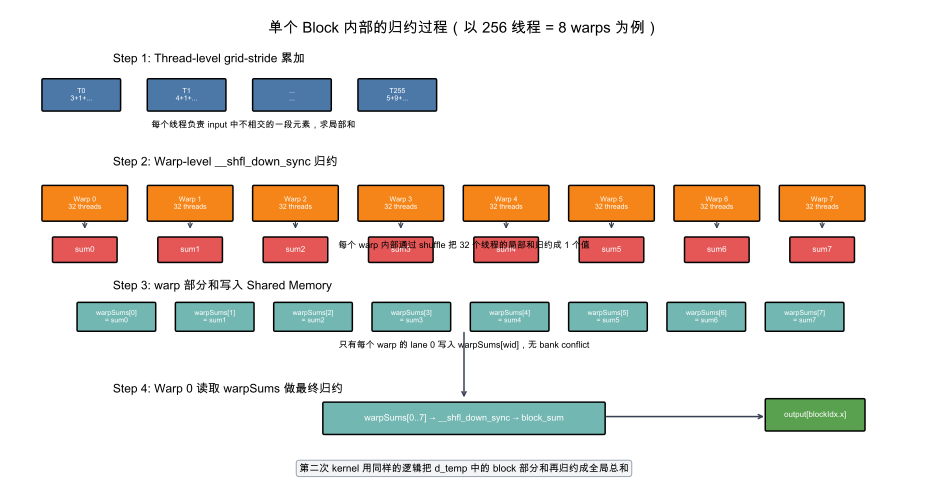

# LeetGPU Reduction 题解

## 1. 题目概述

- **标题 / 题号**：Reduction
- **链接**：https://leetgpu.com/challenges/reduction
- **难度**：中等
- **标签**：CUDA、Parallel Reduction、Shared Memory、Warp Shuffle、Bank Conflict

给定长度为 `N` 的浮点数组 `input`，计算所有元素的总和：`sum = input[0] + input[1] + ... + input[N-1]`。

约束：`1 ≤ N ≤ 100,000,000`，数组元素范围 `[-1000.0, 1000.0]`，结果不会溢出 float。

## 2. CPU 基线 / 朴素 GPU 方法

### CPU 基线

```cpp
float sum = 0.0f;
for (int i = 0; i < n; ++i) sum += input[i];
```

### 朴素 GPU 方法（O(N²)）

每个线程独立计算前缀和——极度浪费。

## 3. GPU 设计

### 3.1 并行化策略

两阶段归约（与 Week 2 Day 1 的 Warp Reduce 一致）：

1. **线程级**：grid-stride loop 做线程级累加
2. **Warp 级**：`__shfl_down_sync` butterfly 归约
3. **Block 级**：warp 部分和写入 Shared Memory，Warp 0 做最终归约
4. **跨 Block**：第二次 kernel launch 汇总



**流程说明**：

- **第一次 kernel**：启动足够多的 block 覆盖输入数组。每个 block 内部先让每个线程通过 grid-stride loop 累加自己负责的一段 input，得到线程局部和；接着在 warp 内用 `__shfl_down_sync` 把 32 个线程的局部和归约成 1 个 warp 和；每个 warp 的 lane 0 把 warp 和写入 `warpSums[wid]`；最后由 warp 0 读取所有 `warpSums` 再做一次 shuffle 归约，得到该 block 的部分和，写入 `d_temp[blockIdx.x]`。
- **第二次 kernel**：只启动 1 个 block，把 `d_temp` 里的 block 部分和再用同样的逻辑归约成全局总和，写入 `d_out`。

### 3.2 单个 Block 内部执行过程



上图以 256 线程（8 warps）为例展示了单个 block 的 4 个执行步骤：

1. **Thread-level 累加**：256 个线程各自负责 input 中不相交的一段元素，使用 grid-stride loop 求出线程局部和。
2. **Warp-level 归约**：每个 warp 内部 32 个线程通过 `__shfl_down_sync` 进行 butterfly 归约，最终每个 warp 得到 1 个和（`sum0 ~ sum7`）。
3. **写入 Shared Memory**：每个 warp 的 lane 0 把自己 warp 的和写入 `warpSums[wid]`。由于不同 warp 的 lane 0 写入不同索引 `wid`，对应不同的 bank，因此**无 bank conflict**。
4. **Block-level 最终归约**：warp 0 的 32 个线程读取 `warpSums[0..7]`（不足 32 的 lane 补 0），再做一次 warp shuffle 归约，lane 0 得到 block 部分和并写入 `output[blockIdx.x]`。

### 3.3 Bank Conflict 分析

关键观察：Warp Shuffle 归约**不经过 Shared Memory**，因此 warp 级归约**无 bank conflict**。

Bank conflict 发生在 **Step 3**：warp 的 lane 0 写入 `warpSums[wid]`。由于不同 warp 的 lane 0 写入不同 bank（wid 0~31 对应 bank 0~31），这里是**无 conflict** 的。

但如果用 Shared Memory 做归约（而非 Shuffle），conflict 会很严重。

## 4. Kernel 实现

```cuda
// reduction.cu —— 并行归约（Warp Shuffle + 两级归约）
// 编译命令: nvcc -o reduction reduction.cu -O3 -arch=sm_80

#include <cuda_runtime.h>
#include <cstdio>
#include <cmath>

__inline__ __device__ float warpReduceSum(float val) {
    #pragma unroll
    for (int offset = 16; offset > 0; offset >>= 1)
        val += __shfl_down_sync(0xFFFFFFFF, val, offset);
    return val;
}

__global__ void reduction_kernel(const float* input, float* output, int N) {
    __shared__ float warpSums[32];

    int tid = blockIdx.x * blockDim.x + threadIdx.x;
    int lane = threadIdx.x & 31;
    int wid  = threadIdx.x >> 5;

    float sum = 0.0f;
    for (int i = tid; i < N; i += gridDim.x * blockDim.x)
        sum += input[i];

    sum = warpReduceSum(sum);

    if (lane == 0) warpSums[wid] = sum;
    __syncthreads();

    if (wid == 0) {
        int numWarps = (blockDim.x + 31) / 32;
        sum = (lane < numWarps) ? warpSums[lane] : 0.0f;
        sum = warpReduceSum(sum);
        if (lane == 0) output[blockIdx.x] = sum;
    }
}

int main() {
    const int N = 1 << 22;
    float *h_in = (float*)malloc(N * sizeof(float));
    for (int i = 0; i < N; i++) h_in[i] = (float)(rand() % 1000) * 0.001f;

    float *d_in, *d_temp, *d_out;
    cudaMalloc(&d_in, N * sizeof(float));
    cudaMalloc(&d_temp, 1024 * sizeof(float));
    cudaMalloc(&d_out, sizeof(float));
    cudaMemcpy(d_in, h_in, N * sizeof(float), cudaMemcpyHostToDevice);

    int threads = 256;
    int blocks = min((N + threads - 1) / threads, 1024);

    cudaEvent_t start, stop;
    cudaEventCreate(&start); cudaEventCreate(&stop);
    cudaEventRecord(start);

    reduction_kernel<<<blocks, threads>>>(d_in, d_temp, N);
    reduction_kernel<<<1, 256>>>(d_temp, d_out, blocks);

    cudaEventRecord(stop); cudaEventSynchronize(stop);
    float ms; cudaEventElapsedTime(&ms, start, stop);

    float gpu_sum;
    cudaMemcpy(&gpu_sum, d_out, sizeof(float), cudaMemcpyDeviceToHost);

    double cpu_sum = 0.0;
    for (int i = 0; i < N; i++) cpu_sum += h_in[i];

    printf("GPU=%.4f CPU=%.4f diff=%.6f %s\n",
           gpu_sum, (float)cpu_sum, fabs(gpu_sum - (float)cpu_sum),
           fabs(gpu_sum - (float)cpu_sum) < 1e-3 ? "PASS" : "FAIL");
    printf("Time: %.3f ms (%.1f GB/s)\n", ms, N * sizeof(float) / (ms * 1e6));

    free(h_in); cudaFree(d_in); cudaFree(d_temp); cudaFree(d_out);
    return 0;
}
```

## 5. 性能分析与优化

### ncu 观察 bank conflict

```bash
ncu --metrics l1tex__data_bank_conflicts_pipe_lsu_mem_shared_op_ld.sum,\
l1tex__data_bank_conflicts_pipe_lsu_mem_shared_op_st.sum,\
sm__occupancy.avg.pct_of_peak_sustained_elapsed ./reduction
```

### 优化方向

1. **用 Warp Shuffle 替代 Shared Memory 归约**（已实现）：消除 bank conflict
2. **grid-stride loop**：处理 N >> total_threads 的情况
3. **第二次 kernel 汇总**：避免 atomicAdd 的竞争

## 6. 复杂度分析

- **时间复杂度**：`O(N)`，每个元素被访问一次。
- **空间复杂度**：`O(N)` 输入 + `O(blocks)` 临时。
- **算术强度**：1 FLOP / 4 Bytes = 0.25 FLOP/Byte，**memory-bound**。
