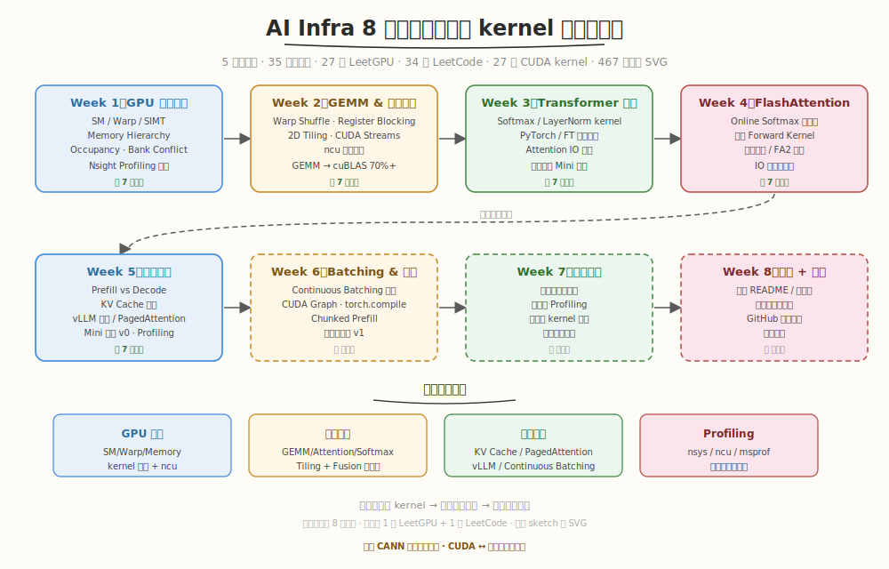

# AI Infra 学习笔记

> 从「会写 kernel」进阶到「能做系统优化」—— 8 周 AI Infra 工程实战学习仓库，涵盖 GPU 执行模型、算子优化、推理系统与 Profiling 实践。



## 项目简介

本仓库记录 AI Infra（推理系统 / 分布式 / 内核优化）方向的系统化学习过程，核心是一条 8 周冲刺路线：**会写 kernel → 能做系统优化 → 能测能调能讲**。已完成 Week 1-5（35 个教学日），Week 6-8 按计划推进中。

| 周 | 主题 | 关键产出 | 状态 |
|----|------|---------|------|
| Week 1 | GPU 执行本质 + Profiling | SM/Warp/Memory 直觉、7 个 kernel、Nsight 实战 | ✅ 完成 |
| Week 2 | GEMM & 算子优化 | Naive→Tiled→Register Blocking GEMM、cuBLAS 70%+ | ✅ 完成 |
| Week 3 | Transformer 执行本质 | Softmax/LayerNorm kernel、Attention IO 分析、Mini 引擎 | ✅ 完成 |
| Week 4 | FlashAttention 深挖 | Online Softmax 推导、手写 Forward Kernel、IO 优化方法论 | ✅ 完成 |
| Week 5 | 推理系统与 KV Cache | Prefill/Decode、KV Cache、vLLM 架构、PagedAttention、Mini 引擎 v0 | ✅ 完成 |
| Week 6 | Batching & 调度 | Continuous Batching 深入、CUDA Graph、Chunked Prefill | 📋 计划中 |
| Week 7 | 系统整合 | 多请求并发、全链路 Profiling、自定义 kernel 替换 | 📋 计划中 |
| Week 8 | 项目打磨 + 面试准备 | README、架构图、高频面试题、总结博客 | 📋 计划中 |

详细计划见 [aiinfra/daily/plan/AI_Infra_8_week_plan_detailed.md](aiinfra/daily/plan/AI_Infra_8_week_plan_detailed.md)。

## 仓库结构

```
ai-infra-notes/
├── docs/ # CUDA 运行结果记录
│ └── cuda_run_results.md
├── aiinfra/ # 课程教程（主体）
│ ├── daily/ # 每日教程（8 周）
│ │ ├── plan/ # 8 周学习计划（总览 + 详细 + 各周展开）
│ │ │ ├── AI_Infra_8_week_plan.md # 计划总览
│ │ │ ├── AI_Infra_8_week_plan_detailed.md # 详细每周目标 + 每日种子
│ │ │ └── learning_plan_week{2..8}_expanded.md # 各周逐日深度展开
│ │ ├── SKILL.md # 写每日教程的 Skill 规范
│ │ ├── week1/ ✅ # GPU 执行本质 + Profiling（7 天）
│ │ ├── week2/ ✅ # GEMM & 算子优化（7 天）
│ │ ├── week3/ ✅ # Transformer 执行本质（7 天）
│ │ ├── week4/ ✅ # FlashAttention 深挖（7 天）
│ │ ├── week5/ ✅ # 推理系统与 KV Cache（7 天）
│ │ ├── week6/ ✅ # Continuous Batching 推理引擎（7 天）
│ │ ├── week7/ ✅ # 推理引擎集成与项目打磨（7 天）
│ │ └── week8/ ✅ # 项目打磨 + 面试准备（7 天）
│ ├── topics/ # 专题学习（CUTLASS/Triton 等横向深挖）
│ │ └── SKILL.md # 写专题教程的 Skill 规范
├── leetgpu/ # LeetGPU CUDA 挑战题解（27 道）
│ ├── week1~week5/dayM/ # 按周/日归档，与教程对齐
│ └── images/ # 题解手绘 SVG 插图
├── leetcode/ # LeetCode 算法题解（34 道）
│ ├── daily/week1~week5/dayM/ # 按周/日归档
│ └── images/ # 题解手绘 SVG 插图
├── images/ # 仓库根插图（路线图等）
├── build.py # 组合构建 GitHub Pages 全站
├── setup_cuda.sh # WSL 安装 CUDA Toolkit 脚本
├── setup_github_ssh.sh # 一键配置 GitHub SSH Key
├── requirements.txt # 网站构建依赖
└── .github/workflows/deploy.yml # GitHub Pages 自动部署
```

## 已完成内容一览

### 5 周 35 个教学日

| 周 | Day 1 | Day 2 | Day 3 | Day 4 | Day 5 | Day 6 | Day 7 |
|----|-------|-------|-------|-------|-------|-------|-------|
| W1 | GPU 执行模型 | Occupancy | deviceQuery | Memory Hierarchy | Bank Conflict | Nsight 实战 | 总结复盘 |
| W2 | Warp Shuffle | Register Blocking | CUDA Streams | ncu 分析 | FA 简化版 | cuBLAS 70%+ | 手撕验收 |
| W3 | Trace 推理 | Softmax/LN kernel | 源码分析 | Attention IO | 接入引擎 | Profiling | 算子总结 |
| W4 | FA 论文精读 | 手写 FA Kernel | 官方源码 | FA2 论文 | 引擎集成 | 性能对比 | IO 方法论 |
| W5 | Prefill/Decode | KV Cache | vLLM 架构 | PagedAttention | Mini 引擎 | Profiling | 核心问题总结 |

### 题解归档

- **LeetGPU**：27 道 CUDA 挑战题解（含完整可编译 kernel + ncu profiling + 手绘 SVG），覆盖 Vector Addition、GEMM、Softmax、Attention、Prefix Sum、PagedAttention、GQA、Speculative Decoding、GPT-2 Block 等
- **LeetCode**：34 道面试高频题解（含 C++/Python 参考代码 + 手绘 SVG + 复杂度分析），覆盖数组/链表/树/DP/回溯/栈/滑动窗口等套路，每道与当日教程主题强相关

### 工程资产

- **27 个 CUDA kernel**（`.cu`）+ **8 个 Python 脚本**（`.py`，含 Mini 引擎、调度器、profiling 脚本）
- **467 张手绘 sketch 风 SVG**（统一 Excalidraw-like 风格，含 `feTurbulence` 抖动滤镜）
- **在线网站**：GitHub Pages 自动部署，含 8 周教程 + LeetGPU/LeetCode 题解 + CUTLASS 专题

## 每日教程结构

教学型 Day 严格遵循 8 段骨架（总结日 Day7 用变体）：

```
## Day N：<主题>
### 🎯 目标 ← 6 条编号目标 + "为什么重要"
### 学前导读 ← 动机铺垫，衔接前一日
### 理论学习 ← 分小节讲解，配 SVG 图表
### Coding 任务 ← 5 个子任务（含完整可编译 kernel + LeetGPU + LeetCode）
### 扩展实验 ← 3 个递进/对比实验
### 今日总结 ← 5-7 条加粗编号
### 面试要点 ← 5 题问答
```

每天 Coding 任务包含：1 个完整可编译 kernel（带 `nvcc` 命令 + 预期输出）+ 1 道 [LeetGPU](https://leetgpu.com/) 在线题 + 1 道 [LeetCode](https://leetcode.cn/) 面试题，题解归档到 `leetgpu/` 和 `leetcode/daily/`。详细写作规范见 [aiinfra/daily-tutorial/SKILL.md](aiinfra/daily-tutorial/SKILL.md)。

## 在线网站

每次推送到 `main` 分支自动构建并部署到 GitHub Pages，内容包括 8 周每日教程、8 周计划总览、LeetGPU 题解、LeetCode 题解、CUTLASS 专题。

## 本地预览

### 构建组合网站（推荐）

```bash
python3 build.py # 构建全站到 public/
cd public && python3 -m http.server 8080
```

浏览器访问 `http://localhost:8080`。

### 单独构建某一周

```bash
python3 aiinfra/daily/week5/website/build.py
cd aiinfra/daily/week5/website && python3 -m http.server 8080
```

## 编译运行 Kernel

Kernel 按天组织在 `aiinfra/daily/weekN/dayM/kernels/` 下，可用 `nvcc` 直接编译：

```bash
# Week 1: GPU 执行模型
nvcc -o aiinfra/daily/week1/day1/kernels/hello_gpu aiinfra/daily/week1/day1/kernels/hello_gpu.cu && ./aiinfra/daily/week1/day1/kernels/hello_gpu

# Week 2: GEMM 优化
nvcc -O3 -arch=sm_120 aiinfra/daily/week2/day2/kernels/gemm.cu -o gemm && ./gemm

# Week 4: FlashAttention
nvcc -O3 -arch=sm_120 aiinfra/daily/week4/day2/kernels/flash_attention_v2.cu -o fa && ./fa

# Week 5: PagedAttention / Mini 引擎
nvcc -O3 -arch=sm_120 aiinfra/daily/week5/day4/kernels/paged_attention.cu -o paged && ./paged
python3 aiinfra/daily/week5/day5/kernels/mini_engine_v0.py
```

Profiling 示例：

```bash
# ncu 分析单 kernel 瓶颈
ncu --metrics gpu__time_duration.sum, \
 dram__throughput.avg.pct_of_peak_sustained_elapsed, \
 sm__throughput.avg.pct_of_peak_sustained_elapsed \
 ./gemm

# nsys 采集端到端时间线
nsys profile -o timeline --trace=cuda,nvtx python3 aiinfra/daily/week5/day5/kernels/mini_engine_v0.py
nsys stats -t cuda_gpu_kern_sum timeline.nsys-rep
```

## 题解索引

### LeetGPU（27 道，按周归档）

| 周 | 题目 |
|----|------|
| W1 | Vector Addition · ReLU · Matrix Transpose · Reduction · Matrix Multiplication · Matrix Addition |
| W2 | Prefix Sum · GEMM · 2D Convolution · Softmax · Softmax Attention · Histogramming |
| W3 | RMS Normalization |
| W4 | Softmax Attention · Dot Product · Batched MatMul · 1D Convolution · Top-K · Matrix Copy · Multi-Head Attention |
| W5 | INT8 KV-Cache Attention · Grouped Query Attention · Speculative Decoding · Causal Self-Attention · Token Embedding · Weight Dequantization · GPT-2 Transformer Block |

### LeetCode（34 道，按周归档）

| 周 | 题目 |
|----|------|
| W1 | 42 接雨水 · 53 最大子数组和 · 3 无重复字符最长子串 · 206 反转链表 · 236 最近公共祖先 · 46 全排列 · 84 柱状图最大矩形 |
| W2 | 1 两数之和 · 70 爬楼梯 · 15 三数之和 · 21 合并有序链表 · 102 层序遍历 · 739 每日温度 · 239 滑动窗口最大值 |
| W3 | 11 盛最多水 · 198 打家劫舍 · 5 最长回文子串 · 141 环形链表 · 98 验证BST · 78 子集 |
| W4 | 121 买卖股票 · 146 LRU缓存 · 56 合并区间 · 76 最小覆盖子串 · 128 最长连续序列 · 19 删除倒数N节点 · 2 两数相加 |
| W5 | 238 除自身以外数组乘积 · 155 最小栈 · 621 任务调度器 · 138 复制随机指针链表 · 322 零钱兑换 · 148 排序链表 · 25 K个一组翻转 |

每道题解含 6 段结构（题目概述 / 思路 / 参考代码 / 复杂度 / 扩展 / 面试要点）+ 手绘 SVG，题解与当日教程主题强相关。

## 工具链

- **CUDA Toolkit** 11.8+ / 12.x（`setup_cuda.sh` 一键安装）
- **Nsight Compute** (`ncu`) / **Nsight Systems** (`nsys`)
- **PyTorch** 2.x（Week 3 起对比基准 + Mini 引擎后端）
- **cuBLAS**（Week 2 起 GEMM 对比基准）
- **Python** 3.10+（网站构建 + Mini 引擎 + profiling 脚本）

## 学习路线建议

1. 从 [aiinfra/daily/plan/AI_Infra_8_week_plan.md](aiinfra/daily/plan/AI_Infra_8_week_plan.md) 了解整体节奏
2. 进入 [aiinfra/daily/week1/README.md](aiinfra/daily/week1/README.md) 按 Day 1 → Day 7 推进
3. 每个 kernel 配套 Nsight Profiling 任务，参考各 day 的 `notes/` 目录
4. Day 3 起配合 [aiinfra/daily/week1/tools/cuda_occupancy_calculator.py](aiinfra/daily/week1/tools/cuda_occupancy_calculator.py) 手算并验证 Occupancy
5. 每天完成 LeetGPU 在线题目，题解归档到 `leetgpu/weekN/dayM/`
6. 每天完成 LeetCode 面试题，题解归档到 `leetcode/daily/weekN/dayM/`

## 目录约定

- `dayN/`：按天组织，含 `README.md`（教程）、`kernels/`、`exercise/`、`notes/`
- `kernels/`：可直接编译运行的 `.cu` / `.py` 示例
- `website/`：静态网站源码（`build.py` 从 `dayN/README.md` 生成 `dayN.html`）
- `leetgpu/weekN/dayM/`：LeetGPU 题解，按周/日与教程对齐
- `leetcode/daily/weekN/dayM/`：LeetCode 题解，按周/日与教程对齐
- `images/`：所有手绘 sketch 风 SVG，统一 `feTurbulence` 抖动滤镜 + Comic Sans/Kaiti SC 字体

> 💡 本计划为理想节奏，实际执行中可根据个人进度调整。建议每周保留 Day 7 作为缓冲，避免进度积压。
