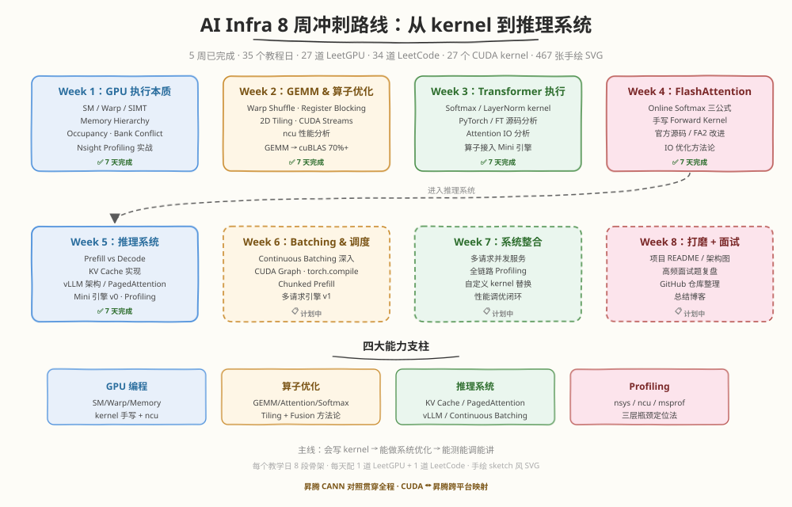

# AI Infra 学习笔记

> 从「会写 kernel」进阶到「能做系统优化」—— 8 周 AI Infra 工程实战学习仓库，涵盖 GPU 执行模型、算子优化、推理系统、专题深挖与论文精读。



## 项目简介

本仓库记录 AI Infra（推理系统 / 分布式 / 内核优化）方向的系统化学习过程，核心是一条 8 周冲刺路线：**会写 kernel → 能做系统优化 → 能测能调能讲**。8 周 56 个教学日已全部完成，并横向扩展出 9 个专题深挖与 9 篇论文精读。

| 周 | 主题 | 关键产出 | 状态 |
|----|------|---------|------|
| Week 1 | GPU 执行本质 + Profiling | SM/Warp/Memory 直觉、7 个 kernel、Nsight 实战 | ✅ 完成 |
| Week 2 | GEMM & 算子优化 | Naive→Tiled→Register Blocking GEMM、cuBLAS 70%+ | ✅ 完成 |
| Week 3 | Transformer 执行本质 | Softmax/LayerNorm kernel、Attention IO 分析、Mini 引擎 | ✅ 完成 |
| Week 4 | FlashAttention 深挖 | Online Softmax 推导、手写 Forward Kernel、IO 优化方法论 | ✅ 完成 |
| Week 5 | 推理系统与 KV Cache | Prefill/Decode、KV Cache、vLLM 架构、PagedAttention、Mini 引擎 v0 | ✅ 完成 |
| Week 6 | Batching & 调度 | Continuous Batching、vLLM Scheduler 源码、Chunked Prefill、Mini 引擎 v1 | ✅ 完成 |
| Week 7 | 系统整合 | 多请求并发、完整调度器、自定义 Kernel 整合、全链路 Profiling | ✅ 完成 |
| Week 8 | 项目打磨 + 面试准备 | README、架构图、高频面试题、Mock 面试、8 周总结 | ✅ 完成 |

课程概览与入口见 [aiinfra/daily/README.md](aiinfra/daily/README.md)，详细计划见 `aiinfra/daily/plan/`。

## 仓库结构

```
ai-infra-notes/
├── aiinfra/                        # 课程主体
│   ├── daily/                      # 8 周每日教程（56 个教学日）
│   │   ├── README.md               # 课程概览（部署为 GitHub Pages 首页）
│   │   ├── SKILL.md                # 每日教程写作规范
│   │   ├── plan/                   # 8 周学习计划（总览 + 详细 + 各周展开）
│   │   │   ├── AI_Infra_8_week_plan.md
│   │   │   ├── AI_Infra_8_week_plan_detailed.md
│   │   │   └── learning_plan_week{2..8}_expanded.md
│   │   ├── week1/ ~ week8/         # 各周教程（每天 README + kernels + images）
│   │   └── images/                 # 课程概览插图
│   ├── topics/                     # 专题深挖（9 个，横向扩展）
│   │   ├── SKILL.md                # 专题写作规范
│   │   ├── cpp/                    # C++ 面试专题（7 天）
│   │   ├── cuda/                   # CUDA 手撕题专题（43 道 LeetGPU 题解）
│   │   ├── cute/                   # CuTe 编程模型（7 天）
│   │   ├── cutlass/                # CUTLASS（7 天，8 个 kernel）
│   │   ├── deepgemm/               # DeepGEMM —— DeepSeek FP8 GEMM（7 天）
│   │   ├── interview/              # AI Infra 面经与面试题整理
│   │   ├── moe/                    # Mixture-of-Experts（7 天）
│   │   ├── transformer/            # Transformer 从零实现（7 天，mini-GPT）
│   │   └── triton/                 # Triton DSL（7 天）
│   └── paper/                      # 论文精读（17 节骨架，9 篇已完成 / 27 篇计划）
│       ├── SKILL.md                # 论文精读规范
│       └── <paper-name>/README.md  # 每篇精读笔记
├── profiling/                      # ncu/nsys 性能分析任务（Week 1-3）
├── images/                         # 仓库根插图（路线图等）
├── static/                         # 网站静态资源（css/js）
├── build/                          # 网站构建模块（weeks / topics / paper / common）
├── build.py                        # 组合构建 GitHub Pages 全站
├── requirements.txt                # 网站构建依赖
└── .github/workflows/deploy.yml    # GitHub Pages 自动部署
```

## 已完成内容一览

### 8 周 56 个教学日

| 周 | Day 1 | Day 2 | Day 3 | Day 4 | Day 5 | Day 6 | Day 7 |
|----|-------|-------|-------|-------|-------|-------|-------|
| W1 | GPU 执行模型 | Occupancy | deviceQuery | Memory Hierarchy | Bank Conflict | Nsight 实战 | 总结复盘 |
| W2 | Warp Shuffle | Register Blocking | CUDA Streams | ncu 分析 | FA 简化版 | cuBLAS 70%+ | 手撕验收 |
| W3 | Trace 推理 | Softmax/LN kernel | 源码分析 | Attention IO | 接入引擎 | Profiling | 算子总结 |
| W4 | FA 论文精读 | 手写 FA Kernel | 官方源码 | FA2 论文 | 引擎集成 | 性能对比 | IO 方法论 |
| W5 | Prefill/Decode | KV Cache | vLLM 架构 | PagedAttention | Mini 引擎 v0 | Profiling | 核心问题总结 |
| W6 | Dynamic Batching | Continuous Batching | vLLM Scheduler | TRT-LLM 对比 | Mini 引擎 v1 | Latency/Throughput | 调度总结 |
| W7 | 多请求并发 | 完整调度器 | SGLang/LightLLM | 整合 Kernel | 系统联调 | 全链路 Profiling | 重构与文档 |
| W8 | 项目文档 | 架构图 | 面试题基础 | 面试题进阶 | Mock 面试 | 查漏补缺 | 最终复盘 |

## 专题深挖

9 个横向专题，每个围绕一个主题深入展开（多数为 7 天计划），与每日教程互补：

| 专题 | 主题 | 核心产出 | 入口 |
|------|------|---------|------|
| CUDA 手撕题 | AI Infra 面经高频 CUDA 算子 | 面经高频题总结 + LeetGPU 题目对照与备考优先级 | [topics/cuda/](aiinfra/topics/cuda/README.md) |
| CUTLASS | 三层抽象 + CuTe + Epilogue 融合 | CUTLASS 3.x GEMM、融合 Epilogue、cuBLAS 90%+ | [topics/cutlass/](aiinfra/topics/cutlass/README.md) |
| CuTe | Layout 代数 + Tensor + Copy + TMA | 用 CuTe 原语手写 GEMM（cuBLAS 70%+） | [topics/cute/](aiinfra/topics/cute/README.md) |
| DeepGEMM | DeepSeek FP8 GEMM + Grouped GEMM + Mega MoE | FP8 GEMM 源码精读、ncu 调优报告 | [topics/deepgemm/](aiinfra/topics/deepgemm/README.md) |
| Triton | block 级编程模型 | vector_add / GEMM / softmax / FlashAttention | [topics/triton/](aiinfra/topics/triton/README.md) |
| Transformer | 从零组装完整 Transformer | 手写 MHA、三种位置编码、可训练 mini-GPT | [topics/transformer/](aiinfra/topics/transformer/README.md) |
| MoE | 稀疏路由 + Grouped GEMM + Expert Parallelism | Triton MoE FFN 层、all-to-all dispatch demo | [topics/moe/](aiinfra/topics/moe/README.md) |
| C++ 面试 | 内存模型 / 智能指针 / 移动语义 / 模板 / 并发 | 7 份可编译代码 + 40+ 道高频面试问答 | [topics/cpp/](aiinfra/topics/cpp/README.md) |
| 面经整理 | 知乎 / 牛客网公开面经分类 | 北美 + 社招面试实录、高频考点与公司风格 | [topics/interview/](aiinfra/topics/interview/README.md) |

## 论文精读

按 [17 节骨架](aiinfra/paper/SKILL.md)（Metadata → Core Idea → Method → Formula → Experiments → Engineering Insights → Future Work）做 Reviewer 视角精读。已完成 9 篇，计划 27 篇：

| 论文 | 方向 | 入口 |
|------|------|------|
| Attention Is All You Need | Transformer 原始论文 | [paper/attention_is_all_you_need/](aiinfra/paper/attention_is_all_you_need/README.md) |
| FlashAttention | IO 优化 Attention | [paper/flashattention/](aiinfra/paper/flashattention/README.md) |
| FlashAttention-2 | 减少 non-matmul FLOPs | [paper/flashattention2/](aiinfra/paper/flashattention2/README.md) |
| FlashAttention-3 | warp specialization + FP8 | [paper/flashattention3/](aiinfra/paper/flashattention3/README.md) |
| Online Softmax | 分块递推 softmax | [paper/online_softmax/](aiinfra/paper/online_softmax/README.md) |
| vLLM | PagedAttention 推理服务 | [paper/vllm/](aiinfra/paper/vllm/README.md) |
| GPTQ | 训后量化 | [paper/gptq/](aiinfra/paper/gptq/README.md) |
| DeepSeek-V2 | MLA + DeepSeekMoE | [paper/deepseek_v2/](aiinfra/paper/deepseek_v2/README.md) |
| Triton | Python DSL 编译器 | [paper/triton/](aiinfra/paper/triton/README.md) |

> 计划中的论文目录见 `aiinfra/paper/`（含 AWQ、SmoothQuant、Mamba、Medusa、Megatron-LM、Orca、Sarathi-Serve、Splitwise、ZeRO、Speculative Decoding 等）。

## 工程资产

- **58 个 CUDA kernel**（`.cu`）+ **38 个 Python 脚本**（`.py`，含 Mini 引擎、调度器、profiling 脚本、benchmark）
- **409 张手绘 sketch 风 SVG**（统一 Excalidraw-like 风格，含 `feTurbulence` 抖动滤镜）
- **Mini 推理引擎演进**：v0（单请求 + KV Cache）→ v1（Continuous Batching + 多请求并发）→ 完整系统（调度器 + 自定义 Kernel 整合）
- **Profiling 资产**：`profiling/` 下 Week 1-3 的 ncu/nsys 分析任务 + 常用指标速查 + 通用方法论
- **在线网站**：GitHub Pages 自动部署，含 8 周教程 + 9 个专题 + 9 篇论文精读

## 每日教程结构

教学型 Day 严格遵循 8 段骨架（总结日 Day 7 用变体）：

```
## Day N：<主题>
### 🎯 目标 ← 6 条编号目标 + "为什么重要"
### 学前导读 ← 动机铺垫，衔接前一日
### 理论学习 ← 分小节讲解，配 SVG 图表
### Coding 任务 ← 5 个子任务（含完整可编译 kernel + LeetGPU + LeetCode）
### 扩展实验 ← 3 个递进/对比实验
### 今日总结 ← 5-7 条加粗编号
### 面试要点 ← 5 题问答
```

每天 Coding 任务包含：1 个完整可编译 kernel（带 `nvcc` 命令 + 预期输出）+ 1 道 [LeetGPU](https://leetgpu.com/) 在线题 + 1 道 [LeetCode](https://leetcode.cn/) 面试题，题解分别归档到[独立 LeetGPU 题解仓库](https://github.com/hzchenxiaobin/leetgpu)与[独立 LeetCode 题解仓库](https://hzchenxiaobin.github.io/leetcode/)。详细写作规范见 [aiinfra/daily/SKILL.md](aiinfra/daily/SKILL.md)。

## 在线网站

每次推送到 `main` 分支自动构建并部署到 GitHub Pages，内容包括 8 周每日教程、9 个专题、9 篇论文精读、8 周计划总览。

## 本地预览

```bash
python3 build.py                    # 构建全站到 public/
cd public && python3 -m http.server 8080
```

浏览器访问 `http://localhost:8080`。

## 编译运行 Kernel

Kernel 按天组织在 `aiinfra/daily/weekN/dayM/kernels/` 下，可用 `nvcc` 直接编译：

```bash
# Week 1: GPU 执行模型
nvcc -o aiinfra/daily/week1/day1/kernels/hello_gpu aiinfra/daily/week1/day1/kernels/hello_gpu.cu && ./aiinfra/daily/week1/day1/kernels/hello_gpu

# Week 2: GEMM 优化
nvcc -O3 -arch=sm_120 aiinfra/daily/week2/day2/kernels/gemm.cu -o gemm && ./gemm

# Week 4: FlashAttention
nvcc -O3 -arch=sm_120 aiinfra/daily/week4/day2/kernels/flash_attention_v2.cu -o fa && ./fa

# Week 5: PagedAttention / Mini 引擎
nvcc -O3 -arch=sm_120 aiinfra/daily/week5/day4/kernels/paged_attention.cu -o paged && ./paged
python3 aiinfra/daily/week5/day5/kernels/mini_engine_v0.py

# Week 6: Continuous Batching / Mini 引擎 v1
python3 aiinfra/daily/week6/day5/kernels/mini_engine_v1.py
```

Profiling 示例：

```bash
# ncu 分析单 kernel 瓶颈
ncu --metrics gpu__time_duration.sum, \
 dram__throughput.avg.pct_of_peak_sustained_elapsed, \
 sm__throughput.avg.pct_of_peak_sustained_elapsed \
 ./gemm

# nsys 采集端到端时间线
nsys profile -o timeline --trace=cuda,nvtx python3 aiinfra/daily/week5/day5/kernels/mini_engine_v0.py
nsys stats -t cuda_gpu_kern_sum timeline.nsys-rep
```

更系统的 ncu/nsys 分析任务（含常用指标速查、瓶颈判断方法论、WSL2 权限配置）见 [profiling/README.md](profiling/README.md)。

## 题解索引

### LeetGPU（43 道，题解已迁移至[独立站点](https://hzchenxiaobin.github.io/leetgpu/)）

| 难度 | 分类 | 题目 |
|------|------|------|
| Low | Elementwise | Vector Addition · ReLU · Leaky ReLU · Sigmoid · SiLU · SwiGLU · GeGLU · RoPE Embedding · RGB to Grayscale · Weight Dequantization |
| Low | Convolution | 1D / 2D / 3D Convolution · 2D Max Pooling · Gaussian Blur |
| Low | Reduction | Dot Product · FP16 Dot Product |
| Medium | GEMM | Matrix Multiplication · GEMM · Batched MatMul · FP16 Batched MatMul · INT8 Quantized MatMul · INT4 MatMul |
| Medium | Attention | Softmax Attention · Multi-Head Attention · Causal Self-Attention · Grouped Query Attention · INT8 KV-Cache Attention |
| Medium | Scan | Prefix Sum · Segmented Prefix Sum |
| Medium | Selection | Top-K Selection · Top-P Sampling · MoE Top-K Gating |
| Medium | 其他 | Matrix Transpose · Sparse Matrix-Vector Multiplication · Histogramming |
| High | Reduction | Reduction · Softmax · Layer Normalization · RMS Normalization · Batch Normalization · Group Normalization · GPT-2 Transformer Block |

每道题解含完整可编译 kernel + ncu profiling + 手绘 SVG。题解全文见 [LeetGPU 题解站点](https://hzchenxiaobin.github.io/leetgpu/)，面试高频考点对照见 [topics/cuda/](aiinfra/topics/cuda/README.md)。

### 独立题解仓库

- **[LeetGPU 题解](https://github.com/hzchenxiaobin/leetgpu)** —— CUDA 在线挑战题解，按周/日与教程对齐
- **[LeetCode 题解](https://hzchenxiaobin.github.io/leetcode/)** —— 面试高频算法题解，含 C++/Python 参考代码 + 手绘 SVG + 复杂度分析

## 工具链

- **CUDA Toolkit** 11.8+ / 12.x
- **Nsight Compute** (`ncu`) / **Nsight Systems** (`nsys`)
- **PyTorch** 2.x（Week 3 起对比基准 + Mini 引擎后端）
- **cuBLAS**（Week 2 起 GEMM 对比基准）
- **CUTLASS** / **CuTe**（专题，需 CUDA 12.0+）
- **Triton**（专题，PyTorch 2.x 自带）
- **Python** 3.10+（网站构建 + Mini 引擎 + profiling 脚本）

## 学习路线建议

1. 从 [aiinfra/daily/README.md](aiinfra/daily/README.md) 了解整体节奏，再按 8 周路线推进
2. 进入 [aiinfra/daily/week1/README.md](aiinfra/daily/week1/README.md) 按 Day 1 → Day 7 推进
3. 每个 kernel 配套 Nsight Profiling 任务，参考 [profiling/](profiling/README.md) 目录
4. 横向深入时进入对应专题：GEMM 进阶看 [CUTLASS](aiinfra/topics/cutlass/README.md) / [CuTe](aiinfra/topics/cute/README.md) / [DeepGEMM](aiinfra/topics/deepgemm/README.md)，模型层看 [Transformer](aiinfra/topics/transformer/README.md)，面试准备看 [CUDA 手撕题](aiinfra/topics/cuda/README.md) / [C++ 面试](aiinfra/topics/cpp/README.md) / [面经整理](aiinfra/topics/interview/README.md)
5. 每天完成 LeetGPU 在线题目，题解归档到[独立 LeetGPU 题解仓库](https://github.com/hzchenxiaobin/leetgpu)
6. 每天完成 LeetCode 面试题，题解归档到[独立 LeetCode 题解仓库](https://hzchenxiaobin.github.io/leetcode/)

## 目录约定

- `dayN/`：按天组织，含 `README.md`（教程）、`kernels/`、`exercise/`、`notes/`
- `kernels/`：可直接编译运行的 `.cu` / `.py` 示例
- `images/`：所有手绘 sketch 风 SVG，统一 `feTurbulence` 抖动滤镜 + Comic Sans/Kaiti SC 字体
- `build/` + `build.py`：从 `dayN/README.md`、专题、论文生成静态网站到 `public/`（构建产物，勿手改）
- LeetGPU 题解：归档于[独立站点](https://hzchenxiaobin.github.io/leetgpu/)（[仓库](https://github.com/hzchenxiaobin/leetgpu)），按周/日与教程对齐
- LeetCode 题解：归档于[独立仓库](https://hzchenxiaobin.github.io/leetcode/)，按周/日与教程对齐

> 💡 本计划为理想节奏，实际执行中可根据个人进度调整。建议每周保留 Day 7 作为缓冲，避免进度积压。
