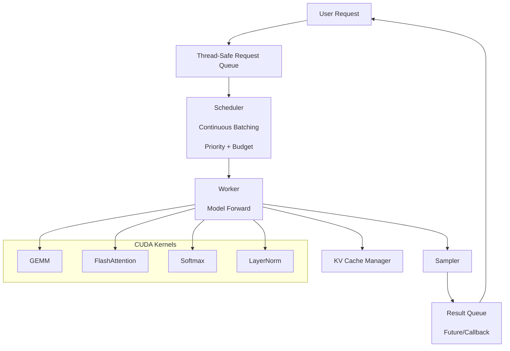
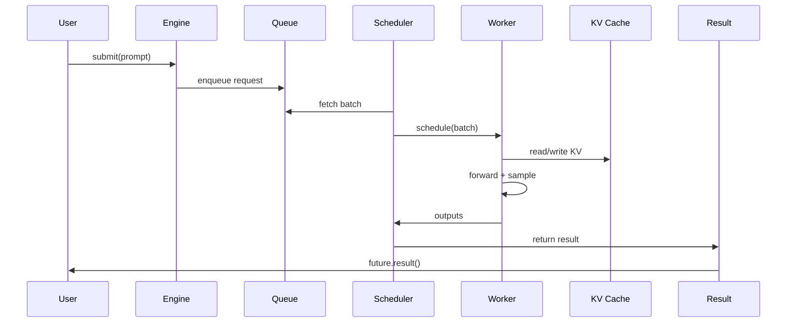

# 第8周深度展开：项目打磨 + 面试准备（7天）

> **适用对象**：陈斌斌（已完成第7周学习，构建完整 Mini AI Infra 系统）
> **本周目标**：将学习成果转化为面试能力，完善项目文档和架构图，准备高频面试题，进行 mock 面试和查漏补缺
> **时间投入**：工作日每天2.5h（早间1.5h + 晚间1h），周末每天6h，周计24.5h
> **周日里程碑**：项目 README + 架构图 + benchmark 报告完整，能清晰口述项目，50+ 面试题自问自答通过

---

## 本周总览

| 维度 | 内容 |
|------|------|
| **整体目标** | 把前7周的代码、笔记、项目打磨成可展示的面试素材，建立完整的 AI Infra 知识体系 |
| **核心产出** | ① 完善的 README ② 系统架构图和数据流图 ③ 50+ 高频面试题库 ④ 场景题和系统设计题解答 ⑤ Mock 面试记录 ⑥ 8 周总结报告 ⑦ 后续学习路线图 |
| **验收标准** | ① README 能让新用户跑通示例 ② 架构图清晰展示 5+ 核心模块 ③ 能清晰介绍项目背景、目标、技术难点 ④ 能深入讲解至少 2 个技术难点 ⑤ 50+ 面试题能自问自答 ⑥ 能应对 follow-up 问题 |
| **面试准备** | 积累50+道面试题，覆盖 GPU 基础、Kernel 优化、CUDA 编程、Attention 优化、推理系统、调度、vLLM、项目经验八大主题 |

### 本周知识图谱

```
Day 50: 项目文档完善 → README、Quick Start、依赖安装、Benchmark 结果
 ↓
Day 51: 架构图与数据流图 → 系统架构、数据流、模块交互图
 ↓
Day 52: 高频面试题基础篇 → GPU、Kernel、CUDA、Profiling
 ↓
Day 53: 高频面试题进阶篇 → Attention、推理系统、vLLM、调度
 ↓
Day 54: Mock 面试 → 自我介绍、项目介绍、技术难点、优化思路
 ↓
Day 55: 查漏补缺 → 薄弱点复习、易混淆概念、关键公式
 ↓
Day 56: 最终复盘 → 8 周能力地图、强项/待提升、后续规划
```

### 前置准备清单

#### 材料准备
- [ ] Week 1-7 的所有代码已整理到 GitHub
- [ ] Week 1-7 的笔记和报告已整理
- [ ] Mini AI Infra 系统能稳定运行
- [ ] benchmark 结果已保存

#### 心态准备
- [ ] 能接受 mock 面试中的暴露问题
- [ ] 准备好讲清楚每个技术决策
- [ ] 准备好被追问"为什么"和"怎么做更好"

---

## Day 50（周一）：项目文档完善

> **今日目标**：完善项目 README，编写 Quick Start 指南、依赖安装说明、benchmark 对比表格，让新用户能根据 README 跑通示例。
> **面试考察度**：⭐⭐⭐⭐ 高频，README 是项目的第一印象

---

### 学习任务1：README 核心要素（1小时）

#### README 结构

```markdown
# Mini AI Infra

> 一个用于学习 AI Infra 的迷你推理系统

## 项目亮点
- 手写 CUDA kernel：GEMM、FlashAttention、Softmax、LayerNorm
- 完整推理系统：Prefill/Decode、KV Cache、Continuous Batching、Scheduler
- 端到端可运行：单请求/多请求并发
- 与 vLLM 对比的 benchmark

## 快速开始

### 环境要求
- NVIDIA GPU (Compute Capability >= 7.0)
- CUDA >= 11.0
- Python >= 3.8
- PyTorch >= 2.0

### 安装
```bash
git clone https://github.com/yourname/mini-ai-infra.git
cd mini-ai-infra
pip install -r requirements.txt
```

### 运行示例
```bash
# 单请求推理
python examples/single_request.py

# 多请求并发
python examples/multi_request.py

# 运行 benchmark
python benchmarks/benchmark_engine.py
```

## 项目结构
```
mini_ai_infra/
├── mini_infra/ # 核心代码
├── examples/ # 示例脚本
├── benchmarks/ # 性能测试
├── tests/ # 单元测试
├── docs/ # 文档
└── README.md
```

## 系统架构
[架构图链接]

## Benchmark 结果
[表格]

## 技术栈
- CUDA / PyTorch C++ Extension
- FlashAttention / PagedAttention（概念）
- Continuous Batching / Priority Scheduling

## 后续规划
- [ ] PagedAttention 完整实现
- [ ] CUDA Graph
- [ ] FP16/BF16 推理
- [ ] 多 GPU 支持
```

#### README 面试价值

```
面试官可能问：
 - "介绍一下你的项目"
 - "项目的难点是什么？"
 - "为什么选择这个技术方案？"
 - "如果让你继续优化，你会做什么？"

README 应该直接回答这些问题。
```

### 晚间任务：编写示例脚本和验证（1小时）

#### 示例脚本清单

```
examples/
├── single_request.py
├── multi_request.py
├── continuous_batching.py
├── priority_scheduling.py
└── benchmark_demo.py
```

#### 验证 checklist

- [ ] `pip install -r requirements.txt` 成功
- [ ] `python examples/single_request.py` 成功
- [ ] `python examples/multi_request.py` 成功
- [ ] `python benchmarks/benchmark_engine.py` 成功
- [ ] 新用户能在 10 分钟内跑通第一个示例

---

### 今日面试题

**面试题1**：介绍一下你的 Mini AI Infra 项目。（⭐⭐⭐⭐⭐ 必考）

**参考答案要点**（3-5 分钟版本）：
1. **项目背景**：学习 AI Infra，从 kernel 到系统构建完整能力
2. **核心功能**：
 - 手写 CUDA kernel（GEMM、FlashAttention、Softmax、LayerNorm）
 - Mini 推理系统（Prefill/Decode、KV Cache、Continuous Batching、Scheduler）
 - 支持单请求/多请求并发
1. **技术难点**：
 - FlashAttention 的 online softmax 推导和实现
 - Continuous Batching 的状态管理和 KV Cache 隔离
 - 自定义 kernel 与 PyTorch 的集成
1. **成果**：
 - 长序列下 FlashAttention 2x+ 加速
 - 系统能连续处理 1000+ 请求
 - 完整的 profiling 和 benchmark 报告

**面试题2**：如果让你继续优化这个项目，你会做什么？（⭐⭐⭐⭐⭐ 必考）

**参考答案要点**：
1. **Kernel 层面**：
 - 使用官方 FlashAttention/PagedAttention 替换教学版 kernel
 - 引入 Tensor Core / WMMA
 - 实现 CUDA Graph 减少 launch overhead
1. **系统层面**：
 - 完整实现 PagedAttention 和 Prefix Caching
 - C++ 重写 scheduler 降低 CPU overhead
 - 支持 chunked prefill 和 speculative decoding
1. **工程层面**：
 - 多 GPU / TP / PP 支持
 - 更完善的测试和 CI
 - 模型量化（INT8/FP8 KV Cache）

---

### 今日自测清单

- [ ] README 包含项目亮点、快速开始、架构、benchmark
- [ ] 示例脚本能在干净环境跑通
- [ ] 新用户能在 10 分钟内跑通第一个示例
- [ ] 能用 3-5 分钟清晰介绍项目
- [ ] 能回答"如果继续优化会做什么"

---

## Day 51（周二）：架构图与数据流图

> **今日目标**：绘制系统架构图、数据流图、关键模块交互图，让面试官能一眼理解系统设计。
> **时间分配**：早间1.5h（理论学习1h + 绘图实践30min）+ 晚间1h（图表整理）
> **面试考察度**：⭐⭐⭐⭐ 高频，架构图是面试中的重要辅助

---

### 学习任务1：架构图类型（1小时）

#### 需要绘制的图

```
1. 系统架构图（模块层次）
 - 展示 Engine、Scheduler、Worker、KV Cache、Model、Kernel 的关系

1. 数据流图（请求生命周期）
 - 展示请求从进入到输出的完整路径

1. 模块交互时序图
 - 展示 Scheduler-Worker-KV Cache 的交互

1. Kernel 优化层次图
 - 从 Naive GEMM 到 cuBLAS 80% 的优化路径

1. Continuous Batching 时间线图
 - 展示请求动态加入和退出
```

#### 绘图工具

```
推荐工具：
 - Excalidraw：手绘风格，适合面试展示
 - Draw.io：功能全面
 - PlantUML：代码生成，适合版本控制
 - Mermaid：Markdown 内嵌

建议：用文本+Mermaid 编写，方便版本控制。
```

---

### 学习任务2：Mermaid 图表示例（30分钟）

#### 系统架构图

````markdown

````

#### 数据流图

````markdown

````

---

### 晚间任务：图表整理与验证（1小时）

#### 输出清单

```
docs/
├── architecture.md # 架构图和说明
├── data_flow.md # 数据流图
├── kernel_optimization.md # Kernel 优化层次图
└── continuous_batching.md # Continuous Batching 时间线
```

#### 练习题

**练习1（基础）**：用 Mermaid 画出 Mini 系统的架构图。

**练习2（进阶）**：画出 FlashAttention 的 tiling 示意图。

**练习3（综合）**：画出 Continuous Batching 的时间线图，展示 3 个请求动态加入/退出。

---

### 今日面试题

**面试题1**：画一下你的 Mini AI Infra 系统架构图。（⭐⭐⭐⭐⭐ 必考）

**参考答案要点**：
- 分层展示：User → Request Queue → Scheduler → Worker → Sampler → Result
- 核心模块：Engine、Scheduler、Worker、KV Cache Manager、Model、Kernel
- 自定义 Kernel：GEMM、FlashAttention、Softmax、LayerNorm
- 关键流程：submit → enqueue → schedule → forward → sample → return

**面试题2**：Continuous Batching 的时间线是怎样的？画一下。（⭐⭐⭐⭐ 高频）

**参考答案要点**：
- 横轴：iteration
- 纵轴：batch 中的请求
- 展示：
 - Iter 0：R1_prefill, R2_prefill
 - Iter 1：R1_decode, R2_decode
 - Iter 2：R1_decode, R2_decode, R3_prefill
 - Iter 3：R2_decode, R3_decode（R1 完成退出）

---

### 今日自测清单

- [ ] 能画出系统架构图
- [ ] 能画出数据流图
- [ ] 能画出模块交互时序图
- [ ] 能画出 Kernel 优化层次图
- [ ] 能画出 Continuous Batching 时间线
- [ ] 图表已保存到 docs 目录
- [ ] 能用图表辅助讲解项目

---

## Day 52（周三）：高频面试题基础篇

> **今日目标**：复习 GPU 基础、Kernel 优化、CUDA 编程、Profiling 相关的高频面试题，产出自问自答笔记。
> **时间分配**：早间1.5h（GPU 基础45min + Kernel 优化45min）+ 晚间1h（CUDA + Profiling）
> **面试考察度**：⭐⭐⭐⭐⭐ 必考，基础篇是面试的敲门砖

---

### 学习任务1：GPU 基础（45分钟）

#### 核心知识点

```
1. SM / Warp / Thread 层次结构
2. Occupancy 和影响因素
3. Memory hierarchy
4. Coalesced access / Bank conflict
5. SIMT 执行模型
```

#### 高频面试题

**Q1：什么是 SM、Warp、Thread？它们之间的关系是什么？**

**参考答案要点**：
- **SM（Streaming Multiprocessor）**：GPU 的基本计算单元，包含多个计算核心、寄存器文件、shared memory
- **Warp**：32 个 thread 组成的一组，是 GPU 调度的基本单位
- **Thread**：最细粒度的执行单元
- **关系**：
 - 一个 GPU 有多个 SM
 - 一个 SM 可以同时运行多个 warp
 - 一个 warp 内 32 个 thread 执行相同指令（SIMT）
 - Grid > Block > Thread

**Q2：什么是 Occupancy？什么情况下会降低？**

**参考答案要点**：
- **Occupancy**：active warp 数 / SM 支持的最大 warp 数
- **降低原因**：
 - 每个 thread 使用寄存器过多
 - 每个 block 使用 shared memory 过多
 - block size 不是 warp size 的倍数
 - grid size 不足
- **影响**：occupancy 低意味着 SM 无法隐藏延迟，性能下降

**Q3：解释 GPU 的 memory hierarchy。**

**参考答案要点**：
```
速度从快到慢、容量从小到大：
 Register < Shared Memory < L1/L2 Cache < Global Memory (HBM)

延迟：
 - Register: ~0 cycle
 - Shared Memory: ~20-30 cycles
 - L1: ~10-20 cycles
 - L2: ~100-200 cycles
 - Global Memory: ~400-800 cycles

优化目标：
 - 让热点数据尽量驻留在 register/shared memory
 - 合并访问 global memory
```

**Q4：什么是 bank conflict？如何避免？**

**参考答案要点**：
- **Bank conflict**：多个 thread 同时访问 shared memory 的同一个 bank，导致串行化
- **避免方法**：
 - 让连续 thread 访问不同 bank
 - 使用 padding（如 `s_A[BM][BK+1]`）
 - 使用 float4 等向量化访问

---

### 学习任务2：Kernel 优化（45分钟）

#### 核心知识点

```
1. Tiling / Shared Memory
2. Register Blocking
3. Vectorized Load (float4)
4. Warp Shuffle
5. Double Buffering
6. Tensor Core
```

#### 高频面试题

**Q5：如何把 GEMM 优化到 cuBLAS 80%？**

**参考答案要点**：
```
1. Naive (~1%)：每个 thread 计算一个元素
2. Shared Memory Tiling (~15%)：K 维度复用
3. Register Blocking (~40%)：TM×TN thread tile
4. Vectorized Load (~55%)：float4 加载
5. Warp Shuffle (~60%)：warp 内协作
6. Double Buffering (~70%)：隐藏传输延迟
7. Tensor Core (~80%+)：使用 WMMA/mma
8. Auto-tuning (~90%+)：参数搜索
```

**Q6：float4 向量化加载为什么能提升性能？**

**参考答案要点**：
- GPU global memory 以 128-byte cache line 访问
- 4 个连续 float（16 bytes）可用一条 128-bit load 指令完成
- 减少指令数，提高带宽利用率
- 需要地址对齐和 coalesced access

**Q7：Warp Shuffle 比 Shared Memory 快多少？为什么？**

**参考答案要点**：
- **延迟**：Shuffle ~1-2 cycles，Shared Memory ~20-30 cycles
- **原因**：
 - Shuffle 通过 warp 内部专用交换网络直接读取源寄存器
 - 不需要经过 shared memory 读写路径
 - 不需要 `__syncthreads()`
- **局限**：只适用于 warp 内（最多 32 线程）

---

### 学习任务3：CUDA 编程（30分钟）

#### 高频面试题

**Q8：**`__syncthreads()` **和 warp shuffle 的同步区别？**

**参考答案要点**：
- `__syncthreads()`：block 级同步，所有 thread 必须到达，有性能开销
- warp shuffle：warp 内隐式同步，硬件自动完成，开销小
- warp shuffle 只能用于 warp 内通信

**Q9：Default Stream 有什么坑？**

**参考答案要点**：
- Default Stream（Stream 0）会隐式同步所有其他 explicit stream
- 如果在 explicit stream 中做并发，然后调用 `cudaMemcpy`（走 default stream），所有并发被打断
- 解决：使用 `cudaStreamCreateWithFlags(&stream, cudaStreamNonBlocking)` 或 `--default-stream per-thread`

**Q10：**`cudaMemcpyAsync` **和** `cudaMemcpy` **的区别？**

**参考答案要点**：
- `cudaMemcpy`：同步，阻塞 host
- `cudaMemcpyAsync`：异步，需要 pinned memory
- 异步拷贝可以与其他 kernel overlap

---

### 学习任务4：Profiling（30分钟）

#### 高频面试题

**Q11：如何分析一个 CUDA kernel 的瓶颈？**

**参考答案要点**：
1. 用 ncu 获取 SM Throughput、Memory Throughput、Achieved Occupancy
2. 看 Roofline 位置：
 - Memory Throughput >> SM Throughput → memory-bound
 - SM Throughput >> Memory Throughput → compute-bound
1. 看 Warp Stall Reasons：
 - Long Scoreboard → global memory 延迟
 - Math Pipe Throttle → FMA 饱和
1. 针对性优化后重新 profile

**Q12：什么是 Roofline Model？**

**参考答案要点**：
```
Roofline 图：
 - 横轴：Arithmetic Intensity (FLOP/Byte)
 - 纵轴：Performance (GFLOP/s)
 - 斜线：memory-bound 区域（性能 = AI × bandwidth）
 - 水平线：compute-bound 区域（峰值算力）

作用：判断 kernel 是 compute-bound 还是 memory-bound，指导优化方向
```

---

### 晚间任务：基础篇面试题笔记整理（1小时）

#### 笔记模板

```markdown
# 高频面试题 - 基础篇

## GPU 基础
1. SM/Warp/Thread
2. Occupancy
3. Memory Hierarchy
4. Bank Conflict

## Kernel 优化
1. GEMM 优化到 cuBLAS 80%
2. float4 向量化
3. Warp Shuffle

## CUDA 编程
1. __syncthreads vs warp shuffle
2. Default Stream 坑
3. cudaMemcpyAsync

## Profiling
1. Kernel 瓶颈分析
2. Roofline Model
```

#### 练习题

**练习1**：随机抽取 5 道基础题，限时 3 分钟口述答案。

**练习2**：为每道题准备 1 个 follow-up 问题的回答。

---

### 今日自测清单

- [ ] 能清晰回答 12 道基础篇面试题
- [ ] 每道题能在 3 分钟内口述
- [ ] 整理了基础篇面试题笔记

---

## Day 53（周四）：高频面试题进阶篇

> **今日目标**：复习 Attention 优化、推理系统、vLLM、调度相关的高频面试题，产出自问自答笔记。
> **时间分配**：早间1.5h（Attention + 推理系统45min + vLLM + 调度45min）+ 晚间1h（场景题）
> **面试考察度**：⭐⭐⭐⭐⭐ 必考，进阶篇是面试的区分点

---

### 学习任务1：Attention 优化（45分钟）

#### 高频面试题

**Q13：FlashAttention 为什么快？**

**参考答案要点**：
- 标准 Attention 物化 S=QK^T 和 P=softmax(S) 两个 N×N 矩阵到 HBM，IO 是 O(N²)
- FlashAttention 通过 tiling + online softmax 在 SRAM 中完成计算，IO 是 O(Nd)
- 速度来自减少数据移动，不是减少 FLOPs
- 长序列、小 head dim 时收益最大

**Q14：推导 online softmax 的三个公式。**

**参考答案要点**：
```
m_new = max(m, max(xj))
l_new = l × exp(m - m_new) + Σ exp(xj - m_new)
o_new = o × (l × exp(m - m_new) / l_new) + Σ (exp(xj - m_new) / l_new) × vj
```
- `exp(m - m_new)` 是统一参考点的缩放因子

**Q15：FlashAttention-1 和 FlashAttention-2 的区别？**

**参考答案要点**：
- FA2 减少了 non-matmul FLOPs
- FA2 有更好的 work partitioning（warp groups）
- FA2 减少了 warp 同步点
- FA2 提高了 occupancy

---

### 学习任务2：推理系统（45分钟）

#### 高频面试题

**Q16：Prefill 和 Decode 的区别？**

**参考答案要点**：
- **Prefill**：输入 `(B, N_prompt, d)`，并行处理 prompt，compute-bound，关注 TTFT
- **Decode**：输入 `(B, 1, d)`，自回归生成，memory-bound，关注 TBT
- Decode 阶段 M=1，GEMM 退化，arithmetic intensity 极低

**Q17：KV Cache 的核心思想和内存占用？**

**参考答案要点**：
- 避免 decode 阶段重复计算历史 K/V
- 每 token 占用：2 × layers × heads × d_head × bytes
- 长文本/大 batch 时容易 OOM

**Q18：PagedAttention 解决了什么问题？**

**参考答案要点**：
- 解决 KV Cache 静态/动态分配的内存碎片和浪费
- 将 KV Cache 分成固定大小 block
- 逻辑 block 连续，物理 block 可以不连续
- 支持 copy-on-write

---

### 学习任务3：vLLM 和调度（30分钟）

#### 高频面试题

**Q19：vLLM 的整体架构是怎样的？**

**参考答案要点**：
- 分层：LLMEngine → Scheduler → Worker → Model Runner
- 请求生命周期：WAITING → RUNNING → FINISHED / SWAPPED
- Continuous Batching：每轮 iteration 重新构建 batch

**Q20：Continuous Batching 和 Dynamic Batching 的区别？**

**参考答案要点**：
- Dynamic Batching：request-level，一起开始一起结束
- Continuous Batching：iteration-level，请求动态加入/退出
- Continuous 更适合 LLM，因为生成长度差异大

**Q21：调度器中的抢占策略有哪些？**

**参考答案要点**：
- **Recompute**：丢弃 KV Cache，之后重算
- **Swap**：KV Cache 换出到 CPU
- 默认 Recompute，因为通常更快

---

### 学习任务4：场景题（30分钟）

#### 高频场景题

**Q22：如何优化长文本推理？**

**参考答案要点**：
1. FlashAttention 降低 attention IO
2. PagedAttention 管理 KV Cache 内存
3. KV Cache 量化减少显存
4. 滑动窗口 / 稀疏 attention
5. Chunked prefill 平滑 latency

**Q23：设计一个 LLM 推理服务。**

**参考答案要点**：
1. 模型加载和权重管理
2. KV Cache 管理（PagedAttention）
3. Continuous Batching Scheduler
4. 多请求并发和异步返回
5. 性能优化（FlashAttention、CUDA Graph、量化）
6. 监控和扩缩容

---

### 晚间任务：进阶篇面试题笔记整理（1小时）

#### 练习题

**练习1**：随机抽取 5 道进阶题，限时 5 分钟口述答案。

**练习2**：为每道场景题准备一个具体的数字例子。

---

### 今日自测清单

- [ ] 能清晰回答 11 道进阶篇面试题
- [ ] 能白板推导 online softmax 三公式
- [ ] 能画出 vLLM 架构图
- [ ] 能回答 2 道场景题
- [ ] 整理了进阶篇面试题笔记

---

## Day 54（周五）：Mock 面试

> **今日目标**：进行自我模拟面试，重点练习项目介绍、技术难点、优化思路，录音或文字记录，分析不足。
> **时间分配**：早间1.5h（准备提纲45min + 第一轮模拟45min）+ 晚间1.5h（第二轮模拟 + 复盘）
> **面试考察度**：⭐⭐⭐⭐⭐ 必考，mock 是发现问题的最好方式

---

### 学习任务1：Mock 面试提纲（45分钟）

#### 自我介绍（1-2 分钟）

```
模板：
 1. 姓名、背景
 2. 目前在做的方向
 3. 项目的核心亮点
 4. 希望应聘的岗位

示例：
 "我叫陈斌斌，最近 8 周集中学习了 AI Infra。我手写了一套 CUDA kernel，
 包括 GEMM、FlashAttention、Softmax、LayerNorm，并构建了一个 Mini 推理引擎，
 支持 KV Cache、Continuous Batching 和优先级调度。
 希望应聘 AI Infra / 推理优化相关岗位。"
```

#### 项目介绍（3-5 分钟）

```
要点：
 1. 项目背景和目标
 2. 系统架构
 3. 技术难点
 4. 量化成果
 5. 后续规划
```

#### 技术难点深挖（5-10 分钟）

```
准备 2-3 个深入的技术点：
 1. FlashAttention 的 online softmax 推导和 CUDA 实现
 2. Continuous Batching 的状态机和 KV Cache 管理
 3. Register Blocking GEMM 到 cuBLAS 70%+ 的优化路径

每个点准备：
 - 问题是什么
 - 你的解决方案
 - 遇到的挑战
 - 如何验证
 - 还可以怎么优化
```

#### 常见 Follow-up

```
- "为什么不用现成的 vLLM？"
- "你的 kernel 和官方实现差距在哪？"
- "如果处理 1000 并发请求，你的系统会怎么表现？"
- "如何优化 TBT？"
- "如何降低 TTFT？"
- "你的系统最大能支持多长的序列？"
```

---

### 学习任务2：Mock 面试实践（1.5小时）

#### 第一轮：自我介绍 + 项目介绍

- 限时 8 分钟
- 录音或文字记录
- 自我评分

#### 第二轮：技术深挖 + Follow-up

- 面试官角色：从自己准备的 follow-up 中随机抽取
- 回答每个问题限时 3-5 分钟
- 记录卡壳点和表达不清的地方

---

### 晚间任务：复盘与改进（1.5小时）

#### 复盘清单

```
1. 时间控制是否合适？
2. 表达是否清晰？
3. 有没有遗漏的关键点？
4. 哪些 follow-up 回答得不好？
5. 哪些概念讲得不准确？
```

#### 改进方法

```
1. 重新组织语言，写出标准回答
2. 对薄弱点重新学习
3. 再次 mock，直到流畅
```

---

### 今日面试题

**面试题：请用 5 分钟介绍你的项目，并回答可能的 follow-up。**

**参考答案要点**：
- 见 Day 50 项目介绍和 follow-up 准备
- 重点是：清晰、有逻辑、能深挖

---

### 今日自测清单

- [ ] 完成自我介绍准备
- [ ] 完成项目介绍准备
- [ ] 完成 2-3 个技术难点的深入准备
- [ ] 完成至少一轮 mock 面试
- [ ] 记录了卡壳点和改进方向
- [ ] 准备了常见 follow-up 的标准回答

---

## Day 55（周六）：查漏补缺

> **今日目标**：针对 mock 面试中的薄弱点深入复习，整理易混淆概念对比表，确保关键公式和参数能熟练背诵。
> **时间分配**：早间1.5h（薄弱点复习1h + 易混淆概念30min）+ 晚间1.5h（关键公式 + 流程图）
> **面试考察度**：⭐⭐⭐⭐ 高频，查漏补缺是面试准备的最后冲刺

---

### 学习任务1：薄弱点复习（1小时）

#### 薄弱点定位

```
从 mock 面试中找出：
 1. 回答不流畅的知识点
 2. 概念模糊的地方
 3. 数字记不住的参数
 4. 容易混淆的对比
```

#### 常见薄弱点

| 薄弱点 | 复习方法 |
|--------|---------|
| Online softmax 推导 | 手写 5 遍 |
| GEMM 优化层次 | 画出每层优化图 |
| vLLM Scheduler 流程 | 看源码 + 画流程图 |
| KV Cache 内存计算 | 用不同模型算 10 次 |
| Roofline Model | 画 3 遍 |
| Prefill/Decode 计算强度 | 推导公式 |

---

### 学习任务2：易混淆概念对比表（30分钟）

#### 对比表

| 概念 A | 概念 B | 区别 |
|--------|--------|------|
| Prefill | Decode | 输入形状、瓶颈、指标 |
| Dynamic Batching | Continuous Batching | 调度粒度 |
| Recompute | Swap | 抢占后处理方式 |
| SM Throughput | Memory Throughput | ncu 指标含义 |
| float4 | half2 | 数据类型和向量宽度 |
| `__shfl_down_sync` | `__shfl_xor_sync` | 偏移 vs 蝴蝶 |
| FlashAttention-1 | FlashAttention-2 | 改进点 |
| LayerNorm | BatchNorm | 归一化维度 |
| TTFT | TBT | 阶段和含义 |
| Occupancy | Utilization | 概念不同 |

---

### 学习任务3：关键公式和参数背诵（1小时）

#### 必须熟练的公式

```
1. Online Softmax
 m_new = max(m, max(xj))
 l_new = l × exp(m - m_new) + Σ exp(xj - m_new)
 o_new = o × (l × exp(m - m_new) / l_new) + Σ (exp(xj - m_new) / l_new) × vj

1. KV Cache 内存
 bytes_per_token = 2 × layers × heads × d_head × bytes_per_elem

1. GEMM FLOPs
 FLOPs = 2 × M × N × K

1. Arithmetic Intensity
 AI = FLOPs / Bytes

1. Roofline Ridge Point
 Ridge Point = Peak FLOP/s / Peak Bandwidth

1. FlashAttention HBM IO
 Standard: O(N² + Nd)
 FlashAttention: O(Nd)
```

#### 关键参数

```
RTX 5090:
 - FP32 Peak: 19.5 TFLOPS
 - Tensor Core FP16: 312 TFLOPS
 - Memory Bandwidth: 1.55-2.0 TB/s
 - Ridge Point: ~12.6 FLOP/Byte
 - Shared Memory per SM: 164 KB
 - Max threads per SM: 2048
 - Warp size: 32
```

---

### 晚间任务：流程图默写（1.5小时）

#### 需要能默画的图

```
1. GPU memory hierarchy
2. GEMM 优化层次图
3. FlashAttention tiling 示意图
4. Online softmax 状态更新图
5. vLLM 架构图
6. Continuous Batching 时间线图
7. Prefill/Decode 数据流图
8. Roofline Model
```

#### 练习题

**练习1**：不看资料，默写 online softmax 三公式。

**练习2**：不看资料，画出 FlashAttention tiling 图。

**练习3**：不看资料，画出 vLLM 架构图。

---

### 今日面试题

**面试题1**：RTX 5090 的 Ridge Point 是多少？如何计算？**

**参考答案要点**：
- RTX 5090 FP32 Peak ≈ 19.5 TFLOPS
- Memory Bandwidth ≈ 1.55 TB/s
- Ridge Point = 19.5 / 1.55 ≈ 12.6 FLOP/Byte
- 含义：当 AI < 12.6 时是 memory-bound，AI > 12.6 时是 compute-bound

**面试题2**：LLaMA-7B 的 KV Cache 每 token 占用多少内存？**

**参考答案要点**：
- LLaMA-7B: 32 layers, 32 heads, d_head=128, fp16
- bytes_per_token = 2 × 32 × 32 × 128 × 2 = 524 KB
- 4096 tokens: 4096 × 524 KB ≈ 2 GB

---

### 今日自测清单

- [ ] 找出了 mock 面试中的 3-5 个薄弱点
- [ ] 针对每个薄弱点重新学习
- [ ] 整理了易混淆概念对比表
- [ ] 能熟练背诵关键公式
- [ ] 能默写关键参数（RTX 5090 等）
- [ ] 能默画 8 个核心流程图

---

## Day 56（周日）：最终复盘

> **今日目标**：完成 8 周能力地图 checklist，标注强项和待提升项，规划后续学习路线，整理最终项目报告。
> **时间分配**：6小时全天投入（能力地图2h + 后续规划2h + 最终报告2h）
> **面试考察度**：⭐⭐⭐⭐ 高频，复盘能力体现成长潜力

---

### 任务1：8 周能力地图（2小时）

#### 能力地图 Checklist

```
Kernel 优化：
 [ ] 理解 GPU 执行模型（SM/Warp/Occupancy）
 [ ] 能手写向量加法、矩阵乘法
 [ ] 掌握 Shared Memory Tiling
 [ ] 掌握 Register Blocking
 [ ] 掌握 Warp Shuffle
 [ ] 掌握 float4 向量化
 [ ] 理解 Double Buffering
 [ ] 能分析 kernel 瓶颈（ncu）
 [ ] 手写 FlashAttention Forward Kernel

推理系统：
 [ ] 理解 Prefill/Decode
 [ ] 理解 KV Cache 设计和实现
 [ ] 理解 PagedAttention
 [ ] 理解 Continuous Batching
 [ ] 理解 Scheduler 设计
 [ ] 能构建 Mini 推理引擎
 [ ] 理解多请求并发

Profiling：
 [ ] 会使用 nsys
 [ ] 会使用 ncu
 [ ] 会解读 Roofline
 [ ] 会做端到端 profiling
 [ ] 能定位系统级瓶颈

系统设计：
 [ ] 能设计 LLM 推理服务
 [ ] 能解释 vLLM 架构
 [ ] 能做技术选型
 [ ] 能平衡吞吐和延迟
```

#### 强项与待提升

```
强项：
 - [手写 FlashAttention]
 - [Continuous Batching 实现]
 - [...]

待提升：
 - [PagedAttention 完整实现]
 - [C++ Scheduler]
 - [多 GPU / 分布式]
 - [...]
```

---

### 任务2：后续学习路线（2小时）

#### 3 个月路线

```
Month 1: 深化 Kernel
 - 完整 PagedAttention CUDA 实现
 - Tensor Core / WMMA
 - CUTLASS 源码阅读

Month 2: 系统强化
 - C++ Scheduler 实现
 - CUDA Graph
 - Chunked Prefill + Prefix Caching

Month 3: 分布式与生产
 - Tensor Parallelism / Pipeline Parallelism
 - 模型量化（INT8/FP8/AWQ/GPTQ）
 - 生产环境部署和监控
```

#### 6 个月路线

```
Month 4-5: 多模态与长文本
 - Multimodal LLM 推理
 - 超长上下文优化
 - MoE 推理优化

Month 6: 面试与项目
 - 投递实习/工作
 - 根据面试反馈查漏补缺
 - 发表技术博客
```

---

### 任务3：最终项目报告（2小时）

#### 报告模板

```markdown
# Mini AI Infra - 8 周学习总结报告

## 项目概述
- 目标：从 kernel 到系统，构建完整 AI Infra 能力
- 周期：8 周
- 总投入：约 200 小时

## 核心产出
1. CUDA Kernel：GEMM、FlashAttention、Softmax、LayerNorm
2. Mini 推理引擎：KV Cache、Continuous Batching、Scheduler
3. Benchmark 报告
4. 50+ 面试题题库

## 关键数据
- FlashAttention 长序列加速：2x+
- Mini 引擎稳定性：1000+ 请求
- GEMM 达到 cuBLAS：70%+

## 技术难点
1. FlashAttention online softmax 推导
2. Continuous Batching 状态管理
3. 自定义 kernel 与 PyTorch 集成

## 强项
- [列出]

## 待提升
- [列出]

## 后续路线
- [3 个月计划]
- [6 个月计划]

## 面试准备
- 已准备 50+ 题
- 完成 mock 面试 x 轮
- 薄弱点：[列出]
```

---

### 今日面试题

**面试题1：这 8 周学习你最大的收获是什么？最大的挑战是什么？（⭐⭐⭐⭐ 高频）

**参考答案要点**：
- **最大收获**：
 - 建立了从 kernel 到系统的完整 AI Infra 知识体系
 - 能手写并优化核心 CUDA kernel
 - 能理解并设计推理系统的关键组件
- **最大挑战**：
 - FlashAttention 的 online softmax 推导和 CUDA 实现
 - Continuous Batching 的状态机和内存管理
 - 系统联调时多个组件的边界问题
- **如何克服**：
 - 反复推导、手写代码、做实验验证
 - 阅读 vLLM 等开源代码
 - 长时间稳定性测试

**面试题2：你未来 3-6 个月的学习/工作计划是什么？（⭐⭐⭐⭐ 高频）

**参考答案要点**：
- **3 个月**：
 - 完整实现 PagedAttention
 - 学习 Tensor Core / CUTLASS
 - C++ 重写 scheduler
- **6 个月**：
 - 分布式推理（TP/PP）
 - 模型量化
 - 生产级部署经验
- **长期**：
 - 成为 AI Infra 领域的专家
 - 参与开源项目
 - 发表技术博客和论文

---

### 今日自测清单

- [ ] 完成 8 周能力地图 checklist
- [ ] 标注强项和待提升项
- [ ] 制定 3 个月后续学习路线
- [ ] 制定 6 个月后续学习路线
- [ ] 完成最终项目报告
- [ ] 能回答"最大收获/挑战"和"未来规划"
- [ ] 所有文档整理到 GitHub

---

## 附录A：第8周面试题汇总

| 题号 | 题目 | 考察频率 | 相关天数 | 难度 |
|------|------|---------|---------|------|
| 1 | 介绍一下你的项目 | ⭐⭐⭐⭐⭐ | Day 50 | 中 |
| 2 | 项目的技术难点是什么？ | ⭐⭐⭐⭐⭐ | Day 50 | 中 |
| 3 | 如果继续优化会做什么？ | ⭐⭐⭐⭐⭐ | Day 50 | 中 |
| 4 | 画一下系统架构图 | ⭐⭐⭐⭐⭐ | Day 51 | 中 |
| 5 | 画一下 Continuous Batching 时间线 | ⭐⭐⭐⭐ | Day 51 | 中 |
| 6 | SM/Warp/Thread 关系 | ⭐⭐⭐⭐ | Day 52 | 易 |
| 7 | 什么是 Occupancy？ | ⭐⭐⭐⭐ | Day 52 | 中 |
| 8 | GPU memory hierarchy | ⭐⭐⭐⭐ | Day 52 | 中 |
| 9 | Bank conflict | ⭐⭐⭐⭐ | Day 52 | 中 |
| 10 | GEMM 优化到 cuBLAS 80% | ⭐⭐⭐⭐⭐ | Day 52 | 高 |
| 11 | float4 向量化 | ⭐⭐⭐⭐ | Day 52 | 中 |
| 12 | Warp Shuffle | ⭐⭐⭐⭐ | Day 52 | 中 |
| 13 | Default Stream 坑 | ⭐⭐⭐ | Day 52 | 中 |
| 14 | Kernel 瓶颈分析 | ⭐⭐⭐⭐ | Day 52 | 中 |
| 15 | Roofline Model | ⭐⭐⭐⭐ | Day 52 | 中 |
| 16 | FlashAttention 为什么快 | ⭐⭐⭐⭐⭐ | Day 53 | 高 |
| 17 | 推导 online softmax | ⭐⭐⭐⭐⭐ | Day 53 | 高 |
| 18 | FA1 vs FA2 | ⭐⭐⭐⭐ | Day 53 | 中 |
| 19 | Prefill vs Decode | ⭐⭐⭐⭐⭐ | Day 53 | 中 |
| 20 | KV Cache 核心思想 | ⭐⭐⭐⭐⭐ | Day 53 | 中 |
| 21 | PagedAttention | ⭐⭐⭐⭐⭐ | Day 53 | 高 |
| 22 | vLLM 架构 | ⭐⭐⭐⭐⭐ | Day 53 | 中 |
| 23 | Continuous vs Dynamic | ⭐⭐⭐⭐⭐ | Day 53 | 中 |
| 24 | 抢占策略 | ⭐⭐⭐⭐ | Day 53 | 中 |
| 25 | 优化长文本推理 | ⭐⭐⭐⭐⭐ | Day 53 | 高 |
| 26 | 设计 LLM 推理服务 | ⭐⭐⭐⭐⭐ | Day 53 | 高 |
| 27 | 自我介绍 | ⭐⭐⭐⭐⭐ | Day 54 | 中 |
| 28 | 项目介绍 | ⭐⭐⭐⭐⭐ | Day 54 | 中 |
| 29 | 技术难点深挖 | ⭐⭐⭐⭐⭐ | Day 54 | 高 |
| 30 | RTX 5090 Ridge Point | ⭐⭐⭐⭐ | Day 55 | 中 |
| 31 | LLaMA-7B KV Cache | ⭐⭐⭐⭐ | Day 55 | 中 |
| 32 | 最大收获/挑战 | ⭐⭐⭐⭐ | Day 56 | 中 |
| 33 | 未来规划 | ⭐⭐⭐⭐ | Day 56 | 中 |

---

## 附录B：8 周知识体系总图

```
Week 1: GPU 执行本质 + Profiling
 │
 ▼
Week 2: GEMM + Kernel 优化
 │
 ▼
Week 3: Transformer 执行本质
 │
 ▼
Week 4: FlashAttention
 │
 ▼
Week 5: 推理系统 + KV Cache
 │
 ▼
Week 6: Batching + 调度
 │
 ▼
Week 7: 系统整合
 │
 ▼
Week 8: 项目打磨 + 面试准备
```

## 附录D：面试准备检查清单

```
项目材料：
 [ ] GitHub 仓库结构清晰
 [ ] README 完整
 [ ] 架构图、数据流图
 [ ] Benchmark 报告
 [ ] 代码可运行

知识准备：
 [ ] 50+ 面试题能自问自答
 [ ] 关键公式熟练
 [ ] 核心流程图能默画
 [ ] 易混淆概念清楚

表达能力：
 [ ] 自我介绍 1-2 分钟
 [ ] 项目介绍 3-5 分钟
 [ ] 技术难点 5-10 分钟
 [ ] 完成至少 2 轮 mock 面试

心态：
 [ ] 准备好被追问
 [ ] 准备好承认不足
 [ ] 准备好展示学习能力
```

---

> 💡 **8 周学习总结**：通过 8 周的学习，我们从 GPU 执行本质出发，逐步深入到 Kernel 优化、Transformer 算子、FlashAttention、推理系统、Batching 与调度，最终整合为一个完整的 Mini AI Infra 系统。这是一个从"会写 kernel"到"能做系统优化"的完整进阶路径。Week 8 的重点是把这一切转化为面试能力——清晰的项目介绍、扎实的技术功底、自信的表达。祝面试顺利！
