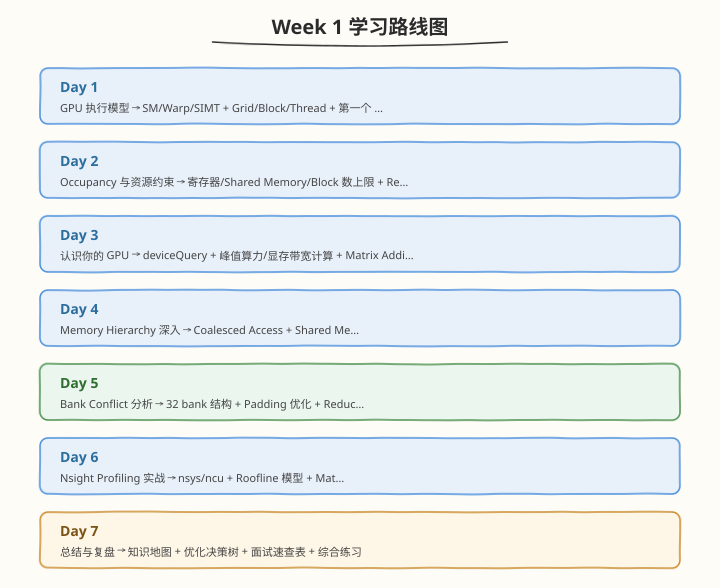

# Week 1：GPU 执行模型与内存基础

> 核心目标：掌握 SM/Warp/SIMT 执行模型、Occupancy 资源约束、Memory Hierarchy、Coalescing/Bank Conflict 与 Nsight Profiling，建立 GPU 性能直觉

| 项目　　　 | 说明　　　　　　　　　　　　　　　　　　　　　　　　　　　　　　　　　　　　　　　　　　　　　　　　　　　　　　　　　　　　　　　　　　　　　　　　　　　　　　　　　　　|
| ------------| -----------------------------------------------------------------------------------------------------------------------------------------------------------------------|
| 前置要求　 | 具备 C/C++ 基础，了解基本数据结构与算法（如双指针）；无需 CUDA 经验　　　　　　　　　　　　　　　　　　　　　　　　　　　　　　　　　　　　　　　　　　　　　　　　　　　 |
| 建议时长　 | 工作日每天 2.5h，周末每天 6h，周计 24.5h　　　　　　　　　　　　　　　　　　　　　　　　　　　　　　　　　　　　　　　　　　　　　　　　　　　　　　　　　　　　　　　 |
| 本周产出　 | hello_gpu / vector_add / relu / matrix_add / transpose / reduction / matmul 等 CUDA Kernel、deviceQuery 与 Occupancy 计算报告、Bank Conflict 对比实验、3+ Nsight 报告、Week 1 学习笔记与面试速查表 |
| 周日里程碑 | 系统复盘 Week 1，建立从"硬件执行模型"到"代码优化"的完整思路链，能用 ncu/nsys 定位 kernel 瓶颈类型（memory-bound / compute-bound / latency-bound）　　　　　　　　　　　 |

---

## 🧭 本周学习地图

---

## 📚 每日学习材料

| Day | 主题 | 目录 |
|-----|------|------|
| Day 1 | GPU 执行模型基础 | [day1/](https://hzchenxiaobin.github.io/ai-infra-notes/week1/day1.html) |
| Day 2 | Occupancy 与资源约束 | [day2/](https://hzchenxiaobin.github.io/ai-infra-notes/week1/day2.html) |
| Day 3 | 认识你的 GPU —— deviceQuery 与 Occupancy 计算 | [day3/](https://hzchenxiaobin.github.io/ai-infra-notes/week1/day3.html) |
| Day 4 | Memory Hierarchy 深入 | [day4/](https://hzchenxiaobin.github.io/ai-infra-notes/week1/day4.html) |
| Day 5 | Bank Conflict 分析与实践 | [day5/](https://hzchenxiaobin.github.io/ai-infra-notes/week1/day5.html) |
| Day 6 | Nsight Profiling 实战 | [day6/](https://hzchenxiaobin.github.io/ai-infra-notes/week1/day6.html) |
| Day 7 | 总结与复盘 | [day7/](https://hzchenxiaobin.github.io/ai-infra-notes/week1/day7.html) |
