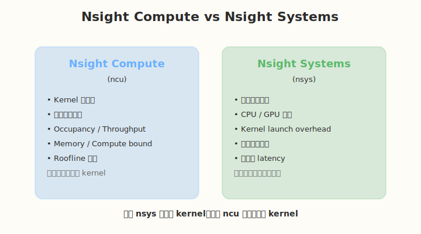
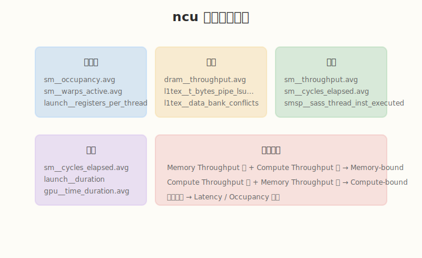
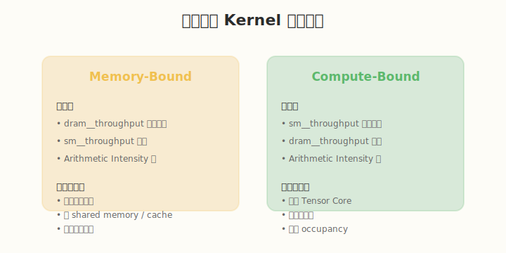
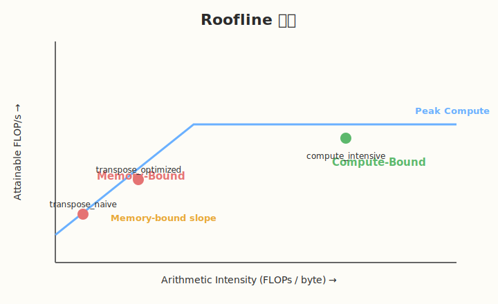

## Day 6：Nsight Profiling 实战

### 🎯 目标

通过今天的学习，你将：

1. 理解 Nsight Compute 和 Nsight Systems 的定位和区别
2. 掌握常用 `ncu` 命令和关键指标
3. 掌握常用 `nsys` 命令和时间线分析
4. 能用 Roofline 模型判断 kernel 瓶颈类型
5. 能对本 week's kernel 进行系统性的 profiling
6. 能写出一份完整的 profiling 报告

> 💡 **为什么重要**：前面的理论学习告诉你"应该怎么做"，而 profiling 告诉你"实际情况是什么"。没有 profiling，优化就是盲人摸象。Nsight 是 AI Infra 工程师的"听诊器"。

---

### 学前导读：为什么需要 profiling

写 CUDA 代码时，我们经常会有各种假设：
- "这个 kernel 应该是 memory-bound"
- "加了 shared memory 应该会更快"
- "这个优化应该能提升 2 倍"

但真实 GPU 执行时，情况可能完全不同。Profiling 的作用就是：
- **验证假设**：实际瓶颈到底在哪里
- **量化性能**：用数字说话，而不是感觉
- **发现隐藏问题**：如 bank conflict、low occupancy、launch overhead 等
- **指导优化方向**：避免在无效方向上浪费时间

**profiling 的黄金法则**：
> 不要猜测，要测量。

---

### 理论学习

#### 6.1 Nsight 工具家族



NVIDIA 提供了两个主要的 profiling 工具：

##### Nsight Compute (`ncu`)

- **粒度**：单个 kernel
- **用途**：分析 kernel 内部的详细硬件指标
- **适用场景**：
 - 判断 kernel 是 memory-bound 还是 compute-bound
 - 查看 occupancy、register usage、shared memory
 - 分析 memory throughput、compute throughput
 - 查看 bank conflict、cache hit rate
 - 生成 Roofline 图

##### Nsight Systems (`nsys`)

- **粒度**：整个应用
- **用途**：分析时间线、CPU/GPU 交互、kernel launch overhead
- **适用场景**：
 - 找到最耗时的 kernel
 - 分析 CPU 和 GPU 的并行情况
 - 查看 kernel launch overhead
 - 分析多个 stream 的并行执行
 - 端到端 latency 分析

**使用流程**：


1. 先用 **nsys** 找到最耗时的 kernel
2. 再用 **ncu** 深入分析该 kernel
3. 根据分析结果优化
4. 重复 profiling 验证效果

#### 6.2 常用 `ncu` 命令

##### 基础命令

```bash
# 基本 profiling，使用默认指标集
ncu ./your_kernel

# 指定单个指标
ncu --metrics sm__occupancy.avg.pct_of_peak_sustained_elapsed ./your_kernel

# 指定多个指标
ncu --metrics \
 sm__occupancy.avg.pct_of_peak_sustained_elapsed,\
 dram__throughput.avg.pct_of_peak_sustained_elapsed,\
 sm__throughput.avg.pct_of_peak_sustained_elapsed \
 ./your_kernel

# 生成完整报告
ncu --set full -o report ./your_kernel

# 用 GUI 打开报告
ncu-ui report.ncu-rep
```

##### 常用指标分类



| 类别 | 指标 | 含义 |
|------|------|------|
| 并行度 | `sm__occupancy.avg.pct_of_peak_sustained_elapsed` | Occupancy 百分比 |
| 并行度 | `sm__warps_active.avg.pct_of_peak_sustained_elapsed` | 活跃 warp 比例 |
| 并行度 | `launch__registers_per_thread` | 每个线程寄存器数 |
| 内存 | `dram__throughput.avg.pct_of_peak_sustained_elapsed` | 显存带宽利用率 |
| 内存 | `l1tex__t_bytes_pipe_lsu_mem_global_op_ld.sum` | Global load 字节数 |
| 内存 | `l1tex__data_bank_conflicts_pipe_lsu_mem_shared_op_ld.sum` | Shared memory load bank conflict |
| 计算 | `sm__throughput.avg.pct_of_peak_sustained_elapsed` | 计算单元利用率 |
| 计算 | `sm__cycles_elapsed.avg` | 执行周期数 |
| 延迟 | `gpu__time_duration.avg` | Kernel 执行时间 |

#### 6.3 常用 `nsys` 命令

```bash
# 基本时间线分析
nsys profile -o timeline ./your_app

# 打开 GUI 查看
nsys-ui timeline.nsys-rep

# 同时采集 CUDA 和 NVTX
nsys profile -o timeline --trace cuda,nvtx,osrt ./your_app

# 只统计 summary
nsys profile --stats=true ./your_app
```

**nsys 时间线重点**：
- `cudaLaunchKernel`：CPU 端 launch kernel 的时间
- `Kernel`：GPU 上实际执行的时间
- `cudaMemcpy`：数据传输时间
- `cudaStreamSynchronize`：同步等待时间

#### 6.4 如何判断瓶颈类型



判断一个 kernel 是 memory-bound 还是 compute-bound 的方法：

**Memory-bound 特征**：
- `dram__throughput.avg.pct_of_peak_sustained_elapsed` 高（接近 80-100%）
- `sm__throughput.avg.pct_of_peak_sustained_elapsed` 低
- Arithmetic Intensity 低

**Compute-bound 特征**：
- `sm__throughput.avg.pct_of_peak_sustained_elapsed` 高
- `dram__throughput.avg.pct_of_peak_sustained_elapsed` 低
- Arithmetic Intensity 高

**Latency-bound 特征**：
- 两者都低
- 可能是 occupancy 太低，或依赖链太长

#### 6.5 Roofline 模型



Roofline 图帮助判断 kernel 是 compute-bound 还是 memory-bound：

```
Attainable FLOP/s = min(Peak FLOP/s, AI * Peak Bandwidth)
```

##### 坐标轴含义

| 坐标轴 | 含义 | 单位 |
|--------|------|------|
| **横轴（X 轴）** | **Arithmetic Intensity（算术强度）** | FLOPs / byte |
| **纵轴（Y 轴）** | **Attainable FLOP/s（可达到的算力）** | FLOP/s 或 GFLOP/s |

- **Arithmetic Intensity (AI)** = FLOPs / bytes，表示每读取 1 字节数据能进行多少次浮点运算。
- **Attainable FLOP/s** 是该 kernel 在当前硬件上能达到的算力上限，由两个天花板决定：
 - **Memory Bandwidth ceiling**：`Achievable FLOP/s = AI × Peak Bandwidth`（斜线部分）
 - **Peak Compute ceiling**：`Achievable FLOP/s = Peak FLOP/s`（水平部分）

##### Ridge Point（山脊点）

两条线的交点叫 **Ridge Point**：

```text
Ridge Point = Peak FLOP/s / Peak Bandwidth
```

以 RTX 5090 为例：

```text
Peak FP32 算力 ≈ 19.5 TFLOP/s
Peak HBM 带宽 ≈ 1.55 TB/s
Ridge Point ≈ 19.5 / 1.55 ≈ 12.6 FLOP/Byte
```

- **AI < Ridge Point** → **memory-bound**（位于斜线区域，算力喂不饱，瓶颈在带宽）
- **AI > Ridge Point** → **compute-bound**（位于平顶区域，数据充足，瓶颈在算力）

##### 如何用 Roofline 指导优化

- 如果点在斜线区域：优化内存访问（coalescing、shared memory、减少读写）
- 如果点在平顶区域：优化计算（Tensor Core、指令优化）
- 如果点离平顶很远：还有很大优化空间

#### 6.6 ncu 结果分析实例：以 `bank_conflict` 为例

下面演示拿到 ncu 指标后，如何一步步定位到 bank conflict 瓶颈。

**Step 1：运行 ncu**

```bash
cd /Users/chenbinbin/GitHub/aiinfra/week1/day5
nvcc -o kernels/bank_conflict kernels/bank_conflict.cu

ncu --metrics \
 l1tex__data_bank_conflicts_pipe_lsu_mem_shared_op_ld.sum,\
 l1tex__data_bank_conflicts_pipe_lsu_mem_shared_op_st.sum,\
 sm__cycles_elapsed.avg,\
 sm__throughput.avg.pct_of_peak_sustained_elapsed,\
 dram__throughput.avg.pct_of_peak_sustained_elapsed,\
 sm__occupancy.avg.pct_of_peak_sustained_elapsed \
 ./kernels/bank_conflict
```

**Step 2：假设看到的数据**

| Kernel | cycles | bank conflicts (load) | sm__throughput | dram__throughput | occupancy |
|--------|--------|----------------------|----------------|------------------|-----------|
| `conflict_read` | 12,800 | 1,048,576 | 18% | 45% | 75% |
| `no_conflict_read` | 3,200 | 0 | 55% | 48% | 75% |

**Step 3：分析过程**

1. **cycle 数**：`conflict_read` 慢 4 倍，说明有明显性能问题。
2. **occupancy**：两者都是 75%，排除并行度不足。
3. **throughput**：`conflict_read` 的 `sm__throughput` 只有 18%，远低于 `no_conflict_read` 的 55%，说明 SM 计算单元大量空闲。
4. **bank conflict**：`conflict_read` 有 1,048,576 次 load bank conflict，而 `no_conflict_read` 为 0。
5. **DRAM throughput**：两者接近（~45-48%），说明 global memory 不是瓶颈。

**结论**：`conflict_read` 的瓶颈是 shared memory bank conflict，导致 shared memory 访问被串行化，SM 大量时间花在等待数据上。

**验证**：把 `tile[TILE_DIM][TILE_DIM]` 改成 `tile[TILE_DIM][TILE_DIM + 1]`（padding），重新编译并跑同样 ncu 命令，预期 bank conflict 接近 0，cycle 数大幅下降。

**通用分析流程**

拿到 ncu 结果后，建议按这个顺序看：

1. `sm__cycles_elapsed.avg` —— 谁慢、慢多少
2. `sm__occupancy` —— 排除 occupancy 问题
3. `sm__throughput` vs `dram__throughput` —— 判断 compute-bound / memory-bound
4. 具体 stall / conflict 指标 —— 定位根因
5. 修改代码 → 重新编译 → 重新 ncu → 对比验证

---

### Coding 任务：本周 kernel profiling

#### 任务 1：profiling hello_gpu

```bash
cd /Users/chenbinbin/GitHub/aiinfra/week1
nvcc -o kernels/hello_gpu kernels/hello_gpu.cu
nsys profile -o profiles/day1_hello_gpu_timeline ./kernels/hello_gpu
```

**观察重点**：
- `cudaLaunchKernel` 的 CPU 耗时
- kernel 在 GPU 上的实际执行时长
- 多个 block 是否并行执行

#### 任务 2：profiling occupancy_test

```bash
ncu \
 --metrics \
 sm__occupancy.avg.pct_of_peak_sustained_elapsed,\
 launch__registers_per_thread,\
 launch__shared_mem_per_block_static,\
 sm__throughput.avg.pct_of_peak_sustained_elapsed \
 ./kernels/occupancy_test
```

**观察重点**：
- 实际 occupancy
- 每个线程寄存器数
- 计算单元利用率

#### 任务 3：profiling transpose

```bash
ncu \
 --metrics \
 dram__throughput.avg.pct_of_peak_sustained_elapsed,\
 l1tex__t_bytes_pipe_lsu_mem_global_op_ld.sum,\
 l1tex__t_bytes_pipe_lsu_mem_global_op_st.sum,\
 sm__cycles_elapsed.avg \
 ./kernels/transpose
```

**观察重点**：
- naive 和 optimized 版本的 dram throughput 差异
- global memory read/write 数据量
- 执行 cycle 数

#### 任务 4：profiling bank_conflict

```bash
ncu \
 --metrics \
 l1tex__data_bank_conflicts_pipe_lsu_mem_shared_op_ld.sum,\
 l1tex__data_bank_conflicts_pipe_lsu_mem_shared_op_st.sum,\
 sm__cycles_elapsed.avg \
 ./kernels/bank_conflict
```

**观察重点**：
- conflict 和 no-conflict 版本的 bank conflict 计数
- 执行 cycle 差异

#### 任务 5：LeetGPU 在线题目 —— Matrix Multiplication

**题目链接**：<https://leetgpu.com/challenges/matrix-multiplication>

**题目概述**：

给定 M×K 矩阵 A 和 K×N 矩阵 B（行优先存储），计算 C = A × B，其中 C 为 M×N 矩阵，C[i][j] = Σ(A[i][k] * B[k][j])。

**约束条件**：`1 ≤ M, N, K ≤ 1024`，矩阵元素范围 `[-1.0, 1.0]`

**难度**：中等　**标签**：CUDA、GEMM、Shared Memory Tiling、Roofline、Profiling

**与今日知识的关联**：

本题是 GEMM 的基础版，适合用 ncu 做完整 profiling。用 Day 6 学的 Nsight Compute 分析 SM throughput、memory throughput、occupancy，画出 Roofline 图，判断 kernel 是 memory-bound 还是 compute-bound。

**解题思路**：

先用 naive GEMM（每线程算一个元素）作为 baseline，然后加 Shared Memory Tiling 优化。用 ncu --set full 生成完整报告，对比两个版本的关键指标。

**参考实现**：

```cuda
#define TILE_SIZE 16

// Naive baseline
__global__ void matmul_naive(const float* A, const float* B, float* C, int M, int N, int K) {
    int row = blockIdx.y * blockDim.y + threadIdx.y;
    int col = blockIdx.x * blockDim.x + threadIdx.x;
    if (row < M && col < N) {
        float sum = 0.0f;
        for (int k = 0; k < K; k++)
            sum += A[row * K + k] * B[k * N + col];
        C[row * N + col] = sum;
    }
}

// Shared Memory Tiling 优化版
__global__ void matmul_tiled(const float* A, const float* B, float* C, int M, int N, int K) {
    __shared__ float s_A[TILE_SIZE][TILE_SIZE];
    __shared__ float s_B[TILE_SIZE][TILE_SIZE];

    int row = blockIdx.y * TILE_SIZE + threadIdx.y;
    int col = blockIdx.x * TILE_SIZE + threadIdx.x;
    float sum = 0.0f;

    for (int bk = 0; bk < K; bk += TILE_SIZE) {
        // 协作加载 tile
        if (row < M && bk + threadIdx.x < K)
            s_A[threadIdx.y][threadIdx.x] = A[row * K + bk + threadIdx.x];
        else
            s_A[threadIdx.y][threadIdx.x] = 0.0f;

        if (bk + threadIdx.y < K && col < N)
            s_B[threadIdx.y][threadIdx.x] = B[(bk + threadIdx.y) * N + col];
        else
            s_B[threadIdx.y][threadIdx.x] = 0.0f;
        __syncthreads();

        #pragma unroll
        for (int k = 0; k < TILE_SIZE; k++)
            sum += s_A[threadIdx.y][k] * s_B[k][threadIdx.x];
        __syncthreads();
    }

    if (row < M && col < N)
        C[row * N + col] = sum;
}
```

> 💡 提交后在 [LeetGPU Matrix Multiplication 题目](https://leetgpu.com/challenges/matrix-multiplication)上记录通过耗时，用 ncu 对比不同 block size / tile size 的性能差异。完整题解见 [Matrix Multiplication 题解](../../../../leetgpu/week1/day6/leetgpu-matrix-multiplication-solution.md)。

#### 任务 6：LeetCode 面试题 —— 全排列

**题目链接**：[46. 全排列](https://leetcode.cn/problems/permutations/)

**题目概述**：

给定不含重复数字的整数数组 `nums`，返回其所有可能的全排列。

**与今日知识的关联**：

本题核心是**回溯法**——递归选择/撤销选择，用 `used` 数组标记已选元素。这与今天 Profiling 的"Profile → 优化 → 重新 Profile 验证"闭环思路呼应：回溯是"选一条路走到底，不行就退回换一条"，profiling 优化是"试一种优化，ncu 验证不行就退回换另一种"——都是**试探 + 回退 + 换路径**的搜索模式。

**核心套路**：

```
backtrack(path, used):
 if path.size()==n: 记录结果; return
 for i in 0..n-1:
 if not used[i]: used[i]=true; path.add(nums[i]); backtrack(...); path.pop(); used[i]=false
```

> 💡 完整题解（含 C++/Python 参考代码、复杂度分析、面试要点）见 [全排列题解](../../../../leetcode/daily/week1/day6/全排列.md)。

---

### 扩展实验

#### 实验 1：生成完整 ncu 报告

对每个 kernel 生成完整报告：

```bash
ncu --set full -o profiles/day6_hello_gpu ./kernels/hello_gpu
ncu --set full -o profiles/day6_occupancy_test ./kernels/occupancy_test
ncu --set full -o profiles/day6_transpose ./kernels/transpose
ncu --set full -o profiles/day6_bank_conflict ./kernels/bank_conflict
```

用 ncu-ui 打开，阅读每个指标的详细说明。

#### 实验 2：绘制 Roofline 图

手动计算每个 kernel 的：
- FLOPs
- Bytes
- Arithmetic Intensity

然后在 Roofline 图上标出位置。可以使用 ncu 的 Roofline 图，也可以自己用 matplotlib 绘制。

#### 实验 3：分析 kernel launch overhead

用 nsys 查看：
- `cudaLaunchKernel` 到 kernel 开始执行的时间
- 这个时间占整个应用时间的比例
- 思考如何减少 launch overhead（如 CUDA Graph）

### 验证 Checklist

- [ ] 生成至少 3 个 kernel 的 Nsight Compute 报告
- [ ] 生成至少 1 个 Nsight Systems 时间线报告
- [ ] 能读取 Roofline 图并定位瓶颈类型
- [ ] 能判断 kernel 是 memory-bound / compute-bound / latency-bound
- [ ] 记录各 kernel 的 throughput 和 occupancy
- [ ] 整理 profiling 结果到 [profiles/week1_profile_summary.md](../profiles/week1_profile_summary.md)

---

### 今日总结

Day 6 我们学会了用专业工具分析 GPU 性能：

1. **Nsight Systems (**`nsys`**)**：应用级时间线分析，找耗时 kernel
2. **Nsight Compute (**`ncu`**)**：kernel 级详细指标分析
3. **核心指标**：occupancy、memory throughput、compute throughput、bank conflict
4. **瓶颈判断**：memory-bound、compute-bound、latency-bound
5. **Roofline 模型**：用 arithmetic intensity 判断优化方向
6. **工作流程**：nsys 定位 → ncu 深入 → 优化 → 再验证

掌握这些后，你就不再是"凭感觉优化"，而是"用数据驱动优化"。

---

### 面试要点

1. **如何判断一个 kernel 是 memory-bound 还是 compute-bound？**

<details>
<summary>点击查看答案</summary>

 - 看 `dram__throughput` 和 `sm__throughput`
 - Memory-bound：memory throughput 高，compute throughput 低
 - Compute-bound：compute throughput 高，memory throughput 低
 - 也可以用 Roofline 模型：AI 低则 memory-bound，AI 高则 compute-bound

</details>


2. **Nsight Compute 和 Nsight Systems 的区别？**

<details>
<summary>点击查看答案</summary>

 - Nsight Compute：kernel 级详细指标
 - Nsight Systems：应用级时间线，看 CPU/GPU 交互和整体流程

</details>


3. **Roofline 模型如何指导优化？**

<details>
<summary>点击查看答案</summary>

 - 如果点在斜线区域（memory-bound）：优化内存访问
 - 如果点在平顶区域（compute-bound）：优化计算
 - 目标是让点尽量接近屋顶

</details>


4. **常用的 ncu 指标有哪些？**

<details>
<summary>点击查看答案</summary>

 - `sm__occupancy.avg.pct_of_peak_sustained_elapsed`
 - `dram__throughput.avg.pct_of_peak_sustained_elapsed`
 - `sm__throughput.avg.pct_of_peak_sustained_elapsed`
 - `l1tex__data_bank_conflicts_pipe_lsu_mem_shared_op_ld.sum`

</details>


5. **nsys 时间线能看到什么？**

<details>
<summary>点击查看答案</summary>

 - Kernel launch overhead
 - CPU 和 GPU 的执行时间线
 - CUDA API 调用顺序
 - 多个 stream 的并行情况

---

</details>

