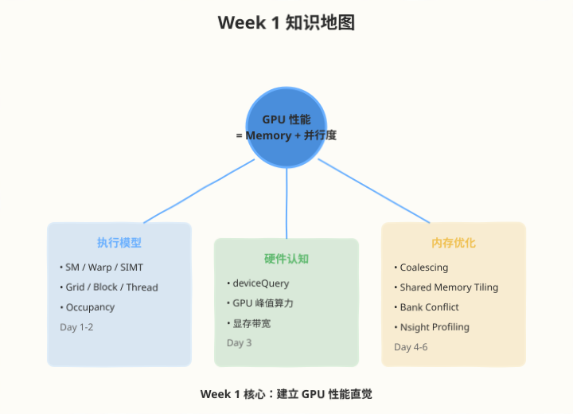
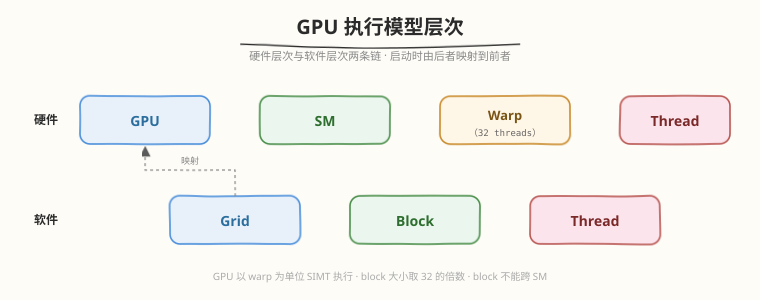
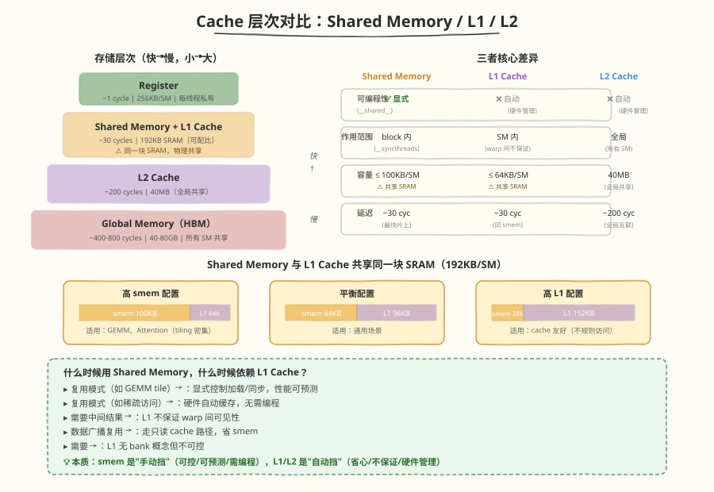
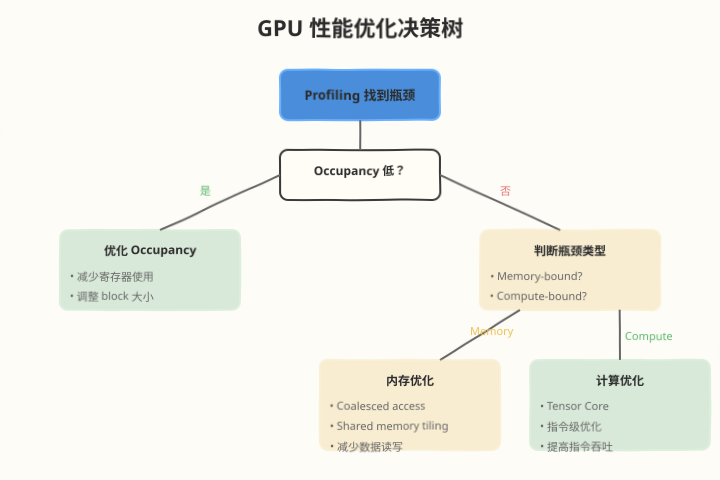
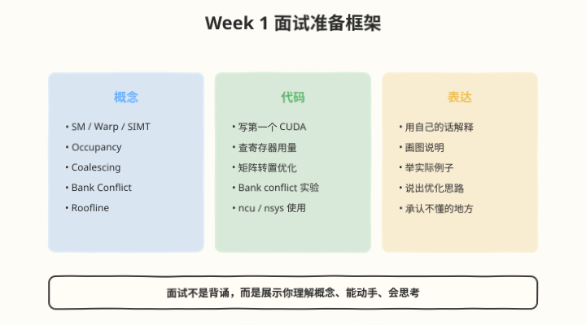

## Day 7：总结与复盘

### 🎯 目标

通过今天的学习，你将：

1. 系统梳理 Week 1 的所有核心知识点
2. 建立从"硬件执行模型"到"代码优化"的完整思路链
3. 整理出一份可复用的学习笔记和面试速查表
4. 发现本周学习中的薄弱环节，制定补漏计划
5. 为 Week 2 的 GEMM 优化做好准备

> 💡 **为什么重要**：Week 1 是整个 10 周计划的基石。如果 GPU 执行模型和内存层次理解不牢，后续 GEMM、Attention、推理系统都会吃力。Day 7 不是休息，而是把碎片知识连成网络。

---

### Week 1 知识地图



Week 1 的核心主线：

```
GPU 性能 = Memory + 并行度
```

围绕这个公式，我们学习了三大模块：

| 模块 | 天数 | 核心内容 |
|------|------|---------|
| 执行模型 | Day 1-2 | SM、Warp、SIMT、Grid/Block/Thread、Occupancy |
| 硬件认知 | Day 3 | deviceQuery、GPU 峰值算力、显存带宽 |
| 内存优化 | Day 4-6 | Coalescing、Shared Memory Tiling、Bank Conflict、Nsight Profiling |

---

### 核心概念串讲

#### 1. GPU 执行模型

**一句话**：GPU 以 warp 为单位执行 SIMT，一个 warp 32 个线程必须执行相同指令。

**关键概念链**：


**性能启示**：
- 避免 warp divergence
- block 大小取 32 的倍数
- 理解 block 不能跨 SM

#### 2. Occupancy

**一句话**：Occupancy 衡量 SM 上同时活跃的 warp 比例，影响延迟隐藏能力。

**三大资源约束**：
- 寄存器数量
- 共享内存数量
- Block / warp 数量上限

**性能启示**：
- 不必追求 100% occupancy
- 寄存器过多会降低 occupancy
- Register spilling 会急剧降低性能

#### 3. 内存层次

**从快到慢**：
```
Register < Shared Memory < L1 Cache < L2 Cache < Global Memory
~1 cycle < ~30 cycles < ~30 cycles < ~200 cycles < ~400-800 cycles
```

**性能启示**：
- 多用 register 和 shared memory
- 减少 global memory 访问
- 让 global memory 访问 coalesced

##### Shared Memory / L1 / L2 Cache 深度对比



这三者是 GPU 存储层次中最容易混淆的部分。下表从 7 个维度做深度对比：

| 维度 | Shared Memory | L1 Cache | L2 Cache |
|------|--------------|----------|----------|
| **物理位置** | 每 SM 内（SRAM） | 每 SM 内（与 smem 共享同一块 SRAM） | 全局共享（所有 SM 可见） |
| **可编程性** | ✅ 显式管理（`__shared__`） | ❌ 硬件自动管理 | ❌ 硬件自动管理 |
| **容量（RTX 5090）** | 0-100KB / SM（可配） | 与 smem 共享 100KB SRAM | 96MB（全局共享） |
| **访问延迟** | ~30 cycles | ~30 cycles | ~200 cycles |
| **带宽** | ~128 bytes/cycle/SM | ~128 bytes/cycle/SM | 远低于 smem/L1（全局互联） |
| **一致性范围** | block 内（`__syncthreads` 保证可见） | SM 内（warp 间不保证） | 全局（所有 SM 可见） |
| **典型用途** | 确定要复用的数据（tiling、reduce 中转） | 偶发复用、自动缓存 global 访问 | 跨 block / 跨 SM 数据共享 |

**关键关系：Shared Memory 与 L1 Cache 共享同一块 SRAM**

RTX 5090 每 SM 有 **100KB SRAM**（smem/L1 共享口径，见 [硬件参数事实源](../../reference/hardware_specs.md)），可通过 `cudaFuncSetAttribute` 配置 smem/L1 比例：
```cuda
// carveout 是百分比：100 = 尽量把 100KB SRAM 全划给 shared memory
cudaFuncSetAttribute(kernel, cudaFuncAttributePreferredSharedMemoryCarveout, 100);
```

| 配置 | Shared Memory | L1 Cache | 适用场景 |
|------|--------------|----------|---------|
| 高 smem | ~100KB | 剩余少量 | tiling 密集（GEMM、Attention） |
| 平衡 | ~64KB | ~36KB | 通用 |
| 高 L1 | ~28KB | ~72KB | cache 友好（不规则访问） |

**什么时候用 Shared Memory，什么时候依赖 L1 Cache？**

| 场景 | 选择 | 原因 |
|------|------|------|
| 数据复用模式**确定**（如 GEMM 的 tile） | Shared Memory | 显式控制加载/同步，可预测性能 |
| 数据复用模式**不确定**（如稀疏访问） | L1 Cache | 硬件自动缓存，无需编程 |
| 需要**跨 warp 共享**中间结果 | Shared Memory | L1 不保证 warp 间可见性 |
| **只读**数据的广播复用 | L1 Cache + `__ldg` | `__ldg` 走只读 cache 路径，省 smem |
| 需要**避免 bank conflict** | Shared Memory + padding | L1 无 bank 概念，但也不可控 |

**性能启示**：
- Shared Memory 可控但需手动管理（加载、同步、bank conflict）
- L1 Cache 省心但不保证命中，性能不可预测
- 两者物理共享，配比要权衡：smem 多了 L1 小，反之亦然
- **经验法则**：确定要复用的数据用 smem，不确定的依赖 L1

> 💡 **一句话总结**：Shared Memory 是"手动挡"（可控、可预测、需编程），L1/L2 Cache 是"自动挡"（省心、不保证、硬件管理）。GEMM/Attention 等高性能 kernel 必须用 Shared Memory 做显式 tiling，因为自动 cache 无法保证 tile 数据驻留。

#### 4. Coalescing 与 Bank Conflict

| 特性 | Coalescing | Bank Conflict |
|------|-----------|---------------|
| 发生位置 | Global Memory | Shared Memory |
| 优化目标 | 连续地址访问 | 不同 bank 访问 |
| 检测工具 | ncu memory throughput | ncu bank conflict 指标 |
| 解决方法 | 调整索引顺序 | Padding |

**性能启示**：
- Coalescing 提高 global memory 带宽利用率
- 避免 bank conflict 提高 shared memory 访问速度
- 矩阵转置是同时练习两者的经典例子

#### 5. Profiling

**一句话**：先用 nsys 找耗时 kernel，再用 ncu 分析该 kernel。

**瓶颈判断**：
- Memory-bound：`dram__throughput` 高
- Compute-bound：`sm__throughput` 高
- Latency-bound：两者都低

---

### GPU 性能优化决策树



面对一个性能问题，按以下流程思考：

1. **先 profiling**：不要猜测，用数据说话
2. **看 occupancy**：如果低，先优化 occupancy
3. **判断瓶颈**：memory-bound 还是 compute-bound
4. **针对性优化**：
 - Memory-bound → coalescing、shared memory、减少读写
 - Compute-bound → Tensor Core、指令优化
5. **再 profiling**：验证优化效果

---

### 总结任务

#### 任务 1：完成 Week 1 学习笔记

更新 [notes/week1_notes.md](../notes/week1_notes.md)，建议包含以下内容：

~~~~markdown
# Week 1 学习笔记

## 1. GPU 执行模型
- SM：
- Warp：
- SIMT：
- Grid/Block/Thread：

## 2. 内存层次
| 类型 | 延迟 | 容量 | 可编程 |
|------|------|------|--------|
| Register | | | |
| Shared Memory | | | |
| L1 Cache | | | |
| L2 Cache | | | |
| Global Memory | | | |

## 3. Occupancy
- 定义：
- 影响因素：
- 优化方法：

## 4. Coalescing
- 定义：
- 写出 coalesced 代码的关键：

## 5. Bank Conflict
- 定义：
- 解决方法：

## 6. Nsight 常用命令
```bash
ncu --metrics ...
nsys profile -o ...
```

## 7. 本周实验记录
| Kernel | Occupancy | Memory Throughput | Compute Throughput | 瓶颈 |
|--------|-----------|-------------------|-------------------|------|
| | | | | |

## 8. 面试问题自测
- Q: 什么是 SIMT？
- A:
~~~~

#### 任务 2：整理面试题库

针对每个核心概念，准备一个"30 秒回答版本"。下方每个问题都配了完整答案，**先自己默想再点开核对**，能复述 80% 算过关。

---

### 面试问题自测（点击展开答案）

> 用法：先在脑中默想答案，再点击"显示答案"核对。打不开说明你对这个点还不熟，回到对应 Day 复习。

#### Q1：什么是 SIMT？

<details>
<summary>📖 显示答案</summary>

**SIMT（Single Instruction, Multiple Threads）** 是 GPU 的执行模型：硬件把 32 个线程组成一个 warp，同一 warp 内所有线程在**同一时刻执行同一条指令**，但各自操作不同的数据。

- 类比 CPU 的 SIMD（如 AVX），但 SIMT 的"向量化"由硬件自动完成，程序员写的是标量代码
- 与 SIMD 的区别：SIMT 允许 warp 内分支（warp divergence），但有分支的线程会被串行化；SIMD 通常不支持分支
- **性能启示**：避免 warp divergence（if 条件让 warp 内线程走不同路径），block 大小取 32 的倍数

参见 [Day 1](../day1/README.md)、[Day 2](../day2/README.md)。

</details>

#### Q2：什么是 warp divergence？如何避免？

<details>
<summary>📖 显示答案</summary>

**Warp divergence** 指同一 warp 内的线程因 `if/else` 分支走向不同路径，硬件被迫**串行执行各分支**，导致并行度下降。

```
if (threadIdx.x < 16) { A分支 } // lane 0-15 走 A
else { B分支 } // lane 16-31 走 B
// 硬件先让 0-15 执行 A（16-31 空闲），再让 16-31 执行 B（0-15 空闲）
// 总时间 = A + B，而非 max(A, B)
```

**避免方法**：
1. 调整数据布局让 warp 内分支一致（如按阈值重排数据）
2. 把分支条件改成位运算或三元运算（`pred ? x : y` 编译为 `selp` 指令，无 divergence）
3. 把会发散的计算拆成多个 kernel，每个处理一个分支
4. 实在无法避免时，让两条分支工作量尽量均衡

参见 [Day 1](../day1/README.md)。

</details>

#### Q3：什么是 occupancy？越高越好吗？

<details>
<summary>📖 显示答案</summary>

**Occupancy** = SM 上**实际活跃的 warp 数** / SM **最大可容纳 warp 数**。它衡量 SM 的"装满程度"，直接影响延迟隐藏能力（更多 warp → 更多候选指令掩盖访存延迟）。

**三大资源约束**（哪个先耗尽哪个就是瓶颈）：
1. **寄存器**：每线程用 255 个寄存器，每 SM 64K 个 → 线程数上限 = 64K / 255 ≈ 256
2. **Shared Memory**：每 SM 100KB（RTX 5090），block 用多少 smem 决定能放几个 block
3. **Block / Warp 数上限**：每 SM 最多 24 个 block 或 48 个 warp（RTX 5090）

**不是越高越好**：
- Occupancy 只是"候选 warp 数"，真正起作用的是"能掩盖延迟的 warp 数"
- 50% occupancy 通常已足够掩盖大多数访存延迟
- **盲目追求 100% 可能反而降性能**：为提 occupancy 而减少每线程寄存器，可能触发 register spilling（寄存器溢出到 local memory，延迟激增）
- 经验法则：先保证不 spilling，再考虑 occupancy

参见 [Day 2](../day2/README.md)。

</details>

#### Q4：什么是 coalesced access？

<details>
<summary>📖 显示答案</summary>

**Coalesced access**（合并访问）指一个 warp 的 32 个线程在**同一时刻访问连续的内存地址**，硬件会把这 32 次访问**合并成 1 个（或少数几个）内存事务**，最大化全局内存带宽利用率。

```
// ✅ Coalesced：warp 内线程访问连续地址
A[threadIdx.x] // lane 0→A[0], lane 1→A[1], ..., lane 31→A[31]
 // 合并为 1 个 128-byte 事务

// ❌ Stride 访问：warp 内线程跨步访问
A[threadIdx.x * N] // lane 0→A[0], lane 1→A[N], ...
 // 32 个独立事务，带宽利用率 1/32
```

**关键规则**：
- 一个 warp 的 32 次访问若落在同一个 128-byte 对齐段内 → 1 个事务
- 跨多个段 → 多个事务，浪费带宽
- **读写都受影响**（不仅读，写也要 coalesced）

**矩阵存储顺序的影响**：行优先矩阵按行访问 coalesced，按列访问 stride → 这就是矩阵转置要先用 shared memory 的原因。

参见 [Day 4](../day4/README.md)。

</details>

#### Q5：什么是 bank conflict？如何解决？

<details>
<summary>📖 显示答案</summary>

**Bank conflict** 发生在 shared memory 访问时：一个 warp 内多个线程**同时访问同一个 bank 的不同地址**，导致访问被串行化。

**Shared Memory 的 bank 结构**：
- 共 32 个 bank，每 bank 宽 4 字节（一个 float）
- 地址 `addr` 所在 bank = `(addr / 4) % 32`
- 理想情况：warp 内 32 线程访问 32 个不同 bank → 1 个周期完成
- 冲突情况：2 线程落同 bank 不同地址 → 2-way conflict → 2 周期；n-way → n 周期
- **例外**：多线程访问**同一地址**（broadcast）不算 conflict

**典型场景**：矩阵按列读取
```cuda
__shared__ float tile[32][32];
// 按列读：tile[threadIdx.x][i]，32 线程都在 bank 0 → 32-way conflict
```

**解决方法：Padding**
```cuda
__shared__ float tile[32][33]; // 列维度 +1 padding
// 行 stride 从 32×4=128B 变成 33×4=132B，132/4=33，33%32=1，相邻行错开 bank
```

**注意**：padding 会浪费一点 shared memory，需评估是否影响 occupancy。对 16×16 方形 tile + block(16,16) 配置，warp 跨相邻两行且 broadcast，实际不触发 conflict（详见 [matmul 题解](https://hzchenxiaobin.github.io/leetgpu/leetgpu-matrix-multiplication-solution.html) 的 bank conflict 分析）。

参见 [Day 4](../day4/README.md)、[Day 5](../day5/README.md)。

</details>

#### Q6：如何判断 kernel 是 memory-bound 还是 compute-bound？

<details>
<summary>📖 显示答案</summary>

**两种方法：理论计算 + ncu 实测**

**方法 1：理论 Roofline**
```
Arithmetic Intensity (AI) = FLOPs / Bytes
Ridge Point = Peak FLOP/s / Peak Bandwidth （RTX 5090 ≈ 58.45 FLOP/Byte）
- AI < Ridge Point → memory-bound
- AI > Ridge Point → compute-bound
```
例：矩阵加法 AI = 1 FLOP / 12 Byte ≈ 0.083 << 58.45 → memory-bound
例：大 GEMM AI ≈ 85 > 58.45 → compute-bound

**方法 2：ncu 实测指标**

| 指标 | memory-bound | compute-bound | latency-bound |
|------|-------------|--------------|--------------|
| `dram__throughput` | 高（接近峰值） | 低 | 低 |
| `sm__throughput` | 低 | 高（接近峰值） | 低 |

两者都低 → latency-bound（指令依赖或 occupancy 不足）。

**实战流程**：
1. 先用 `nsys` 找耗时最长的 kernel
2. 用 `ncu --metrics dram__throughput,sm__throughput` 看两个利用率
3. 哪个高就是哪个 bound；都低则是 latency-bound

参见 [Day 6](../day6/README.md)。

</details>

#### Q7：ncu 和 nsys 的区别？

<details>
<summary>📖 显示答案</summary>

两者是互补的，分工明确：

| 维度 | Nsight Systems (nsys) | Nsight Compute (ncu) |
|------|----------------------|----------------------|
| **粒度** | 系统级 / 时间线级 | Kernel 级 / 指令级 |
| **看什么** | kernel 排序、launch 间隙、CPU/GPU 时序、多 stream | 单 kernel 的 occupancy、throughput、stall reasons、source view |
| **典型用法** | 找最耗时的 kernel、看 kernel 间是否有 gap | 分析某 kernel 为什么慢、瓶颈在哪 |
| **开销** | 小（可采整个程序） | 大（每 kernel 重复跑多次） |
| **输出** | `.nsys-rep` 时间线 | `.ncu-rep` 详细报告 |

**标准流程**：
```
nsys profile → 找 top3 耗时 kernel → ncu 分析这几个 kernel → 优化 → 回到 nsys 验证
```

**误区**：不要一上来就 ncu——它的开销大，且如果选错了 kernel（不是瓶颈），分析再细也没用。先 nsys 定位，再 ncu 深挖。

参见 [Day 6](../day6/README.md)。

</details>

#### Q8：什么是 Roofline 模型？

<details>
<summary>📖 显示答案</summary>

**Roofline 模型**用一个二维图把 kernel 的性能上限可视化：横轴是**算术强度 AI（FLOP/Byte）**，纵轴是**可达算力（FLOP/s）**，由两条线围成"屋顶"：

```
可达算力 = min(Peak Bandwidth × AI, Peak FLOP/s)
 = min(内存带宽线, 算力天花板)
```

- **左斜坡段**（AI < Ridge Point）：受内存带宽限制 → memory-bound，提升靠减少访存
- **右平顶段**（AI ≥ Ridge Point）：受算力限制 → compute-bound，提升靠 Tensor Core / 更多 ILP

**Ridge Point** = Peak FLOP/s / Peak Bandwidth（RTX 5090 FP32 ≈ 104.75T / 1.792T ≈ 58.45 FLOP/Byte）

**用途**：
1. 判断 kernel 瓶颈类型（把 kernel 的 AI 标在图上，看落在斜坡还是平顶）
2. 评估优化天花板（看距离屋顶多远）
3. 选择优化方向（斜坡段 → 减少访存；平顶段 → 提升算力）

**局限**：不考虑 cache 命中、latency-bound（两者都未达屋顶），是"上界估计"非精确预测。

参见 [Day 6](../day6/README.md)。

</details>

#### Q9：Shared Memory 和 L1 Cache 的关系？

<details>
<summary>📖 显示答案</summary>

在物理上，**Shared Memory 和 L1 Cache 共享同一块 SRAM**（RTX 5090 上每 SM 100KB，smem/L1 共享口径，用 `cudaFuncSetAttribute` 调配两者比例，见 [硬件参数事实源](../../reference/hardware_specs.md)）。

| 维度 | Shared Memory | L1 Cache |
|------|--------------|----------|
| **可编程** | ✅ 程序员显式管理（`__shared__`） | ❌ 硬件自动管理（缓存 global 访问） |
| **访问粒度** | 4-byte bank | cache line（128B） |
| **延迟** | ~30 cycles | ~30 cycles |
| **适用场景** | 确定要复用的数据（tiling） | 不确定复用但希望加速的访问 |
| **Bank conflict** | 有 | 无（硬件自动映射） |

**启示**：
- 确定要复用的数据用 shared memory（可控、可预测）
- 偶发的复用依赖 L1 cache（无需编程，但不保证命中）
- 两者物理共享，配比要权衡（smem 多了 L1 小，反之亦然）

参见 [Day 2](../day2/README.md)、[Day 5](../day5/README.md)。

</details>

#### Q10：为什么 block 不能跨 SM？这个限制带来什么后果？

<details>
<summary>📖 显示答案</summary>

**为什么不能跨 SM**：block 内线程通过 `__syncthreads()` 同步、通过 shared memory 共享数据，这些都依赖**同一 SM 内的硬件机制**（共享寄存器堆、shared memory bank、同步屏障）。跨 SM 同步需要全局互联，代价极高，所以 CUDA 规定 block 一旦调度到某 SM 就不迁移。

**带来的后果**：
1. **Block 内 shared memory 不共享**：不同 block 间通信必须走 global memory（慢）
2. **Grid 必须能拆成独立 block**：block 间不能有数据依赖（否则死锁），这对算法设计是强约束
3. **Block 数 ≥ SM 数才能利用满 GPU**：否则有 SM 空闲
4. `__syncthreads()` **只同步 block 内线程**：没有全局同步原语（kernel 结束是隐式全局同步）
5. **Occupancy 受 block 大小影响**：block 太大（如 1024 线程）会让每 SM 只能放 1 个 block，occupancy 低

**何时需要跨 block 同步**：用 cooperative groups（`cudaLaunchCooperativeKernel`）或拆成多个 kernel（用 global memory 传中间结果）。

参见 [Day 1](../day1/README.md)、[Day 2](../day2/README.md)。

</details>

#### 任务 3：补完未完成的实验

对照 Week 1 完成标准，检查哪些还没做：

- [ ] 完成 4 个基础 CUDA kernel 编写与运行
- [ ] 完成 1 个 bank conflict 对比实验
- [ ] 生成 3+ Nsight Compute 报告
- [ ] 完成 [notes/week1_notes.md](../notes/week1_notes.md) 学习笔记
- [ ] 能用自己的话解释：SM、Warp、Occupancy、Coalescing、Bank Conflict
- [ ] 能使用 Nsight 定位 kernel 瓶颈类型

#### 任务 4：绘制关键图表

即使不提交，也建议手绘或在纸上画出：
1. GPU 内存层次结构图
2. SM 架构简图
3. Grid/Block/Thread 关系图
4. Coalesced vs Stride 访问示意图
5. Occupancy 与性能关系图
6. Roofline 简图

画图是检验理解深度的最好方法。

---

### LeetGPU 综合练习

Week 1 每天都做了一道 LeetGPU 题目，今天用两道**综合练习**把全部概念串起来检验。下表先回顾本周已做的 6 道题，再给出 Day 7 综合练习。

#### 本周 LeetGPU 题目回顾

本周 6 天共布置 6 道题（每天一道、互不重复），Matrix Transpose 的正式布置在 Day 4：

| Day | 题目 | 核心考点 | 状态 |
|-----|------|---------|------|
| Day 1 | [Vector Addition](https://leetgpu.com/challenges/vector-addition) | 1D grid/block、global_tid 映射 | ✅ 已做 |
| Day 2 | [ReLU](https://leetgpu.com/challenges/relu) | memory-bound、occupancy 调优 | ✅ 已做 |
| Day 3 | [Matrix Addition](https://leetgpu.com/challenges/matrix-addition) | block 形状调参、occupancy 实测 | ✅ 已做 |
| Day 4 | [Matrix Transpose](https://leetgpu.com/challenges/matrix-transpose) | coalescing + shared memory tiling + bank conflict | ✅ 已做 |
| Day 5 | [Reduction](https://leetgpu.com/challenges/reduction) | warp shuffle、两级归约、divergence | ✅ 已做 |
| Day 6 | [Matrix Multiplication](https://leetgpu.com/challenges/matrix-multiplication) | 2D 索引、ncu profiling、Roofline 定位 | ✅ 已做 |

#### 任务 3：本周 LeetCode 题目回顾（10 周计划 · 第 1 周）

本周 LeetCode 题目对应 [10 周算法面试刷题计划](https://hzchenxiaobin.github.io/leetcode/problems/10-week-plan.html) 第 1 周「数组、哈希与双指针（含手撕排序）」（点击查看题解）：

| Day | 主题 | LeetCode 题目 |
|---|---|---|
| Day 1 | 哈希 | [1. 两数之和](https://hzchenxiaobin.github.io/leetcode/problems/1_两数之和.html)、[49. 字母异位词分组](https://hzchenxiaobin.github.io/leetcode/problems/49_字母异位词分组.html)、[128. 最长连续序列](https://hzchenxiaobin.github.io/leetcode/problems/128_最长连续序列.html)、[136. 只出现一次的数字](https://hzchenxiaobin.github.io/leetcode/problems/136_只出现一次的数字.html)、[169. 多数元素](https://hzchenxiaobin.github.io/leetcode/problems/169_多数元素.html) |
| Day 2 | 双指针 | [283. 移动零](https://hzchenxiaobin.github.io/leetcode/problems/283_移动零.html)、[11. 盛最多水的容器](https://hzchenxiaobin.github.io/leetcode/problems/11_盛最多水的容器.html)、[15. 三数之和](https://hzchenxiaobin.github.io/leetcode/problems/15_三数之和.html)、[42. 接雨水](https://hzchenxiaobin.github.io/leetcode/problems/42_接雨水.html) |
| Day 3 | 数组 DP / 前缀和 | [53. 最大子数组和](https://hzchenxiaobin.github.io/leetcode/problems/53_最大子数组和.html)、[56. 合并区间](https://hzchenxiaobin.github.io/leetcode/problems/56_合并区间.html)、[238. 除自身以外数组的乘积](https://hzchenxiaobin.github.io/leetcode/problems/238_除自身以外数组的乘积.html)、[41. 缺失的第一个正数](https://hzchenxiaobin.github.io/leetcode/problems/41_缺失的第一个正数.html) |
| Day 4 | 手撕排序 | [912. 排序数组](https://hzchenxiaobin.github.io/leetcode/problems/912_排序数组.html)、[88. 合并两个有序数组](https://hzchenxiaobin.github.io/leetcode/problems/88_合并两个有序数组.html)、[179. 最大数](https://hzchenxiaobin.github.io/leetcode/problems/179_最大数.html)、[274. H 指数](https://hzchenxiaobin.github.io/leetcode/problems/274_H指数.html) |
| Day 5 | 数组技巧 | [75. 颜色分类](https://hzchenxiaobin.github.io/leetcode/problems/75_颜色分类.html)、[31. 下一个排列](https://hzchenxiaobin.github.io/leetcode/problems/31_下一个排列.html)、[287. 寻找重复数](https://hzchenxiaobin.github.io/leetcode/problems/287_寻找重复数.html)、[189. 轮转数组](https://hzchenxiaobin.github.io/leetcode/problems/189_轮转数组.html) |
| Day 6 | 位运算与其他 | [137. 只出现一次的数字 II](https://hzchenxiaobin.github.io/leetcode/problems/137_只出现一次的数字II.html)、[260. 只出现一次的数字 III](https://hzchenxiaobin.github.io/leetcode/problems/260_只出现一次的数字III.html)、[338. 比特位计数](https://hzchenxiaobin.github.io/leetcode/problems/338_比特位计数.html)、[349. 两个数组的交集](https://hzchenxiaobin.github.io/leetcode/problems/349_两个数组的交集.html)、[581. 最短无序连续子数组](https://hzchenxiaobin.github.io/leetcode/problems/581_最短无序连续子数组.html) |

> 💡 回顾重点：本周 LeetCode 题对应 10 周刷题计划第 1 周「数组、哈希与双指针（含手撕排序）」。重做本周错题、总结模板笔记；没做完的题目今天补上。

#### 综合练习 1：Matrix Transpose —— 检验 memory-bound 优化

**题目链接**：<https://leetgpu.com/challenges/matrix-transpose>

**与 Week 1 知识的关联**：

本题是 **memory-bound** 数据重排算子的典型代表（零计算，算术强度 ≈ 0），综合检验 Week 1 四个核心概念：
1. **Coalesced access**（Day 4）：朴素转置读合并则写不合并，必须经 shared memory tiling 让读写都合并
2. **Occupancy 调优**（Day 2）：memory-bound kernel 不需 100% occupancy，block 取 16×16 / 32×32 即可
3. **Bank conflict**（Day 5）：tile 内按列访问会产生 32-way conflict，用 padding（`[32][33]`）消除
4. **Roofline 判定**（Day 6）：AI << Ridge Point → memory-bound，优化方向是最大化带宽利用率

> 💡 完整题解见 [Matrix Transpose 题解](https://hzchenxiaobin.github.io/leetgpu/leetgpu-matrix-transpose-solution.html)。

#### 综合练习 2：Matrix Multiplication —— naive GEMM + ncu 定位瓶颈

**题目链接**：<https://leetgpu.com/challenges/matrix-multiplication>

**与 Week 1 知识的关联**：

本题本周只要求 **naive 版本**（每个线程计算一个输出元素），综合检验三个核心概念：
1. **2D 线程映射**（Day 1）：用 `blockIdx/threadIdx` 算出输出矩阵的行列坐标
2. **Coalesced Access 分析**（Day 4）：观察 naive 实现中 A、B 的访问模式，思考 B 的按列读取能否合并
3. **Roofline 判定**（Day 6）：大矩阵理论 AI（按每矩阵只读一次的最小流量口径 ≈ N/6）远大于 Ridge Point 58.45，属于 compute-bound；但 naive 实现没有数据复用，实际有效 AI 低得多——用 ncu 测 `dram__throughput` 和 `sm__throughput`，看实际瓶颈落在哪一侧

> ⚠️ shared memory tiling、register blocking 等 GEMM 优化属于 **Week 2** 内容，本周不作要求；学有余力可作为 Week 2 预习。完整题解（含 Naive / Tiled / Tiled-nobc / Register Tiling 四个版本 + bank conflict 实测分析）见 [Matrix Multiplication 题解](https://hzchenxiaobin.github.io/leetgpu/leetgpu-matrix-multiplication-solution.html)。

#### 练习提交记录

提交后把通过截图和耗时记录到 [exercise/leetgpu_week1_review.md](exercise/leetgpu_week1_review.md)（仓库已提供模板），按下表格式整理：

| 题目 | 耗时 | GFLOPS / 带宽利用率 | 瓶颈类型 | 优化尝试 |
|------|------|---------------------|---------|---------|
| Matrix Transpose | | | memory-bound | tiling / padding / block size |
| Matrix Multiplication | | | 理论 compute-bound，naive 实测为准 | naive + ncu 定位（tiling 属 Week 2 预习） |

---

### 面试准备框架



面试中回答技术问题，建议用这个结构：

1. **先给定义**：用一句话说清楚是什么
2. **解释原因**：为什么会出现这个现象
3. **举例说明**：结合实际代码或场景
4. **优化思路**：如果遇到这个问题怎么解决
5. **拓展联系**：和之前学过的概念联系起来

**示例**：

> **Q：什么是 bank conflict？**
>
> **A**：bank conflict 发生在 shared memory 访问时，一个 warp 内多个线程同时访问同一个 bank 的不同地址，导致访问需要串行化。
>
> 比如 `__shared__ float tile[32][32]`，如果按列读取 `tile[threadIdx.x][i]`，同一列的 32 个元素都在 bank 0，32 个线程都访问 bank 0，就会形成 32-way conflict。
>
> 解决方法是在列维度加 padding：`tile[32][33]`，这样同一列相邻行的元素会错开 bank，避免 conflict。
>
> 这和我们 Day 4 学的矩阵转置优化是同一个问题。

---

### 常见误区澄清

| 误区 | 正确理解 |
|------|---------|
| Occupancy 越高越好 | 足够高即可，100% 不意味着 100% 性能 |
| Shared memory 一定比 global memory 快 | 用得好才快，bank conflict 会抵消优势 |
| Coalescing 只对读有效 | 读写都重要 |
| 一个 block 越大越好 | 受限于 shared memory 和寄存器，通常 128/256 最优 |
| Profiling 是最后一步 | 应该是优化循环的起点和终点 |

---

### Week 1 → Week 2 衔接

Week 2 我们将学习 **GEMM 优化**。为了做好准备，请确保你掌握了：

1. **Grid/Block/Thread 层次**：GEMM 需要复杂的线程映射
2. **Shared Memory Tiling**：GEMM 的核心优化手段
3. **Coalesced Access**：GEMM 需要高效的全局内存访问
4. **Bank Conflict**：GEMM 的 shared memory 布局必须避免
5. **Nsight Profiling**：GEMM 优化需要数据驱动

如果你对这些概念还有模糊，建议回到对应 Day 重新做实验。

---

### 弹性安排

根据本周完成情况，选择以下一项或多项：

- **补进度**：完成未做的 coding 任务和实验
- **深入方向 1**：实现更复杂的 shared memory tiling（如 2D stencil）
- **深入方向 2**：用 ncu 详细分析一个实际 kernel 的所有指标
- **深入方向 3**：阅读 CUDA C Programming Guide 第 5 章全文
- **面试准备**：和同学互相模拟面试

---

### 今日总结

Day 7 我们完成了 Week 1 的系统复盘：

1. **知识地图**：把 SM、Warp、Occupancy、Coalescing、Bank Conflict、Profiling 连成网络
2. **优化决策树**：建立了从 profiling 到优化的完整思路
3. **学习笔记模板**：提供了 [week1_notes.md](../notes/week1_notes.md) 的结构
4. **面试准备框架**：概念 + 代码 + 表达三位一体
5. **Week 2 衔接**：明确了还需要巩固的基础

如果你能清晰回答以下两个问题，说明 Week 1 过关了：

1. **用一句话概括 GPU 性能优化的核心？**
 > 答案：减少慢速内存访问，提高并行度，让计算单元不空转。

2. **从硬件执行模型到代码，你的优化思路链是什么？**
 > 答案：先理解 SM/Warp 执行方式 → 写出避免 divergence 和 coalescing 的代码 → 用 shared memory tiling 减少 global memory 访问 → 避免 bank conflict → 用 ncu/nsys 验证瓶颈 → 针对性优化。

---

### 面试要点

1. **用一句话概括 GPU 性能优化的核心？**

<details>
<summary>点击查看答案</summary>

 - 减少慢速内存访问，提高并行度，让计算单元不空转。

</details>


2. **从硬件执行模型到代码，你的优化思路链是什么？**

<details>
<summary>点击查看答案</summary>

 - SM/Warp 执行方式 → 避免 divergence → coalesced access → shared memory tiling → 避免 bank conflict → profiling → 针对性优化。

</details>


3. **Week 1 你最大的收获是什么？**

<details>
<summary>点击查看答案</summary>

 - 建立 GPU 性能直觉，能判断代码是 memory-bound 还是 compute-bound。

</details>


4. **如果让你优化一个未知 kernel，你会怎么做？**

<details>
<summary>点击查看答案</summary>

 - 先用 nsys 找耗时 kernel，再用 ncu 分析 occupancy、memory throughput、compute throughput，判断瓶颈类型，然后针对性优化。

</details>


5. **Week 1 哪个实验让你印象最深刻？为什么？**

<details>
<summary>点击查看答案</summary>

 - 建议选矩阵转置或 bank conflict，因为这两个实验同时涉及多个概念。

---

</details>

## 📁 本周目录结构

```
week1/
├── README.md # Week 1 总览（学习地图 + 每日索引）
├── day1/ # GPU 执行模型：kernels/hello_gpu.cu + notes/
├── day2/ # Occupancy：kernels/occupancy_test.cu + exercise/（register_spill 等）+ notes/
├── day3/ # 认识 GPU：exercise/（mini_device_query、occupancy_verify、my_gpu_info 留档）+ notes/
├── day4/ # 内存层次：kernels/transpose.cu + notes/
├── day5/ # Bank Conflict：kernels/bank_conflict.cu + notes/
├── day6/ # Profiling：notes/day6_nsight_profiling.md（复用前 5 天 kernel）
├── day7/ # 复盘：exercise/leetgpu_week1_review.md + notes/
├── images/ # 本周 SVG 插图
├── notes/week1_notes.md # 周学习笔记
├── profiles/week1_profile_summary.md # Profiling 报告汇总（含实测数据）
└── tools/cuda_occupancy_calculator.py # Occupancy 手算验证工具
```

> 💡 每天的 CUDA 源码在**当天目录**的 `kernels/` 或 `exercise/` 下，编译时先 `cd` 到对应 day 目录（命令均以 `week1/` 为基准路径）。

---

## 🔗 推荐资源

| 资源 | 说明 |
|------|------|
| [CUDA C Programming Guide](https://docs.nvidia.com/cuda/cuda-c-programming-guide/) | 官方权威文档 |
| [CUDA Samples](https://github.com/NVIDIA/cuda-samples) | 官方示例代码 |
| [Nsight Compute Docs](https://docs.nvidia.com/nsight-compute/) | Profiling 工具文档 |
| [Nsight Systems Docs](https://docs.nvidia.com/nsight-systems/) | 系统级 trace 文档 |
| [GPU Gems 3 - Chapter 31](https://developer.nvidia.com/gpugems/gpugems3/part-v-physics-simulation/chapter-31-fast-n-body-simulation-cuda) | 经典 CUDA 优化案例 |

---

## ✅ Week 1 完成标准

- [ ] 完成 4 个基础 CUDA kernel 编写与运行
- [ ] 完成 1 个 bank conflict 对比实验
- [ ] 生成 3+ Nsight Compute 报告
- [ ] 完成 [notes/week1_notes.md](../notes/week1_notes.md) 学习笔记
- [ ] 能用自己的话解释：SM、Warp、Occupancy、Coalescing、Bank Conflict
- [ ] 能使用 Nsight 定位 kernel 瓶颈类型

---

> 💡 **提示**：Week 1 是整个 10 周计划的基石。如果 GPU 执行模型和内存层次理解不牢，后续 GEMM、Attention、推理系统都会吃力。建议反复做 Day 4/5/6 的实验，直到能直觉地判断代码是 memory-bound 还是 compute-bound。
