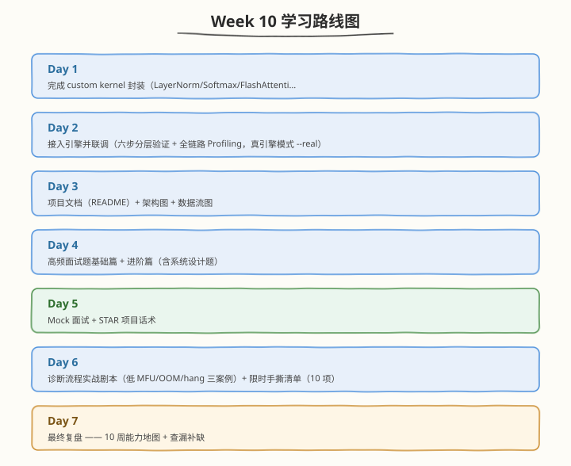

# Week 10：项目整合与面试冲刺

> 核心目标：Mini 引擎真整合、全链路 Profiling、项目文档与架构图、面试题库、Mock 面试、诊断剧本与最终复盘

| 项目　　　 | 说明　　　　　　　　　　　　　　　　　　　　　　　　　　　　　|
| ------------| ------------------------------------------------------------|
| 前置要求　 | 已完成 Week 9，掌握分布式并行、MoE+EP、多硬件对比　　　　　　　　　　　　　　　　　　　　　　　|
| 建议时长　 | 工作日每天 2.5h，周末每天 6h，周计 24.5h　　　　　　　　　　|
| 本周产出　 | 全链路引擎（真整合）、项目 README + 架构图、面试题库（基础+进阶）、Mock 面试记录、诊断剧本 3 案例、10 周能力地图　　　　　　　　　　　　　　　　　　　　　　　　　|
| 周日里程碑 | Mini 引擎全链路可跑，README 10 分钟内可跑通，面试题自测全 PASS，完成 10 周能力地图　　　　　　　　　　　　　　　　　　　　　　　|

---

## 🧭 本周学习地图

---

## 📚 每日学习材料

| Day | 主题 | 目录 |
|-----|------|------|
| Day 1 | 整合全部自定义 Kernel | [day1/](https://hzchenxiaobin.github.io/ai-infra-notes/week10/day1.html) |
| Day 2 | 系统联调（六步分层验证） | [day2/](https://hzchenxiaobin.github.io/ai-infra-notes/week10/day2.html) |
| Day 3 | 项目文档完善（README） | [day3/](https://hzchenxiaobin.github.io/ai-infra-notes/week10/day3.html) |
| Day 4 | 高频面试题基础篇 | [day4/](https://hzchenxiaobin.github.io/ai-infra-notes/week10/day4.html) |
| Day 5 | Mock 面试 | [day5/](https://hzchenxiaobin.github.io/ai-infra-notes/week10/day5.html) |
| Day 6 | 诊断流程实战剧本 + 手撕限时清单 | [day6/](https://hzchenxiaobin.github.io/ai-infra-notes/week10/day6.html) |
| Day 7 | 最终复盘 —— 10 周能力地图 | [day7/](https://hzchenxiaobin.github.io/ai-infra-notes/week10/day7.html) |

