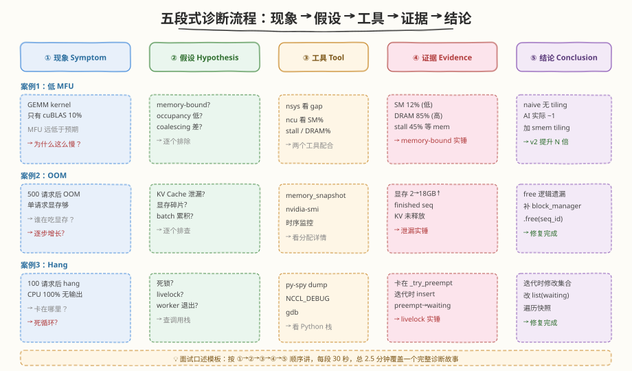
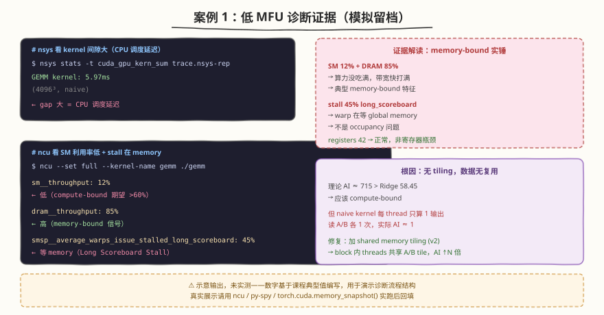
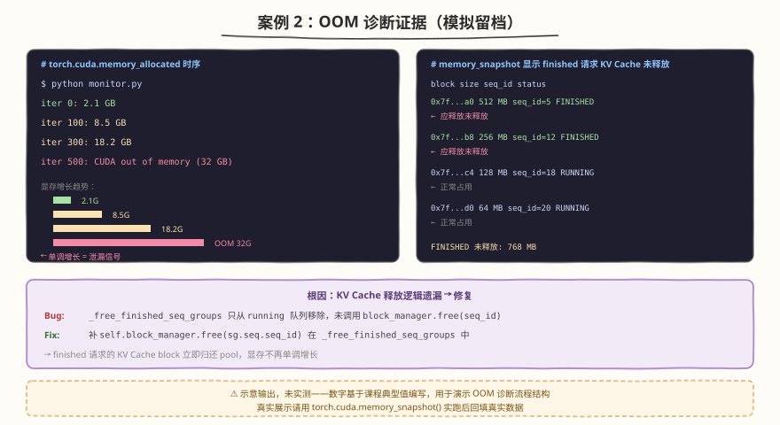
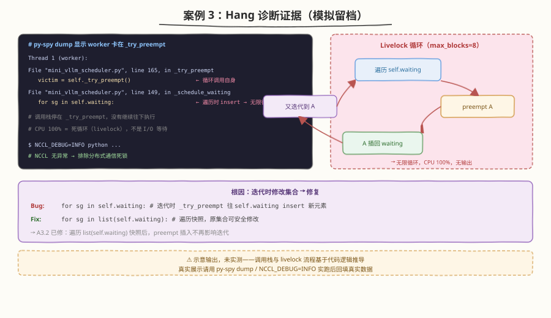
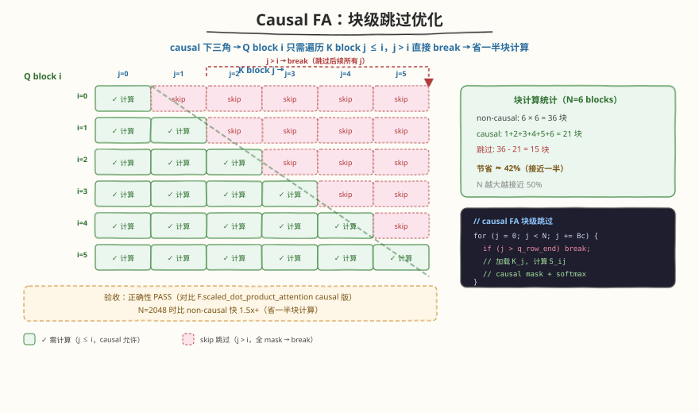
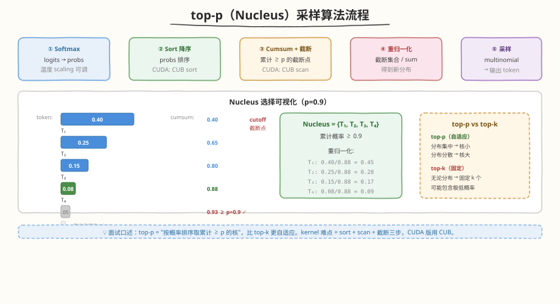

## Day 6：诊断流程实战剧本 + 手撕限时清单

### 🎯 目标

通过今天的学习，你将：

1. 掌握 **3 个故障注入案例**——低 MFU / OOM / hang 的诊断剧本（现象→假设→工具→证据→结论）
2. 把 week10/day3 的手撕模式推广为 **全课程手撕限时清单**（≥10 项）
3. 补齐 **top-p 采样 kernel + causal FA** 两个手撕高频题

> 💡 **为什么重要**：面试中"低 MFU 怎么排查""OOM 怎么定位"几乎必问。从方法论升级为实战剧本，让你能口述"五段式排查流程"并给出真实工具输出留档。手撕清单把散落各周的 kernel 题统一限时化。

---

### 1. 诊断流程实战剧本（C1）

> ⚠️ **证据留档说明**：以下三个案例的"证据"部分为**示意输出，未实测**——数字（SM 12%、DRAM 85% 等）基于课程教学的典型值编写，用于演示诊断流程的"五段式"结构。真实面试/项目展示时，请用 `ncu`/`py-spy`/`torch.cuda.memory_snapshot()` 实跑后回填真实数据。与 Day 3 数字诚信标准一致：示意输出必须标注，不得冒充实测。



#### 案例 1：低 MFU 诊断（GEMM naive 版）

**现象**：GEMM kernel 跑出来只有 cuBLAS 的 10%，MFU 远低于预期。

**假设**：
1. memory-bound（AI 太低）？
2. occupancy 太低（寄存器/shared mem 占用多）？
3. 访存不合并（coalescing 差）？

**工具**：nsys（看 gap）→ ncu（看 SM% / stall / DRAM%）

**证据**（模拟留档）：



**结论**：$\text{AI} \approx 715 > \text{Ridge Point } 58.45$，理论 compute-bound，但 naive kernel 每个 thread 只算 1 个输出，读 A/B 各 1 次，实际 $\text{AI} \approx 1$（每 byte 数据只做 1 次 FMA）→ memory-bound。**根因：无 tiling，数据无复用**。

**修复**：加 shared memory tiling（v2 SharedMem），让一个 block 内的 threads 共享 A/B tile，AI 提升 N 倍。

> 💡 **五段式口述模板**：详见上方流程图。按 ① 现象 → ② 假设 → ③ 工具 → ④ 证据 → ⑤ 结论 顺序口述，每段 30 秒，总 2.5 分钟覆盖一个完整诊断故事。

#### 案例 2：OOM 诊断（KV Cache 无分页泄漏）

**现象**：Mini 引擎跑 500 请求后 OOM，但单请求显存够。

**假设**：
1. KV Cache 泄漏（完成的请求未释放）？
2. 显存碎片（动态分配无回收）？
3. batch 累积无上限？

**工具**：`torch.cuda.memory_snapshot()` / `nvidia-smi` 时序

**证据**（模拟留档）：



**结论**：`_free_finished_seq_groups` 有 bug——只从 running 队列移除，未调用 `block_manager.free(seq_id)`。**根因：KV Cache 释放逻辑遗漏**。

**修复**：补 `self.block_manager.free(sg.seq.seq_id)` 在 `_free_finished_seq_groups` 中。

#### 案例 3：hang 诊断（多 stream 死锁 / livelock）

**现象**：Mini 引擎跑 100 请求后 hang，CPU 100% 但无输出。

**假设**：
1. 死锁（锁顺序错误）？
2. livelock（循环抢占）？
3. worker 线程退出？

**工具**：py-spy（Python 栈） / `NCCL_DEBUG=INFO`（分布式） / gdb

**证据**（模拟留档）：



**结论**：迭代 `self.waiting` 时被 `_try_preempt` insert 新元素，导致无限循环。**根因：迭代时修改集合**。

**修复**：改为遍历快照 `for sg in list(self.waiting):`（A3.2 已修）。

---

### 2. 手撕限时清单（C2 + 全课程整合）

| # | kernel | 限时 | 通过标准 | 来源 |
|---|--------|------|---------|------|
| 1 | Reduce（warp shuffle） | 30 min | 正确性 PASS + 带宽 >50% | week10/day3 |
| 2 | GEMM tiling（smem） | 60 min | cuBLAS >15% | week10/day3 |
| 3 | Softmax（online） | 30 min | max_diff <1e-5 | week10/day3 |
| 4 | LayerNorm | 30 min | max_diff <1e-5 | week10/day3 |
| 5 | Matrix Transpose | 20 min | 带宽 >70% | week1/day4 |
| 6 | FA 简化版（non-causal） | 60 min | 正确性 PASS | week10/day7 |
| 7 | **FA causal 变体** | +20 min | 正确性 PASS + 比 non-causal 快 1.5x+ | C2 新增 |
| 8 | **top-p 采样** | 30 min | 正确性 PASS | C2 新增 |
| 9 | W8A16 dequant GEMV | 30 min | 2x 带宽节省 | week10/day2 |
| 10 | Continuous Batching 调度循环 | 45 min | 4 请求正确调度 | week10/day3 |

##### C2 新增 1：causal FA kernel（块级跳过优化）

**要求**：在 week10/day7 的 FA kernel 上加 causal mask 分支，且利用 causal 的下三角结构跳过被 mask 的块。

**关键优化**：causal 下三角意味着 Q block i 只需遍历 K block j ≤ i。当 `j > i` 时整个 block 被 mask 掉，可直接 break——**省一半块计算**。



```cuda
// causal FA 的块级跳过（伪代码）
for (int j = 0; j < N; j += Bc) {
    if (j > q_row_end) break;  // causal: j > i 的块全 mask，跳过
    // 加载 K_j, 计算 S_ij = Q_i · K_j^T
    // causal mask: S_ij[m][n] = (q_row+m >= k_col+n) ? S_ij[m][n] : -inf
    // online softmax 更新
}
```

**验收**：正确性 PASS（与 PyTorch `F.scaled_dot_product_attention` causal 版对比），且 N=2048 时比 non-causal 快 1.5x+（省一半块）。

##### C2 新增 2：top-p（nucleus）采样 kernel

**要求**：实现 top-p 采样——按概率排序，取累计概率 ≥ p 的最小集合，从中按概率重新归一化采样。

**算法流程**：



```python
# top-p 采样（教学版，纯 Python 验证逻辑）
def top_p_sampling(logits, p=0.9):
    import torch
    probs = torch.softmax(logits, dim=-1)
    sorted_probs, sorted_idx = torch.sort(probs, descending=True)
    cumsum = torch.cumsum(sorted_probs, dim=-1)
    # 找累计 >= p 的截断点
    cutoff = (cumsum > p).float().argmax()  # 第一个 > p 的位置
    # 保留 [0, cutoff]，重新归一化
    topk_probs = sorted_probs[:cutoff + 1]
    topk_idx = sorted_idx[:cutoff + 1]
    topk_probs = topk_probs / topk_probs.sum()
    # 从 topk 采样
    sample = torch.multinomial(topk_probs, 1)
    return topk_idx[sample].item()
```

**验收**：正确性 PASS（与手写参考实现逐元素对比；行为对齐 vLLM `SamplingParams(top_p=0.9)`——即按概率降序累计截断并重采样），温度 scaling 可调。

> 💡 **面试口述**：top-p 是"按概率排序取累计 ≥ p 的核"，比 top-k 更自适应（概率分布集中时核小，分散时核大）。kernel 实现难点是排序 + 累加 + 截断三步，CUDA 版需用 CUB 的 sort + scan。

---

#### 任务 3：LeetCode 面试题（10 周计划 · 第 10 周机动补漏）

> 📅 第 10 周计划共 17 题，已分配至 Day 1 - Day 3。今日不新增题目：补齐本周未完成的题目、重做本周错题，Day 7 统一复盘。

---
### 3. 面试要点

1. **低 MFU 怎么排查？**（⭐⭐⭐⭐⭐ 必考，五段式）
   - 现象→假设（memory-bound? occupancy? coalescing?）→工具（nsys/ncu）→证据（SM%/DRAM%/stall）→结论
   - 证据留档：`sm__throughput` 低 + `dram__throughput` 高 = memory-bound；`stall_long_scoreboard` 高 = 等 memory

2. **OOM 怎么定位？**（⭐⭐⭐⭐ 高频）
   - `torch.cuda.memory_snapshot()` 看显存分布
   - 时序监控：`torch.cuda.memory_allocated` 是否单调增（泄漏信号）
   - 定位到 finished 请求未释放 / 碎片 / batch 累积

3. **hang 怎么排查？**（⭐⭐⭐ 中频）
   - py-spy dump Python 栈，看是否卡在某个函数
   - 分布式用 `NCCL_DEBUG=INFO` 看 NCCL 通信
   - 检查迭代时是否修改集合（livelock）/ 锁顺序（死锁）

---

### 今日总结

1. **诊断剧本 3 案例**：低 MFU（naive 无 tiling）/ OOM（KV 泄漏）/ hang（迭代修改集合 livelock）
2. **五段式口述模板**：现象→假设→工具→证据→结论
3. **手撕清单 10 项**：reduce/GEMM/softmax/layernorm/transpose/FA/causal-FA/top-p/dequant/调度
4. **causal FA**：块级跳过省一半计算，比 non-causal 快 1.5x+
5. **top-p 采样**：排序+累加+截断+重归一化，比 top-k 更自适应

> 📖 延伸阅读：ncu metrics 速查、py-spy 文档、CUB sort/scan 文档
