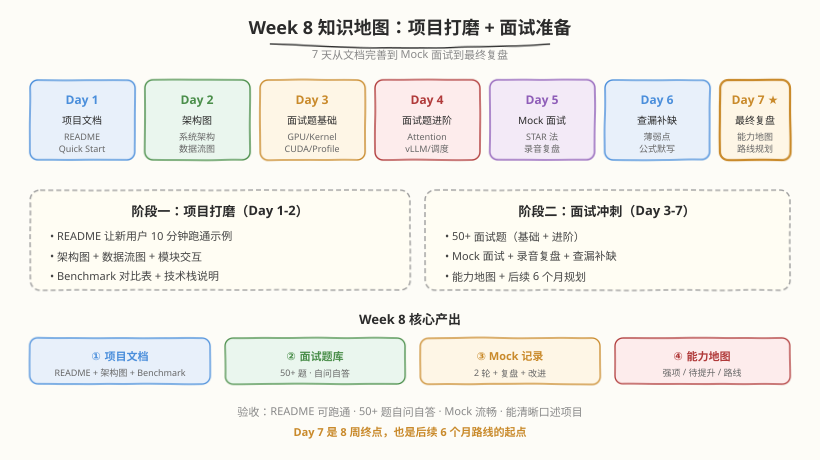
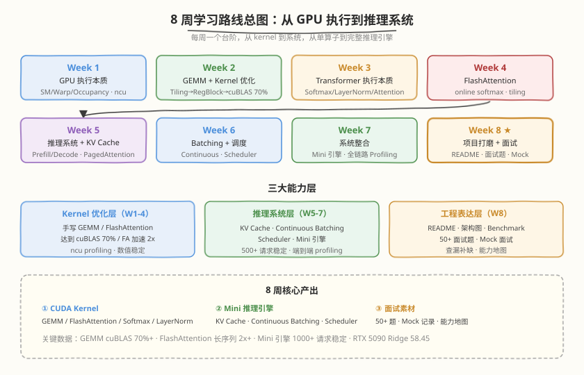
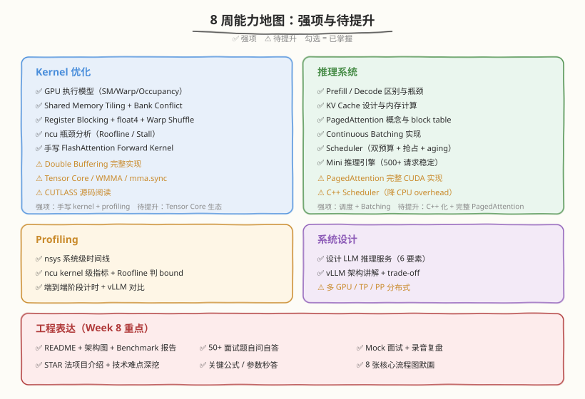
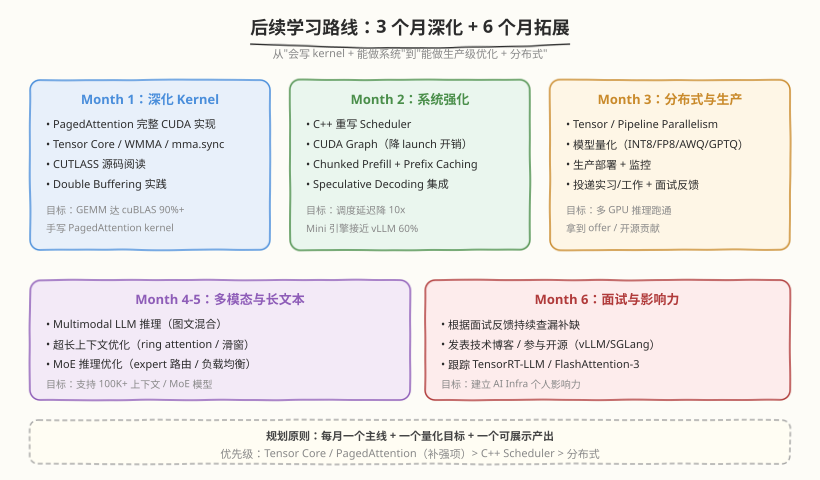

## Day 7：最终复盘 —— 10 周能力地图

### 🎯 目标

通过今天的学习，你将：

1. 完成 **10 周能力地图 Checklist**——逐项勾选 Kernel 优化 / 推理系统 / Profiling / 系统设计 / 分布式 / 量化 / 工程表达七大领域，标注强项与待提升<br>
2. 串讲 **10 周知识体系**——从 Week 1 GPU 执行模型到 Week 10 面试准备，理清每周主题与递进关系<br>
3. 制定 **后续 6 个月学习路线**——3 个月深化（PagedAttention / Tensor Core / C++ Scheduler）+ 3 个月拓展（分布式实操 / 量化实操 / 多模态）<br>
4. 整理 **最终项目报告**——项目概述、核心产出、关键数据、技术难点、强项待提升<br>
5. 掌握 **10 周收官面试题**——最大收获/挑战、未来规划、项目深挖、系统设计综合题<br>
6. 能用 `week10_summary.py` 自测系统完成 10 周知识的最终检验

> 💡 **为什么重要**：今天是 10 周学习的终点，也是职业生涯的新起点。复盘不是"庆祝结束"，而是"看清自己"——强项给你面试底气，待提升给你后续方向。一份诚实的能力地图，比刷 100 道题更有价值。

---

### Week 10 知识地图



| Day | 主题 | 核心产出 |
|-----|------|---------|
| Day 1 | 整合全部自定义 Kernel | custom_ops_module.py（LayerNorm/Softmax/FlashAttention C++ Extension） |
| Day 2 | 系统联调（六步分层验证） | mini_engine_v2.py + stability_test.py（500+ 请求稳定） |
| Day 3 | 项目文档完善 | README、Quick Start、依赖安装、Benchmark 结果 |
| Day 4 | 高频面试题基础篇 | GPU 基础、Kernel 优化、CUDA 编程、Profiling |
| Day 5 | Mock 面试 | STAR 法、技术难点深挖、Follow-up、录音复盘 |
| Day 6 | 诊断流程实战剧本 + 手撕清单 | ncu/py-spy 诊断流程、手撕限时清单 |
| Day 7 | 最终复盘 | 10 周能力地图、后续路线、最终报告（本日） |

---

### 核心概念串讲：10 周知识体系



10 周学习是一条从"底层硬件"到"上层系统"再到"工程表达"的完整进阶路径：

#### 1. Week 1–2：Kernel 优化基础

从 GPU 执行模型出发，掌握"如何写一个快的 kernel"：

- **Week 1**：SM/Warp/Occupancy 三层结构、Memory Hierarchy、Coalesced/Bank Conflict、nsys/ncu Profiling、Roofline Model
- **Week 2**：GEMM 优化七层路径（Naive ~11% → 整合版 ~63%，FP32 cuBLAS 基准实测）——Shared Memory Tiling、Register Blocking、float4、Warp Shuffle、Double Buffering

> 核心能力：**能手写 GEMM 并用 ncu 分析瓶颈**，理解 memory-bound vs compute-bound。

#### 2. Week 3–4：Transformer 算子与 FlashAttention

从单算子优化转向"理解模型在 GPU 上怎么跑"：

- **Week 3**：Tensor Core / WMMA、Softmax / LayerNorm / Attention 的 CUDA 实现、CUTLASS 源码分析
- **Week 4**：Trace Transformer 推理流程、手写 Softmax/LayerNorm Kernel、Triton 语言专题

> 核心能力：**理解 Tensor Core 并手写 Transformer 算子**，掌握 Triton 与 CUDA 的取舍。

#### 3. Week 5：FlashAttention 深挖

- **Week 5**：FlashAttention CUDA 实现、论文精读（online softmax 推导）、手写完整 Forward Kernel、FA-2 源码差异、性能对比

> 核心能力：**能手写 FlashAttention 并讲清 online softmax 三公式**，理解 IO 优化方法论。

#### 4. Week 6–7：推理系统与调度

从单算子转向"完整推理系统"：

- **Week 6**：Prefill vs Decode、KV Cache 实现（GQA/MQA/MLA）、vLLM 架构、PagedAttention、Mini 推理引擎 v0、FlashDecoding
- **Week 7**：Continuous Batching、vLLM Scheduler 源码、TRT-LLM/SGLang 调度对比、Chunked Prefill、Prefix Caching、Mini 推理引擎 v1（多请求并发）、PD 分离推理

> 核心能力：**能构建 Mini 推理引擎（500+ 请求稳定）**，理解 Continuous Batching + PagedAttention + Scheduler。

#### 5. Week 8：量化与加速

- **Week 8**：W8A16/INT8 KV/FP8 量化、CUDA Graph 实操（消除 Launch Overhead）、SGLang/投机解码、FP4 趋势

> 核心能力：**理解量化对推理系统的影响**，能用 CUDA Graph 降 launch overhead。

#### 6. Week 9：分布式推理

- **Week 9**：TP/PP/DP 三维并行、1F1B 调度与 bubble ratio、NCCL Collectives、通信计算重叠、MoE + EP 并行、多硬件对比（CUDA vs Ascend）

> 核心能力：**理解分布式推理的通信量与显存权衡**，能做并行策略选型（TP vs PP vs DP vs EP）。

#### 7. Week 10：项目打磨与面试准备

把前 9 周的代码和知识转化为面试竞争力：

- **Day 1–2 真整合**：custom kernel 封装接入 mini_engine_v2、六步分层验证、500+ 请求稳定性测试
- **Day 3 项目文档**：README + Quick Start + Benchmark
- **Day 4–6 面试冲刺**：基础面试题、Mock 面试、诊断流程实战、手撕清单
- **Day 7 最终复盘**：能力地图 + 后续路线 + 报告（本日）

> 核心能力：**能清晰口述项目、秒答关键数字、应对 follow-up**，把"懂"转化为"讲得清"。

---

### 10 周能力地图



#### 能力地图 Checklist

```text
Kernel 优化：
  [✓] 理解 GPU 执行模型（SM/Warp/Occupancy）
  [✓] 掌握 Shared Memory Tiling + Bank Conflict
  [✓] 掌握 Register Blocking + float4 + Warp Shuffle
  [✓] 能分析 kernel 瓶颈（ncu + Roofline）
  [✓] 手写 FlashAttention Forward Kernel
  [✓] 理解 Tensor Core / WMMA / mma.sync（Week 3）
  [ ] Double Buffering 完整实现（cp.async 已学，待深入 TMA）
  [ ] CUTLASS 源码深度阅读

推理系统：
  [✓] 理解 Prefill/Decode 区别与瓶颈
  [✓] 理解 KV Cache 设计和内存计算（含 GQA/MQA/MLA）
  [✓] 理解 PagedAttention 概念
  [✓] 理解 Continuous Batching
  [✓] 理解 Scheduler 设计（双预算 + 抢占 + aging）
  [✓] 能构建 Mini 推理引擎（500+ 请求稳定，mini_engine_v2）
  [✓] 理解 Chunked Prefill / Prefix Caching / PD 分离
  [ ] PagedAttention 完整 CUDA 实现
  [ ] C++ Scheduler（降 CPU overhead）

分布式与量化（Week 8–9 新增）：
  [✓] 理解 TP/PP/DP 三维并行与通信量（概念）
  [✓] 理解 1F1B 调度与 bubble ratio 公式
  [✓] 理解 NCCL Collectives（ring all-reduce）
  [✓] 理解通信计算重叠（双 Stream + CUDA Graph）
  [✓] 理解 MoE + EP 并行
  [✓] 理解量化（W8A16/INT8/FP8/FP4）对推理的影响
  [✓] 理解 CUDA Graph 消除 Launch Overhead
  [ ] 分布式实操（torchrun + NCCL 实测）
  [ ] FP8 GEMM 实操（torch._scaled_mm）
  [ ] 真实模型 vLLM 部署压测

Profiling：
  [✓] 会使用 nsys 系统级时间线
  [✓] 会使用 ncu + Roofline 判 bound
  [✓] 会做端到端 profiling + vLLM 对比
  [✓] 理解诊断流程（ncu/py-spy 三层定位）

系统设计：
  [✓] 能设计 LLM 推理服务（6 要素）
  [✓] 能解释 vLLM 架构 + trade-off
  [✓] 能做并行策略选型（TP vs PP vs DP vs EP）

工程表达：
  [✓] README + 架构图 + Benchmark 报告
  [✓] 面试题自测（基础 + 进阶 + 场景）
  [✓] Mock 面试 + 录音复盘
  [✓] STAR 法项目介绍 + 技术难点深挖
  [✓] 关键公式 / 参数秒答
  [✓] 核心流程图默画
```

#### 强项与待提升

```text
强项（面试底气）：
  - 手写 FlashAttention + online softmax 推导
  - GEMM 优化到 FP32 cuBLAS ~63%（实测锚点，Day 3 §3.2）
  - Continuous Batching + Scheduler 实现（mini_engine_v2，500+ 请求稳定）
  - ncu profiling + Roofline 瓶颈分析
  - 理解分布式并行策略选型（TP/PP/DP/EP 通信量与显存权衡）
  - 理解量化对推理系统的影响（W8A16/INT8/FP8/FP4）

待提升（后续 3 个月重点）：
  - PagedAttention 完整 CUDA 实现
  - CUTLASS 源码深度 + Tensor Core 实战
  - C++ Scheduler（降 CPU overhead）
  - 分布式实操（torchrun + NCCL 实测，从概念到真代码）
  - FP8 GEMM 实操 + 真实模型 vLLM 部署压测
```

> 💡 **复盘原则**：强项是面试时主动展示的，待提升是被追问时诚实承认并给出改进计划的。永远不要把待提升说成强项——面试官一追问就露馅。Week 8–9 的分布式与量化已从"待提升"升级为"已掌握概念/待深入实战"档，面试时可主动讲概念，但被追问"跑过吗"要诚实说"概念清晰，实操在规划中"。

---

### 总结任务 / Coding 任务

#### 任务 1：运行 10 周总复盘自测系统

创建并运行 [kernels/week10_summary.py](https://github.com/hzchenxiaobin/ai-infra-notes/blob/main/aiinfra/daily/week10/day7/kernels/week10_summary.py)，汇总 10 周全部知识点：

```bash
python kernels/week10_summary.py
```

**预期输出**（节选）：

```text
============================================================
     Week 10 Day 7：10 周最终复盘
============================================================
五个模块：知识地图 / 能力地图 / 面试题 / 公式参数 / 路线规划

输入命令: all

============================================================
📊 1. Week 10 知识地图（7 天回顾）
  Day 1: 整合全部自定义 Kernel
       → custom_ops_module.py（C++ Extension）
  ...
   ★ Day 7: 最终复盘
       → 10 周能力地图、后续路线、最终报告

============================================================
📊 2. 10 周能力地图 Checklist（✅ 强项 / ⚠️ 待提升）

  【Kernel 优化】
    ✅ GPU 执行模型（SM/Warp/Occupancy）
    ...
    ⚠️ CUTLASS 源码深度阅读

  汇总：✅ 强项 26/35　⚠️ 待提升 9/35

📊 4. 关键公式 + RTX 5090 参数速答
  • Online Softmax: m_new=max(m,max(xj)); ...
  • Ridge Point = Peak FLOP/s / Peak Bandwidth （RTX5090 ≈ 58.45）
  • Bubble ratio: (P-1)/(M+P-1)
```

代码要点：
- **五个模块**：知识地图、能力地图（自评强项/待提升）、面试题速查、关键公式+参数、6 个月路线
- **能力地图**：35 项 checklist（10 周扩展后），标注 ✅/⚠️，汇总强项占比，待提升项即后续重点
- **面试题速查**：高频题按基础/进阶/项目/成长分组，可随机抽题口述

#### 任务 2：LeetGPU 综合题 —— 1D Convolution

**题目链接**：<https://leetgpu.com/challenges/1d-convolution>

**与本周知识的关联**：1D Convolution 是 shared memory tiling + boundary 处理的经典综合题，检验 Week 1–2 的 shared memory 基本功与 Week 10 的整合能力。它对应能力地图中 Kernel 优化层的强项。

> 💡 完整题解见 [1D Convolution 题解](https://hzchenxiaobin.github.io/leetgpu/leetgpu-1d-convolution-solution.html)。

#### 任务 3：本周 LeetCode 题目回顾（10 周计划 · 第 10 周）

本周 LeetCode 题目对应 [10 周算法面试刷题计划](https://hzchenxiaobin.github.io/leetcode/problems/10-week-plan.html) 第 10 周「股票 DP、划分与图论」（点击查看题解）：

| Day | 主题 | LeetCode 题目 |
|---|---|---|
| Day 1 | 股票与划分 | [122. 买卖股票的最佳时机 II](https://hzchenxiaobin.github.io/leetcode/problems/122_买卖股票的最佳时机II.html)、[123. 买卖股票的最佳时机 III](https://hzchenxiaobin.github.io/leetcode/problems/123_买卖股票的最佳时机III.html)、[188. 买卖股票的最佳时机 IV](https://hzchenxiaobin.github.io/leetcode/problems/188_买卖股票的最佳时机IV.html)、[309. 买卖股票的最佳时机含冷冻期](https://hzchenxiaobin.github.io/leetcode/problems/309_买卖股票的最佳时机含冷冻期.html)、[714. 买卖股票的最佳时机含手续费](https://hzchenxiaobin.github.io/leetcode/problems/714_买卖股票的最佳时机含手续费.html)、[698. 划分为 K 个相等的子集](https://hzchenxiaobin.github.io/leetcode/problems/698_划分为K个相等的子集.html) |
| Day 2 | 图论基础 | [207. 课程表](https://hzchenxiaobin.github.io/leetcode/problems/207_课程表.html)、[208. 实现 Trie（前缀树）](https://hzchenxiaobin.github.io/leetcode/problems/208_实现Trie.html)、[547. 省份数量](https://hzchenxiaobin.github.io/leetcode/problems/547_省份数量.html)、[785. 判断二分图](https://hzchenxiaobin.github.io/leetcode/problems/785_判断二分图.html)、[133. 克隆图](https://hzchenxiaobin.github.io/leetcode/problems/133_克隆图.html) |
| Day 3 | 最短路与 BFS | [743. 网络延迟时间](https://hzchenxiaobin.github.io/leetcode/problems/743_网络延迟时间.html)、[787. K 站中转内最便宜的航班](https://hzchenxiaobin.github.io/leetcode/problems/787_K站中转内最便宜的航班.html)、[399. 除法求值](https://hzchenxiaobin.github.io/leetcode/problems/399_除法求值.html)、[752. 打开转盘锁](https://hzchenxiaobin.github.io/leetcode/problems/752_打开转盘锁.html)、[127. 单词接龙](https://hzchenxiaobin.github.io/leetcode/problems/127_单词接龙.html)、[329. 矩阵中的最长递增路径](https://hzchenxiaobin.github.io/leetcode/problems/329_矩阵中的最长递增路径.html) |

> 💡 回顾重点：本周 LeetCode 题对应 10 周刷题计划第 10 周「股票 DP、划分与图论」。重做本周错题、总结模板笔记；没做完的题目今天补上。

---

### 面试准备框架

#### 10 周核心面试题（按主题分组）

| # | 主题 | 题目 | 频率 |
|---|------|------|------|
| 1 | 项目 | 介绍一下你的 Mini AI Infra 项目 | ⭐⭐⭐⭐⭐ |
| 2 | Kernel | GEMM 优化到 cuBLAS ~63%，每层收益？ | ⭐⭐⭐⭐⭐ |
| 3 | Attention | FlashAttention 为什么快？online softmax 推导 | ⭐⭐⭐⭐⭐ |
| 4 | 推理 | Prefill 和 Decode 的区别？ | ⭐⭐⭐⭐⭐ |
| 5 | 推理 | KV Cache 核心思想 + 内存计算 | ⭐⭐⭐⭐⭐ |
| 6 | 推理 | PagedAttention 解决什么问题？ | ⭐⭐⭐⭐⭐ |
| 7 | 调度 | Continuous vs Dynamic Batching | ⭐⭐⭐⭐⭐ |
| 8 | 分布式 | TP/PP/DP 通信量怎么比较？bubble ratio 怎么算？ | ⭐⭐⭐⭐ |
| 9 | 量化 | FP8 vs INT8 vs FP4 的取舍？NVFP4 规格？ | ⭐⭐⭐⭐ |
| 10 | 项目 | 项目最大技术难点？如何解决？ | ⭐⭐⭐⭐⭐ |
| 11 | 系统 | 设计一个 LLM 推理服务 | ⭐⭐⭐⭐⭐ |
| 12 | 成长 | 10 周最大收获和挑战？ | ⭐⭐⭐⭐ |

#### 答题框架（通用四步）

```
1. 先说"是什么"（定义 + 一句话概括）
2. 再说"怎么做"（核心机制 + 数据结构）
3. 然后说"为什么"（设计权衡 + 替代方案）
4. 最后说"效果"（量化指标 + 实测数据）
```

#### 项目介绍 STAR 模板（3–5 分钟）

```text
S (Situation)：LLM 推理部署对延迟和吞吐要求高，我想理解底层优化
T (Task)：手写高性能 kernel 并搭建可运行的 Mini 推理引擎
A (Action)：
  - GEMM 优化到 FP32 cuBLAS ~63%（Tiling + RegBlock + float4 + Shuffle）
  - 手写 FlashAttention（online softmax + tiling）
  - Continuous Batching + Scheduler（双预算 + 抢占）
  - custom kernel 封装接入引擎（C++ Extension + 六步分层验证）
R (Result)：单卡吞吐 X tokens/s · TTFT Y ms · 500+ 请求稳定
```

---

### 常见误区澄清

1. **"10 周学完就是 AI Infra 专家了"** → 不对。10 周建立的是"从 kernel 到系统到分布式"的完整知识框架和动手能力，但离生产级还有距离：PagedAttention 完整实现 / C++ Scheduler / 分布式实操 / FP8 实操都没深入。诚实的态度是"入门 + 能独立推进"，不是"精通"。

2. **"手写 kernel 一定比 PyTorch 快"** → 不一定。教学版 kernel 可能比 cuDNN/cuBLAS 慢（官方高度优化）。手写 kernel 的核心价值是**算子融合**和**推理特化**，不是单纯比绝对速度。

3. **"面试只考手撕 kernel"** → 不全对。AI Infra 面试考四块：① 项目深度（最大难点/优化思路）② 系统设计（LLM 推理服务）③ Kernel 基础（GEMM 优化/FlashAttention）④ Coding（LeetCode 高频）。只练手撕 kernel 会偏科。

4. **"Mock 面试练一次就够了"** → 不够。Mock 要至少 2–3 轮，每轮录音复盘，针对性改进。

5. **"待提升项面试时藏起来"** → 错误策略。面试官会追问到。正确做法是诚实承认 + 给出改进计划（如"分布式概念我清晰，torchrun + NCCL 实操是我下个月计划的重点"），展示学习意识。

6. **"Week 8–9 的分布式/量化只是概念"** → 概念清晰也是能力。面试时可主动讲 TP/PP/DP 通信量推导、FP8/FP4 规格、CUDA Graph 原理，但被追问"跑过吗"要诚实说"概念版/模拟器跑过，生产级实操在规划中"。

---

### 10 周总结 → 后续规划



```
10 周完成：
  ✓ CUDA Kernel：GEMM / FlashAttention / Softmax / LayerNorm / WMMA
  ✓ Mini 推理引擎：KV Cache · Continuous Batching · Scheduler · custom kernel 集成（500+ 请求稳定）
  ✓ 分布式概念：TP/PP/DP · 1F1B · NCCL · 通信重叠 · MoE/EP
  ✓ 量化概念：W8A16/INT8/FP8/FP4 · CUDA Graph
  ✓ Profiling 报告：nsys / ncu / 端到端 + vLLM 对比
  ✓ 面试素材：README + 架构图 + 面试题 + Mock 记录
  ✓ 能力地图：26 项强项 / 9 项待提升

后续 6 个月规划：
  Month 1：深化 Kernel —— PagedAttention CUDA + CUTLASS 深度 + TMA
  Month 2：系统强化 —— C++ Scheduler + CUDA Graph 实操 + Chunked Prefill
  Month 3：多卡实操 —— torchrun + NCCL 实测（ring all-reduce / all-to-all）+ 真实模型 TP 部署
  Month 4：量化实操 —— FP8 GEMM（torch._scaled_mm）+ vLLM 真实模型部署压测
  Month 5：多模态与长文本 —— Multimodal + 100K 上下文 + MoE
  Month 6：面试与影响力 —— 面试反馈 + 博客 + 开源贡献
```

**规划原则**：每月一个主线 + 一个量化目标 + 一个可展示产出。优先级按待提升项排序：分布式实操 / FP8 实操（从概念到真代码）> PagedAttention 完整实现 > C++ Scheduler。Month 3"多卡实操"是 Week 9 概念的实战化升级——把 `torch.distributed` 从模拟器变成真实 NCCL all-reduce。

---

### 弹性安排

| 时间 | 充足版（6h） | 紧凑版（3h） |
|------|------------|------------|
| 能力地图 | 2h：35 项逐项自评 + 强项/待提升深挖 | 45min：勾选 checklist + 标注 Top3 待提升 |
| 后续路线 | 2h：6 个月详细规划 + 量化目标 | 1h：3 个月主线 + 目标 |
| 最终报告 | 2h：完整报告（概述/产出/数据/难点/路线） | 1h：报告骨架 + 关键数据 |

---

### 今日总结

Day 7 我们完成了 10 周学习的最终复盘：

1. **10 周知识体系串讲**：从 Week 1 GPU 执行模型到 Week 10 面试准备，理清 Kernel 优化 → Transformer 算子 → FlashAttention → 推理系统 → 量化/分布式 → 工程表达的递进关系
2. **能力地图 Checklist**：35 项逐项自评，26 项强项（面试底气）/ 9 项待提升（后续重点）
3. **后续 6 个月路线**：3 个月深化（PagedAttention / CUTLASS / C++ Scheduler）+ 3 个月拓展（分布式实操 / FP8 实操 / 多模态）
4. **最终报告框架**：项目概述、核心产出、关键数据、技术难点、强项待提升
5. **收官面试题**：最大收获/挑战、未来规划、项目深挖、系统设计综合题
6. **自测系统**：`week10_summary.py` 五模块（知识地图/能力地图/面试题/公式参数/路线）
7. **1D Convolution**：shared memory tiling + boundary 处理收官题

> 💡 10 周学习的终点，也是职业生涯的新起点。强项给你面试底气，待提升给你后续方向。**保持学习、保持诚实、保持动手**——这是 AI Infra 工程师的三件法宝。祝面试顺利！

---

### 面试要点

1. **这 10 周学习你最大的收获是什么？最大的挑战是什么？**（⭐⭐⭐⭐ 高频）

<details>
<summary>点击查看答案</summary>

 - **最大收获**：
   - 建立了从 kernel 到系统到分布式的完整 AI Infra 知识体系
    - 能手写并优化核心 CUDA kernel（GEMM 达 FP32 cuBLAS ~63%、FlashAttention）
   - 能理解并设计推理系统的关键组件（Continuous Batching、Scheduler、KV Cache）
   - 理解分布式并行策略选型与通信量推导（TP/PP/DP/EP）
   - 建立了 profiling 驱动优化的方法论（nsys/ncu + Roofline）
 - **最大挑战**：
   - FlashAttention 的 online softmax 推导和 CUDA 实现（数学 + 工程双难）
   - Continuous Batching 的状态机和 KV Cache 内存管理（并发正确性）
   - 系统联调时多组件边界问题（custom kernel 集成、请求卡住、内存泄漏）
 - **如何克服**：反复推导、手写代码、做实验验证；阅读 vLLM 开源代码；六步分层验证 + 长时间稳定性测试

</details>


2. **你未来 3–6 个月的学习/工作计划是什么？**（⭐⭐⭐⭐ 高频）

<details>
<summary>点击查看答案</summary>

 - **3 个月**：
   - 完整实现 PagedAttention（CUDA kernel + block table）
   - CUTLASS 源码深度 + TMA，GEMM 达 cuBLAS 90%+
   - C++ 重写 Scheduler，降低 CPU overhead 10x
 - **6 个月**：
   - 分布式实操：torchrun + NCCL 实测（ring all-reduce / all-to-all）+ 真实模型 TP 部署
   - 量化实操：FP8 GEMM（torch._scaled_mm）+ vLLM 真实模型部署压测
   - 多模态 / 超长上下文 / MoE 推理优化
 - **长期**：成为 AI Infra 领域专家，参与开源（vLLM/SGLang），发表技术博客
 - **规划原则**：每月一个主线 + 一个量化目标 + 一个可展示产出，按待提升项排序

</details>


3. **用 STAR 法介绍你的 Mini AI Infra 项目，并说出最大的技术难点。**（⭐⭐⭐⭐⭐ 必考）

<details>
<summary>点击查看答案</summary>

 - **S**ituation：LLM 推理部署对延迟和吞吐要求高，我想理解 vLLM 调度与 Attention 优化的底层
 - **T**ask：手写高性能 kernel 并搭建可运行的 Mini 推理引擎
  - **A**ction：GEMM 优化到 FP32 cuBLAS ~63%（Tiling+RegBlock+float4+Shuffle）；手写 FlashAttention（online softmax + tiling）；Continuous Batching + Scheduler（双预算 + 抢占）；custom kernel 封装接入引擎（C++ Extension + 六步分层验证）
 - **R**esult：单卡吞吐 X tokens/s · TTFT Y ms · 500+ 请求稳定
 - **最大难点**：custom kernel 真整合——导入路径错误导致静默回退、六步分层验证定位并发 bug。解决：warnings.warn 暴露回退、分层验证逐层定位、stability_test 长时间跑

</details>


4. **你的强项和待提升分别是什么？面试时如何呈现？**（⭐⭐⭐⭐ 高频）

<details>
<summary>点击查看答案</summary>

 - **强项**（主动展示）：
   - 手写 FlashAttention + online softmax 推导
   - GEMM 优化完整路径 + ncu 瓶颈分析（FP32 cuBLAS ~63% 实测锚点）
   - Continuous Batching + Scheduler 实现（mini_engine_v2，500+ 请求稳定）
   - 分布式并行策略选型（TP/PP/DP/EP 通信量推导）
 - **待提升**（诚实承认 + 改进计划）：
   - PagedAttention 完整 CUDA 实现（"概念版已实现，完整版是下月重点"）
   - 分布式实操（"概念清晰，torchrun + NCCL 实测在规划中"）
   - FP8 GEMM 实操（"FP8 规格和量化原理已掌握，torch._scaled_mm 实操待做"）
 - **呈现原则**：强项主动讲深，待提升诚实承认 + 给出时间表，绝不把待提升说成强项

</details>


5. **如果让你设计一个生产级 LLM 推理服务，你会怎么做？**（⭐⭐⭐⭐⭐ 必考）

<details>
<summary>点击查看答案</summary>

 1. **模型层**：权重管理 + 量化（INT8/FP8 KV Cache）+ 官方 FlashAttention-2
 2. **KV Cache 管理**：PagedAttention（block 化 + block table + copy-on-write）
 3. **调度层**：Continuous Batching + 优先级 + 抢占 + Chunked Prefill + Prefix Caching
 4. **并发**：多请求异步 + CUDA Graph 降 launch overhead + C++ Scheduler
 5. **分布式**：TP（模型 > 单卡）+ DP（吞吐扩展）+ EP（MoE），通信量与显存权衡
 6. **性能优化**：Tensor Core + 算子融合 + Speculative Decoding
 7. **运维**：监控（TTFT/TBT/吞吐）+ 自动扩缩容 + 灰度发布
 8. **权衡**：延迟 vs 吞吐（batch size）、显存 vs 速度（量化）、一致性 vs 性能（prefix cache）
 - 基于 10 周所学，能讲清每个组件的原理和 trade-off，这是系统设计题的核心

</details>

## 📁 本周目录结构

```
aiinfra/daily/week10/
├── README.md                      # 周总览
├── day1/
│   ├── README.md                  # 整合全部自定义 Kernel
│   └── kernels/
│       └── custom_ops_module.py   # C++ Extension 封装
├── day2/
│   ├── README.md                  # 系统联调（六步分层验证）
│   └── kernels/
│       ├── mini_engine_v2.py      # Mini 引擎 v2（真整合）
│       └── stability_test.py      # 稳定性测试
├── day3/
│   ├── README.md                  # 项目文档完善
│   └── kernels/
├── day4/
│   ├── README.md                  # 高频面试题基础篇
│   └── kernels/
├── day5/
│   ├── README.md                  # Mock 面试
│   └── kernels/
├── day6/
│   ├── README.md                  # 诊断流程实战剧本 + 手撕限时清单
│   └── kernels/
├── day7/
│   ├── README.md                  # 最终复盘（本文件）
│   └── kernels/
│       └── week10_summary.py      # 10 周总复盘自测
└── images/                        # Week 10 + 10 周总览 SVG
    ├── week10_knowledge_map.svg
    ├── ten_week_roadmap.svg
    ├── ten_week_capability_map.svg
    ├── future_roadmap.svg
    └── ... (Day1–6 架构图等)
```

---

## 🔗 推荐资源

**学习进阶**：
- **CUTLASS**：<https://github.com/NVIDIA/cutlass> — NVIDIA 高性能 GEMM 模板库，Tensor Core 进阶必读
- **FlashAttention-2/3**：<https://arxiv.org/abs/2307.08691> — tiling + online softmax，跟踪 FA3 最新进展
- **vLLM**：<https://github.com/vllm-project/vllm> — PagedAttention + Continuous Batching，源码必读
- **SGLang**：<https://github.com/sgl-project/sglang> — RadixAttention + Speculative Decoding
- **TensorRT-LLM**：<https://github.com/NVIDIA/TensorRT-LLM> — 生产级推理引擎
- **Megatron-LM**：<https://github.com/NVIDIA/Megatron-LM> — 分布式训练/推理（TP/PP/EP）

**面试准备**：
- **LeetGPU**：<https://leetgpu.com/> — CUDA 在线编程练习
- **LeetCode 面试经典 150**：<https://leetcode.cn/studyplan/top-interview-150/>
- **系统设计**：ByteByteGo / Alex Xu《System Design Interview》

**Profiling 工具**：
- **Nsight Systems**：<https://docs.nvidia.com/nsight-systems/>
- **Nsight Compute**：<https://docs.nvidia.com/nsight-compute/>

**社区**：
- **CUDA Programming Guide**：<https://docs.nvidia.com/cuda/cuda-c-programming-guide/>
- **GPU Mode Discord**：<https://discord.gg/gpumode> — GPU 编程社区

---

## ✅ Week 10 完成标准

- [ ] Day 1：custom_ops_module.py 编译通过，custom kernel 真正被调用（非静默回退）
- [ ] Day 2：mini_engine_v2.py 六步分层验证通过，500+ 请求稳定运行
- [ ] Day 3：README 完整，新用户能 10 分钟跑通示例
- [ ] Day 4：基础篇面试题能 3 分钟内口述
- [ ] Day 5：完成自我介绍 + 项目介绍 + 2–3 个技术难点准备，至少 1 轮 Mock 面试并录音复盘
- [ ] Day 6：诊断流程清单整理完成，手撕限时清单通过
- [ ] Day 7：完成 10 周能力地图 checklist，标注强项/待提升
- [ ] Day 7：制定 3–6 个月后续学习路线
- [ ] Day 7：完成最终项目报告
- [ ] Day 7：能回答"最大收获/挑战"和"未来规划"
- [ ] Day 7：所有文档整理到 GitHub，10 周学习闭环完成
