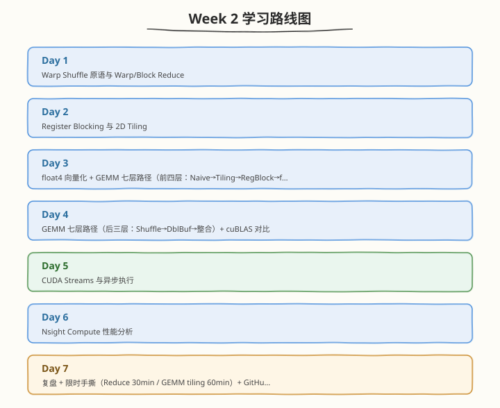

# Week 2：CUDA Kernel 优化方法论

> 核心目标：掌握 Warp Shuffle、Register Blocking、float4 向量化、GEMM 七层优化路径、CUDA Streams 与 Nsight Compute 性能分析

| 项目　　　 | 说明　　　　　　　　　　　　　　　　　　　　　　　　　　　　　|
| ------------| ------------------------------------------------------------|
| 前置要求　 | 已完成 Week 1，掌握 SM/Warp/Thread、Occupancy、Memory Hierarchy、ncu/nsys　　　　　　　　　　　　　　　　　　　　　　　|
| 建议时长　 | 工作日每天 2.5h，周末每天 6h，周计 24.5h　　　　　　　　　　|
| 本周产出　 | warp_reduce / register_blocking_gemm / integrated_gemm 等 kernel、GEMM 优化性能对比表、多流 pipeline 实测数据、限时手撕留档　　　　　　　　　　　　　　　　　　　　　　　　　|
| 周日里程碑 | GEMM 优化达 cuBLAS 60%+（FMA 路线），30 分钟手写 Reduce + 60 分钟手写 GEMM tiling　　　　　　　　　　　　　　　　　　　　　　　|

---

## 🧭 本周学习地图

---

## 📚 每日学习材料

| Day | 主题 | 目录 |
|-----|------|------|
| Day 1 | Warp Shuffle 原语与 Warp/Block Reduce | [day1/](day1/README.md) |
| Day 2 | Register Blocking 与 2D Tiling | [day2/](day2/README.md) |
| Day 3 | float4 向量化 + GEMM 七层路径（前四层） | [day3/](day3/README.md) |
| Day 4 | GEMM 七层路径（后三层）+ cuBLAS 对比 | [day4/](day4/README.md) |
| Day 5 | CUDA Streams 与异步执行 | [day5/](day5/README.md) |
| Day 6 | Nsight Compute 性能分析 | [day6/](day6/README.md) |
| Day 7 | 限时 Kernel 手撕 + GitHub 整理 + 性能对比报告 | [day7/](day7/README.md) |
