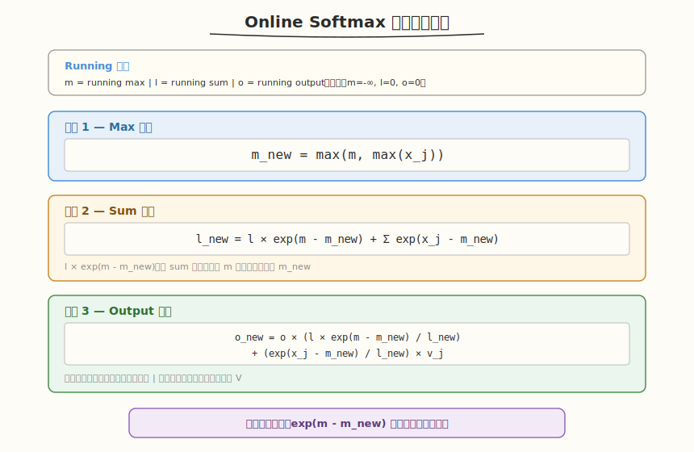

## Day 5：FlashAttention CUDA 实现（简化版）

### 🎯 目标

通过今天的学习，你将：

1. 理解标准 Attention 的 O(N²) HBM 访问瓶颈
2. 掌握 FlashAttention 的核心创新：分块（Tiling）+ Online Softmax
3. 能完整推导 Online Softmax 三个更新公式（m_new, l_new, o_new）
4. 理解 `exp(m - m_new)` 缩放因子的作用
5. 手写简化版 FlashAttention Forward Kernel

> 💡 **为什么重要**：FlashAttention 是推理优化的第一考点，大模型 Infra 面试标配。它不是靠减少 FLOPS 加速（计算量相同），而是靠**减少 HBM 数据移动**——这体现了 AI Infra 的核心原则：减少数据移动比减少计算更重要。

---

### 学前导读：标准 Attention 的问题


#### 标准 Attention 计算

```
S = Q × K^T (N×N 矩阵，O(N²) 显存)
P = softmax(S) (N×N 矩阵，O(N²) 显存)
O = P × V (输出，O(N×d) 显存)
```

#### HBM 访问瓶颈

以 N=4096, d=64 为例，标准 Attention 的 HBM 读写量：

```
读 Q: N×d = 262K
读 K: N×d = 262K
写 S: N×N = 16M ← O(N²) 瓶颈
读 S: N×N = 16M
写 P: N×N = 16M ← O(N²) 瓶颈
读 P: N×N = 16M
读 V: N×d = 262K
写 O: N×d = 262K
总计 HBM 读写: ~48M elements ≈ 192MB
```

**核心问题**：S 和 P 两个 N×N 中间矩阵必须写入 HBM 再读回，导致 O(N²) 的 HBM 访问。

#### FlashAttention 的核心洞察

> 不需要把 S 和 P 完整写入 HBM。通过分块计算，在 SRAM（Shared Memory）+ 寄存器中完成 softmax 和输出累加，HBM 访问降为 O(Nd) 级别（d 为 head dim；把 d 看作常数时即 O(N)）。

---

### Attention 基础回顾

在深入 FlashAttention 之前，先把 Attention 本身的基础打牢——这些是面试的“开胃题”，答不好后面就不用聊了。

#### 0.1 为什么需要 Attention

RNN/LSTM 按时间步串行处理序列，有两个致命问题：

- **无法并行**：第 t 步依赖第 t-1 步的隐状态，GPU 的并行能力完全用不上
- **长程依赖衰减**：远距离信息要逐格传递，梯度在长链上消失

Attention 让序列中**任意两个位置直接交互**，一步建立连接，且所有位置的计算互相独立、可以完全并行——这正是它能吃满 GPU 的根本原因。

#### 0.2 Scaled Dot-Product Attention 公式

```
Attention(Q, K, V) = softmax(Q·Kᵀ / √d) · V

其中 Q = X·W_Q, K = X·W_K, V = X·W_V（self-attention 时三者同源，都来自输入 X）
Q/K/V 形状均为 (N × d)：N 是序列长度，d 是 head 维度
```

**直觉类比（查字典）**：每个 token 拿着自己的 Query 去和所有 token 的 Key 比相似度（点积），相似度经 softmax 归一化成权重，再对 Value 加权求和——就像用查询词在字典里检索：Key 是索引，Value 是取回的内容。

**三步拆解**：

1. **算相似度**：`S = Q·Kᵀ / √d`，形状 (N×N)，`s_ij` 表示第 i 个 token 对第 j 个 token 的关注度
2. **归一化**：softmax 按行做，每行变成一个和为 1 的概率分布
3. **加权求和**：`O = P·V`，每个位置的输出是全体 Value 按关注度的加权和

#### 0.3 为什么除以 √d

- 假设 q、k 的各分量独立、均值为 0、方差为 1，则点积 `q·k = Σ q_i·k_i` 的**方差等于 d**
- d 越大，score 的量级越大（约 √d 倍），softmax 的输入落在**饱和区**：输出逼近 one-hot，梯度趋近于 0，训练难以收敛
- 除以 √d 把 score 的方差归一回 1，softmax 工作在梯度敏感区
- **面试加分点**：这个系数不是拍的常数，是从方差推导出来的——BERT/GPT 的 d_head=64 时 `1/√d = 0.125`

#### 0.4 Softmax 为什么减 max（数值稳定性）

```
softmax(x)_i = exp(x_i) / Σ exp(x_j)  ← 直接算，x_i 稍大 exp 就溢出（float32 exp(89) ≈ inf）
softmax(x)_i = exp(x_i - c) / Σ exp(x_j - c)  ← 数学上严格相等（分子分母同乘 exp(-c)）
取 c = max(x)，保证指数 ≤ 0，exp 结果落在 (0, 1]，不会溢出
```

**与今天的联系**：减 max 需要**全局**最大值，而分块计算时每块只能看到局部——这就是 Online Softmax 要递推维护 running max 的原因，5.2 节会展开。

#### 0.5 Multi-Head Attention

```
MultiHead(X) = Concat(head_1, ..., head_h) · W_O
head_i = Attention(X·W_Qⁱ, X·W_Kⁱ, X·W_Vⁱ)
```

- **单头只有一个表示子空间**；多头把 d_model 切成 h 份（`d_head = d_model / h`，如 d_model=512、h=8 → d_head=64），各自独立做 attention，最后拼接过 W_O
- 不同头可以学不同类型的关系（语法、指代、位置、语义……），类似 CNN 里多个卷积核
- 总计算量与“单头全维度”基本相当——多头不增加 FLOPs，增加的是表达能力
- 代码层面：今天的 kernel 用 `blockIdx.y` 索引 head，**各 head 之间完全独立**，天然按 block 并行

#### 0.6 Self / Cross Attention 与 Causal Mask

| 类型 | Q 来自 | K/V 来自 | 典型场景 |
|---|---|---|---|
| Self-Attention | X 本身 | X 本身 | Encoder（BERT）、Decoder 单层内部 |
| Cross-Attention | Decoder 当前状态 | Encoder 输出 | 机器翻译、T5/BART 的解码层 |

**Causal Mask（因果掩码）**：Decoder 自回归生成时，位置 i 只能看到 ≤ i 的 token，即对 S 加一个下三角为 0、上三角为 `-inf` 的掩码（`-inf` 经 softmax 后权重为 0）。实验 4 会动手在本 kernel 上加 causal mask。

#### 0.7 复杂度总览（引出今天的主线）

| 项目 | 复杂度 | 说明 |
|---|---|---|
| 计算量 | O(N²d) | QKᵀ 和 P·V 各一次 (N×N)×(N×d) 的 GEMM |
| 显存/访存 | O(N²) | S、P 两个 N×N 中间矩阵 |

d 固定时，**长序列的瓶颈是 N² 的显存和 HBM 访问，而不是计算**——这正是 FlashAttention 要解决的问题，也是 5.1 节分块策略的动机。

---

### 理论学习

#### 5.1 分块策略（Tiling）


FlashAttention 将 Q/K/V 分块装入 SRAM，在片上完成计算：

```
┌─────────────────────────────────────────────┐
│  Attention Output O (N×d)                   │
│  ┌────────┐  ┌────────┐  ┌────────┐         │
│  │ Q Tile │  │ Q Tile │  │ Q Tile │  ...    │  ← Br rows each
│  └───┬────┘  └───┬────┘  └───┬────┘         │
│      └───────────┼───────────┘              │
│                  ▼                          │
│   K,V iterate: ┌────────┐                   │
│                │ KV Tile│  ← Bc rows each   │
│                └────────┘                   │
└─────────────────────────────────────────────┘

外循环：遍历 Q tile（行方向，步长 Br）
  内循环：遍历 KV tile（行方向，步长 Bc）
    每步计算：S_tile = Q_tile × KV_tile^T (Br×Bc)
    在线更新 softmax 和输出累加
```

**关键**：Q tile 驻留在 SRAM 中（不移动），K/V tile 逐块滑入。每计算完一个 KV tile，立即更新 running softmax 状态和输出累加器。

**分块大小约束**：SRAM 只需容纳 Q/K/V 三个 tile：`Br×d + 2×Bc×d ≤ SRAM 容量`。S/P 中间结果只活在寄存器里，不占 SRAM、更不落 HBM（FlashAttention 论文也是这个口径）。在静态 `__shared__` 48 KB/block 的统一硬上限下，Br、Bc 不能取得太大。

#### 5.2 Online Softmax 三公式推导



这是 FlashAttention 的核心创新，也是面试必考的白板推导题。

##### 标准 Softmax 回顾

```
y_i = exp(x_i - m) / l
where m = max(x_j) (全局最大值)
      l = Σ exp(x_j - m) (全局求和)
```

**分块计算的问题**：每个 KV tile 只能看到部分 x_j，不知道全局 max，无法直接做 softmax。

##### Online Softmax 解决方案

维护 running 状态 `(m, l, o)`，每处理一个新块时增量更新：

- `m`：已处理所有块的 running maximum
- `l`：已处理所有块的 running sum（以 m 为参考点的指数和）
- `o`：已处理所有块的 running output（部分加权和）

**初始状态**：`m = -inf, l = 0, o = 0`（零向量）

##### 推导过程

处理新块 `x_j` 时，新块有自己的局部最大值。全局 max 从 `m` 更新到 `m_new = max(m, max(x_j))`。

当全局 max 变化时，之前的所有 exp 值需要重新缩放（因为 softmax 的减 max 参考点变了）：

```
旧值以 m 为参考：exp(x_old - m)
新参考点是 m_new：exp(x_old - m_new) = exp(x_old - m) × exp(m - m_new)

所以之前的 sum 需要缩放：l_new_partial = l × exp(m - m_new)
新块的 sum：sum(exp(x_j - m_new))
```

由此得到三个更新公式：

**公式 1 — Max 更新**：
```
m_new = max(m, max(x_j))
```
含义：全局 max 可能是之前的 m，也可能是新块中的某个值。

**公式 2 — Sum 更新**：
```
l_new = l × exp(m - m_new) + Σ exp(x_j - m_new)
```
含义：
- `l × exp(m - m_new)`：将之前的 running sum 从旧参考点 m 缩放到新参考点 m_new
- `Σ exp(xj - m_new)`：新块的指数和，直接以 m_new 为参考

**公式 3 — Output 更新**：
```
o_new = o × (l × exp(m - m_new) / l_new) + (exp(x_j - m_new) / l_new) × v_j
```
含义：
- `o × (l × exp(m - m_new) / l_new)`：将之前累积的输出按新的概率分布重新归一化
- `(exp(x_j - m_new) / l_new) × v_j`：新块的贡献，以新的全局概率权重加权 V

**最终输出**：公式 3 把归一化"摊"进了每一步——`o` 始终是**已归一化**的部分结果，所以所有 KV tile 处理完后 `o` 就是最终输出，**末尾无需再除 l**。本教程的 kernel 采用这种写法。

> 💡 **另一种等价写法（FA 论文的原始形式）**：`o` 只累加**未归一化**的加权和，每步只做 `o_new = o × exp(m - m_new) + Σ exp(x_j - m_new) × v_j`，全部 tile 处理完最后做一次 `O = o / l`。两种写法数学上严格等价：前者每步多一次除法、状态更直观；后者把 N/Bc 次除法省成 1 次——FlashAttention-2 正是靠这种"推迟归一化"减少了 non-matmul FLOPs。面试手写推导时用任何一种都可以，但要能讲清两者的差别。

##### 关键理解点

1. 三个公式是**递推的**：每次新块到来时，用旧 `(m, l, o)` 和新块 `(x_j, v_j)` 计算新 `(m_new, l_new, o_new)`
2. `exp(m - m_new)` 是**关键缩放因子**，保证全局参考点一致
3. 整个过程 HBM 访问量为 **O(Nd) 级别**，因为不需要存储中间 S 和 P 矩阵

---

### Coding 任务：FlashAttention 简化版 Forward Kernel

> ⚠️ **关于 1/√d scale**：标准 Attention 的 score 是 `Q·K^T / √d`。本简化版为了聚焦 online softmax 的结构，**省略了 scale**（GPU kernel 与 CPU 参考实现同步省略，数值对比仍然自洽）。LeetGPU 提交和面试手写时记得加回——在 `s` 算出后乘 `1.0f / sqrtf(D)` 即可，[LeetGPU 题解](../../../../leetgpu/week2/day5/leetgpu-softmax-attention-solution.md)的 kernel 有完整示范。

#### 任务 1：创建 flash_attention.cu

创建文件 `kernels/flash_attention.cu`：

```cuda
// flash_attention.cu —— FlashAttention 简化版 Forward Kernel
// 编译命令: nvcc -o flash_attention flash_attention.cu -O3 -arch=sm_120
// 运行命令: ./flash_attention

#include <cuda_runtime.h>
#include <cstdio>
#include <cstdlib>
#include <cmath>
#include <algorithm>

#define Br 64 // Q tile 的行数；本实现一个 block 固定 Br 个线程，每个线程负责 Q tile 的一行
#define Bc 32 // K/V tile 的行数；Bc=32 时 SRAM 占 32 KB，Bc=64 会顶到 48 KB 静态上限、每 SM 只能驻留 1 个 block
#define D 64  // Head dimension

__global__ void flashAttentionFwd(const float* __restrict__ Q, const float* __restrict__ K, const float* __restrict__ V,
                                  float* __restrict__ O, int N, int numHeads) {
    __shared__ float s_Q[Br][D]; // Q tile: Br×D
    __shared__ float s_K[Bc][D]; // K tile: Bc×D
    __shared__ float s_V[Bc][D]; // V tile: Bc×D
    // 注意：S/P 中间结果不放 shared memory，每个线程用寄存器/local 保存自己那一行的值

    int batch = blockIdx.z;
    int head = blockIdx.y;
    int qTileRow = blockIdx.x * Br;

    int tid = threadIdx.x;        // 本线程负责的 Q 行（tile 内偏移）
    int qRow = qTileRow + tid;    // 全局行号
    int bhOffset = (batch * numHeads + head) * N;

    // 每个线程维护自己那一行的 running 状态
    float m = -1e30f;   // running max
    float l = 0.0f;     // running sum
    float acc[D] = {0}; // running output accumulator（每步归一化变体，末尾无需再除 l）

    // Step 1: 全 block 协作加载 Q tile 到 Shared Memory（全局内存合并访问）
    for (int idx = tid; idx < Br * D; idx += Br) {
        int r = idx / D, c = idx % D;
        s_Q[r][c] = (qTileRow + r < N) ? Q[bhOffset * D + (qTileRow + r) * D + c] : 0.0f;
    }
    __syncthreads();

    // Step 2: 内循环遍历 K/V tile
    for (int kvStart = 0; kvStart < N; kvStart += Bc) {
        // 2a: 协作加载 K 和 V tile
        for (int idx = tid; idx < Bc * D; idx += Br) {
            int r = idx / D, c = idx % D;
            s_K[r][c] = (kvStart + r < N) ? K[bhOffset * D + (kvStart + r) * D + c] : 0.0f;
            s_V[r][c] = (kvStart + r < N) ? V[bhOffset * D + (kvStart + r) * D + c] : 0.0f;
        }
        __syncthreads();

        // 2b+2c: 每个线程独立计算自己那一行的 score，并做 Online Softmax 更新
        if (qRow < N) {
            int kvLen = min(Bc, N - kvStart); // 最后一个 tile 可能不满

            // 2b: s_row[c] = Q[qRow] · K[kvStart+c]，本行对当前 KV tile 的 kvLen 个 score
            float s_row[Bc];
            float m_tile = -1e30f;
            for (int c = 0; c < kvLen; c++) {
                float s = 0.0f;
                #pragma unroll
                for (int d = 0; d < D; d++)
                    s += s_Q[tid][d] * s_K[c][d];
                s_row[c] = s; // 面试/LeetGPU 版本这里要乘 1/sqrtf(D)
                m_tile = fmaxf(m_tile, s);
            }

            // 公式1: max 更新
            float m_new = fmaxf(m, m_tile);

            // 公式2: sum 更新（l_scale 把旧 sum 从参考点 m 缩放到 m_new）
            float l_scale = expf(m - m_new);
            float l_new = l * l_scale;
            for (int c = 0; c < kvLen; c++) {
                s_row[c] = expf(s_row[c] - m_new); // p_c = exp(s_c - m_new)
                l_new += s_row[c];
            }

            // 公式3: output 更新（每步归一化变体）
            float o_scale = (l * l_scale) / l_new;
            #pragma unroll
            for (int d = 0; d < D; d++)
                acc[d] *= o_scale;
            for (int c = 0; c < kvLen; c++) {
                float p_norm = s_row[c] / l_new;
                #pragma unroll
                for (int d = 0; d < D; d++)
                    acc[d] += p_norm * s_V[c][d];
            }

            m = m_new;
            l = l_new;
        }
        __syncthreads(); // 等所有线程用完 s_K/s_V，再加载下一个 tile
    }

    // Step 3: 写回最终结果
    if (qRow < N) {
        for (int d = 0; d < D; d++)
            O[bhOffset * D + qRow * D + d] = acc[d];
    }
}

// 避免宏 D 与函数参数名冲突
#undef D

// CPU 参考实现（标准 Attention，用于验证正确性；与 kernel 同步省略 1/√d scale）
void cpuAttention(const float* Q, const float* K, const float* V, float* O, int N, int D) {
    float* S = (float*)malloc(N * N * sizeof(float));
    for (int i = 0; i < N; i++) {
        for (int j = 0; j < N; j++) {
            float sum = 0;
            for (int d = 0; d < D; d++)
                sum += Q[i * D + d] * K[j * D + d];
            S[i * N + j] = sum;
        }
    }
    for (int i = 0; i < N; i++) {
        float maxVal = S[i * N];
        for (int j = 1; j < N; j++)
            maxVal = fmaxf(maxVal, S[i * N + j]);
        float sum = 0;
        for (int j = 0; j < N; j++) {
            S[i * N + j] = expf(S[i * N + j] - maxVal);
            sum += S[i * N + j];
        }
        for (int j = 0; j < N; j++)
            S[i * N + j] /= sum;
    }
    for (int i = 0; i < N; i++) {
        for (int d = 0; d < D; d++) {
            float sum = 0;
            for (int j = 0; j < N; j++)
                sum += S[i * N + j] * V[j * D + d];
            O[i * D + d] = sum;
        }
    }
    free(S);
}

void initMatrix(float* mat, int rows, int cols) {
    for (int i = 0; i < rows * cols; i++)
        mat[i] = (static_cast<float>(rand()) / RAND_MAX - 0.5f) * 0.2f;
}

bool checkResult(const float* gpu, const float* cpu, int n, float eps) {
    for (int i = 0; i < n; i++) {
        if (fabs(gpu[i] - cpu[i]) > eps) {
            printf("Mismatch at %d: GPU=%.6f, CPU=%.6f\n", i, gpu[i], cpu[i]);
            return false;
        }
    }
    return true;
}

int main() {
    const int N = 256;
    const int D = 64;
    const int batchSize = 1;
    const int numHeads = 1;

    printf("=== FlashAttention Simplified Forward ===\n");
    printf("Config: N=%d, D=%d, batch=%d, heads=%d\n", N, D, batchSize, numHeads);
    printf("SRAM usage per block: %.2f KB\n", (Br * D + Bc * D * 2) * sizeof(float) / 1024.0);

    size_t totalElements = batchSize * numHeads * N * D;
    size_t bytes = totalElements * sizeof(float);

    float* h_Q = (float*)malloc(bytes);
    float* h_K = (float*)malloc(bytes);
    float* h_V = (float*)malloc(bytes);
    float* h_O = (float*)malloc(bytes);
    float* h_O_CPU = (float*)malloc(bytes);

    srand(42); // 只播种一次：若在 initMatrix 里每次 srand(42)，Q/K/V 会被初始化成完全相同的矩阵
    initMatrix(h_Q, batchSize * numHeads * N, D);
    initMatrix(h_K, batchSize * numHeads * N, D);
    initMatrix(h_V, batchSize * numHeads * N, D);

    float *d_Q, *d_K, *d_V, *d_O;
    cudaMalloc(&d_Q, bytes);
    cudaMalloc(&d_K, bytes);
    cudaMalloc(&d_V, bytes);
    cudaMalloc(&d_O, bytes);
    cudaMemcpy(d_Q, h_Q, bytes, cudaMemcpyHostToDevice);
    cudaMemcpy(d_K, h_K, bytes, cudaMemcpyHostToDevice);
    cudaMemcpy(d_V, h_V, bytes, cudaMemcpyHostToDevice);

    dim3 gridDim((N + Br - 1) / Br, numHeads, batchSize);
    dim3 blockDim(Br); // 一个 block Br 个线程，每个线程负责 Q tile 的一行

    printf("Grid: (%d, %d, %d), Block: %d\n", gridDim.x, gridDim.y, gridDim.z, blockDim.x);

    cudaEvent_t start, stop;
    cudaEventCreate(&start);
    cudaEventCreate(&stop);

    cudaEventRecord(start);
    flashAttentionFwd<<<gridDim, blockDim>>>(d_Q, d_K, d_V, d_O, N, numHeads);
    cudaEventRecord(stop);
    cudaEventSynchronize(stop);

    float ms;
    cudaEventElapsedTime(&ms, start, stop);
    cudaMemcpy(h_O, d_O, bytes, cudaMemcpyDeviceToHost);

    cpuAttention(h_Q, h_K, h_V, h_O_CPU, N, D);
    bool correct = checkResult(h_O, h_O_CPU, totalElements, 1e-3);

    printf("GPU Time: %.3f ms\n", ms);
    printf("Result check: %s\n", correct ? "PASS" : "FAIL");

    free(h_Q);
    free(h_K);
    free(h_V);
    free(h_O);
    free(h_O_CPU);
    cudaFree(d_Q);
    cudaFree(d_K);
    cudaFree(d_V);
    cudaFree(d_O);
    cudaEventDestroy(start);
    cudaEventDestroy(stop);

    return 0;
}
```

**实现要点**（与标准实现的差异，面试可以主动讲）：

- **一个线程负责 Q tile 的一行**：running 状态 `(m, l, acc)` 天然按行隔离，每个线程独立跑自己的 online softmax，无需跨线程通信
- **S/P 不落 shared memory**：`s_row[Bc]` 和 `acc[D]` 在寄存器/local 中，shared memory 只放 Q/K/V 三个 tile——这正是 5.1 节"SRAM 只需 `Br×d + 2×Bc×d`"的原因
- **边界处理**：`qRow >= N` 的线程只参与 tile 加载和 `__syncthreads`，不做计算；最后一个 KV tile 用 `kvLen` 截断

#### 任务 2：编译运行

```bash
nvcc -o flash_attention kernels/flash_attention.cu -O3 -arch=sm_120
./flash_attention
```

**预期输出**：

```
=== FlashAttention Simplified Forward ===
Config: N=256, D=64, batch=1, heads=1
SRAM usage per block: 32.00 KB
Grid: (4, 1, 1), Block: 64
GPU Time: x.xxx ms
Result check: PASS
```

#### 任务 3：验证 SRAM 使用量

代码中打印了 SRAM 使用量。验证计算（Br=64, Bc=32, D=64, float32）：

```
s_Q[Br][D] = 64×64×4 = 16 KB
s_K[Bc][D] = 32×64×4 =  8 KB
s_V[Bc][D] = 32×64×4 =  8 KB
总计 = 32 KB（S/P 在寄存器中，不占 shared memory）
```

几个容易记混的数字（面试常作为追问）：

- **静态** `__shared__` **上限统一是 48 KB/block**（所有 CUDA 架构）；要超过它必须改用动态 shared memory + `cudaFuncSetAttribute` opt-in
- **每 SM 的 shared memory 上限**：A100 = 164 KB，H100 = 228 KB，RTX 5090 (sm_120) = **100 KB**（128 KB unified cache，carveout 可调 0–100 KB，每 block 动态上限 99 KB）
- 本配置 32 KB 在静态上限内，且每 SM 可同时驻留 ⌊100/32⌋ = 3 个 block；Bc 改成 64 会顶到 48 KB 静态上限，occupancy 掉到 1 block/SM

#### 任务 4：LeetGPU 在线题目 —— Softmax Attention

**题目链接**：<https://leetgpu.com/challenges/softmax-attention>

**题目概述**：

给定 Query (M×d)、Key (N×d)、Value (N×d)，计算 Scaled Dot-Product Attention：Attention(Q,K,V) = softmax(Q·K^T / √d) · V。

**约束条件**：`1 ≤ M, N ≤ 4096`，`1 ≤ d ≤ 128`，元素范围 `[-1.0, 1.0]`

**难度**：困难　**标签**：CUDA、Attention、Online Softmax、FlashAttention、分块计算

**与今日知识的关联**：

本题直接对应 Day 5 的主题——FlashAttention。标准实现会把 S=QK^T 和 P=softmax(S) 写回 HBM（O(N²) 访存）；FlashAttention 用 Online Softmax 分块计算，S/P 不落 HBM（O(Nd) 访存）。注意**题目要求带 1/√d scale**，提交时别忘了。

**解题思路**：

分块计算：Q tile 驻留 SRAM，K/V tile 逐块滑入。用 Online Softmax 三公式增量更新 m/l/o：m_new=max(m,mj); l_new=l*exp(m-m_new)+Σexp(xj-m_new); o_new=...。

**参考实现**：

```cuda
#define BLOCK_M 64
#define BLOCK_N 64

__global__ void flash_attention(const float* Q, const float* K, const float* V, float* O, int M, int N, int d) {
    // Q tile 驻留寄存器/SRAM
    float q_tile[BLOCK_M][d]; // 简化,实际用 shared memory

    float m_i[BLOCK_M];    // running max
    float l_i[BLOCK_M];    // running sum
    float o_i[BLOCK_M][d]; // running output

    // 初始化
    for (int i = 0; i < BLOCK_M; i++) {
        m_i[i] = -INFINITY;
        l_i[i] = 0.0f;
        for (int j = 0; j < d; j++)
            o_i[i][j] = 0.0f;
    }

    // 遍历 K/V tiles
    for (int kv_start = 0; kv_start < N; kv_start += BLOCK_N) {
        // 加载 K/V tile, 计算 S = Q * K^T / sqrt(d)
        // s_ji = Q[i] · K[j] / sqrt(d)

        // Online Softmax 更新
        // m_new = max(m_i, max(s_j))
        // l_new = l_i * exp(m_i - m_new) + sum(exp(s_j - m_new))
        // o_new = o_i * (l_i * exp(m_i - m_new) / l_new)
        //              + (exp(s_j - m_new) / l_new) * V[j]

        // (省略具体实现, 见 Day 5 教程的完整 kernel)
    }

    // 写回 O
}
```

> 💡 提交后在 [LeetGPU Softmax Attention 题目](https://leetgpu.com/challenges/softmax-attention)上记录通过耗时，用 ncu 对比不同参数的性能差异。完整题解见 [Softmax Attention 题解](../../../../leetgpu/week2/day5/leetgpu-softmax-attention-solution.md)。

#### 任务 5：LeetCode 面试题 —— 二叉树的层序遍历

**题目链接**：[102. 二叉树的层序遍历](https://leetcode.cn/problems/binary-tree-level-order-traversal/)

**题目概述**：

给定二叉树根节点 `root`，返回其节点值的层序遍历结果（逐层从左到右，每层一个子数组）。

**与今日知识的关联**：

本题核心是 **BFS 队列**——用队列逐层处理节点，每层批量进出。这与今天 FlashAttention 的 **tiling 分块**思路一致：FlashAttention 把 N 个 key/value 分成一块块 KV tile 逐块滑入 SRAM 处理，BFS 把树分成一层层逐层处理。两者都是**把全局问题切成块/层，用缓冲区（队列/SRAM）承载当前块，逐块推进**的流水线化思维。

**核心套路**：

```
队列存当前层节点；每轮取队列全部节点（=当前层），
记录值，把子节点入队（=下一层）；重复直到队空
```

> 💡 完整题解（含 C++/Python 参考代码、复杂度分析、面试要点）见 [二叉树的层序遍历题解](../../../../leetcode/daily/week2/day5/二叉树的层序遍历.md)。

---

### 扩展实验

#### 实验 1：手动推导 Online Softmax

假设已处理块的 `m=2.0, l=3.0`，已归一化的旧输出 `o=0.5`（为简单起见假设 V 是一维标量），新块的 score 为 `[3.0, 1.0, 4.0]`，对应的 `v = [1.0, 2.0, 3.0]`，计算新的 `m_new, l_new, o_new`。

> 提示：
> - `m_new = max(2.0, max(3.0, 1.0, 4.0)) = 4.0`
> - `l_scale = exp(2.0 - 4.0) = exp(-2.0) ≈ 0.1353`
> - `l_new = 3.0 × 0.1353 + exp(3-4) + exp(1-4) + exp(4-4)`
>   `= 0.406 + 0.368 + 0.050 + 1.0 = 1.824`
> - `o_scale = l × l_scale / l_new = 0.406 / 1.824 ≈ 0.2225`
> - `o_new = 0.5 × 0.2225 + (0.368×1.0 + 0.050×2.0 + 1.0×3.0) / 1.824`
>   `≈ 0.1113 + 3.4676 / 1.824 ≈ 0.1113 + 1.9012 ≈ 2.01`
>
> **验证**（按全局 softmax 重新算一遍）：旧块质量缩放到新参考点 = `3.0×exp(-2) = 0.406`，其分子贡献 = `0.5×0.406 = 0.203`；最终输出 = `(0.203 + 3.4676) / 1.824 ≈ 2.01` ✓ 与递推结果一致——这说明 online 更新与"全量算一遍"严格等价。

#### 实验 2：增大序列长度对比 HBM 访问量

修改测试尺寸到 N=1024 或 N=2048，对比 FlashAttention 和标准 Attention 的理论 HBM 访问量：

| N | 标准 Attention HBM | FlashAttention HBM | 加速比 |
|---|---|---|---|
| 256 | O(N²+Nd) | O(Nd) | ~N/d |
| 1024 | | | |
| 2048 | | | |

> FlashAttention 的 HBM 访问 = O(Nd)（只读 Q/K/V，只写 O）；标准 Attention = O(N²+Nd)。

#### 实验 3：用 ncu 分析 FlashAttention Kernel

```bash
nvcc -o flash_attn_profile kernels/flash_attention.cu -O3 -arch=sm_120 -g -lineinfo
ncu --kernel-name regex:flashAttentionFwd \
    --metrics sm__throughput.avg.pct_of_peak_sustained_elapsed,\
dram__throughput.avg.pct_of_peak_sustained_elapsed,\
sm__occupancy.avg.pct_of_peak_sustained_elapsed \
    ./flash_attn_profile
```

观察 FlashAttention 是 memory-bound 还是 compute-bound，对比标准 Attention 的指标。

#### 实验 4：给 Kernel 加 Causal Mask（思考题）

Decoder 推理要求位置 i 只能 attend 到 ≤ i 的 key（下三角 mask）。在本 kernel 上的改法：

1. **整块跳过**：当 `kvStart > qRow` 时直接 `break`——对角线以右的 KV tile 对本行毫无贡献
2. **对角线 tile 内逐元素判断**：当 `kvStart + c > qRow` 时跳过该 c（或把 `s_row[c]` 置为 `-inf`，让它在 exp 后权重为 0）
3. 完全在对角线左侧的 tile（`kvStart + Bc - 1 <= qRow`）不需要任何判断，全速跑

注意加了 mask 之后计算量减半，但 tiling 的访存结构不变——这就是 causal attention 依然适合 FlashAttention 的原因。

> 💡 LeetGPU 上有专门的 [Causal Self-Attention](https://leetgpu.com/challenges/causal-self-attention) 题目，做完今天的 kernel 可以直接去挑战。

---

### 延伸：FlashAttention-2 / 3 改了什么（面试高频追问）

| 版本 | 核心改进 | 效果 |
|---|---|---|
| **FA1**（2022） | Tiling + Online Softmax，S/P 不物化 | HBM IO 从 O(N²) 降到 O(Nd) 级别，2-4x 加速 |
| **FA2**（2023） | ① 外循环从 KV tile 换成 Q tile：每个 block 独占一个 Q tile 的输出，消除跨 block 通信 ② 推迟归一化（`o` 最后才除 `l`）+ 减少 rescale 次数，降低 non-matmul FLOPs ③ warp 之间按 Q 行切分，减少 shared memory 读写和 barrier | 再快 ~2x，A100 上从 ~30% 峰值提到 50-70% |
| **FA3**（2024，Hopper） | ① FP8 低精度 ② warp specialization：producer/consumer 异步流水（TMA + wgmma）③ GEMM 与 softmax 块间 overlap 隐藏延迟 | H100 上达 ~75% 理论峰值利用率 |

> 💡 **面试答法**：先讲 FA1 的 IO 感知（今天的内容），再补一句"FA2 主要是工程优化——减少 non-matmul FLOPs、更好的并行划分；FA3 是挖掘 Hopper 硬件特性——异步流水 + FP8"。共同主线：**让 GPU 的时间尽量花在 Tensor Core 的 GEMM 上**，softmax 的 exp/除法吞吐远低于 GEMM 单元，能省则省、能藏则藏。

### 验证 Checklist

- [ ] 能推导出 Online Softmax 的三个更新公式（m_new, l_new, o_new）
- [ ] 能理解每个公式中 `exp(m - m_new)` 缩放因子的作用（统一参考点）
- [ ] 能讲清 online softmax 两种变体的等价性（每步归一化 vs 末尾 `o/l`）
- [ ] FlashAttention Kernel 编译运行正确，小尺寸测试通过（与 CPU 对比误差 < 1e-3）
- [ ] 能解释 FlashAttention 的 HBM 访问复杂度为什么是 O(Nd) 而非 O(N²)
- [ ] 能画出 FlashAttention 的 tiling 示意图（Q tile 驻留 SRAM，K/V tile 逐块滑入）
- [ ] 能计算 SRAM 使用量：`Br×D + Bc×D×2`（S/P 在寄存器），确认不超过 48 KB 静态上限
- [ ] 能解释 FlashAttention 的加速来源（减少 HBM 访问，而非减少计算量）
- [ ] 能写出 Attention 完整公式并解释 Q/K/V 的含义（检索类比）
- [ ] 能推导为什么除以 √d（q·k 方差 ∝ d，softmax 饱和导致梯度消失）
- [ ] 知道本简化版省略了 1/√d scale，并能指出该在哪一行加回

---

### 今日总结

Day 5 我们掌握了 FlashAttention 的核心思想和实现：

1. **标准 Attention 的瓶颈**：S 和 P 两个 N×N 中间矩阵导致 O(N²) HBM 访问
2. **FlashAttention 的核心**：分块 Tiling + Online Softmax，S/P 只在 SRAM/寄存器中存活，不落 HBM
3. **Online Softmax 三公式**：`m_new = max(m, max(xj))`、`l_new = l×exp(m-m_new) + Σexp(xj-m_new)`、`o_new = o×(l×exp(m-m_new)/l_new) + (exp(xj-m_new)/l_new)×vj`
4. **关键缩放因子**：`exp(m - m_new)` 保证全局参考点一致
5. **HBM 复杂度**：从 O(N²) 降到 O(Nd)，长序列加速 2-4x
6. **加速来源**：不是 FLOPS 减少（计算量相同），而是数据移动减少

---

### 面试要点

1. **FlashAttention 为什么快？请从 HBM 访问量的角度分析。**

<details>
<summary>点击查看答案</summary>

 - **核心问题**：标准 Attention 需要存储和读取 S=Q×K^T 和 P=softmax(S) 两个 N×N 中间矩阵，HBM 访问量为 O(N²)
 - **FlashAttention 方案**：通过分块 tiling + online softmax，在 SRAM/寄存器中完成所有中间计算，不需要将 S 和 P 写入 HBM
 - **HBM 访问对比**：标准 = O(N² + Nd)；FlashAttention = O(Nd)（只读 Q/K/V，只写 O）
 - **速度来源**：不是 FLOPS 减少了（计算量相同），而是**数据移动减少了**——减少数据移动比减少计算更重要
 - **实际加速**：长序列（N>2048）时加速明显（2-4x），因为 HBM 带宽是瓶颈

</details>


2. **请完整推导 Online Softmax 的三个更新公式，并解释每个公式的含义。**

<details>
<summary>点击查看答案</summary>

 ```
 状态：(m, l, o) —— running max、running sum、running output
 新块：(xj, vj) —— 新的 KV tile 的 score 和 value

 公式1 - Max 更新：
 m_new = max(m, max(xj))
 含义：全局 max 可能是之前的 m，也可能是新块中的某个值

 公式2 - Sum 更新：
 l_new = l × exp(m - m_new) + Σ exp(xj - m_new)
 含义：l × exp(m - m_new) 将旧 sum 从旧参考点 m 缩放到新参考点 m_new；
       Σ exp(xj - m_new) 是新块的指数和

 公式3 - Output 更新：
 o_new = o × (l × exp(m - m_new) / l_new) + (exp(xj - m_new) / l_new) × vj
 含义：前半部分将旧输出按新概率重新归一化；后半部分是新块贡献

 关键点：exp(m - m_new) 是统一参考点的缩放因子
 注意：这是"每步归一化"变体（o 始终已归一化）；FA 论文用的是
       "末尾归一化"变体——o 只累加未归一化加权和，最后 O = o/l，
       两者数学等价
 ```

</details>


3. **FlashAttention 的分块大小 Br×Bc 如何确定？**

<details>
<summary>点击查看答案</summary>

 - 硬约束是 SRAM：`Br×d + 2×Bc×d ≤ shared memory 容量`（Q/K/V 三个 tile；S/P 中间结果放寄存器，不占 SRAM）
 - 注意**静态** `__shared__` **有 48 KB/block 的统一硬上限**，超过必须改用动态 shared memory + `cudaFuncSetAttribute` opt-in
 - 各代 GPU 每 SM shared memory 上限：A100 = 164 KB，H100 = 228 KB，RTX 5090 (sm_120) = 100 KB（每 block 动态上限 99 KB）——别把数字记混
 - 本教程 Br=64, Bc=32, D=64：`(64×64 + 2×32×64)×4B = 32 KB`，在静态上限内，每 SM 可驻留 3 个 block
 - 权衡：tile 越大 → K/V 复用率越高、HBM 流量越低，但单 block 占 SRAM 多、occupancy 下降；tile 太小则循环开销占比上升

</details>


4. `exp(m - m_new)` **这个缩放因子为什么重要？**

<details>
<summary>点击查看答案</summary>

 - Softmax 需要减去全局 max 保证数值稳定性
 - 分块计算时每个块只看到局部数据，全局 max 是递推更新的
 - 当 max 从 m 变为 m_new 时，之前所有 exp 值的参考点都变了
 - `exp(m - m_new)` 就是把旧值从参考点 m 缩放到新参考点 m_new 的因子
 - 没有它，不同块计算的概率无法统一到同一个归一化基

</details>


5. **FlashAttention 在 Prefill 和 Decode 阶段的表现有何不同？为什么 Decode 仍受益？**

<details>
<summary>点击查看答案</summary>

 - **Prefill**：序列长 N 大，标准 Attention 的 O(N²) S/P 物化是主要瓶颈，FlashAttention 把 IO 从 O(N²) 降到 O(Nd)，加速 2-4x 最明显
 - **Decode**：M=1，没有 N×N 矩阵，标准 Attention 退化为 1×N，S/P 本就不大。但 FlashAttention 仍受益——它把 softmax+PV 融合在 SRAM 里，减少 kernel launch 数量和中间 HBM 读写，配合 KV Cache 优化 decode 的 memory-bound
 - **关键洞察**：Prefill 的收益主要来自"消除 O(N²) 物化"，Decode 的收益主要来自"kernel fusion 减少 HBM 往返"，两者瓶颈不同但 FlashAttention 都能覆盖

</details>


6. **FlashAttention-2 相比初代做了哪些改进？**

<details>
<summary>点击查看答案</summary>

 - **循环结构**：外循环从 KV tile 换成 Q tile，每个 block 独占一个 Q tile 的输出，消除跨 block 通信（初代需要跨 block 协调 rescale）
 - **减少 non-matmul FLOPs**：推迟归一化（`o` 最后才除 `l`）、减少每步 rescale 次数——softmax 的 exp/除法吞吐远低于 GEMM 单元，省这些比省 matmul 更值
 - **warp 划分**：warp 之间按 Q 行切分（初代按 KV 切分需要跨 warp 通信归约），减少 shared memory 读写和 barrier
 - **结果**：A100 上从 FA1 的 ~30% 峰值利用率提到 50-70%
 - **主线思想**：让 GPU 的时间尽量花在 Tensor Core 的 GEMM 上（FA3 沿这条路继续：Hopper 异步流水 + FP8）

</details>


7. **Attention 为什么要除以 √d？不除会发生什么？**

<details>
<summary>点击查看答案</summary>

 - 设 q、k 各分量独立、均值 0、方差 1，则点积 `q·k = Σ_{i=1..d} q_i·k_i` 的均值为 0、**方差为 d**
 - d 越大，score 量级越大，softmax 输入落在饱和区：输出接近 one-hot
 - softmax 饱和区的梯度趋近于 0 → 反向传播信号消失，训练难以收敛
 - 除以 √d 把 score 方差归一回 1，让 softmax 工作在梯度敏感区
 - 加分回答：`1/√d` 不是拍的常数，是方差归一化推出来的；d_head=64 时为 0.125

</details>


8. **Self-Attention 和 Cross-Attention 有什么区别？Causal Mask 是怎么实现的？**

<details>
<summary>点击查看答案</summary>

 - **Self-Attention**：Q/K/V 同源，都由同一个输入 X 经不同投影得到，建模序列内部依赖
 - **Cross-Attention**：Q 来自一个序列（如 decoder 当前状态），K/V 来自另一个序列（如 encoder 输出），用于跨序列对齐
 - **Causal Mask**：对 score 矩阵 S 加上三角掩码——上三角置 `-inf`，softmax 后这些位置权重为 0，位置 i 只能 attend 到 ≤ i 的 token
 - **实现要点**（结合今天的 kernel）：整块在对角线右侧的 KV tile 可直接跳过；对角线 tile 内逐元素判断；完全在左侧的 tile 无需判断全速跑——加 mask 后计算量减半，tiling 访存结构不变

</details>
