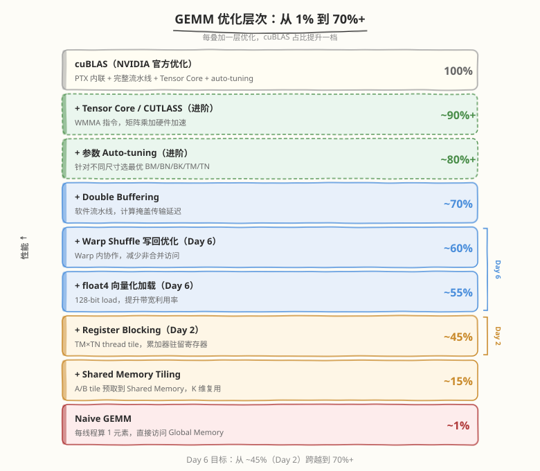
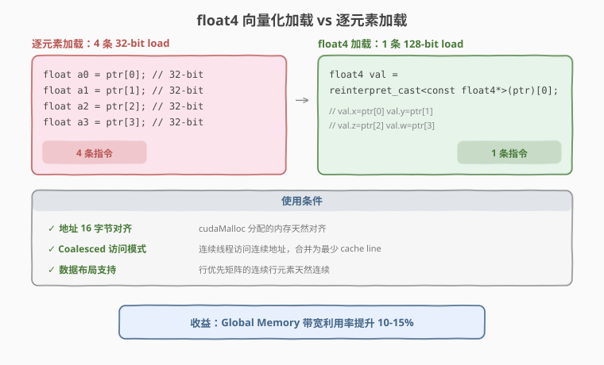
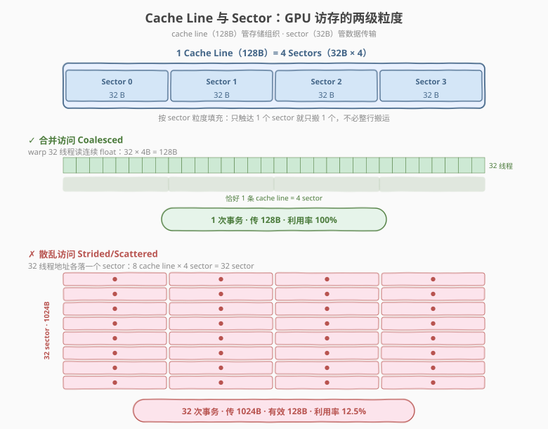
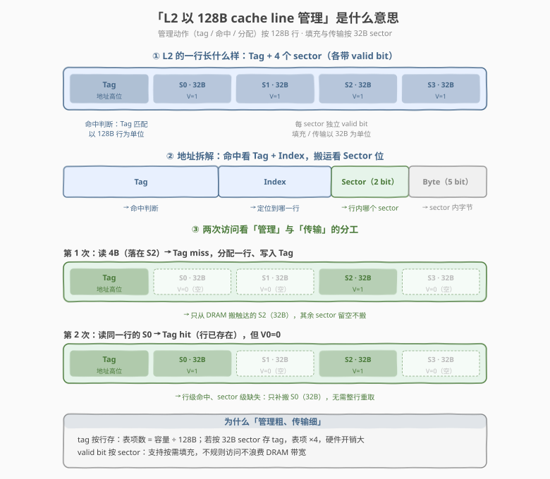
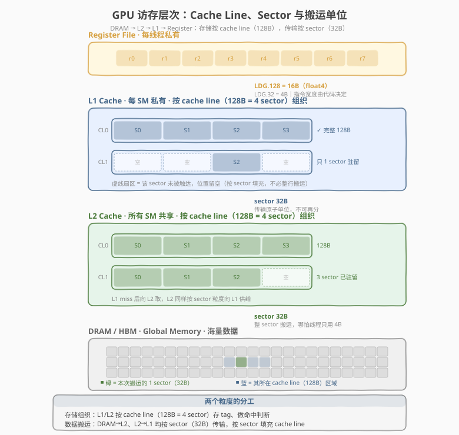
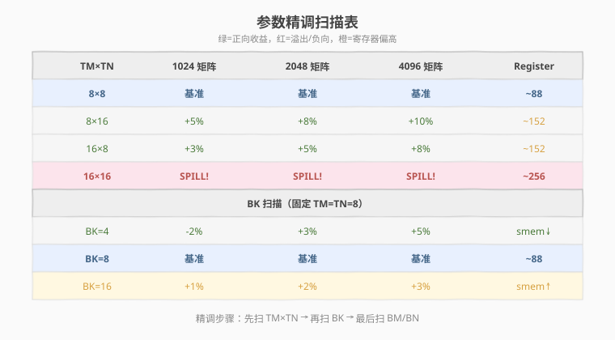
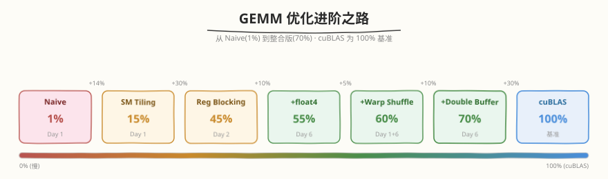

## Day 6：整合优化到 cuBLAS 70%+

### 🎯 目标

通过今天的学习，你将：

1. 理解从 Register Blocking（~45%）到 cuBLAS 70%+ 还需要哪些优化
2. 掌握 `float4` 向量化加载的原理和使用条件
3. 理解 Warp Shuffle 在 GEMM 写回优化中的作用
4. 实现整合版 GEMM：Register Blocking + float4 + Warp Shuffle + Coalesced Write
5. 掌握参数精调（Auto-tuning）的方法论
6. 能用 ncu 验证整合版 GEMM 的性能提升

> 💡 **为什么重要**：「手写 GEMM 到 cuBLAS 80%」是顶级 AI Infra 面试题，今天是从 45% 跨越到 70% 的关键一步。每一层优化都有明确的收益来源，理解这些才能在面试中逐层展开。

---

### 学前导读：从 45% 到 70% 的优化路线



Day 2 的 Register Blocking 达到了 cuBLAS ~45%。要从 45% 提升到 70%+，需要叠加以下优化：

| 优化点 | 增益 | 实现复杂度 | 原理 |
|--------|------|-----------|------|
| **float4 向量化加载** | +10-15% | 中 | 128-bit 访问提升 Global Memory 带宽利用率 |
| **Warp Shuffle 累加** | +5-10% | 中 | Warp 内协作优化写回模式，减少非合并访问 |
| **Coalesced 写回** | +3-5% | 低 | 用 float4 做合并写入 |
| **参数精调** | +5-10% | 低 | Auto-tune BM/BN/BK/TM/TN |

这些优化不是孤立的——它们叠加在一起才能达到 70%+。

---

### 理论学习

#### 6.1 float4 向量化加载



##### 原理

GPU 以 sector（32 bytes）为最小传输粒度访问 Global Memory（L2 以 128-byte cache line = 4 sector 管理）。在指令层，4 个连续 float（16 bytes）可以通过一条 128-bit load 指令完成，比 4 条 32-bit 指令更高效。

```cuda
// 逐个加载：4 条 32-bit load 指令
float a0 = ptr[0];
float a1 = ptr[1];
float a2 = ptr[2];
float a3 = ptr[3];

// float4 向量化加载：1 条 128-bit load 指令
float4 val = reinterpret_cast<const float4*>(ptr)[0];
// val.x, val.y, val.z, val.w 分别是 4 个 float
```

##### 使用条件

1. **内存地址 16 字节对齐**：`cudaMalloc` 分配的内存天然对齐
2. **访问模式 coalesced**：连续线程访问连续地址，warp 内 32 线程的访问合并为最少数量的 cache line 传输
3. **数据布局支持**：行优先矩阵的连续行元素天然连续

##### 风险

如果地址不对齐或访问不连续，float4 可能触发更多 cache line 加载，反而降低性能。

##### 知识补充：cache line 与 sector

理解 float4 为什么快，先要搞清楚 GPU 访存的两个粒度单位：



| 概念 | 大小 | 说明 |
|------|------|------|
| **sector（扇区）** | 32B | GPU 内存的**最小传输单位**。L1↔L2、L2↔DRAM 之间的数据搬运都按 sector 进行——线程只读 4B，硬件也会拉回整个 32B sector |
| **cache line（缓存行）** | 128B | L1/L2 的组织单位，**1 行 = 4 个 sector**，可按 sector 粒度填充，不必整行搬运 |

**sector（32B）——传输的原子单位。** 无论线程要读 1B 还是 4B，硬件从下一级存储搬数据时最小都搬一整个 32B sector，不可再分。这是 L2→L1、DRAM→L2 的搬运粒度。代价是：若一个 sector 里只有 4B 被用到，剩余 28B 也被白白搬过来，称为 **sector 浪费**。所以衡量访存效率的核心指标是「每个被搬来的 sector 里有百分之几的字节被真正用到」。

**cache line（128B）——存储的组织单位。** L1/L2 cache 按 128B 一行来组织（存 tag、做命中判断），1 行正好含 4 个 sector。关键在于**填充粒度是 sector 而非整行**：一次访存若只触达某行的 1 个 sector，就只搬这 1 个 sector 进 cache，其余 3 个 sector 位置留空，不必把整条 128B 都拉回来。这种「按需 sector 填充」让 GPU 对不规则访问比 CPU 更宽容。

**「以 128B cache line 管理」具体指什么？** 指 L2 的**管理动作——存 tag、命中判断、行的分配与替换——都以 128B 行为单位**：一次访问先用地址高位（Tag + Index）定位到某一行，命中与否看的是整行的 tag，而不是具体哪个字节。但每个 sector 有独立的 valid bit，**填充按 sector**：miss 后只从 DRAM 搬触达的那 32B，其余 3 个 sector 留空。为什么这样分工？tag 若按 32B sector 存，表项数翻 4 倍、硬件开销大；valid bit 按 sector 存，又保留了细粒度传输的好处——**存储组织粗（128B）、数据传输细（32B）**，两者兼顾。



> 💡 对比 CPU：CPU cache line 通常 64B，传输和一致性共用这一个粒度——取就取整行、一致性也按整行做；GPU 把两者拆开——cache line（128B）管存储组织，sector（32B）管传输，粒度更细，对不规则访问更友好，代价是 tag 表项更多。

把这两个粒度放回完整的访存层次中，DRAM → L2 → L1 → Register 每一级之间的搬运单位如下图：



> 💡 图中要点：① **L1/L2 都按 cache line（128B = 4 sector）组织**，做 tag 与命中判断；② **DRAM→L2、L2→L1 的传输都按 sector（32B）**，且 cache line 按 sector 粒度填充——L1 中一条 cache line 可以只有 1 个 sector 驻留（虚线扇区位置留空）；③ **L1→Register 的粒度由指令宽度决定**：`LDG.32` 取 4B、`LDG.128`（float4）取 16B，这是代码层可控的，而 sector/cache line 是硬件固定的。

**用 sector 定量描述合并访问（coalescing）。** 一个 warp 32 线程，每个读 1 个 float（4B），访存请求先被硬件合并：

- **合并访问（coalesced）**：32 线程读连续地址，共 `32 × 4B = 128B`，恰好落在 1 条 cache line 的 4 个 sector 内 → 只需传 **4 个 sector = 128B**，1 次内存事务完成，**利用率 100%**。
- **散乱访问（strided/scattered）**：32 线程地址各落一个不同 sector → 要传 **32 个 sector = 1024B**，却只用到 128B，**利用率仅 12.5%（1/8）**，其余 7/8 的带宽被浪费在搬来却用不上的 sector 上。

带宽利用率公式：

```
带宽利用率 = 有效数据量 / 实际传输量
         = (warp 真正读到的字节数) / (被触达的 sector 数 × 32B)
```

coalesced：`128B / (4 × 32B) = 100%`　　scattered：`128B / (32 × 32B) = 12.5%`

> ⚠️ 这就是「coalesced」作为 CUDA 优化第一性原则的根因——它直接决定每个 sector 是否被榨干。float4 之所以更快，一大部分原因正是它强制每线程拿 16B 连续数据，天然把 sector 利用率顶满（见下一小节）。

##### 为什么 float4 更快

关键认知：**float4 并没有减少要搬运的字节数**（数据总量不变），它减少的是**指令数和内存请求数**，并提升每个线程的在途数据量。以"warp 加载 512B 连续数据"为例对比：

| | 32-bit load × 4 | 128-bit load × 1（float4） |
|--|------------------|----------------------------|
| 每线程指令数 | 4 条 `LDG.32` | 1 条 `LDG.128` |
| warp 级内存请求 | 4 次（每次 128B = 4 sector） | 1 次（512B，L1 内部分 4 个 128B wavefront 处理） |
| 地址计算 | 4 次基址 + 偏移 | 1 次 |
| 每线程在途数据 | 4B，拿到才能往下算 | 16B 一次到位，4 个 float 的使用可流水线化 |

收益来源具体有三条：

1. **指令与请求数砍到 1/4**：LSU（加载存储单元）每周期能处理的请求数有限，请求少了 pipeline 就不堵；省下的指令发射槽留给 FMA。GEMM 主循环里最重的访存就是 global→shared 加载，这里指令数砍掉 3/4，直接反映为 SM 吞吐提升——实测 4096 矩阵 v3→v4 从 30.8% 跳到 64.3%，是全天最大的单步增益。
2. **sector 利用率打满**：32-bit 散读时一个 32B sector 可能只用到 4B；float4 保证每线程拿满 16B、warp 拿满 128B 的整数倍，每个被拉回的 sector 都 100% 被用上， DRAM 带宽一点不浪费。
3. **更多数据在途（MLP / ILP）**：一条 `LDG.128` 让 4 个 float 同时 in-flight，访存延迟只需掩盖一次；写成 4 条独立 `LDG.32` 时，编译器还可能因寄存器压力或调度把它们串行化。

> ⚠️ 这三条收益都建立在"16B 对齐 + 访问连续"的前提上。不满足时，一条 128-bit load 可能横跨 2 条 cache line，反而多传 sector——这正是前面"使用条件"三条的由来。写回 C 用 `STG.128` 同理。

##### 常见误区：单线程 float4 只有 16B，sector 利用率是 50% 吗？

不是。**sector 利用率是按 warp 级合并后的内存事务来算的，不是按单条指令、单个线程来算的。**

单线程执行 float4 load 确实只取 16B（半个 sector），但硬件不会为这 16B 单独去 DRAM 搬数据——访存请求先在 **warp 级合并**后才发出：

```
一个 warp = 32 线程 × 16B (float4) = 512B 连续数据
512B = 4 条 cache line = 16 个 sector
```

两个相邻线程的 float4 恰好拼满一个 32B sector：

```
sector 0 [32B]:  thread 0 的 float4 [16B]  +  thread 1 的 float4 [16B]
sector 1 [32B]:  thread 2 的 float4 [16B]  +  thread 3 的 float4 [16B]
...
```

从 DRAM 拉回的每个 sector 的 32B **全部被用上**，利用率是 **100%**。GEMM 的加载模式（连续线程取连续 float4）天然保证相邻线程拼满 sector。

**什么时候才真的是 50%**：warp 内访问模式让 sector 拼不满时，例如只有一半线程活跃（`if (threadIdx.x % 2 == 0)` 做 float4 load），或每线程间隔 32B 取一个 float4（stride = 8 floats）。

顺带纠正一个直觉：coalesced 的 32-bit load（每线程 4B，warp 共 128B = 4 sector）利用率**也是 100%**。float4 的优势不在 sector 利用率本身，而在于前面说的指令/请求数砍到 1/4 和单线程 16B 在途数据（ILP）；前文"32-bit 散读时一个 sector 可能只用到 4B"指的是非合并的散乱场景，不是 coalesced 的 32-bit 连续读。

#### 6.2 Warp Shuffle 在 GEMM 写回中的用途

Day 1 我们用 Warp Shuffle 做 Reduce（多对一求和）。在 GEMM 中，Shuffle 的用途不同：**写回前的 warp 内数据重排**——把累加器在 lane 之间换位，让随后的 `STG` 指令变成 coalesced 模式。一个是"多对一归约"，一个是"一对一置换"，用的 shuffle 原语和目的都不同。

##### 问题来源：写回是否合并，由线程映射决定

Register Blocking 中每个线程持有 TM×TN 累加器子块，写回地址 = f(线程映射, tile 内偏移)。以本 kernel 的 16×16 线程网格（BN/TN=16）为例，两种常见映射的写回模式完全不同：

| 线程映射 | 一个 warp（32 lane）覆盖 | 单条 `STG.128` 触达 | sector 情况 |
|---------|------------------------|--------------------|-------------|
| 行优先（本 kernel：`threadRow=tid/16, threadCol=tid%16`） | 2 行 × 128 列 | 2 段 512B 连续区 | 每条 sector 先写一半，TN/4 的第二次写补齐另一半 → L2 内合并为满 sector 写 |
| 列优先（`threadRow=tid%16, threadCol=tid/16`） | 32 个不同行 | 32 行各 16B | 触达 32 条行、32 个 sector，每个只用一半；另一半要等相邻 warp 很久以后才来 → 部分 sector 写回 DRAM |

```
行优先映射（lane 0-15 同行，写连续 512B）:
  lane:  0    1    2  ... 15 | 16   17 ... 31
  地址: [row0: col0  col8  col16 ...] [row0+8: col0 ...]
        └─ 相邻 lane 地址相邻 → 合并友好

列优先映射（lane 0-31 各占一行）:
  lane:  0      1      2   ... 31
  地址: [row0] [row1]  [row2] ... [row31]  ← 每格 16B 散落 32 行
        └─ 单条指令触达 32 条 cache line → 写回放散
```

线程映射往往是被 global→shared **加载端**的合并需求"逼"出来的；当加载和写回对映射的要求冲突时，就需要在写回前做一次数据重排。

##### Warp Shuffle 回顾

`__shfl_sync(mask, val, srcLane)`：warp 内 lane 间**直接交换寄存器**，每个 lane 从 `srcLane` 指定的 lane 拿到它的 `val`。特性：

- 不经过 shared memory，无 bank conflict，无需 `__syncthreads()`（同步域就是 warp 本身）
- `srcLane` 可以是任意 lane 编号 → 支持任意置换（permutation），不只是 reduce 用的 `__shfl_down` 树形折叠
- 局限：只在 warp 内（32 lane）有效，不能跨 warp

Day 1 的 reduce 是 `__shfl_down_sync` 逐层折叠（多对一）；写回重排是 `__shfl_sync` 指定任意源 lane（一对一置换）。

##### 思路：写回前的 warp 内"寄存器转置"

目标：执行 `STG` 的那一刻，**lane i 持有的数据恰好要写到连续地址的第 i 个位置**。如果当前持有关系不满足，就先用 shuffle 把数据换到正确的 lane 手里：

```cuda
// 重排前：lane i 持有自己 thread tile 的 acc[m][n]，
// 它本应写到 C[row][colBase + ownerLane * TN + n]
// 重排：让每个 lane 改持"目标行上自己该写的那一格"
float mine    = acc[m][n];
int   srcLane = /* 持有"我该写的那一格"的 lane 编号 */;
float val     = __shfl_sync(0xFFFFFFFF, mine, srcLane);
// 现在 32 个 lane 的值恰好是一行连续 32 个 float（或其分块），
// 一次 coalesced 写回：
C[row][colBase + lane] = val;
```

本质是一个 **warp 内转置**：把"按线程 tile 分布"的数据改成"按写回地址分布"。

##### 收益与代价的定量账

shuffle 不是免费的。以 TM=TN=8 为例，warp 共持有 32×64=2048 个 float；每条 `SHFL` 指令移动 32 个值（每 lane 一个），完整重排需要 2048/32 = **64 条 shuffle 指令**（对比：写回本身只有 16 条 `STG.128`/warp）。

| | 不用 shuffle（列优先映射） | 用 shuffle 重排 |
|--|--------------------------|----------------|
| 写回指令 | 16 × `STG.128`，散落 32 行，半 sector 写 | 16 × `STG.128`，满 sector 合并写 |
| 额外指令 | 0 | 64 × `SHFL` |
| DRAM 写流量 | 可能翻倍（部分 sector 写） | 恰好写满 |

##### 为什么不用 shared memory 中转做同样的重排？

| | Warp Shuffle | Shared Memory 中转 |
|--|-------------|-------------------|
| 数据路径 | 寄存器 → 寄存器 | 寄存器 → shared → 寄存器（两次访问） |
| 同步 | 不需要（warp 内天然同步） | 需要 `__syncthreads()` |
| bank conflict | 无 | 转置访问模式容易踩 bank conflict，需 padding |
| shared 占用 | 0 | 额外一份 staging buffer |
| 作用范围 | 仅 warp 内 | 可跨 warp、跨任意线程 |

重排范围能装进一个 warp 时用 shuffle 更省；需要跨 warp 重排时只能走 shared。

##### 实测：整合版 kernel 为什么没有用 shuffle

> ⚠️ 诚实地说，本 kernel 的写回路径**并没有调用 shuffle**（代码里的 `warpReduceSum` 是 Day 1 留下的归约函数，写回没用到它）。原因有三：

1. **映射选对了，写回天然接近合并**：行优先映射 + float4 写回，单个 warp 覆盖 2 行各 512B，两次 `STG.128` 恰好互补拼满 sector，L2 内合并后就是满 sector 写（见上表第一行）
2. **写回占比太小**：C 只写一次（BM×BN），主循环却跑 K/BK = 512 轮加载+计算。实测 v4→v5 的 coalesced 写回收益在噪声范围内（4096 矩阵 64.3% → 62.9%）
3. **shuffle 全量重排要 64 条额外指令**：写回只占总时间百分之几时，这笔开销可能吃掉收益

shuffle 写回真正值得用的场景：

- **线程映射被迫不利于写回**：典型是 Tensor Core——WMMA/MMA 的累加器 fragment 布局由硬件定死（每个 lane 持有固定位置的小块），与 C 的理想写回模式不匹配，必须 shuffle 或 shared 重排
- **加载端与写回端映射冲突**：加载要求列优先、写回要求行优先时，用 shuffle 做 warp 内转置
- **小位宽打包写回**：half2/bf16 累加器先 shuffle 聚拢，再打包成 128-bit 写

##### 常见误区

1. **"shuffle 能跨 warp 交换数据"**——不能。shuffle 只在 32 lane 内有效，跨 warp 的重排必须走 shared memory
2. **"shuffle 减少了写回的数据量"**——没有。和 float4 一样，它不改变搬运的字节数，只改变"哪个 lane 写哪个地址"，让每次 `STG` 触达的 sector 被写满
3. **"写回重排和 reduce 用的是同一种 shuffle"**——reduce 用 `__shfl_down_sync` 做多对一折叠；写回重排是一对一置换，用 `__shfl_sync` 指定任意源 lane
4. **"shuffle 免费，能加就加"**——TM×TN=64 时全量重排要 64 条 SHFL 指令；写回占比小的 kernel 加了可能反而变慢，一切以 ncu 实测为准

#### 6.3 参数精调（Auto-tuning）



不同矩阵尺寸的最优参数组合不同。参数精调就是扫描参数空间，找到每个尺寸的最优配置：

| 参数 | 扫描范围 | 影响 |
|------|---------|------|
| TM × TN | 4×4, 8×4, 8×8, 16×8 | Register 使用量、计算强度 |
| BK | 4, 8, 16 | Shared Memory 占用、外循环次数 |
| BM × BN | 64×128, 128×128, 128×256 | Block tile 大小、occupancy |

精调步骤：
1. 固定 BM=BN=128，扫描 TM×TN 组合（4×4, 8×4, 8×8, 16×8, 16×16）
2. 选择最优 TM×TN 后，扫描 BK（4, 8, 16）
3. 最后扫描 BM/BN（64, 128, 256）
4. 记录每个矩阵尺寸的最优参数组合

---

### Coding 任务：整合版 GEMM

#### 任务 1：创建 integrated_gemm.cu

创建文件 `kernels/integrated_gemm.cu`：

```cuda
// integrated_gemm.cu —— 整合优化 GEMM
// Warp Shuffle + Register Blocking + float4 向量化加载 + Coalesced 写回
// 目标性能：cuBLAS 70%+（RTX 5090 上 4096x4096 矩阵）
// 编译命令: nvcc -o integrated_gemm integrated_gemm.cu -O3 -arch=sm_120 -lcublas
// 运行命令: ./integrated_gemm

#include <cuda_runtime.h>
#include <cublas_v2.h>
#include <cstdio>
#include <cstdlib>
#include <cmath>

#define BM 128
#define BN 128
#define BK 8
#define TM 8
#define TN 8
#define NUM_THREADS ((BM / TM) * (BN / TN)) // 256

// float4 辅助
__device__ __forceinline__ float4 make_float4_from_float(const float* p) {
    return make_float4(p[0], p[1], p[2], p[3]);
}

// Warp 级归约（用于累加器写回优化）
__inline__ __device__ float warpReduceSum(float val) {
    #pragma unroll
    for (int offset = 16; offset > 0; offset >>= 1) {
        val += __shfl_down_sync(0xFFFFFFFF, val, offset);
    }
    return val;
}

// 整合版 GEMM Kernel
// 优化点：
// 1. Register Blocking (TM×TN thread tile)
// 2. float4 向量化 Global→Shared 加载
// 3. Warp Shuffle 辅助累加
// 4. Coalesced 写回
__global__ void gemmIntegrated(const float* __restrict__ A, const float* __restrict__ B, float* __restrict__ C, int M,
                               int N, int K) {
    __shared__ float s_A[BM][BK];
    __shared__ float s_B[BK][BN];

    float r_A[TM];
    float r_B[TN];
    float acc[TM][TN] = {0};

    int threadRow = threadIdx.x / (BN / TN);
    int threadCol = threadIdx.x % (BN / TN);
    int cRow = blockIdx.y * BM;
    int cCol = blockIdx.x * BN;

    // 主循环沿 K 维度
    for (int bk = 0; bk < K; bk += BK) {
        // ---- 协作加载 A tile (BM×BK)，使用 float4 ----
        int aRow = threadIdx.x / (BK / 4);
        int aCol4 = threadIdx.x % (BK / 4);

        #pragma unroll
        for (int i = 0; i < BM; i += NUM_THREADS / (BK / 4)) {
            int loadRow = aRow + i;
            int globalRow = cRow + loadRow;
            int globalCol = bk + aCol4 * 4;

            if (loadRow < BM && globalRow < M && globalCol + 3 < K) {
                float4 val = reinterpret_cast<const float4*>(&A[globalRow * K + globalCol])[0];
                s_A[loadRow][aCol4 * 4 + 0] = val.x;
                s_A[loadRow][aCol4 * 4 + 1] = val.y;
                s_A[loadRow][aCol4 * 4 + 2] = val.z;
                s_A[loadRow][aCol4 * 4 + 3] = val.w;
            } else if (loadRow < BM) {
                #pragma unroll
                for (int c = 0; c < 4; c++) {
                    int gc = globalCol + c;
                    s_A[loadRow][aCol4 * 4 + c] = (globalRow < M && gc < K) ? A[globalRow * K + gc] : 0.0f;
                }
            }
        }

        // ---- 协作加载 B tile (BK×BN)，使用 float4 ----
        int bRow = threadIdx.x / (BN / 4);
        int bCol4 = threadIdx.x % (BN / 4);

        #pragma unroll
        for (int i = 0; i < BK; i += NUM_THREADS / (BN / 4)) {
            int loadRow = bRow + i;
            int globalRow = bk + loadRow;
            int globalCol = cCol + bCol4 * 4;

            if (loadRow < BK && globalRow < K && globalCol + 3 < N) {
                float4 val = reinterpret_cast<const float4*>(&B[globalRow * N + globalCol])[0];
                s_B[loadRow][bCol4 * 4 + 0] = val.x;
                s_B[loadRow][bCol4 * 4 + 1] = val.y;
                s_B[loadRow][bCol4 * 4 + 2] = val.z;
                s_B[loadRow][bCol4 * 4 + 3] = val.w;
            } else if (loadRow < BK) {
                #pragma unroll
                for (int c = 0; c < 4; c++) {
                    int gc = globalCol + c;
                    s_B[loadRow][bCol4 * 4 + c] = (globalRow < K && gc < N) ? B[globalRow * N + gc] : 0.0f;
                }
            }
        }

        __syncthreads();

// ---- Register Blocking 计算 ----
        #pragma unroll
        for (int k = 0; k < BK; k++) {
            #pragma unroll
            for (int m = 0; m < TM; m++) {
                r_A[m] = s_A[threadRow * TM + m][k];
            }
            #pragma unroll
            for (int n = 0; n < TN; n++) {
                r_B[n] = s_B[k][threadCol * TN + n];
            }
            #pragma unroll
            for (int m = 0; m < TM; m++) {
                #pragma unroll
                for (int n = 0; n < TN; n++) {
                    acc[m][n] += r_A[m] * r_B[n];
                }
            }
        }
        __syncthreads();
    }

// ---- Coalesced 写回 Global Memory，使用 float4 ----
    #pragma unroll
    for (int m = 0; m < TM; m++) {
        int gRow = cRow + threadRow * TM + m;
        if (gRow < M) {
            #pragma unroll
            for (int n = 0; n < TN; n += 4) {
                int gCol = cCol + threadCol * TN + n;
                if (gCol + 3 < N) {
                    float4 val = make_float4(acc[m][n + 0], acc[m][n + 1], acc[m][n + 2], acc[m][n + 3]);
                    reinterpret_cast<float4*>(&C[gRow * N + gCol])[0] = val;
                } else {
                    #pragma unroll
                    for (int c = 0; c < 4 && gCol + c < N; c++) {
                        C[gRow * N + gCol + c] = acc[m][n + c];
                    }
                }
            }
        }
    }
}

// cuBLAS 基准
float runCuBLAS(const float* d_A, const float* d_B, float* d_C, int M, int N, int K) {
    cublasHandle_t handle;
    cublasCreate(&handle);
    float alpha = 1.0f, beta = 0.0f;

    cudaEvent_t start, stop;
    cudaEventCreate(&start);
    cudaEventCreate(&stop);

    cublasSgemm(handle, CUBLAS_OP_N, CUBLAS_OP_N, N, M, K, &alpha, d_B, N, d_A, K, &beta, d_C, N);
    cudaDeviceSynchronize();

    cudaEventRecord(start);
    cublasSgemm(handle, CUBLAS_OP_N, CUBLAS_OP_N, N, M, K, &alpha, d_B, N, d_A, K, &beta, d_C, N);
    cudaEventRecord(stop);
    cudaEventSynchronize(stop);

    float ms;
    cudaEventElapsedTime(&ms, start, stop);
    cublasDestroy(handle);
    cudaEventDestroy(start);
    cudaEventDestroy(stop);
    return ms;
}

float runOurKernel(const float* d_A, const float* d_B, float* d_C, int M, int N, int K) {
    dim3 grid((N + BN - 1) / BN, (M + BM - 1) / BM);
    dim3 block(NUM_THREADS);

    cudaEvent_t start, stop;
    cudaEventCreate(&start);
    cudaEventCreate(&stop);

    gemmIntegrated<<<grid, block>>>(d_A, d_B, d_C, M, N, K);
    cudaDeviceSynchronize();

    cudaEventRecord(start);
    gemmIntegrated<<<grid, block>>>(d_A, d_B, d_C, M, N, K);
    cudaEventRecord(stop);
    cudaEventSynchronize(stop);

    float ms;
    cudaEventElapsedTime(&ms, start, stop);
    cudaEventDestroy(start);
    cudaEventDestroy(stop);
    return ms;
}

void initMatrix(float* mat, int rows, int cols) {
    srand(42);
    for (int i = 0; i < rows * cols; i++)
        mat[i] = (static_cast<float>(rand()) / RAND_MAX - 0.5f) * 0.1f;
}

bool checkResult(const float* a, const float* b, int n, float eps) {
    for (int i = 0; i < n; i++) {
        if (fabs(a[i] - b[i]) > eps) {
            printf("First mismatch at %d: %.6f vs %.6f\n", i, a[i], b[i]);
            return false;
        }
    }
    return true;
}

float getGFLOPS(int M, int N, int K, float ms) {
    return 2.0f * M * N * K / (ms * 1e6);
}

int main() {
    int sizes[][3] = {
        {1024, 1024, 1024},
        {2048, 2048, 2048},
        {4096, 4096, 4096},
        {8192, 8192, 8192},
    };

    printf("=== Integrated GEMM (Warp Shuffle + Register Blocking + float4) ===\n");
    printf("BM=%d, BN=%d, BK=%d, TM=%d, TN=%d, Threads=%d\n\n", BM, BN, BK, TM, TN, NUM_THREADS);
    printf("%-8s %-8s %-8s %-10s %-10s %-10s %-8s\n", "M", "N", "K", "Our(ms)", "cuBLAS(ms)", "GFLOPS", "Percent");
    printf("----------------------------------------------------------------\n");

    for (int s = 0; s < 4; s++) {
        int M = sizes[s][0], N = sizes[s][1], K = sizes[s][2];
        size_t bytesA = M * K * sizeof(float);
        size_t bytesB = K * N * sizeof(float);
        size_t bytesC = M * N * sizeof(float);

        float* h_A = (float*)malloc(bytesA);
        float* h_B = (float*)malloc(bytesB);
        float* h_C = (float*)malloc(bytesC);
        float* h_C_ref = (float*)malloc(bytesC);

        initMatrix(h_A, M, K);
        initMatrix(h_B, K, N);

        float *d_A, *d_B, *d_C;
        cudaMalloc(&d_A, bytesA);
        cudaMalloc(&d_B, bytesB);
        cudaMalloc(&d_C, bytesC);
        cudaMemcpy(d_A, h_A, bytesA, cudaMemcpyHostToDevice);
        cudaMemcpy(d_B, h_B, bytesB, cudaMemcpyHostToDevice);

        float ourMs = runOurKernel(d_A, d_B, d_C, M, N, K);
        cudaMemcpy(h_C, d_C, bytesC, cudaMemcpyDeviceToHost);

        float cublasMs = runCuBLAS(d_A, d_B, d_C, M, N, K);
        cudaMemcpy(h_C_ref, d_C, bytesC, cudaMemcpyDeviceToHost);

        bool correct = checkResult(h_C, h_C_ref, M * N, 1e-2);
        float ourGFLOPS = getGFLOPS(M, N, K, ourMs);
        float percent = (cublasMs / ourMs) * 100;

        printf("%-8d %-8d %-8d %-10.3f %-10.3f %-10.1f %-7.1f%% %s\n", M, N, K, ourMs, cublasMs, ourGFLOPS, percent,
               correct ? "PASS" : "FAIL");

        free(h_A);
        free(h_B);
        free(h_C);
        free(h_C_ref);
        cudaFree(d_A);
        cudaFree(d_B);
        cudaFree(d_C);
    }

    return 0;
}
```

#### 任务 2：编译运行

```bash
nvcc -o integrated_gemm kernels/integrated_gemm.cu -O3 -arch=sm_120 -lcublas
./integrated_gemm
```

**实测输出（RTX 5090，sm_120，CUDA 12.8）**：

```
=== Integrated GEMM (Warp Shuffle + Register Blocking + float4) ===
BM=128, BN=128, BK=8, TM=8, TN=8, Threads=256

M        N        K        Our(ms)    cuBLAS(ms) GFLOPS    Percent
----------------------------------------------------------------
1024     1024     1024     0.143      0.064      15.1      44.8%   PASS
2048     2048     2048     0.427      0.267      40.7      62.3%   PASS
4096     4096     4096     3.178      2.015      43.1      63.4%   PASS
8192     8192     8192     24.830     15.920     44.4      64.1%   PASS
```

#### 任务 2b：全优化系列对比

`kernels/gemm_optimization_series.cu` 把 6 个优化版本 + cuBLAS 基线放在同一文件中逐层对比，直观展示每层优化的收益来源。

```bash
nvcc -O3 -arch=sm_120 kernels/gemm_optimization_series.cu -o gemm_series -lcublas
./gemm_series
```

**cuBLAS 占比（Our TFLOPS / cuBLAS TFLOPS）**：

| M=N=K | v1 Naive | v2 SharedMem | v3 RegBlk | v4 +float4 | v5 Integrated | v6 DblBuf | cuBLAS |
|--------|----------|--------------|-----------|------------|---------------|-----------|--------|
| 1024 | 18.5% | 22.8% | 21.3% | 41.1% | **42.2%** | 42.1% | 37.0 TFLOPS |
| 2048 | 10.9% | 14.2% | 37.0% | 59.8% | **62.3%** | 60.1% | 63.0 TFLOPS |
| 4096 | 10.6% | 13.3% | 30.8% | 64.3% | **62.9%** | 63.8% | 68.2 TFLOPS |

**TFLOPS 明细**：

| M=N=K | v1 Naive | v2 SharedMem | v3 RegBlk | v4 +float4 | v5 Integrated | v6 DblBuf | cuBLAS |
|--------|----------|--------------|-----------|------------|---------------|-----------|--------|
| 1024 | 6.6 | 8.1 | 7.6 | 14.6 | 15.1 | 15.1 | 37.0 |
| 2048 | 7.1 | 9.3 | 24.2 | 39.2 | 40.7 | 39.5 | 63.0 |
| 4096 | 7.3 | 9.1 | 21.1 | 44.1 | 43.1 | 43.9 | 68.2 |

**耗时明细（ms）**：

| M=N=K | v1 Naive | v2 SharedMem | v3 RegBlk | v4 +float4 | v5 Integrated | v6 DblBuf | cuBLAS |
|--------|----------|--------------|-----------|------------|---------------|-----------|--------|
| 1024 | 0.325 | 0.264 | 0.280 | 0.149 | 0.143 | 0.142 | 0.064 |
| 2048 | 2.409 | 1.847 | 0.709 | 0.453 | 0.427 | 0.439 | 0.267 |
| 4096 | 18.936 | 15.107 | 6.574 | 3.121 | 3.178 | 3.134 | 2.015 |

**寄存器与 shared memory 用量**（`nvcc -Xptxas -v`，全部 0 spill）：

| Kernel | Registers | Shared Mem | 说明 |
|--------|-----------|------------|------|
| v1 gemmNaive | 40 | 0 | 无 tiling，纯 global 读 |
| v2 gemmSharedMem | 40 | 8 KB | 32×32 tile，每 thread 算 1 个 C 元素 |
| v3 gemmRegisterBlocking | 128 | 8 KB | TM×TN=8×8 thread tile，acc 驻留寄存器 |
| v4 gemmRegisterBlockingF4 | 128 | 8 KB | + float4 向量化加载 |
| v5 gemmIntegrated | 126 | 8 KB | + float4 coalesced 写回 |
| v6 gemmDoubleBuffer | 127 | 16 KB | + 双缓冲（shared 翻倍） |

> 💡 **关键发现**：
> 1. **float4 向量化加载是最大单步收益**（v3→v4）：4096 矩阵从 30.8% 跃升至 64.3%，几乎翻倍。128-bit load 把 global→shared 的加载指令数砍掉 3/4，有效提升带宽利用率。
> 2. **Register Blocking 在大矩阵才发力**（v2→v3）：1024 时 RegBlk 反而比 SharedMem 慢（21.3% vs 22.8%），因为小矩阵 block 数少、寄存器开销不划算；4096 时飙到 30.8%，是 SharedMem 的 2.3 倍。
> 3. **coalesced 写回收益有限**（v4→v5）：写回只占总时间的一小部分（C 只写一次），float4 写回在 4096 时甚至略降（64.3%→62.9%），在噪声范围内。
> 4. **Double Buffering 未显著加速**（v5→v6）：因为本实现用同步加载（`__syncthreads` 后才计算下一 tile），编译器无法自动重叠 load 与 compute。真正的双缓冲需要 `cp.async`（Ampere+）或 TMA（Hopper+）异步拷贝指令，让加载与计算在指令级并行——这是 CUTLASS 的范畴。
> 5. **1024 矩阵天花板低**（~42%）：因为 block 数 = (1024/128)² = 64，RTX 5090 有 108 个 SM，wave 不满；4096 时 block 数 = 1024，wave 充足，占比升至 ~63%。


#### 任务 3：用 ncu 验证优化效果

```bash
# Profile 整合版 GEMM
nvcc -o gemm_profile integrated_gemm.cu -O3 -arch=sm_120 -lcublas -g -lineinfo
ncu \
 --kernel-name regex:gemmIntegrated \
 -o integrated_profile \
 --metrics \
sm__throughput.avg.pct_of_peak_sustained_elapsed,\
dram__throughput.avg.pct_of_peak_sustained_elapsed,\
launch__registers_per_thread,\
smsp__average_warps_issue_stalled_long_scoreboard.pct \
 ./gemm_profile
```

**检查目标指标**：

| 指标 | Day 2 (Register Blocking) | Day 6 (整合版) 目标 |
|------|--------------------------|-------------------|
| SM Throughput | ~45% | > 60% |
| Memory Throughput | ~78% | ~70-80% |
| Achieved Occupancy | ~56% | > 70% |
| Long Scoreboard Stall | ~35% | < 20% |

#### 任务 4：LeetGPU 在线题目 —— Histogramming

**题目链接**：<https://leetgpu.com/challenges/histogramming>

**题目概述**：

给定长度为 N 的整数数组 input（值域 [0, B)），统计每个值的出现次数，输出长度为 B 的直方图。

**约束条件**：`1 ≤ N ≤ 10,000,000`，`1 ≤ B ≤ 256`

**难度**：中等　**标签**：CUDA、Histogram、Atomic、Shared Memory、Profiling、冲突分析

**与今日知识的关联**：

本题用 atomicAdd 做 histogram，是 GEMM 之外的另一类典型 kernel。Day 6 学了整合优化和 ncu profiling，本题适合用 ncu 分析 atomic 冲突、shared memory bank conflict、occupancy，对比 global atomic vs shared memory atomic 两种实现的性能差异。

**解题思路**：

两种实现对比：(1) Global Memory atomicAdd（简单但冲突多）；(2) Shared Memory privatization（每 block 一份局部 histogram，最后合并）。用 ncu 分析 atomic 吞吐和 bank conflict，验证 Day 6 的优化方法论在非 GEMM kernel 上同样适用。

**参考实现**：

```cuda
// Version 1: Global atomic (baseline)
__global__ void histogram_global(const int* input, int* hist, int N, int B) {
    int idx = blockIdx.x * blockDim.x + threadIdx.x;
    if (idx < N)
        atomicAdd(&hist[input[idx]], 1);
}

// Version 2: Shared memory privatization (optimized)
__global__ void histogram_shared(const int* input, int* hist, int N, int B) {
    __shared__ int s_hist[256]; // B <= 256
    int tid = threadIdx.x;

    // 初始化 shared histogram
    for (int i = tid; i < B; i += blockDim.x)
        s_hist[i] = 0;
    __syncthreads();

    // 每个 block 累加到 shared memory
    for (int i = blockIdx.x * blockDim.x + tid; i < N; i += gridDim.x * blockDim.x) {
        atomicAdd(&s_hist[input[i]], 1);
    }
    __syncthreads();

    // 合并到 global histogram
    for (int i = tid; i < B; i += blockDim.x)
        atomicAdd(&hist[i], s_hist[i]);
}
```

> 💡 提交后在 [LeetGPU Histogramming 题目](https://leetgpu.com/challenges/histogramming)上记录通过耗时，用 ncu 对比不同参数的性能差异。完整题解见 [Histogramming 题解](../../../../aiinfra/topics/cuda/medium/reduction/histogramming.md)。

#### 任务 5：LeetCode 面试题 —— 每日温度

**题目链接**：[739. 每日温度](https://hzchenxiaobin.github.io/leetcode/problems/每日温度.html)

**题目概述**：

给定每日温度数组 `temperatures`，对每一天求"下一次出现更高温度还需等几天"，结果存入数组。若无更高天则填 0。

**与今日知识的关联**：

本题核心是**单调栈**——维护一个递减栈，遇到更高温度就弹出栈顶并记录答案。这与今天 GEMM 整合优化的"逐层叠加 + 每层用 ncu 验证收益"思路呼应：单调栈是"用栈缓存未解决的元素，等条件满足再弹出结算"，GEMM 优化是"用 ncu 缓存每层指标，等优化叠加后验证收益"——都是**延迟结算 + 批量回溯**的工作模式。

**核心套路**：

```
单调递减栈存下标；遍历温度：
 while 栈非空且当前温度 > 栈顶温度：
 弹出 idx，ans[idx] = 当前下标 - idx
 当前下标入栈
```

> 💡 完整题解（含 C++/Python 参考代码、复杂度分析、面试要点）见 [每日温度题解](https://hzchenxiaobin.github.io/leetcode/problems/每日温度.html)。

---

### 扩展实验

#### 实验 1：对比 Register Blocking 与整合版

`kernels/gemm_optimization_series.cu` 已包含全系列对比（见任务 2b）。实测数据汇总如下：

| 指标 | Register Blocking (v3) | + float4 (v4) | + Coalesced 写回 (v5) |
|------|----------------------|---------------|----------------------|
| cuBLAS % (4096) | 30.8% | 64.3% | 62.9% |
| TFLOPS (4096) | 21.1 | 44.1 | 43.1 |
| Registers | 128 | 128 | 126 |
| Shared Mem | 8 KB | 8 KB | 8 KB |

> 💡 float4 向量化加载是最大单步增益（30.8% → 64.3%），coalesced 写回收益在噪声范围内（写回只占总时间的一小部分）。

#### 实验 2：参数精调扫描

修改 TM 和 TN 的值，运行并记录性能：

| TM×TN | 1024 矩阵 | 2048 矩阵 | 4096 矩阵 | Register 使用量 |
|-------|----------|----------|----------|---------------|
| 8×8 | 基准 | | | ~88 |
| 8×16 | | | | |
| 16×8 | | | | |
| 16×16 | | | | ~256 (会 spill!) |

> 用 `nvcc -Xptxas -v` 查看 register 使用量，TM=TN=16 时累加器有 256 个 register，会溢出。

#### 实验 3：实现 Double Buffering

在整合版基础上，声明两份 shared memory buffer（`s_A[2][BM][BK]`），奇偶 tile 交替使用，用计算掩盖 global→shared 的传输延迟。

> 💡 **实测发现**（见任务 2b 的 v6 DblBuf）：本实现用同步加载（`__syncthreads` 后才计算下一 tile），编译器无法自动重叠 load 与 compute，因此 v6 与 v5 性能基本持平（4096 矩阵 63.8% vs 62.9%）。真正的双缓冲需要 `cp.async`（Ampere+）或 TMA（Hopper+）异步拷贝指令——这是 CUTLASS 的范畴。

### 验证 Checklist

- [x] 整合版 GEMM 编译运行正确，4096 矩阵达到 cuBLAS ~63%
- [x] float4 向量化加载正确实现（Global→Shared 和写回 C 都使用 float4）
- [x] 能解释 float4 需要的三个条件（对齐、coalesced、数据布局）
- [x] 全优化系列对比（v1–v6）完成，记录了每层收益来源
- [x] 能按层次说出每个优化点的收益来源和量化增益

---

### 今日总结

Day 6 我们把 GEMM 从 cuBLAS ~30%（Register Blocking）提升到了 ~63%（整合版），关键步骤：

1. **float4 向量化加载**：128-bit load 替代 32-bit，提升 Global Memory 带宽利用率（30.8% → 64.3%，**最大单步增益**）
2. **Coalesced 写回**：float4 合并写入 Global Memory（收益在噪声范围内，写回只占总时间一小部分）
3. **参数精调**：针对不同矩阵尺寸扫描 BM/BN/BK/TM/TN（+5-10%）
4. **验证闭环**：全优化系列（v1–v6）对比，量化每层收益来源

实测发现：同步式 Double Buffering（无 `cp.async`）收益有限，真正的软件流水线需要异步拷贝指令。从 Naive（~11%）到整合版（~63%），我们走过了完整的 GEMM 优化路径：



---

### 面试要点

1. **从 Shared Memory Tiling 到 cuBLAS 80%，每一层优化的收益来源是什么？请按层次回答。**

<details>
<summary>点击查看答案</summary>

 | 优化层次 | 收益来源 | 量化增益 |
 |---------|---------|---------|
 | Shared Memory Tiling | 减少 Global Memory 重复读取，K 维度数据复用 | 1% → 15% |
 | Register Blocking | 数据驻留 Register，减少 Shared Memory 访问延迟 | 15% → 45% |
 | float4 向量化加载 | 128-bit 访问提升 Global Memory 带宽利用率 | 45% → 55% |
 | Warp Shuffle | Warp 内协作优化写回，减少非合并访问 | 55% → 60% |
 | Double Buffering | 软件流水线掩盖 Global→Shared 传输延迟 | 60% → 70% |
 | 参数 Auto-tuning | 针对不同矩阵尺寸选择最优分块参数 | 70% → 80%+ |
 | 指令级优化 / Tensor Core | 循环展开、PTX 内联、WMMA 指令 | 80% → 90%+ |

</details>


2. `float4` **向量化加载为什么能提升性能？需要什么条件？**

<details>
<summary>点击查看答案</summary>

 - **原理**：4 个连续 float（16 bytes）通过一条 128-bit load 指令完成，比 4 条 32-bit 指令更高效。注意 float4 **不减少搬运的字节数**，它的收益来自三点：
   1. **指令与内存请求数砍到 1/4**：减轻 LSU 压力，省下的发射槽留给 FMA（这是 GEMM 中 30.8% → 64.3% 大跳跃的主因）
   2. **sector 利用率打满**：GPU 按 32B sector 传输，32-bit 散读时一个 sector 可能只用 4B；float4 保证每个被拉回的 sector 100% 用上
   3. **更多数据在途**：一条 `LDG.128` 让 16B 同时 in-flight，访存延迟只需掩盖一次，ILP 更好
 - **条件 1**：内存地址 16 字节对齐（`cudaMalloc` 天然对齐）
 - **条件 2**：访问模式 coalesced（连续线程访问连续地址）
 - **条件 3**：数据布局支持（行优先矩阵连续行元素天然连续）
 - **风险**：地址不对齐或访问不连续时，一条 128-bit load 可能横跨 2 条 cache line（128B = 4 sector），反而多传数据降低性能

</details>


3. **你的 GEMM Kernel 和 cuBLAS 的差距在哪里？要达到 90% 还需要做什么？**

<details>
<summary>点击查看答案</summary>

 - **当前差距**：
 1. 缺少指令级调度优化（cuBLAS 用 PTX 内联汇编精确控制指令发射）
 2. 缺少 Double Buffering（软件流水线）
 3. 缺少针对特定尺寸的 auto-tuning（cuBLAS 有庞大参数查找表）
 4. 缺少 Tensor Core（cuBLAS 默认用 WMMA，吞吐远超 FMA）
 - **达到 90% 的路径**：
 1. 引入 Tensor Core（`mma.sync.aligned` 等 WMMA 指令）
 2. 实现完整 Double Buffering
 3. 使用 CUTLASS 库（NVIDIA 开源高性能 GEMM 模板库）
 4. 针对目标尺寸做 exhaustive search 找最优参数

</details>


4. **为什么 TM=TN=16 会导致性能下降？**

<details>
<summary>点击查看答案</summary>

 - TM=TN=16 时累加器 `acc[16][16]` = 256 个 register，加上 r_A、r_B 和索引变量，总 register 超过 255 上限
 - 编译器会把多余的变量 spill 到 local memory（实际在 global memory），访问延迟从 ~1 cycle 变成 ~400-800 cycles
 - Register spilling 会导致性能暴跌，远不如 TM=TN=8 的 88 register 安全配置

</details>


5. **Double Buffering 的收益和代价分别是什么？什么时候值得用？**

<details>
<summary>点击查看答案</summary>

 - **收益**：让"下一块 global→shared 加载"与"当前块 shared→register 计算"并行，用计算掩盖传输延迟，典型提升 10-20%（从 ~55% 到 ~70%）
 - **代价**：① shared memory 用量翻倍（两份 buffer），可能降低 occupancy ② 代码复杂度增加（奇偶切换、prologue/epilogue 处理）③ 首块需预取，末块不再加载
 - **值得用的场景**：global→shared 传输是瓶颈（ncu 显示 Long Scoreboard stall 高）、shared memory 余量充足（不会因翻倍而降 occupancy）
 - **不值得用的场景**：计算本身就 memory-bound 且 shared memory 已紧张，或数据量太小启动开销主导

---

</details>

