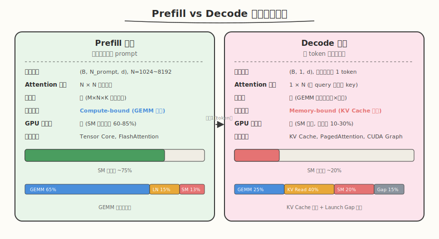
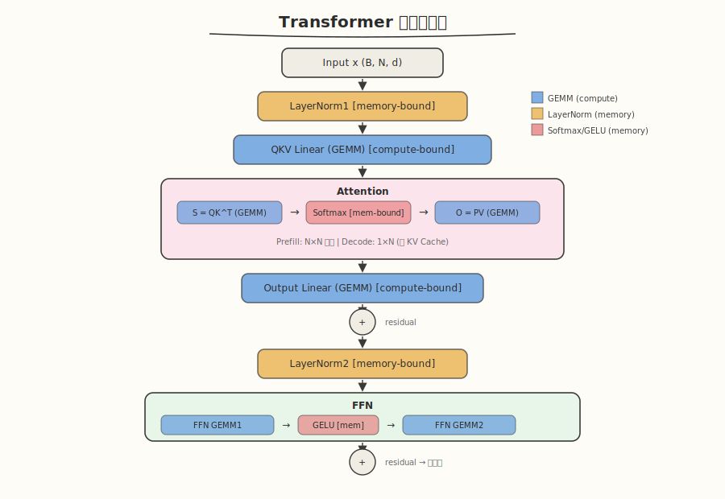
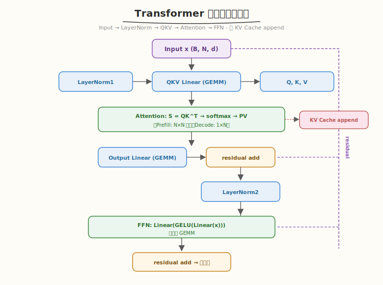
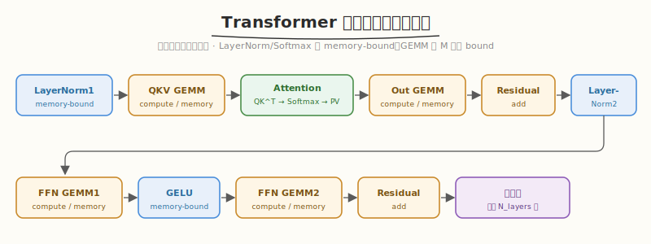
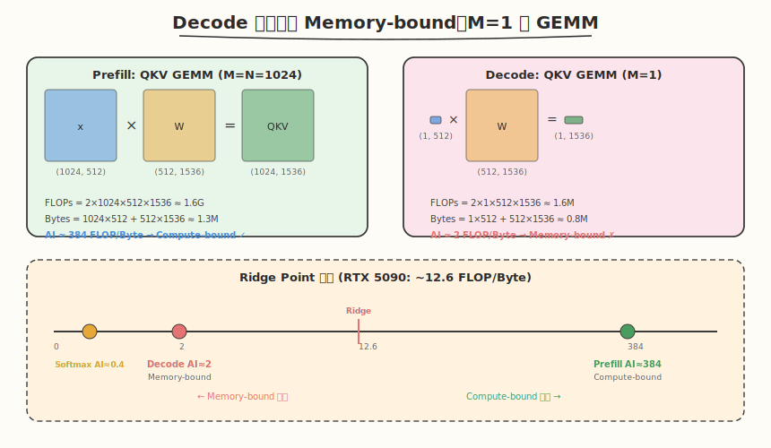
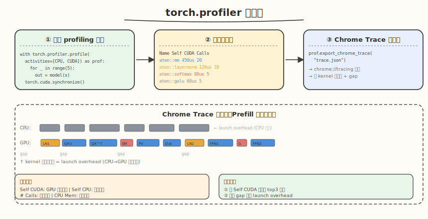

## Day 1：Trace Transformer 推理流程

### 🎯 目标

通过今天的学习，你将：

1. 理解 Transformer 推理的 **Prefill / Decode 两阶段**执行特征及其对 GPU 性能的根本影响
2. 掌握 `torch.profiler` 的使用方法，能独立采集并分析一次 forward 的算子时间线
3. 能列出 Transformer 单层的 **6 类算子**及其执行顺序，理解哪些是 compute-bound、哪些是 memory-bound
4. 理解 Decode 阶段 M=1 的 GEMM 为什么退化为 memory-bound

> 💡 **为什么重要**：Prefill vs Decode 是推理系统入门必考题。不理解两阶段差异，就无法理解 KV Cache、PagedAttention、Continuous Batching 等推理优化的动机。今天的内容是 Week 3 全周的地基——后续手写 Softmax/LayerNorm Kernel、Attention IO 分析、端到端 Profiling 都建立在这套认知之上。

---

### 学前导读：Transformer 推理不是一次 forward 那么简单

在训练时，我们习惯把一整个 batch 的 token 喂给模型，一次 forward 得到所有位置的输出。但**推理场景完全不同**：

- 用户输入一条 prompt（可能几千个 token），模型需要**并行处理**整条 prompt → 这叫 **Prefill**
- 然后**逐个 token 生成**回答，每次只产出 1 个 token，直到遇到 EOS → 这叫 **Decode**

这两阶段虽然跑的是同一套 Transformer 层，但**算子形状截然不同**，导致性能特征天差地别。理解这个差异，是所有推理优化的起点。

---

### 理论学习

#### 1.1 Prefill vs Decode 执行特征对比



上图直观展示了两阶段的核心差异。下面用表格精确对比：

| 维度 | Prefill 阶段 | Decode 阶段 |
|------|-------------|-------------|
| **输入形状** | `(B, N_prompt, d)`，N_prompt 可达数千 | `(B, 1, d)`，每次只处理 1 个 token |
| **Attention 矩阵** | N×N 完整矩阵 | 1×N（单 query 对所有历史 key） |
| **计算量** | 大（GEMM 是 M×N×K 的大矩阵乘） | 小（GEMM 退化为向量×矩阵） |
| **瓶颈类型** | 通常是 **Compute-bound**（GEMM 主导） | 通常是 **Memory-bound**（KV Cache 读取主导） |
| **GPU 利用率** | 高（SM 充分利用，60-85%） | 低（大量 SM 空闲，等显存，10-30%） |
| **典型优化** | Tensor Core、FlashAttention | KV Cache、PagedAttention、CUDA Graph |

> 💡 **一句话总结**：Prefill 是"一大堆数据一起算"，算力是瓶颈；Decode 是"一次只算一个 token，但要翻一遍历史"，访存是瓶颈。

#### 1.2 Transformer 单层数据流



上图展示了一个标准 Transformer Block 的完整数据流。按执行顺序：



**关键观察**：Transformer 单层包含 **6 个主要算子类型**：

1. **LayerNorm**（2 次）：element-wise + reduction，**memory-bound**
2. **QKV/Output/FFN Linear**（4 个 GEMM）：compute-bound（Prefill）或 memory-bound（Decode）
3. **Attention**：S=QK^T（GEMM）+ softmax（memory-bound）+ PV（GEMM）

**算子执行顺序与依赖**：



> 💡 **为什么重要**：理解算子顺序是后续 kernel fusion 的基础。例如 LayerNorm + QKV GEMM 可以融合成单个 kernel，省去中间结果写回 HBM。Day 6 会详细分析 fusion 机会。

#### 1.3 为什么 Decode 是 Memory-bound：M=1 的 GEMM



上图用 QKV GEMM 为例，直观展示了 M 从 1024 变成 1 时，arithmetic intensity 的骤降：

**Prefill 阶段 QKV GEMM**：
- 矩阵形状：`(1024, 512) × (512, 1536)`
- FLOPs = 2×1024×512×1536 ≈ 1.6G
- Bytes ≈ 1.3M（读 x + W，写 QKV）
- **AI ≈ 384 FLOP/Byte >> Ridge Point(12.6) → Compute-bound**

**Decode 阶段 QKV GEMM**：
- 矩阵形状：`(1, 512) × (512, 1536)` — M=1，退化为向量×矩阵
- FLOPs = 2×1×512×1536 ≈ 1.6M（少了 1024 倍）
- Bytes ≈ 0.8M（W 的大小没变，还是要读完整权重）
- **AI ≈ 2 FLOP/Byte << Ridge Point(12.6) → Memory-bound**

**根本原因**：M=1 时计算量与 M 成正比骤降，但权重矩阵 W 的大小不变，读取量几乎没减。AI = FLOPs/Bytes 极低，数据喂不饱计算单元。

**Decode 阶段的 Attention 更严重**——每次生成 1 个 token，都要读取**整个 KV Cache**（所有历史 token 的 K 和 V）：

```
KV Cache 大小 = 2 × N_layers × N_past × d × dtype_size
 N_past=4096, d=512, 32层, FP16 → 2×32×4096×512×2 = 512 MB
 每生成 1 个 token 要读 512 MB → 纯访存瓶颈
```

**优化方向**：
- **KV Cache**：避免重算历史 K/V（空间换时间）
- **PagedAttention**（vLLM）：减少 KV 显存碎片
- **CUDA Graph**：减少 Decode 阶段 kernel launch overhead
- **Continuous Batching**：合并多个 decode 请求提高 M

---

### torch.profiler 使用方法

#### 核心 API



```python
import torch.profiler

with torch.profiler.profile(
 activities=[
 torch.profiler.ProfilerActivity.CPU, # 采集 CPU 端调度
 torch.profiler.ProfilerActivity.CUDA, # 采集 GPU 端 kernel
 ],
) as prof:
 for _ in range(5):
 out = model(x)

# 按 CUDA 时间排序，输出 top 算子
print(prof.key_averages().table(sort_by="cuda_time_total", row_limit=15))

# 导出 Chrome trace（可用 chrome://tracing 打开）
prof.export_chrome_trace("transformer_trace.json")
```

#### 关键指标解读

| 指标 | 含义 | 关注点 |
|------|------|--------|
| `Self CUDA` | 该算子自身的 GPU 执行时间（不含子算子） | 排序依据，找 top3 |
| `Self CPU` | 该算子的 CPU 调度时间 | 判断 launch overhead |
| `CPU Mem` | CPU 端内存分配 | 判断是否有频繁分配 |
| `# Calls` | 调用次数 | 判断是否过度 launch |

**分析流程**：
1. 按 `Self CUDA` 排序找 top3 算子 → 定位耗时最重的计算
2. 看 `Self CPU` vs `Self CUDA` 比值 → 若 CPU 远大于 CUDA，说明 launch overhead 高
3. 在 Chrome trace 中观察 kernel 之间的空白（gap）→ gap = CPU 调度延迟
4. 对比 Prefill 和 Decode 的算子分布差异

---

### 晚间编程任务：Trace Transformer Forward

#### 完整代码

```python
# trace_transformer.py —— 最小 Transformer Block + Prefill/Decode profiling
# 运行命令: python trace_transformer.py
# 依赖: pip install torch

import torch
import torch.nn as nn
import math

class MiniAttention(nn.Module):
 def __init__(self, d_model=512, n_heads=8):
 super().__init__()
 self.d_model = d_model
 self.n_heads = n_heads
 self.d_head = d_model // n_heads
 self.qkv = nn.Linear(d_model, 3 * d_model)
 self.out = nn.Linear(d_model, d_model)

 def forward(self, x):
 B, N, _ = x.shape
 qkv = self.qkv(x) # GEMM: B*N*d x d*3d
 qkv = qkv.reshape(B, N, 3, self.n_heads, self.d_head)
 qkv = qkv.permute(2, 0, 3, 1, 4) # 3, B, n_heads, N, d_head
 q, k, v = qkv[0], qkv[1], qkv[2]
 scale = self.d_head ** -0.5
 attn = torch.matmul(q, k.transpose(-2, -1)) * scale # GEMM: Q x K^T -> N x N
 attn = torch.softmax(attn, dim=-1) # softmax（memory-bound）
 out = torch.matmul(attn, v) # GEMM: attn x V -> N x d_head
 out = out.transpose(1, 2).reshape(B, N, self.d_model)
 return self.out(out) # GEMM: Output Linear

class TransformerBlock(nn.Module):
 def __init__(self, d_model=512, n_heads=8, d_ff=2048):
 super().__init__()
 self.attn = MiniAttention(d_model, n_heads)
 self.norm1 = nn.LayerNorm(d_model)
 self.norm2 = nn.LayerNorm(d_model)
 self.ffn = nn.Sequential(
 nn.Linear(d_model, d_ff),
 nn.GELU(),
 nn.Linear(d_ff, d_model),
 )

 def forward(self, x):
 x = x + self.attn(self.norm1(x)) # Attention + residual
 x = x + self.ffn(self.norm2(x)) # FFN + residual
 return x

def profile_phase(model, x, name, n_iter=5):
 """对一个阶段做 profiling 并输出 top 算子"""
 # warmup
 for _ in range(2):
 _ = model(x)
 torch.cuda.synchronize()

 with torch.profiler.profile(
 activities=[
 torch.profiler.ProfilerActivity.CPU,
 torch.profiler.ProfilerActivity.CUDA,
 ],
 ) as prof:
 for _ in range(n_iter):
 _ = model(x)
 torch.cuda.synchronize()

 print(f"\n===== {name} Phase (shape={tuple(x.shape)}) =====")
 print(prof.key_averages().table(sort_by="cuda_time_total", row_limit=12))
 prof.export_chrome_trace(f"trace_{name}.json")

def main():
 torch.manual_seed(42)
 d_model, n_heads = 512, 8
 model = TransformerBlock(d_model, n_heads).cuda().half()

 # Prefill: 处理长 prompt（N=1024）
 x_prefill = torch.randn(1, 1024, d_model, device="cuda", dtype=torch.float16)
 profile_phase(model, x_prefill, "prefill", n_iter=5)

 # Decode: 逐 token 生成（N=1）
 x_decode = torch.randn(1, 1, d_model, device="cuda", dtype=torch.float16)
 profile_phase(model, x_decode, "decode", n_iter=10)

 print("\n===== 观察要点 =====")
 print("1. Prefill 阶段：gemm 类算子 CUDA 时间占比最高（compute-bound）")
 print("2. Decode 阶段：总时间远小于 prefill，但单 token 时间占比不合理地高（memory-bound）")
 print("3. 对比 softmax/layernorm 在两阶段的绝对时间——decode 下它们可能占更大比例")
 print("4. 打开 trace_prefill.json（chrome://tracing）观察 kernel 顺序与间隙")

if __name__ == "__main__":
 main()
```

#### 运行步骤

```bash
# 运行（需 CUDA GPU）
python trace_transformer.py

# 打开 Chrome trace 可视化
# 1. 浏览器访问 chrome://tracing
# 2. Load trace_prefill.json 和 trace_decode.json
# 3. 观察 GPU kernel 的时间线排列
```

#### 预期输出与分析任务

```
===== Prefill Phase (shape=(1, 1024, 512)) =====
--------------------------------- ... ---------------------------------
Name Self CUDA Calls ...
aten::_scaled_dot_product... xxx us 5
aten::mm xxx us 20 ← QKV/Out/FFN GEMM
aten::layer_norm xxx us 10
aten::softmax xxx us 5
...

===== Decode Phase (shape=(1, 1, 512)) =====
--------------------------------- ... ---------------------------------
Name Self CUDA Calls ...
aten::mm xxx us 20 ← GEMM 但矩阵极小
aten::layer_norm xxx us 10
aten::softmax xxx us 5
...
```

**分析任务清单**：

1. 找出 Prefill 阶段 CUDA 时间 top3 算子（预期是 mm/linear 类 GEMM）
2. 找出 Decode 阶段 CUDA 时间 top3 算子（预期 GEMM 占比下降，layernorm/softmax 占比上升）
3. 计算 Prefill 单 token 时间 vs Decode 单 token 时间（Prefill 快得多，因为并行度高）
4. 在 Chrome trace 中观察 kernel 之间的间隙（gap = launch overhead）

**预期发现**：
- **Prefill**：GEMM（`aten::mm`）占 CUDA 时间 60%+，是绝对主导 → compute-bound
- **Decode**：GEMM 矩阵极小（M=1），时间占比下降；softmax/layernorm 相对占比上升；kernel 间 gap 更明显（launch overhead 占比增大）→ memory-bound

#### 任务 4：LeetGPU 在线题目 —— Causal Depthwise Conv1d

**题目链接**：<https://leetgpu.com/challenges/causal-depthwise-conv1d>

**题目概述**：给定输入 `x` 形状 `(B, L, D)`、权重 `weight` 形状 `(D, K)`、偏置 `bias` 形状 `(D,)`，计算因果深度卷积：`output[b, l, d] = bias[d] + Σ_{k=0}^{K-1} weight[d, k] * x[b, l - K + 1 + k, d]`。因果性指输出位置 `l` 只依赖 `≤ l` 的输入（过去与当前），越界位置按 0 处理。每个通道 `d` 相互独立。

**与今日知识的关联**：Causal Depthwise Conv1d 是 1D 卷积的变体——在 Transformer 里常用于卷积前馈或局部上下文建模。它综合了卷积的边界处理（halo 区 + 因果 padding）与通道独立并行（depthwise 分组），是练习"卷积边界处理 + 通道独立并行"的好题。今天的 profiling 分析揭示了 Prefill（compute-bound）和 Decode（memory-bound）的差异，Causal Depthwise Conv1d 同样可以用 ncu 分析其 bound 类型，验证"element-wise + 局部窗口 = memory-bound"的规律。

> 💡 完整题解见 [Causal Depthwise Conv1d 题解](../../../../leetgpu/week3/day1/leetgpu-causal-depthwise-conv1d-solution.md)。

#### 任务 5：LeetCode 面试题 —— 盛最多水的容器

**题目链接**：[11. 盛最多水的容器](https://leetcode.cn/problems/container-with-most-water/)

**题目概述**：给定 `n` 个非负整数 `a1, a2, ..., an`，每个代表坐标中的一个点 `(i, ai)`。找出两条线，使得它们与 x 轴构成的容器能容纳最多的水。

**与今日知识的关联**：盛最多水容器的**双指针贪心**与今日 profiling 中"缩小搜索范围"的思路同构——双指针从两端向中间逼近，每次移动较短的一边（因为移动较长的一边不可能得到更大面积），就像 profiling 中逐步缩小瓶颈范围。两者都是"通过排除不可能的候选来高效定位最优解"。

> 💡 完整题解见 [盛最多水的容器题解](../../../../leetcode/daily/week3/day1/盛最多水的容器.md)。

---

### 练习题

**练习1（基础）**：修改 `d_model=1024, n_heads=16`，重新 profile，观察 GEMM 时间变化。
> 提示：GEMM 计算量与 d_model 平方相关，layernorm/softmax 与 d_model 线性相关。

**练习2（进阶）**：用 `nsys profile -o transformer_trace python trace_transformer.py` 采集系统级时间线，在 Nsight Systems GUI 中对比 Prefill 和 Decode 的 SM 利用率。
> 提示：Decode 阶段 SM 利用率会很低（绿色 bar 很短），这就是 memory-bound 的直观表现。

**练习3（综合）**：在 TransformerBlock 中加一个 `forward_with_fusion` 方法，用 `torch.compile(model, mode="reduce-overhead")` 自动做 kernel fusion，对比 fused vs unfused 的 kernel 数量。
> 提示：`torch.compile` 会把 LayerNorm + GEMM 等相邻算子融合，kernel 数减少 30-50%。

---

### 今日面试题

**面试题1**：Transformer 推理的 Prefill 和 Decode 阶段有什么区别？为什么 Decode 通常是 memory-bound？（⭐⭐⭐ 高频）

**参考答案要点**：
- **Prefill**：输入是 `(B, N_prompt, d)`，N_prompt 可达数千。所有 GEMM 是大矩阵乘，计算量大，GPU SM 充分利用 → **Compute-bound**
- **Decode**：输入是 `(B, 1, d)`，每次只生成 1 个 token。GEMM 退化为向量×矩阵（M=1），计算量极小，但每次都要读取整个 KV Cache（N 个历史 token） → **Memory-bound**
- **根本原因**：Decode 阶段计算强度（FLOP/Byte）极低。M=1 的 GEMM 每读 1 行 K/V 只做 d 次乘加，arithmetic intensity ≈ 2 FLOP/Byte，远低于 Ridge Point（~12.6）
- **优化方向**：KV Cache（避免重算 K/V）、PagedAttention（减少 KV 显存碎片）、CUDA Graph（减少 launch overhead）、Continuous Batching（合并多个 decode 请求提高 M）

**面试题2**：Transformer 单层包含哪些算子？哪些是 compute-bound，哪些是 memory-bound？（⭐⭐⭐ 高频）

**参考答案要点**：

| 算子 | 类型（Prefill） | 类型（Decode） | 原因 |
|------|----------------|----------------|------|
| QKV/Out/FFN Linear (GEMM) | Compute-bound | Memory-bound | Prefill M 大；Decode M=1 |
| Attention QK^T (GEMM) | Compute-bound | Memory-bound | 同上 |
| Attention Softmax | Memory-bound | Memory-bound | element-wise + reduction |
| Attention PV (GEMM) | Compute-bound | Memory-bound | 同上 |
| LayerNorm | Memory-bound | Memory-bound | element-wise + reduction |
| GELU | Memory-bound | Memory-bound | element-wise |

> 关键洞察：GEMM 在 Prefill 和 Decode 之间会切换 bound 类型，而 Softmax/LayerNorm/GELU 永远是 memory-bound（与 M 无关）。

---

### 今日自测清单

- [ ] 能解释 Prefill 和 Decode 的输入形状差异及其对性能的影响
- [ ] 能列出 Transformer 单层的 6 类算子及其执行顺序
- [ ] torch.profiler 代码运行成功，输出 Prefill/Decode 的算子时间表
- [ ] 找出 Prefill 阶段 CUDA 时间 top3 算子
- [ ] 能解释为什么 Decode 阶段 GEMM 变成 memory-bound（M=1 导致计算强度低）
- [ ] 能用 chrome://tracing 打开 trace 文件并观察 kernel 间隙
