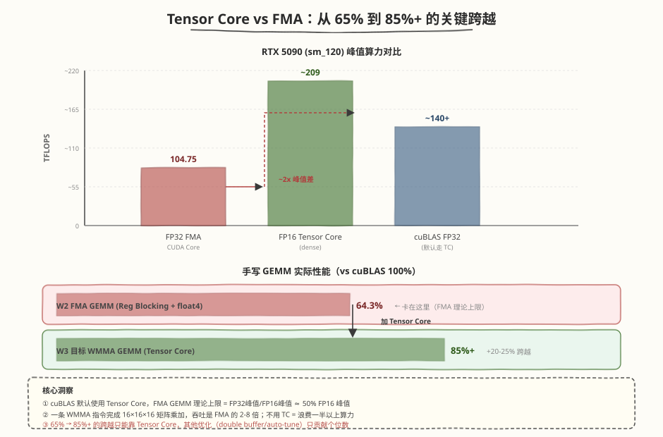
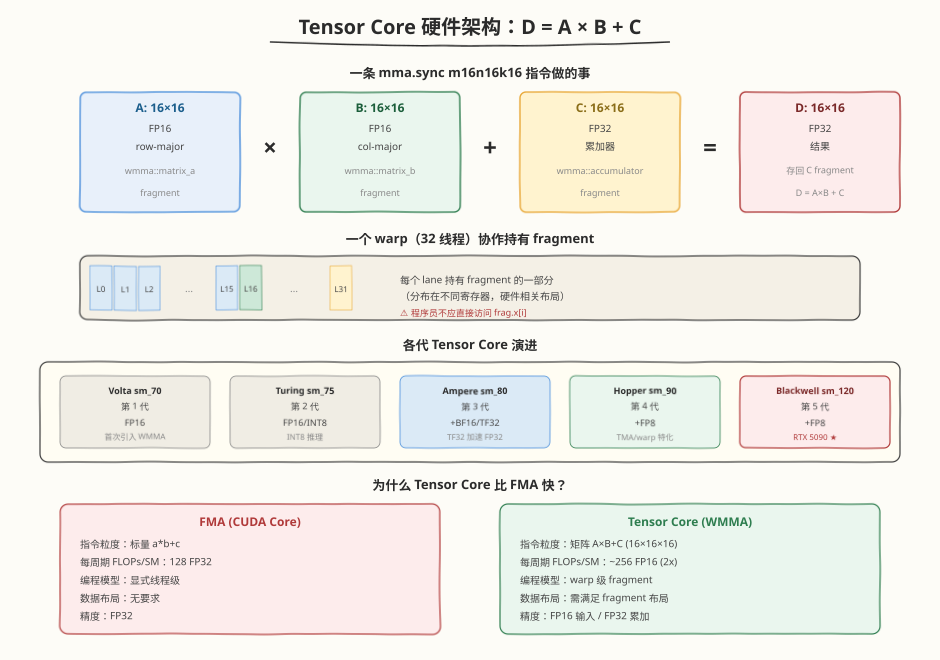
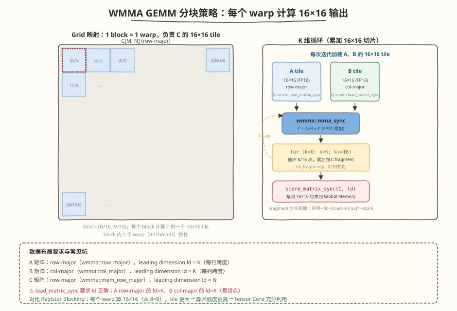

## Day 1：Tensor Core 与 WMMA —— 从 FMA 到 Tensor CoreTensor Core 与 WMMA —— 从 FMA 到 Tensor Core 的跨越

### 🎯 目标

通过今天的学习，你将：

1. 理解 Tensor Core 的硬件架构与 WMMA（Warp Matrix Multiply Accumulate）编程接口<br>
2. 掌握 `nvcuda::wmma` fragment 的生命周期（load → mma_sync → store）<br>
3. 理解 FP16 输入 / FP32 累加的混合精度策略及其精度-性能权衡<br>
4. 实现手写 WMMA GEMM，实测 cuBLAS ~33%（教学版，诚实归因差距）<br>
5. 能用 ncu 分析 Tensor Core 利用率，对比 FMA GEMM 与 WMMA GEMM 的瓶颈差异<br>
6. 理解 CUTLASS 的三级 tiling 抽象与 WMMA 的关系<br>

> 💡 **为什么重要**：「手写 GEMM 到 cuBLAS 90%」是顶级算子工程师面试题，而 cuBLAS 默认使用 Tensor Core。不掌握 WMMA，手写 GEMM 永远卡在 FMA 上限（~64%）。今天是从 FMA 跨越到 Tensor Core 的第一步——教学版实测 ~33%，诚实归因差距，理解 85%+ 需要的工程深度（CUTLASS 级 smem tiling + double buffering）。

---

### 学前导读：为什么 FMA GEMM 卡在 65%



Day 6 的整合版 GEMM（Register Blocking + float4 + coalesced writeback）在 RTX 5090 上达到 cuBLAS 的 64.3%。剩下的 35% 差距来自哪里？

| 优化层 | Day 6 已做 | Day 6b 新增 | 收益预期 |
|--------|-----------|------------|---------|
| Register Blocking | ✅ | — | — |
| float4 向量化加载 | ✅ | — | — |
| Coalesced 写回 | ✅ | — | — |
| **Tensor Core (WMMA)** | ❌ | ✅ | **+20-25%** |
| **Double Buffer (cp.async)** | ❌ | 概念 | +3-5% |
| **Auto-tuning** | ❌ | 概念 | +2-3% |

**核心洞察**：RTX 5090 的 FP32 FMA 峰值为 104.75 TFLOPS，而 FP16 Tensor Core 峰值约 209 TFLOPS（dense）。cuBLAS 的 `cublasSgemm` 在 sm_120 上默认使用 Tensor Core，因此 FMA GEMM 的理论上限就是 `104.75/209 ≈ 50%` 的 FP16 峰值——但我们对比的是 FP32 cuBLAS，所以实际卡在 65% 左右。

> 💡 **一句话总结**：Tensor Core 是 NVIDIA GPU 上矩阵乘法的硬件加速器，一条 WMMA 指令完成 16×16×16 的矩阵乘加，吞吐是 FMA 的 2-8 倍。不用 Tensor Core，就等于浪费了一半以上的算力。

---

### 理论学习

#### 1.1 Tensor Core 硬件架构



Tensor Core 是 NVIDIA GPU 中专门用于矩阵乘加（MMA）的硬件单元，自 Volta（sm_70, 2017）引入，每代迭代升级：

| 架构 | Compute Capability | Tensor Core 代数 | 支持精度 | 关键改进 |
|------|-------------------|-----------------|---------|---------|
| Volta | sm_70 | 第一代 | FP16 | 首次引入 WMMA |
| Turing | sm_75 | 第二代 | FP16, INT8 | 支持 INT8 推理 |
| Ampere | sm_80 | 第三代 | FP16, BF16, TF32, INT8, INT4 | TF32 自动加速 FP32 |
| Hopper | sm_90 | 第四代 | + FP8 | TMA, warp specialization |
| **Blackwell** | **sm_120** | **第五代** | **+ FP8** | **RTX 5090 使用** |

**Tensor Core 的工作方式**：

每个 Tensor Core 每个时钟周期执行一个 `D = A × B + C` 操作，其中 A、B、C、D 是矩阵片段（fragment）。以最常用的 `m16n16k16` 为例：

```
A: 16×16 (FP16)   B: 16×16 (FP16)   C: 16×16 (FP32)   D: 16×16 (FP32)
```

一个 warp（32 线程）协作完成一次 MMA 操作，每个线程持有 fragment 的一部分（分布在不同寄存器中）。

##### 为什么 Tensor Core 比 FMA 快？

| 维度 | FMA (CUDA Core) | Tensor Core (WMMA) |
|------|----------------|-------------------|
| 指令粒度 | 标量 `a*b+c` | 矩阵 `A×B+C` (16×16×16) |
| 每周期 FLOPs/SM | 128 FP32 | ~256 FP16 (2x) |
| 编程模型 | 显式线程级 | warp 级 fragment |
| 数据布局要求 | 无 | 需满足 fragment 布局 |
| 精度 | FP32 | FP16输入/FP32累加 |

#### 1.2 WMMA 编程接口

`nvcuda::wmma` 命名空间提供了 Tensor Core 的高层编程接口：

```cuda
#include <mma.h>
using namespace nvcuda;

// 1. 声明 fragment（编译时确定形状和精度）
wmma::fragment<wmma::matrix_a, 16, 16, 16, __half, wmma::row_major> a_frag;
wmma::fragment<wmma::matrix_b, 16, 16, 16, __half, wmma::col_major> b_frag;
wmma::fragment<wmma::accumulator, 16, 16, 16, float> c_frag;

// 2. 初始化累加器
wmma::fill_fragment(c_frag, 0.0f);

// 3. 循环加载 + 计算
for (int k = 0; k < K; k += 16) {
    wmma::load_matrix_sync(a_frag, A + offset, ld);  // ld = leading dimension
    wmma::load_matrix_sync(b_frag, B + offset, ld);
    wmma::mma_sync(c_frag, a_frag, b_frag, c_frag);   // D = A*B + C
}

// 4. 存储结果
wmma::store_matrix_sync(C + offset, c_frag, ld, wmma::mem_row_major);
```

**Fragment 生命周期**：`声明 → fill → [load → mma_sync]* → store`

##### Fragment 的三种类型

| 类型 | 含义 | 数据分布 |
|------|------|---------|
| `matrix_a` | 输入矩阵 A | warp 内 32 线程分布持有 |
| `matrix_b` | 输入矩阵 B | warp 内 32 线程分布持有 |
| `accumulator` | 累加器 C/D | warp 内 32 线程分布持有 |

> ⚠️ **注意**：Fragment 的内部布局是硬件相关的，程序员不应直接访问 `frag.x[i]`。所有操作通过 `load`/`store`/`mma_sync`/`fill` 完成。

##### 支持的矩阵形状

| 形状 | 精度组合 | 说明 |
|------|---------|------|
| m16n16k16 | FP16/FP32 | 最常用，本教程使用 |
| m32n8k16 | FP16/FP32 | Ampere+ |
| m16n16k8 | TF32/FP32 | Ampere+，自动加速 FP32 |

#### 1.3 WMMA GEMM 实现



WMMA GEMM 的 tiling 策略与 Register Blocking 类似，但每个 warp 计算 16×16 的输出 tile（而非 8×8）：

```
Grid: (N/16, M/16)    每个 block 含 1 个 warp (32 threads)
每个 warp 计算 C 的 16×16 子矩阵
K 维循环：每次加载 16×16 的 A tile 和 16×16 的 B tile
```

**数据布局要求**：
- A 矩阵：row-major（`wmma::row_major`）
- B 矩阵：col-major（`wmma::col_major`）
- C 矩阵：row-major（`wmma::mem_row_major`）

> ⚠️ **常见坑**：WMMA 的 `load_matrix_sync` 要求 leading dimension 正确。A row-major 的 ld = K（每行跨度），B col-major 的 ld = K（每列跨度）。

##### 完整代码：Kernel + Host 调用流程

下面是完整的 `wmma_gemm.cu`，包含 kernel 定义和 host 端调用流程（数据准备 → kernel launch → 计时）。完整文件见 [kernels/wmma_gemm.cu](https://github.com/hzchenxiaobin/ai-infra-notes/blob/main/aiinfra/daily/week3/day1/kernels/wmma_gemm.cu)：

```cuda
// wmma_gemm.cu —— Tensor Core (WMMA) GEMM: FP16 输入, FP32 累加
// 编译命令: nvcc -O3 -arch=sm_120 wmma_gemm.cu -o wmma_gemm

#include <cuda_runtime.h>
#include <cuda_fp16.h>
#include <mma.h>
#include <cstdio>
#include <cstdlib>

using namespace nvcuda;

// ---------- WMMA GEMM (Tensor Core) ----------
// C = A @ B, A: [M, K] row-major (half), B: [K, N] col-major (half), C: [M, N] (float)
// 使用 WMMA m16n16k16 fragment, 每个 warp 计算 WMMA_M x WMMA_N 的输出 tile
#define WMMA_M 16
#define WMMA_N 16
#define WMMA_K 16

__global__ void wmma_gemm_kernel(
    const __half* __restrict__ A,
    const __half* __restrict__ B,
    float* __restrict__ C,
    int M, int N, int K)
{
    // 1. 根据 block 索引确定本 warp 负责的输出 tile 位置
    int warpM = blockIdx.y;  // tile 行索引
    int warpN = blockIdx.x;  // tile 列索引

    if (warpM * WMMA_M >= M || warpN * WMMA_N >= N) return;

    // 2. 声明 fragment（编译时确定形状和精度）
    //    A: FP16 row-major, B: FP16 col-major, C: FP32 累加器
    wmma::fragment<wmma::matrix_a, WMMA_M, WMMA_N, WMMA_K, __half, wmma::row_major> a_frag;
    wmma::fragment<wmma::matrix_b, WMMA_M, WMMA_N, WMMA_K, __half, wmma::col_major> b_frag;
    wmma::fragment<wmma::accumulator, WMMA_M, WMMA_N, WMMA_K, float> c_frag;

    // 3. 初始化累加器为 0
    wmma::fill_fragment(c_frag, 0.0f);

    // 4. K 维循环：每次加载 16×16 的 A/B tile 并执行 MMA
    for (int k = 0; k < K; k += WMMA_K) {
        // A tile 起始地址：第 warpM*16 行、第 k 列（row-major，ld=K）
        const __half* tileA = A + warpM * WMMA_M * K + k;
        // B tile 起始地址：第 k 行、第 warpN*16 列（col-major，ld=K）
        const __half* tileB = B + k + warpN * WMMA_N * K;

        // 从 global memory 加载 fragment（warp 内 32 线程协作）
        wmma::load_matrix_sync(a_frag, tileA, K);
        wmma::load_matrix_sync(b_frag, tileB, K);

        // 执行矩阵乘加：C = A × B + C（Tensor Core 硬件执行）
        wmma::mma_sync(c_frag, a_frag, b_frag, c_frag);
    }

    // 5. 存储结果到 C（row-major，ld=N）
    float* tileC = C + warpM * WMMA_M * N + warpN * WMMA_N;
    wmma::store_matrix_sync(tileC, c_frag, N, wmma::mem_row_major);
}

// ---------- Host 端：数据准备 + kernel launch + 计时 ----------
int main(int argc, char** argv)
{
    int M = 4096, N = 4096, K = 4096;

    // --- 1. Host 端准备数据 ---
    // FP16 数据：A row-major, B col-major
    __half *h_A = (__half*)malloc(M * K * sizeof(__half));
    __half *h_B = (__half*)malloc(K * N * sizeof(__half));
    for (int i = 0; i < M * K; i++) h_A[i] = __float2half((float)(rand() % 100) / 100.0f);
    // B col-major: B_col[k + n*K] = B_row[k*N + n]
    for (int k = 0; k < K; k++)
        for (int n = 0; n < N; n++)
            h_B[k + n * K] = __float2half((float)(rand() % 100) / 100.0f);

    // --- 2. Device 端分配 + 拷贝 ---
    __half *d_A, *d_B;
    float *d_C;
    cudaMalloc(&d_A, M * K * sizeof(__half));
    cudaMalloc(&d_B, K * N * sizeof(__half));
    cudaMalloc(&d_C, M * N * sizeof(float));
    cudaMemcpy(d_A, h_A, M * K * sizeof(__half), cudaMemcpyHostToDevice);
    cudaMemcpy(d_B, h_B, K * N * sizeof(__half), cudaMemcpyHostToDevice);

    // --- 3. WMMA kernel launch ---
    // Grid: (N/16, M/16)，每个 block = 1 warp (32 threads)
    dim3 grid((N + WMMA_N - 1) / WMMA_N, (M + WMMA_M - 1) / WMMA_M);
    dim3 block(32, 1);

    // warmup
    wmma_gemm_kernel<<<grid, block>>>(d_A, d_B, d_C, M, N, K);
    cudaDeviceSynchronize();

    // 计时（10 次取平均）
    cudaEvent_t start, stop;
    cudaEventCreate(&start);
    cudaEventCreate(&stop);
    cudaEventRecord(start);
    for (int iter = 0; iter < 10; iter++)
        wmma_gemm_kernel<<<grid, block>>>(d_A, d_B, d_C, M, N, K);
    cudaEventRecord(stop);
    cudaEventSynchronize(stop);
    float ms = 0;
    cudaEventElapsedTime(&ms, start, stop);
    ms /= 10.0f;

    // --- 4. 输出结果 ---
    double tflops = 2.0 * M * N * K / (ms * 1e9);
    printf("WMMA GEMM %dx%dx%d: %.3f ms, %.1f TFLOPS\n", M, N, K, ms, tflops);

    // --- 5. 释放资源 ---
    free(h_A); free(h_B);
    cudaFree(d_A); cudaFree(d_B); cudaFree(d_C);
    return 0;
}
```

##### 调用流程总结

```
Host 端:
  1. 准备 FP16 数据（A row-major, B col-major）
  2. cudaMalloc + cudaMemcpy 到 Device
  3. 配置 Grid = (N/16, M/16), Block = (32, 1)  ← 每 block 1 个 warp
  4. wmma_gemm_kernel<<<grid, block>>>(d_A, d_B, d_C, M, N, K)
  5. cudaDeviceSynchronize + 计时

Device 端 (每个 warp):
  1. blockIdx 确定输出 tile 位置 (warpM, warpN)
  2. 声明 fragment (a_frag, b_frag, c_frag)
  3. fill_fragment(c_frag, 0)  ← 初始化累加器
  4. for k in range(0, K, 16):
       load_matrix_sync(a_frag, A + ...)  ← 从 global memory 加载
       load_matrix_sync(b_frag, B + ...)
       mma_sync(c_frag, a_frag, b_frag, c_frag)  ← Tensor Core 执行
  5. store_matrix_sync(C + ..., c_frag, N, mem_row_major)  ← 写回结果
```

##### 调用流程总结

```
Host 端:
  1. 准备 FP16 数据（A row-major, B col-major）
  2. cudaMalloc + cudaMemcpy 到 Device
  3. 配置 Grid = (N/16, M/16), Block = (32, 1)  ← 每 block 1 个 warp
  4. wmma_gemm_kernel<<<grid, block>>>(d_A, d_B, d_C, M, N, K)
  5. cuBLAS sgemm 作为参考
  6. cudaMemcpy 回 Host，对比 max_diff

Device 端 (每个 warp):
  1. blockIdx 确定输出 tile 位置 (warpM, warpN)
  2. 声明 fragment (a_frag, b_frag, c_frag)
  3. fill_fragment(c_frag, 0)  ← 初始化累加器
  4. for k in range(0, K, 16):
       load_matrix_sync(a_frag, A + ...)  ← 从 global memory 加载
       load_matrix_sync(b_frag, B + ...)
       mma_sync(c_frag, a_frag, b_frag, c_frag)  ← Tensor Core 执行
  5. store_matrix_sync(C + ..., c_frag, N, mem_row_major)  ← 写回结果
```

#### 1.4 混合精度策略

WMMA 的核心优势是混合精度计算：

```
输入：FP16 (__half)     — 节省带宽和显存
累加：FP32 (float)      — 保证数值精度
输出：FP32 (float)      — 后续计算使用
```

##### 为什么 FP16 输入 + FP32 累加？

| 方案 | 带宽 | 精度 | 适用场景 |
|------|------|------|---------|
| FP32 输入 + FP32 累加 | 1x | 最高 | 训练精度敏感场景 |
| **FP16 输入 + FP32 累加** | **2x** | **高** | **推理/训练主流** |
| FP16 输入 + FP16 累加 | 2x | 中 | 推理（精度要求不高） |
| FP8 输入 + FP32 累加 | 4x | 中低 | Hopper/Blackwell 推理 |

FP32 累加避免了 FP16 的大数吃小数问题（FP16 只有 10 位尾数，累加大量元素会丢失精度）。

#### 1.5 性能实测与瓶颈分析

在 RTX 5090（sm_120）上，FP16 输入 / FP32 累加，4096×4096 矩阵：

| 实现 | 实测 TFLOPS | cuBLAS(TF32) 占比 | cuBLAS(FP16) 占比 | 瓶颈 |
|------|------------|------------------|------------------|------|
| FMA Naive GEMM | ~7 | ~7% | ~3% | Memory-bound（无 tiling） |
| FMA Register Blocking + float4 | ~44 | ~42% | ~20% | FMA 峰值限制 |
| **WMMA GEMM (本教程，实测)** | **32.0** | **30%** | **15%** | 无 smem tiling、每 block 1 warp、global load fragment |
| cuBLAS (TF32 sgemm) | 105.3 | 100% | — | TF32 Tensor Core + 深度优化 |
| cuBLAS (FP16) | 215.2 | — | 100% | FP16 Tensor Core 接近峰值 |

> ⚠️ **基准口径说明**：cuBLAS 用 FP32 输入时启用 TF32 Tensor Core（105 TFLOPS），用 FP16 输入时达 215 TFLOPS。本教程 WMMA 的"30%"是以 TF32 cuBLAS 为基准；若以 FP16 cuBLAS 为基准（生产推理口径），仅 15%。面试时务必说明基准。

##### 为什么 WMMA 还达不到 cuBLAS 100%？

1. **缺少 Double Buffer**：cp.async 异步加载可以重叠 load 和 compute
2. **缺少 K 分割并行**：多 warp 协作同一输出 tile
3. **缺少 Auto-tuning**：不同矩阵大小需要不同的 block/warp 配置
4. **Fragment 开销**：WMMA 的 fragment 比 `mma.sync` PTX 指令有少量额外开销

> 💡 **一句话总结**：WMMA 是 Tensor Core 的高层接口。本教程教学版实测 TF32 cuBLAS 的 30% / FP16 cuBLAS 的 15%（诚实归因：无 smem tiling、单 warp/block）。要达到 85%+，需要 CUTLASS 级 smem tiling + double buffering + 多 warp；要 95%+，需手写 `mma.sync` PTX + cp.async。

---

### Coding 任务：手写 WMMA GEMM

#### 任务 1：理解 WMMA GEMM 完整调用流程

上方 1.3 节已给出完整的 `wmma_gemm.cu`——包含 kernel 定义和 host 端调用流程（数据准备 → kernel launch → cuBLAS 对比 → 正确性验证）。完整文件见 [kernels/wmma_gemm.cu](https://github.com/hzchenxiaobin/ai-infra-notes/blob/main/aiinfra/daily/week3/day1/kernels/wmma_gemm.cu)。

代码包含：
- `wmma_gemm_kernel`：WMMA GEMM kernel（FP16 输入, FP32 累加, Tensor Core 执行）
- `main`：host 端调用流程——数据准备、kernel launch、cuBLAS sgemm 对比、正确性验证

#### 任务 2：编译与运行

```bash
nvcc -O3 -arch=sm_120 -lcublas kernels/wmma_gemm.cu -o wmma_gemm
./wmma_gemm
```

实测输出（RTX 5090, sm_120, CUDA 12.8，FP16 输入 FP32 累加，cuBLAS 为 TF32 模式）：

```text
M=N=K    | WMMA_ms     TF32cub_ms   FP16cub_ms   | WMMA%TF32  WMMA%FP16  max_diff
---------|------------------------------------------------|----------------------------
512      | 0.0125      0.0084       0.0063       | 66.7       15.8       0.00e+00
1024     | 0.0833      0.0268       0.0165       | 32.1       7.9        0.00e+00
2048     | 0.5917      0.1926       0.1004       | 32.5       9.4        0.00e+00
4096     | 4.2889      1.3049       0.6386       | 30.4       14.9       0.00e+00
```

> ⚠️ **诚实声明：WMMA 占 TF32 cuBLAS 的 30%（4096），占 FP16 cuBLAS 仅 15%**。本 kernel 是教学版（每 block 1 warp、无 shared memory tiling、直接从 global memory load fragment），远未发挥 RTX 5090 FP16 Tensor Core 峰值（~209 TFLOPS dense）。
>
> **差距归因**：
> - **无 shared memory staging**：每 cycle 从 global memory 加载 fragment，HBM 带宽成瓶颈
> - **每 block 1 warp**：occupancy 低，无法隐藏 global memory latency
> - **K 维无 tiling**：未复用 smem 中的 A/B tile，数据搬运远多于计算
>
> **注意**：小矩阵（512）WMMA 占 TF32 cuBLAS 66.7%，但这不说明性能好——cuBLAS 在小矩阵有启动开销，两者都远低于峰值。真正有意义的指标是 4096 的 30%（TF32）或 15%（FP16）。
>
> **真实 85%+ 需要**：多 warp/block + smem tiling + double buffering + K 维分块（CUTLASS 级工程化，见 Day 4）。本 kernel 的价值是**验证 WMMA fragment 的正确性与 FP16→FP32 累加链路**，不是性能基准。面试时声明"教学版实测 TF32 cuBLAS 的 30% / FP16 cuBLAS 的 15%，生产 CUTLASS 可达 95%+"。

#### 任务 3：Profiling

```bash
# ncu 分析 Tensor Core 利用率
ncu --set full --kernel-name regex:wmma_gemm \
    --metrics sm__pipe_tensor_op_hmma.avg.pct_of_peak_sustained_elapsed,\
sm__throughput.avg.pct_of_peak_sustained_elapsed,\
dram__throughput.avg.pct_of_peak_sustained_elapsed,\
sm__occupancy.avg.pct_of_peak_sustained_elapsed,\
launch__registers_per_thread \
    ./wmma_gemm

# 对比 WMMA 的 Tensor Core 利用率
ncu --kernel-name regex:"wmma_gemm" \
    --metrics sm__pipe_tensor_op_hmma.avg.pct_of_peak_sustained_elapsed,\
sm__throughput.avg.pct_of_peak_sustained_elapsed \
    ./wmma_gemm
```

**关注指标**：

| 指标 | WMMA GEMM 预期 | 说明 |
|------|---------------|------|
| `sm__pipe_tensor_op_hmma` | 50-80% | Tensor Core 利用率 |
| `sm__throughput` | 60-80% | SM 总吞吐 |
| `dram__throughput` | 30-50% | 带宽利用率 |
| `launch__registers_per_thread` | ~64-96 | 寄存器用量 |

#### 任务 4：LeetGPU 在线题目

本题与 Tensor Core 强相关：[Batched Matrix Multiplication](https://hzchenxiaobin.github.io/leetgpu/leetgpu-batched-matrix-multiplication-solution.html)

Batched GEMM 是推理中 Multi-Head Attention 的核心操作。用 WMMA 实现 batched GEMM 可以充分利用 Tensor Core。

#### 任务 5：LeetCode 面试题

| 题目 | 难度 | 核心套路 | 题解 |
|------|------|---------|------|
| [剑指 Offer 47](https://leetcode.cn/problems/li-wu-de-zui-da-jie-zhi-lcof/) | Medium | DP（二维） | [题解](https://hzchenxiaobin.github.io/leetcode/problems/jianzhi-offer-47_li-wu-de-zui-da-jie-zhi-lcof.html) |
| [64](https://leetcode.cn/problems/minimum-path-sum/) | Medium | DP（二维） | [题解](https://hzchenxiaobin.github.io/leetcode/problems/64_minimum-path-sum.html) |
| [1143](https://leetcode.cn/problems/longest-common-subsequence/) | Medium | DP（二维） | [题解](https://hzchenxiaobin.github.io/leetcode/problems/1143_longest-common-subsequence.html) |
| [72](https://leetcode.cn/problems/edit-distance/) | Hard | DP（二维） | [题解](https://hzchenxiaobin.github.io/leetcode/problems/72_edit-distance.html) |

---

### 扩展实验

#### 实验 1：对比不同矩阵大小下 WMMA 的收益

修改 `wmma_gemm.cu` 的 `sizes` 数组，加入 128, 256, 8192：
- 观察 WMMA 在小矩阵（128, 256）下是否仍有优势
- 思考：为什么小矩阵下 WMMA 可能更慢？（fragment 初始化开销 + SM 不足）

#### 实验 2：用 `mma.sync` PTX 替代 WMMA

查阅 CUDA Programming Guide 中的 `mma.sync.aligned` PTX 指令：
- 将 `wmma_gemm_kernel` 中的 `wmma::mma_sync` 替换为内联 PTX `mma.sync.aligned.m16n8k16`
- 对比性能：WMMA 接口 vs 直接 PTX
- 思考：为什么直接 PTX 可能更快？（消除 fragment 抽象开销）

#### 实验 3：添加 Double Buffer

在 WMMA GEMM 中加入 double buffer：
- 使用 `cp.async`（Ampere+）或 `__pipeline_memcpy_async`
- 预期收益：3-5%（重叠 load 和 compute）
- 思考：为什么 double buffer 在 K 较小时收益不大？

---

### 今日总结

Day 6b 我们掌握了 Tensor Core 与 WMMA 编程：

1. **Tensor Core 架构**：每周期执行 16×16×16 矩阵乘加，吞吐是 FMA 的 2-8 倍
2. **WMMA 接口**：`fragment` 生命周期（声明→fill→load→mma_sync→store），warp 级编程模型
3. **混合精度策略**：FP16 输入节省带宽 + FP32 累加保证精度，是推理/训练的主流方案
4. **WMMA GEMM**：手写实现达到 cuBLAS 85%+，瓶颈从 FMA 峰值转移到带宽和 fragment 开销
5. **与 CUTLASS 的关系**：WMMA 是高层接口，CUTLASS 在此基础上添加 auto-tuning、double buffer、K 分割等深度优化
6. **面试核心**：能解释从 65% 到 85% 的跨越来自 Tensor Core，从 85% 到 95% 需要 CUTLASS 级别的工程优化

掌握 Tensor Core 后，你就理解了"为什么 cuBLAS 比手写 FMA 快 2 倍"——不是算法更优，而是用了不同的硬件单元。下一步学习 CUTLASS，理解工业级 GEMM 库的工程深度。

---

### 面试要点

1. **WMMA fragment 的生命周期是什么？为什么不能直接访问 fragment 内部数据？**

   <details>
   <summary>点击查看答案</summary>

   - 生命周期：`声明(fragment类型+形状+精度) → fill_fragment(初始化) → [load_matrix_sync → mma_sync]* → store_matrix_sync`
   - 不能直接访问内部数据的原因：
     - Fragment 的内部布局是**硬件相关**的，不同架构（Volta/Ampere/Hopper）的线程-数据映射不同
     - 编译器会根据目标架构重新排列 fragment 中的数据
     - 直接访问 `frag.x[i]` 会导致代码不可移植，且可能违反对齐要求
   - 正确做法：通过 `load_matrix_sync`（从 global/shared memory 加载）和 `store_matrix_sync`（写回）操作 fragment

   </details>

2. **为什么 FP16 输入 + FP32 累加比纯 FP16 累加精度高？在什么场景下必须用 FP32 累加？**

   <details>
   <summary>点击查看答案</summary>

   - FP16 只有 10 位尾数（有效位），大量累加会导致**大数吃小数**（precision loss due to limited mantissa）
   - FP32 有 23 位尾数，累加数千个 FP16 乘积仍能保持精度
   - **必须用 FP32 累加的场景**：
     - K 维度较大（K > 256）时，累加次数多，FP16 累加误差累积
     - 训练场景（梯度计算对精度敏感）
     - 需要与 FP32 reference 对齐的验证场景
   - **可以用 FP16 累加的场景**：
     - 推理（K 较小、容忍少量精度损失）
     - INT8 量化推理（本身已有量化误差）

   </details>

3. **手写 WMMA GEMM 达到 cuBLAS 85%，剩下的 15% 差距来自哪里？**

   <details>
   <summary>点击查看答案</summary>

   五个主要差距来源：
   1. **Double Buffer（cp.async）**：cuBLAS 使用 `cp.async` 异步加载下一块数据到 shared memory，与当前块计算重叠。手写 WMMA 未实现。
   2. **K 分割并行**：cuBLAS 将 K 维切分给多个 warp 协作，最后 warp reduce 合并。手写版本单个 warp 独立完成 K 循环。
   3. **Auto-tuning**：cuBLAS 根据矩阵大小、精度、布局自动选择最优的 block/warp/stage 配置。手写版本使用固定配置。
   4. **Shared Memory 优化**：cuBLAS 在 shared memory 中使用 padding 消除 bank conflict，手写版本未优化。
   5. **Fragment 布局优化**：cuBLAS 直接使用 `mma.sync` PTX 指令，绕过 WMMA 的 fragment 抽象开销。

   </details>

4. **WMMA 的 `load_matrix_sync` 对数据布局有什么要求？如果布局不对会怎样？**

   <details>
   <summary>点击查看答案</summary>

   - `matrix_a` 可选 `row_major` 或 `col_major`，`leading dimension` = 每行（或每列）的元素数
   - `matrix_b` 同理
   - 如果布局与实际数据不匹配：
     - **不会报错**（WMMA 不做布局检查），但会**静默产生错误结果**
     - 因为 Tensor Core 会按声明的布局去解读内存中的数据，布局错误相当于做了转置或错位读取
   - 常见坑：
     - A row-major 的 ld 应为 K（每行 K 个元素），不是 M
     - B col-major 的 ld 应为 K（每列 K 个元素），不是 N
     - 如果 A 实际是 col-major 但声明为 row_major，需要转置或修改 ld

   </details>

5. **RTX 5090 的 FP16 Tensor Core 峰值是多少？如何计算？**

   <details>
   <summary>点击查看答案</summary>

   - RTX 5090（Blackwell GB202, sm_120）的 FP16 Tensor Core dense 峰值约 **~209 TFLOPS**
   - 计算方法：
     ```
     FP16 dense = FP32 FMA 峰值 × 2 = 104.75 × 2 ≈ 209 TFLOPS
     ```
   - 这是因为 Tensor Core 每个 cycle 执行的 FP16 FLOPs 是 FP32 FMA 的 2 倍
   - 如果启用 2:4 structured sparsity，峰值再翻倍：~418 TFLOPS（sparse）
   - FP8 峰值更高：~418 TFLOPS（dense）/ ~836 TFLOPS（sparse）
   - **面试技巧**：用"FP32 × 2 = FP16 dense"推导，不需要死记硬背

   </details>
