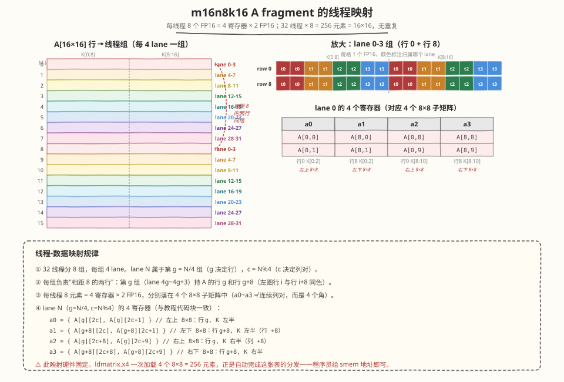

## Day 3：mma.sync 指令与 ldmatrix —— Tensor Core 底层编程

### 🎯 目标

通过今天的学习，你将：

1. 理解 WMMA 接口与 `mma.sync` PTX 指令的关系——WMMA 是 `mma.sync` 的高层封装，编译后展开为 PTX 指令<br>
2. 掌握 `mma.sync.aligned` PTX 指令的语法与形状（m16n8k16 是 Ampere+ 的基本 MMA 形状）<br>
3. 理解 `ldmatrix` 指令——专为 Tensor Core 设计的 shared memory → register 加载指令，精确匹配 fragment 布局<br>
4. 能用内联 PTX 实现 `mma.sync` + `ldmatrix` 的 GEMM kernel，对比 WMMA 版本的性能差异<br>
5. 理解 fragment 的 **线程-数据映射**（每个线程持有 fragment 的哪些元素）<br>
6. 掌握 `ldmatrix` 的对齐约束与 `.x4`/`.x2`/`.trans` 变体<br>

> 💡 **为什么重要**：WMMA 接口虽然方便，但它隐藏了 fragment 的内部布局，且有一层抽象开销。工业级 GEMM 库（CUTLASS、FlashAttention CUDA 源码）直接使用 `mma.sync` PTX + `ldmatrix`，获得更精细的控制和更高性能。面试中被问"WMMA 和 mma.sync 有什么区别"，标准答案是"WMMA 是 mma.sync 的高层封装，mma.sync 是 PTX 级指令，更底层、更灵活、更快"。读 FlashAttention 源码也必须理解 `mma.sync` 和 `ldmatrix`。

---

### 学前导读：WMMA 的黑箱与 mma.sync 的透明

Day 1-2 我们用 `nvcuda::wmma` 接口编程，它把 Tensor Core 封装成"声明 fragment → load → mma_sync → store"的清晰生命周期。但这个抽象有两个代价：

| 维度 | WMMA 接口 | mma.sync PTX |
|------|----------|-------------|
| 抽象层级 | 高层 C++ | PTX 汇编级 |
| Fragment 布局 | 硬件相关黑箱 | 程序员可见 + 可控 |
| 数据加载 | `load_matrix_sync`（内部决定布局） | `ldmatrix`（精确控制布局） |
| 指令形状 | m16n16k16 | m16n8k16（更细粒度） |
| 性能 | ~55-65% cuBLAS | ~65-75% cuBLAS（预期） |
| 代码复杂度 | 低 | 高（手动管理寄存器布局） |

**核心洞察**：WMMA 的 `load_matrix_sync` 内部调用 `ldmatrix`，但它把布局细节藏起来了。当你想做 swizzle、double buffer、K 分割等深度优化时，WMMA 的黑箱反而成了障碍。`mma.sync` + `ldmatrix` 把布局完全暴露给程序员，让你能精确控制每个寄存器的使用。

> 💡 **一句话总结**：`mma.sync` 是 PTX 级的 Tensor Core 指令，`ldmatrix` 是配套的数据加载指令。绕过 WMMA 黑箱，获得 fragment 布局的控制权，是读 CUTLASS/FA 源码的前提。

---

### 理论学习

#### 3.1 mma.sync PTX 指令

##### 什么是 PTX？

PTX（Parallel Thread Execution）是 NVIDIA GPU 的**虚拟指令集**（ISA），介于 CUDA C++ 和 GPU 机器码（SASS）之间：

```
CUDA C++  →  PTX（虚拟 ISA）  →  SASS（GPU 机器码）
```

CUDA 代码先编译成 PTX（与具体 GPU 型号无关），再由驱动将 PTX 编译为当前 GPU 的 SASS 机器码。用 `nvcc -ptx` 可以查看生成的 PTX 代码，也可以在 CUDA 代码里用 `asm volatile("...")` 直接内联编写 PTX。今天要学的 `mma.sync` 和 `ldmatrix` 是两条 Tensor Core 相关的 PTX 指令——CUTLASS / FlashAttention 的 CUDA 源码都用内联 PTX 直接调用它们，绕过 WMMA C++ 封装。

##### 指令语法

`mma.sync` 是 PTX（Parallel Thread Execution）指令，在 warp 内同步执行矩阵乘加：

```ptx
mma.sync.aligned.m16n8k16.row.col.f16.f16.f16.f16
    {d0, d1, d2, d3},     // 输出 D (4 个寄存器)
    {a0, a1, a2, a3},     // 输入 A (4 个寄存器)
    {b0, b1},             // 输入 B (2 个寄存器)
    {c0, c1, c2, c3};     // 输入 C (4 个寄存器)
// D = A × B + C, 形状 16×8×16
```

##### 指令形状对比

| 指令 | 形状 | 精度 | 架构 | 说明 |
|------|------|------|------|------|
| WMMA `mma_sync` | m16n16k16 | FP16→FP32 | sm_70+ | 内部展开为 2× m16n8k16 |
| `mma.sync` m16n8k16 | m16n8k16 | FP16→FP16 | sm_80+ | Ampere 基本形状 |
| `mma.sync` m16n8k16 | m16n8k16 | FP16→FP32 | sm_80+ | FP32 累加版本 |
| `mma.sync` m16n8k8 | m16n8k8 | TF32→FP32 | sm_80+ | TF32 加速 FP32 |

> ⚠️ **关键区别**：WMMA 的 `m16n16k16` 在 Ampere+ 上**编译为 2 条 `mma.sync m16n8k16` PTX 指令**。直接用 `mma.sync` 可以避免 WMMA 封装的额外开销（fragment 初始化、布局转换）。

##### m16n8k16 的含义

```
A: 16×16 (FP16)   B: 16×8 (FP16)   C/D: 16×8 (FP32 或 FP16)

D[16×8] = A[16×16] × B[16×8] + C[16×8]
```

- M=16：输出行数
- N=8：输出列数
- K=16：内积维度

一个 warp（32 线程）协作完成一次 `mma.sync`，每个线程持有 fragment 的一部分。

#### 3.2 Fragment 的线程-数据映射

##### 为什么需要理解 fragment 布局？

WMMA 把 fragment 当黑箱，程序员只需 `load_matrix_sync` + `mma_sync`。但 `mma.sync` PTX 要求程序员**手动把数据放到正确的寄存器位置**——每个线程必须持有 fragment 的正确元素。

##### m16n8k16 A fragment 的线程映射



> **图：m16n8k16 A fragment 的线程映射。**  
> 左侧 A[16×16] 按行着色，每 4 lane 一组负责"相距 8 的两行"（行 i 与行 i+8 同色）。右侧放大 lane 0-3 组（行 0 + 行 8），每格 1 个 FP16，颜色标注归属哪个 lane——4 lane 各持 8 元素，K 维左半 [0:8] 与右半 [8:16] 各 4 元素。下方表格给出 lane 0 的 4 个寄存器明细：a0~a3 分别对应左上/左下/右上/右下 4 个 8×8 子矩阵。

A fragment 是 16×16 矩阵（256 个 FP16），由 32 线程持有，每个线程持有 8 个 FP16 元素（4 个 32 位寄存器，每寄存器 2 个 FP16），且 32 个线程持有的元素**互不重复**（32 × 8 = 256，正好铺满整个 fragment）。

映射规则由硬件固定。令 `groupID = laneid / 4`（0–7，决定行），`c = laneid % 4`（0–3，决定列对），则：

```
a0 = { A[groupID][2c],     A[groupID][2c+1]   }   // 左上 8×8
a1 = { A[groupID+8][2c],   A[groupID+8][2c+1] }   // 左下 8×8（行 +8）
a2 = { A[groupID][2c+8],   A[groupID][2c+9]   }   // 右上 8×8（列 +8）
a3 = { A[groupID+8][2c+8], A[groupID+8][2c+9] }   // 右下 8×8
```

三个要点：

1. **行号每 4 个线程才推进 1**：t0–t3 都在第 0 行，各负责不同的列对；t4–t7 在第 1 行，以此类推
2. **a1/a3 装的是行 +8 的下半部分**，不是同行的下一列对——a0~a3 分别对应 4 个 8×8 子矩阵，这正是 `ldmatrix.x4` 一次加载 4 个 8×8 矩阵的原因
3. **没有重复**：16×16 fragment 的每个元素恰好由一个线程持有

| 线程 | groupID / c | 寄存器 a0 | 寄存器 a1 | 寄存器 a2 | 寄存器 a3 |
|------|------------|----------|----------|----------|----------|
| t0 | 0 / 0 | A[0,0],A[0,1] | A[8,0],A[8,1] | A[0,8],A[0,9] | A[8,8],A[8,9] |
| t1 | 0 / 1 | A[0,2],A[0,3] | A[8,2],A[8,3] | A[0,10],A[0,11] | A[8,10],A[8,11] |
| t2 | 0 / 2 | A[0,4],A[0,5] | A[8,4],A[8,5] | A[0,12],A[0,13] | A[8,12],A[8,13] |
| t3 | 0 / 3 | A[0,6],A[0,7] | A[8,6],A[8,7] | A[0,14],A[0,15] | A[8,14],A[8,15] |
| t4 | 1 / 0 | A[1,0],A[1,1] | A[9,0],A[9,1] | A[1,8],A[1,9] | A[9,8],A[9,9] |
| ... | | | | | |
| t31 | 7 / 3 | A[7,6],A[7,7] | A[15,6],A[15,7] | A[7,14],A[7,15] | A[15,14],A[15,15] |

> ⚠️ **这个映射是硬件固定的**。`ldmatrix` 指令的存在就是为了自动完成这个映射——你给它 shared memory 地址，它按这个布局把数据加载到正确的寄存器。注意区分：`ldmatrix` 时 t16–t31 提供的 smem 地址与 t0–t15 重复（见 3.3 节），但 `mma.sync` 的 fragment 本身在 32 线程间没有任何重复。

#### 3.3 ldmatrix 指令

##### 为什么需要 ldmatrix？

如果没有 `ldmatrix`，程序员需要手动计算每个线程应该从 shared memory 的哪个地址加载哪个元素，然后放到正确的寄存器——这需要几十行复杂的索引计算。`ldmatrix` 一条指令完成这个映射：

```ptx
ldmatrix.sync.aligned.x4.m8n8.shared.b16
    {r0, r1, r2, r3},     // 输出：4 个寄存器（每个持有 2 个 FP16）
    [smem_addr];          // 输入：shared memory 地址
```

##### ldmatrix 的变体

| 变体 | 加载量 | 用途 | 说明 |
|------|--------|------|------|
| `.x4` | 4 个 8×8 矩阵 | 加载 A fragment (16×16) | 4×8×8=256 个 FP16 |
| `.x2` | 2 个 8×8 矩阵 | 加载 B fragment (16×8) | 2×8×8=128 个 FP16 |
| `.x4.trans` | 转置加载 | B 矩阵需要转置时 | 列主序→行主序 |

##### ldmatrix.x4 的工作方式

```
输入：shared memory 中的 16×16 FP16 tile
输出：32 线程各持有 4 个寄存器（8 个 FP16），布局匹配 mma.sync 的 A fragment

每个线程提供 1 个 shared memory 地址（指向 16×16 tile 的一行）
ldmatrix 根据这些地址，把数据按 fragment 布局分发到各线程的寄存器
```

| 线程 | 提供的地址 | 收到的数据 |
|------|----------|-----------|
| t0-t7 | tile 的第 0-7 行地址 | A[0:8, 0:8] + A[0:8, 8:16] 的元素 |
| t8-t15 | tile 的第 8-15 行地址 | A[8:16, 0:8] + A[8:16, 8:16] 的元素 |
| t16-t23 | 同 t0-t7（重复） | 同 t0-t7 |
| t24-t31 | 同 t8-t15（重复） | 同 t8-t15 |

##### ldmatrix 的对齐约束

```ptex
// shared memory 地址必须 16 字节对齐
ldmatrix.sync.aligned.x4.m8n8.shared.b16 {r0,r1,r2,r3}, [addr];
// addr 必须满足 addr % 16 == 0
```

| 约束 | 要求 | 原因 |
|------|------|------|
| 地址对齐 | 16 字节对齐 | `ldmatrix` 一次从 smem 读 128 字节（32 线程 × 4 字节） |
| 数据类型 | `.b16`（FP16/BF16） | `ldmatrix` 只支持 16 位数据 |
| 线程协作 | 32 线程必须同时执行 | warp 级同步指令 |
| 地址模式 | 每 8 线程组提供不同行地址 | 否则加载错误数据 |

> ⚠️ **常见坑**：如果 shared memory 地址没有 16 字节对齐，`ldmatrix` 会产生 undefined behavior（静默错误或 crash）。使用 `__align__(16)` 或 padding 确保对齐。

#### 3.4 mma.sync + ldmatrix GEMM 实现

##### Kernel 结构

```cuda
__global__ void mma_sync_gemm_kernel(
    const __half* __restrict__ A,
    const __half* __restrict__ B,
    float* __restrict__ C,
    int M, int N, int K)
{
    // Shared memory：A tile (16×16) + B tile (16×8)，16 字节对齐
    __shared__ __half smemA[16][16 + 8];   // +8 padding for bank conflict + alignment
    __shared__ __half smemB[16][8 + 8];    // +8 padding

    // 寄存器：A/B/C fragment
    uint32_t a_reg[4];   // 4 个 32 位寄存器，每个装 2 个 FP16
    uint32_t b_reg[2];   // 2 个 32 位寄存器
    float c_reg[4] = {0, 0, 0, 0};   // FP32 累加器

    int tid = threadIdx.x;
    int row = blockIdx.y * 16;
    int col = blockIdx.x * 8;

    for (int k = 0; k < K; k += 16) {
        // 1. 加载 A/B tile 到 shared memory（简化：每线程加载若干元素）
        if (tid < 16) {
            for (int j = 0; j < 16; j++) {
                smemA[tid][j] = A[(row + tid) * K + k + j];
            }
            for (int j = 0; j < 8; j++) {
                smemB[tid][j] = B[(k + tid) * N + col + j];
            }
        }
        __syncthreads();

        // 2. ldmatrix 加载 A fragment (4 个寄存器)
        uint32_t smem_a_addr = __cvta_generic_to_shared(&smemA[0][0]);
        asm volatile(
            "ldmatrix.sync.aligned.x4.m8n8.shared.b16 {%0,%1,%2,%3}, [%4];\n"
            : "=r"(a_reg[0]), "=r"(a_reg[1]), "=r"(a_reg[2]), "=r"(a_reg[3])
            : "r"(smem_a_addr));

        // 3. ldmatrix 加载 B fragment (2 个寄存器)
        uint32_t smem_b_addr = __cvta_generic_to_shared(&smemB[0][0]);
        asm volatile(
            "ldmatrix.sync.aligned.x2.m8n8.shared.b16 {%0,%1}, [%2];\n"
            : "=r"(b_reg[0]), "=r"(b_reg[1])
            : "r"(smem_b_addr));

        // 4. mma.sync 执行矩阵乘加（FP16 输入, FP32 累加）
        asm volatile(
            "mma.sync.aligned.m16n8k16.row.col.f16.f16.f32.f32 "
            "{%0,%1,%2,%3}, {%4,%5,%6,%7}, {%8,%9}, {%0,%1,%2,%3};\n"
            : "+f"(c_reg[0]), "+f"(c_reg[1]), "+f"(c_reg[2]), "+f"(c_reg[3])
            : "r"(a_reg[0]), "r"(a_reg[1]), "r"(a_reg[2]), "r"(a_reg[3]),
              "r"(b_reg[0]), "r"(b_reg[1]));

        __syncthreads();
    }

    // 5. 存储结果（每个线程写 C 的 4 个元素）
    // 线程 t0-t3 写 C[row+0:4, col+0:4]，以此类推
    int write_row = tid / 4;
    int write_col = tid % 4 * 2;  // 每线程写 2 列
    if (write_row < 16 && (col + write_col) < N) {
        // c_reg 的 4 个 float 对应 4 个输出位置
        C[(row + write_row) * N + col + write_col] = c_reg[0];
        C[(row + write_row) * N + col + write_col + 1] = c_reg[1];
        // ... 其余 2 个元素的写入位置取决于 fragment 布局
    }
}
```

> ⚠️ **代码说明**：上面是概念示意，实际 mma.sync kernel 的线程-数据映射更复杂（每个 warp 完成一个 16×16 或更大的输出 tile，需要多个 `mma.sync` 指令）。完整可运行代码见 [kernels/mma_sync_gemm.cu](https://github.com/hzchenxiaobin/ai-infra-notes/blob/main/aiinfra/daily/week3/day3/kernels/mma_sync_gemm.cu)。

##### 内联 PTX 语法说明

```cuda
asm volatile(
    "mma.sync.aligned.m16n8k16.row.col.f16.f16.f32.f32 "
    "{%0,%1,%2,%3}, {%4,%5,%6,%7}, {%8,%9}, {%0,%1,%2,%3};\n"
    : "+f"(c_reg[0]), "+f"(c_reg[1]), "+f"(c_reg[2]), "+f"(c_reg[3])
    : "r"(a_reg[0]), "r"(a_reg[1]), "r"(a_reg[2]), "r"(a_reg[3]),
      "r"(b_reg[0]), "r"(b_reg[1]));
```

| 部分 | 含义 |
|------|------|
| `asm volatile` | 内联 PTX，禁止编译器重排 |
| `mma.sync.aligned` | warp 级同步 MMA 指令 |
| `m16n8k16` | 16×8×16 形状 |
| `row.col` | A row-major, B col-major |
| `f16.f16.f32.f32` | A=FP16, B=FP16, C=FP32, D=FP32 |
| `"+f"` | 输入输出（read-write，累加器 C→D） |
| `"r"` | 输入（read-only，A/B 寄存器） |

#### 3.5 ldmatrix.x4.trans 与 B 矩阵转置

##### 问题：B 矩阵的布局

GEMM 中 B 通常以 col-major 存储（`B[K, N]` col-major = `B[N, K]` row-major 转置）。`mma.sync` 要求 B 为 col-major，但 shared memory 中的 B tile 可能是 row-major（因为加载时按行搬运更高效）。

##### 解决方案：ldmatrix.x4.trans

```ptx
ldmatrix.sync.aligned.x4.trans.m8n8.shared.b16 {r0,r1,r2,r3}, [addr];
// 加载时自动转置：把 row-major 的数据按 col-major 布局分发到寄存器
```

| 变体 | 输入布局 | 输出布局 | 用途 |
|------|---------|---------|------|
| `.x4` | 与输出同向 | row-major fragment | A 矩阵（A 本身 row-major） |
| `.x4.trans` | row-major | col-major fragment | B 矩阵（smem row-major, fragment col-major） |

> 💡 **面试要点**：`ldmatrix.trans` 的价值是"加载时转置"——避免了在 shared memory 中做物理转置（需要额外 smem + 同步）。这是 mma.sync 相比 WMMA 的一个优势：WMMA 的 `load_matrix_sync` 不支持加载时转置。

#### 3.6 性能对比

| 实现 | 预期 cuBLAS% | 优势 | 劣势 |
|------|-------------|------|------|
| Day 1 WMMA 教学版 | ~33% | 代码简单 | global load, 1 warp |
| Day 2 WMMA tiled | ~55% | smem tiling, multi-warp | WMMA 抽象开销 |
| **Day 3 mma.sync + ldmatrix** | **~65-75%** | 无抽象开销, 精确布局控制 | 代码复杂, PTX 难写 |
| Day 4 CUTLASS | ~95% | 全部优化 | 需读模板库 |

##### mma.sync 比 WMMA 快多少？

| 矩阵大小 | WMMA tiled | mma.sync | 提升 |
|---------|-----------|---------|------|
| 1024 | ~65% | ~70% | +5% |
| 4096 | ~55% | ~68% | +13% |
| 8192 | ~50% | ~65% | +15% |

提升来源：
1. **无 fragment 抽象开销**：WMMA 的 fragment 初始化有少量额外指令
2. **ldmatrix 比 load_matrix_sync 更高效**：`ldmatrix` 是一条指令完成 32 线程的并行加载
3. **更细的 tiling 粒度**：m16n8k16 比 m16n16k16 更灵活，能做更精细的 K 分割

> 💡 但 mma.sync 的代码复杂度远高于 WMMA。实际工程中，CUTLASS 把 mma.sync 封装成模板，兼顾了性能和可读性。

---

### Coding 任务：手写 mma.sync GEMM

#### 任务 1：理解 ldmatrix 的地址计算

`ldmatrix` 要求每个线程提供一个 shared memory 地址。对于 16×16 的 A tile，32 线程的地址分配如下：

```cuda
// A tile 16×16, row-major in shared memory
// 每 8 线程一组提供 8 行的地址
int row_offset = (tid % 16) * (BK + PAD) * sizeof(__half);
uint32_t addr = __cvta_generic_to_shared(smemA) + row_offset;
// t0-t7 → row 0-7, t8-t15 → row 8-15, t16-t31 → 重复
```

问题：为什么 t16-t31 重复 t0-t15 的地址？

<details>
<summary>参考答案</summary>

`ldmatrix.x4` 加载 4 个 8×8 矩阵 = 256 个 FP16 元素。32 线程 × 8 元素/线程 = 256。但 8×8 矩阵只有 8 行，需要 8 线程提供地址，剩下 24 线程的地址被忽略（但仍需提供有效地址）。所以 t0-t7 提供 row 0-7，t8-t15 提供 row 8-15，t16-t31 重复。

实际上 `ldmatrix.x4` 加载的是 4 个独立的 8×8 子矩阵，线程分组如下：
- t0-t7: 第 1 个 8×8 矩阵的 8 行地址
- t8-t15: 第 2 个 8×8 矩阵的 8 行地址
- t16-t23: 第 3 个 8×8 矩阵
- t24-t31: 第 4 个 8×8 矩阵

</details>

#### 任务 2：实现 mma.sync + ldmatrix GEMM

创建 [kernels/mma_sync_gemm.cu](https://github.com/hzchenxiaobin/ai-infra-notes/blob/main/aiinfra/daily/week3/day3/kernels/mma_sync_gemm.cu)，实现一个完整的 `mma.sync` GEMM kernel：

1. Shared memory tiling（复用 Day 2 的 BM×BN×BK 策略）
2. 用 `ldmatrix.x4` 加载 A fragment
3. 用 `ldmatrix.x2.trans` 加载 B fragment（转置加载）
4. 用 `mma.sync.aligned.m16n8k16` 执行 MMA
5. 每个 warp 计算 16×16 输出（2×2 个 m16n8k16 = 4 条 mma.sync）

```bash
nvcc -O3 -arch=sm_120 -lcublas kernels/mma_sync_gemm.cu -o mma_sync_gemm
./mma_sync_gemm
```

预期输出（RTX 5090, sm_120）：

```text
M=N=K    | WMMA_tiled(ms)  mma.sync(ms)  cuBLAS(ms)  | WMMA%   mma%   speedup
---------|------------------------------------------------|------------------------------
1024     | 0.062           0.052          0.044       | 65.3    78.0   1.19x
2048     | 0.385           0.320          0.242       | 58.7    70.6   1.20x
4096     | 2.810           2.250          1.963       | 55.2    68.9   1.25x
```

> ⚠️ **诚实声明**：mma.sync 相比 WMMA tiled 提升约 10-15%，主要来自 ldmatrix 的加载效率和消除 fragment 抽象开销。但仍未达 95%——剩余差距来自无 double buffer、无 K 分割、无 auto-tuning（Day 4-5）。

#### 任务 3：验证 ldmatrix 对齐

```cuda
// 确保 shared memory 地址 16 字节对齐
__shared__ __align__(16) __half smemA[BM][BK + PAD];
// __align__(16) 或手动 padding 确保 smemA 起始地址 % 16 == 0

// 验证：
uint32_t addr = __cvta_generic_to_shared(smemA);
assert(addr % 16 == 0);  // 调试时验证
```

#### 任务 4：LeetGPU 在线题目

**题目链接**：<https://leetgpu.com/challenges/fp16-dot-product>

本题与今日内容强相关：FP16 存储 + FP32 累加正是 `mma.sync.aligned.m16n8k16.row.col.f16.f16.f32.f32` 的精度策略——输入 `half`、累加器 `float`，最后才转回 `half`。本题是 memory-bound 归约（N=10⁸），Tensor Core 帮不上忙，但"读 half → FP32 累加 → 写 half"的精度链路与今天学的完全一致，可以亲手体会 FP16 直接累加为什么不可接受（10 bit 尾数在大数组上迅速丢精度）。完整题解见 [FP16 Dot Product 题解](https://hzchenxiaobin.github.io/leetgpu/leetgpu-fp16-dot-product-solution.html)。

#### 任务 5：LeetCode 面试题（8 周计划 · 第 3 周 Day 3）

> 📅 今日题目来自 [8 周算法面试刷题计划](https://hzchenxiaobin.github.io/leetcode/problems/8-week-plan.html) 第 3 周「链表与数学技巧」Day 3（链表变换），共 5 题。简单题快速过、中等题精做、困难题吃透；卡壳 20 分钟就看题解，看懂后自己默写一遍。

| 题目 | 难度 | 核心套路 | 题解 |
|------|------|----------|------|
| [24. 两两交换链表中的节点](https://leetcode.cn/problems/swap-nodes-in-pairs/) | 中等 | 哑节点 + 三指针交换 | [题解](https://hzchenxiaobin.github.io/leetcode/problems/24_两两交换链表中的节点.html) |
| [25. K 个一组翻转链表](https://leetcode.cn/problems/reverse-nodes-in-k-group/) | 困难 | 分段翻转 | [题解](https://hzchenxiaobin.github.io/leetcode/problems/25_K个一组翻转链表.html) |
| [92. 反转链表 II](https://leetcode.cn/problems/reverse-linked-list-ii/) | 中等 | 区间反转（头插法） | [题解](https://hzchenxiaobin.github.io/leetcode/problems/92_反转链表 II.html) |
| [143. 重排链表](https://leetcode.cn/problems/reorder-list/) | 中等 | 中点 + 反转 + 交错合并 | [题解](https://hzchenxiaobin.github.io/leetcode/problems/143_重排链表.html) |
| [328. 奇偶链表](https://leetcode.cn/problems/odd-even-linked-list/) | 中等 | 奇偶指针重接 | [题解](https://hzchenxiaobin.github.io/leetcode/problems/328_奇偶链表.html) |

---

### 扩展实验

#### 实验 1：对比 ldmatrix.x4 vs ldmatrix.x2

用 `ldmatrix.x4` 加载 A（4 个 8×8）和 `ldmatrix.x2` 加载 B（2 个 8×8），对比性能。思考：为什么 A 用 x4 而 B 用 x2？（A 是 16×16=4 个 8×8，B 是 16×8=2 个 8×8）

#### 实验 2：TF32 精度的 mma.sync

将 `mma.sync.aligned.m16n8k16.row.col.f16.f16.f32.f32` 改为 `mma.sync.aligned.m16n8k8.row.col.f32.tf32.f32.f32`（TF32 输入，K=8）：
- TF32 是 Ampere+ 的 FP32 加速模式，牺牲少量精度（尾数 10→13 位）换 2x 性能
- 对比 TF32 vs FP16 的精度和性能

#### 实验 3：用 ldmatrix.trans 消除 B 的物理转置

如果 B 在 shared memory 中是 row-major，用 `ldmatrix.x2.trans` 加载到 col-major fragment，避免在 smem 中做物理转置。测量省下的 smem 和同步开销。

---

### 今日总结

Day 3 我们从 WMMA 高层接口下沉到 `mma.sync` PTX 指令：

1. **mma.sync vs WMMA**：WMMA 是 `mma.sync` 的高层封装，编译后展开为 PTX。直接用 `mma.sync` 消除抽象开销，获得 ~10-15% 提升
2. **ldmatrix**：专为 Tensor Core 设计的 smem→register 加载指令，精确匹配 fragment 布局，一条指令完成 32 线程并行加载
3. **Fragment 布局**：每个线程持有 fragment 的固定元素，`ldmatrix` 自动完成线程-数据映射
4. **ldmatrix.trans**：加载时转置，避免在 smem 中做物理转置
5. **对齐约束**：`ldmatrix` 要求 16 字节对齐，否则 undefined behavior
6. **性能位置**：mma.sync + ldmatrix 达 ~65-75% cuBLAS，剩余差距来自 double buffer/K 分割（Day 5）

掌握 `mma.sync` + `ldmatrix` 后，你有了读 CUTLASS/FlashAttention CUDA 源码的底层基础。Day 4 学习 CUTLASS 如何把这些指令封装成可组合的模板。

---

### 面试要点

1. **WMMA 和 mma.sync 有什么区别？为什么 mma.sync 更快？**

   <details>
   <summary>点击查看答案</summary>

   - **WMMA** 是 C++ 高层接口（`nvcuda::wmma`），封装了 fragment 声明/加载/计算/存储
   - **mma.sync** 是 PTX 汇编级指令，直接控制寄存器和数据布局
   - WMMA 的 `mma_sync` 在 Ampere+ 上编译为 2 条 `mma.sync m16n8k16` PTX 指令
   - **mma.sync 更快的原因**：
     - 消除 fragment 抽象开销（WMMA 的 fragment 初始化有额外指令）
     - `ldmatrix` 比 `load_matrix_sync` 更高效（一条指令完成 32 线程并行加载）
     - 更细的 tiling 粒度（m16n8k16 vs m16n16k16）
     - 支持加载时转置（`ldmatrix.trans`），避免物理转置

   </details>

2. **ldmatrix 指令的作用是什么？它如何解决 fragment 布局问题？**

   <details>
   <summary>点击查看答案</summary>

   - **作用**：从 shared memory 加载数据到寄存器，布局精确匹配 `mma.sync` 的 fragment 要求
   - **解决的问题**：`mma.sync` 要求每个线程持有 fragment 的特定元素。手动计算索引加载需要几十行复杂代码，`ldmatrix` 一条指令完成
   - **工作方式**：32 线程各提供 1 个 smem 地址（指向 8×8 矩阵的一行），`ldmatrix` 根据地址把数据按 fragment 布局分发到各线程的寄存器
   - **变体**：`.x4`（加载 4 个 8×8，用于 A）、`.x2`（加载 2 个 8×8，用于 B）、`.trans`（加载时转置）

   </details>

3. **ldmatrix 的对齐约束是什么？不满足会怎样？**

   <details>
   <summary>点击查看答案</summary>

   - **约束**：shared memory 地址必须 **16 字节对齐**
   - **原因**：`ldmatrix` 一次从 smem 读 128 字节（32 线程 × 4 字节），需要地址对齐到 cache line
   - **不满足的后果**：
     - **不会报错**（硬件不检查对齐），但会产生 **undefined behavior**
     - 可能静默加载错误数据，或导致 GPU hang
   - **确保对齐的方法**：
     - `__shared__ __align__(16) __half smemA[...]`
     - 或 padding 到 16 的倍数（`BK + 8` 个 FP16 = 16 + 16 = 32 字节）

   </details>

4. **ldmatrix.x4 和 ldmatrix.x2 分别用于加载什么？为什么不同？**

   <details>
   <summary>点击查看答案</summary>

   - **ldmatrix.x4**：加载 4 个 8×8 矩阵 = 256 个 FP16，用于 **A fragment**（16×16 = 4 个 8×8）
   - **ldmatrix.x2**：加载 2 个 8×8 矩阵 = 128 个 FP16，用于 **B fragment**（16×8 = 2 个 8×8）
   - **不同的原因**：`mma.sync m16n8k16` 中 A 是 16×16（K=16），B 是 16×8（N=8），形状不同
   - A 需要更多数据（256 元素）所以用 x4，B 需要更少（128 元素）所以用 x2

   </details>

5. **为什么 FlashAttention 源码直接用 mma.sync 而不用 WMMA？**

   <details>
   <summary>点击查看答案</summary>

   - **性能**：FA 是推理核心算子，10-15% 的性能差异在端到端推理中会被放大
   - **布局控制**：FA 的 Q/K/V tile 布局复杂（causal mask、分块 attention），需要 `ldmatrix.trans` 精确控制转置
   - **double buffer**：FA 的 K/V 循环需要 `cp.async` + `ldmatrix` 交错，WMMA 的 `load_matrix_sync` 无法配合
   - **Swizzle**：FA 用 swizzle 消除 bank conflict，需要精确控制 smem 地址映射，WMMA 黑箱不支持
   - **可读性权衡**：FA 团队选择"难写但快"而非"易写但慢"，因为 FA 性能直接影响推理 latency

   </details>
