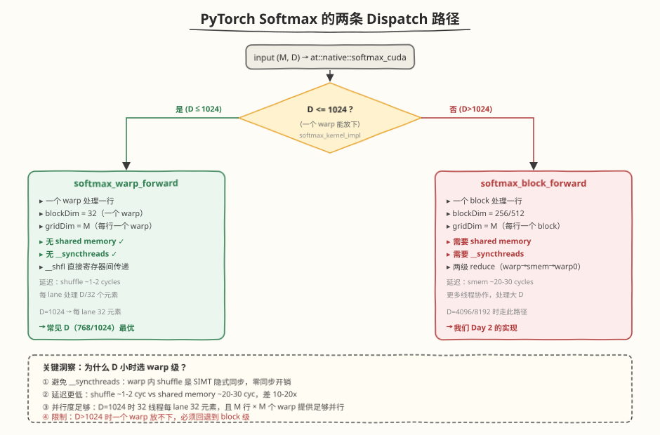
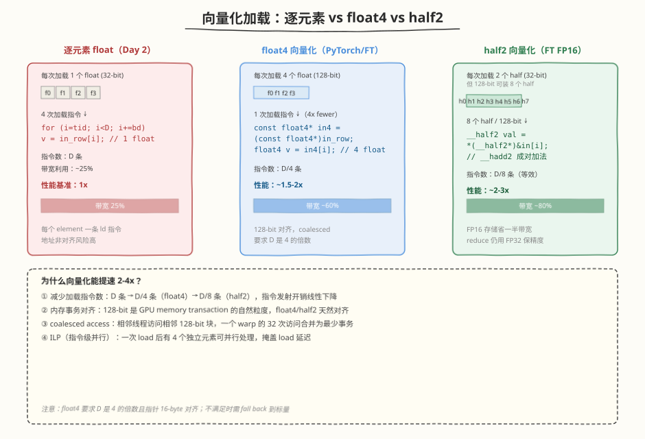
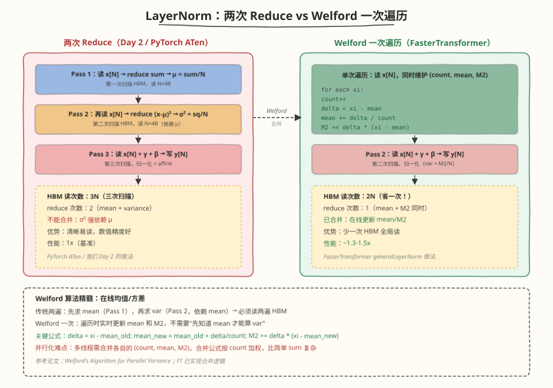

## Day 3：源码分析 —— PyTorch / FasterTransformer

### 🎯 目标

通过今天的学习，你将：

1. 理解 PyTorch ATen 的 Softmax 为何在 **D ≤ 1024 时走 warp 级路径**，避免 `__syncthreads` 和 shared memory
2. 掌握 **向量化加载**（float4 / half2）的原理，能解释为什么它能让 memory-bound kernel 提速 2-4x
3. 理解 FasterTransformer LayerNorm 用 **Welford 在线算法**把两次 reduce 合并成一次遍历
4. 能列出工业级实现比 Day 2 手写版多的 3 个优化（向量化 / Welford / register 缓存），并评估各自收益
5. 理解 FP16 输入时 reduce 为什么要 cast 到 FP32（混合精度标准做法）
6. 完成至少一项优化（warp 级 Softmax 或 float4 LayerNorm），用 ncu 验证 DRAM Throughput 提升

> 💡 **为什么重要**：Day 2 我们手写了"能跑对"的 Softmax/LayerNorm，但和 PyTorch 官方实现比慢了 1.5-3x。今天通过读源码，找到差距在哪、为什么这么优化——这是从"能写 kernel"到"能写高性能 kernel"的关键一步。读源码不是为了背代码，而是建立"看到 memory-bound kernel 就条件反射想到向量化 + fusion + reduce 合并"的工程直觉。

---

### 学前导读：Day 2 的 kernel 跑对了，但慢在哪？

昨天我们用三遍扫描 + 两级 block reduce 实现了 Softmax/LayerNorm，与 CPU 误差 < 1e-5。但如果拿 `torch.softmax` 对比 latency，大概率会慢 1.5-2x。差距来自三个工程细节：

| 维度 | Day 2 手写版 | 差距来源 | 今日对应源码 |
|------|-------------|---------|------------|
| 加载方式 | 逐元素 `float`（每次 1 个） | 指令数 4x，带宽利用仅 ~25% | PyTorch `load<ILP=4>` |
| Softmax 路径 | 一律 block 级（256 线程） | D=1024 时 `__syncthreads` 是多余开销 | PyTorch `softmax_warp_forward` |
| LayerNorm reduce | 两次（mean, var 各读一遍 HBM） | 多一次 N×4B 全局读 | FT Welford 一次遍历 |

今天的任务是**读官方源码 + 动手把 Day 2 的版本优化一两项**，用 ncu 量化收益。这不是为了超越 PyTorch（那需要 CUTLASS 级工程量），而是建立"看到 memory-bound 就知道优化在哪"的直觉。

> 💡 **一句话总结**：工业 kernel 的优势不是算法多巧妙，而是把"向量化、reduce 合并、精度混合、register 缓存"这些工程细节一个个抠到极致——今天逐个拆解。

---

### 理论学习

#### 3.1 PyTorch ATen Softmax：warp 级 vs block 级 Dispatch



**源码位置**：`aten/src/ATen/native/cuda/SoftMax.cu`

PyTorch 的 softmax 不是一条路径，而是根据特征维 `D` 做 **dispatch**：

| 路径 | 触发条件 | 并行粒度 | 关键优势 |
|------|---------|---------|---------|
| `softmax_warp_forward` | D ≤ 1024（一个 warp 能放下） | 一个 warp 一行 | 无 `__syncthreads`、无 shared memory |
| `softmax_block_forward` | D > 1024 | 一个 block 一行 | 更多线程协作，处理大 D |

##### 为什么 D ≤ 1024 时选 warp 级？

Day 2 我们一律用 block 级（256 线程 + shared memory + `__syncthreads`）。但 PyTorch 在 D=1024 时改用 warp 级（32 线程，无 smem），原因有三：

1. **避免** `__syncthreads`：warp 内的 `__shfl` 是 SIMT 隐式同步（32 个 lane 同步执行），不需要显式屏障；block 级 reduce 必须 `__syncthreads`，有同步开销
2. **延迟更低**：warp shuffle 延迟 ~1-2 cycles，shared memory 访问 ~20-30 cycles，差 10-20 倍
3. **并行度足够**：D=1024 时 32 线程每 lane 处理 32 元素，且 M 行 × M 个 warp 提供足够并行度

```cuda
// PyTorch softmax_warp_forward 的核心思路（简化）
// blockDim.x = 32（一个 warp），gridDim.x = M
int lane = threadIdx.x; // 0..31
float local_max = -INFINITY;
for (int i = lane; i < D; i += 32) // 每 lane 处理 D/32 个
    local_max = fmaxf(local_max, in_row[i]);
local_max = warpReduceMax(local_max);              // __shfl 直接归约，无 smem
local_max = __shfl_sync(0xFFFFFFFF, local_max, 0); // 广播给全 warp
// 后续 sum / normalize 同理，全程无 __syncthreads
```

**关键差异**：warp 级用 `__shfl_sync(0xFFFFFFFF, val, 0)` 把 lane 0 的结果广播给全 warp（因为 `__shfl_down_sync` 后只有 lane 0 有正确值），而 block 级必须走 `__shared__` 变量 + `__syncthreads` 广播。

> ⚠️ **注意**：warp 级的代价是"一个 warp 只能处理 D ≤ 1024 的行"（32 lane × 32 元素 = 1024）。D 更大时一个 warp 放不下，必须回退到 block 级。这就是 Day 2 用 block 级做"通用版"的原因——它什么 D 都能处理，但在常见 D（768/1024）上不是最优。

#### 3.2 向量化加载：float4 与 half2



这是 memory-bound kernel **最直接、收益最大**的优化。Day 2 我们逐元素加载：

```cuda
// Day 2：每次加载 1 个 float（32-bit）
for (int i = tid; i < D; i += blockDim.x) {
    float v = in_row[i]; // 1 条 ld 指令，1 个 float
    local_sum += v;
}
```

PyTorch/FasterTransformer 用 `float4`（128-bit）一次加载 4 个 float：

```cuda
// 优化版：每次加载 4 个 float（128-bit）
const float4* in4 = reinterpret_cast<const float4*>(in_row);
int N4 = D / 4;
for (int i = tid; i < N4; i += blockDim.x) {
    float4 v = in4[i]; // 1 条 ld 指令，4 个 float
    local_sum += v.x + v.y + v.z + v.w;
}
```

##### 为什么向量化能提速 2-4x？

1. **减少加载指令数**：D 条 → D/4 条（float4），指令发射开销线性下降
2. **内存事务对齐**：128-bit 是 GPU memory transaction 的自然粒度，`float4` 天然对齐
3. **coalesced access**：相邻线程访问相邻 128-bit 块，一个 warp 的 32 次访问合并为最少事务
4. **ILP（指令级并行）**：一次 load 后有 4 个独立元素可并行处理，掩盖 load 延迟

FP16 场景下 FasterTransformer 用 `__half2`（一次 2 个 half = 32-bit），同样 128-bit 可装 8 个 half，等效带宽再翻倍：

```cuda
// FasterTransformer FP16 路径
__half2 val = *reinterpret_cast<const __half2*>(&input[i]);
// __hadd2 成对加法，一次处理 2 个 half
```

| 加载方式 | 每次加载元素 | 指令数（D=1024） | 带宽利用 | 相对性能 |
|---------|------------|-----------------|---------|---------|
| 逐元素 float | 1 | 1024 | ~25% | 1x |
| float4 | 4 | 256 | ~60% | 1.5-2x |
| half2（FP16） | 2（但 128-bit=8） | 128（等效） | ~80% | 2-3x |

> ⚠️ **注意**：`float4` 要求 D 是 4 的倍数且指针 16-byte 对齐。不满足时需 fall back 到标量——这也是 PyTorch 用模板 `ILP` 参数做 dispatch 的原因。

##### float4 的类型本质

`float4` 是 CUDA 内置的向量类型（定义在 `vector_types.h`），本质是一个 16 字节的结构体，包含 4 个连续的 `float`：

```cuda
// CUDA 内置定义（简化）
struct __builtin_align__(16) float4 {  // __builtin_align__(16) 强制 16 字节对齐
    float x, y, z, w;
};
// sizeof(float4) == 16，对齐要求 == 16
```

`__builtin_align__(16)` 是关键：它让编译器保证 `float4` 变量本身 16 字节对齐。但**指针 reinterpret 不会继承这个保证**——见下文"指针 reinterpret 陷阱"。

与之同族的还有 `float1`/`float2`/`float3`，对应 4/8/12 字节（注意 `float3` 因对齐仍占 16 字节）。选择哪一种取决于"每条指令加载多少数据"和"维度对齐情况"：

| 类型 | 字节数 | 对齐要求 | 对应加载指令 | 典型用途 |
|------|-------|---------|------------|---------|
| `float`（标量） | 4 | 4 | `LDG.32` | 通用、维度不齐时兜底 |
| `float2` | 8 | 8 | `LDG.64` | 中等向量化、维度是 2 的倍数 |
| `float4` | 16 | 16 | `LDG.128` | 最大向量化、memory-bound kernel 首选 |
| `int4` / `double2` | 16 | 16 | `LDG.128` | 整型/双精度场景同样向量化 |

> 💡 **经验法则**：memory-bound kernel 优先选 `float4`（128-bit 是 GPU memory transaction 的最大自然粒度）。只有当维度不是 4 的倍数、或指针无法保证 16-byte 对齐时，才降级到 `float2` 或标量。

##### 硬件指令映射：LDG.128 vs LDG.32

`float4` 不是"4 条标量 load 的语法糖"——它直接映射到**一条** `LDG.128` 指令（Load Global, 128-bit），在 SASS 层就是一次内存事务：

```cuda
// PTX 层
ld.global.v4.f32 {%f0, %f1, %f2, %f3}, [%rd5];  // 一条指令加载 4 个 float

// 对比标量
ld.global.f32 %f0, [%rd5];   // 需要 4 条才能加载同样数据
```

`LDG.128` 的硬件行为：
- **单次事务**：向 L2 发起一次 128-bit 的 load 请求，不拆成 4 次 32-bit
- **对齐检查**：地址必须 16-byte 对齐，否则触发 misaligned access（性能骤降或 undefined behavior）
- **warp 合并**：一个 warp 内 32 个 lane 各发一条 `LDG.128`，若地址连续则合并成 32×16B = 512B 的少量 sector 事务（GPU DRAM 以 32B sector 为单位传输）

这就是"指令数减 4x"的根因——不是"4 条变 1 条"的抽象，而是 SASS 层实实在在从 4 条 `LDG.32` 变成 1 条 `LDG.128`。用 `cuobjdump -sass` 可以验证：

```bash
# 反汇编 kernel 的 SASS，确认 LDG.128
cuobjdump -sass softmax_layernorm_opt | grep -E "LDG\.(32|64|128)"
# 期望看到 LDG.128 出现在 float4 版本的循环里
```

##### 对齐要求详解

`float4` 要求指针 **16-byte 对齐**。三个层面的保证：

1. **`cudaMalloc` 返回的指针天然 16-byte 对齐**（实际是 256-byte 对齐），所以 `input`、`output` 这些大 buffer 起点是安全的
2. **行起始地址 `input + row * D`**：当 `D * sizeof(float)` 是 16 的倍数（即 `D % 4 == 0`）时，每行起始也对齐；否则从第二行开始失配
3. **`reinterpret_cast<const float4*>(ptr)` 不做运行时对齐检查**——它只是告诉编译器"按 16 字节一组解释"，对齐出错时是 UB

```cuda
// ✅ 安全：cudaMalloc + D 是 4 的倍数
float* input;
cudaMalloc(&input, M * D * sizeof(float));  // 256-byte 对齐
// D = 1024 → row stride = 4096B，每行起始 16-byte 对齐
const float4* in4 = reinterpret_cast<const float4*>(input + row * D);  // OK

// ⚠️ 危险：D 不是 4 的倍数
// D = 1023 → row 1 起始地址 = input + 1023，offset = 4092B
// 4092 % 16 = 12 ≠ 0 → misaligned，LDG.128 行为未定义
const float4* in4 = reinterpret_cast<const float4*>(input + 1 * 1023);  // UB!
```

> ⚠️ **注意**：`torch.randn(M, D)` 在 CUDA 上分配的 tensor 是 64-byte 对齐的，但 `tensor[row, :]` 的起始地址取决于 `D * element_size` 是否 16-byte 对齐。PyTorch 的 softmax dispatch 里专门检查 `features_size % 4 == 0` 才走 `ILP=4` 路径，否则降级——这就是"对齐决定 dispatch"的工程实践。

##### 尾部元素处理（Tail Handling）

当 `D` 不是 4 的倍数时，前 `D/4`（整除）组用 `float4`，剩下的 `D % 4` 个元素用标量兜底。这是工业 kernel 的标准写法：

```cuda
// 工业级写法：float4 主体 + 标量尾部
int N4 = D / 4;
int tail = D % 4;  // 0..3 个尾部元素

// 主体：float4 批量加载
for (int i = tid; i < N4; i += blockDim.x) {
    float4 v = in4[i];
    local_sum += v.x + v.y + v.z + v.w;
}
// 尾部：标量逐个处理（只有 0-3 个元素，不影响性能）
const float* tail_ptr = input + row * D + N4 * 4;
for (int i = tid; i < tail; i += blockDim.x) {
    local_sum += tail_ptr[i];
}
```

尾部元素最多 3 个，对性能影响可忽略（整体仍接近 4x 向量化收益）。但**必须处理**——否则结果错误。PyTorch/CUTLASS 的模板通常用 `ILP` 参数 + `if constexpr` 在编译期决定是否生成尾部循环，避免运行时分支开销。

##### 指针 reinterpret 的陷阱

`reinterpret_cast<const float4*>(ptr)` 是 zero-cost（编译期完成），但有两个易错点：

**陷阱 1：跨类型 stride 误算**

```cuda
// ❌ 错误：float* 的索引和 float4* 的索引混用
const float4* in4 = reinterpret_cast<const float4*>(input + row * D);
for (int i = tid; i < D; i += blockDim.x) {  // ← 这里用 D 而不是 D/4
    float4 v = in4[i];  // 越界！in4[i] 跳过 16 字节，i 上界应是 D/4
}
```

`float4*` 的 `++` 和 `[]` 按 16 字节步进，所以循环上界必须从 `D` 改成 `D/4`（即 `N4`）。这是 Day 3 代码里 `int N4 = N / 4` 存在的原因。

**陷阱 2：const 与 `__restrict__` 丢失**

```cuda
// ❌ reinterpret 后丢了 const 和 __restrict__
float4* in4 = reinterpret_cast<float4*>(input);  // 丢了 const
// 编译器无法假设 in4 不被别名，可能错失 LDG（只读缓存）优化

// ✅ 正确：保持 const + __restrict__
const float4* in4 = reinterpret_cast<const float4*>(input);
```

`__restrict__` 告诉编译器"该指针指向的数据不会被其他指针修改"，编译器可大胆使用只读数据缓存（`LDG.CA` / `__ldg`）。reinterpret 时若丢掉 `const` 或 `__restrict__`，编译器会退化成保守的普通 load，损失一部分性能。

> 💡 **一句话总结**：`float4` 不是"写法更紧凑的 float 循环"，而是从 **类型系统**（16 字节对齐结构体）、**硬件指令**（LDG.128 单次事务）、**内存事务**（128-bit 自然粒度合并）三层一致发力的向量化机制。理解这三层，就能解释"为什么 float4 能让 memory-bound kernel 提速 2-4x"——以及为什么对齐不满足时会突然变慢。

#### 3.3 FasterTransformer LayerNorm：Welford 一次遍历



**源码位置**：`src/fastertransformer/kernels/layernorm_kernels.cu` 的 `generalLayerNorm`

Day 2 的 LayerNorm 用两次 reduce（先 mean 后 variance），读两遍 HBM。FasterTransformer 用 **Welford 在线算法**合并成一次遍历：

```
Welford 算法（一次遍历同时求 mean 和 M2）：
 遍历每个元素 xi：
 count++
 delta = xi - mean
 mean += delta / count // 在线更新均值
 M2 += delta * (xi - mean) // M2 累积平方差
 最终：variance = M2 / count
```

| 方法 | HBM 读次数 | reduce 次数 | 性能 | 实现复杂度 |
|------|-----------|------------|------|----------|
| Day 2（两次 reduce） | 3N（三遍扫描） | 2 | 1x（基准） | 低，清晰易读 |
| PyTorch ATen（两遍） | 3N | 2 | ~1x | 中 |
| FasterTransformer（Welford） | 2N（省一次！） | 1 | ~1.3-1.5x | 高，并行合并复杂 |

##### Welford 的精髓：在线均值/方差

传统两遍法必须"先知道 mean 才能算 var"，所以读两遍。Welford 的洞察是：**遍历时实时更新 mean 和 M2，不需要预先知道 mean**。每来一个新元素，用 `delta = xi - mean_old` 同时更新 mean 和 M2，最终 `var = M2 / count`。

**并行化难点**：多线程各自维护 `(count, mean, M2)`，合并时需按 count 加权——比简单 sum 复杂。合并两个统计块 `(n_a, mean_a, M2_a)` 和 `(n_b, mean_b, M2_b)` 的公式：

```
delta = mean_b - mean_a
n = n_a + n_b
mean = mean_a + delta * n_b / n
M2 = M2_a + M2_b + delta² * n_a * n_b / n
```

这就是 FasterTransformer 比手写版难写的地方——但收益是少一次 N×4B 的全局读，对 memory-bound kernel 很值。

##### Register 缓存 gamma/beta

当 D 较小（如 768）时，FasterTransformer 把 gamma/beta 加载到 register 一次性使用：

```cuda
float g = gamma[i]; // 加载到 register
float b = beta[i];  // 加载到 register
// 后续归一化直接用 register 中的 g, b，不重复读 HBM
```

Day 2 的版本在归一化阶段每次都从 HBM 读 gamma/beta。register 缓存避免了重复读，但要求 D 小到能放进 register（每线程 ~255 个 register，D=768 时每线程 ~3 元素，可行）。

---

### Coding 任务：优化对比实验

#### 任务 1：创建 `kernels/softmax_layernorm_opt.cu`

下面是优化版 kernel，包含两项改进：① warp 级 Softmax（参考 PyTorch `softmax_warp_forward`）② float4 向量化 LayerNorm（参考 FasterTransformer 向量化加载）。同时保留 Day 2 的 block 级 / 标量版本做对比基准。完整文件见 [kernels/softmax_layernorm_opt.cu](kernels/softmax_layernorm_opt.cu)。

**优化 1：warp 级 Softmax**（一个 warp 处理一行，无 shared memory）：

```cuda
// kernels/softmax_layernorm_opt.cu（节选：warp 级 softmax）
// 编译命令: nvcc -o softmax_layernorm_opt kernels/softmax_layernorm_opt.cu -O3 -arch=sm_120 -lineinfo

__global__ void softmax_warp_kernel(const float* __restrict__ input, float* __restrict__ output, int M, int D) {
    // 每个 warp 处理一行，warp 数 = M * (blockDim.x / 32)
    int global_warp_id = (blockIdx.x * blockDim.x + threadIdx.x) / 32;
    if (global_warp_id >= M)
        return;
    int lane = threadIdx.x % 32;

    const float* in_row = input + global_warp_id * D;
    float* out_row = output + global_warp_id * D;

    // 每个 lane 处理 D/32 个元素（D=1024 时每 lane 32 个）
    float local_max = -INFINITY;
    #pragma unroll
    for (int i = lane; i < D; i += 32) {
        local_max = fmaxf(local_max, in_row[i]);
    }
    local_max = warpReduceMax(local_max);
    // 关键：__shfl_down 后只有 lane 0 有结果，用 __shfl_sync 广播给全 warp
    local_max = __shfl_sync(0xFFFFFFFF, local_max, 0);

    float local_sum = 0.0f;
    #pragma unroll
    for (int i = lane; i < D; i += 32) {
        local_sum += expf(in_row[i] - local_max);
    }
    local_sum = warpReduceSum(local_sum);
    local_sum = __shfl_sync(0xFFFFFFFF, local_sum, 0);

    float inv_sum = 1.0f / local_sum;
    #pragma unroll
    for (int i = lane; i < D; i += 32) {
        out_row[i] = expf(in_row[i] - local_max) * inv_sum;
    }
}
```

**优化 2：float4 向量化 LayerNorm**（一次加载 4 个 float）：

```cuda
// kernels/softmax_layernorm_opt.cu（节选：float4 向量化 layernorm）

__global__ void layernorm_float4_kernel(const float* __restrict__ input, const float* __restrict__ gamma,
                                        const float* __restrict__ beta, float* __restrict__ output, int M, int N,
                                        float eps) {
    int row = blockIdx.x;
    if (row >= M)
        return;

    // float4 指针：把 float* 按 4 个一组 reinterpret
    const float4* in4 = reinterpret_cast<const float4*>(input + row * N);
    const float4* g4 = reinterpret_cast<const float4*>(gamma);
    const float4* b4 = reinterpret_cast<const float4*>(beta);
    float4* out4 = reinterpret_cast<float4*>(output + row * N);

    int N4 = N / 4; // float4 元素数
    int tid = threadIdx.x;

    __shared__ float smem[32];
    __shared__ float row_mean, row_rstd;

    // Step 1: 求 mean（用 float4 批量加载累加）
    float local_sum = 0.0f;
    for (int i = tid; i < N4; i += blockDim.x) {
        float4 v = in4[i];
        local_sum += v.x + v.y + v.z + v.w; // 一次加载，4 个累加
    }
    local_sum = blockReduceSum(local_sum, smem);
    if (tid == 0)
        row_mean = local_sum / N;
    __syncthreads();

    // Step 2: 求 variance（同样 float4 批量加载）
    float local_sq = 0.0f;
    for (int i = tid; i < N4; i += blockDim.x) {
        float4 v = in4[i];
        float dx = v.x - row_mean;
        float dy = v.y - row_mean;
        float dz = v.z - row_mean;
        float dw = v.w - row_mean;
        local_sq += dx * dx + dy * dy + dz * dz + dw * dw;
    }
    local_sq = blockReduceSum(local_sq, smem);
    if (tid == 0)
        row_rstd = rsqrtf(local_sq / N + eps);
    __syncthreads();

    // Step 3: 归一化 + affine（float4 批量写出）
    for (int i = tid; i < N4; i += blockDim.x) {
        float4 v = in4[i];
        float4 g = g4[i];
        float4 b = b4[i];
        float4 r;
        r.x = (v.x - row_mean) * row_rstd * g.x + b.x;
        r.y = (v.y - row_mean) * row_rstd * g.y + b.y;
        r.z = (v.z - row_mean) * row_rstd * g.z + b.z;
        r.w = (v.w - row_mean) * row_rstd * g.w + b.w;
        out4[i] = r;
    }
}
```

Host 端的对比基准（`softmax_block_kernel` / `layernorm_scalar_kernel`）和计时逻辑（50 次迭代取平均）见 [kernels/softmax_layernorm_opt.cu](kernels/softmax_layernorm_opt.cu) 完整文件。

#### 为什么 warp 级 softmax 不需要 `__syncthreads`？

对比 Day 2 的 block 级和今天的 warp 级，关键差异在"结果广播"：

```cuda
// Day 2 block 级：结果只有 lane 0 有，必须经 shared memory 广播
local_max = blockReduceMax(local_max, smem);
if (tid == 0)
    row_max = local_max;
__syncthreads(); // ← 等全 block 写完 smem 才能读

// 今日 warp 级：结果只有 lane 0 有，用 __shfl_sync 直接广播
local_max = warpReduceMax(local_max);
local_max = __shfl_sync(0xFFFFFFFF, local_max, 0); // ← 无需 smem，无需 syncthreads
```

`__shfl_sync(mask, val, src_lane)` 把指定 lane 的值广播给 mask 内所有 lane，走寄存器交换网络，延迟 ~1-2 cycles。这就是 warp 级省掉 `__syncthreads` 的关键——warp 内通信不走 shared memory。

#### 任务 2：编译与运行

```bash
# 编译（带 -lineinfo 供 ncu Source View 使用）
# Blackwell (RTX 5090): sm_120
nvcc -o softmax_layernorm_opt kernels/softmax_layernorm_opt.cu -O3 -arch=sm_120 -lineinfo

# 运行
./softmax_layernorm_opt
```

**预期输出**：

```text
=== Softmax + LayerNorm Optimization Comparison ===
Config: M=1024, D=1024 (D must be multiple of 4 for float4)

[Softmax: block-level (Day16) vs warp-level (optimized)]
 warp-level correctness: maxDiff = x.xx e-07 (PASS)
 block-level (Day16): 0.xxxx ms
 warp-level (optim) : 0.xxxx ms
 speedup : 1.xx x

[LayerNorm: scalar load (Day16) vs float4 vectorized]
 float4 correctness: maxDiff = x.xx e-06 (PASS)
 scalar (Day16) : 0.xxxx ms
 float4 (optim) : 0.xxxx ms
 speedup : 1.xx x
```

两个 `PASS` 确认优化版与 CPU 参考一致。warp 级 softmax 预期提速 1.1-1.5x（省了 `__syncthreads`），float4 layernorm 预期提速 1.3-2x（指令数减少 4x）。实际提速取决于 GPU 型号和 D 是否对齐。

#### 任务 3：用 ncu 对比优化前后的 DRAM / SM Throughput

```bash
# profile 优化版 kernel
ncu --metrics \
 dram__throughput.avg.pct_of_peak_sustained_elapsed,\
 sm__throughput.avg.pct_of_peak_sustained_elapsed,\
 gpu__time_duration.sum \
 --kernel-name regex:"softmax_warp_kernel|layernorm_float4_kernel" \
 ./softmax_layernorm_opt

# 对比：也 profile Day 2 的 block/scalar 版本
ncu --metrics \
 dram__throughput.avg.pct_of_peak_sustained_elapsed,\
 sm__throughput.avg.pct_of_peak_sustained_elapsed,\
 gpu__time_duration.sum \
 --kernel-name regex:"softmax_block_kernel|layernorm_scalar_kernel" \
 ./softmax_layernorm_opt
```

**预期对比**：

| Kernel | DRAM Throughput | SM Throughput | Time | 观察 |
|--------|-----------------|---------------|------|------|
| `softmax_block_kernel`（Day16） | ~50-60% | ~15-20% | 基准 | memory-bound，带宽未喂饱 |
| `softmax_warp_kernel`（优化） | ~60-75% | ~15-22% | 更快 | DRAM 利用率提升（省了同步开销） |
| `layernorm_scalar_kernel`（Day16） | ~45-55% | ~12-18% | 基准 | 逐元素加载，指令多 |
| `layernorm_float4_kernel`（优化） | ~65-80% | ~18-25% | 更快 | DRAM 利用率明显提升（向量化） |

**关键观察**：float4 优化后 DRAM Throughput 应明显上升（因为同样时间内核读了更多数据），但 SM Throughput 变化不大（计算量没变）——这正是 memory-bound kernel 优化的特征：**提升的是带宽利用率，不是算力利用率**。

#### 任务 4：LeetGPU 在线题目 —— Reduction

**题目链接**：<https://leetgpu.com/challenges/reduction>

**与今日知识的关联**：

Reduction 是**归约家族的基础形态**——"分块 → 块内归约 → 块间汇总"的骨架就是 softmax 的 max/sum 归约、LayerNorm 的统计归约的祖代码。这正是今天"warp 级 vs block 级 reduce"的直接实战：用 `__shfl_down_sync` 在 warp 内折半归约（5 步，走寄存器直连、零 bank conflict），warp 间用 shared memory 汇总，block 间用第二个 kernel 全局归约。今天读了 PyTorch softmax 的 warp 级 dispatch，本题就是把这个模式应用到最纯粹的 sum 归约。

> 💡 提交后在 [LeetGPU Reduction 题目](https://leetgpu.com/challenges/reduction)上记录通过耗时。完整题解（含 double 累加精度分析、为什么用第二 kernel 而不是 `atomicAdd`）见 [Reduction 题解](https://hzchenxiaobin.github.io/leetgpu/leetgpu-reduction-solution.html)。

#### 任务 5：LeetCode 面试题（8 周计划 · 第 3 周 Day 3）

> 📅 今日题目来自 [8 周算法面试刷题计划](https://hzchenxiaobin.github.io/leetcode/problems/8-week-plan.html) 第 3 周「链表与数学技巧」Day 3（链表变换），共 5 题。简单题快速过、中等题精做、困难题吃透；卡壳 20 分钟就看题解，看懂后自己默写一遍。

| 题目 | 难度 | 核心套路 | 题解 |
|------|------|----------|------|
| [24. 两两交换链表中的节点](https://leetcode.cn/problems/swap-nodes-in-pairs/) | 中等 | 哑节点 + 三指针交换 | [题解](https://hzchenxiaobin.github.io/leetcode/problems/24_两两交换链表中的节点.html) |
| [25. K 个一组翻转链表](https://leetcode.cn/problems/reverse-nodes-in-k-group/) | 困难 | 分段翻转 | [题解](https://hzchenxiaobin.github.io/leetcode/problems/25_K个一组翻转链表.html) |
| [92. 反转链表 II](https://leetcode.cn/problems/reverse-linked-list-ii/) | 中等 | 区间反转（头插法） | [题解](https://hzchenxiaobin.github.io/leetcode/problems/92_反转链表 II.html) |
| [143. 重排链表](https://leetcode.cn/problems/reorder-list/) | 中等 | 中点 + 反转 + 交错合并 | [题解](https://hzchenxiaobin.github.io/leetcode/problems/143_重排链表.html) |
| [328. 奇偶链表](https://leetcode.cn/problems/odd-even-linked-list/) | 中等 | 奇偶指针重接 | [题解](https://hzchenxiaobin.github.io/leetcode/problems/328_奇偶链表.html) |

---

### 扩展实验

#### 实验 1：将 LayerNorm 改为 Welford 一次 reduce 版本

参考今天理论学习的 Welford 公式，把 `layernorm_float4_kernel` 的两次 reduce 合并成一次遍历。核心改动：

```cuda
// Welford：一次遍历同时维护 mean 和 M2
float local_mean = 0.0f, local_M2 = 0.0f;
int local_count = 0;
for (int i = tid; i < N4; i += blockDim.x) {
    float4 v = in4[i];
    // 对 v.x, v.y, v.z, v.w 依次做 Welford 更新
    // ... mean += delta / count; M2 += delta * (x - mean);
}
// 然后合并多线程的 (count, mean, M2) —— 需要按 count 加权
```

**思考问题**：并行 Welford 合并多线程的 `(count, mean, M2)` 比简单 sum 复杂在哪？合并公式是什么？
> 提示：合并 `(n_a, mean_a, M2_a)` 和 `(n_b, mean_b, M2_b)`：`delta = mean_b - mean_a; n = n_a + n_b; mean = mean_a + delta * n_b / n; M2 = M2_a + M2_b + delta² * n_a * n_b / n`。参考论文 "Welford's Algorithm for Parallel Variance"。

#### 实验 2：对比不同 D 下的 warp vs block 路径选择

把 D 分别设为 256、1024、4096，运行 `softmax_warp_kernel` 和 `softmax_block_kernel`，记录时间：

```cuda
int test_D[] = {256, 1024, 4096};
// 对每个 D 跑两个 kernel，对比时间
```

**思考问题**：D=4096 时 warp 级还能正确工作吗？性能会怎样？
> 提示：warp 级每 lane 处理 D/32 个元素。D=4096 时每 lane 128 元素，仍能正确，但每 lane 工作量增加，并行度相对下降。D 太大时 block 级（更多线程协作）可能反超——这就是 PyTorch 用 D=1024 做 dispatch 分界的原因。

#### 实验 3：用 ncu 分析 stall 原因

对 `layernorm_scalar_kernel` 和 `layernorm_float4_kernel` 分别采集 warp stall reasons：

```bash
ncu --metrics \
 smsp__average_warps_issue_stalled_long_scoreboard.pct,\
 smsp__average_warps_issue_stalled_membar.pct \
 --kernel-name regex:"layernorm" \
 ./softmax_layernorm_opt
```

**思考问题**：float4 版本的 Long Scoreboard stall 占比应该比标量版高还是低？为什么？
> 提示：float4 版本每次 load 更大数据块，单次 load 延迟更长，但总 load 次数减少。Long Scoreboard（等内存）的占比可能略升（单次等待更久），但总执行时间下降（等待次数少）。这就是"用少量长延迟换大量短延迟"的权衡。

### 验证 Checklist

- [ ] 能找到并阅读 PyTorch `SoftMax.cu` 的 `softmax_warp_forward` 函数，说出 dispatch 条件（D ≤ 1024）
- [ ] 能解释 warp 级 softmax 为什么不需要 `__syncthreads`（`__shfl_sync` 广播替代 shared memory）
- [ ] 能阅读 FasterTransformer `layernorm_kernels.cu` 的 `generalLayerNorm`，列出 Welford 一次 reduce 的核心公式
- [ ] 能列出 FasterTransformer LayerNorm 比手写版多的 3 个优化（Welford / half2 / register 缓存）
- [ ] 理解 float4 向量化加载为什么能提升 2-4x（指令数 1/4 + 对齐 + coalesced + ILP）
- [ ] 能解释 FP16 reduce 为什么要 cast 到 FP32（FP16 溢出 + 累加精度）
- [ ] 完成 Day 2 版本的至少一项优化（warp 级或 float4），并用 ncu 验证 DRAM Throughput 提升

---

### 今日总结

Day 3 我们读了 PyTorch 和 FasterTransformer 的官方源码，找到 Day 2 手写版的三个差距并动手优化：

1. **warp 级 Dispatch**：PyTorch 在 D ≤ 1024 时用 warp 级（一个 warp 一行），省掉 `__syncthreads` 和 shared memory，延迟降低 10-20x
2. **向量化加载**：`float4`（128-bit）一次加载 4 个 float，指令数减 4x，带宽利用从 ~25% 提到 ~60%；FP16 用 `__half2` 等效带宽再翻倍
3. **Welford 一次遍历**：FasterTransformer 把 LayerNorm 的两次 reduce 合并成一次，省一次 N×4B 全局读，提速 ~1.3-1.5x
4. **register 缓存**：小 D 时把 gamma/beta 预加载到 register，避免归一化阶段重复读 HBM
5. **FP32 混合精度**：FP16 输入时 reduce 用 FP32 累加（防溢出 + 保精度），这是跨平台一致的标准做法

掌握这些后，你就建立了"看到 memory-bound kernel 就条件反射想到向量化 + reduce 合并 + fusion"的工程直觉。Day 4 会把这套分析框架用到标准 Attention 的 IO 复杂度上。

---

### 面试要点

1. **PyTorch 的 Softmax 在 D 较小时为什么用 warp 级实现而不是 block 级？**

<details>
<summary>点击查看答案</summary>

 - **避免** `__syncthreads`：warp 级 reduce 用 `__shfl` 直接在寄存器间传递，不需要 shared memory 和同步屏障；block 级需要 `__syncthreads`，有同步开销
 - **延迟更低**：warp 内 shuffle 延迟 ~1-2 cycles，shared memory ~20-30 cycles，差 10-20 倍
 - **足够并行度**：D=1024 时 32 个线程每个处理 32 个元素，且 M 行 × M 个 warp 提供足够并行度
 - **适用条件**：D ≤ 1024（一个 warp 能处理），且 M 足够大；D > 1024 时回退到 block 级
 - **广播技巧**：`__shfl_down_sync` 后只有 lane 0 有结果，用 `__shfl_sync(0xFFFFFFFF, val, 0)` 广播给全 warp，替代 shared memory 广播

</details>


2. **FP16 训练时 Softmax/LayerNorm 的 reduce 为什么要用 FP32？**

<details>
<summary>点击查看答案</summary>

 - **FP16 溢出风险**：FP16 max ≈ 65504，`exp(x)` 在 x > 11 时就接近溢出（`exp(11) ≈ 60000`）
 - **累加精度**：FP16 的尾数只有 10 位（约 3 位有效十进制），多次累加 exp 值会丢失精度
 - **标准做法**：输入 FP16 → cast 到 FP32 做 reduce（max/sum/mean/variance）→ cast 回 FP16 输出

</details>


3. **什么是向量化加载？为什么 float4 能让 memory-bound kernel 提速 2-4x？**

<details>
<summary>点击查看答案</summary>

 - **定义**：用 `float4`（128-bit）一次加载 4 个 float，替代逐元素 `float`（32-bit）加载
 - **提速原因**：① 指令数减 4x（D 条 → D/4 条）② 128-bit 是 GPU memory transaction 自然粒度，天然对齐 ③ coalesced access 合并度更高 ④ 一次 load 后 4 个独立元素提供 ILP，掩盖延迟
 - **限制**：要求 D 是 4 的倍数且指针 16-byte 对齐；FP16 场景用 `__half2`（128-bit = 8 个 half），等效带宽再翻倍

</details>


4. **Welford 算法是什么？为什么能减少 LayerNorm 的 HBM 读次数？**

<details>
<summary>点击查看答案</summary>

 - **传统两遍**：先求 mean（Pass 1，读 N），再求 var（Pass 2，依赖 mean，再读 N）→ 读 2N
 - **Welford 一次**：遍历时实时更新 `(count, mean, M2)`，不需要预先知道 mean → 读 N，省一次
 - **核心公式**：`delta = xi - mean_old; mean += delta / count; M2 += delta * (xi - mean_new)`，最终 `var = M2 / count`
 - **并行化难点**：多线程需合并各自的 `(count, mean, M2)`，合并按 count 加权：`mean = mean_a + delta * n_b / n; M2 = M2_a + M2_b + delta² * n_a * n_b / n`
 - **收益**：FasterTransformer 用 Welford 把 LayerNorm 提速 ~1.3-1.5x

</details>


5. **你看过哪些开源 kernel 实现？FasterTransformer LayerNorm 比 PyTorch ATen 多了哪些优化？**

<details>
<summary>点击查看答案</summary>

 - **FasterTransformer 比 PyTorch ATen 多的优化**：
 1. **Welford 一次 reduce**（ATen 用两次）→ 省一次 HBM 读
 2. `__half2` **向量化**（ATen 用 float4）→ FP16 带宽翻倍
 3. **register 缓存 gamma/beta**（ATen 每次从 HBM 读）→ 小 D 时省重复读
 4. **模板多精度**（ATen 分 FP32/FP16 两套）→ 代码复用 + BF16 支持
 - **性能对比**：手写 ~1x，PyTorch ATen ~1.5-2x，FasterTransformer ~2-3x
 - **关键洞察**：FT 是 NVIDIA 官方推理优化库，把"向量化 + reduce 合并 + register 缓存 + 多精度模板"抠到极致，是手写 kernel 的最佳参考

---

</details>

