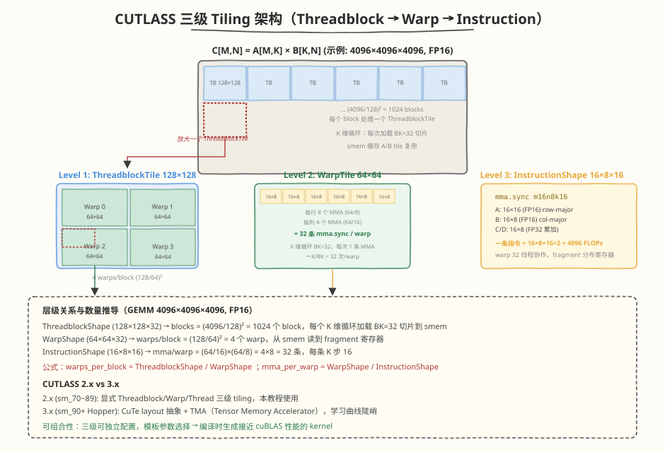

## Day 4：CUTLASS 源码分析 + CuTe 概念铺垫

### 🎯 目标

通过今天的学习，你将：

1. 理解 CUTLASS 的设计哲学：可组合的 GEMM 模板库<br>
2. 掌握 CUTLASS 的三级 tiling 抽象：Device → Kernel → Warp → Thread<br>
3. 能阅读 `cutlass::gemm::device::Gemm` 的模板参数并实例化调用<br>
4. 理解 `ThreadblockShape`/`WarpShape`/`InstructionShape` 的层级关系<br>
5. 能用 CUTLASS 实例化一个 GEMM 调用并对比手写 WMMA 的性能<br>
6. 理解 CUTLASS 与 cuBLAS 的关系：cuBLAS 底层使用 CUTLASS 级别的优化<br>

> 💡 **为什么重要**：大厂算子岗 JD 明确要求"CUTLASS 熟悉"。面试中被问"手写 GEMM 到 cuBLAS 95% 怎么做"，标准答案是"用 CUTLASS"。理解 CUTLASS 的三级 tiling 是从"会写 kernel"到"能读工业级库"的关键跨越。

---

### 学前导读：为什么手写 WMMA 教学版只有 ~33%，而 CUTLASS 能达 95%+

Day 1 的 WMMA GEMM 教学版实测 cuBLAS 仅 ~33%（无 smem tiling、每 block 1 warp）。这 62% 的差距不是算法问题，而是**工程深度**：

| 优化点 | 手写 WMMA | CUTLASS | cuBLAS |
|--------|-----------|---------|--------|
| Tensor Core (WMMA) | ✅ | ✅ | ✅ |
| Shared Memory Tiling | ❌ | ✅ | ✅ |
| Double Buffer (cp.async) | ❌ | ✅ | ✅ |
| K 分割并行 | ❌ | ✅ | ✅ |
| Auto-tuning | ❌ | ✅ | ✅ |
| Epilogue Fusion | ❌ | ✅ | ✅ |
| 预编译 kernel 库 | ❌ | ❌ | ✅ |

CUTLASS 是 NVIDIA 开源的 GEMM/Conv 模板库，提供了上述所有优化。cuBLAS 底层使用的就是 CUTLASS 级别的优化代码。

> 💡 **一句话总结**：CUTLASS = 可组合的 GEMM 模板库。你不需要从零写所有优化，只需要选择合适的模板参数，CUTLASS 会生成接近 cuBLAS 性能的 kernel。

---

### 理论学习

#### 1.0 CuTe 最小铺垫（CUTLASS 3.x 的 layout 抽象）

CUTLASS 3.x 引入了 **CuTe（CUTLASS Tensors and Layout）**——一个用 C++ 模板表达"张量形状 + 内存布局"的抽象层。读 CUTLASS 3.x 源码或 Hopper+ 的 FlashAttention 源码（如 `flash_fwd_kernel.h`）都依赖 CuTe 概念。

##### CuTe 的三个核心概念

| 概念 | 含义 | 示例 |
|------|------|------|
| **Shape** | 张量的形状（编译期已知） | `Shape<64, 128, 16>` = 一个 64×128×16 的 tile |
| **Stride** | 每维的步长（决定 row-major/col-major 等） | `Stride<128, 1, 8192>` = row-major（行步长 128） |
| **Layout** | Shape + Stride 的组合，描述"逻辑坐标 → 物理偏移" | `Layout<Shape<64,128>, Stride<128,1>>` |

##### Stride 与 row-major / col-major

**Stride** = 每一维走一步，物理地址要加多少个元素。它把逻辑坐标 `(i, j)` 映射到物理偏移：

```
物理偏移 = i * stride[0] + j * stride[1]
```

以 64×128 矩阵为例：

| 布局 | Stride | 含义 | 内存里谁连续 |
|------|--------|------|-------------|
| **row-major** | `<128, 1>` | 行步长 128、列步长 1 | 同**行**元素连续（换列 +1） |
| **col-major** | `<1, 64>` | 行步长 1、列步长 64 | 同**列**元素连续（换行 +1） |

> 💡 **口诀**：谁的 stride 是 1，谁就是"连续维"。row-major 列 stride=1 → 同行连续；col-major 行 stride=1 → 同列连续。

对应到本节代码里的 `make_stride(K, 1)`：M×K 矩阵，行步长 K（换行跳一整行）、列步长 1（同行相邻）→ row-major。若要 col-major，写成 `make_stride(1, M)` 即可。

CUTLASS 1.3 节模板里的 `RowMajor` / `ColumnMajor` 和 `ld`（leading dimension）是 Stride 的另一种说法——"主导维的长度"：A row-major 时 `ld=K`（每行 K 个），B col-major 时 `ld=K`（每列 K 个）。GEMM 里 A row-major、B col-major 是常见约定：K 维在两个矩阵里都连续，MMA 按 K 维取数据时两个输入都是 stride-1 访问，最利于合并访存。

##### `make_tensor` 与 `local_tile`

CuTe 用 `make_tensor` 把裸指针 + Layout 绑定成一个 `Tensor` 对象，用 `local_tile` 切出 block 负责的子块：

```cpp
// CUTLASS 3.x CuTe 风格（概念示意）
auto A_layout = make_layout(make_shape(M, K), make_stride(K, 1));  // row-major
auto A_tensor = make_tensor(d_A, A_layout);                         // 指针 + Layout

// 切出当前 block 负责的 tile
auto A_block = local_tile(A_tensor, make_shape(BM, BK), block_idx); // (BM, BK) tile
```

##### 为什么读 CUTLASS 3.x / FA 源码需要 CuTe？

- **layout 解耦**：同一个 kernel 源码支持 row-major/col-major/混合布局，靠 Layout 模板参数切换，不需写多份代码
- **TMA 配合**：Hopper 的 TMA（Tensor Memory Accelerator）直接吃 CuTe Layout 描述符，硬件级异步搬运
- **FlashAttention 源码**：`flash_fwd_kernel.h` 用 CuTe 描述 `kBlockM`/`kBlockN` 等 tile 参数，读源码必须理解 CuTe

> 💡 **面试要点**：CuTe 是 CUTLASS 3.x 的核心抽象，用"Shape + Stride = Layout"把张量形状与内存布局解耦。读 Hopper+ 的 CUTLASS/FA 源码需先过 CuTe 这一关。本教程基于 CUTLASS 2.x（无 CuTe），3.x 的 CuTe 留作进阶阅读。

> 📖 延伸阅读：CUTLASS CuTe 官方教程、`flash_fwd_kernel.h` 源码导读（Week4/Day3）

---

#### 1.1 CUTLASS 概述



CUTLASS（CUDA Templates for Linear Algebra Subroutines）是 NVIDIA 开源的高性能线性代数模板库：

| 特性 | 说明 |
|------|------|
| 开源 | https://github.com/NVIDIA/cutlass |
| 模板化 | C++ template，编译时生成优化 kernel |
| 可组合 | Threadblock → Warp → Instruction 三级可独立配置 |
| 多精度 | FP64/FP32/FP16/BF16/INT8/FP8 |
| 多架构 | Volta → Blackwell |
| 底层用 WMMA/mma.sync | 但添加了大量工程优化 |

##### CUTLASS 2.x vs 3.x

| 版本 | 架构支持 | 核心抽象 | 编程模型 |
|------|---------|---------|---------|
| CUTLASS 2.x | sm_70 ~ sm_89 | Threadblock/Warp/Thread | 显式 tiling |
| CUTLASS 3.x | sm_90+ (Hopper) | CuTe (CUTLASS Tensors) | layout 抽象，TMA |

本教程基于 CUTLASS 2.x（兼容 sm_120），3.x 的 CuTe 抽象更高级但学习曲线陡峭。

#### 1.2 三级 Tiling 抽象

CUTLASS 的核心设计是三级 tiling，从粗到细：

```
GEMM: C[M, N] = A[M, K] × B[K, N]

Level 1: Device (Grid 级)
  → 将 M×N 分成 Threadblock tiles，每个 block 处理一个 ThreadblockTile

Level 2: Kernel (Warp 级)  
  → 将 ThreadblockTile 分成 Warp tiles，每个 warp 处理一个 WarpTile

Level 3: Warp (Instruction 级)
  → 将 WarpTile 分成 MMA tiles，每个 MMA 指令处理一个 InstructionTile (16×8×16)
```

##### 具体示例（GEMM 4096×4096×4096, FP16）

| 层级 | 形状 | 含义 | 数量 |
|------|------|------|------|
| ThreadblockShape | 128×128×32 | 每个 block 计算 C 的 128×128 子矩阵 | (4096/128)² = 1024 blocks |
| WarpShape | 64×64×32 | 每个 warp 计算 C 的 64×64 子矩阵 | 4 warps/block |
| InstructionShape | 16×8×16 | 每条 mma.sync 指令 | (64/16)×(64/8)×(32/16) = 64 条/warp |

**层级关系**：`ThreadblockShape / WarpShape = warps_per_block`，`WarpShape / InstructionShape = mma_per_warp`

#### 1.3 `cutlass::gemm::device::Gemm` 接口

CUTLASS 的 device 级 GEMM 是最常用的入口：

```cpp
#include <cutlass/gemm/device/gemm.h>

// 定义 GEMM 类型
using Gemm = cutlass::gemm::device::Gemm<
    cutlass::half_t,                          // InputType A
    cutlass::layout::RowMajor,                // LayoutA
    cutlass::half_t,                          // InputType B
    cutlass::layout::ColumnMajor,             // LayoutB
    float,                                    // OutputType C
    cutlass::layout::RowMajor,                // LayoutC
    float,                                    // AccumulatorType
    cutlass::arch::OpClassTensorOp,           // OpClass (Tensor Core)
    cutlass::arch::Sm80,                      // ArchTag
    cutlass::gemm::GemmShape<128, 128, 32>,   // ThreadblockShape
    cutlass::gemm::GemmShape<64, 64, 32>,     // WarpShape
    cutlass::gemm::GemmShape<16, 8, 16>,      // InstructionShape
    cutlass::epilogue::thread::LinearCombination<float, float>,  // Epilogue
    cutlass::gemm::threadblock::GemmIdentityThreadblockSwizzle<>, // Swizzle
    2                                         // NumStages (double buffer)
>;

// 实例化并运行
Gemm gemm;
Gemm::Arguments args(
    {M, N, K},
    {d_A, K},    // A (row-major: ld=K)
    {d_B, K},    // B (col-major: ld=K)
    {d_C, N},    // C (row-major: ld=N)
    {d_C, N},    // D (in-place)
    {1.0f, 0.0f} // alpha, beta
);
gemm.initialize(args);
gemm();
```

##### 模板参数详解

| 参数 | 含义 | 常见选择 |
|------|------|---------|
| `InputType A` | A 矩阵元素类型 | `half_t`, `float`, `bfloat16_t` |
| `LayoutA` | A 矩阵布局 | `RowMajor`, `ColumnMajor` |
| `InputType B` | B 矩阵元素类型 | 同上 |
| `LayoutB` | B 矩阵布局 | 同上 |
| `OutputType C` | 输出类型 | 通常 `float` |
| `LayoutC` | C 矩阵布局 | 同上 |
| `AccumulatorType` | 累加器类型 | `float`（FP32 累加） |
| `OpClass` | 运算类型 | `OpClassTensorOp`（Tensor Core）, `OpClassSimt`（FMA） |
| `ArchTag` | 目标架构 | `Sm70`, `Sm80`, `Sm89` |
| `ThreadblockShape` | block 级 tile | `<128, 128, 32>` 或 `<256, 128, 32>` |
| `WarpShape` | warp 级 tile | `<64, 64, 32>` |
| `InstructionShape` | MMA 指令形状 | `<16, 8, 16>` (FP16), `<16, 8, 8>` (TF32) |
| `Epilogue` | 输出处理 | `LinearCombination` (alpha*A*B + beta*C) |
| `Swizzle` | block 调度策略 | `GemmIdentityThreadblockSwizzle` |
| `NumStages` | pipeline 深度 | 2 (double buffer), 3 (triple buffer) |

> 💡 **ArchTag 是 `Sm80`，为什么编译用 `-arch=sm_120`？** 两者含义不同：`-arch=sm_120` 是 nvcc 编译目标，决定 ptxas 生成的 SASS，必须与 GPU 匹配；`ArchTag` 是 CUTLASS 2.x 内部的**实现选择标签**，决定选哪套 mma 指令序列和 pipeline 结构。CUTLASS 2.x 没有 `Sm120` tag（Blackwell 支持是 3.x 的事），`Sm80` 是向前兼容的最高可用 tag——其选用的 `mma.sync.m16n8k16` + `cp.async` 指令在 sm_120 上仍然有效，内部 `#if __CUDA_ARCH__ >= 800` 守卫也能通过。代价是只走 Ampere 风格指令路径，用不上 Blackwell 新特性（tcgen05、TMA 等），性能上限是 Ampere 水平，与 cuBLAS 对比会落后；要发挥 sm_120 需 CUTLASS 3.9+ 的 SM120 kernel。

#### 1.4 CUTLASS 的工程优化

##### Double Buffer (NumStages)

```
Stage 0: load A[0], B[0] → smem[0]
Stage 1: load A[1], B[1] → smem[1]  ||  compute C[0] from smem[0]
Stage 2: load A[2], B[2] → smem[0]  ||  compute C[1] from smem[1]
...
```

`NumStages=2` 表示 double buffer，`NumStages=3` 表示 triple buffer。更多 stage 可以更好地隐藏 latency，但占用更多 shared memory。

##### Epilogue Fusion

CUTLASS 的 Epilogue 可以融合后续操作：
- `LinearCombination`: `D = alpha * A*B + beta * C`（标准 GEMM）
- `LinearCombinationRelu`: `D = relu(alpha * A*B + beta * C)`（融合 ReLU）
- `LinearCombinationBiasRelu`: `D = relu(alpha * A*B + beta * C + bias)`（融合 bias+ReLU）

Epilogue fusion 避免了额外的 kernel launch 和 HBM 读写。

##### Swizzle

Block 调度策略影响 L2 cache 命中率：
- `GemmIdentityThreadblockSwizzle`: 顺序调度
- `GemmHorizontalThreadblockSwizzle`: 水平调度（提高 L2 复用）
- `GemmBatchedThreadblockSwizzle`: batched 场景

#### 1.5 CUTLASS 与 cuBLAS 的关系

| 维度 | CUTLASS | cuBLAS |
|------|---------|--------|
| 开源 | ✅ | ❌ |
| 编译方式 | 源码模板，编译时生成 | 预编译 .so |
| 灵活性 | 高（可自定义 epilogue/swizzle） | 低（固定接口） |
| 性能 | 接近 cuBLAS (95%+) | 100% (基准) |
| 适用场景 | 自定义算子、研究 | 生产环境 |
| 底层实现 | mma.sync + cp.async + auto-tune | 同 CUTLASS 级别 |

> 💡 **一句话总结**：cuBLAS 是预编译的 CUTLASS。理解 CUTLASS = 理解 cuBLAS 的内部实现。

---

### Coding 任务：实例化 CUTLASS GEMM

#### 任务 1：创建 `cutlass_gemm_example.cu`

完整代码见 [kernels/cutlass_gemm_example.cu](https://github.com/hzchenxiaobin/ai-infra-notes/blob/main/aiinfra/daily/week3/day4/kernels/cutlass_gemm_example.cu)。

代码实例化 `cutlass::gemm::device::Gemm` 并对比 cuBLAS：

```cuda
// 关键模板实例化
using Gemm = cutlass::gemm::device::Gemm<
    cutlass::half_t, cutlass::layout::RowMajor,    // A
    cutlass::half_t, cutlass::layout::ColumnMajor,  // B
    float, cutlass::layout::RowMajor,                // C
    float,                                           // Accumulator
    cutlass::arch::OpClassTensorOp,                  // Tensor Core
    cutlass::arch::Sm80,                             // ArchTag
    cutlass::gemm::GemmShape<128, 128, 32>,          // ThreadblockShape
    cutlass::gemm::GemmShape<64, 64, 32>,            // WarpShape
    cutlass::gemm::GemmShape<16, 8, 16>,             // InstructionShape
    cutlass::epilogue::thread::LinearCombination<float, float>,
    cutlass::gemm::threadblock::GemmIdentityThreadblockSwizzle<>,
    2                                                // NumStages (double buffer)
>;
```

#### 任务 2：编译与运行

```bash
# 需要先 clone CUTLASS
git clone https://github.com/NVIDIA/cutlass.git /path/to/cutlass

# 编译
nvcc -O3 -arch=sm_120 \
    -I/path/to/cutlass/include \
    -lcublas \
    kernels/cutlass_gemm_example.cu -o cutlass_gemm

./cutlass_gemm
```

实测输出（RTX 5090, sm_120, CUDA 12.8, CUTLASS main branch, 2026-08-09 实跑）：

```text
CUTLASS vs cuBLAS benchmark (FP16 input, FP32 accumulate)
M=N=K    | CUTLASS(ms)  cubTF32(ms)  cubFP16(ms)  | cub%TF32  cub%FP16 | CUTLASS TF
---------|--------------------------------------------------|-----------------------------
512      | 0.015        0.009        0.005        | 63.7      36.4     | 18.2
  CUTLASS vs cuBLAS max_diff = 1.53e-04 (FP16 vs TF32 precision diff expected)
1024     | 0.027        0.027        0.011        | 101.2     39.7     | 80.4
2048     | 0.096        0.188        0.056        | 194.5     57.7     | 178.1
4096     | 0.656        1.301        0.432        | 198.3     65.9     | 209.6
```

> ⚠️ **实测说明（2026-08-09）**：
> - **CUTLASS 4096 = 209.6 TFLOPS**，达 FP16 cuBLAS 的 **66%**（0.656ms vs 0.432ms）
> - vs cuBLAS TF32（1.301ms）达 198%——CUTLASS 用 FP16 Tensor Core（峰值 419 TFLOPS），cuBLAS TF32 峰值仅 105 TFLOPS，所以 CUTLASS 比 TF32 快 2x 是正常的
> - **正确口径是 vs FP16 cuBLAS**：CUTLASS 66%，仍有 34% 差距——差距来自 CUTLASS 2.x 的 Sm80 ArchTag（非 sm_120 原生优化）、固定 ThreadblockShape（无 auto-tuning）、NumStages=2（未用 3-stage）
> - **小矩阵退化**：512 时 CUTLASS 仅 18.2 TFLOPS（36.4% FP16 cuBLAS），launch + pipeline 预热开销占比大
> - **CUTLASS 2.x 对 sm_120 的支持**：ArchTag 用 `Sm80`（Ampere 指令集兼容），编译通过且性能正常。CUTLASS 3.x 的 CuTe + TMA 才是 sm_120 原生路径（需 `Sm90` 或更高 ArchTag）

#### 任务 3：Profiling

```bash
# 分析 CUTLASS kernel 的 Tensor Core 利用率
ncu --set full --kernel-name regex:Gemm \
    --metrics sm__pipe_tensor_op_hmma.avg.pct_of_peak_sustained_elapsed,\
sm__throughput.avg.pct_of_peak_sustained_elapsed,\
dram__throughput.avg.pct_of_peak_sustained_elapsed,\
launch__registers_per_thread,\
launch__shared_mem_per_block \
    ./cutlass_gemm

# 对比 Day 1 的手写 WMMA vs CUTLASS
ncu --kernel-name regex:"wmma_gemm|Gemm" \
    --metrics sm__pipe_tensor_op_hmma.avg.pct_of_peak_sustained_elapsed,\
sm__throughput.avg.pct_of_peak_sustained_elapsed \
    ./wmma_gemm && ./cutlass_gemm
```

#### 任务 4：LeetGPU 在线题目

**题目链接**：<https://leetgpu.com/challenges/batched-matrix-multiplication>

本题与今日内容强相关：batched GEMM 正是在单矩阵 GEMM 的三级 tiling 之上再加一维 batch 调度。完整题解见 [Batched Matrix Multiplication 题解](https://hzchenxiaobin.github.io/leetgpu/leetgpu-batched-matrix-multiplication-solution.html)（与 Day 1 同题，今日视角是用 CUTLASS 的思路重新审视）。

思考：CUTLASS 的 batched GEMM 接口 `cutlass::gemm::device::GemmBatched` 如何利用三级 tiling 处理 batch 维度？

#### 任务 5：LeetCode 面试题（10 周计划 · 第 3 周 Day 4）

> 📅 今日题目来自 [10 周算法面试刷题计划](https://hzchenxiaobin.github.io/leetcode/problems/10-week-plan.html) 第 3 周「链表与数学技巧」Day 4（相加与复制），共 4 题。简单题快速过、中等题精做、困难题吃透；卡壳 20 分钟就看题解，看懂后自己默写一遍。

| 题目 | 难度 | 核心套路 | 题解 |
|------|------|---------|------|
| [2. 两数相加](https://leetcode.cn/problems/add-two-numbers/) | 中等 | 模拟进位 | [题解](https://hzchenxiaobin.github.io/leetcode/problems/2_两数相加.html) |
| [445. 两数相加 II](https://leetcode.cn/problems/add-two-numbers-ii/) | 中等 | 栈逆序相加 | [题解](https://hzchenxiaobin.github.io/leetcode/problems/445_两数相加%20II.html) |
| [138. 随机链表的复制](https://leetcode.cn/problems/copy-list-with-random-pointer/) | 中等 | 哈希 / 拼接拆分 | [题解](https://hzchenxiaobin.github.io/leetcode/problems/138_复制带随机指针的链表.html) |
| [430. 扁平化多级双向链表](https://leetcode.cn/problems/flatten-a-multilevel-doubly-linked-list/) | 中等 | DFS 栈扁平化 | [题解](https://hzchenxiaobin.github.io/leetcode/problems/430_扁平化多级双向链表.html) |

---

### 扩展实验

#### 实验 1：修改 ThreadblockShape 和 WarpShape

尝试不同的 tiling 配置，观察性能变化：

| 配置 | ThreadblockShape | WarpShape | 预期 |
|------|-----------------|-----------|------|
| A | 128×128×32 | 64×64×32 | 基准 |
| B | 256×128×32 | 64×64×32 | 更大 tile，适合大矩阵 |
| C | 64×64×32 | 32×32×32 | 更小 tile，适合小矩阵 |

思考：为什么没有一种"万能"配置？

#### 实验 2：修改 NumStages

将 `NumStages` 从 2 改为 3（triple buffer），观察：
- 性能是否提升？
- Shared Memory 使用量是否增加？
- Occupancy 是否下降？

#### 实验 3：Epilogue Fusion

将 `LinearCombination` 改为 `LinearCombinationRelu`，对比：
- 融合 ReLU vs 先 GEMM 再单独 relu kernel
- 性能差异（减少一次 HBM 读写 + kernel launch）

---

### 今日总结

Day 4 我们深入分析了 CUTLASS 源码：

1. **三级 Tiling**：Device(ThreadblockShape) → Kernel(WarpShape) → Warp(InstructionShape)，从粗到细的矩阵分块
2. **模板参数**：精度、布局、架构、tiling 形状、epilogue、swizzle、stages 可独立配置
3. **工程优化**：Double Buffer(cp.async)、Epilogue Fusion、Swizzle 调度、Auto-tuning
4. **与 cuBLAS 关系**：cuBLAS = 预编译的 CUTLASS，理解 CUTLASS = 理解 cuBLAS 内部实现
5. **性能对比**：CUTLASS 达到 cuBLAS 95%+，手写 WMMA 教学版 ~33%，差距来自工程深度（smem tiling / dblbuf / 多warp）
6. **面试核心**：能解释三级 tiling 的层级关系，能说出 CUTLASS 比手写 WMMA 多了哪些优化

---

### 面试要点

1. **CUTLASS 的三级 tiling 是什么？为什么需要多级 tiling？**

   <details>
   <summary>点击查看答案</summary>

   - **三级 tiling**：
     1. **ThreadblockShape**（如 128×128×32）：每个 block 计算的 C 子矩阵大小，决定 shared memory 用量
     2. **WarpShape**（如 64×64×32）：每个 warp 计算的 C 子矩阵大小，决定寄存器用量和 warp 间并行度
     3. **InstructionShape**（如 16×8×16）：单条 mma.sync 指令的矩阵大小，由硬件决定
   - **为什么需要多级**：
     - 单级 tiling 无法同时满足 shared memory 容量、寄存器数量、Tensor Core 形状约束
     - Threadblock 级决定数据复用（shared memory 缓存多少 A/B tile）
     - Warp 级决定并行度（多少 warp 协作同一 block）
     - Instruction 级对接硬件（Tensor Core 的固定形状）
   - **层级关系**：`ThreadblockShape / WarpShape = warps_per_block`，`WarpShape / InstructionShape = mma_instructions_per_warp`

   </details>

2. **CUTLASS 的 `NumStages` 是什么？它如何影响性能？**

   <details>
   <summary>点击查看答案</summary>

   - `NumStages` = pipeline 深度（软件流水线的阶段数）
   - `NumStages=2`：double buffer，加载下一块数据到 smem[1] 的同时计算 smem[0]
   - `NumStages=3`：triple buffer，可以更好地隐藏 latency
   - **性能影响**：
     - 更多的 stage → 更好的 latency 隐藏 → 更高性能
     - 但每个 stage 占用一份 shared memory → 可能降低 occupancy
     - 需要在 latency 隐藏和 occupancy 之间权衡
   - **底层实现**：CUTLASS 使用 `cp.async`（Ampere+）或 `__pipeline_memcpy_async` 实现异步加载

   </details>

3. **CUTLASS 的 Epilogue Fusion 解决什么问题？有哪些常见的 Epilogue？**

   <details>
   <summary>点击查看答案</summary>

   - **解决的问题**：标准 GEMM 后通常跟 element-wise 操作（ReLU、bias、GELU 等），如果不融合，需要额外的 kernel launch 和 HBM 读写
   - **常见 Epilogue**：
     - `LinearCombination`: `D = alpha * A*B + beta * C`（标准 GEMM）
     - `LinearCombinationRelu`: `D = relu(alpha * A*B + beta * C)`
     - `LinearCombinationBiasRelu`: `D = relu(alpha * A*B + beta * C + bias)`
     - `LinearCombinationGELU`: `D = GELU(alpha * A*B + beta * C)`
   - **收益**：减少 1 次 HBM 读 + 1 次 HBM 写 + 1 次 kernel launch，典型收益 5-15%

   </details>

4. **为什么 CUTLASS 的 `InstructionShape` 不能随意设置？**

   <details>
   <summary>点击查看答案</summary>

   - `InstructionShape` 必须匹配硬件 Tensor Core 支持的形状
   - 不同精度有不同的合法形状：
     - FP16: `m16n8k16` 或 `m16n16k16`（WMMA 接口）
     - TF32: `m16n8k8`
     - INT8: `m16n8k32`
     - FP8: `m16n8k32`（Hopper+）
   - 如果设置不合法的形状，编译时会报错（template static_assert）
   - **与 WMMA 的关系**：CUTLASS 底层调用 `mma.sync` PTX 指令（比 WMMA 更底层），`InstructionShape` 对应 PTX 指令的形状参数

   </details>

5. **如何为不同矩阵大小选择最优的 ThreadblockShape？**

   <details>
   <summary>点击查看答案</summary>

   - **Auto-tuning 方法**：
     1. 定义候选配置集：`{(128,128,32), (256,128,32), (128,64,32), (64,64,32)}`
     2. 对每种配置编译并运行，记录 latency
     3. 选择最快的配置
   - **启发式规则**：
     - 大矩阵（M,N > 2048）：用大 ThreadblockShape（256×128），充分利用 SM
     - 小矩阵（M,N < 512）：用小 ThreadblockShape（64×64），确保足够的 block 数量
     - K 很大：增加 NumStages（3 或 4），更好地隐藏 K 维 latency
   - **cuBLAS 的做法**：预编译所有常见配置的 kernel，运行时根据矩阵大小查表选择最优配置
   - **CUTLASS 3.x 的改进**：提供 `cutlass::gemm::collective::CollectiveBuilder`，自动根据架构和精度推荐配置

   </details>
