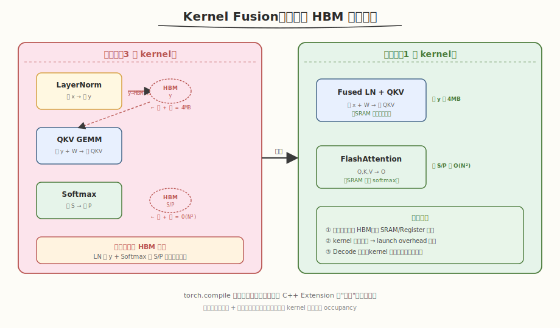

## Day 6：端到端 Profiling 与 Kernel Fusion

### 🎯 目标

通过今天的学习，你将：

1. 掌握 **两级 Profiling 工具体系**：用 Nsight Systems（nsys）采集系统级时间线、用 Nsight Compute（ncu）分析 kernel 级指标，理解"先全局定位、再单点深挖"的标准流程
2. 学会用 nsys 的 `cuda_gpu_kern_sum` 统计找出 Transformer forward 的 top3 耗时算子，并从时间线识别 kernel 间隙（launch overhead）
3. 能用 ncu 的 `sm__throughput` / `dram__throughput` 指标判定算子是 **compute-bound 还是 memory-bound**，并用 Warp Stall Reasons 定位具体阻塞原因
4. 理解 **Kernel Fusion** 的收益来源（省 HBM 中间读写），能列出 Transformer 中至少 3 个 fusion 候选并估算 IO 收益
5. 用 `torch.compile` 验证自动融合对 kernel 数量和 latency 的影响，理解自定义 C++ Extension 算子为何无法被融合

> 💡 **为什么重要**：Day 1-19 我们分别手写了 Softmax/LayerNorm/Attention、接入 Mini Engine。但"算子各自正确"不等于"系统跑得快"——真实优化必须先**定位瓶颈**再动手。今天就是把"会写 kernel"升级为"会用工具诊断系统"的关键一天，五步 Profiling 法是所有 GPU 性能优化的标准工作流。Day 7 会把今天的结论整理成算子分类表。

---

### 学前导读：从"单算子正确"到"系统级瓶颈定位"

Day 5 的 Mini Engine 跑通了：自定义 Softmax/LayerNorm + cuBLAS GEMM，端到端误差 < 1e-4。但你可能注意到一个尴尬的现象——**自定义版比 PyTorch 还慢一点（0.8x ~ 0.95x）**。问题来了：慢在哪里？是 Softmax 拖后腿，还是 GEMM 没跑满，还是 kernel 之间的空隙太大？

回答这个问题，靠"猜"是不行的。Day 1 我们用过 `torch.profiler` 看算子时间表，但它只告诉你"哪个算子慢"，不告诉你"为什么慢"——是算力不够，还是带宽喂不饱？要回答"为什么"，需要更底层的工具：

| 问题层级 | 工具 | 能回答的问题 |
|---------|------|------------|
| 哪个算子最慢？ | torch.profiler / nsys | top3 耗时算子、kernel 间隙 |
| 这个算子为什么慢？ | ncu | SM/DRAM 占用、Stall 原因 |
| 怎么优化？ | Roofline + Fusion 分析 | memory-bound → 融合；compute-bound → Tensor Core |

**今天的核心方法论**：**nsys 先看全局（找 top3）→ ncu 再看单点（判 bound 类型）→ Roofline 定方向 → Fusion 出方案**。这是一套"从宏观到微观"的诊断闭环，适用于任何 GPU 程序，不只是 Transformer。

> 💡 **一句话总结**：profiling 不是"跑个工具看个数字"，而是"用数字回答问题"——先问"哪里慢"，再问"为什么慢"，最后问"怎么让它不慢"。

---

### 理论学习

#### 20.1 两级 Profiling 工具体系：nsys + ncu


GPU 性能诊断有且只有两个核心工具（NVIDIA 体系），分工明确：

| 工具 | 层级 | 看什么 | 类比 |
|------|------|--------|------|
| **Nsight Systems（nsys）** | 系统级 | 完整时间线、kernel 排列、CPU/GPU 交互、多 stream | "全景地图" |
| **Nsight Compute（ncu）** | kernel 级 | 单个 kernel 的 SM/DRAM 占用、Stall 原因、寄存器/shared 用量 | "放大镜" |

##### nsys：系统级全景

nsys 采集一次完整的程序运行，输出时间线（`.nsys-rep`，可用 GUI 打开，也可命令行导出统计）：

```bash
# 采集 Mini Engine 时间线
nsys profile -o mini_engine_timeline --trace=cuda,nvtx python profile_mini_engine.py

# 命令行导出 kernel 统计（按 GPU 时间降序）
nsys stats -t cuda_gpu_kern_sum mini_engine_timeline.nsys-rep
```

`cuda_gpu_kern_sum` 输出形如：

```text
Time(%) Total Time Instances Avg Module Kernel
-------- ----------- --------- -------- --------- ------
 45.2 1.234 ms 20 61.7 us libcublas ...gemm...
 12.1 0.331 ms 10 33.1 us my_ops layernorm_kernel
 8.5 0.232 ms 5 46.4 us my_ops softmax_kernel
 ...
```

**三个观察重点**：
1. **top3 算子**：按 `Time(%)` 排序，前三个就是优化目标
2. **kernel 间隙（gap）**：在 GUI 时间线上看相邻 kernel 之间的空白 = launch overhead（CPU 调度延迟）
3. **调用次数**：`# Calls` 异常多说明 launch overhead 累积，Decode 阶段尤其明显

##### ncu：kernel 级放大镜

ncu 对单个 kernel 做深度分析，关键是**对比 SM Throughput 和 DRAM Throughput**判断 bound 类型：

```bash
# 分析自定义 Softmax / GEMM 的 bound 类型
ncu --metrics \
 sm__throughput.avg.pct_of_peak_sustained_elapsed,\
 dram__throughput.avg.pct_of_peak_sustained_elapsed,\
 smsp__average_warps_issue_stalled_long_scoreboard.pct,\
 gpu__time_duration.sum \
 --kernel-name regex:"softmax_kernel|gemm_kernel" ./profiling_targets
```

> ⚠️ **注意**：ncu 会让 kernel 执行慢 10-100x（它要反复 replay 采集指标）。**永远不要在 ncu 下测 latency**，latency 用 nsys 或 cudaEvent 测。ncu 只看"占比"和"Stall 原因"。

#### 20.2 瓶颈判定：Roofline 与 SM/DRAM Throughput

判定一个 kernel 是 compute-bound 还是 memory-bound，有**理论**和**实测**两条路径，互相印证：

##### 理论路径：Arithmetic Intensity vs Ridge Point

```
Arithmetic Intensity (AI) = FLOPs / Bytes（每读 1 字节做多少次运算）
Ridge Point = Peak FLOP/s / Peak Bandwidth

RTX 5090 FP32: 19.5 TFLOP/s / 1.55 TB/s ≈ 12.6 FLOP/Byte
```

- AI < 12.6 → **memory-bound**（数据喂不饱计算单元）
- AI > 12.6 → **compute-bound**（算力是瓶颈）

以 Softmax 为例（N=1024, d=1024, FP32）：
- FLOPs ≈ 3·N²（每元素 exp+add+div）
- Bytes = 2·N²·4（读 S + 写 P）
- AI = 3N² / (8N²) = **0.375 FLOP/Byte** → 远低于 12.6 → **memory-bound** ✓

##### 实测路径：SM% vs DRAM%

| ncu 指标 | 含义 |
|---------|------|
| `sm__throughput.avg.pct_of_peak_sustained_elapsed` | SM 计算单元占用率（%） |
| `dram__throughput.avg.pct_of_peak_sustained_elapsed` | HBM 带宽占用率（%） |

判定规则：

| 观察 | 结论 | 优化方向 |
|------|------|---------|
| DRAM% >> SM% | **memory-bound** | Kernel Fusion、向量化加载、减少 HBM 读写 |
| SM% >> DRAM% | **compute-bound** | Tensor Core、增加 ILP、auto-tuning |
| 两者都低（< 30%） | **latency-bound** | 减少 `__syncthreads`、增加并行度、消除 Stall |

##### Warp Stall Reasons：精确定位"为什么慢"

ncu 的 `smsp__average_warps_issue_stalled_*` 系列指标告诉你 warp 卡在哪：

| Stall 原因 | 含义 | 典型场景 |
|-----------|------|---------|
| **Long Scoreboard** | 等 HBM 加载 | memory-bound kernel 的主因（Softmax/LayerNorm） |
| **Math Pipe Throttle** | 计算单元饱和 | compute-bound kernel（大 GEMM） |
| **Barrier** | 等 `__syncthreads` | reduce kernel 同步开销 |
| **Short Scoreboard** | 等 shared memory | bank conflict 或 shared 访问密集 |

**Softmax 的 Long Scoreboard 会很高**——三遍扫描每遍都从 HBM 读数据，warp 大部分时间在等内存。这正是 memory-bound 的微观表现。

#### 20.3 Kernel Fusion 机会识别



找到 memory-bound 算子后，最重要的优化手段是 **Kernel Fusion**：把多个相邻算子合并成一个 kernel，避免中间结果写回 HBM。

##### Transformer 中的 Fusion 候选

| Fusion 候选 | 当前开销 | 融合后收益 | 实现难度 |
|------------|---------|-----------|---------|
| **LayerNorm + QKV GEMM** | LN 写 (B,N,d) 到 HBM，GEMM 再读 | 省去 (B,N,d) 一次读写 | 高（需融合 LN+GEMM） |
| **Softmax + Dropout** | Softmax 写 P，Dropout 读 P 再写 | 省去 P 一次 O(N²) 读写 | 低（element-wise 融合） |
| **GEMM + Bias + GELU** | GEMM 写结果，加 bias，过 GELU | 省去中间结果 | 中（epilogue fusion） |
| **Residual Add + LayerNorm** | Add 写结果，LN 读结果 | 省去一次读写 | 中 |

##### Fusion 收益估算（LayerNorm + QKV GEMM）

以 B=1, N=1024, d=512, FP32 为例：

```
未融合：
 LayerNorm: 读 x(2MB) + 写 y(2MB) = 4MB HBM IO
 QKV GEMM: 读 y(2MB) + 读 W(3MB) + 写 QKV(6MB) = 11MB HBM IO
 合计: 15MB

融合后：
 Fused LN+GEMM: 读 x(2MB) + 读 W(3MB) + 写 QKV(6MB) = 11MB
 节省: 4MB（LayerNorm 中间结果 y 的读写被消除）
```

##### torch.compile 的自动融合

PyTorch 2.0 的 `torch.compile` 会自动做这些 fusion：

```python
compiled_model = torch.compile(model, mode="reduce-overhead")
# nsys 对比：compiled 版 kernel 数量减少 30-50%
```

> ⚠️ **注意**：`torch.compile` 的 fusion 作用于 PyTorch 原生 ATen 算子。**自定义 C++ Extension 算子对 Inductor 是"黑盒"**，无法被融合（除非注册为 custom op + 提供 fake tensor）。这是 Day 5 自定义算子的一大代价——也是为什么"能不自定义就不自定义，先用 torch.compile"。

##### Fusion 的限制

1. **只有相邻 + 数据依赖**的算子能融合（A→B→C 可融，A→B 和 A→C 不行）
2. **融合 kernel 增加 register/shared memory 压力**，可能降低 occupancy
3. **复杂融合**需要 CUTLASS（epilogue fusion）或 Triton（`torch.compile` 后端）

### Coding 任务：端到端 Profiling Mini Engine

#### 任务 1：创建 `kernels/profiling_targets.cu`

ncu 分析 PyTorch 模型时，kernel 名字会被 mangle、还混着 cuBLAS 的 kernel，干扰判断。所以我们先准备一个**干净的独立靶点程序**：一个 memory-bound 的 Softmax + 一个 compute-bound 的 GEMM，让 ncu 直接分析。完整文件见 [kernels/profiling_targets.cu](kernels/profiling_targets.cu)。

核心是两个对比 kernel：

```cuda
// kernels/profiling_targets.cu —— 端到端 Profiling 靶点：memory-bound Softmax + compute-bound GEMM
// 编译命令: nvcc -o profiling_targets kernels/profiling_targets.cu -O3 -arch=sm_120 -lineinfo
// 运行命令: ./profiling_targets

// [Memory-bound] Softmax：一行一个 block，三遍扫描 safe softmax（复用 Day 2）
// 预期 ncu：DRAM Throughput >> SM Throughput
__global__ void softmax_kernel(const float* __restrict__ input, float* __restrict__ output, int M, int D) {
    int row = blockIdx.x;
    if (row >= M)
        return;
    const float* in_row = input + row * D;
    float* out_row = output + row * D;
    __shared__ float smem[32];
    __shared__ float row_max, row_sum;
    int tid = threadIdx.x;
    // Step 1: 求 max（数值稳定性）
    float local_max = -INFINITY;
    for (int i = tid; i < D; i += blockDim.x)
        local_max = fmaxf(local_max, in_row[i]);
    local_max = blockReduceMax(local_max, smem);
    if (tid == 0)
        row_max = local_max;
    __syncthreads();
    // Step 2: 求 sum(exp(x - max))
    float local_sum = 0.0f;
    for (int i = tid; i < D; i += blockDim.x)
        local_sum += expf(in_row[i] - row_max);
    local_sum = blockReduceSum(local_sum, smem);
    if (tid == 0)
        row_sum = local_sum;
    __syncthreads();
    // Step 3: 归一化写出
    float inv_sum = 1.0f / row_sum;
    for (int i = tid; i < D; i += blockDim.x)
        out_row[i] = expf(in_row[i] - row_max) * inv_sum;
}

// [Compute-bound] Naive GEMM：C = A·B（故意不做 tiling，但仍体现 compute 特征）
// 预期 ncu：SM Throughput >> DRAM Throughput
__global__ void gemm_kernel(const float* __restrict__ A, const float* __restrict__ B, float* __restrict__ C, int M,
                            int N, int K) {
    int row = blockIdx.y * blockDim.y + threadIdx.y;
    int col = blockIdx.x * blockDim.x + threadIdx.x;
    if (row >= M || col >= N)
        return;
    float acc = 0.0f;
    for (int k = 0; k < K; k++)
        acc += A[row * K + k] * B[k * N + col];
    C[row * N + col] = acc;
}
```

`main()` 分别运行两个 kernel 并计时、验证，末尾打印 ncu 分析指引命令。`-lineinfo` 是给 ncu Source View 用的（保留源码行号映射）。

#### 任务 2：用 nsys 采集 Mini Engine 时间线

先运行独立的 Mini Engine profiling 脚本（[kernels/profile_mini_engine.py](kernels/profile_mini_engine.py)），它内置 `torch.profiler` 输出 Prefill/Decode 的算子时间表：

```bash
# 运行（输出 Prefill/Decode 算子表 + 导出 Chrome trace）
python kernels/profile_mini_engine.py
```

**预期输出**：

```text
===== Prefill Phase (shape=(1, 1024, 512)) =====
Name Self CUDA Calls
aten::mm xxx us 20 ← QKV/Out/FFN GEMM（compute-bound）
aten::layer_norm xxx us 10
aten::softmax xxx us 5
aten::gelu xxx us 5
...

===== Decode Phase (shape=(1, 1, 512)) =====
Name Self CUDA Calls
aten::mm xxx us 20 ← GEMM 但矩阵极小（M=1）
aten::layer_norm xxx us 10
aten::softmax xxx us 5
...

Prefill (N=1024): x.xxx ms / forward
Decode (N=1): x.xxx ms / forward
Per-token: Prefill=x.x us/token, Decode=xxx.x us/token
```

然后用 nsys 采集系统级时间线：

```bash
# nsys 采集
nsys profile -o mini_engine_timeline --trace=cuda,nvtx python kernels/profile_mini_engine.py

# 导出 kernel 统计
nsys stats -t cuda_gpu_kern_sum mini_engine_timeline.nsys-rep
```

**分析任务**：
1. 找出 Prefill 阶段 CUDA 时间 top3 算子（预期是 `mm`/`gemm` 类 GEMM）
2. 对比 Prefill vs Decode 的 per-token 时间（Prefill 远快于 Decode，因为并行度高）
3. 在 Nsight Systems GUI（或 chrome://tracing 打开 `trace_prefill.json`）观察 kernel 之间的 gap（launch overhead）

#### 任务 3：用 ncu 判定 Softmax / GEMM 的 bound 类型

编译独立靶点并用 ncu 分析：

```bash
# 编译（带 -lineinfo 供 ncu Source View）
nvcc -o profiling_targets kernels/profiling_targets.cu -O3 -arch=sm_120 -lineinfo

# 运行验证正确性
./profiling_targets

# ncu 分析 bound 类型
ncu --metrics \
 sm__throughput.avg.pct_of_peak_sustained_elapsed,\
 dram__throughput.avg.pct_of_peak_sustained_elapsed,\
 smsp__average_warps_issue_stalled_long_scoreboard.pct,\
 gpu__time_duration.sum \
 --kernel-name regex:"softmax_kernel|gemm_kernel" \
 ./profiling_targets
```

**预期结果**：

```text
=== Profiling Targets: Softmax(memory-bound) + GEMM(compute-bound) ===
Softmax: M=256, D=1024
GEMM: M=512, N=512, K=512

[Softmax] time=x.xxx ms maxDiff=x.xx e-07 (PASS)
[GEMM] time=x.xxx ms TFLOPS=x.xx (naive, no tiling)

 softmax_kernel (M=256, D=1024)
 DRAM Throughput : ~55-70% ← 高
 SM Throughput : ~15-25% ← 低
 Long Scoreboard : ~40-55% ← 等 HBM（memory-bound 特征）
 → 结论：DRAM% >> SM% → memory-bound ✓

 gemm_kernel (M=512, N=512, K=512)
 DRAM Throughput : ~25-40% ← 低
 SM Throughput : ~60-80% ← 高
 Long Scoreboard : ~10-20%
 → 结论：SM% >> DRAM% → compute-bound ✓
```

**判定印证**：Softmax 的 DRAM% >> SM% 且 Long Scoreboard 高 → memory-bound；GEMM 的 SM% >> DRAM% → compute-bound。这与 20.2 节的理论 AI 计算完全一致。

> ⚠️ **常见坑**：① ncu 看不到自定义 kernel → 用 `--kernel-name regex:softmax_kernel` 模糊匹配（C++ 会 mangle 符号名）；② `dram__throughput` 指标名报错 → 不同架构指标名有差异，用 `ncu --query-metrics` 查可用指标；③ nsys 采集到的 kernel 很少 → 加 warmup 2-3 轮再采集。

#### 为什么 ncu 下 latency 不可信？

ncu 采集时会反复 replay kernel（每个指标 replay 一次），导致运行时间膨胀 10-100x。所以：
- **latency** → 用 nsys 或 `cudaEventElapsedTime` 测（任务 2 已做）
- **bound 类型 / Stall 原因** → 用 ncu 看（任务 3 已做）

两者分工，不可混用。

#### 任务 4：LeetGPU 在线题目 —— RMS Normalization

今天的主题是"定位 memory-bound 算子 + fusion 机会"。本题用一个 Llama 风格的归一化算子（RMSNorm）练手：它比 LayerNorm 少一次 reduce，是典型的 memory-bound 算子，正好用今天的 ncu 流程验证。

**题目链接**：<https://leetgpu.com/challenges/rms-normalization>

**题目概述**：给定输入 `x ∈ R^{M×D}` 和权重 `γ ∈ R^D`，计算 `yᵢ = xᵢ / RMS(x) · γᵢ`，其中 `RMS(x) = sqrt((1/D)·Σxⱼ² + ε)`。约束：FP32，M×D 达百万量级。

**难度**：中等　**标签**：CUDA、Reduction、Normalization、Memory-Bound

**与今日知识的关联**：RMSNorm 是 Llama/T5 等现代模型替代 LayerNorm 的首选——它**只做一次 reduce（sum of squares）**，比 LayerNorm 的两次（mean + variance）更省。它纯 memory-bound（AI ≈ 0.5 FLOP/Byte），是练习"用 ncu 判定 memory-bound → 用 fusion 优化"的完美靶点。今天学了五步 Profiling 法，本题直接套用：先写 kernel → 用 ncu 看 DRAM% >> SM% → 思考 RMSNorm + GEMM 的 fusion。

**解题思路**：
1. 一行一个 block（`blockIdx.x = row`），block 内做 sum of squares 的 block reduce
2. 复用 Day 2 的 `warpReduceSum` + `blockReduceSum`（只 reduce 一次，比 LayerNorm 简单）
3. 第二遍遍历做归一化：`yᵢ = xᵢ · rsqrtf(rms) · γᵢ`
4. 用 ncu 验证 DRAM% >> SM%（memory-bound）

**参考实现**：

```cuda
// rmsnorm.cu —— RMS Normalization（单次 reduce，Llama 风格）
// 编译命令: nvcc -o rmsnorm rmsnorm.cu -O3 -arch=sm_120 -lineinfo
// 运行命令: ./rmsnorm
// ncu 分析: ncu --metrics
// sm__throughput.avg.pct_of_peak_sustained_elapsed,dram__throughput.avg.pct_of_peak_sustained_elapsed --kernel-name
// regex:rmsnorm_kernel ./rmsnorm

#include <cuda_runtime.h>
#include <cstdio>
#include <cmath>

__inline__ __device__ float warpReduceSum(float val) {
    #pragma unroll
    for (int o = 16; o > 0; o >>= 1)
        val += __shfl_down_sync(0xFFFFFFFF, val, o);
    return val;
}
__inline__ __device__ float blockReduceSum(float val, float* smem) {
    int lane = threadIdx.x % 32, wid = threadIdx.x / 32;
    val = warpReduceSum(val);
    if (lane == 0)
        smem[wid] = val;
    __syncthreads();
    int nw = (blockDim.x + 31) / 32;
    val = (lane < nw) ? smem[lane] : 0.0f;
    if (wid == 0)
        val = warpReduceSum(val);
    return val;
}

// RMSNorm：一次 reduce（sum of squares）+ 归一化
__global__ void rmsnorm_kernel(const float* __restrict__ x, const float* __restrict__ gamma, float* __restrict__ y,
                               int M, int D, float eps) {
    int row = blockIdx.x;
    if (row >= M)
        return;
    const float* xr = x + row * D;
    float* yr = y + row * D;
    __shared__ float smem[32];
    __shared__ float rms;
    int tid = threadIdx.x;

    // Step 1: sum of squares（只 reduce 一次，比 LayerNorm 少一次）
    float local_sq = 0.0f;
    for (int i = tid; i < D; i += blockDim.x) {
        float v = xr[i];
        local_sq += v * v;
    }
    local_sq = blockReduceSum(local_sq, smem);
    if (tid == 0)
        rms = rsqrtf(local_sq / D + eps);
    __syncthreads();

    // Step 2: 归一化 + affine：y = x * rms * gamma
    for (int i = tid; i < D; i += blockDim.x)
        yr[i] = xr[i] * rms * gamma[i];
}

int main() {
    const int M = 256, D = 1024;
    const float eps = 1e-5f;
    size_t bytes = (size_t)M * D * sizeof(float);
    float *h_x = (float*)malloc(bytes), *h_y = (float*)malloc(bytes), *h_ref = (float*)malloc(bytes);
    float* h_g = (float*)malloc(D * sizeof(float));
    srand(42);
    for (int i = 0; i < M * D; i++)
        h_x[i] = (float)(rand() % 1000) / 1000.0f - 0.5f;
    for (int i = 0; i < D; i++)
        h_g[i] = 1.0f;

    float *d_x, *d_g, *d_y;
    cudaMalloc(&d_x, bytes);
    cudaMalloc(&d_g, D * sizeof(float));
    cudaMalloc(&d_y, bytes);
    cudaMemcpy(d_x, h_x, bytes, cudaMemcpyHostToDevice);
    cudaMemcpy(d_g, h_g, D * sizeof(float), cudaMemcpyHostToDevice);

    rmsnorm_kernel<<<M, 256>>>(d_x, d_g, d_y, M, D, eps);
    cudaMemcpy(h_y, d_y, bytes, cudaMemcpyDeviceToHost);

    // CPU 验证
    float maxDiff = 0.0f;
    for (int r = 0; r < M; r++) {
        float sq = 0.0f;
        for (int i = 0; i < D; i++)
            sq += h_x[r * D + i] * h_x[r * D + i];
        float rms = 1.0f / sqrtf(sq / D + eps);
        for (int i = 0; i < D; i++) {
            float ref = h_x[r * D + i] * rms * h_g[i];
            maxDiff = fmaxf(maxDiff, fabsf(h_y[r * D + i] - ref));
        }
    }
    printf("RMSNorm: maxDiff = %.2e (%s)\n", maxDiff, maxDiff < 1e-5f ? "PASS" : "FAIL");
    printf("ncu: ncu --metrics sm__throughput.avg.pct_of_peak_sustained_elapsed,\\\n");
    printf(" dram__throughput.avg.pct_of_peak_sustained_elapsed --kernel-name regex:rmsnorm_kernel ./rmsnorm\n");
    free(h_x);
    free(h_y);
    free(h_ref);
    free(h_g);
    cudaFree(d_x);
    cudaFree(d_g);
    cudaFree(d_y);
    return 0;
}
```

> 💡 提交后在 [LeetGPU RMS Normalization 题目](https://leetgpu.com/challenges/rms-normalization)上记录通过耗时，用 ncu 验证 `DRAM% >> SM%`（memory-bound），并对比 RMSNorm（一次 reduce）vs Day 2 LayerNorm（两次 reduce）的 latency。完整题解（含 RMSNorm vs LayerNorm 对比、Roofline 分析、与 Llama 的关联）见 [RMS Normalization 题解](../../../../leetgpu/week3/day6/leetgpu-rms-normalization-solution.md)。

#### 任务 5：LeetCode 面试题 —— 子集

**题目链接**：[78. 子集](https://leetcode.cn/problems/subsets/)

**题目概述**：给定一个不含重复元素的整数数组 `nums`，返回该数组所有可能的子集（幂集）。

**与今日知识的关联**：子集的**回溯枚举**与今日 profiling 的"逐层拆解"同构——回溯对每个元素做"选/不选"二叉决策树，profiling 对每层 forward 做"layernorm→GEMM→attention→FFN"逐算子拆解。两者都是"将复杂问题分解为逐步决策"的模式。

> 💡 完整题解见 [子集题解](../../../../leetcode/daily/week3/day6/子集.md)。

---

### 扩展实验

#### 实验 1：用 `torch.compile` 减少 kernel 数量

对 Mini Engine 用 `torch.compile(mode="reduce-overhead")` 编译，再用 nsys 采集时间线，对比编译前后的 kernel 总数和 latency。

```python
compiled_model = torch.compile(model, mode="reduce-overhead")
# nsys profile -o compiled_timeline python ...
# nsys stats -t cuda_gpu_kern_sum compiled_timeline.nsys-rep
```

**思考问题**：`torch.compile` 把 kernel 数减少了多少？哪些算子被融合了？
> 提示：`torch.compile` 通常把 LayerNorm+GEMM、Softmax+Dropout 等融合，kernel 数减少 30-50%。观察 `aten::layer_norm` 和 `aten::mm` 是否合并成了 fused kernel。

#### 实验 2：分析 Softmax 的 Long Scoreboard Stall 占比

用 ncu 分析 `softmax_kernel` 的 `smsp__average_warps_issue_stalled_long_scoreboard.pct`，解释为什么它高。

```bash
ncu --metrics smsp__average_warps_issue_stalled_long_scoreboard.pct,\
 smsp__average_warps_issue_stalled_barrier.pct \
 --kernel-name regex:softmax_kernel ./profiling_targets
```

**思考问题**：Softmax 的 Long Scoreboard 占比约多少？三遍扫描中哪一遍贡献最大？
> 提示：Softmax 三遍扫描每遍都从 HBM 读数据，warp 大部分时间在等内存加载 → Long Scoreboard 高（40-55%）。第二遍（求 sum）和第三遍（归一化）都要重新读 HBM，是主要贡献。这正是 online softmax（两遍）优化的动机。

#### 实验 3：列出 Mini Engine 的 top3 瓶颈算子并给优化方向

综合 nsys 的 top3 算子 + ncu 的 bound 判定，写一份诊断报告：每个 top 算子标注（compute/memory-bound + 优化方向）。

**思考问题**：Prefill 和 Decode 的 top3 瓶颈算子一样吗？优化重点有何不同？
> 提示：Prefill 的 top3 通常是 GEMM（compute-bound → Tensor Core）；Decode 的 top3 可能包含 LayerNorm/Softmax（memory-bound → fusion），且 launch overhead 占比更高 → CUDA Graph。这正是 Day 7 算子分类表的核心内容。

---

### 今日总结

Day 6 我们用 nsys + ncu 对 Mini Engine 做了端到端 Profiling，建立了"五步诊断法"：

1. **两级工具体系**：nsys 看系统级全景（top3 算子、kernel 间隙），ncu 看 kernel 级微观（SM/DRAM 占用、Stall 原因），先全局后单点
2. **瓶颈判定**：DRAM% >> SM% → memory-bound；SM% >> DRAM% → compute-bound；理论 AI 计算与实测 ncu 互相印证
3. **Warp Stall**：Long Scoreboard = 等 HBM（memory-bound 特征），Math Pipe Throttle = 计算饱和（compute-bound 特征）
4. **Kernel Fusion**：把相邻 memory-bound 算子合并，省中间结果 HBM 读写；LayerNorm+GEMM、Softmax+Dropout 是 Transformer 典型候选
5. **torch.compile**：自动融合 ATen 算子，kernel 数减 30-50%；但自定义 C++ Extension 是"黑盒"无法被融合

掌握五步法后，任何 GPU 程序的瓶颈诊断都有章可循。Day 7 会把今天的结论整理成 Prefill/Decode 算子分类表，为 Week 4 FlashAttention 收尾。

---

### 面试要点

1. **如何做端到端 profiling 定位 Transformer 推理的瓶颈？完整流程是什么？**

<details>
<summary>点击查看答案</summary>

 - **第一步（nsys 系统级）**：用 Nsight Systems 采集完整时间线，`nsys stats -t cuda_gpu_kern_sum` 按 CUDA 时间排序找 top3 算子
 - **第二步（ncu kernel 级）**：对 top3 算子用 Nsight Compute 分析 `sm__throughput` 和 `dram__throughput`
 - **第三步（瓶颈判定）**：
 - DRAM% >> SM% → memory-bound → 优化方向：kernel fusion、向量化加载、减少 HBM 读写
 - SM% >> DRAM% → compute-bound → 优化方向：Tensor Core、增加 ILP、auto-tuning
 - **第四步（Stall 分析）**：看 Warp Stall Reasons 定位具体阻塞（Long Scoreboard = 等内存，Math Pipe = 计算饱和，Barrier = 同步开销）
 - **第五步（Fusion 机会）**：从时间线找相邻 memory-bound 算子，评估融合收益
 - **关键分工**：latency 用 nsys/cudaEvent 测，bound 类型/Stall 用 ncu 看（ncu 下 latency 不可信，会膨胀 10-100x）

</details>


2. **什么是 kernel fusion？为什么能提升性能？举一个 Transformer 中的例子。**

<details>
<summary>点击查看答案</summary>

 - **定义**：把多个相邻算子合并成一个 kernel，避免中间结果写回 HBM
 - **收益来源**：减少 HBM 读写次数。A→B→C 未融合要写 B 到 HBM 再读；融合后在 register/SRAM 中直接传递
 - **Transformer 例子**：LayerNorm + QKV GEMM。未融合时 LayerNorm 输出 `y(B,N,d)` 写 HBM，GEMM 再读；融合后在 GEMM kernel 内部直接做归一化，省去 `y` 的一次读写（约 4MB，B=1,N=1024,d=512）
 - **限制**：① 只有相邻且数据依赖的算子能融合 ② 融合 kernel 可能增加 register/shared 压力降低 occupancy ③ 复杂融合需 CUTLASS/Triton

</details>


3. **给定一个未知算子，如何判断它是 compute-bound 还是 memory-bound？**

<details>
<summary>点击查看答案</summary>

 - **理论计算**：算 FLOPs 和 Bytes，AI = FLOPs/Bytes，与 Ridge Point 比较（RTX 5090 FP32 ≈ 12.6 FLOP/Byte）
 - **工具验证**：用 ncu 看 SM Throughput 和 DRAM Throughput
 - DRAM% >> SM% → memory-bound
 - SM% >> DRAM% → compute-bound
 - **Roofline 定位**：在 Roofline 图上标出算子位置，落在斜线段是 memory-bound，水平段是 compute-bound
 - **经验法则**：
 - element-wise（relu、layernorm、softmax）→ 几乎总是 memory-bound
 - 大 GEMM（M,N,K 都大）→ 通常 compute-bound
 - 小 GEMM（M=1 或某维很小，如 Decode）→ 通常 memory-bound
 - reduction（sum、max）→ memory-bound

</details>


4. **ncu 和 nsys 有什么区别？分别什么场景用？**

<details>
<summary>点击查看答案</summary>

 - **nsys（系统级）**：采集完整程序时间线，看 kernel 排列、CPU/GPU 交互、多 stream、kernel 间隙。**测 latency、找 top3 算子、看 launch overhead**
 - **ncu（kernel 级）**：对单个 kernel 做深度分析，看 SM/DRAM 占用、Stall 原因、寄存器/shared 用量。**判 bound 类型、看 Stall 原因、做优化对比**
 - **关键区别**：ncu 会让 kernel 慢 10-100x（反复 replay），所以**latency 永远用 nsys 测，ncu 只看占比**
 - **协作流程**：nsys 找到慢的 kernel → ncu 分析它为什么慢 → 优化后用 nsys 验证整体 latency 改善

</details>


5. **为什么 `torch.compile` 能减少 kernel 数量？它对自定义 C++ Extension 算子有效吗？**

<details>
<summary>点击查看答案</summary>

 - **原理**：`torch.compile`（Inductor 后端）把 PyTorch 原生 ATen 算子图做 fusion——相邻的 element-wise 算子（LayerNorm、Softmax、GELU、Residual Add）合并成单个 fused kernel，省中间结果 HBM 读写
 - **效果**：通常 kernel 数减少 30-50%，Decode 阶段（kernel 小而多）收益更明显
 - **对自定义 C++ Extension 无效**：自定义算子对 Inductor 是"黑盒"——它不知道算子内部逻辑，无法融合。这是 Day 5 自定义算子的代价之一
 - **解决方案**：① 注册为 custom op + 提供 fake tensor（让 Inductor 知道 shape/dtype）② 用 Triton 写 kernel（`torch.compile` 原生支持融合）
 - **实践建议**：优先用原生算子 + `torch.compile`；只有官方没覆盖的场景（如 FlashAttention）才自定义

---

</details>

