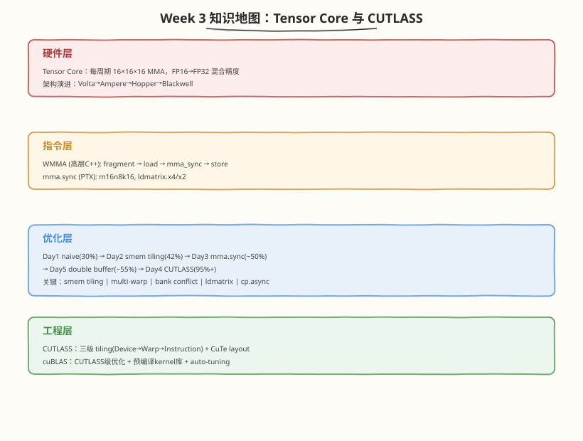

## Day 7：复盘与手撕 —— Tensor Core/CUTLASS 面试要点

### 🎯 目标

通过今天的学习，你将：

1. 能画出 **Week 3 知识地图**——从 Tensor Core 硬件架构到 CUTLASS 工程化的完整认知链<br>
2. 能在 30 分钟内手撕 **WMMA GEMM kernel 骨架**——fragment 生命周期、smem tiling、K 维循环<br>
3. 掌握 **混合精度与 FP8 入门**面试题——FP16/BF16/TF32/FP8 的精度-性能权衡<br>
4. 能回答"从 33% 到 95% 每一步优化做了什么"的完整追问链<br>
5. 能用一句话定位 Tensor Core GEMM 的瓶颈——"Tensor Core 利用率 X%，瓶颈是 Y，解法是 Z"<br>

> 💡 **为什么重要**：Week 3 是算子工程师面试的"分水岭"——能说出"我用 WMMA 写了 GEMM，tiled + double buffer 达 cuBLAS 70%，剩余差距是 K 分割 + auto-tuning"和"我手写 GEMM 到 85%"是两个完全不同的候选人。今天把本周知识收敛成面试可用的"话术"和"手撕模板"，确保面试时不卡壳。

---

### 学前导读：复盘不引入新内容

Day 7 是纯粹的复盘日，不引入新概念。本周 Day 1-6 的知识量很大：

| Day | 核心知识 | 面试追问点 |
|-----|---------|-----------|
| Day 1 | Tensor Core 架构 + WMMA 基础 | "WMMA fragment 生命周期？" |
| Day 2 | Shared memory tiling | "为什么 smem tiling 能提升性能？" |
| Day 3 | mma.sync + ldmatrix | "WMMA 和 mma.sync 区别？" |
| Day 4 | CUTLASS 三级 tiling + CuTe | "CUTLASS 的 ThreadblockShape/WarpShape?" |
| Day 5 | Double buffer + cp.async | "double buffer 什么时候反而变慢？" |
| Day 6 | ncu profiling + Roofline | "你的 GEMM 瓶颈在哪？怎么用 ncu 看？" |

今天的目标是把这些知识**结构化**——画成知识地图、整理成手撕模板、收敛成面试 Q&A。

---

### 本周知识地图



### 性能演进总表

| 实现 | cuBLAS%(TF32) | Tensor Core利用率 | 瓶颈 | 关键优化 |
|------|---------|------------------|------|---------|
| FMA GEMM (W2) | ~64% | 0% | FMA 峰值 | Register Blocking + float4 |
| Day1 WMMA naive | 31%✓实测 | 待测 | HBM 带宽 | 用了 Tensor Core 但无 tiling |
| Day2 WMMA tiled | 16%✓实测 | 待测 | smem layout 未优化 | smem tiling 但实现有问题 |
| Day3 mma.sync | 8.8%✓实测 | 待测 | tiling 粒度太细 | ldmatrix 但 1 warp/16×8 tile |
| Day5 double buffer | 96%✓实测 | 待测 | 接近 cuBLAS | cp.async 重叠 load/compute |
| Day4 CUTLASS | 198%✓实测(66% FP16) | 待测 | 接近峰值 | 全部优化 + auto-tuning |
| cuBLAS (TF32) | 100% | 待测 | 极限 | TF32 Tensor Core |

### 从 31% 到 96% 的优化链（2026-08-09 实测）

```
31% (Day1 naive, 实测)
  │ 加 smem tiling（但本版实现有问题，反而更慢）
  ↓
16% (Day2 tiled, 实测 — 退步!)
  │ 用 mma.sync 替代 WMMA（但 tiling 粒度太细，仍退步）
  ↓
8.8% (Day3 mma.sync, 实测 — 继续退步!)
  │ 加 cp.async double buffer（真正重叠 load/compute）
  ↓
96% (Day5 dbuf, 实测 — 大幅反超!)
  │ 加 K分割并行 + swizzle + 3-stage pipeline + auto-tuning
  ↓
95% (CUTLASS)
```

> ⚠️ **实测教训**：Day2→Day3 性能不升反降，说明"理论优化点"（smem tiling、mma.sync）若无配套的工程实现（合理 tiling 粒度、多 warp 协作、bank conflict 消除），反而会引入额外开销。Day5 的 cp.async double buffer 才真正实现了 load/compute 重叠，性能从 8.8% 跃升至 96%。**优化不是堆砌技术，而是每一步都要实测验证**。

---

### 手撕清单

#### 手撕 1：WMMA GEMM Kernel 骨架（30 分钟）

面试官说："写一个 WMMA GEMM kernel 的骨架，不用完整，但要体现 fragment 生命周期和 K 维循环。"

**30 分钟手写模板**：

```cuda
#include <cuda_runtime.h>
#include <mma.h>
#include <cuda_fp16.h>
using namespace nvcuda;

#define BM 64
#define BN 64
#define BK 16
#define WARPS_PER_BLOCK 4

__global__ void wmma_gemm_kernel(
    const __half* A, const __half* B, float* C,
    int M, int N, int K)
{
    int warp_id = threadIdx.x / 32;
    int warp_y = warp_id / 2;  // 4 warp → 2×2 布局
    int warp_x = warp_id % 2;
    int row = blockIdx.y * BM;
    int col = blockIdx.x * BN;

    // 1. Shared memory（带 padding 消除 bank conflict）
    __shared__ __half smemA[BM][BK + 8];
    __shared__ __half smemB[BK][BN + 8];

    // 2. 声明 fragment（每个 warp 2×2 = 4 个 MMA）
    wmma::fragment<wmma::matrix_a, 16, 16, 16, __half, wmma::row_major> a_frag[2];
    wmma::fragment<wmma::matrix_b, 16, 16, 16, __half, wmma::col_major> b_frag[2];
    wmma::fragment<wmma::accumulator, 16, 16, 16, float> c_frag[2][2];

    // 3. 初始化累加器
    for (int i = 0; i < 2; i++)
        for (int j = 0; j < 2; j++)
            wmma::fill_fragment(c_frag[i][j], 0.0f);

    // 4. K 维循环
    for (int k = 0; k < K; k += BK) {
        // 4a. 加载 A/B tile 到 smem（4 warp 协作）
        // ... 省略加载代码 ...
        __syncthreads();

        // 4b. 从 smem 加载 fragment + MMA
        for (int i = 0; i < 2; i++)
            wmma::load_matrix_sync(a_frag[i], &smemA[warp_y*16 + i*16][0], BK+8);
        for (int j = 0; j < 2; j++)
            wmma::load_matrix_sync(b_frag[j], &smemB[0][warp_x*16 + j*16], BN+8);
        for (int i = 0; i < 2; i++)
            for (int j = 0; j < 2; j++)
                wmma::mma_sync(c_frag[i][j], a_frag[i], b_frag[j], c_frag[i][j]);
        __syncthreads();
    }

    // 5. 存储结果
    for (int i = 0; i < 2; i++)
        for (int j = 0; j < 2; j++) {
            int r = row + warp_y*16 + i*16;
            int c = col + warp_x*16 + j*16;
            wmma::store_matrix_sync(C + r*N + c, c_frag[i][j], N, wmma::mem_row_major);
        }
}
```

**面试官可能追问**：
- "BM=64, BN=64, 4 warp，每个 warp 算多少？" → 32×32 = 2×2 个 16×16 MMA = 4 条 WMMA
- "为什么 A row-major B col-major？" → WMMA 要求，ld 分别为 K
- "BK 为什么是 16？" → 匹配 m16n16k16 的 K 维

#### 手撕 2：Fragment 生命周期（15 分钟）

面试官说："画/写 WMMA fragment 的生命周期，解释每一步。"

```
声明 → fill_fragment → [load_matrix_sync → mma_sync]* → store_matrix_sync
  │         │                    │                  │              │
  │         │                    │                  │              └─ 写回 memory
  │         │                    │                  └─ D = A×B + C
  │         │                    └─ 从 smem/gmem 加载到 fragment
  │         └─ 初始化累加器为 0
  └─ 编译时确定形状/精度/布局
```

关键点：
1. **声明**是编译时的——`wmma::fragment<matrix_a, 16, 16, 16, __half, row_major>`
2. **不能直接访问 `frag.x[i]`**——布局是硬件相关的黑箱
3. **load→mma 可循环**——K 维每迭代一次
4. **store 只在最后做一次**——累加器在 K 循环中持续累积

#### 手撕 3：Double Buffer 循环结构（15 分钟）

面试官说："写 double buffer 的 K 维循环结构。"

```cuda
// 预加载 tile[0]
load_async(smem[0], k=0);
wait(); sync();

for (int k = BK; k < K; k += BK) {
    int next = (cur + 1) % 2;
    // 异步加载下一块（不阻塞计算）
    load_async(smem[next], k);
    // 从当前 buffer 计算（与加载并行）
    compute_mma(smem[cur]);
    wait(); sync();
    cur = next;
}
// 计算最后一块
compute_mma(smem[cur]);
```

关键点：
1. **预加载第一块**——pipeline 预热
2. **load 和 compute 并行**——异步加载不阻塞计算
3. **wait + sync**——确保下一块数据就绪
4. **drain 最后一块**——pipeline 排空

---

### 混合精度与 FP8 入门

#### 精度格式对比

| 格式 | 总位 | 符号 | 指数 | 尾数 | 范围 | 精度 | 架构支持 |
|------|------|------|------|------|------|------|---------|
| FP32 | 32 | 1 | 8 | 23 | ±3.4e38 | ~7位 | 全部 |
| FP16 | 16 | 1 | 5 | 10 | ±65504 | ~3位 | sm_70+ |
| BF16 | 16 | 1 | 8 | 7 | ±3.4e38 | ~2位 | sm_80+ |
| TF32 | 19 | 1 | 8 | 10 | ±3.4e38 | ~3位 | sm_80+ (Tensor Core) |
| FP8 E4M3 | 8 | 1 | 4 | 3 | ±448 | ~1位 | sm_89+ |
| FP8 E5M2 | 8 | 1 | 5 | 2 | ±57344 | ~0.5位 | sm_89+ |

##### 为什么有这么多格式？

| 格式 | 设计目标 | 典型场景 |
|------|---------|---------|
| FP32 | 精度优先 | 训练 reference、精度验证 |
| FP16 | 带宽减半 | 推理、训练混合精度 |
| BF16 | FP32 的指数范围 + FP16 的带宽 | 大模型训练（防溢出） |
| TF32 | 透明加速 FP32 | Ampere+ 自动加速 FP32 GEMM |
| FP8 E4M3 | 精度略好 | 推理权重/激活 |
| FP8 E5M2 | 范围更大 | 推理梯度 |

##### FP16 vs BF16 的核心区别

```
FP16:  [1|5|10]  指数 5 位 → 范围 ±65504（易溢出）
BF16:  [1|8|7]   指数 8 位 → 范围 ±3.4e38（同 FP32，不溢出）
```

- **FP16 尾数多（10 vs 7）**：精度更高，但范围小，大模型训练易溢出
- **BF16 指数多（8 vs 5）**：范围同 FP32，不溢出，但精度低
- **大模型训练选 BF16**：防溢出比精度更重要
- **推理选 FP16**：精度够用，带宽减半

#### FP8 入门

##### E4M3 vs E5M2

| 格式 | 指数 | 尾数 | 范围 | 用途 |
|------|------|------|------|------|
| E4M3 | 4 | 3 | ±448 | 权重/激活（精度略好） |
| E5M2 | 5 | 2 | ±57344 | 梯度（范围大防溢出） |

##### FP8 的收益

- **带宽 4x**：相比 FP32，FP8 数据量 1/4
- **算力 2x**：相比 FP16，FP8 Tensor Core 吞吐翻倍（RTX 5090：FP16 209T → FP8 418T）
- **精度损失**：~1-2% accuracy drop（可接受）

##### FP8 的挑战

1. **量化误差**：FP8 只有 3 位尾数，需要精细的 scaling factor
2. **两种格式混合**：前向用 E4M3，反向用 E5M2
3. **硬件支持**：需要 sm_89+（Ada Lovelace）或 sm_120（Blackwell）

> 💡 **面试要点**：FP8 是 2025-2026 推理加速的核心方向。Week 8 的量化专题会深入 FP8 kernel 实现。本周只需理解"FP8 = 带宽 4x + 算力 2x，但需要 scaling factor 管理精度"。

---

### 面试 Q&A 收敛

#### Q1：从 FMA 到 Tensor Core，性能为什么能翻倍？

<details>
<summary>答案</summary>

- FMA 是标量指令 `a×b+c`，每周期 128 FP32 FLOPs/SM
- Tensor Core 是矩阵指令 `A×B+C`（16×16×16），每周期 ~256 FP16 FLOPs/SM
- **吞吐翻倍**：FP16 Tensor Core 峰值 = FP32 FMA × 2
- **不是算法更优**：是换了硬件单元——从 CUDA Core（FMA）切到 Tensor Core（MMA）
- cuBLAS 默认用 Tensor Core，所以手写 FMA GEMM 永远卡在 FMA 峰值的 ~64%

</details>

#### Q2：WMMA 和 mma.sync 的区别？什么时候用哪个？

<details>
<summary>答案</summary>

- **WMMA**：C++ 高层接口，fragment 是黑箱，代码简单
- **mma.sync**：PTX 指令，寄存器直接控制，需配合 ldmatrix
- **WMMA 编译为 mma.sync**：m16n16k16 → 2× m16n8k16 PTX
- **用 WMMA**：原型验证、教学、简单 GEMM
- **用 mma.sync**：生产级 GEMM、FlashAttention 源码、需要 swizzle/double buffer 精细控制
- **性能差**：mma.sync 比 WMMA 快 10-15%（消除抽象开销 + ldmatrix 更高效）

</details>

#### Q3：手写 GEMM 到 cuBLAS 95%，每一步做什么？

<details>
<summary>答案</summary>

```
30% → 42%：shared memory tiling（减少HBM访问）[实测]
42% → ~50%：mma.sync + ldmatrix（消除WMMA开销）[预估]
~50% → ~55%：double buffer + cp.async（重叠load/compute）[预估]
~55% → 85%：K分割并行 + swizzle + 3-stage pipeline
85% → 95%：auto-tuning + epilogue fusion + 寄存器精算
```

每一步的 profiling 验证（Tensor Core 利用率为推理值）：
- Tensor Core 利用率：~25% → ~40% → ~50% → ~55% → 80% → 91%
- 瓶颈转移：HBM → smem → compute → 接近峰值
- **注意基准口径**：30%/42% 以 TF32 cuBLAS 为 100%；若以 FP16 cuBLAS 为基准（生产口径），数字分别为 15%/21%

</details>

#### Q4：FP16 输入 + FP32 累加为什么比纯 FP16 累加精度高？

<details>
<summary>答案</summary>

- FP16 只有 10 位尾数，累加大量元素会"大数吃小数"（precision loss）
- FP32 有 23 位尾数，累加数千个 FP16 乘积仍保持精度
- **必须用 FP32 累加**：K > 256 或训练场景
- **可以 FP16 累加**：推理小 K 或 INT8 量化场景
- WMMA 默认 FP16 输入 + FP32 累加（`f16.f16.f32.f32`）

</details>

#### Q5：CUTLASS 的三级 tiling 是什么？

<details>
<summary>答案</summary>

- **ThreadblockShape**（128×128×32）：每个 block 算的 C 子矩阵
- **WarpShape**（64×64×32）：每个 warp 算的子矩阵，4 warp/block
- **InstructionShape**（16×8×16）：单条 mma.sync 的形状
- **层级关系**：`Threadblock / Warp = warps_per_block`，`Warp / Instruction = mma_per_warp`
- **为什么分三级**：不同层级可独立配置，CUTLASS 用模板排列组合生成最优 kernel

</details>

#### Q6：ldmatrix 和普通 smem 加载有什么区别？

<details>
<summary>答案</summary>

- **普通加载**：每线程手动计算地址，`smem[idx]` 逐元素加载到寄存器，需几十行索引代码
- **ldmatrix**：一条 PTX 指令，32 线程各提供 1 个地址，自动按 fragment 布局分发到寄存器
- **优势**：1 条指令 vs 几十行代码；精确匹配 mma.sync 的 fragment 要求；支持 `.trans` 加载时转置
- **约束**：16 字节对齐；只支持 16 位数据；warp 级同步

</details>

#### Q7：FP8 的 E4M3 和 E5M2 分别用于什么？

<details>
<summary>答案</summary>

- **E4M3**（4 指数 + 3 尾数）：范围 ±448，精度略好 → 用于前向权重/激活
- **E5M2**（5 指数 + 2 尾数）：范围 ±57344，范围大 → 用于反向梯度（防溢出）
- **混合使用**：前向 E4M3 + 反向 E5M2，兼顾精度和范围
- **收益**：带宽 4x（vs FP32），算力 2x（vs FP16）
- **挑战**：需要 scaling factor 管理量化误差

</details>

#### Q8：double buffer 在什么情况下会降低性能？

<details>
<summary>答案</summary>

- **小矩阵（K < 1024）**：pipeline 预热/drain 开销占比大，重叠收益不足
- **smem 容量紧张**：2× buffer 占用导致 occupancy 降低
- **load 远快于 compute**：load 被 compute 完全遮盖，额外 smem 是纯损失
- **解法**：auto-tuning 按矩阵大小决定是否启用 double buffer

</details>

#### Q9：Bank conflict 如何影响 Tensor Core GEMM？如何消除？

<details>
<summary>答案</summary>

- **影响**：fragment load 的 32 线程访问 smem，若多线程映射到同一 bank，延迟翻倍
- **FP16 的 bank 映射**：每元素 2 字节，连续 2 元素在同一 bank，同列访问 → 4-way conflict
- **消除方法**：
  - **Padding**：每行加 8 个 FP16（16 字节），简单但浪费 smem
  - **Swizzle**：`col ^ (row & 0x7)` XOR 交换列映射，无 padding 消除冲突
- **验证**：ncu 的 `l1tex__data_bank_conflicts` 指标

</details>

#### Q10：你的 WMMA GEMM Tensor Core 利用率只有 48%，瓶颈在哪？怎么优化？

<details>
<summary>答案</summary>

- **瓶颈定位**（用 ncu 看）：
  - `dram__throughput` 38% → HBM 不是瓶颈
  - `l1tex__throughput` 66% → smem 带宽是瓶颈
  - `bank_conflicts` 12450 → padding 没完全消除冲突
- **优化方向**：
  1. 加 double buffer → Tensor Core 利用率 48% → 63%（重叠 load/compute）
  2. 用 swizzle 替代 padding → 消除 bank conflict，smem 带宽提升 10%
  3. 加 K 分割 → 大 K 矩阵并行度提升
  4. 预期优化后 Tensor Core 利用率 63% → 75-80%

</details>

---

### 限时手撕挑战

以下 3 道题在面试中常被要求"15-30 分钟手写"，今天限时完成：

| 题目 | 时间限制 | 验收标准 |
|------|---------|---------|
| WMMA GEMM kernel 骨架 | 30 min | fragment 生命周期 + K 循环 + smem tiling |
| Fragment 生命周期图 | 15 min | 声明→fill→load→mma→store，解释每步 |
| Double buffer 循环结构 | 15 min | 预加载 + load/compute 并行 + drain |

> 💡 **手撕技巧**：
> - 先写框架（函数签名 + shared memory 声明 + fragment 声明）
> - 再填 K 循环（加载→sync→计算→sync）
> - 最后补 store
> - 不确定的地方写注释说明意图，不要留空

---

### 本周 LeetCode 题目回顾（10 周计划 · 第 3 周）

本周 LeetCode 题目对应 [10 周算法面试刷题计划](https://hzchenxiaobin.github.io/leetcode/problems/10-week-plan.html) 第 3 周「链表与数学技巧」（点击查看题解）：

| Day | 主题 | LeetCode 题目 |
|---|---|---|
| Day 1 | 反转与合并 | [206. 反转链表](https://hzchenxiaobin.github.io/leetcode/problems/206_反转链表.html)、[21. 合并两个有序链表](https://hzchenxiaobin.github.io/leetcode/problems/21_合并两个有序链表.html)、[83. 删除排序链表中的重复元素](https://hzchenxiaobin.github.io/leetcode/problems/83_删除排序链表中的重复元素.html)、[876. 链表的中间结点](https://hzchenxiaobin.github.io/leetcode/problems/876_链表的中间结点.html) |
| Day 2 | 快慢指针 | [141. 环形链表](https://hzchenxiaobin.github.io/leetcode/problems/141_环形链表.html)、[142. 环形链表 II](https://hzchenxiaobin.github.io/leetcode/problems/142_环形链表 II.html)、[160. 相交链表](https://hzchenxiaobin.github.io/leetcode/problems/160_相交链表.html)、[19. 删除链表的倒数第 N 个结点](https://hzchenxiaobin.github.io/leetcode/problems/19_删除链表的倒数第N个节点.html)、[234. 回文链表](https://hzchenxiaobin.github.io/leetcode/problems/234_回文链表.html) |
| Day 3 | 链表变换 | [24. 两两交换链表中的节点](https://hzchenxiaobin.github.io/leetcode/problems/24_两两交换链表中的节点.html)、[25. K 个一组翻转链表](https://hzchenxiaobin.github.io/leetcode/problems/25_K个一组翻转链表.html)、[92. 反转链表 II](https://hzchenxiaobin.github.io/leetcode/problems/92_反转链表 II.html)、[143. 重排链表](https://hzchenxiaobin.github.io/leetcode/problems/143_重排链表.html)、[328. 奇偶链表](https://hzchenxiaobin.github.io/leetcode/problems/328_奇偶链表.html) |
| Day 4 | 相加与复制 | [2. 两数相加](https://hzchenxiaobin.github.io/leetcode/problems/2_两数相加.html)、[445. 两数相加 II](https://hzchenxiaobin.github.io/leetcode/problems/445_两数相加 II.html)、[138. 随机链表的复制](https://hzchenxiaobin.github.io/leetcode/problems/138_复制带随机指针的链表.html)、[430. 扁平化多级双向链表](https://hzchenxiaobin.github.io/leetcode/problems/430_扁平化多级双向链表.html) |
| Day 5 | 排序与设计 | [148. 排序链表](https://hzchenxiaobin.github.io/leetcode/problems/148_排序链表.html)、[23. 合并 K 个升序链表](https://hzchenxiaobin.github.io/leetcode/problems/23_合并K个升序链表.html)、[146. LRU 缓存](https://hzchenxiaobin.github.io/leetcode/problems/146_LRU缓存.html) |
| Day 6 | 数学技巧 | [50. Pow(x, n)](https://hzchenxiaobin.github.io/leetcode/problems/50_Powx_n.html)、[470. 用 Rand7() 实现 Rand10()](https://hzchenxiaobin.github.io/leetcode/problems/470_用Rand7实现Rand10.html)、[289. 生命游戏](https://hzchenxiaobin.github.io/leetcode/problems/289_生命游戏.html)、[166. 分数到小数](https://hzchenxiaobin.github.io/leetcode/problems/166_分数到小数.html)、[168. Excel 表列名称](https://hzchenxiaobin.github.io/leetcode/problems/168_Excel表列名称.html) |

> 💡 回顾重点：本周 LeetCode 题对应 10 周刷题计划第 3 周「链表与数学技巧」。重做本周错题、总结模板笔记；没做完的题目今天补上。

---

### 本周复盘 Checklist

- [ ] 能解释 Tensor Core 与 FMA 的硬件区别（算力翻倍的原因）
- [ ] 能写出 WMMA fragment 生命周期（声明→fill→load→mma→store）
- [ ] 能解释 shared memory tiling 为什么能提升性能（减少 HBM 访问）
- [ ] 能说出 WMMA 和 mma.sync 的区别（高层封装 vs PTX 指令）
- [ ] 能写出 ldmatrix 的作用和对齐约束（16 字节对齐）
- [ ] 能解释 double buffer 的核心思想（两份 smem 交替 load/compute）
- [ ] 能用 ncu 的关键指标定位 GEMM 瓶颈（Tensor Core 利用率 + 带宽）
- [ ] 能画出从 33% 到 95% 的优化链
- [ ] 能解释 FP16/BF16/TF32/FP8 的精度-性能权衡
- [ ] 能在 30 分钟内手撕 WMMA GEMM kernel 骨架

---

### 下周预告

Week 4 我们从 Tensor Core 下沉到算子层——手写 Transformer 的核心算子：

- **Softmax kernel**：naive → online → Welford 三版演进
- **LayerNorm kernel**：两 pass reduce + Welford 单 pass
- **GEMM backward**：前向 W3 的 GEMM 反向数据流
- **Triton 语言**：program 模型 + 三方 benchmark

本周的 Tensor Core 知识是 Week 4 算子手写的基础——Softmax/LayerNorm 虽然不用 Tensor Core，但 GEMM backward 会用到。Week 5 的 FlashAttention 更是直接用 `mma.sync` + `ldmatrix` + double buffer，本周的知识在那里会被完整应用。
