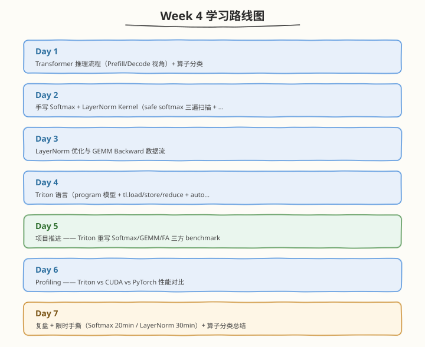

# Week 4：Transformer 算子手写 + Triton

> 核心目标：手写 Softmax/LayerNorm/GEMM Backward kernel、掌握 Triton 语言、完成 Triton vs CUDA 三方性能对比

| 项目　　　 | 说明　　　　　　　　　　　　　　　　　　　　　　　　　　　　　|
| ------------| ------------------------------------------------------------|
| 前置要求　 | 已完成 Week 3，掌握 WMMA、CUTLASS、混合精度策略　　　　　　　　　　　　　　　　　　　　　　　|
| 建议时长　 | 工作日每天 2.5h，周末每天 6h，周计 24.5h　　　　　　　　　　|
| 本周产出　 | Softmax/LayerNorm kernel、Triton softmax/gemm/FA kernel、Triton vs CUDA vs PyTorch 三方 benchmark、限时手撕留档　　　　　　　　　　　　　　　　　　　　　　　　　|
| 周日里程碑 | Softmax/LayerNorm kernel 正确性 PASS，Triton GEMM 追平 cuBLAS，"何时用 Triton 何时必须 CUDA"决策表完成　　　　　　　　　　　　　　　　　　　　　　　|

---

## 🧭 本周学习地图

---

## 📚 每日学习材料

| Day | 主题 | 目录 |
|-----|------|------|
| Day 1 | Trace Transformer 推理流程（Prefill/Decode） | [day1/](https://hzchenxiaobin.github.io/ai-infra-notes/week4/day1.html) |
| Day 2 | 手写 Softmax 与 LayerNorm Kernel | [day2/](https://hzchenxiaobin.github.io/ai-infra-notes/week4/day2.html) |
| Day 3 | LayerNorm 优化与 GEMM Backward 数据流 | [day3/](https://hzchenxiaobin.github.io/ai-infra-notes/week4/day3.html) |
| Day 4 | Triton 语言专题 —— 用 Triton 重写 Softmax/GEMM/FA | [day4/](https://hzchenxiaobin.github.io/ai-infra-notes/week4/day4.html) |
| Day 5 | 项目推进 —— Triton 三方 Benchmark 与 Autotune | [day5/](https://hzchenxiaobin.github.io/ai-infra-notes/week4/day5.html) |
| Day 6 | Profiling —— Triton vs CUDA vs PyTorch 性能对比 | [day6/](https://hzchenxiaobin.github.io/ai-infra-notes/week4/day6.html) |
| Day 7 | Transformer 算子分类与总结 | [day7/](https://hzchenxiaobin.github.io/ai-infra-notes/week4/day7.html) |
