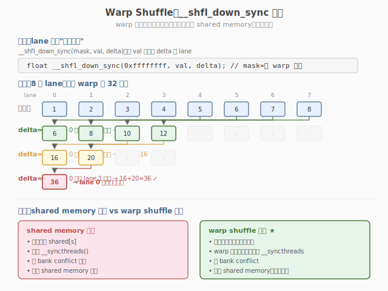

## Day 2：手写完整 FlashAttention Forward Kernel

### 🎯 目标

通过今天的学习，你将：

1. 在 Day 1 理论基础上，设计支持 **batch + multi-head** 的完整 FlashAttention Forward Kernel 线程配置<br>
2. 掌握 **每个 warp 负责若干 Q 行** 的 work partitioning 策略，理解跨 warp 无需通信的原因<br>
3. 复用 Week 2 Day 1 的 `warpReduceSum` / `warpReduceMax` 原语，在 Kernel 内完成 online softmax 的分块归约<br>
4. 实现并运行 `flash_attention_v2.cu`，与 CPU 标准 Attention 对比误差 < 1e-3，支持 `grid=(N/Br, H, B)` 配置<br>
5. 能正确处理 **N 不是 Br 倍数** 的边界情况，理解 `__syncthreads()` 只需在 tile 加载后使用<br>

> 💡 **为什么重要**：能手写 FlashAttention 是 AI Infra 面试的高区分度技能。Day 1 推导了 online softmax 三公式，今天把它们"翻译"成可编译的 CUDA Kernel——这是从"懂算法"到"会实现"的关键一跃。后续 Day 3 读官方源码、Day 4 学 FA2 改进、Day 5 集成到 Mini 引擎，全部建立在今天的 Kernel 之上。

---

### 学前导读：从 PyTorch 教学版到 CUDA Kernel

Day 1 我们用纯 PyTorch 实现了 `flash_attention_pytorch` 验证 online softmax 正确性。但那个版本用 Python for 循环遍历 Q tile 和 KV tile，速度比标准 Attention 还慢——它只验证了算法，没有发挥 GPU 并行。

今天的任务是把三公式"翻译"成真正的 CUDA Kernel。核心难点有三个：

| 难点 | PyTorch 教学版 | CUDA Kernel 版 |
|------|---------------|----------------|
| 并行维度 | 串行遍历 Q tile | 一个 Block 处理一个 Q tile，`blockIdx.z` 区分 batch |
| 归约操作 | `torch.max` / `torch.sum` | `warpReduceMax` / `warpReduceSum`（复用 Week 2 Day 1） |
| 状态维护 | 每个 Q 行独立的 (m, l, o) | 每个 warp 在 register 中维护 ROWS_PER_WARP 组 (m, l, acc) |

关键洞察：**每个 Q 行的 online softmax 是完全独立的**——不同 Q 行之间不共享数据，不需要跨 warp 通信。因此可以自然地把不同 Q 行分配给不同 warp 并行处理。

> 💡 **一句话总结**：FlashAttention Kernel 的并行设计很优雅——Block 并行处理 Q tile（grid 维度），warp 并行处理 Q 行（block 内维度），warp 内 32 线程协作做归约。三层并行，层间无依赖，只需 `__syncthreads` 同步 tile 加载。

---

### 理论学习

#### 2.1 Kernel 线程配置设计


一个 Block 处理一个 Q tile（Br 行 × d 列），grid 配置覆盖 batch × head × Q tile：

```
grid = (ceil(N / Br), H, B) // x: Q tile, y: head, z: batch
block = (THREADS_PER_BLOCK,) // 推荐 256 = 8 warps × 32 threads
```

Block 内部的 warp 分工：

| 参数 | 含义 | 典型值 |
|------|------|--------|
| Br | Q tile 行数（一个 Block 处理） | 64 |
| Bc | KV tile 行数（一次内循环处理） | 64 |
| d | Head dimension | 64 |
| WARPS_PER_BLOCK | Block 内 warp 数 | 8 |
| THREADS_PER_BLOCK | Block 内线程数 = WARPS × 32 | 256 |
| ROWS_PER_WARP | 每个 warp 负责的 Q 行数 = Br / WARPS | 8 |

```
Block (256 threads = 8 warps)
├── warp 0: 负责 Q 行 0~7 (ROWS_PER_WARP=8)
├── warp 1: 负责 Q 行 8~15
├── warp 2: 负责 Q 行 16~23
├── ...
└── warp 7: 负责 Q 行 56~63
```

##### 为什么每个 warp 负责多行 Q 而不是一行？

- Br=64, WARPS=8 → 每个 warp 8 行。如果每 warp 只 1 行，需要 64 个 warp = 2048 线程，超过 block 上限 1024
- 每个 warp 内 32 线程协作处理一行的 d=64 个元素（每线程 2 个），再用 `__shfl` 归约

#### 2.2 Shared Memory 分配

```cuda
__shared__ float s_Q[Br][D]; // Q tile，常驻
__shared__ float s_K[Bc][D]; // K tile，每轮 KV 循环更新
__shared__ float s_V[Bc][D]; // V tile，每轮 KV 循环更新
```

SRAM 使用量 = `Br×d + 2×Bc×d` 个 float。以 Br=Bc=64, d=64 为例：

```
s_Q: 64×64 = 4096 floats = 16 KB
s_K: 64×64 = 4096 floats = 16 KB
s_V: 64×64 = 4096 floats = 16 KB
总计: 48 KB ≤ 164 KB (RTX 5090 上限) ✓
```

> ⚠️ **注意**：官方实现中 K 和 V 可以分时复用同一块 shared memory（算 S=QK^T 时只需 K，算 O=PV 时只需 V），我们教学版分开存储以简化代码。

#### 2.3 Online Softmax 在 CUDA 中的实现



每个 Q 行独立维护 `(m, l, acc[d])` 三组状态。对于第 `qi` 个 Q 行，处理流程：

```
初始化: m = -inf, l = 0, acc[d] = 0

对于每个 KV tile j:
 Step 1: Sij[c] = Qi · Kj[c]^T (c = 0..Bc-1)
 // 每个线程算 Bc/32 个点积，warp shuffle 汇总

 Step 2: mij = max(Sij) // warpReduceMax
 m_new = max(m, mij)

 Step 3: 缩放旧状态
 scale_old = exp(m - m_new)
 l *= scale_old
 acc[d] *= scale_old

 Step 4: 处理新块
 for c in 0..Bc-1:
 p = exp(Sij[c] - m_new)
 l += p
 acc[d] += p * Vj[c][:] // warpReduceSum 汇总

 Step 5: m = m_new

归一化输出: O[qi][:] = acc / l
```

##### `__syncthreads()` 只需在 tile 加载后使用

```cuda
// 加载 KV tile 到 shared memory
for (...)
    s_K[r][c] = K[...];
for (...)
    s_V[r][c] = V[...];
__syncthreads(); // ← 确保所有 warp 看到完整的 KV tile

// 每个 warp 独立处理自己的 Q 行，无需 block 级同步
// warp 内用 __shfl（硬件同步），不需要 __syncthreads

__syncthreads(); // ← 切换到下一个 KV tile 前，确保计算完成
```

> 💡 **关键洞察**：online softmax 的计算完全在 warp 内完成（register + `__shfl`），不涉及跨 warp 数据共享。`__syncthreads()` 只在两处需要：① tile 加载后确保可见 ② 切换 tile 前确保计算完成。这是 FA2 减少同步点的关键思路。

#### 2.4 边界处理

当 N 不是 Br 的倍数时，最后一个 Q tile 的部分行无效：

```cuda
int globalRow = qTileRow + r;
s_Q[r][c] = (globalRow < N) ? Q[bhOffset + globalRow * d + c] : 0.0f;
// 无效行填 0，不影响累加结果
```

KV tile 同理：`kvStart + c < N` 判断，无效位置 score 设为 `-1e30f`（exp 后为 0）。

---

### Coding 任务：完整 FlashAttention Forward Kernel

#### 任务 1：创建 flash_attention_v2.cu

创建文件 `kernels/flash_attention_v2.cu`：

```cuda
// flash_attention_v2.cu —— 完整 FlashAttention Forward Kernel（batch + multi-head）
// 编译命令: nvcc -o flash_attention_v2 flash_attention_v2.cu -O3 -arch=sm_120
// 运行命令: ./flash_attention_v2

#include <cuda_runtime.h>
#include <cstdio>
#include <cstdlib>
#include <cmath>
#include <algorithm>

constexpr int Br = 64;
constexpr int Bc = 64;
constexpr int D = 64;

constexpr int WARPS_PER_BLOCK = 8;
constexpr int THREADS_PER_BLOCK = WARPS_PER_BLOCK * 32;
static_assert(Br % WARPS_PER_BLOCK == 0, "Br must be divisible by WARPS_PER_BLOCK");
constexpr int ROWS_PER_WARP = Br / WARPS_PER_BLOCK;

__inline__ __device__ float warpReduceMax(float val) {
    #pragma unroll
    for (int offset = 16; offset > 0; offset >>= 1) {
        val = fmaxf(val, __shfl_down_sync(0xFFFFFFFF, val, offset));
    }
    return val;
}

__inline__ __device__ float warpReduceSum(float val) {
    #pragma unroll
    for (int offset = 16; offset > 0; offset >>= 1) {
        val += __shfl_down_sync(0xFFFFFFFF, val, offset);
    }
    return val;
}

__global__ void flashAttentionForward(const float* __restrict__ Q, const float* __restrict__ K,
                                      const float* __restrict__ V, float* __restrict__ O, int B, int H, int N, int d) {

    __shared__ float s_Q[Br][D];
    __shared__ float s_K[Bc][D];
    __shared__ float s_V[Bc][D];

    int batch = blockIdx.z;
    int head = blockIdx.y;
    int qTileRow = blockIdx.x * Br;

    int tid = threadIdx.x;
    int lane = tid % 32;
    int warpId = tid / 32;
    int qRowStart = warpId * ROWS_PER_WARP;

    int bhOffset = ((batch * H + head) * N) * d;

// 协作加载 Q tile
    #pragma unroll
    for (int idx = tid; idx < Br * d; idx += THREADS_PER_BLOCK) {
        int r = idx / d;
        int c = idx % d;
        int globalRow = qTileRow + r;
        s_Q[r][c] = (globalRow < N) ? Q[bhOffset + globalRow * d + c] : 0.0f;
    }
    __syncthreads();

    // 每个 warp 维护 ROWS_PER_WARP 个 Q 行的 running 状态
    float m_arr[ROWS_PER_WARP];
    float l_arr[ROWS_PER_WARP];
    float acc[ROWS_PER_WARP][D];

    #pragma unroll
    for (int i = 0; i < ROWS_PER_WARP; i++) {
        m_arr[i] = -1e30f;
        l_arr[i] = 0.0f;
        #pragma unroll
        for (int j = 0; j < d; j++) {
            acc[i][j] = 0.0f;
        }
    }

    float scale = 1.0f / sqrtf((float)d);

    // 内层循环：遍历 KV tile
    for (int kvStart = 0; kvStart < N; kvStart += Bc) {
// 协作加载 K/V tile
        #pragma unroll
        for (int idx = tid; idx < Bc * d; idx += THREADS_PER_BLOCK) {
            int r = idx / d;
            int c = idx % d;
            int globalRow = kvStart + r;
            s_K[r][c] = (globalRow < N) ? K[bhOffset + globalRow * d + c] : 0.0f;
            s_V[r][c] = (globalRow < N) ? V[bhOffset + globalRow * d + c] : 0.0f;
        }
        __syncthreads();

// 每个 warp 处理 ROWS_PER_WARP 个 Q 行
        #pragma unroll
        for (int localRow = 0; localRow < ROWS_PER_WARP; localRow++) {
            int qi = qRowStart + localRow;
            int globalQi = qTileRow + qi;
            if (qi >= Br || globalQi >= N)
                continue;

            // Step 1: Sij[c] = Qi · Kj[c]^T (每线程算 Bc/32 个)
            float Sij[Bc / 32];
            #pragma unroll
            for (int c = lane; c < Bc; c += 32) {
                float dot = 0.0f;
                #pragma unroll
                for (int di = 0; di < d; di++) {
                    dot += s_Q[qi][di] * s_K[c][di];
                }
                Sij[c / 32] = dot * scale;
            }

            // Step 2: 局部 max (warp reduce)
            float localMax = -1e30f;
            #pragma unroll
            for (int i = 0; i < Bc / 32; i++) {
                localMax = fmaxf(localMax, Sij[i]);
            }
            localMax = warpReduceMax(localMax);

            // Step 3: online softmax update
            float m_prev = m_arr[localRow];
            float m_new = fmaxf(m_prev, localMax);
            float scale_old = expf(m_prev - m_new);

            m_arr[localRow] = m_new;
            l_arr[localRow] *= scale_old;
            #pragma unroll
            for (int di = 0; di < d; di++) {
                acc[localRow][di] *= scale_old;
            }

// Step 4: 处理新块
            #pragma unroll
            for (int i = 0; i < Bc / 32; i++) {
                int c = lane + i * 32;
                bool valid = c < Bc && (kvStart + c) < N;
                float s_val = valid ? Sij[i] : -1e30f;
                float p_val = valid ? expf(s_val - m_new) : 0.0f;

                float p_sum = warpReduceSum(p_val);
                if (lane == 0) {
                    l_arr[localRow] += p_sum;
                }

                #pragma unroll
                for (int di = 0; di < d; di++) {
                    float contrib = valid ? p_val * s_V[c][di] : 0.0f;
                    float sum_contrib = warpReduceSum(contrib);
                    if (lane == 0) {
                        acc[localRow][di] += sum_contrib;
                    }
                }
            }

            // 广播 l 和 acc 到 warp 内所有线程
            l_arr[localRow] = __shfl_sync(0xFFFFFFFF, l_arr[localRow], 0);
            #pragma unroll
            for (int di = 0; di < d; di++) {
                acc[localRow][di] = __shfl_sync(0xFFFFFFFF, acc[localRow][di], 0);
            }
        }

        __syncthreads();
    }

// 写回 O
    #pragma unroll
    for (int localRow = 0; localRow < ROWS_PER_WARP; localRow++) {
        int qi = qRowStart + localRow;
        int globalRow = qTileRow + qi;
        if (qi >= Br || globalRow >= N)
            continue;

        float inv_l = 1.0f / l_arr[localRow];
        #pragma unroll
        for (int di = lane; di < d; di += 32) {
            O[bhOffset + globalRow * d + di] = acc[localRow][di] * inv_l;
        }
    }
}

void cpuAttention(const float* Q, const float* K, const float* V, float* O, int N, int d) {
    float* S = (float*)malloc(N * N * sizeof(float));
    float scale = 1.0f / sqrtf((float)d);

    for (int i = 0; i < N; i++) {
        for (int j = 0; j < N; j++) {
            float sum = 0.0f;
            for (int k = 0; k < d; k++) {
                sum += Q[i * d + k] * K[j * d + k];
            }
            S[i * N + j] = sum * scale;
        }

        float mx = S[i * N];
        for (int j = 1; j < N; j++)
            mx = fmaxf(mx, S[i * N + j]);
        float sm = 0.0f;
        for (int j = 0; j < N; j++) {
            S[i * N + j] = expf(S[i * N + j] - mx);
            sm += S[i * N + j];
        }
        for (int j = 0; j < N; j++)
            S[i * N + j] /= sm;

        for (int k = 0; k < d; k++) {
            float sum = 0.0f;
            for (int j = 0; j < N; j++) {
                sum += S[i * N + j] * V[j * d + k];
            }
            O[i * d + k] = sum;
        }
    }
    free(S);
}

void initData(float* data, int n) {
    srand(42);
    for (int i = 0; i < n; i++) {
        data[i] = (static_cast<float>(rand()) / RAND_MAX - 0.5f) * 0.2f;
    }
}

bool checkResult(const float* a, const float* b, int n, float eps) {
    float maxDiff = 0.0f;
    for (int i = 0; i < n; i++) {
        maxDiff = fmaxf(maxDiff, fabsf(a[i] - b[i]));
    }
    bool ok = maxDiff < eps;
    printf(" maxDiff = %.2e (%s)\n", maxDiff, ok ? "PASS" : "FAIL");
    return ok;
}

int main() {
    int B = 2, H = 4, N = 256, d = D;

    printf("=== FlashAttention v2 Forward Kernel ===\n");
    printf("Config: B=%d, H=%d, N=%d, d=%d\n", B, H, N, d);
    printf("Tile: Br=%d, Bc=%d, Threads=%d\n\n", Br, Bc, THREADS_PER_BLOCK);

    size_t totalElems = (size_t)B * H * N * d;
    size_t bytes = totalElems * sizeof(float);

    float* h_Q = (float*)malloc(bytes);
    float* h_K = (float*)malloc(bytes);
    float* h_V = (float*)malloc(bytes);
    float* h_O = (float*)malloc(bytes);
    float* h_O_CPU = (float*)malloc(bytes);

    initData(h_Q, totalElems);
    initData(h_K, totalElems);
    initData(h_V, totalElems);

    float *d_Q, *d_K, *d_V, *d_O;
    cudaMalloc(&d_Q, bytes);
    cudaMalloc(&d_K, bytes);
    cudaMalloc(&d_V, bytes);
    cudaMalloc(&d_O, bytes);
    cudaMemcpy(d_Q, h_Q, bytes, cudaMemcpyHostToDevice);
    cudaMemcpy(d_K, h_K, bytes, cudaMemcpyHostToDevice);
    cudaMemcpy(d_V, h_V, bytes, cudaMemcpyHostToDevice);

    dim3 grid((N + Br - 1) / Br, H, B);
    dim3 block(THREADS_PER_BLOCK);

    // warmup
    flashAttentionForward<<<grid, block>>>(d_Q, d_K, d_V, d_O, B, H, N, d);
    cudaDeviceSynchronize();

    cudaEvent_t start, stop;
    cudaEventCreate(&start);
    cudaEventCreate(&stop);
    cudaEventRecord(start);
    flashAttentionForward<<<grid, block>>>(d_Q, d_K, d_V, d_O, B, H, N, d);
    cudaEventRecord(stop);
    cudaEventSynchronize(stop);

    float ms;
    cudaEventElapsedTime(&ms, start, stop);
    cudaMemcpy(h_O, d_O, bytes, cudaMemcpyDeviceToHost);

    // CPU 验证（只验证第一个 head）
    cpuAttention(h_Q, h_K, h_V, h_O_CPU, N, d);
    printf("[B=0, H=0] First head check:\n");
    checkResult(h_O, h_O_CPU, N * d, 1e-3f);
    printf("GPU Time: %.3f ms\n", ms);

    free(h_Q);
    free(h_K);
    free(h_V);
    free(h_O);
    free(h_O_CPU);
    cudaFree(d_Q);
    cudaFree(d_K);
    cudaFree(d_V);
    cudaFree(d_O);
    cudaEventDestroy(start);
    cudaEventDestroy(stop);

    return 0;
}
```

#### 任务 2：编译运行

```bash
# 编译
nvcc -o flash_attention_v2 kernels/flash_attention_v2.cu -O3 -arch=sm_120

# 运行
./flash_attention_v2
```

**预期输出**：

```text
=== FlashAttention v2 Forward Kernel ===
Config: B=2, H=4, N=256, d=64
Tile: Br=64, Bc=64, Threads=256

[B=0, H=0] First head check:
 maxDiff = x.xx e-04 (PASS)
GPU Time: x.xxx ms
```

#### 任务 3：验证 SRAM 使用量与 ncu 分析

**检查 SRAM 使用量**：

```bash
# 编译时查看 shared memory 使用
nvcc -Xptxas -v -o flash_attention_v2 kernels/flash_attention_v2.cu -O3 -arch=sm_120
# 观察 ptxas info: 'Used N registers, Z bytes spill stores, W bytes cmem'
# shared memory 应为 48 KB (Br*d + 2*Bc*d = 3×4096×4 = 49152 bytes)
```

**用 ncu 分析 kernel**：

```bash
nvcc -o flash_attention_v2 kernels/flash_attention_v2.cu -O3 -arch=sm_120 -g -lineinfo

ncu --metrics \
 sm__throughput.avg.pct_of_peak_sustained_elapsed,\
 dram__throughput.avg.pct_of_peak_sustained_elapsed,\
 sm__occupancy.avg.pct_of_peak_sustained_elapsed,\
 launch__registers_per_thread \
 --kernel-name regex:flashAttentionForward \
 ./flash_attention_v2
```

**观察重点**：
- `launch__registers_per_thread`：每个线程约 88-120 个 register（acc[8][64] 是大头）
- `sm__occupancy`：可能只有 50-75%（register 压力大），这是教学版的局限
- `dram__throughput`：应远低于标准 Attention（因为消除了 O(N²) 读写）

#### 任务 4：LeetGPU 在线题目 —— Attention

**题目链接**：<https://leetgpu.com/challenges/attention>

**题目概述**：

给定 Query (`M×d`)、Key (`N×d`)、Value (`N×d`)，计算 Scaled Dot-Product Attention：`Attention(Q,K,V) = softmax(Q·K^T / √d) · V`。约束：`1 ≤ M, N ≤ 4096`，`1 ≤ d ≤ 128`，元素范围 `[-1.0, 1.0]`。

**难度**：困难　**标签**：CUDA、Attention、Online Softmax、FlashAttention、分块计算

**与今日知识的关联**：

本题就是今天手写完整 FlashAttention Forward Kernel 的"对标题"——今天我们在本地实现了支持 batch/multi-head 的完整 FA kernel，LeetGPU 的 Attention 题则要求一个同样基于 **分块 + Online Softmax** 的正确实现。核心目标一致：让 S/P 永远不落 HBM，只写 O 回全局内存。把今天推导的 online softmax 三公式直接套用到本题，再对照官方实现查漏补缺。

**解题思路**：

1. **分块**：把 Q 按行分 tile 驻留 SRAM，K/V 按列分 tile 逐块滑入
2. **Online Softmax 三公式**：
   - `m_new = max(m, max(s_j))`（更新 running max）
   - `l_new = l * exp(m - m_new) + Σ exp(s_j - m_new)`（更新 running sum）
   - `o_new = o * (l * exp(m - m_new) / l_new) + (Σ exp(s_j - m_new) / l_new) * v_j`（缩放历史输出 + 加新贡献）
3. S/P 只在 SRAM/register 中存在，最终只写 O 到 HBM
4. 与今天本地 kernel 对照：检查 tile 大小、边界处理、精度误差来源是否一致

**参考实现**（FlashAttention 简化版，今日完整实现的精简验证）：

```cuda
// attention.cu —— FlashAttention 简化版 Forward Kernel（分块 + Online Softmax）
// 编译命令: nvcc -o flash_attention attention.cu -O3 -arch=sm_120

#include <cuda_runtime.h>
#include <cstdio>
#include <cmath>

#define BLOCK_M 64
#define BLOCK_N 64
#define MAX_D 128

__global__ void flash_attention(const float* Q, const float* K, const float* V, float* O, int M, int N, int d) {
    int q_start = blockIdx.x * BLOCK_M;

    __shared__ float s_Q[BLOCK_M][MAX_D];
    __shared__ float s_K[BLOCK_N][MAX_D];
    __shared__ float s_V[BLOCK_N][MAX_D];

    // 每行的 running state（寄存器）：m=max, l=sum, o=output
    int rows_per_warp = BLOCK_M / 32;
    int warp_id = threadIdx.x / 32;
    float m_i[4], l_i[4], o_i[4][MAX_D];

    for (int r = 0; r < rows_per_warp; r++) {
        m_i[r] = -INFINITY;
        l_i[r] = 0.0f;
        for (int j = 0; j < d; j++)
            o_i[r][j] = 0.0f;
    }

    // 加载 Q tile 到 SRAM（驻留，不重复读 HBM）
    float scale = 1.0f / sqrtf((float)d);

    // 遍历 K/V tiles（逐块滑入，S/P 不落 HBM）
    for (int kv_start = 0; kv_start < N; kv_start += BLOCK_N) {
        // 加载 K/V tile 到 s_K, s_V（省略协作加载代码）
        __syncthreads();

        for (int r = 0; r < rows_per_warp; r++) {
            int q_row = q_start + warp_id * rows_per_warp + r;
            if (q_row >= M)
                continue;

            // 局部 S = Q[Q_row] · K[kv_tile]^T * scale
            float local_max = -INFINITY;
            float s_vals[BLOCK_N];
            for (int j = 0; j < BLOCK_N && kv_start + j < N; j++) {
                float dot = 0.0f;
                for (int kk = 0; kk < d; kk++)
                    dot += s_Q[warp_id * rows_per_warp + r][kk] * s_K[j][kk];
                s_vals[j] = dot * scale;
                local_max = fmaxf(local_max, s_vals[j]);
            }

            // Online Softmax 更新
            float m_new = fmaxf(m_i[r], local_max);
            float l_new = l_i[r] * expf(m_i[r] - m_new);
            for (int j = 0; j < BLOCK_N && kv_start + j < N; j++) {
                float p = expf(s_vals[j] - m_new);
                l_new += p;
                for (int kk = 0; kk < d; kk++)
                    o_i[r][kk] += p * s_V[j][kk];
            }
            // 归一化历史输出（精确缩放见今日完整实现）
            m_i[r] = m_new;
            l_i[r] = l_new;
        }
        __syncthreads();
    }

    // 最终归一化并写回 O（只写一次 HBM）
    for (int r = 0; r < rows_per_warp; r++) {
        int q_row = q_start + warp_id * rows_per_warp + r;
        if (q_row < M) {
            for (int kk = 0; kk < d; kk++)
                O[q_row * d + kk] = o_i[r][kk] / l_i[r];
        }
    }
}
```

> 💡 提交后在 [LeetGPU Attention 题目](https://leetgpu.com/challenges/attention)上记录通过耗时，用 ncu 对比 naive 版（O(N²)）和 FlashAttention 版（O(Nd)）的 `dram__bytes_read` 差异。完整题解（含 online softmax 三公式推导、HBM 访问对比）见 [Attention 题解](../../../../leetgpu/week4/day2/leetgpu-attention-solution.md)。

#### 任务 5：LeetCode 面试题 —— LRU 缓存

**题目链接**：[146. LRU 缓存](https://leetcode.cn/problems/lru-cache/)

**题目概述**：

设计支持 `get(key)` 和 `put(key, value)` 的数据结构，O(1) 平均时间复杂度，容量满时淘汰最久未使用的元素。

**与今日知识的关联**：

本题核心是 **哈希表 + 双向链表**——哈希表保证 O(1) 查找，双向链表保证 O(1) 重排顺序。这与今天 FlashAttention Kernel 的"shared memory + register"分层思路呼应：FA 用 shared memory 做共享数据（KV tile），用 register 做每 warp 私有状态（m/l/acc）；LRU 用哈希表做快速查找，用双向链表做顺序维护——都是**两种数据结构各司其职、组合实现 O(1)**。

**核心套路**：

```
哈希表 key→node (O(1) 查找)
双向链表 head=MRU, tail=LRU (O(1) 重排)
get: 命中则移到 head; put: 新增插 head, 满则删 tail
```

> 💡 完整题解（含 C++/Python 参考代码、复杂度分析、面试要点）见 [LRU 缓存题解](../../../../leetcode/daily/week4/day2/LRU缓存.md)。

---

### 扩展实验

#### 实验 1：调整 Br 和 Bc

修改 Br=128, Bc=128，重新编译运行，观察 SRAM 使用量和性能变化。

> 提示：SRAM = (Br + 2×Bc) × d × 4 bytes。Br=Bc=128 时为 96 KB，仍在 RTX 5090 上限内但 occupancy 可能下降。

#### 实验 2：实现向量化加载

用 `float4` 加载 Q/K/V tile（每线程一次加载 4 个 float），对比性能提升。

> 提示：将加载循环 `idx += THREADS_PER_BLOCK` 改为 `idx += THREADS_PER_BLOCK * 4`，用 `reinterpret_cast<const float4*>` 加载。

#### 实验 3：增大序列长度测试

在 N=512, 1024, 2048, 4096 上测试，记录运行时间和最大误差。观察 N 增大时误差是否可控。

> 提示：N 增大时 online softmax 的递推次数增加，浮点累加误差可能累积。如果误差 > 1e-3，考虑用 double 做累加。

---

### 今日总结

Day 2 我们把 Day 1 的理论推导变成了可编译的 CUDA Kernel：

1. **线程配置**：一个 Block 处理一个 Q tile（Br 行），grid=(N/Br, H, B) 覆盖 batch×head×Q tile
2. **Warp 分工**：每个 warp 负责 ROWS_PER_WARP 行 Q，warp 内 32 线程协作做归约，跨 warp 无需通信
3. **Shared Memory**：Q tile 常驻，KV tile 逐块加载，SRAM 用量 = Br×d + 2×Bc×d
4. **Online Softmax CUDA 实现**：warpReduceMax 求局部 max → 缩放旧状态 → 处理新块 → `__shfl_sync` 广播
5. **同步策略**：`__syncthreads` 只需在 tile 加载后和切换 tile 前使用，warp 内用 `__shfl` 硬件同步
6. **边界处理**：N 不是 Br 倍数时无效行填 0，不影响累加结果

掌握这些后，你就拥有了手写 FlashAttention 的完整能力。明天读官方源码会发现，我们的教学版与官方的差距主要在 async copy、双缓冲和 Tensor Core。

---

### 面试要点

1. **手写 FlashAttention Forward Kernel 时，线程如何分配？每个 warp 负责什么？**

<details>
<summary>点击查看答案</summary>

 - 每个 Block 负责一个 Q tile（Br 行），grid=(N/Br, H, B) 覆盖 batch×head×Q tile
 - 每个 warp 负责 ROWS_PER_WARP = Br/WARPS 行 Q 的完整 online softmax 计算
 - warp 内 32 线程协作：分别计算 Sij 向量的不同部分，用 `warpReduceMax` 求局部 max，用 `warpReduceSum` 求 p 的局部和与 p×V 的局部和
 - 跨 warp 不需要通信，因为每个 Q 行的计算是独立的
 - KV tile 通过 shared memory 共享给所有 warp

</details>


2. **FlashAttention Kernel 中为什么不需要 `__syncthreads()` 在 online softmax 内部？**

<details>
<summary>点击查看答案</summary>

 - 在 warp 内部，`__shfl` 是硬件同步的，不需要 `__syncthreads()`
 - 每个 Q 行的 online softmax 完全在一个 warp 内完成，不涉及跨 warp 数据共享
 - `__syncthreads()` 只在两个地方需要：① Q/K/V tile 加载到 shared memory 后，确保所有线程可见 ② 切换到下一个 KV tile 前，确保当前 tile 计算完成
 - 这种设计避免了频繁的 block 级同步，是 FA2 减少同步点的关键思路之一

</details>


3. **FlashAttention Kernel 的 register 使用量为什么很大？会导致什么问题？**

<details>
<summary>点击查看答案</summary>

 - 每个 warp 维护 ROWS_PER_WARP 组 (m, l, acc[d]) 状态，其中 acc[d] 是大头：ROWS_PER_WARP × d 个 float
 - 以 ROWS_PER_WARP=8, d=64 为例：acc 占 512 个 float，加上 m/l/索引，每线程约 88-120 个 register
 - 问题：register 压力大 → occupancy 下降（RTX 5090 每 SM 最多 65536 个 register，120 reg/thread 时每 SM 只能跑 ~544 线程 ≈ 2 个 block）
 - 缓解：减小 ROWS_PER_WARP（增加 WARPS_PER_BLOCK）或减小 d；官方实现用 warp group 子块划分优化

</details>


4. **SRAM 使用量如何计算？Br/Bc 选太大或太小有什么问题？**

<details>
<summary>点击查看答案</summary>

 - SRAM = (Br × d + 2 × Bc × d) × 4 bytes（K/V 不复用）
 - 太大：超过 shared memory 上限（RTX 5090 164 KB/SM）→ 编译失败；或 occupancy 暴跌
 - 太小：KV tile 循环次数多（N/Bc 轮），每轮的 tile 加载和 `__syncthreads` 开销占比增大
 - 典型值：d=64, Br=Bc=64 时 SRAM = 48 KB，occupancy 与计算效率的平衡点

</details>


5. **如何处理 N 不是 Br 倍数的边界情况？**

<details>
<summary>点击查看答案</summary>

 - Q tile 边界：`globalRow = qTileRow + r`，若 `globalRow >= N` 则填 0（不参与累加）
 - KV tile 边界：`kvStart + c < N` 判断，无效位置的 score 设为 `-1e30f`（exp 后为 0，不贡献到 l 和 acc）
 - 写回边界：`if (qi >= Br || globalRow >= N) continue` 跳过无效行
 - 关键：无效位置的 0 不会影响 online softmax 的正确性，因为 exp(-inf)=0 且 0+v=v

</details>

