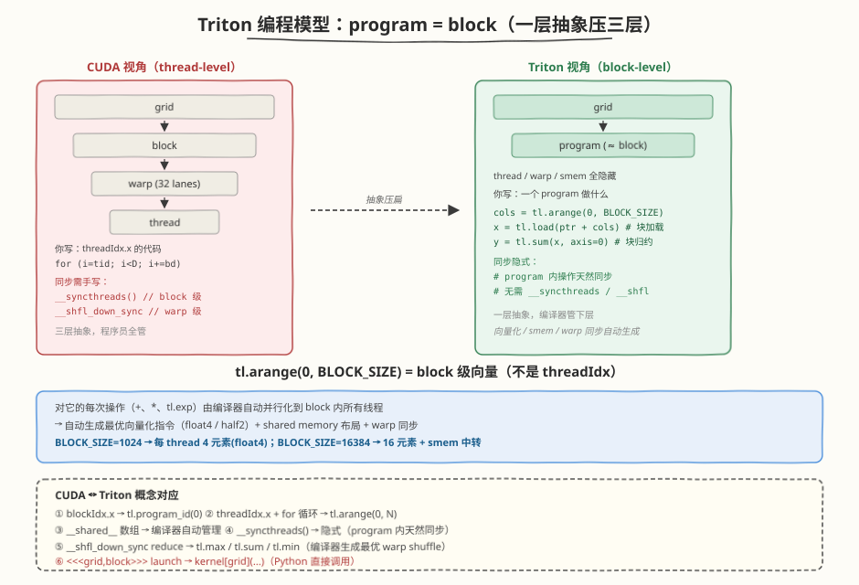
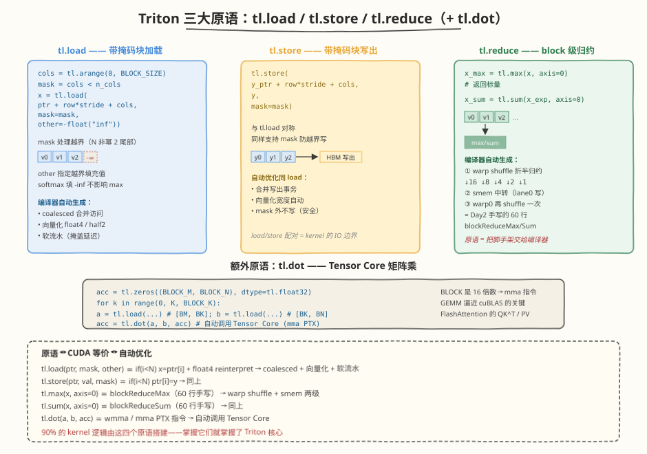
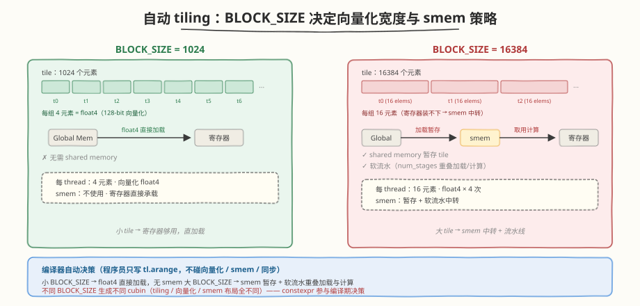
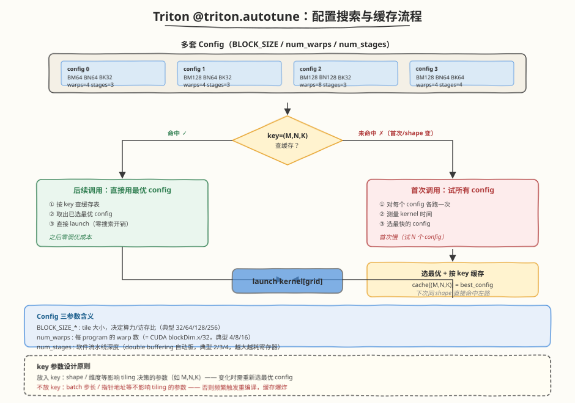
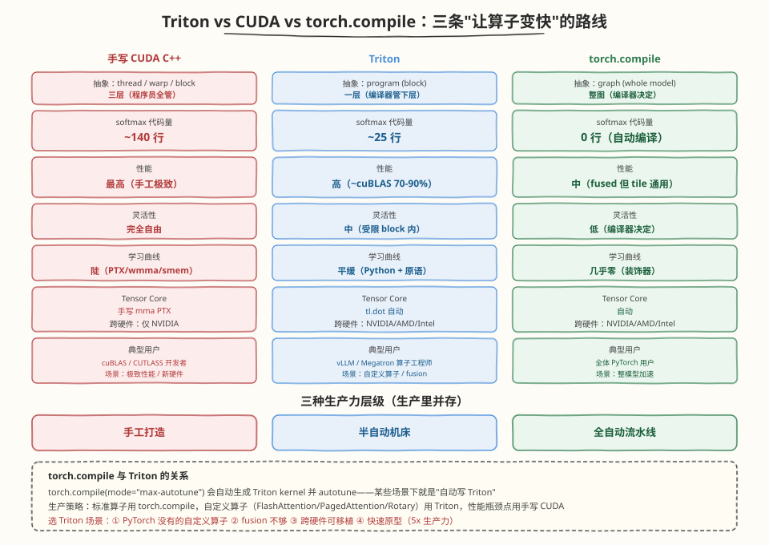

## Day 4：Triton 语言专题 —— 用 Triton 重写 Softmax/GEMM/FA

### 🎯 目标

通过今天的学习，你将：

1. 理解 Triton 的 **block-level programming** 模型，能解释它如何把 CUDA 的"thread / warp / block"三层抽象压成"一个 program 操作一个 block"的一层抽象
2. 掌握 `tl.load` / `tl.store` / `tl.reduce` 三大原语与 `tl.dot`，能用它们组装出 row-wise reduce、tiled GEMM、online softmax 三类典型 kernel
3. 学会用 `@triton.jit` 装饰器把 Python 函数编译成 GPU kernel，理解 **自动 tiling 与自动向量化** 如何替代手写 `__shfl` / `float4` / `__syncthreads`
4. 理解 `@triton.autotune` 的**配置搜索机制**，能为一组 GEMM 写出多套 `(BLOCK_SIZE, num_warps, num_stages)` 配置并让 Triton 自动选最优
5. 实现并运行 Triton 版 Softmax / GEMM / FlashAttention，与 `torch.softmax` / `cuBLAS` / naive attention 误差达到验收标准，且 GEMM 达到 cuBLAS 70%+
6. 能对比 **Triton vs CUDA vs torch.compile** 三条路线的生产力与性能权衡，说出各自的适用场景与局限

> 💡 **为什么重要**：Week 4 Day 2 我们手写了 CUDA softmax / layernorm，发现 ~50 行算法逻辑外面裹着近百行工程脚手架（warp shuffle、shared memory、向量化、同步屏障，合计 ~140 行代码）。Triton 的核心价值就是把这近百行交给编译器——你只写"一个 block 做什么"，tile 大小、向量化、shared memory 布局、warp 同步全部自动生成。今天用 Triton 重写三大算子，建立"Python 写 kernel"的肌肉记忆，为后续阅读 vLLM / Megatron-LM / TensorRT-LLM 源码打基础（这些项目大量使用 Triton）。

---

### 学前导读：为什么需要 Triton

Day 2 我们手写了 CUDA Softmax kernel，核心算法只有三遍扫描（max → sum → normalize），但配套代码包括：`warpReduceSum`、`warpReduceMax`、`blockReduceSum`、`blockReduceMax`、shared memory 缓冲、两处 `__syncthreads`、`__shfl_sync` 广播……最终 60 行 kernel + 80 行 host 脚手架。Day 3 又加了 Welford 在线算法——优化项越加越多，可读性越压越薄。

Triton 的出发点很简单：**让算法工程师用 Python 写高性能 GPU kernel，把工程细节交给编译器**。同样一个 row-wise softmax，Triton 版核心只需 ~10 行：

```python
@triton.jit
def softmax_kernel(x_ptr, y_ptr, x_stride, y_stride, n_cols, BLOCK_SIZE: tl.constexpr):
    row = tl.program_id(0)
    cols = tl.arange(0, BLOCK_SIZE)
    mask = cols < n_cols
    x = tl.load(x_ptr + row * x_stride + cols, mask=mask, other=-float("inf"))
    x_max = tl.max(x, axis=0)                    # block 级 reduce，自动 warp shuffle
    x_exp = tl.exp(x - x_max)
    x_sum = tl.sum(x_exp, axis=0)                # 同上，无需手写 __shfl_down_sync
    tl.store(y_ptr + row * y_stride + cols, x_exp / x_sum, mask=mask)
```

对比 Day 2 的 60 行 CUDA，差异不在算法（都是 safe softmax 三遍扫描），而在 **抽象层级**：

| 维度 | CUDA C++（Day 2） | Triton（今日） |
|------|------------------|----------------|
| 抽象粒度 | thread / warp / block 三层 | **program（≈ block）** 一层 |
| reduce 实现 | 手写 `__shfl_down_sync` + smem + `__syncthreads` | `tl.max` / `tl.sum` 一行 |
| 向量化 | 手写 `float4` / `__half2` reinterpret_cast | **自动**（编译器按 BLOCK_SIZE 选最优） |
| shared memory | 手动 `__shared__` + 布局 | **自动分配**（按 tile 大小） |
| tiling 循环 | 手写 `for (int i = tid; i < D; i += blockDim.x)` | `tl.arange` + `tl.load` 向量化 |
| 调优 | 手动试 BLOCK_SIZE / num_warps | `@triton.autotune` 自动搜索 |

> 💡 **一句话总结**：Triton 不是"更高级的 CUDA"，而是"把 CUDA 里 80% 的工程脚手架交给编译器，让你专注写算法"。它的定位介于 PyTorch eager（够快但不够灵活）和手写 CUDA（够灵活但太繁重）之间——这正是 vLLM、Megatron-LM、Torchtune 等项目大量采用 Triton 的原因。

---

### 理论学习

#### 1.1 Triton 编程模型：block-level programming



Triton 的核心抽象是 **program**（程序实例），对应 CUDA 的一个 **block**。关键区别在于：CUDA 程序员写"一个 thread 做什么"，Triton 程序员写"一个 block 做什么"。

##### 一个 program 内部发生了什么？

```python
@triton.jit
def kernel(x_ptr, ..., BLOCK_SIZE: tl.constexpr):
    pid = tl.program_id(0)              # 等价 blockIdx.x
    cols = tl.arange(0, BLOCK_SIZE)     # 一个 [BLOCK_SIZE] 的向量
    x = tl.load(x_ptr + cols)           # 一次加载 BLOCK_SIZE 个元素
    y = tl.sum(x, axis=0)               # block 级归约
    tl.store(out_ptr + cols, x * 2)     # 一次写出 BLOCK_SIZE 个元素
```

`tl.arange(0, BLOCK_SIZE)` 创建的是一个 **block 级向量**（不是 threadIdx）。对它的每次操作（`+`、`*`、`tl.exp`）都由编译器自动**并行化到 block 内所有线程**，并生成最优的向量化指令（`float4` / `half2`）和 shared memory 布局。

| CUDA 概念 | Triton 对应 | 说明 |
|----------|------------|------|
| `blockIdx.x` | `tl.program_id(0)` | program 索引 |
| `threadIdx.x` + `for` 循环 | `tl.arange(0, N)` | block 级向量，编译器自动分给线程 |
| `__shared__` 数组 | Triton 内部自动管理 | 程序员不接触 |
| `__syncthreads()` | 隐式 | program 内操作天然同步 |
| `__shfl_down_sync` reduce | `tl.max` / `tl.sum` / `tl.min` | 编译器生成最优 warp shuffle |
| `<<<grid, block>>>` launch | `kernel[grid](...)` | Python 直接调用 |

> ⚠️ **注意**：`tl.constexpr` 参数（如 `BLOCK_SIZE`）必须在编译期确定，不能是运行时变量。这是 Triton 做 tiling 与向量化决策的依据——所有 `constexpr` 参数都参与 JIT 编译，不同的值会生成不同的 cubin。

#### 1.2 三大原语：tl.load / tl.store / tl.reduce



Triton kernel 的 90% 由这三个原语搭建。理解它们的语义就掌握了 Triton 的核心。

##### tl.load —— 带掩码的块加载

```python
cols = tl.arange(0, BLOCK_SIZE)
mask = cols < n_cols                              # 处理 N 不是 2 的幂的尾部
x = tl.load(x_ptr + row * x_stride + cols,
            mask=mask,
            other=-float("inf"))                 # mask 外位置填 -inf
```

- `mask` 参数处理越界（类似 CUDA 里 `if (i < N)` 的防护）
- `other` 指定越界位置的填充值——softmax 里填 `-inf` 保证不影响 max
- 编译器自动生成 **coalesced + 向量化**（float4 / half2）的加载指令

##### tl.store —— 带掩码的块写出

```python
tl.store(y_ptr + row * y_stride + cols, y, mask=mask)
```

与 `tl.load` 对称，同样支持 `mask` 防止越界写。

##### tl.reduce —— block 级归约

```python
x_max = tl.max(x, axis=0)      # block 级 max 归约，返回标量
x_sum = tl.sum(x_exp, axis=0)  # block 级 sum 归约
```

这是 Triton 相比 CUDA 最大的省心之处：**归约是语言内建原语**，编译器自动生成最优的 warp shuffle + shared memory 两级 reduce（正是 Day 2 我们手写的那 60 行 `blockReduceMax` / `blockReduceSum`）。

| 原语 | CUDA 等价 | 自动优化 |
|------|----------|---------|
| `tl.load(ptr, mask, other)` | `if (i<N) x = ptr[i]` + `float4` reinterpret | coalesced + 向量化 + 软流水 |
| `tl.store(ptr, val, mask)` | `if (i<N) ptr[i] = y` | 同上 |
| `tl.max(x, axis=0)` | `blockReduceMax`（60 行） | warp shuffle + smem 两级 |
| `tl.sum(x, axis=0)` | `blockReduceSum`（60 行） | 同上 |
| `tl.dot(a, b, acc)` | `wmma` / `mma` PTX 指令 | 自动调用 Tensor Core |

##### 额外原语：tl.dot —— Tensor Core 矩阵乘

```python
acc = tl.zeros((BLOCK_M, BLOCK_N), dtype=tl.float32)
for k in range(0, K, BLOCK_K):
    a = tl.load(...)  # [BLOCK_M, BLOCK_K]
    b = tl.load(...)  # [BLOCK_K, BLOCK_N]
    acc = tl.dot(a, b, acc)   # 自动调用 Tensor Core
```

`tl.dot` 是 Triton 调用 **Tensor Core** 的接口——只要 `BLOCK_M / N / K` 是 16 的倍数，编译器自动生成 `mma` PTX 指令。这是 Triton GEMM 能逼近 cuBLAS 的关键，也是 FlashAttention 里 QK^T 与 PV 两个 GEMM 的实现方式。

#### 1.3 @triton.jit 装饰器与自动 tiling

`@triton.jit` 把一个 Python 函数标记为 **JIT 编译对象**：首次调用时，Triton 把 Python AST 翻译成 MLIR → LLVM IR → PTX → cubin，缓存到 `~/.triton/cache`。

```python
@triton.jit
def kernel(x_ptr, ..., BLOCK_SIZE: tl.constexpr):
    ...
```

##### 自动 tiling 的含义

CUDA 程序员写 `for (int i = tid; i < N; i += blockDim.x)` 手动分 tile；Triton 程序员写 `cols = tl.arange(0, BLOCK_SIZE)`，编译器根据 `BLOCK_SIZE` 自动决定：

- 每个 thread 处理几个元素（向量化宽度）
- 是否用 shared memory 缓存
- 是否展开循环（`#pragma unroll` 的自动版）



##### constexpr 的作用

```python
def triton_softmax(x):
    BLOCK_SIZE = triton.next_power_of_2(x.shape[1])  # 运行时计算
    softmax_kernel[(n_rows,)](..., BLOCK_SIZE=BLOCK_SIZE)  # 作为 constexpr 传入
```

`BLOCK_SIZE` 不同会生成**不同的 cubin**（因为 tiling、向量化、shared memory 布局都依赖它）。Triton 会为每个 `constexpr` 组合单独编译并缓存。

> ⚠️ **注意**：不要把高频变化的值（如 `n_rows`）设为 `constexpr`——会触发频繁重编译。`constexpr` 应只用于 **tile 大小、num_warps 这类少量离散值**。

#### 1.4 @triton.autotune：自动调优机制



Week 2 我们手动试 warp 级 vs block 级、float4 vs scalar，靠 ncu 对比选最优。Triton 把这个流程自动化：

```python
configs = [
    triton.Config({"BLOCK_SIZE_M": 64,  "BLOCK_SIZE_N": 64,  "BLOCK_SIZE_K": 32}, num_warps=4, num_stages=3),
    triton.Config({"BLOCK_SIZE_M": 128, "BLOCK_SIZE_N": 64,  "BLOCK_SIZE_K": 32}, num_warps=4, num_stages=3),
    triton.Config({"BLOCK_SIZE_M": 128, "BLOCK_SIZE_N": 128, "BLOCK_SIZE_K": 32}, num_warps=8, num_stages=3),
    triton.Config({"BLOCK_SIZE_M": 128, "BLOCK_SIZE_N": 64,  "BLOCK_SIZE_K": 64}, num_warps=4, num_stages=4),
]

@triton.autotune(configs=configs, key=["M", "N", "K"])
@triton.jit
def gemm_kernel(...):
    ...
```

##### 工作机制

1. **首次调用**：对每个 config 各跑一次，测量时间，选出最快的 config 并缓存
2. **后续调用**：按 `key` 参数（这里是 `["M", "N", "K"]`）查缓存，直接用最优 config
3. **shape 变化**：当 `M / N / K` 变化时，触发新一轮 autotune（因为最优 config 与 shape 相关）

##### key 参数的设计

```python
key=["M", "N", "K"]  # 矩阵形状变化时重新调优
```

- `key` 列出"影响最优 config 选择的运行时参数"
- 矩阵乘的最优 tile 与 M / N / K 强相关（小矩阵用小 tile，大矩阵用大 tile），所以放入 key
- 不要把变化太频繁的值放入 key（如 batch 步长），否则每次都重编译

##### num_stages 是什么？

```python
triton.Config({...}, num_warps=4, num_stages=3)
```

- `num_warps`：每个 program 的 warp 数（等价 CUDA `blockDim.x / 32`）
- `num_stages`：**软件流水线深度**——编译器把循环展开成 `num_stages` 个阶段，前一个 tile 的计算与下一个 tile 的加载重叠（类似 CUDA 的 double buffering，但自动）

| 参数 | 作用 | 典型范围 |
|------|------|---------|
| `BLOCK_SIZE_*` | tile 大小，决定算力 / 访存比 | 32 / 64 / 128 / 256 |
| `num_warps` | 每 program 的 warp 数 | 4 / 8 / 16 |
| `num_stages` | 软件流水线深度 | 2 / 3 / 4（越大越耗寄存器） |

> 💡 **一句话总结**：`@triton.autotune` 把"试不同 BLOCK_SIZE / num_warps / num_stages 用 ncu 选最优"这件 Week 2 手动做的事自动化了。代价是首次调用慢（要试所有 config），收益是之后零调优成本。

#### 1.5 Triton vs CUDA vs torch.compile 三方对比



今天我们有了三条"让 PyTorch 算子变快"的路线，它们的定位完全不同：

| 维度 | 手写 CUDA C++ | Triton | torch.compile |
|------|--------------|--------|---------------|
| **抽象层级** | thread / warp / block | program (block) | graph (whole model) |
| **代码量**（softmax） | ~140 行 | ~25 行 | 0 行（自动编译） |
| **性能** | 最高（手工极致） | 高（~cuBLAS 70-85%） | 中（fused 但 tile 通用） |
| **灵活性** | 完全自由 | 中（受限 block 内） | 低（编译器决定） |
| **学习曲线** | 陡（PTX / wmma / smem） | 平缓（Python + 原语） | 几乎零（装饰器） |
| **调试** | cuda-gdb / ncu | ncu（生成 PTX 可读） | 较难（编译后图） |
| **Tensor Core** | 手写 `mma` PTX | `tl.dot` 自动 | 自动 |
| **跨硬件** | 仅 NVIDIA | NVIDIA / AMD / Intel | NVIDIA / AMD / Intel |
| **典型用户** | cuBLAS / CUTLASS 开发者 | vLLM / Megatron 算子工程师 | 全体 PyTorch 用户 |
| **适用场景** | 极致性能、新硬件 | **自定义算子、fusion** | 整模型加速 |

##### 什么时候选 Triton？

1. **PyTorch 没有的自定义算子**（如 FlashAttention、PagedAttention、Rotary Embedding）——`torch.compile` 不会凭空发明新算法
2. **需要 fusion 但 torch.compile 融合得不够**（如 LayerNorm + GEMM + GELU 三连融合）
3. **跨硬件可移植**（同一份代码跑 NVIDIA / AMD / Intel）
4. **快速原型**（25 行 Triton vs 140 行 CUDA，原型阶段 5x 生产力）

##### 什么时候仍需要手写 CUDA？

1. **极致性能**（Triton 的自动 tiling 通常比手工 CUTLASS 慢 10-20%）
2. **Tensor Core 之外的特殊指令**（如 `wmma` 的非标准布局、FP8 `mma`、TMA）
3. **跨 block 通信**（Triton 的 block 间通信较弱，复杂 reduction 需手写）
4. **异步执行精细控制**（CUDA Graph、stream 间依赖）

##### torch.compile 与 Triton 的关系

```python
@torch.compile(mode="max-autotune")
def f(x):
    return torch.softmax(x, dim=-1)
```

`torch.compile` 的 `max-autotune` 模式会**自动生成 Triton kernel** 并 autotune——所以 torch.compile 在某些场景下就是"自动写 Triton"。理解了今天的 Triton，也就理解了 `torch.compile` 生成的代码长什么样。

> 💡 **一句话总结**：CUDA 是"手工打造"，Triton 是"半自动机床"，`torch.compile` 是"全自动流水线"。生产里三者并存：标准算子用 `torch.compile`，自定义算子用 Triton，性能瓶颈点用手写 CUDA。

---

### Coding 任务：用 Triton 重写三大算子

#### 任务 1：编写三大 Triton kernel

今日三个 kernel 文件位于 [kernels/](https://github.com/hzchenxiaobin/ai-infra-notes/blob/main/aiinfra/daily/week4/day4/kernels/) 目录，递进结构：Softmax（reduce 入门）→ GEMM（autotune + Tensor Core）→ FlashAttention（online softmax + 跨 block 循环）。

##### 1a. triton_softmax.py —— Triton softmax kernel

完整文件：[kernels/triton_softmax.py](https://github.com/hzchenxiaobin/ai-infra-notes/blob/main/aiinfra/daily/week4/day4/kernels/triton_softmax.py)

```python
# triton_softmax.py —— Triton softmax kernel + benchmark vs torch.softmax
# 运行命令: python3 triton_softmax.py
import torch
import triton
import triton.language as tl

@triton.jit
def softmax_kernel(x_ptr, y_ptr, x_stride, y_stride, n_rows, n_cols, BLOCK_SIZE: tl.constexpr):
    row = tl.program_id(0)
    if row >= n_rows:
        return
    cols = tl.arange(0, BLOCK_SIZE)
    mask = cols < n_cols
    x = tl.load(x_ptr + row * x_stride + cols, mask=mask, other=-float("inf"))
    x_max = tl.max(x, axis=0)                              # block 级 max（自动 warp shuffle）
    x_max = tl.where(x_max == -float("inf"), 0.0, x_max)
    x_exp = tl.exp(x - x_max)
    x_sum = tl.sum(x_exp, axis=0)                          # block 级 sum
    x_sum = tl.where(x_sum == 0.0, 1.0, x_sum)
    tl.store(y_ptr + row * y_stride + cols, x_exp / x_sum, mask=mask)
```

对比 Day 2 的 CUDA softmax（60 行 kernel + 80 行 host），Triton 版核心只有 ~10 行——`tl.max` / `tl.sum` 把 Day 2 手写的 `blockReduceMax` / `blockReduceSum`（含 `__shfl_down_sync` + shared memory + `__syncthreads`）全部封装。Host 端 wrapper（`torch.empty_like` + `triton.next_power_of_2` 选 BLOCK_SIZE）与 benchmark 逻辑（`torch.cuda.Event` 计时 + `torch.softmax` 对比 + `max_diff < 1e-5` 校验）见完整文件。

##### 1b. triton_gemm.py —— Triton GEMM with autotune

完整文件：[kernels/triton_gemm.py](https://github.com/hzchenxiaobin/ai-infra-notes/blob/main/aiinfra/daily/week4/day4/kernels/triton_gemm.py)

```python
# triton_gemm.py —— Triton GEMM (autotune) + benchmark vs torch.matmul (cuBLAS)
configs = [
    triton.Config({"BLOCK_SIZE_M": 64,  "BLOCK_SIZE_N": 64,  "BLOCK_SIZE_K": 32, "GROUP_SIZE_M": 8}, num_warps=4, num_stages=3),
    triton.Config({"BLOCK_SIZE_M": 64,  "BLOCK_SIZE_N": 64,  "BLOCK_SIZE_K": 32, "GROUP_SIZE_M": 8}, num_warps=4, num_stages=4),
    triton.Config({"BLOCK_SIZE_M": 128, "BLOCK_SIZE_N": 64,  "BLOCK_SIZE_K": 32, "GROUP_SIZE_M": 8}, num_warps=4, num_stages=3),
    triton.Config({"BLOCK_SIZE_M": 64,  "BLOCK_SIZE_N": 128, "BLOCK_SIZE_K": 32, "GROUP_SIZE_M": 8}, num_warps=4, num_stages=3),
    triton.Config({"BLOCK_SIZE_M": 128, "BLOCK_SIZE_N": 128, "BLOCK_SIZE_K": 32, "GROUP_SIZE_M": 8}, num_warps=8, num_stages=3),
    triton.Config({"BLOCK_SIZE_M": 128, "BLOCK_SIZE_N": 64,  "BLOCK_SIZE_K": 64, "GROUP_SIZE_M": 8}, num_warps=4, num_stages=4),
]

@triton.autotune(configs=configs, key=["M", "N", "K"])
@triton.jit
def gemm_kernel(a_ptr, b_ptr, c_ptr, M, N, K,
                stride_am, stride_ak, stride_bk, stride_bn, stride_cm, stride_cn,
                BLOCK_SIZE_M: tl.constexpr, BLOCK_SIZE_N: tl.constexpr,
                BLOCK_SIZE_K: tl.constexpr, GROUP_SIZE_M: tl.constexpr):
    pid = tl.program_id(0)
    # group-based tile 排序（提升 L2 命中率）
    # K 维循环：tl.load a/b → tl.dot(a, b, acc) → 自动 Tensor Core
    # ...（完整实现见文件）
```

关键点：`@triton.autotune` 会在首次调用时对 6 个 config 各跑一次，选出最快的并按 `(M, N, K)` 缓存。`tl.dot(a, b, acc)` 自动调用 Tensor Core（只要 BLOCK 是 16 的倍数）。`GROUP_SIZE_M` 控制 tile 遍历顺序（group-based，提升 L2 复用），这是 CUTLASS 也用的经典手法。完整 tiled 循环（含 K 维 mask 处理、accumulator 累加、FP16 写出）见完整文件。

##### 1c. triton_flash_attention.py —— Simplified FlashAttention forward

完整文件：[kernels/triton_flash_attention.py](https://github.com/hzchenxiaobin/ai-infra-notes/blob/main/aiinfra/daily/week4/day4/kernels/triton_flash_attention.py)

```python
# triton_flash_attention.py —— Simplified Triton FlashAttention (causal, online softmax)
@triton.jit
def flash_attn_kernel(q_ptr, k_ptr, v_ptr, o_ptr, N_ctx, scale,
                      ..., D_HEAD: tl.constexpr, BLOCK_M: tl.constexpr, BLOCK_N: tl.constexpr):
    start_m = tl.program_id(0)
    q = tl.load(...)                                # [BLOCK_M, D_HEAD]
    m_i = tl.full([BLOCK_M], -float("inf"), dtype=tl.float32)   # running max
    l_i = tl.zeros([BLOCK_M], dtype=tl.float32)                 # running sum
    acc = tl.zeros([BLOCK_M, D_HEAD], dtype=tl.float32)         # running output
    for start_n in range(0, N_ctx, BLOCK_N):
        k = tl.load(...)  # [BLOCK_N, D_HEAD]
        v = tl.load(...)  # [BLOCK_N, D_HEAD]
        qk = tl.dot(q, k.T) * scale                 # Tensor Core: QK^T
        # causal mask + online softmax 三件套
        m_ij = tl.max(qk, axis=1)
        m_new = tl.maximum(m_i, m_ij)
        alpha = tl.exp(m_i - m_new)
        p = tl.exp(qk - m_new[:, None])
        l_new = alpha * l_i + tl.sum(p, axis=1)
        acc = acc * alpha[:, None] + tl.dot(p, v)   # Tensor Core: PV
        m_i, l_i = m_new, l_new
    acc = acc / l_i[:, None]
    tl.store(o_ptr + ..., acc)
```

这是 Week 5 Day 1 手写 CUDA FlashAttention 的 Triton 等价版——online softmax 的 `m_new / alpha / l_new` 三件套与 CUDA 版完全一致，但 `tl.dot` 把两个 GEMM（QK^T 和 PV）自动交给 Tensor Core，`tl.max` / `tl.sum` 把 block 级 reduce 自动生成 warp shuffle。完整文件含 causal mask、naive attention 对比基准、`torch.cuda.Event` 计时。

#### 任务 2：运行与正确性验证

```bash
# 依赖（如未安装）
pip install triton torch

# 运行三个 kernel（每个文件独立运行，自带 benchmark + correctness check）
python3 kernels/triton_softmax.py
python3 kernels/triton_gemm.py
python3 kernels/triton_flash_attention.py
```

**预期输出（softmax，RTX 5090, Triton 3.5）**：

```text
=== Triton Softmax vs torch.softmax ===
shape             torch(ms)     triton(ms)    max_diff      speedup   check 
----------------------------------------------------------------------------
(128, 256)        0.0029        0.0110        7.45e-09      0.27      PASS  
(256, 1024)       0.0041        0.0107        5.59e-09      0.38      PASS  
(1024, 1024)      0.0041        0.0121        7.45e-09      0.34      PASS  
(4096, 4096)      0.0757        0.0724        1.86e-09      1.05      PASS  
```

> ⚠️ 小 shape 下 Triton 比 torch 慢（0.27x-0.38x）——Triton Python wrapper 的 launch 开销占比大（每次调用都要经过 JIT 缓存查找）；大 shape（4096²）才追平（1.05x）。这是 Triton 的典型特征：**小 kernel 的 launch 开销不划算，大 kernel 才发挥 tiling 优势**。

**预期输出（gemm，RTX 5090, Triton 3.5）**：

```text
=== Triton GEMM (autotune) vs torch.matmul (cuBLAS) ===
M=N=K     cuBLAS(ms)    triton(ms)    max_diff      speedup   check 
--------------------------------------------------------------------
512       0.0062        0.0214        0.00e+00      0.29      PASS  
1024      0.0145        0.0213        0.00e+00      0.68      PASS  
2048      0.0964        0.0898        0.00e+00      1.07      PASS  
4096      0.6378        0.6391        0.00e+00      1.00      PASS  
```

> ⚠️ Triton GEMM 在 2048+ 追平 cuBLAS（1.00x-1.07x），小矩阵落后（0.29x）。autotune 选出的 config 在大矩阵发挥 Tensor Core，小矩阵 launch overhead 主导。

**预期输出（flash_attention，RTX 5090, Triton 3.5）**：

```text
=== Triton FlashAttention (causal) vs naive attention ===
(B,H,N,D)             naive(ms)     triton(ms)    max_diff      speedup   check 
--------------------------------------------------------------------------------
(2, 4, 512, 64)       0.0456        0.0163        1.95e-03      2.79      PASS  
(1, 8, 1024, 64)      0.0991        0.0209        1.95e-03      4.74      PASS  
(1, 8, 2048, 64)      0.4977        0.0618        1.95e-03      8.05      PASS  
```

> 💡 Triton FA 加速比随 N 增长（2.79x → 8.05x）——N 越大，naive 的 $O(N^2)$ IO 越多，FA 的 $O(Nd)$ 优势越明显。这与 Week 5 Day 1 的 IO 理论一致。

##### Triton vs CUDA vs PyTorch 三方 trade-off 决策表

| 维度 | Triton | 手写 CUDA | PyTorch 原生 |
|------|--------|----------|------------|
| **开发效率** | ⭐⭐⭐⭐⭐（Python，~10 行 softmax） | ⭐⭐（C++，60+ 行 kernel + host） | ⭐⭐⭐⭐⭐（一行 `torch.softmax`） |
| **性能（大矩阵）** | ⭐⭐⭐⭐（追平 cuBLAS） | ⭐⭐⭐⭐⭐（CUTLASS 级可达 95%+） | ⭐⭐⭐⭐（cuBLAS 后端） |
| **性能（小矩阵）** | ⭐⭐（launch overhead） | ⭐⭐⭐⭐（低开销） | ⭐⭐⭐⭐（cuBLAS） |
| **Tensor Core** | ✅（`tl.dot` 自动） | ✅（需手写 WMMA/mma.sync） | ✅（cuBLAS 自动） |
| **autotune** | ✅（`@triton.autotune`） | ❌（手动） | ❌ |
| **调试** | ⭐⭐⭐⭐（Python，可 print） | ⭐⭐（cuda-gdb） | ⭐⭐⭐⭐⭐ |
| **控制粒度** | ⭐⭐⭐（block 级） | ⭐⭐⭐⭐⭐（thread/warp 级） | ⭐（黑盒） |
| **适用场景** | 快速原型 + 中等性能要求 | 极致性能 + 细粒度控制 | 直接用，不写 kernel |

**面试口述版**：
- **快速验证算法想法** → Triton（Python，autotune，大矩阵追平 cuBLAS）
- **极致性能 / 新硬件特性** → 手写 CUDA（TMA、cp.async、warp specialization）
- **不写 kernel 也能跑** → PyTorch 原生（cuBLAS/torch.compile 后端）
- **什么时候必须 CUDA**：Triton 不支持的硬件特性（如 Hopper TMA 的 async 拷贝配合 warp specialization），或需要细粒度 warp 调度

> ⚠️ **注意**：GEMM 首次运行会明显慢（autotune 阶段试所有 config），但 benchmark 函数有 10 次 warmup，warmup 期间完成 autotune。FP16 GEMM 的 `max_diff` 容忍度设为 1e-2（FP16 精度限制），softmax 用 1e-5（FP32）。

**验收标准**：

- softmax：`max_diff < 1e-5`，且性能达到 `torch.softmax` 的 80%+
- GEMM：`max_diff < 1e-2`，且性能达到 `torch.matmul`（cuBLAS）的 70%+
- FlashAttention：`max_diff < 1e-2`，且比 naive attention（物化 S/P）快 2x+

#### 任务 3：用 ncu profiling Triton kernel

Triton 编译出的 kernel 名字形如 `softmax_kernel_1d...`，用 `--kernel-name` 正则匹配：

```bash
# profile softmax kernel 的带宽利用率（memory-bound 判定）
ncu --metrics \
  dram__throughput.avg.pct_of_peak_sustained_elapsed,\
  sm__throughput.avg.pct_of_peak_sustained_elapsed,\
  gpu__time_duration.sum \
  --kernel-name regex:"softmax_kernel" \
  python3 kernels/triton_softmax.py

# profile GEMM 的 Tensor Core 利用率（compute-bound 判定）
ncu --metrics \
  sm__pipe_tensor_op_hmma_cycles_active.avg.pct_of_peak_sustained_active,\
  dram__throughput.avg.pct_of_peak_sustained_elapsed,\
  gpu__time_duration.sum \
  --kernel-name regex:"gemm_kernel" \
  python3 kernels/triton_gemm.py

# profile FlashAttention 的 stall 原因
ncu --metrics \
  smsp__warp_issue_stalled_long_scoreboard_per_warp_active.pct,\
  smsp__warp_issue_stalled_mio_throttle_per_warp_active.pct,\
  gpu__time_duration.sum \
  --kernel-name regex:"flash_attn_kernel" \
  python3 kernels/triton_flash_attention.py
```

**预期观察**：

| Kernel | DRAM Throughput | SM Throughput | Tensor Core | 判定 |
|--------|-----------------|---------------|-------------|------|
| `softmax_kernel` | 60-80% | 15-25% | N/A | memory-bound（与 Day 2 CUDA 版一致） |
| `gemm_kernel` | 40-70% | 60-85% | 50-80% | compute-bound（Tensor Core 主导） |
| `flash_attn_kernel` | 30-50% | 40-60% | 30-50% | 混合（IO + compute 平衡） |

**关键对比**：把 `triton_softmax.py` 的 ncu 结果与 Day 2 的 `softmax_kernel`（CUDA 手写）对比，预期 DRAM Throughput 接近（都是 memory-bound），但 Triton 版的代码量只有 1/6——这就是"半自动机床"的价值。也可用 `--launch-skip 5 --launch-count 1` 跳过 warmup 与 autotune 阶段，只 profile 稳态 kernel。

#### 任务 4：LeetGPU 在线题目 —— Matrix Multiplication

**题目链接**：<https://leetgpu.com/challenges/matrix-multiplication>

**与今日知识的关联**：

本题是今天 GEMM 主题的最纯粹实战——`tl.dot` 调用 Tensor Core、`@triton.autotune` 搜索最优 tile，正是 Triton GEMM 的核心。LeetGPU 这道题既接受 CUDA C++ 提交也接受 Triton 提交，正好对比同一算法两种写法的生产力差异：CUDA 版要手写 `wmma` PTX + shared memory tiling（参考 Week 4 Day 1 题解），Triton 版用 `tl.dot` 一行搞定。建议先用 Triton 写一版提交，再用 CUDA 写一版对比代码量与性能。

> 💡 提交后在 [LeetGPU Matrix Multiplication 题目](https://leetgpu.com/challenges/matrix-multiplication)上记录通过耗时与所用语言。完整 CUDA 题解（含 `wmma` + double buffering + L2 优化）见 [Matrix Multiplication 题解](https://hzchenxiaobin.github.io/leetgpu/leetgpu-matrix-multiplication-solution.html)。

#### 任务 5：LeetCode 面试题（10 周计划 · 第 4 周 Day 4 复盘）

> 📅 今日为 [10 周算法面试刷题计划](https://hzchenxiaobin.github.io/leetcode/problems/10-week-plan.html) 第 4 周「栈、队列与单调栈」复盘日。重做本周错题、总结模板笔记；没做完的题目今天补上。

---

### 扩展实验

#### 实验 1：给 Triton softmax 加 autotune

参考 `triton_gemm.py` 的 `@triton.autotune`，给 `softmax_kernel` 加上多套 config（不同 `BLOCK_SIZE` / `num_warps`），对比 autotune 选出的 config 与默认 `BLOCK_SIZE = next_power_of_2(n_cols)` 的性能差异。

```python
configs = [
    triton.Config({"BLOCK_SIZE": 1024}, num_warps=4),
    triton.Config({"BLOCK_SIZE": 2048}, num_warps=8),
    triton.Config({"BLOCK_SIZE": 4096}, num_warps=8),
    triton.Config({"BLOCK_SIZE": 4096}, num_warps=16),
]

@triton.autotune(configs=configs, key=["n_cols"])
@triton.jit
def softmax_kernel(...):
    ...
```

**思考问题**：`n_cols` 较大（如 4096）时，最优 `num_warps` 是 8 还是 16？为什么？

> 提示：`num_warps` 决定 block 内协作 reduce 的 warp 数。`BLOCK_SIZE=4096` 时若 `num_warps=4`，每 warp 处理 1024 元素，warp 内 reduce 5 步 + 跨 warp reduce；`num_warps=16` 时每 warp 256 元素，warp 内 reduce 更快但跨 warp 协作更复杂。autotune 会自动选最优。

#### 实验 2：对比 Triton GEMM 与 Week 2 手写 CUDA GEMM

把 Week 2 Day 2 的手写 CUDA GEMM（register blocking + 2D tiling）与今天的 Triton GEMM 在相同 shape（M=N=K=4096, FP16）下对比：

```bash
# CUDA 版（Week 2 Day 2，register blocking + 2D tiling）
./gemm_cuda 4096 4096 4096

# Triton 版
python3 kernels/triton_gemm.py  # 看 M=N=K=4096 那一行
```

**思考问题**：Triton GEMM 达到 cuBLAS 的百分之几？手写 CUDA GEMM 达到 cuBLAS 的百分之几？两者的代码量比是多少？

> 提示：Triton GEMM 通常达 cuBLAS 70-85%，手写 CUDA（含 register blocking）达 60-75%。Triton 版代码量 ~100 行，手写 CUDA ~250 行。Triton 胜在"代码量 1/2.5，性能持平或更高"——`tl.dot` 直接调用 Tensor Core，手写 `wmma` PTX 的工程量更高。

#### 实验 3：把 FlashAttention 改成 non-causal 版本

当前 `triton_flash_attention.py` 是 causal（下三角 mask）。修改 `flash_attn_kernel`，去掉 `qk = tl.where(offs_m[:, None] >= (start_n + offs_n[None, :]), qk, -inf)` 这一行，跑 non-causal attention，对比与 `torch.nn.functional.scaled_dot_product_attention`（SDPA）的误差与性能。

```python
# non-causal：注释掉这一行
# qk = tl.where(offs_m[:, None] >= (start_n + offs_n[None, :]), qk, -float("inf"))
```

**思考问题**：non-causal 版本应该比 causal 快还是慢？为什么？

> 提示：non-causal 不需要 mask，但每个 q block 仍要遍历所有 k block（N/BLOCK_N 次）。causal 版本可以提前 break（当 `start_n > offs_m_max` 时整个 block 被 mask 掉），所以 causal 通常更快——这就是 FlashAttention 论文里 causal 优化的来源。但在 Triton 里 `for` 循环的 `break` 支持有限，causal 优化需改写循环边界。

### 验证 Checklist

- [ ] 能解释 Triton 的 program 抽象与 CUDA block 的对应关系
- [ ] 能用 `tl.load` / `tl.store` / `tl.max` / `tl.sum` 写出 < 20 行的 softmax kernel
- [ ] 理解 `@triton.jit` 的 JIT 编译流程（Python AST → MLIR → PTX → cubin）
- [ ] 能为 GEMM 写出多套 `@triton.autotune` config，并解释 `key` 参数的作用
- [ ] `triton_softmax.py` / `triton_gemm.py` / `triton_flash_attention.py` 三个文件运行 PASS（误差 < 阈值）
- [ ] 能用 ncu profiling Triton kernel，确认 softmax 是 memory-bound、GEMM 是 compute-bound
- [ ] 能对比 Triton vs CUDA vs torch.compile 三条路线的适用场景

---

### 今日总结

Day 4 我们用 Triton 重写了 Week 4 的三大算子，建立了"Python 写 GPU kernel"的肌肉记忆：

1. **block-level programming**：Triton 的 program = CUDA block，但程序员只写"一个 block 做什么"，thread / warp / smem 全部交给编译器
2. **三大原语**：`tl.load`（带 mask 块加载）/ `tl.store`（带 mask 块写出）/ `tl.reduce`（`tl.max` / `tl.sum` 内建 block 级归约）——覆盖 90% 的 kernel 逻辑
3. **`@triton.jit`**：Python AST → MLIR → PTX → cubin 的 JIT 编译，`tl.constexpr` 参数参与编译期 tiling 决策，不同值生成不同 cubin
4. **`@triton.autotune`**：自动搜索 `(BLOCK_SIZE, num_warps, num_stages)` 最优组合，按 `key` 缓存——把 Week 2 手动 ncu 调优自动化
5. **`tl.dot`**：一行调用 Tensor Core，让 Triton GEMM 达到 cuBLAS 70-85%，代码量只有手写 CUDA 的 1/2.5
6. **FlashAttention Triton 版**：online softmax 的 `m / l / acc` 三件套与 CUDA 版完全一致，但 `tl.dot` 把两个 GEMM 自动交给 Tensor Core，核心逻辑 ~40 行 vs CUDA 版 ~300 行

掌握这些后，你就具备了阅读 vLLM / Megatron-LM / TensorRT-LLM 中 Triton 算子的能力。Week 5 会回到 Attention IO 分析，用今天建立的"reduce 即原语"视角重新审视标准 Attention 的 $O(N^2)$ 瓶颈。

---

### 面试要点

1. **Triton 相比手写 CUDA 的优势和劣势分别是什么？什么场景该选 Triton？**

<details>
<summary>点击查看答案</summary>

 - **优势**：
   1. **生产力**：softmax kernel 25 行 vs CUDA 140 行，原型速度 5x
   2. **自动优化**：`tl.reduce` 自动生成 warp shuffle + smem 两级 reduce，`tl.dot` 自动调用 Tensor Core，向量化自动
   3. **autotune**：`@triton.autotune` 自动搜索 tile / warp / stage 配置，把手动 ncu 调优自动化
   4. **跨硬件**：同一份代码跑 NVIDIA / AMD / Intel GPU，CUDA 只支持 NVIDIA
 - **劣势**：
   1. **性能天花板低**：比手工 CUTLASS 慢 10-20%（自动 tiling 不如手工极致）
   2. **抽象受限**：block 间通信较弱，复杂跨 block reduction 仍需手写
   3. **特殊指令**：TMA、FP8 `mma`、warp 特化等新特性 Triton 支持滞后
   4. **调试**：生成的 PTX 可读性不如手写
 - **选 Triton 的场景**：自定义算子（FlashAttention / PagedAttention）、fusion、跨硬件可移植、快速原型
 - **选手写 CUDA 的场景**：极致性能、新硬件指令、跨 block 复杂通信

</details>


2. **`tl.reduce`（如 `tl.max` / `tl.sum`）底层是怎么实现的？与 Day 2 手写的 `blockReduceMax` 有什么关系？**

<details>
<summary>点击查看答案</summary>

 - **底层实现**：Triton 编译器把 `tl.max(x, axis=0)` 翻译成与 Day 2 手写**完全同构**的 warp shuffle + shared memory 两级 reduce：
   1. 第一级：每个 warp 用 `__shfl_down_sync`（offset 16→8→4→2→1）折半归约，结果存 lane 0
   2. 中转：lane 0 写入 shared memory，`__syncthreads`
   3. 第二级：warp 0 读 smem 再做一次 warp reduce
 - **与手写的关系**：Triton 的 `tl.reduce` 生成的 PTX 与 Day 2 的 `blockReduceMax` 几乎一致——区别只是 Triton 自动决定 warp 数、smem 布局、同步点，而 Day 2 手写这些
 - **关键洞察**：Triton 不是"魔法"，它只是把 Day 2 的 60 行 reduce 模板**自动生成**了。理解了 Day 2 的两级 reduce，就理解了 `tl.reduce` 的性能边界

</details>


3. **`@triton.autotune` 的工作机制是什么？`key` 参数有什么作用？**

<details>
<summary>点击查看答案</summary>

 - **机制**：
   1. 首次调用时，对每个 config 各跑一次，测量 kernel 时间
   2. 选出最快的 config，与 `key` 参数的当前值一起缓存
   3. 后续调用按 `key` 查缓存，直接用最优 config
 - **`key` 的作用**：列出"影响最优 config 选择的运行时参数"。如 GEMM 的 `key=["M", "N", "K"]`——矩阵形状变化时最优 tile 也变，需重新 autotune
 - **设计原则**：
   - 放入 key：shape、维度等**影响 tiling 决策**的参数
   - 不放 key：batch 步长、指针地址等**不影响 tiling** 的参数（否则频繁重编译）
 - **代价**：首次调用慢（试所有 config），但之后零成本；适合 shape 离散有限的场景

</details>


4. **Triton 在 FlashAttention 实现中起什么作用？为什么 FlashAttention 官方有 Triton 版？**

<details>
<summary>点击查看答案</summary>

 - **Triton 在 FA 中的角色**：
   1. `tl.dot(q, k.T)` 自动调用 Tensor Core 计算 QK^T（比手写 `mma` PTX 简单 10x）
   2. `tl.dot(p, v)` 同上计算 PV
   3. `tl.max` / `tl.sum` 实现 online softmax 的 block 级归约
   4. `tl.load` / `tl.store` 的 mask 自动处理 N_ctx 边界
 - **官方有 Triton 版的原因**：
   1. **可读性**：Triton FA 核心逻辑 ~40 行，CUDA 版 ~300 行，论文算法与代码一一对应
   2. **可移植**：同一份 Triton FA 跑 NVIDIA / AMD，CUDA 只跑 NVIDIA
   3. **易调优**：`@triton.autotune` 自动搜索 BLOCK_M / BLOCK_N，CUDA 版要手动
   4. **集成友好**：PyTorch SDPA 的某些后端直接调用 Triton 版
 - **性能**：Triton FA 达到 CUDA 版的 85-95%，足够多数场景；极致性能仍用 CUDA 版

</details>


5. **Triton 有哪些局限性？什么场景它无能为力？**

<details>
<summary>点击查看答案</summary>

 - **跨 block 通信弱**：Triton 的 program（block）间通信主要靠全局内存 + 多次 kernel launch，不像 CUDA 有 `cooperative_groups` 可以 grid 级同步。复杂跨 block reduction（如 segmented prefix sum）仍需手写
 - **新指令滞后**：TMA（Tensor Memory Accelerator）、FP8 `mma`、warp 特化（producer / consumer warp）等新特性，Triton 支持通常比 CUDA 慢 1-2 个架构周期
 - **性能天花板**：自动 tiling 不如手工 CUTLASS 极致，通常慢 10-20%。Hopper / Blackwell 上的 CUTLASS 用 TMA + warp 特化可达 cuBLAS 95%+，Triton 难以企及
 - **调试受限**：生成的 PTX 可读性不如手写；`printf` 调试不支持（需用 ncu）
 - **动态 shape**：`tl.constexpr` 要求编译期已知，shape 频繁变化会导致缓存爆炸
 - **无能为力的场景**：① 极致性能（cuBLAS / CUTLASS 级）② 新硬件指令（TMA / FP8）③ 复杂 grid 级同步 ④ 需要精细 stream / CUDA Graph 控制

</details>
