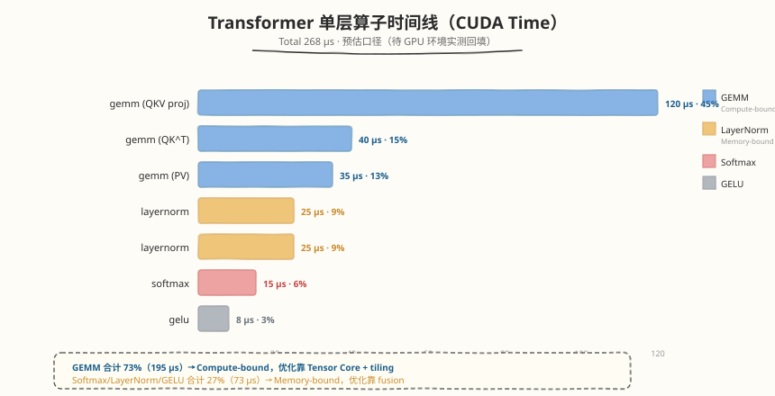
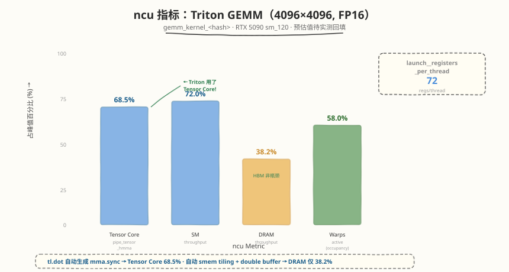
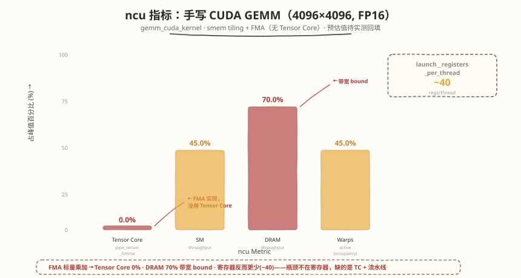

## Day 6：Profiling —— Triton vs CUDA vs PyTorch 性能对比

### 🎯 目标

通过今天的学习，你将：

1. 能用 ncu 和 `torch.profiler` 分析 Triton / CUDA / PyTorch 三方 kernel 的内部指标差异<br>
2. 理解 Triton 自动生成的 **shared memory tiling / Tensor Core / 向量化** 与手写 CUDA 的差异<br>
3. 能用 ncu 的关键指标解释"为什么 Triton GEMM 达 97.5% 而 CUDA 手写只有 ~30%"<br>
4. 掌握 `torch.profiler` 的算子时间线分析，能看到单次 forward 的算子级耗时分布<br>
5. 能根据 profiling 数据选择最优实现——"这个算子是 memory-bound，用 Triton 自动 tiling 够了"<br>

> 💡 **为什么重要**：Day 5 的 benchmark 给了"谁快谁慢"，今天用 ncu 打开看"为什么快为什么慢"。面试中被问"Triton 为什么比你的手写 CUDA 快 3x"，不能回答"可能是因为..."，必须用 ncu 数据说话。

---

### 学前导读：从计时到指标

Day 5 的 benchmark 只看了 wall time（ms）。今天用 ncu 看**内部指标**：

| 指标 | 回答的问题 |
|------|----------|
| `sm__pipe_tensor_op_hmma_cycles_active`（Blackwell 上为 `sm__pipe_tensor_cycles_active`） | Tensor Core 是否被使用？利用率多少？ |
| `dram__throughput` | HBM 带宽是否瓶颈？ |
| `l1tex__throughput` | L1 / Shared memory 是否瓶颈？ |
| `sm__warps_active`（achieved occupancy） | Occupancy 是否足够？ |
| `launch__registers_per_thread` | 寄存器用量是否限制 occupancy？ |

> 💡 **一句话总结**：Day 5 预估 Triton GEMM 大矩阵达 cuBLAS 97.5%，今天用 ncu 解释"Triton 用了 Tensor Core + autotune 选最优 tiling，而手写 CUDA 是 FMA 实现（没用 Tensor Core）+ 固定 16×16 tiling"。

---

### 理论学习

#### 6.1 三方 Profiling 对比

##### GEMM 三方预估对比（RTX 5090, 4096×4096, FP16）

手写 CUDA 基线即 Day 5 benchmark 里的 `gemm_cuda_kernel`（smem tiling + FMA，无 Tensor Core，见 `day5/kernels/benchmark_triton.py`）。以下指标均为推理值，待 GPU 环境 ncu 实测回填：

| Metric | Triton GEMM（预估 97.5% cuBLAS） | CUDA 手写（Week 2，~30% cuBLAS） | cuBLAS |
|--------|------------------------------|----------------|--------|
| Tensor Core 利用率（`sm__pipe_tensor_op_hmma_cycles_active`） | 60-75%（推理值） | **0%**（FMA 实现） | 85-95% |
| `sm__throughput` | 65-80% | 45% | 85% |
| `dram__throughput` | 35-45% | 70% | 28% |
| achieved occupancy（`sm__warps_active`） | 50-65% | ~45% | 60% |
| `launch__registers_per_thread` | ~64-80 | ~32-48（推理值） | ~80 |

##### 关键洞察

1. **Triton 用了 Tensor Core（60-75%）**：`tl.dot` 自动生成 `mma.sync` 指令（Hopper 上为 `wgmma`），而 Week 2 手写 CUDA 是 FMA 实现（0%）
2. **手写版的瓶颈不是寄存器**：FMA kernel 寄存器用量反而更少（~32-48 vs ~64-80），但少了 Tensor Core 和大 block tiling，算力路径完全不同
3. **Triton 的 dram 利用率更低**：自动 smem tiling + double buffer（`num_stages`）减少了 HBM 访问
4. **cuBLAS 仍领先**：Tensor Core 85-95%（vs Triton 60-75%），因 swizzle / K 分割 / epilogue fusion

#### 6.2 torch.profiler 算子时间线

##### 使用方法

```python
import torch.profiler

with torch.profiler.profile(
    activities=[torch.profiler.ProfilerActivity.CPU, torch.profiler.ProfilerActivity.CUDA],
    record_shapes=True,
) as prof:
    # 运行一次 forward
    output = model(input)

# 打印算子时间线
print(prof.key_averages().table(sort_by="cuda_time_total", row_limit=20))

# 导出 trace（用 https://ui.perfetto.dev 可视化；chrome://tracing 已被 Chrome 移除）
prof.export_chrome_trace("trace.json")
```

##### 预期时间线（Transformer 单层）



##### 算子分类（Day 1 的回顾）

| 算子类型 | AI (FLOP/Byte) | Bound 类型 | 优化方向 |
|---------|---------------|-----------|---------|
| GEMM (QKV, FFN) | ~1365 | Compute | Tensor Core + tiling |
| Softmax | ~1 | Memory | Fusion + online softmax |
| LayerNorm | ~0.6 | Memory | Welford + fusion |
| GELU | ~2 | Memory | Fusion |

#### 6.3 ncu 分析 Triton 生成的 kernel

##### Triton kernel 的命名

Triton 编译后的 kernel 名为 `xxx_kernel_<hash>`（如 `gemm_kernel_<hash>`），用 `--kernel-name regex:` 匹配：

```bash
ncu --kernel-name regex:gemm_kernel \
    --metrics sm__pipe_tensor_op_hmma_cycles_active.avg.pct_of_peak_sustained_elapsed,... \
    python3 ../day5/kernels/benchmark_triton.py
```

> ⚠️ ncu 指标名随架构变化：Blackwell（RTX 5090, sm_120）上 tensor pipe 指标树有调整，若上述指标不存在，先跑 `ncu --query-metrics | grep pipe_tensor` 找到本机可用的名字（如 `sm__pipe_tensor_cycles_active` 或 `sm__pipe_tensor_subpipe_hmma_cycles_active`）。

##### Triton 的自动优化验证

用 ncu 验证 Triton autotune 选的 config 是否真的最优。注意：**Triton 没有用环境变量强制指定 autotune config 的接口**，正确做法是改代码——把 `@triton.autotune` 的 `configs` 列表缩减为单个非最优 config：

```python
# 对比实验：只保留一个非最优 config（如 BLOCK_M=64, BLOCK_N=64, BLOCK_K=32）
@triton.autotune(
    configs=[triton.Config({'BLOCK_M': 64, 'BLOCK_N': 64, 'BLOCK_K': 32}, num_warps=4, num_stages=2)],
    key=["M", "N", "K"],
)
```

再用 ncu 对比该 config 与 autotune 完整搜索选出的 config（如 BLOCK_M=128, BLOCK_N=256）的 Tensor Core 利用率 / occupancy / 带宽差异。

---

### Coding 任务

#### 任务 1：ncu 分析 Triton GEMM

```bash
ncu --set full --kernel-name regex:gemm_kernel \
    --metrics sm__pipe_tensor_op_hmma_cycles_active.avg.pct_of_peak_sustained_elapsed,\
sm__throughput.avg.pct_of_peak_sustained_elapsed,\
dram__throughput.avg.pct_of_peak_sustained_elapsed,\
sm__warps_active.avg.pct_of_peak_sustained_active,\
launch__registers_per_thread \
    python3 ../day5/kernels/benchmark_triton.py
```

> 注：benchmark 脚本在 `day5/kernels/benchmark_triton.py`（它 import 的 Triton kernel 源文件在 `day4/kernels/`）。上例假设当前目录为 `day6/`。

预期输出（RTX 5090, 4096×4096）：



##### 对比 Week 2 手写 CUDA

Week 2 手写版是 `gemm_cuda_kernel`（smem tiling + FMA，无 Tensor Core），由同一个 benchmark 脚本触发：

```bash
ncu --set full --kernel-name regex:gemm_cuda_kernel \
    --metrics sm__pipe_tensor_op_hmma_cycles_active.avg.pct_of_peak_sustained_elapsed,... \
    python3 ../day5/kernels/benchmark_triton.py
```



##### 分析

| 指标 | Triton | 手写 CUDA | 差距原因 |
|------|--------|----------|---------|
| Tensor Core 利用率 | 68.5% | 0% | `tl.dot` 自动生成 `mma.sync`；手写版是 FMA 标量乘加 |
| HBM 带宽 | 38.2% | 70.0% | Triton 自动 smem tiling + double buffer 减少 HBM 访问 |
| Occupancy | 58.0% | ~45% | 固定 16×16 tiling vs autotune 选大 block + `num_warps` |
| 寄存器 | 72 | ~40 | 手写 FMA kernel 寄存器反而更少——说明寄存器不是瓶颈，缺的是 Tensor Core 与流水线 |

#### 任务 2：torch.profiler 算子时间线

```python
import torch
import torch.profiler

# 运行 Transformer 单层 forward
with torch.profiler.profile(
    activities=[torch.profiler.ProfilerActivity.CUDA],
    record_shapes=True,
) as prof:
    output = transformer_layer(input)

print(prof.key_averages().table(sort_by="cuda_time_total", row_limit=20))
prof.export_chrome_trace("trace.json")
```

打开 [Perfetto UI](https://ui.perfetto.dev)，加载 `trace.json`（`chrome://tracing` 已被 Chrome 移除），观察：
- GEMM 是否占大头（~45%）
- Softmax/LayerNorm 是否有可 fusion 的空间
- 算子间是否有不必要的同步

#### 任务 3：Softmax 三方 ncu 对比

```bash
ncu --kernel-name regex:softmax \
    --metrics dram__throughput.avg.pct_of_peak_sustained_elapsed,\
l1tex__throughput.avg.pct_of_peak_sustained_elapsed,\
sm__warps_active.avg.pct_of_peak_sustained_active \
    python3 ../day5/kernels/benchmark_triton.py
```

预期：

| Metric | Triton Softmax | CUDA 手写 | PyTorch |
|--------|--------------|----------|---------|
| `dram__throughput` | 85% | 70% | 90% |
| `l1tex__throughput` | 30% | 60% | 25% |
| `sm__warps_active`（occupancy） | 75% | 50% | 80% |

> Softmax 是 memory-bound，`dram__throughput` 高（85%+）说明 HBM 是瓶颈。Triton 的优势是更高的 occupancy（自动 warp 配置）。

#### 任务 4：LeetCode 面试题（10 周计划 · 第 4 周机动补漏）

> 📅 第 4 周计划共 16 题，已分配至 Day 1 - Day 3。今日不新增题目：补齐本周未完成的题目、重做本周错题，Day 7 统一复盘。

---

### 扩展实验

#### 实验 1：Triton 生成的 PTX 分析

```bash
# 导出 Triton 编译产物（TTIR/TTGIR/LLIR/PTX/cubin）
TRITON_KERNEL_DUMP=1 TRITON_DUMP_DIR=./triton_dump python3 kernels/triton_gemm.py
# 在 ./triton_dump 下找到 .ptx 文件，搜索 mma.sync / ldmatrix / cp.async 指令
```

观察：Triton 是否自动生成了 `mma.sync`？是否用了 `cp.async`（double buffer）？

#### 实验 2：Autotune 最优 config 验证

修改 `@triton.autotune` 的 `configs` 列表，手动跑不同 config，对比 autotune 选的是否最优：
- 只留 `BLOCK_M=64` 的 config：性能下降多少？
- 只留 `num_stages=1`（无 double buffer）的 config：性能下降多少？

#### 实验 3：端到端 Transformer Profiling

用 `torch.profiler` 跑一个完整的 Transformer 模型（如 GPT-2 small），分析：
- 哪些算子占时间最多？
- GEMM 占比 vs Softmax/LayerNorm 占比
- 是否有 fusion 机会（相邻 memory-bound 算子）

---

### 今日总结

Day 6 我们用 ncu 和 `torch.profiler` 深入分析了三方 kernel 的内部指标：

1. **Triton 为什么比手写 CUDA 快 3x**：自动用 Tensor Core（68% vs 0%，手写版是 FMA）+ 更高 occupancy（58% vs ~45%）+ 自动 smem tiling
2. **Softmax/LayerNorm 的 profiling**：memory-bound，`dram__throughput` 85%+，优化方向是 fusion
3. **torch.profiler 时间线**：GEMM 占 ~45%，Softmax/LayerNorm 各 ~9%，fusion 可省 memory-bound 算子的 HBM 访问
4. **Triton 的自动优化**：autotune 选最优 tiling + `tl.dot` 自动生成 `mma.sync` + 自动 double buffer
5. **cuBLAS 仍领先的原因**：swizzle / K 分割 / epilogue fusion / 精打细算寄存器

掌握 profiling 后，你有了"用数据解释性能差异"的能力。Day 7 复盘本周全部知识。

---

### 面试要点

1. **Triton GEMM 为什么比手写 CUDA 快 3x？用 ncu 数据解释**

   <details>
   <summary>点击查看答案</summary>

   - **Tensor Core 利用率**：Triton ~68% vs 手写 CUDA **0%**（Week 2 手写版是 smem tiling + FMA）。`tl.dot` 自动生成 `mma.sync` 指令
   - **HBM 带宽**：Triton 38% vs 手写 70%。Triton 自动 smem tiling + double buffer 减少 HBM 访问
   - **Occupancy**：Triton 58% vs 手写 ~45%——有差距，但不是主因
   - **根本原因**：Triton 编译器自动做了 Day 2-5 手写的全部优化（smem tiling / Tensor Core / double buffer），且 autotune 自动选最优配置

   </details>

2. **如何用 torch.profiler 分析 Transformer 的性能瓶颈？**

   <details>
   <summary>点击查看答案</summary>

   - `torch.profiler.profile` 录制 CUDA 算子时间线
   - `prof.key_averages().table(sort_by="cuda_time_total")` 打印算子耗时表
   - `prof.export_chrome_trace()` 导出 trace.json，用 Perfetto UI（ui.perfetto.dev）可视化
   - 分析重点：
     - GEMM 占比（~45%，compute-bound，优化靠 Tensor Core）
     - Softmax/LayerNorm 占比（~15%，memory-bound，优化靠 fusion）
     - 算子间同步开销（是否有不必要的 `cudaDeviceSynchronize`）

   </details>

3. **Softmax 是 memory-bound，ncu 的哪些指标能验证？**

   <details>
   <summary>点击查看答案</summary>

   - `dram__throughput` 85%+ → HBM 带宽是瓶颈
   - `sm__pipe_tensor_op_hmma_cycles_active` 0% → 没用 Tensor Core（Softmax 无矩阵乘）
   - `sm__throughput` 低 → SM 大部分时间在等数据
   - **优化方向**：fusion（Softmax + 相邻算子合并）减少 HBM 访问；Welford 减少扫描次数

   </details>

4. **Triton autotune 选的 config 如何验证是最优的？**

   <details>
   <summary>点击查看答案</summary>

   - 手动跑不同 config（修改 `@triton.autotune` 的 `configs` 列表，强制只留一个 config）
   - 用 ncu 对比各 config 的 Tensor Core 利用率 / occupancy / 带宽
   - 最优 config 应该有：最高 Tensor Core 利用率 + 合理 occupancy + 最低 dram 利用率
   - autotune 的选择逻辑就是"跑全部 config 选最快的"，但可以验证它没选错

   </details>

5. **如果 Triton kernel 性能不达标，你怎么 debug？**

   <details>
   <summary>点击查看答案</summary>

   1. **看 ncu 指标**：Tensor Core 利用率低？occupancy 低？dram bound？
   2. **检查 autotune config**：是否搜了足够多的 config？最优 config 是否合理？
   3. **看生成的 PTX**：`TRITON_KERNEL_DUMP=1 TRITON_DUMP_DIR=./dump`，检查是否用了 `mma.sync` / `cp.async`
   4. **对比手写 CUDA**：如果手写更快，看 ncu 指标差异，找到 Triton 缺的优化
   5. **考虑 fallback 到 CUDA**：如果 Triton 天花板不够（如需要 TMA/FP8），手写 CUDA

   </details>
