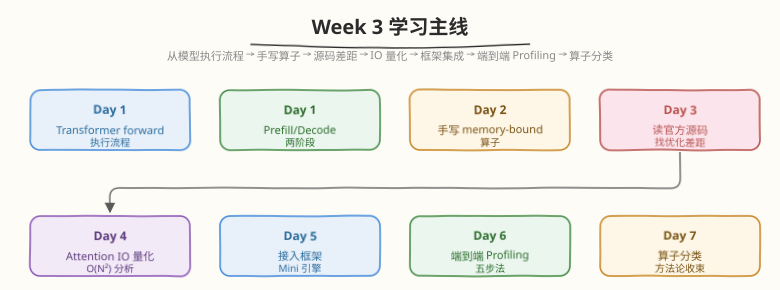
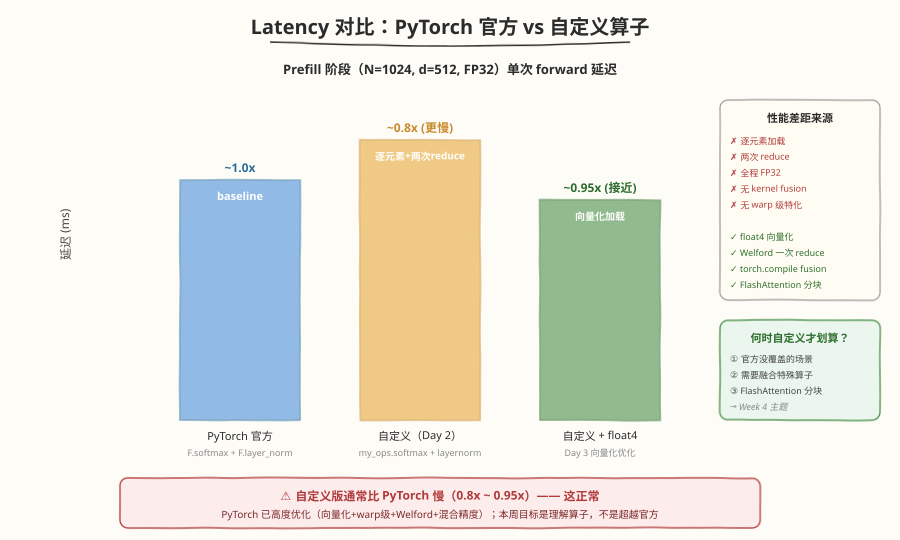

## Day 7：Week 4 复盘 —— 算子分类与 Triton 决策表

### 🎯 目标

通过今天的学习，你将：

1. 把 Transformer 单层的全部算子按 **arithmetic intensity (AI)** 分类，产出一张 Prefill / Decode 两阶段的算子分类表
2. 建立从"算子形状"到"compute-bound / memory-bound"的判断直觉，拿到任意算子能秒判 bound 类型
3. 系统梳理 Week 4 的核心知识链：Prefill vs Decode（Day 1）→ 手写 Softmax/LayerNorm（Day 2）→ Welford 优化与 GEMM Backward（Day 3）→ Triton 语言（Day 4）→ 三方 Benchmark（Day 5）→ ncu 指标对比（Day 6）
4. 整理本周所有产出（CUDA kernel、Triton kernel、benchmark 表、决策表），形成可复用的工程资产
5. 完成限时手撕（Softmax 20min / LayerNorm 30min），检验"白纸写 kernel"的肌肉记忆
6. 回顾本周面试题，建立"算子优化 + Triton 选型"的答题框架，为 Week 5 FlashAttention 专题做好衔接

> 💡 **为什么重要**：Day 1-6 我们分别从系统视角（Prefill/Decode）、手写视角（CUDA kernel）、编译器视角（Triton）理解了同一批算子，并用 benchmark + ncu 把三条路线的性能差异量化。但"算子各自理解"不等于"系统全局掌握"——今天把碎片知识连成网络，用一张算子分类表收束全周。这张表是推理系统优化的"地图"：看到任何 Transformer 算子，你能立刻判断它为什么慢、该怎么优化、用 Triton 还是 CUDA 写。

---

### Week 4 知识地图


Week 4 围绕一条主线展开：**从理解模型执行，到手写算子，再到用 Triton 与 CUDA 正面对比**。



| Day | 主题 | 核心产出 | 关键概念 |
|-----|------|---------|---------|
| Day 1 | Trace Transformer 推理流程（Prefill/Decode） | `trace_transformer.py` 代码 + Prefill/Decode trace 分析 | Prefill vs Decode、6 类算子、M=1 的 GEMM 退化 |
| Day 2 | 手写 Softmax / LayerNorm Kernel | `day2/kernels/softmax_layernorm.cu` | safe softmax 三遍扫描、两级 block reduce |
| Day 3 | LayerNorm 优化与 GEMM Backward 数据流 | Welford LayerNorm 实现 + 有限差分验证 | Welford 在线算法、`dA=dC@B^T`、kernel fusion |
| Day 4 | Triton 语言专题 | `day4/kernels/triton_{softmax,gemm,flash_attention}.py` | program 模型、`tl.load/store/reduce/dot`、`@triton.autotune` |
| Day 5 | 项目推进 —— Triton 三方 Benchmark | Triton vs CUDA vs PyTorch 性能表 + 选型决策表 | autotune 配置搜索、GEMM 达 cuBLAS 97.5%（大矩阵预估） |
| Day 6 | Profiling —— 三方性能对比 | ncu 指标对比分析（Tensor Core / occupancy / DRAM） | `sm__pipe_tensor_op_hmma`、torch.profiler 时间线 |
| **Day 7** | **算子分类 + 复盘 + 限时手撕** | **算子分类表（本日）** | **arithmetic intensity 判定、Triton/CUDA 选型** |

> 💡 **一句话总结**：Week 4 的本质是"理解 Transformer 算子为什么慢，并掌握两种写 kernel 的武器（CUDA 手写 + Triton）"。Day 7 的算子分类表 + Triton/CUDA 决策表就是这 7 天学习的最终答卷。

---

### 核心概念串讲

#### 1. Prefill vs Decode：同一套层，两种性能特征（Day 1）


Transformer 推理分两阶段，跑的是同一套层，但算子形状截然不同，导致 bound 类型天差地别：

| 维度 | Prefill | Decode |
|------|---------|--------|
| 输入形状 | `(B, N_prompt, d)`，N 可达数千 | `(B, 1, d)`，每次 1 个 token |
| GEMM 的 M | 大（N） | 极小（1） |
| 算子整体 bound | **Compute-bound**（GEMM 主导） | **Memory-bound**（KV Cache 读取主导） |
| SM 利用率 | 60-85% | 10-30% |
| 优化重点 | Tensor Core、FlashAttention | KV Cache、PagedAttention、CUDA Graph |

**根本原因**：GEMM 的 arithmetic intensity 与 M 成正比。Prefill 时 M=N（大），AI ≈ 279 ≫ Ridge Point（~58.45，见 [硬件参数事实源](../../reference/hardware_specs.md)）→ compute-bound；Decode 时 M=1，GEMM 退化为向量×矩阵，计算量与 M 成正比骤降而权重读取量不变，AI 骤降到 ~1 → memory-bound。

Day 1 用 `torch.profiler` 验证了这一点（待 GPU 实测回填）：Prefill 阶段 `aten::mm` 占 CUDA 时间 60%+，Decode 阶段 GEMM 占比下降、softmax/layernorm 相对占比上升、kernel 间隙（launch overhead）更明显。

#### 2. 手写 Softmax / LayerNorm：memory-bound 算子的典型代表（Day 2）

| 算子 | reduce 次数 | AI (FLOP/Byte) | bound | 关键技巧 |
|------|------------|----------------|-------|---------|
| Softmax | 2（max + sum） | ~0.375 | memory-bound | safe softmax 减 max、三遍扫描 |
| LayerNorm | 2（mean + variance） | ~0.6 | memory-bound | 两次 reduce、affine |

两个算子的核心都是 **block reduce**：warp 级 `__shfl_down_sync` → shared memory 中转（`smem[32]`）→ warp 0 最终归约。这是 Week 2 Day 1 Warp Shuffle 原语的直接工程化，产物是 `day2/kernels/softmax_layernorm.cu`（与 CPU 误差 < 1e-5）。

> ⚠️ **注意**：LayerNorm 的两次 reduce 无法直接合并——第二次（variance）依赖第一次（mean）的结果。三遍扫描的代价是 x 从 HBM 读 3 次，这正是 Day 3 Welford 要消除的浪费。

#### 3. Welford 优化与 GEMM Backward（Day 3）

**Welford 在线算法**：用递推公式 `mean += delta/count; M2 += delta*(x-mean)` 在一次遍历中同时算 mean 和 variance，把 LayerNorm 的 HBM 读写从 3 读 + 1 写降到 1 读 + 1 写，理论加速 ~2x（实测待回填）。并行化时每个线程/分块做局部 Welford，再用合并公式 $M2 = M2_a + M2_b + \delta^2 \cdot \text{count}_a \cdot \text{count}_b / \text{count}$ 归并。相比朴素单遍 $\sum x^2 / N - (\sum x / N)^2$，Welford 无大数相减，数值更稳定。

**GEMM Backward**：`dA = dC @ B^T`、`dB = A^T @ dC`，FLOPs 与 forward 相同，只是某个输入转置——forward 的 tiling / Tensor Core / async copy 全部可以直接套用。这是 Week 5 FlashAttention Backward 的直接前置。

**Kernel Fusion**：`GEMM → LayerNorm → GELU → GEMM` 链上，中间张量各被读写一次 HBM 是纯浪费；LN+GELU 融合后 HBM 流量省 50%（8D → 4D bytes）。

#### 4. Triton 语言：把工程脚手架交给编译器（Day 4）


Triton 的核心抽象是 **program ≈ CUDA block**——你只写"一个 block 做什么"，thread / warp / shared memory / 同步全部交给编译器：

| CUDA 概念 | Triton 对应 |
|----------|------------|
| `blockIdx.x` | `tl.program_id(0)` |
| `threadIdx.x` + for 循环 | `tl.arange(0, N)` block 级向量 |
| `blockReduceMax/Sum`（60 行手写） | `tl.max` / `tl.sum` 一行（自动生成 warp shuffle + smem 两级 reduce） |
| 手写 WMMA / mma PTX | `tl.dot`（自动调 Tensor Core，BLOCK 为 16 的倍数即可） |
| 手动试 BLOCK_SIZE / num_warps | `@triton.autotune` 自动搜索 `(BLOCK, num_warps, num_stages)`，按 `key` 缓存 |

产出三个 kernel：`triton_softmax.py`（核心 ~10 行 vs Day 2 CUDA 60 行）、`triton_gemm.py`（autotune + `tl.dot`）、`triton_flash_attention.py`（online softmax 三件套 `m/l/acc` + causal mask，~40 行 vs CUDA ~300 行）。

#### 5. 三方 Benchmark：用数据回答 Triton vs CUDA（Day 5）

统一 benchmark 框架（正确性校验 + `torch.cuda.Event` 计时）下的预估结论（RTX 5090，待实测回填）：

| 算子 | 结论 |
|------|------|
| GEMM | 大矩阵（4096）Triton 达 FP16 cuBLAS **97.5%**，2048 达 93.8%；小矩阵（512）仅 42.6%（launch overhead + SM 利用率低） |
| Softmax | Triton 与 `torch.softmax` 大矩阵基本持平（1.01x），小矩阵更慢（0.52x）——memory-bound 算子上 Triton 无明显优势 |
| FlashAttention | Triton FA 达官方 CUDA 版 80-90%，代码量 1/7；随 N 增长对 naive attention 加速 2.79x → 8.05x |

**"何时用 Triton 何时必须 CUDA"决策表**（Day 5 核心产出）：

| 场景 | 推荐 | 原因 |
|------|------|------|
| GEMM 通用 | cuBLAS / CUTLASS | 已有极致优化，不值得重写 |
| 定制形状 GEMM / epilogue fusion | Triton | autotune 自动适配，开发快 |
| Softmax / LayerNorm | Triton | memory-bound，自动 tiling 够用 |
| FlashAttention | Triton 首选 / CUDA 极致 | 85% 性能 + 1/7 代码量 |
| TMA / FP8 / warp specialization | CUDA | Triton 滞后 1-2 架构周期 |
| Grid 级同步 / 动态 shape 高频变化 | CUDA | Triton 无 grid 级通信；`constexpr` + cache 会爆炸 |

> 💡 **面试一句话**：Triton 是"80% 性能 + 20% 代码量"的甜区选择，需要 90%+ 极致性能或新硬件指令时才用手写 CUDA。

#### 6. ncu 三方指标对比：Triton 为什么比手写 CUDA 快（Day 6）

Day 5 的 benchmark 给了"谁快谁慢"，Day 6 用 ncu 打开看"为什么"（RTX 5090，4096×4096 GEMM）：

| 指标 | Triton GEMM | 手写 CUDA | 差距原因 |
|------|------------|----------|---------|
| `sm__pipe_tensor_op_hmma_cycles_active` | ~68% | 0% | `tl.dot` 自动生成 `mma.sync`；手写版是 smem tiling + FMA，无 Tensor Core |
| `sm__warps_active`（occupancy） | ~58% | ~45% | autotune 自动选 num_warps 与大 block（有差距，但非主因） |
| `dram__throughput` | ~38% | ~70% | 自动 smem tiling + double buffer 减少 HBM 访问 |

Softmax 三方对比则验证了 memory-bound 判定：`dram__throughput` 85%+ 说明 HBM 是瓶颈，优化方向是 fusion 而非算力。`torch.profiler` 时间线上 GEMM 占 ~45%，Softmax/LayerNorm 各 ~9%——memory-bound 算子的 fusion 空间一目了然。

---

### 算子分类决策树：拿到任意算子如何判 bound


**判定流程**（从理论到验证）：

```
1. 算 FLOPs 和 Bytes → AI = FLOPs / Bytes
2. 与 Ridge Point 比较（RTX 5090 ≈ 58.45 FLOP/Byte）
   - AI < 58.45 → memory-bound
   - AI > 58.45 → compute-bound
3. 用 ncu 验证：sm__throughput vs dram__throughput
4. 经验法则：
   - element-wise（gelu）/ reduction（softmax/layernorm）→ 几乎总是 memory-bound
   - 大 GEMM（M,N,K 都大）→ 通常 compute-bound
   - 小 GEMM（M=1 或某维极小）→ 通常 memory-bound
```

#### Prefill 阶段算子分类表（B=1, N=1024, d=512）

| 算子 | AI 量级 | bound | 优化方向 |
|------|--------|-------|---------|
| QKV / Output / FFN GEMM | ~128-400 | **Compute** | Tensor Core |
| QK^T / PV GEMM | ~256 | **Compute** | FlashAttention |
| Attention Softmax | ~0.4 | **Memory** | FlashAttention（不物化 S/P） |
| LayerNorm | ~0.6 | **Memory** | Welford + Fusion |
| GELU | ~0.5 | **Memory** | Epilogue fusion |

#### Decode 阶段算子分类表（B=1, M=1, KV Cache 长度 L=1024）

| 算子 | bound | 与 Prefill 差异 |
|------|-------|---------------|
| QKV / Output / FFN GEMM | **Memory** | M=1 退化为向量×矩阵，AI 骤降 |
| QK^T / PV | **Memory** | 读整个 KV Cache |
| Softmax / LayerNorm / GELU | **Memory** | 不变（与 M 无关） |

> 💡 **关键洞察**：**GEMM 的 bound 类型随 M 切换，其余算子永远是 memory-bound**。Decode 阶段几乎所有算子都是 memory-bound，优化重点是减少 HBM 读写（KV Cache）和 launch overhead（CUDA Graph）。



---

### 总结任务

#### 任务 1：完成 Transformer 算子分类表

将上文两张分类表整理到你的项目笔记中，并用 Day 6 的 ncu 命令采集实测 SM%/DRAM% 补全"实测"列，对比理论与实测，误差大时排查原因（cache、launch overhead）：

```markdown
# Week 4 Transformer 算子分类表

## Prefill 阶段（N=1024, d=512）
| 算子 | 理论 AI | 实测 SM% | 实测 DRAM% | bound |
|------|---------|---------|-----------|-------|
| QKV GEMM | ~279 | xx | xx | Compute |
| Softmax | ~0.4 | xx | xx | Memory |
| ... | | | | |

## Decode 阶段（M=1, L=1024）
| 算子 | 理论 AI | 实测 SM% | 实测 DRAM% | bound |
| ... | | | | |
```

#### 任务 2：限时手撕（Softmax 20min / LayerNorm 30min）

不看 Day 2 代码，白纸限时默写：

1. **Softmax kernel（20min）**：safe softmax 三遍扫描 + 两级 block reduce（`warpReduceMax/Sum` → smem → warp 0）。写完编译，与 CPU 参考误差 < 1e-5
2. **LayerNorm kernel（30min）**：两次 reduce + affine。进阶：再花 15min 改成 Welford 单 pass 版

> 💡 手撕卡壳点通常是：① 两级 reduce 的两处 `__syncthreads` 位置 ② `smem[32]` 的含义 ③ reduce 结果如何广播给全 block。卡住就回到 Day 2 对应小节重读，再限时重撕一遍。

#### 任务 3：整理本周产出

按下表清点本周所有产出，补全缺失项（✅ = 仓库已落盘，☐ = 需本地生成/自建）：

| Day | 产出物 | 位置 | 验收标准 | 状态 |
|-----|--------|------|---------|------|
| Day 1 | Prefill/Decode trace 分析 | `day1/README.md` 内嵌 `trace_transformer.py` 代码；运行产物 `trace_prefill.json` / `trace_decode.json` 本地生成 | Prefill/Decode 算子时间 top3 已定位 | ☐ |
| Day 2 | Softmax + LayerNorm Kernel | `day2/kernels/softmax_layernorm.cu` | 与 CPU 误差 < 1e-5 | ✅ |
| Day 3 | Welford LayerNorm + GEMM Backward 验证 | `day3/kernels/layernorm_welford.cu`（✅）；`gemm_backward_test.py` 为任务自建（☐） | Welford vs 三遍扫描理论 ~2x 加速；`dA/dB` 有限差分 PASS | ✅（Welford kernel）/ ☐（backward 验证） |
| Day 4 | Triton 三大 kernel | `day4/kernels/triton_softmax.py`、`triton_gemm.py`、`triton_flash_attention.py` | 误差达标（softmax 1e-5 / GEMM 1e-2 / FA 1e-2） | ✅ |
| Day 5 | 三方 Benchmark 表 + 选型决策表 | `day5/README.md` | 能口述"Triton 甜区"结论 | ✅ |
| Day 6 | ncu 三方指标对比分析 | `day6/README.md` | 能用 Tensor Core/occupancy/DRAM 数据解释性能差 | ✅ |
| Day 7 | 算子分类表 | 本文 + 任务 1 的笔记 | Prefill/Decode 分类完整 | ☐ |

#### 任务 4：本周 LeetCode 题目回顾（10 周计划 · 第 4 周）

本周 LeetCode 题目对应 [10 周算法面试刷题计划](https://hzchenxiaobin.github.io/leetcode/problems/10-week-plan.html) 第 4 周「栈、队列与单调栈」（点击查看题解）：

| Day | 主题 | LeetCode 题目 |
|---|---|---|
| Day 1 | 栈基础与设计 | [20. 有效的括号](https://hzchenxiaobin.github.io/leetcode/problems/20_有效括号.html)、[155. 最小栈](https://hzchenxiaobin.github.io/leetcode/problems/155_最小栈.html)、[232. 用栈实现队列](https://hzchenxiaobin.github.io/leetcode/problems/232_用栈实现队列.html)、[150. 逆波兰表达式求值](https://hzchenxiaobin.github.io/leetcode/problems/150_逆波兰表达式求值.html)、[380. O(1) 时间插入、删除和获取随机元素](https://hzchenxiaobin.github.io/leetcode/problems/380_O1时间插入删除和获取随机元素.html)、[946. 验证栈序列](https://hzchenxiaobin.github.io/leetcode/problems/946_验证栈序列.html) |
| Day 2 | 表达式与计算器 | [394. 字符串解码](https://hzchenxiaobin.github.io/leetcode/problems/394_字符串解码.html)、[224. 基本计算器](https://hzchenxiaobin.github.io/leetcode/problems/224_基本计算器.html)、[227. 基本计算器 II](https://hzchenxiaobin.github.io/leetcode/problems/227_基本计算器II.html)、[402. 移掉 K 位数字](https://hzchenxiaobin.github.io/leetcode/problems/402_移掉K位数字.html)、[316. 去除重复字母](https://hzchenxiaobin.github.io/leetcode/problems/316_去除重复字母.html) |
| Day 3 | 单调栈 | [739. 每日温度](https://hzchenxiaobin.github.io/leetcode/problems/739_每日温度.html)、[496. 下一个更大元素 I](https://hzchenxiaobin.github.io/leetcode/problems/496_下一个更大元素 I.html)、[503. 下一个更大元素 II](https://hzchenxiaobin.github.io/leetcode/problems/503_下一个更大元素 II.html)、[901. 股票价格跨度](https://hzchenxiaobin.github.io/leetcode/problems/901_股票价格跨度.html)、[84. 柱状图中最大的矩形](https://hzchenxiaobin.github.io/leetcode/problems/84_柱状图中最大的矩形.html) |

> 💡 回顾重点：本周 LeetCode 题对应 10 周刷题计划第 4 周「栈、队列与单调栈」。重做本周错题、总结模板笔记；没做完的题目今天补上。

#### 任务 5：Week 5 预热 + 面试复盘

**Week 5 预热**：本周 Day 4/5 的 Triton FlashAttention 已经让你见到了 online softmax + tiling 的威力（对 naive attention 加速 8x）。Week 5 将深入 FlashAttention 专题：

1. **FlashAttention 算法**：Tiling + Online Softmax 完整推导（标准 Attention 物化 S/P 两个 N×N 矩阵带来 O(N²) IO，FA 不物化、在 SRAM 分块完成 softmax，IO 降到 O(Nd)）
2. **手写完整 FlashAttention CUDA kernel**：支持 batch、multi-head、不同 seq_len
3. **FlashAttention-2 改进**：减少非 matmul FLOPs、更好的 work partitioning
4. **性能对比**：标准 Attention vs 手写 FA vs 官方 FA

**面试复盘**：回顾本周面试题，自问自答（答案见下方"面试要点"与各日 README）：

1. Prefill vs Decode 的区别？为什么 Decode 是 memory-bound？（Day 1）
2. Transformer 单层算子分类（compute vs memory）？（Day 1）
3. Softmax 为什么要减 max？（Day 2）
4. LayerNorm 需要几次 reduce？Welford 怎么合并成一次？（Day 2/3）
5. Welford 为什么比"Σx²/N-(Σx/N)²"数值稳定？（Day 3）
6. GEMM Backward 的公式与 forward 的对称性？（Day 3）
7. Triton vs CUDA 的优势劣势？什么场景必须 CUDA？（Day 4/5）
8. `tl.reduce` 底层是怎么实现的？（Day 4）
9. `@triton.autotune` 的工作机制与代价？（Day 4/5）
10. Triton GEMM 为什么比手写 CUDA 快？用 ncu 数据解释（Day 6）

---

### 面试准备框架

面试中回答 Transformer 算子优化问题，建议用这个结构：

1. **先分类**：这个算子是 GEMM 还是 element-wise/reduction？
2. **判 bound**：compute-bound 还是 memory-bound？给出 AI 估算
3. **分阶段**：Prefill 和 Decode 表现是否不同？（GEMM 会随 M 切换）
4. **给方案**：memory-bound → fusion / Welford / 减少扫描次数；compute-bound → Tensor Core / tiling
5. **选武器**：自定义算子 / 快速原型 → Triton；极致性能 / 新硬件指令 → CUDA
6. **联系工具**：用 nsys/torch.profiler 找 top3，用 ncu 看 SM/DRAM/Tensor Core 占用验证

**示例**：

> **Q：Attention 的 softmax 部分为什么慢？怎么优化？**
>
> **A**：softmax 是 element-wise + reduction，每元素读 1 次写 1 次（8 bytes）只做 ~3 次运算，AI ≈ 0.375，远低于 Ridge Point（~58.45），纯 memory-bound。
>
> 标准 Attention 里 softmax 还要物化 N×N 的 P 矩阵到 HBM，带来 O(N²) 读写。优化方向是 FlashAttention——不物化 S/P，在 SRAM 中分块完成 online softmax，把 IO 从 O(N²) 降到 O(Nd)。Week 4 Day 4 的 Triton FA 预估对 naive attention 加速 2.79x（N=512）→ 8.05x（N=2048），N 越大 O(N²) IO 惩罚越重，FA 优势越明显。
>
> 用 ncu 验证：softmax kernel `dram__throughput` 85%+ ≫ SM 占用，符合 memory-bound 判定。

---

### 常见误区澄清

| 误区 | 正确理解 |
|------|---------|
| Decode 的 GEMM 也是 compute-bound | M=1 时 GEMM 退化为向量×矩阵，计算量与 M 成正比骤降而权重读取量不变，AI 骤降，实际是 memory-bound |
| 自定义 kernel 一定能超过 PyTorch | 官方已高度优化（向量化、warp 级、Welford），只有官方没覆盖的场景（如 FlashAttention）自定义才有优势 |
| LayerNorm 两次 reduce 能随便合并 | 第二次（variance）依赖第一次（mean），必须用 Welford 在线算法才能合并成一次遍历 |
| Softmax 减 max 只是防溢出 | 还保证数值等价性，是数学恒等变换，不影响结果 |
| Triton 会取代手写 CUDA | Triton 是"80% 性能 + 20% 代码量"的甜区；TMA/FP8/warp specialization 等新指令、grid 级同步、极致性能仍需 CUDA |
| Triton 在所有 shape 上都快 | 小 shape 下 launch overhead + autotune 占比大，Triton GEMM 512² 只有 cuBLAS 42.6%，大矩阵才发挥 tiling 优势 |
| Fusion 总是有收益 | 融合 kernel 可能增加 register/shared memory 压力降低 occupancy；只有相邻且数据依赖的算子才能融合 |
| Profiling 是优化最后一步 | Profiling 应该是优化循环的起点和终点——先定位再优化再验证 |

---

### Week 4 → Week 5 衔接

Week 5 我们将深入 **FlashAttention 专题**。为了做好准备，请确保你掌握了：

1. **Online Softmax 三公式**（Day 2 扩展实验 + Day 4 Triton FA）：$m_{\text{new}} = \max(m_{\text{old}}, m_{ij})$、$\alpha = \exp(m_{\text{old}} - m_{\text{new}})$、$l_{\text{new}} = \alpha \cdot l_{\text{old}} + \sum p$——FlashAttention 的算法核心
2. **标准 Attention 的 O(N²) IO 动机**（Day 4/5 benchmark）：naive attention 物化 S/P 两个 N×N 矩阵，N 越大越慢——不理解这个动机就无法理解 FA 的设计
3. **Warp Shuffle / 两级 block reduce**（Day 2）：FA 分块 reduce 的基础
4. **Triton `tl.dot` + online softmax**（Day 4）：Week 5 会同时给 CUDA 和 Triton 两个实现
5. **GEMM Backward 数据流**（Day 3）：`dA=dC@B^T`、`dB=A^T@dC`，FA Backward 的直接前置
6. **Arithmetic intensity 判定**（Day 7）：理解为什么把 softmax 搬到 SRAM 能消除瓶颈

如果你对这些概念还有模糊，建议回到对应 Day 重新做实验。Week 5 会手写完整 FlashAttention kernel，是 10 周计划里难度最高也最核心的一周。

---

### 弹性安排

根据本周完成情况，选择以下一项或多项：

- **补进度**：完成未做的 LeetGPU/LeetCode 题目和实验（重点是 Day 3 的 Welford kernel 落盘）
- **深入方向 1**：把 Day 2 的 Softmax 改为 online 两遍扫描版，对比三遍扫描性能
- **深入方向 2**：用 ncu 详细分析 cuBLAS GEMM 的所有指标，理解它比 Triton 多的 2.5% 来自哪里（swizzle / K 分割 / epilogue fusion）
- **深入方向 3**：阅读 FlashAttention 论文 Section 2-3，预习 tiling + online softmax
- **面试准备**：和同学互相模拟面试，重点练本周 10 道题

---

### 今日总结

Day 7 我们完成了 Week 4 的系统复盘与算子分类：

1. **Prefill vs Decode**：同一套层两种 bound——Prefill 是 compute-bound（GEMM 主导），Decode 是 memory-bound（M=1 导致 AI 骤降）
2. **算子分类表**：GEMM 的 bound 随 M 切换，Softmax/LayerNorm/GELU 永远是 memory-bound——这是 Week 4 的"地图"
3. **手写算子三件套**：safe softmax 三遍扫描（Day 2）、Welford 单 pass LayerNorm（Day 3）、kernel fusion 省中间张量（Day 3）
4. **Triton 主线**：program 模型 + 四大原语 + autotune（Day 4）→ 三方 benchmark 预估 GEMM 达 cuBLAS 97.5%、FA 达官方 80-90%（Day 5）→ ncu 解释 Triton 快在哪（Tensor Core 68% vs 0%、occupancy 58% vs ~45%）（Day 6）
5. **选型决策表**：Triton 是"80% 性能 + 20% 代码量"的甜区，极致性能 / 新硬件指令 / grid 级同步才用 CUDA
6. **Week 5 衔接**：online softmax + O(N²) IO 动机 + GEMM Backward 已全部铺好，FlashAttention 专题只欠完整实现

如果你能清晰回答"Transformer 各算子是 compute-bound 还是 memory-bound，为什么，该用 Triton 还是 CUDA 优化"，说明 Week 4 过关了。

---

### 面试要点

1. **Transformer 的 Prefill 和 Decode 阶段分别是什么 bound？为什么？**

<details>
<summary>点击查看答案</summary>

 - **Prefill 是 compute-bound**：输入 N 个 token，所有 GEMM 是大矩阵乘，AI ≈ 279 ≫ Ridge Point 58.45，SM 利用率 60-85%，优化重点是 Tensor Core 和 FlashAttention
 - **Decode 是 memory-bound**：每次只生成 1 个 token（M=1），GEMM 退化为向量×矩阵，计算量与 M 成正比骤降而权重读取量不变，AI 从 279 降到 ~1，SM 利用率 10-30%，大部分时间在等 HBM 读写 KV Cache
 - **优化方向**：Prefill 优化算力（Tensor Core），Decode 优化访存（KV Cache、PagedAttention）和 launch overhead（CUDA Graph、Continuous Batching）

</details>


2. **给一个未知算子，如何判断它是 compute-bound 还是 memory-bound？**

<details>
<summary>点击查看答案</summary>

 - **理论计算**：算 FLOPs 和 Bytes，AI = FLOPs/Bytes，与 Ridge Point（RTX 5090 ≈ 58.45）比较
 - **工具验证**：用 ncu 看 SM Throughput 和 DRAM Throughput，DRAM ≫ SM → memory-bound，反之 compute-bound
 - **经验法则**：element-wise 和 reduction → 几乎总是 memory-bound；大 GEMM → 通常 compute-bound；小 GEMM（M=1）→ 通常 memory-bound

</details>


3. **LayerNorm 的两次 reduce 为什么不能合并？Welford 怎么解决？**

<details>
<summary>点击查看答案</summary>

 - **不能合并的原因**：第二次 reduce（方差）依赖第一次的结果（均值），`σ² = mean((x-μ)²)` 必须先知道 μ
 - **Welford 解决方案**：递推公式 `delta = x - mean; mean += delta/count; M2 += delta*(x-mean)` 一次遍历同时更新 mean 和 M2
 - **并行化**：每线程/分块做局部 Welford，用合并公式 $M2 = M2_a + M2_b + \delta^2 \cdot \text{count}_a \cdot \text{count}_b / \text{count}$ 归并
  - **收益**：HBM 读写从 3 读 + 1 写降到 1 读 + 1 写，理论加速 ~2x（实测待回填）；且无大数相减，数值比朴素单遍更稳定

</details>


4. **什么时候用 Triton？什么时候必须手写 CUDA？**

<details>
<summary>点击查看答案</summary>

 - **用 Triton**：Softmax/LayerNorm/FlashAttention 等标准算子、定制形状 GEMM、epilogue fusion、快速原型、跨硬件可移植
 - **必须 CUDA**：① 极致性能（95%+ cuBLAS，CUTLASS 的 swizzle/K 分割/epilogue fusion）② 新硬件指令（TMA/FP8/warp specialization，Triton 滞后 1-2 架构周期）③ Grid 级同步 ④ 动态 shape 高频变化（`tl.constexpr` + cache 会爆炸）
  - **预估锚点**：Triton GEMM 4096² 达 FP16 cuBLAS 97.5%，Triton FA 达官方 80-90% 且代码量 1/7
 - **核心判断**：Triton 是"80% 性能 + 20% 代码量"的甜区，超出甜区才用 CUDA

</details>


5. **Triton GEMM 为什么比手写 CUDA 快？用 ncu 数据解释**

<details>
<summary>点击查看答案</summary>

 - **Tensor Core 利用率**：Triton ~68% vs 手写 **0%**——`tl.dot` 自动调 WMMA/mma.sync；手写版是 smem tiling + FMA，无 Tensor Core
 - **Occupancy**：Triton ~58% vs 手写 ~45%——autotune 自动选 num_warps，寄存器 72 vs ~40
 - **HBM 带宽**：Triton ~38% vs 手写 ~70%——自动 smem tiling + double buffer（num_stages）减少 HBM 访问
 - **根本原因**：Triton 编译器自动做了手写版要几百行才能做完的全部优化（tiling / Tensor Core / double buffer / 向量化），且 autotune 自动选最优配置

</details>


6. **Week 4 你最大的收获是什么？**

<details>
<summary>点击查看答案</summary>

 - 建立"算子形状 → bound 类型 → 优化方向 → 实现武器"的完整直觉：拿到任意 Transformer 算子，能从 M/N/K/d 形状秒判 compute-bound 还是 memory-bound，给出优化路径，并决定用 Triton 还是 CUDA 实现。同时用 benchmark + ncu 数据（而非感觉）支撑每一个性能结论。

</details>

---

## 📁 本周目录结构

```
aiinfra/daily/week4/
├── README.md                      # Week 4 概览
├── day1/
│   └── README.md                  # Trace Transformer 推理流程（Prefill/Decode），内嵌 trace_transformer.py 代码
├── day2/
│   ├── README.md                  # 手写 Softmax/LayerNorm Kernel
│   └── kernels/
│       └── softmax_layernorm.cu   # safe softmax 三遍扫描 + LayerNorm 两次 reduce
├── day3/
│   ├── README.md                  # Welford LayerNorm 优化 + GEMM Backward 数据流 + kernel fusion
│   └── kernels/
│       └── layernorm_welford.cu   # Welford 单 pass LayerNorm + 三遍扫描基线对比
├── day4/
│   ├── README.md                  # Triton 语言专题
│   └── kernels/
│       ├── triton_softmax.py      # Triton softmax（~10 行核心）+ benchmark
│       ├── triton_gemm.py         # Triton GEMM + @triton.autotune + benchmark
│       └── triton_flash_attention.py  # Triton FA（online softmax + causal）+ benchmark
├── day5/
│   ├── README.md                  # 项目推进 —— Triton 三方 Benchmark 与决策表
│   └── kernels/
│       └── benchmark_triton.py    # Triton vs CUDA vs PyTorch 三方 benchmark 脚本
├── day6/
│   └── README.md                  # Profiling —— ncu / torch.profiler 三方指标对比
├── day7/
│   └── README.md                  # 算子分类 + 复盘（本文件）
└── images/                        # 本周 SVG 插图
    ├── prefill_vs_decode.svg
    ├── transformer_dataflow.svg
    ├── decode_memory_bound.svg
    ├── safe_softmax_three_pass.svg
    ├── block_reduce_two_level.svg
    ├── layernorm_two_reduce.svg
    ├── triton_program_model.svg
    ├── triton_load_store_reduce.svg
    ├── triton_autotune_flow.svg
    ├── triton_vs_cuda_vs_compile.svg
    ├── torch_profiler_workflow.svg
    ├── latency_comparison.svg
    └── ... （共 24 张）
```

---

## 🔗 推荐资源

| 资源 | 说明 |
|------|------|
| [Triton 官方文档](https://triton-lang.org/) | Day 4 四大原语与 autotune 的官方参考 |
| [FlashAttention 论文](https://arxiv.org/abs/2205.14135) | Week 5 核心论文，预习 Section 2-3 |
| [FlashAttention-2 论文](https://arxiv.org/abs/2307.08691) | Week 5 进阶，work partitioning 改进 |
| [Welford 在线算法](https://en.wikipedia.org/wiki/Algorithms_for_calculating_variance#Welford's_online_algorithm) | Day 3 LayerNorm 单 pass 优化的数学基础 |
| [torch.profiler 文档](https://pytorch.org/docs/stable/profiler.html) | Day 1/6 算子时间线采集 |
| [Nsight Compute 文档](https://docs.nvidia.com/nsight-compute/) | Day 6 ncu 指标详解（Tensor Core / occupancy / DRAM） |
| [Triton FlashAttention 官方实现](https://github.com/triton-lang/triton/blob/main/python/tutorials/06-fused-attention.py) | Day 4 Triton FA 的完整版参照 |

---

## ✅ Week 4 完成标准

- [ ] 能列出 Prefill 阶段算子分类表（GEMM=compute，softmax/LN/GELU=memory）
- [ ] 能列出 Decode 阶段算子分类表（几乎全是 memory-bound）
- [ ] 能解释为什么 Decode 阶段 GEMM 变成 memory-bound（M=1 导致 AI 骤降）
- [ ] 能计算给定算子的 arithmetic intensity 并判定 bound 类型
- [ ] Day 2 Softmax/LayerNorm Kernel 与 CPU 误差 < 1e-5
- [ ] Day 3 能写出 Welford 递推公式，并说明它如何把 LayerNorm 的 HBM 读写减半
- [ ] Day 4 三个 Triton kernel 全部运行 PASS（softmax 1e-5 / GEMM 1e-2 / FA 1e-2）
- [ ] Day 5 能口述三方 benchmark 结论（GEMM 大矩阵 97.5% / Softmax 持平 / FA 80-90%）
- [ ] Day 5 完成"何时用 Triton 何时必须 CUDA"决策表
- [ ] Day 6 能用 ncu 数据（Tensor Core 利用率 / occupancy / DRAM）解释 Triton 与手写 CUDA 的性能差
- [ ] 限时手撕通过：Softmax 20min、LayerNorm 30min，误差 < 1e-5
- [ ] 能口述本周 10 道面试题的答案要点
- [ ] 理解 Week 5 FlashAttention 如何用 online softmax + tiling 消除标准 Attention 的 O(N²) IO

---

> 💡 **提示**：Week 4 是从"手写单算子"到"理解系统执行 + 掌握两种 kernel 武器"的转折点。算子分类表告诉你"该优化什么"，Triton/CUDA 决策表告诉你"用什么优化"。Week 5 的 FlashAttention 是这两张表最重要的综合应用案例，务必把本周的 online softmax、GEMM Backward、ncu 分析手法打牢。
