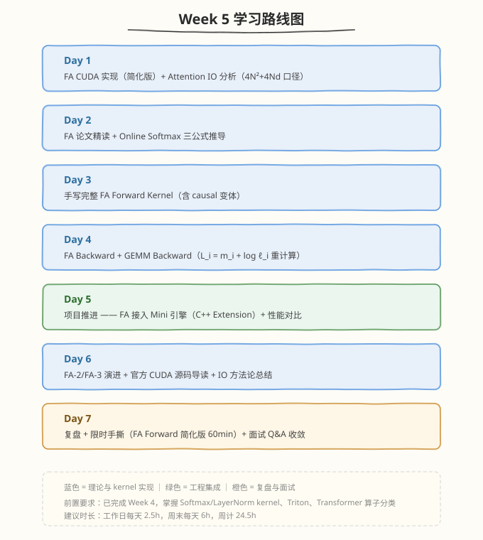

# Week 5：FlashAttention 全专题

> 核心目标：从 FA 简化版到 FA-3 的完整专题：Online Softmax 推导、Forward/Backward kernel、官方源码、性能对比与 IO 方法论

| 项目　　　 | 说明　　　　　　　　　　　　　　　　　　　　　　　　　　　　　|
| ------------| ------------------------------------------------------------|
| 前置要求　 | 已完成 Week 4，掌握 Softmax/LayerNorm kernel、Triton、Transformer 算子分类　　　　　　　　　　　　　　　　　　　　　　　|
| 建议时长　 | 工作日每天 2.5h，周末每天 6h，周计 24.5h　　　　　　　　　　|
| 本周产出　 | FA 简化版 kernel、FA Forward/Backward kernel、FA 接入 Mini 引擎、标准 vs 手写 vs 官方性能对比、IO 方法论总结　　　　　　　　　　　　　　　　　　　　　　　　　|
| 周日里程碑 | 手写 FA Forward kernel 正确性 PASS，FA 端到端性能对比留档，理解 online softmax 三公式与 FA-2/3 演进　　　　　　　　　　　　　　　　　　　　　　　|

---

## 🧭 本周学习地图

---

## 📚 每日学习材料

| Day | 主题 | 目录 |
|-----|------|------|
| Day 1 | FlashAttention CUDA 实现（简化版）+ Attention IO 分析 | [day1/](https://hzchenxiaobin.github.io/ai-infra-notes/week5/day1.html) |
| Day 2 | FlashAttention 论文精读与 Online Softmax 推导 | [day2/](https://hzchenxiaobin.github.io/ai-infra-notes/week5/day2.html) |
| Day 3 | 手写完整 FlashAttention Forward Kernel | [day3/](https://hzchenxiaobin.github.io/ai-infra-notes/week5/day3.html) |
| Day 4 | FlashAttention Backward 与 GEMM Backward | [day4/](https://hzchenxiaobin.github.io/ai-infra-notes/week5/day4.html) |
| Day 5 | 性能对比分析 —— 标准 vs 手写 vs 官方 + FA 集成 | [day5/](https://hzchenxiaobin.github.io/ai-infra-notes/week5/day5.html) |
| Day 6 | FlashAttention-2 论文与源码差异 + 官方源码 + IO 方法论 | [day6/](https://hzchenxiaobin.github.io/ai-infra-notes/week5/day6.html) |
| Day 7 | 复盘与手撕 —— FlashAttention 限时手写与面试 Q&A | [day7/](https://hzchenxiaobin.github.io/ai-infra-notes/week5/day7.html) |

