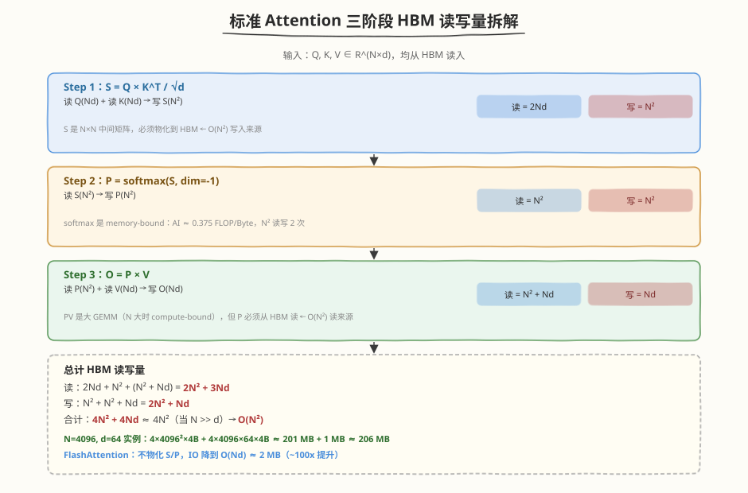
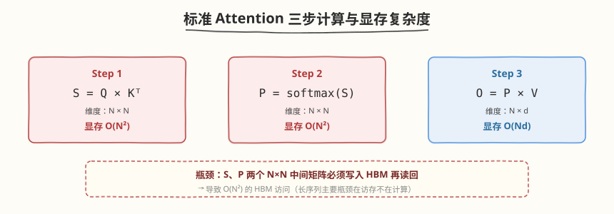
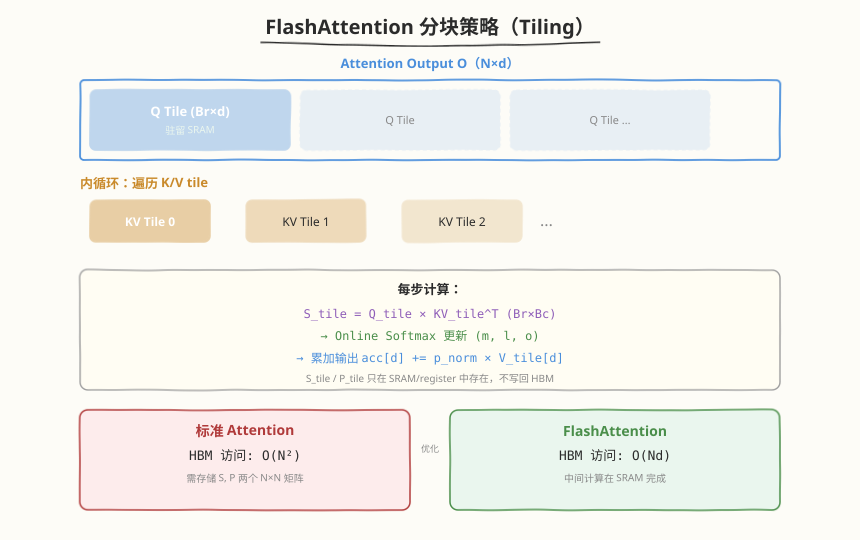
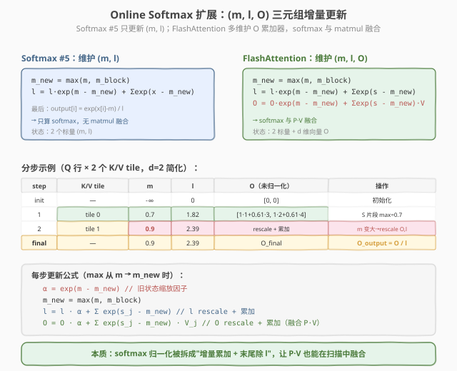
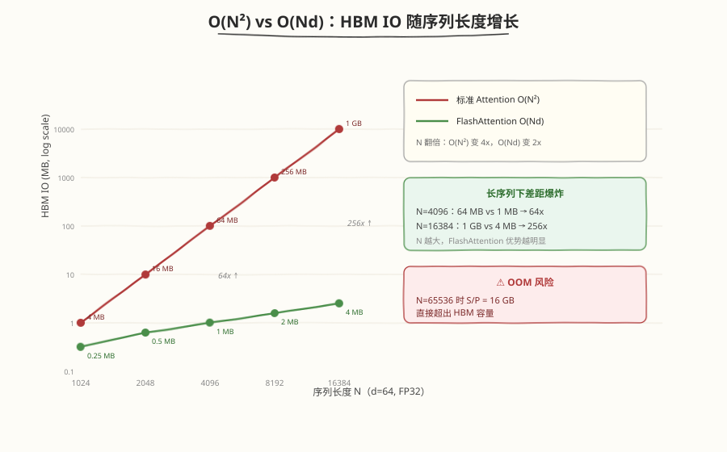

## Day 2：FlashAttention 论文精读与 Online Softmax 推导

### 🎯 目标

通过今天的学习，你将：

1. 理解标准 Attention 的 **$O(N^2)$ HBM 访问瓶颈**——物化 $S=QK^\top$ 和 $P=\text{softmax}(S)$ 两个 $N \times N$ 矩阵<br>
2. 掌握 FlashAttention 的两大核心创新：**Tiling 分块** + **Online Softmax 递推**<br>
3. 能独立白板推导 **Online Softmax 三公式**（max/sum/output 更新），并解释 $\exp(m - m_{\text{new}})$ 缩放因子的作用<br>
4. 理解 FlashAttention 的 HBM 访问从 $O(N^2)$ 降到 $O(Nd)$ 的理论推导，以及实际 wall-clock 加速只有 2-8x 的原因<br>
5. 能计算给定 $B_r/B_c/d$ 下的 **SRAM 使用量**，判断分块参数是否超限<br>

> 💡 **为什么重要**：FlashAttention 是推理系统面试的第一考点。Day 1 我们分析了标准 Attention 的 $O(N^2)$ IO 问题并跑了简化版 kernel，今天从论文出发做精读：IO 严格界、wall-clock 加速只有 2-8x 的原因、PyTorch 教学版验证——这是 Week 5 全周的理论基石。明天手写完整 Forward Kernel、后天读官方源码、大后天学 FA2 改进，全部建立在今天的三公式之上。能白板推导这三行公式，是 AI Infra 岗位的硬门槛。

---

### 学前导读：标准 Attention 的 $O(N^2)$ 瓶颈，FlashAttention 怎么破

Day 1 我们拆解过标准 Attention 的 HBM 读写量：当 N=4096 时，S 和 P 两个 $N \times N$ 中间矩阵各占 64MB，总 HBM IO 高达 ~206MB（逐阶段拆解见 1.1 节）。这就是 $O(N^2)$ 瓶颈的来源——**softmax 和第二个 GEMM 之间必须物化 P 矩阵到 HBM**，因为 cuBLAS 要求输入是连续内存矩阵，softmax 与 GEMM 之间没有原生融合接口。

FlashAttention 的破局思路很直接：**不物化 S 和 P，在 SRAM（Shared Memory）中完成 softmax + 累加**。但这里有个数学障碍——标准 softmax 需要全局 max 做数值稳定（safe softmax），分块后每个 tile 只能看到局部数据，无法直接得到全局 max。

| 策略 | 标准 Attention | FlashAttention |
|------|---------------|----------------|
| S/P 物化 | 写回 HBM（$O(N^2)$） | 不物化，留在 SRAM |
| softmax | 全局 max 一次算完 | 分块 online 递推更新 |
| HBM IO | $O(N^2 + Nd) \approx O(N^2)$ | $O(Nd)$ |
| 长序列 N=8192 | ~805 MB | ~4 MB |

> 💡 **一句话总结**：FlashAttention 的核心不是减少 FLOPs（计算量相同），而是用 online softmax 解决"分块后无法算全局 max"的数学障碍，从而把 softmax + GEMM 融合在 SRAM 里完成，消除 $O(N^2)$ 的 HBM 读写。

---

### 理论学习

#### 1.1 标准 Attention 的 IO 痛点回顾





各阶段 HBM 读写量（N=4096, d=64, FP32）：

| 阶段 | 读 HBM | 写 HBM | 小计 |
|------|--------|--------|------|
| Step 1: $S=QK^\top$ | $2Nd$ | $N^2$ | $2Nd + N^2$ |
| Step 2: $P=\text{softmax}(S)$ | $N^2$ | $N^2$ | $2N^2$ |
| Step 3: $O=PV$ | $N^2 + Nd$ | $Nd$ | $N^2 + 2Nd$ |
| **总计** | **$2Nd + 3N^2$** | **$N^2 + N^2 + Nd$** | **$4N^2 + 4Nd \approx O(N^2)$** |

> ⚠️ **注意**：$O(N^2)$ 项来自物化两个 $N \times N$ 矩阵 S 和 P（写 S $N^2$ + 读 S $N^2$ + 写 P $N^2$ + 读 P $N^2$ = $4N^2$）。当 $N \gg d$ 时，$4N^2$ 主导。

#### 1.2 FlashAttention 的两大核心创新



| 创新点 | 解决的问题 | 关键思想 |
|--------|-----------|---------|
| **Tiling** | SRAM 容量有限，放不下完整 Q/K/V | 将 Q/K/V 分成小 tile，逐块加载到 SRAM |
| **Online Softmax** | 分块后无法得到全局 max | 维护 running max/sum/output，递推更新 |

##### Tiling 分块策略

FlashAttention 将 Q 按行分块（$B_r$ 行一块），K/V 按行分块（$B_c$ 行一块）。外层循环遍历 Q tile，内层循环遍历 KV tile。Q tile 常驻 SRAM，KV tile 逐块"滑入"。

```
Q tile (Br×d) 常驻 SRAM
 for each KV tile (Bc×d):
 加载 Kj, Vj 到 SRAM
 Sij = Qi × Kj^T (Br×Bc，留在 register/SRAM)
 online softmax 更新 m, l, o
 丢弃 Sij（不写回 HBM）
 写回 Oi = o / l 到 HBM
```

##### SRAM 容量约束决定分块大小

每 Block 需要的 SRAM：

- Q tile: $B_r \times d$
- K tile: $B_c \times d$
- V tile: $B_c \times d$
- S tile: $B_r \times B_c$（register，不占 smem）
- 总计 smem: $B_r \times d + 2 \times B_c \times d \leq \text{SRAM\_per\_SM}$

以 RTX 5090 为例，shared memory 上限 100 KB/SM：

- $d=64,\, B_r=128,\, B_c=128$：
- $128 \times 64 + 2 \times 128 \times 64 = 8192 + 16384 = 24576$ floats $= 96\text{ KB}$ ✓

> ⚠️ **注意**：96 KB 超过了静态 `__shared__` 的 48 KB/block 统一硬上限，必须改用**动态 shared memory + `cudaFuncSetAttribute` opt-in** 才能编译运行；且 RTX 5090 每 block 动态上限为 99 KB，96 KB 已接近打满，每 SM 只能驻留 1 个 block。

#### 1.3 Online Softmax 三公式（回顾）



三公式的完整逐步推导（含"每步归一化 vs 末尾归一化"两种变体的等价性证明）已在 [Day 1 §5.2](https://hzchenxiaobin.github.io/ai-infra-notes/week5/day1.html) 展开，这里只回顾结论。状态定义：$m$ = 已处理块的 running max，$l$ = 以 $m$ 为参考点的 running sum，$o$ = running output；初始 $m = -\infty,\, l = 0,\, o = 0$。

##### 三公式汇总

$$m_{\text{new}} = \max(m,\, \max(x_j))$$

$$l_{\text{new}} = l \times \exp(m - m_{\text{new}}) + \sum \exp(x_j - m_{\text{new}})$$

$$o_{\text{new}} = o \times \frac{l \times \exp(m - m_{\text{new}})}{l_{\text{new}}} + \sum \frac{\exp(x_j - m_{\text{new}})}{l_{\text{new}}} \times v_j$$

##### 数值稳定性要点

- $\exp(m - m_{\text{new}})$ 中 $m_{\text{new}} \ge m$，所以指数 $\le 0$，不会溢出
- $m_{\text{new}}$ 是全局 max，新块的 $\exp(x_j - m_{\text{new}}) \le 1$
- 即使 $m_{\text{new}} = m$（新块没有更大的值），$\exp(0) = 1$，公式退化为简单累加

> 💡 **一句话总结**：$\exp(m - m_{\text{new}})$ 是统一参考点的缩放因子。softmax 的分母需要以同一个 max 为参考，当全局 max 从 $m$ 更新到 $m_{\text{new}}$ 时，之前所有 exp 值都需要从"以 $m$ 为参考"缩放到"以 $m_{\text{new}}$ 为参考"。没有它，不同块计算的概率无法统一到同一个归一化基。

#### 1.4 IO 复杂度对比



| 实现 | HBM 访问量 | N=4096, d=64, FP32 | N=8192, d=64 |
|------|-----------|-------------------|--------------|
| 标准 Attention | $O(N^2 + Nd)$ | ~206 MB | ~805 MB |
| FlashAttention | $O(Nd)$ | ~4 MB | ~8 MB |
| **IO 加速比** | | **~50x** | **~100x** |

> 💡 **严格界**：FlashAttention 的 HBM IO 严格界为 **$\Theta(N^2 d^2 / M)$**（M 为 SRAM 大小），当 $M = \Theta(Nd)$ 时简化为 $O(Nd)$。教程中统一使用 $O(Nd)$ 这一简化形式，详见 [FlashAttention 论文 Theorem 2](../../../paper/flashattention/README.md)。

##### 为什么实际 wall-clock 加速只有 2-8x？

- 标准 Attention 时间 $= \max(T_{\text{gemm}},\, T_{\text{memory}})$
  - $T_{\text{gemm}}$：由 Tensor Core 决定，与 FLOPs 成正比
  - $T_{\text{memory}}$：由 HBM 带宽决定
- FlashAttention 时间 $\approx T_{\text{gemm}}$（IO 不再是瓶颈）
- 如果原始 $T_{\text{gemm}} \approx T_{\text{memory}}$，加速比 $\approx 2x$
- 如果原始 $T_{\text{memory}} \gg T_{\text{gemm}}$，加速比 $\approx 8x+$

FlashAttention 消除了 $O(N^2)$ 的 HBM 读写，但 GEMM 的 FLOPs 没有减少。所以长序列、小 head dim（d 较小，GEMM 计算强度低）时收益最大。

---

### Coding 任务：标准 Attention vs FlashAttention IO 对比

#### 任务 1：创建 compare_attention_io.py

创建文件 `kernels/compare_attention_io.py`：

```python
# compare_attention_io.py —— 标准 Attention vs FlashAttention IO 与速度对比
# 运行命令: python compare_attention_io.py
# 依赖: pip install torch

import torch
import torch.nn.functional as F
import math
import time

def standard_attention(Q, K, V):
    """标准 Attention，物化 S 和 P"""
    d = Q.size(-1)
    S = torch.matmul(Q, K.transpose(-2, -1)) / math.sqrt(d)
    P = F.softmax(S, dim=-1)
    O = torch.matmul(P, V)
    return O

def flash_attention_pytorch(Q, K, V, Br=64, Bc=64):
    """
    纯 PyTorch 实现的 FlashAttention 算法（教学版，不追求速度）
    用于验证 online softmax 正确性
    """
    N, d = Q.size(-2), Q.size(-1)
    scale = 1.0 / math.sqrt(d)
    O = torch.zeros_like(Q)

    for q_start in range(0, N, Br):
        q_end = min(q_start + Br, N)
        Qi = Q[..., q_start:q_end, :] * scale

        m = torch.full((Qi.size()[:-1] + (1,)), -1e30, device=Q.device, dtype=Q.dtype)
        l = torch.zeros(Qi.size()[:-1] + (1,), device=Q.device, dtype=Q.dtype)
        o = torch.zeros_like(Qi)

        for kv_start in range(0, N, Bc):
            kv_end = min(kv_start + Bc, N)
            Kj = K[..., kv_start:kv_end, :]
            Vj = V[..., kv_start:kv_end, :]

            Sij = torch.matmul(Qi, Kj.transpose(-2, -1))

            # Online softmax update
            mij = torch.max(Sij, dim=-1, keepdim=True).values
            m_new = torch.max(m, mij)

            # Scale old l and o
            l_scale = torch.exp(m - m_new)
            l_new = l * l_scale + torch.sum(torch.exp(Sij - m_new), dim=-1, keepdim=True)

            # Compute P weights for new block
            Pij = torch.exp(Sij - m_new) / l_new

            # Scale old o and add new contribution
            o = o * (l * l_scale / l_new) + torch.matmul(Pij, Vj)

            m = m_new
            l = l_new

        O[..., q_start:q_end, :] = o

    return O

def benchmark(func, Q, K, V, name, n_iter=10):
    # warmup
    for _ in range(3):
        _ = func(Q, K, V)
    torch.cuda.synchronize()

    start = torch.cuda.Event(enable_timing=True)
    end = torch.cuda.Event(enable_timing=True)
    start.record()
    for _ in range(n_iter):
        out = func(Q, K, V)
    end.record()
    torch.cuda.synchronize()
    ms = start.elapsed_time(end) / n_iter
    print(f"{name}: {ms:.3f} ms")
    return out

def main():
    torch.manual_seed(42)
    device = "cuda"
    dtype = torch.float32
    d = 64
    seq_lens = [512, 1024, 2048, 4096]

    print("=== Attention IO & Speed Comparison ===")
    print(f"head dim d={d}, FP32\n")

    for N in seq_lens:
        print(f"--- N={N} ---")
        Q = torch.randn(1, 1, N, d, device=device, dtype=dtype)
        K = torch.randn(1, 1, N, d, device=device, dtype=dtype)
        V = torch.randn(1, 1, N, d, device=device, dtype=dtype)

        # 正确性验证
        O_std = standard_attention(Q, K, V)
        O_fa = flash_attention_pytorch(Q, K, V)
        max_diff = (O_std - O_fa).abs().max().item()
        print(f"Max diff (standard vs flash): {max_diff:.2e}")

        # 速度对比
        benchmark(standard_attention, Q, K, V, "Standard Attention")
        benchmark(flash_attention_pytorch, Q, K, V, "FlashAttention (PyTorch)")

        # 理论 IO 对比
        bytes_per_elem = 4
        std_io = (3 * N * N + 4 * N * d) * bytes_per_elem / (1024 * 1024)
        fa_io = (4 * N * d) * bytes_per_elem / (1024 * 1024)
        print(f"Theoretical HBM IO: Standard={std_io:.2f} MB, FlashAttention={fa_io:.2f} MB, ratio={std_io/fa_io:.1f}x\n")

if __name__ == "__main__":
    main()
```

#### 任务 2：编译与运行

```bash
# 运行（需 CUDA GPU + PyTorch）
python kernels/compare_attention_io.py
```

**预期输出**：

```text
=== Attention IO & Speed Comparison ===
head dim d=64, FP32

--- N=512 ---
Max diff (standard vs flash): 3.87e-07
Standard Attention: 0.042 ms
FlashAttention (PyTorch): 4.161 ms
Theoretical HBM IO: Standard=3.67 MB, FlashAttention=0.52 MB, ratio=7.0x

--- N=4096 ---
Max diff (standard vs flash): 4.77e-07
Standard Attention: 2.460 ms
FlashAttention (PyTorch): 252.053 ms
Theoretical HBM IO: Standard=205.52 MB, FlashAttention=4.19 MB, ratio=49.0x
```

> ⚠️ 上表为一次实跑留档（RTX 5090, CUDA 12.8, PyTorch SDPA 关闭）。**PyTorch 教学版 FA 比 standard 还慢**——因为 Python 双层 for 循环的 launch overhead 远超 IO 节省；真实 FA 加速来自 CUDA kernel 融合（见 Day 3）。IO 理论比值（49x）才是面试该背的数。

#### 任务 3：手动推导验证 + ncu 观察中间矩阵

**手动推导练习**：已处理块的 $m=1.0,\, l=2.0$，新块 score=$[2.0,\, 0.5,\, 3.0]$，value=$[[1,2],[3,4],[5,6]]$，计算新的 $m_{\text{new}},\, l_{\text{new}},\, o_{\text{new}}$（假设 o 初始为 0）。

> 提示：$m_{\text{new}}=3.0$，$l_{\text{scale}}=\exp(1-3)=0.135$，$l_{\text{new}}=2 \times 0.135 + \exp(2-3)+\exp(0.5-3)+\exp(3-3) = 0.27+0.368+0.082+1.0=1.72$

**用 torch.profiler 观察中间矩阵分配**：

```bash
# 用 torch.profiler 对比两种实现的 cuda_memory_usage
python -c "
import torch, torch.nn.functional as F, math
from compare_attention_io import standard_attention, flash_attention_pytorch

Q = torch.randn(1,1,4096,64,device='cuda')
K = torch.randn(1,1,4096,64,device='cuda')
V = torch.randn(1,1,4096,64,device='cuda')

with torch.profiler.profile(activities=[torch.profiler.ProfilerActivity.CUDA]) as prof:
 standard_attention(Q, K, V)
print('=== Standard Attention ===')
print(prof.key_averages().table(sort_by='cuda_memory_usage', row_limit=5))
"
```

**观察重点**：标准 Attention 会分配 $N \times N$ 的 S/P 矩阵（$4096^2 \times 4\text{B} = 64\text{MB}$），FlashAttention 无 $N \times N$ 分配。

#### 任务 4：LeetGPU 在线题目 —— Attention

**题目链接**：<https://leetgpu.com/challenges/attention>

**与今日知识的关联**：

本题是标准 Attention 的 fused 实现——正是今天论文精读的算法本体。要求把 $QK^\top$ + softmax + $PV$ 融合成一个 kernel：每个 Q tile 维护 running $(m, l, o)$，KV tile 逐块滑入，与今天推导的 online softmax 三公式一一对应。注意**题目要求带 $1/\sqrt{d}$ scale**。Day 1 已做过 Softmax Attention，本题是无 mask 的标准版，重点在把三公式写熟。

> 💡 提交后在 [LeetGPU Attention 题目](https://leetgpu.com/challenges/attention)上记录通过耗时。完整题解见 [Attention 题解](https://hzchenxiaobin.github.io/leetgpu/leetgpu-attention-solution.html)。

#### 任务 5：LeetCode 面试题（10 周计划 · 第 5 周 Day 2）

> 📅 今日题目来自 [10 周算法面试刷题计划](https://hzchenxiaobin.github.io/leetcode/problems/10-week-plan.html) 第 5 周「堆、贪心与区间」Day 2（贪心），共 5 题。简单题快速过、中等题精做、困难题吃透；卡壳 20 分钟就看题解，看懂后自己默写一遍。

| 题目 | 难度 | 核心套路 | 题解 |
|------|------|---------|------|
| [121. 买卖股票的最佳时机](https://leetcode.cn/problems/best-time-to-buy-and-sell-stock/) | 简单 | 一次遍历 / DP | [题解](https://hzchenxiaobin.github.io/leetcode/problems/121_买卖股票的最佳时机.html) |
| [55. 跳跃游戏](https://leetcode.cn/problems/jump-game/) | 中等 | 贪心维护最远可达 | [题解](https://hzchenxiaobin.github.io/leetcode/problems/55_跳跃游戏.html) |
| [45. 跳跃游戏 II](https://leetcode.cn/problems/jump-game-ii/) | 中等 | 贪心 | [题解](https://hzchenxiaobin.github.io/leetcode/problems/45_跳跃游戏 II.html) |
| [763. 划分字母区间](https://leetcode.cn/problems/partition-labels/) | 中等 | 最后出现位置 + 贪心 | [题解](https://hzchenxiaobin.github.io/leetcode/problems/763_划分字母区间.html) |
| [621. 任务调度器](https://leetcode.cn/problems/task-scheduler/) | 中等 | 贪心（最大频数公式） | [题解](https://hzchenxiaobin.github.io/leetcode/problems/621_任务调度器.html) |

---

### 扩展实验

#### 实验 1：手动推导 online softmax

假设已处理块的 $m=2.0,\, l=3.0$，新块的值为 $[3.0,\, 1.0,\, 4.0]$，计算新的 $m_{\text{new}},\, l_{\text{new}}$。

> 提示：$m_{\text{new}}=4.0$，$l_{\text{scale}}=\exp(2-4)=0.135$，$l_{\text{new}}=3 \times 0.135 + \exp(3-4)+\exp(1-4)+\exp(4-4) = 0.406+0.368+0.050+1.0=1.824$

#### 实验 2：未归一化 vs 每次归一化

修改 `flash_attention_pytorch` 使用未归一化的 $o$（最后做 $O=o/l$），验证与归一化版本结果一致。

> 提示：两种写法数学等价。工程上常见的是每次归一化，最后直接输出；未归一化版本每次不除 $l_{\text{new}}$，最后统一除 $l$。

#### 实验 3：增大序列长度对比 HBM 访问量

修改测试尺寸到 N=8192，对比标准 Attention 和 FlashAttention 的理论 HBM 访问量：

| N | 标准 Attention HBM | FlashAttention HBM | 加速比 |
|---|---|---|---|
| 256 | $O(N^2+Nd)$ | $O(Nd)$ | $\sim N/d$ |
| 1024 | | | |
| 4096 | | | |
| 8192 | | | |

> 提示：标准 $= O(N^2+Nd)$，FlashAttention $= O(Nd)$。N 翻倍时标准 IO 变 4x，FlashAttention IO 变 2x。

---

### 今日总结

Day 2 我们从论文出发，完整推导了 FlashAttention 的理论基石：

1. **标准 Attention 的 $O(N^2)$ 瓶颈**：物化 $S=QK^\top$ 和 $P=\text{softmax}(S)$ 两个 $N \times N$ 矩阵到 HBM，当 N=4096 时 IO 高达 ~206MB
2. **FlashAttention 两大创新**：Tiling 分块（Q tile 常驻 SRAM，KV tile 逐块滑入）+ Online Softmax（递推更新 $m/l/o$）
3. **Online Softmax 三公式**：$m_{\text{new}}=\max(m,\max(x_j))$、$l_{\text{new}}=l \times \exp(m-m_{\text{new}})+\sum \exp(x_j-m_{\text{new}})$、$o_{\text{new}}=o \times (l \times \exp(m-m_{\text{new}})/l_{\text{new}})+\sum(\exp(x_j-m_{\text{new}})/l_{\text{new}}) \times v_j$
4. **缩放因子** $\exp(m - m_{\text{new}})$：统一参考点，保证分块递推的概率分布一致
5. **IO 复杂度**：从 $O(N^2)$ 降到 $O(Nd)$，实际 wall-clock 加速 2-8x（GEMM FLOPs 未减）
6. **SRAM 约束**：$B_r \times d + 2 \times B_c \times d \leq \text{SRAM 容量}$，决定分块大小上限

掌握这些后，你就拥有了明天手写完整 Forward Kernel 的全部理论基础。

---

### 面试要点

1. **FlashAttention 为什么快？请从 HBM 访问量的角度完整分析。**

<details>
<summary>点击查看答案</summary>

  - 标准 Attention 需要物化 $S=QK^\top$ 和 $P=\text{softmax}(S)$ 两个 $N \times N$ 矩阵到 HBM，HBM 访问量为 $O(N^2)$
  - FlashAttention 通过 tiling 将 Q/K/V 分成小 tile，利用 online softmax 在 SRAM 中完成 softmax 和输出累加
  - HBM 访问量降为 $O(Nd)$（只读 Q/K/V，只写 O）
  - 速度来源不是减少 FLOPs，而是减少数据移动；符合"减少数据移动比减少计算更重要"的优化原则
  - 长序列（N>2048）、小 head dim 时收益最大，因为此时 HBM 带宽是瓶颈

</details>


2. **请完整推导 Online Softmax 的三个更新公式，并解释** $\exp(m - m_{\text{new}})$ **的作用。**

<details>
<summary>点击查看答案</summary>

  公式1:

  $$m_{\text{new}} = \max(m,\, \max(x_j))$$

  公式2:

  $$l_{\text{new}} = l \times \exp(m - m_{\text{new}}) + \sum \exp(x_j - m_{\text{new}})$$

  公式3:

  $$o_{\text{new}} = o \times \frac{l \times \exp(m - m_{\text{new}})}{l_{\text{new}}} + \sum \frac{\exp(x_j - m_{\text{new}})}{l_{\text{new}}} \times v_j$$

  - $\exp(m - m_{\text{new}})$ 是统一参考点的缩放因子。softmax 的分母需要以同一个 max 为参考，当全局 max 从 $m$ 更新到 $m_{\text{new}}$ 时，之前所有 exp 值都需要从"以 $m$ 为参考"缩放到"以 $m_{\text{new}}$ 为参考"
  - 这个缩放因子保证递推过程中的概率分布始终一致
  - 数值稳定：$m_{\text{new}} \ge m$，所以 $\exp(m - m_{\text{new}}) \le 1$，不会溢出

</details>


3. **FlashAttention 的实际 wall-clock 加速为什么通常只有 2-8x，而不是 IO 复杂度的 100x？**

<details>
<summary>点击查看答案</summary>

  - 标准 Attention 的时间 $= \max(T_{\text{gemm}},\, T_{\text{memory}})$。当 N 不够大时，GEMM 计算本身也占相当时间
  - FlashAttention 消除了 $O(N^2)$ 的 HBM 读写，但 GEMM 的 FLOPs 没有减少
  - 如果原始 $T_{\text{gemm}} \approx T_{\text{memory}}$，加速比 $\approx 2x$；如果 $T_{\text{memory}} \gg T_{\text{gemm}}$，加速比 $\approx 8x+$
  - 所以长序列、小 d（GEMM 计算强度低）时收益最大

</details>


4. **FlashAttention 的分块大小 $B_r \times B_c$ 如何确定？SRAM 容量如何约束？**

<details>
<summary>点击查看答案</summary>

  - 受限于 SRAM（Shared Memory）容量：$B_r \times d + 2 \times B_c \times d \leq \text{SRAM 容量}$（K/V 不复用）
  - RTX 5090 shared memory 最多 100 KB/SM（静态 `__shared__` 另有 48 KB/block 的统一硬上限）
  - 典型值：d=64, $B_r=B_c=128$ 时 SRAM 使用约 96 KB——超 48 KB 静态上限，必须动态 shared memory + `cudaFuncSetAttribute` opt-in
  - 分块太小 → 循环次数多，递推开销大；分块太大 → SRAM 超限或 occupancy 下降
  - K/V 分时复用可省一份 smem：$B_r \times d + B_c \times d \leq \text{SRAM}$

</details>


5. **Online Softmax 的数值稳定性是如何保证的？**

<details>
<summary>点击查看答案</summary>

  - $\exp(m - m_{\text{new}})$ 中 $m_{\text{new}} \ge m$（因为 $m_{\text{new}} = \max(m, \ldots)$），所以指数 $\le 0$，结果 $\le 1$，不会溢出
  - $m_{\text{new}}$ 是全局 max，新块的 $\exp(x_j - m_{\text{new}}) \le \exp(0) = 1$
  - 即使 $m_{\text{new}} = m$（新块没有更大的值），$\exp(0) = 1$，公式退化为简单累加，不会出错
  - FP16 场景下更关键：FP16 max $\approx 65504$，$\exp(11) \approx 60000$ 已接近溢出，减 max 后指数 $\le 0$ 保证安全

</details>

