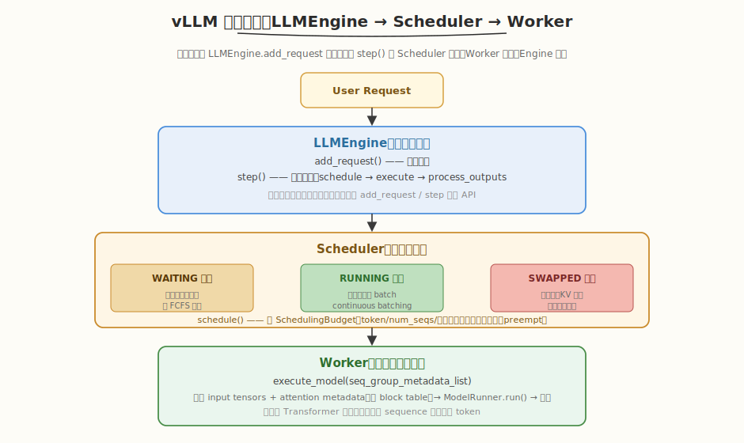
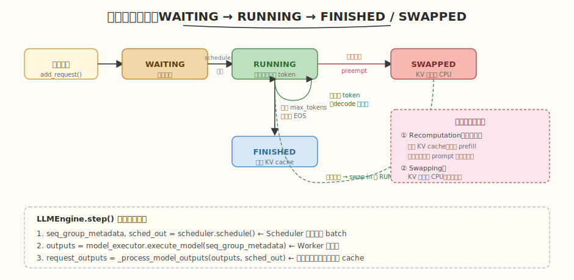
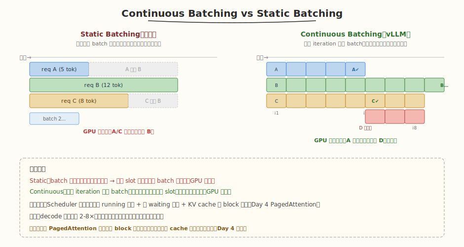

## Day 3：vLLM 整体架构分析

### 🎯 目标

通过今天的学习，你将：

1. 理解 vLLM 的 **三层分层架构**——LLMEngine（对外接口）→ Scheduler（调度决策）→ Worker（执行前向）的职责划分<br>
2. 掌握 `LLMEngine.step()` 的 **4 步执行流程**，能说清一个请求从 `add_request` 到 `finished` 的完整生命周期<br>
3. 理解 **Sequence / SequenceGroup / SequenceStatus** 三个核心数据结构，以及 WAITING / RUNNING / SWAPPED / FINISHED 四种状态转换<br>
4. 掌握 **Continuous Batching** 的实现原理——每轮 iteration 重建 batch，完成的请求立即让位、新请求随时插入<br>
5. 理解 Scheduler 的 **SchedulingBudget**（token / num_seqs / 显存三重预算）与抢占（preemption）的两种策略<br>
6. 能用 Python 手写一个最小化的 vLLM 调度器模拟，实测 Continuous Batching 的请求交错执行

> 💡 **为什么重要**：Day 1-2 我们从"算子层面"理解了 Prefill/Decode 和 KV Cache——但真实推理系统不是"跑完一个请求再跑下一个"，而是**同时服务成百上千个并发请求**。怎么把这些请求高效地塞进 GPU？这就是 vLLM 的 Scheduler 回答的问题。vLLM 是推理系统面试的核心素材——"画出 vLLM 架构图并解释请求生命周期"几乎是 AI Infra 岗的必考题。今天我们把它的分层架构和调度逻辑吃透，Day 4 再深入它的 PagedAttention 内存管理。

---

### 学前导读：为什么不能"一个请求一个请求地跑"？

Day 1 我们算过：Decode 阶段每个请求的 GEMM 退化成 M=1 的向量×矩阵，Tensor Core 大量空闲——单请求 decode 时 GPU 算力利用率可能只有 1-3%。如果系统串行地"跑完 A 再跑 B 再跑 C"，GPU 就一直半饿不饱。

直觉解法是**把多个请求拼成一个大 batch 一起 decode**——这就是 Continuous Batching。但传统 Static Batching 有个致命问题：必须**凑齐一整批**才开始，且要**等最慢的请求跑完**才能释放 slot 接下一批。如果 batch 里 A 生成 5 个 token、B 生成 50 个 token，那 A 跑完后它的 GPU slot 就空等 B 跑完 45 个 token——白白浪费。

| 策略 | 凑批方式 | 完成处理 | GPU 利用率 |
|------|---------|---------|-----------|
| Static Batching | 凑齐 N 个才开始 | 等最慢的，整批结束才接新 | 低（空等严重） |
| Continuous Batching | 每轮 iteration 重建 batch | 完成即走，立即接新请求 | 高（满载） |

vLLM 的 Scheduler 让"每轮 iteration 都重新决策 batch 成员"成为可能——完成的请求立即释放 KV cache，waiting 里的新请求立刻补位。但要做到这一点，KV cache 必须能**按小块动态分配/释放**（否则碎片爆炸）——这就是 Day 4 PagedAttention 要解决的。今天先聚焦 Scheduler 的调度逻辑。

> 💡 **一句话总结**：Continuous Batching 是 vLLM 吞吐提升的核心——它把"串行服务"变成"每轮重建 batch 的流水线服务"，让 GPU 始终满载。代价是需要一个聪明的 Scheduler 和细粒度的 KV cache 管理。

---

### 理论学习

#### 3.1 vLLM 三层分层架构



vLLM 把推理系统分成三层，各司其职：

| 层 | 类 | 职责 | 对外 API |
|----|----|------|---------|
| **接口层** | `LLMEngine` | 管理整个推理生命周期，对用户暴露 `add_request` / `step` | `add_request()`, `step()` |
| **调度层** | `Scheduler` | 决定每轮运行哪些 sequence，管理三个队列 + 预算 | `schedule()` |
| **执行层** | `Worker` | 执行实际模型前向，管理 GPU / 模型权重 / KV cache | `execute_model()` |


##### 为什么分三层？

- **接口层**让用户无需关心调度细节，只管 `add_request` + 读 `step` 的输出
- **执行层**封装硬件细节，Worker 可以是多卡（TP/PP）的协调者

#### 3.2 核心数据结构：Sequence / SequenceGroup / SequenceStatus

| 类名 | 作用 | 关键字段 |
|------|------|---------|
| `Sequence` | 单个序列（一条采样链） | `seq_id`, `prompt_token_ids`, `output_token_ids`, `status` |
| `SequenceGroup` | 一个请求对应一个 group（含 prompt + 1~N 个采样序列） | `request_id`, `seqs: List[Sequence]` |
| `SequenceStatus` | 序列状态枚举 | `WAITING` / `RUNNING` / `SWAPPED` / `FINISHED` |
| `SchedulerOutputs` | scheduler 一轮的输出 | `scheduled_seq_groups`, `num_batched_tokens` |
| `SamplerOutput` | 采样结果 | 每个 sequence 的下一个 token id |

##### 为什么用 SequenceGroup 而不是直接用 Sequence？

一个用户请求可能需要**多个候选序列**——比如 beam search（保留 top-K 条路径）或 `n>1` 采样（一次生成多个回答）。这些候选共享同一个 prompt，所以用一个 `SequenceGroup` 包起来。group 内的 sequences 共享 prompt 的 KV cache（Day 4 的 Copy-on-Write 就是为这个设计的）。

#### 3.3 请求生命周期




##### `LLMEngine.step()` 的 4 步流程

```python
def step(self):
 # 1. Scheduler 决定本轮运行哪些 sequence
 seq_group_metadata_list, scheduler_outputs = self.scheduler.schedule()

 # 2. Worker 执行模型前向
 outputs = self.model_executor.execute_model(seq_group_metadata_list)

 # 3. 处理输出（采样、更新 sequence 状态、回收完成请求的 cache）
 request_outputs = self._process_model_outputs(outputs, scheduler_outputs)

 # 4. 返回本轮结果
 return request_outputs
```

每调用一次 `step()`，系统就推进一个 iteration：所有 running 的 sequence 各生成 1 个 token。用户在循环里反复调 `step()` 直到所有请求 `FINISHED`。

#### 3.4 Continuous Batching：每轮重建 batch



Continuous Batching 的核心：**每个 iteration 都重新构建 batch**。

```python
def schedule(self):
 # 1. 保留所有 running 的 sequence（continuous batching 的基础）
 # 2. 如果还有预算（num_seqs / 显存），从 waiting 队列补入新请求
 # 3. 如果显存不足，抢占（preempt）低优先级的 running 请求
 # 4. 返回本轮的 SchedulerOutputs
```

**关键**：新请求可以在**任意 iteration** 加入 batch——不需要等当前 batch 跑完。请求 A 在 iter 5 完成后，它的 slot 立刻被 waiting 里的请求 D 填上，GPU 不空等。

##### 为什么能提升吞吐？


> 💡 请求长度方差越大，Continuous Batching 收益越大——因为 Static 下"短板请求"造成的空等越多。这也是为什么推理服务的请求长度往往差异巨大（有人问一句话，有人输入长文档），Continuous Batching 几乎是标配。

#### 3.5 SchedulingBudget 与抢占

Scheduler 每轮决策受三重预算约束：

| 预算 | 含义 | 约束 |
|------|------|------|
| **token budget** | 本轮最多处理的 token 数 | 限制 prefill 的总 token（大 prompt 会占满） |
| **num_seqs budget** | 本轮最多并行的 sequence 数 | 限制 batch 大小（防显存爆 / 调度开销） |
| **显存预算** | KV cache 剩余 block 数 | block allocator 报告（Day 4 PagedAttention） |

##### 抢占（Preemption）的两种策略

当高优先级请求到来但显存不足时，Scheduler 抢占 running 队列里最后加入的请求：

| 策略 | 做法 | 适用场景 |
|------|------|---------|
| **Recomputation**（默认） | 丢弃被抢占请求的 KV cache，之后重新 prefill | 短 prompt（重算便宜），通常更快 |
| **Swapping** | 把被抢占请求的 KV cache 换出到 CPU 内存 | 长 prompt（重算太贵），显存恢复后换回 |

> ⚠️ **注意**：Recomputation 看似浪费（白算了），但对短 prompt 通常比 Swapping 快——因为 CPU↔GPU 的 KV 搬运带宽远低于重算的小 GEMM。vLLM 默认用 Recomputation，长上下文场景才切 Swapping。

### Coding 任务：手写 mini vLLM 调度器

#### 任务 1：创建 mini_vllm_scheduler.py

创建文件 [kernels/mini_vllm_scheduler.py](kernels/mini_vllm_scheduler.py)，用纯 Python 模拟 vLLM 的 LLMEngine + Scheduler + Worker，演示 Continuous Batching：

```python
# mini_vllm_scheduler.py —— vLLM 核心架构的最小化模拟（LLMEngine + Scheduler + Worker）
# 运行命令: python mini_vllm_scheduler.py
# 依赖: 仅标准库（无需 torch / vllm）
#
# 演示三大核心机制：
# 1. 请求生命周期：WAITING → RUNNING → FINISHED（含 SWAPPED 抢占）
# 2. Continuous Batching：每轮 iteration 重新构建 batch，新请求随时加入
# 3. SchedulingBudget：token / num_seqs / 显存 三重预算约束

import random
from dataclasses import dataclass, field
from enum import Enum
from typing import List, Optional

# ============================================================
# 数据模型（对应 vllm/sequence.py）
# ============================================================

class SequenceStatus(Enum):
 WAITING = "WAITING"
 RUNNING = "RUNNING"
 SWAPPED = "SWAPPED" # 被抢占，KV cache 换出到 CPU
 FINISHED = "FINISHED"

@dataclass
class Sequence:
 """单个序列（对应 vllm.Sequence）"""
 seq_id: int
 prompt_len: int # prefill 的 token 数
 max_output_len: int # 最多生成多少 token
 output_len: int = 0 # 已生成的 token 数
 status: SequenceStatus = SequenceStatus.WAITING
 kv_blocks: int = 0 # 当前占用的 KV cache block 数

 def total_len(self) -> int:
 return self.prompt_len + self.output_len

 def is_finished(self) -> bool:
 return self.status == SequenceStatus.FINISHED

@dataclass
class SequenceGroup:
 """一个请求对应一个 group（对应 vllm.SequenceGroup）"""
 request_id: int
 seq: Sequence
 arrival_iter: int # 在第几个 iteration 到达

# ============================================================
# Scheduler（对应 vllm/engine/scheduler.py）
# ============================================================

@dataclass
class SchedulingBudget:
 """调度预算（对应 vllm.core.scheduling_budget.SchedulingBudget）"""
 max_num_seqs: int # 本轮最多并行多少 sequence
 max_tokens: int # 本轮最多处理多少 token（prefill+decode）
 max_blocks: int # KV cache 剩余 block 数
 num_seqs: int = 0
 tokens: int = 0
 blocks: int = 0

 def can_add(self, seq: Sequence, block_size: int) -> bool:
 need_blocks = (seq.total_len() + block_size - 1) // block_size
 return (self.num_seqs < self.max_num_seqs
 and self.tokens + seq.total_len() <= self.max_tokens
 and self.blocks + need_blocks <= self.max_blocks)

 def add(self, seq: Sequence, block_size: int):
 need_blocks = (seq.total_len() + block_size - 1) // block_size
 self.num_seqs += 1
 self.tokens += seq.total_len()
 self.blocks += need_blocks

@dataclass
class SchedulerOutputs:
 """scheduler 一轮的输出：本轮要运行哪些 sequence"""
 running_seqs: List[Sequence] = field(default_factory=list)
 preempted_seqs: List[Sequence] = field(default_factory=list)
 num_batched_tokens: int = 0

class Scheduler:
 """vLLM Scheduler 的核心逻辑（简化版）"""

 def __init__(self, block_size: int = 16, max_num_seqs: int = 4,
 max_blocks: int = 64):
 self.block_size = block_size
 self.max_num_seqs = max_num_seqs
 self.max_blocks = max_blocks
 self.used_blocks = 0

 self.waiting: List[SequenceGroup] = []
 self.running: List[SequenceGroup] = []
 self.swapped: List[SequenceGroup] = []

 def add_request(self, sg: SequenceGroup):
 sg.seq.status = SequenceStatus.WAITING
 self.waiting.append(sg)

 def _alloc_blocks(self, seq: Sequence) -> int:
 return (seq.total_len() + self.block_size - 1) // self.block_size

 def _try_preempt(self) -> bool:
 """显存不足时抢占最后加入的 running sequence（Recomputation 策略）"""
 if not self.running:
 return False
 victim = self.running.pop()
 victim.seq.status = SequenceStatus.WAITING
 victim.seq.output_len = 0 # recomputation：丢弃 KV cache
 self.used_blocks -= victim.seq.kv_blocks
 victim.seq.kv_blocks = 0
 self.waiting.insert(0, victim)
 print(f" ⚡ PREEMPT request {victim.request_id} (recomputation)")
 return True

 def schedule(self) -> SchedulerOutputs:
 out = SchedulerOutputs()
 # Step 1: 保留所有 running（continuous batching 基础）
 out.running_seqs = [sg.seq for sg in self.running]
 # Step 2: 从 waiting 补入新请求
 budget = SchedulingBudget(
 max_num_seqs=self.max_num_seqs, max_tokens=999999,
 max_blocks=self.max_blocks - self.used_blocks)
 for sg in out.running_seqs:
 budget.add(sg, self.block_size)
 still_waiting = []
 for sg in self.waiting:
 if budget.can_add(sg.seq, self.block_size):
 sg.seq.status = SequenceStatus.RUNNING
 need = self._alloc_blocks(sg.seq)
 self.used_blocks += need
 sg.seq.kv_blocks = need
 self.running.append(sg)
 out.running_seqs.append(sg.seq)
 budget.add(sg.seq, self.block_size)
 print(f" + ADMIT request {sg.request_id} (prefill {sg.seq.prompt_len} tok, alloc {need} blocks)")
 else:
 if self._try_preempt():
 if budget.can_add(sg.seq, self.block_size):
 sg.seq.status = SequenceStatus.RUNNING
 need = self._alloc_blocks(sg.seq)
 self.used_blocks += need
 sg.seq.kv_blocks = need
 self.running.append(sg)
 out.running_seqs.append(sg.seq)
 budget.add(sg.seq, self.block_size)
 print(f" + ADMIT request {sg.request_id} (after preempt, alloc {need} blocks)")
 else:
 still_waiting.append(sg)
 else:
 still_waiting.append(sg)
 self.waiting = still_waiting
 out.num_batched_tokens = sum(s.total_len() for s in out.running_seqs)
 return out

# ============================================================
# Worker（对应 vllm/worker/worker.py）
# ============================================================

class Worker:
 """执行模型前向（这里只模拟，不跑真模型）"""
 def execute_model(self, running_seqs: List[Sequence]) -> List[int]:
 new_tokens = []
 for seq in running_seqs:
 seq.output_len += 1
 new_tokens.append(random.randint(0, 999))
 return new_tokens

# ============================================================
# LLMEngine（对应 vllm/engine/llm_engine.py）
# ============================================================

class LLMEngine:
 def __init__(self, block_size=16, max_num_seqs=4, max_blocks=64):
 self.scheduler = Scheduler(block_size, max_num_seqs, max_blocks)
 self.worker = Worker()
 self.iteration = 0
 self.finished: List[SequenceGroup] = []

 def add_request(self, request_id, prompt_len, max_output_len):
 sg = SequenceGroup(request_id, Sequence(request_id, prompt_len, max_output_len), self.iteration)
 self.scheduler.add_request(sg)
 print(f"[iter {self.iteration}] ➕ add_request {request_id} (prompt={prompt_len}, max_out={max_output_len})")

 def step(self) -> List[int]:
 self.iteration += 1
 print(f"\n[iter {self.iteration}] === step ===")
 sched_out = self.scheduler.schedule()
 if not sched_out.running_seqs:
 print(" (no running seqs)")
 return []
 print(f" batch: {len(sched_out.running_seqs)} seqs, {sched_out.num_batched_tokens} tokens, used_blocks={self.scheduler.used_blocks}/{self.scheduler.max_blocks}")
 new_tokens = self.worker.execute_model(sched_out.running_seqs)
 finished_this_step = []
 for sg in self.scheduler.running[:]:
 seq = sg.seq
 if seq.output_len >= seq.max_output_len:
 seq.status = SequenceStatus.FINISHED
 self.scheduler.used_blocks -= seq.kv_blocks
 seq.kv_blocks = 0
 self.scheduler.running.remove(sg)
 self.finished.append(sg)
 finished_this_step.append(sg.request_id)
 print(f" ✔ FINISH request {sg.request_id} (generated {seq.output_len} tokens)")
 return finished_this_step

 def has_unfinished(self) -> bool:
 return bool(self.scheduler.waiting or self.scheduler.running)

def main():
 random.seed(42)
 engine = LLMEngine(block_size=16, max_num_seqs=4, max_blocks=64)
 print("=" * 60)
 print("Mini vLLM Scheduler Simulation")
 print("=" * 60)

 engine.add_request(0, prompt_len=32, max_output_len=8)
 for _ in range(2):
 engine.step()
 engine.add_request(1, prompt_len=16, max_output_len=5)
 engine.add_request(2, prompt_len=48, max_output_len=6)
 while engine.has_unfinished():
 engine.step()

 print("\n" + "=" * 60)
 print(f"All requests finished. Total iterations: {engine.iteration}")
 print(f"Finished order: {[sg.request_id for sg in engine.finished]}")
 print("=" * 60)

if __name__ == "__main__":
 main()
```

代码要点：
- `Sequence` **/** `SequenceGroup` **/** `SequenceStatus`：对应 vLLM 的数据模型，`SequenceGroup` 包一个 `Sequence`（简化为单序列）。
- `Scheduler.schedule()`：先保留所有 running（Continuous Batching 基础），再从 waiting 按 budget 补入；显存不足时 `_try_preempt` 抢占（Recomputation 策略，重置 `output_len`）。
- `Worker.execute_model()`：每 seq 生成 1 个 token（随机模拟，不跑真模型）。
- `LLMEngine.step()`：schedule → execute → 更新状态（完成则释放 cache），对应 vLLM 的 4 步流程。

#### 任务 2：运行并观察 Continuous Batching

```bash
python kernels/mini_vllm_scheduler.py
```

**预期输出**（节选）：

```text
[iter 1] === step ===
 + ADMIT request 0 (prefill 32 tok, alloc 2 blocks)
 batch: 1 seqs, 32 tokens, used_blocks=2/64

[iter 3] === step ===
 + ADMIT request 1 (prefill 16 tok, alloc 1 blocks)
 + ADMIT request 2 (prefill 48 tok, alloc 3 blocks)
 batch: 3 seqs, 98 tokens, used_blocks=6/64

[iter 7] === step ===
 batch: 3 seqs, 110 tokens, used_blocks=6/64
 ✔ FINISH request 1 (generated 5 tokens)

[iter 8] === step ===
 batch: 2 seqs, 92 tokens, used_blocks=5/64
 ✔ FINISH request 0 (generated 8 tokens)
 ✔ FINISH request 2 (generated 6 tokens)

All requests finished. Total iterations: 8
Finished order: [1, 0, 2]
```

##### 观察重点

1. **请求交错执行**：req0 先到先跑 2 轮，req1/req2 在 iter 3 加入，三者同 batch 并行 decode——这就是 Continuous Batching。
2. **完成即走**：req1（max_out=5）在 iter 7 最先完成，req0/req2 继续跑到 iter 8——完成的不拖累未完成的。
3. **完成顺序 ≠ 到达顺序**：req1 最晚到但最早完成（max_out 最短），说明 Continuous Batching 让短请求快速返回。
4. **显存动态回收**：req1 完成后 `used_blocks` 从 6 降到 5，slot 立刻可用。

#### 任务 3：阅读 vLLM 源码对照

在 vLLM 源码（`pip install vllm` 后或 GitHub）中找到以下三个方法，与我们的 mini 实现对照：

| mini 实现 | vLLM 源码位置 | 对照点 |
|-----------|--------------|--------|
| `LLMEngine.step()` | `vllm/engine/llm_engine.py` | 4 步流程：schedule → execute → process_outputs → return |
| `Scheduler.schedule()` | `vllm/engine/scheduler.py` | `_schedule_running()` + `_schedule_waiting()`，Continuous Batching 实现 |
| `Worker.execute_model()` | `vllm/worker/worker.py` | 构建 input metadata（含 block table）→ ModelRunner.run() |

```bash
# 找到 step() 的 4 个主要步骤
python -c "import vllm.engine.llm_engine as m; import inspect; print(inspect.getsourcefile(m))"

# 在源码中搜索 schedule 的三个子方法
grep -n "_schedule_running\|_schedule_waiting\|_schedule_swapped" $(python -c "import vllm.engine.scheduler as m; print(m.__file__)")
```

> 💡 重点对照：vLLM 的 `_schedule_running()` 先处理已 running 的请求（continuous batching 基础），`_schedule_waiting()` 再从 waiting 补入新请求——正是我们 mini 版 `schedule()` 的 Step 1 + Step 2。

#### 任务 4：LeetGPU 在线题目 —— Speculative Decoding Verification

**题目链接**：<https://leetgpu.com/challenges/speculative-decoding-verification>

**题目概述**：

实现 **Speculative Decoding（投机解码）的验证步骤**：draft 模型一次提议 `T` 个 token，target 模型一次前向评估这 `T` 个 token，逐个接受/拒绝。给定 `B` 个序列的 draft_tokens、draft_probs、target_probs、uniform_samples，输出验证后的 token 序列。接受条件：`u < min(1, q/p)`；首次拒绝处用 `max(target - draft, 0)` 归一化后重采样；全部接受则 bonus 一个 token。

**约束条件**：`1 ≤ B ≤ 256`，`1 ≤ T ≤ 16`，`2 ≤ V ≤ 131072`；性能测试取 `B=64, T=8, V=32768`。

**与今日知识的关联**：

Speculative Decoding 是 vLLM 这类推理系统的**调度层优化**——Scheduler 编排"draft 模型批量生成 + target 模型批量验证"的迭代，Worker 执行验证 kernel。这道题就是 Worker 跑的**验证 kernel**：对 B 个序列并行做 accept/reject + resample，本质是一个 batched 的 scan（找首次拒绝位置）+ CDF 查找。它直接体现了"Scheduler 决定跑谁、Worker 跑什么 kernel"的分工——验证步骤的并行度（B 序列）正是 Continuous Batching 拼出来的 batch。

> 💡 提交后在 [LeetGPU Speculative Decoding Verification](https://leetgpu.com/challenges/speculative-decoding-verification) 上记录通过耗时。完整题解（含 accept/reject 逻辑、首次拒绝的 scan、resample 的 CDF 查找、ncu profiling）见 [Speculative Decoding Verification 题解](../../../../leetgpu/week5/day3/leetgpu-speculative-decoding-verification-solution.md)。

#### 任务 5：LeetCode 面试题 —— 任务调度器

**题目链接**：[621. 任务调度器](https://leetcode.cn/problems/task-schedule/)

**题目概述**：

给定一个用字符数组 `tasks` 表示的 CPU 任务列表（每个字母代表一种任务），以及冷却时间 `n`。同一类任务执行后必须间隔 `n` 个单位时间才能再执行同类任务。每个单位时间可执行一个任务或待命。求完成所有任务的最少时间。

**与今日知识的关联**：

这道题是 vLLM Scheduler 的**算法直觉**——Scheduler 每轮决定"跑哪个请求"，受 KV cache 显存约束（类似冷却：一个请求占的 block 释放后才能给别的用）。任务调度器的核心是"贪心安排最高频任务 + 用其他任务/待命填充冷却间隙"，与 Continuous Batching"用新请求填满完成请求留下的 slot"思路同构：都是**在资源约束下最大化吞吐、用填充消除空闲**。任务调度器用低频任务填高频任务的冷却，Continuous Batching 用 waiting 请求填 running 完成后的 slot。

**核心套路**：

```
最多任务数 max_freq，有 max_count 个任务并列最多
最少时间 = (max_freq - 1) × (n + 1) + max_count
取 max(上式, len(tasks)) # 任务总数可能超过框架
```

> 💡 完整题解（含贪心公式推导、C++/Python 参考代码、模拟画图、与 Continuous Batching 的模式类比）见 [任务调度器题解](../../../../leetcode/daily/week5/day3/任务调度器.md)。

---

### 扩展实验

#### 实验 1：减小 max_blocks 触发抢占

把 `main()` 里的 `max_blocks=64` 改成 `max_blocks=8`，观察抢占（PREEMPT）是否触发。注意 Recomputation 策略会重置 `output_len`，可能产生 livelock（反复抢占无法推进）。

> 思考：为什么 max_blocks 太小会 livelock？（提示：Recomputation 把 output_len 清零，被抢占的请求重新 prefill 又抢别人的显存。）如何改进？（提示：Swapping 策略不丢 progress；或限制抢占次数。）

#### 实验 2：支持 SWAPPED 队列与换出

当前 mini 版的 `_try_preempt` 用 Recomputation（重置 output_len）。修改为 Swapping：被抢占的请求 `status=SWAPPED`，进入 `self.swapped` 队列，`output_len` 保留；显存恢复时 swap in 回 running。对比两种策略在长 prompt 下的行为差异。

> 思考：Swapping 何时比 Recomputation 更优？（提示：prompt 很长时重算成本 > CPU↔GPU 搬运成本。）

#### 实验 3：添加请求优先级

给 `SequenceGroup` 加 `priority` 字段，修改 `schedule()` 让高优先级请求优先被 admit、低优先级请求优先被 preempt。测试：低优先级长请求先到，高优先级短请求后到，观察抢占行为。

> 思考：优先级调度可能产生什么问题？（提示：低优先级请求 starvation 饿死。如何解决？老化 aging 策略。）

---

### 今日总结

Day 3 我们把 vLLM 的"系统骨架"拆解清楚了：

1. **三层分层架构**：LLMEngine（接口）→ Scheduler（调度）→ Worker（执行），职责清晰、解耦——Scheduler 只管"跑谁"，Worker 只管"怎么跑"
2. **核心数据结构**：Sequence（单序列）、SequenceGroup（一请求多候选）、SequenceStatus（WAITING/RUNNING/SWAPPED/FINISHED 四态）
3. **请求生命周期**：add_request → WAITING → schedule 选中 → RUNNING → 达到 max_tokens → FINISHED（或显存不足 → SWAPPED → 恢复回 RUNNING）
4. **Continuous Batching**：每轮 iteration 重建 batch，完成即走、新请求随时插入——GPU 始终满载，吞吐提升 2-8×，请求长度方差越大收益越大
5. **SchedulingBudget**：token / num_seqs / 显存三重预算约束调度决策；显存不足时抢占（Recomputation 默认 / Swapping 备选）
6. **手写 mini 调度器**：Python 模拟 LLMEngine+Scheduler+Worker，实测 3 请求交错执行，验证 Continuous Batching 的完成即走、完成顺序≠到达顺序
7. **step() 4 步流程**：schedule → execute_model → process_outputs → return，每步推进一个 iteration

掌握这些后，你就有了 vLLM 的调度层全景——明天 Day 4 深入 Worker 内部的 PagedAttention，看它如何用分页 + block table 让 KV cache 的动态分配/释放不产生碎片，从而支撑 Continuous Batching 的高频 slot 回收。

---

### 面试要点

1. **vLLM 的整体架构是怎样的？一个请求从进入到输出经历哪些阶段？**

<details>
<summary>点击查看答案</summary>

 - 三层分层架构：LLMEngine（对外接口，编排 step 循环）→ Scheduler（调度决策，管理三个队列+预算）→ Worker（执行模型前向）
 - 请求生命周期：
 1. 用户调 `LLMEngine.add_request()`，请求进入 WAITING 队列
 2. `Scheduler.schedule()` 依预算决定哪些请求进本轮 batch（从 waiting 补入 running）
 3. `Worker.execute_model()` 执行模型前向，每 seq 生成 1 个 token
 4. `_process_model_outputs` 采样、更新状态——达到 max_tokens 则 FINISHED（释放 cache），显存不足则 SWAPPED
 5. 反复 `step()` 直到所有请求 FINISHED
 - Continuous Batching：每轮重建 batch，新请求可在任意 iteration 加入

</details>


2. **什么是 Continuous Batching？它比 Static Batching 好在哪里？**

<details>
<summary>点击查看答案</summary>

 - Continuous Batching：每个 iteration 都重新构建 batch，完成的请求立即释放 slot，waiting 里的新请求立刻补位
 - Static Batching：凑齐 N 个才开始，等最慢的请求跑完才接下一批——完成的请求 slot 空等
 - 收益：GPU 始终满载，吞吐提升 2-8×；请求长度方差越大收益越大（短板请求造成的空等越多）
 - 前提：需要细粒度 KV cache 管理（PagedAttention 的 block 级分配/释放），否则完成请求的 cache 释放会碎片爆炸

</details>


3. **vLLM 的 Scheduler 依据什么做调度决策？什么是 SchedulingBudget？**

<details>
<summary>点击查看答案</summary>

 - Scheduler 依据三重预算：
 - token budget：本轮最多处理的 token 数（限制 prefill 总量）
 - num_seqs budget：本轮最多并行的 sequence 数（限制 batch 大小）
 - 显存预算：block allocator 报告的剩余 block 数（Day 4 PagedAttention）
 - `SchedulingBudget` 封装这些预算，scheduler 在 add 请求时检查是否超出
 - 调度目标：最大化 throughput，同时控制 latency（通过 budget 限制 batch 大小）
 - 决策顺序：先保留 running（continuous batching 基础）→ 从 waiting 补入 → 显存不足则抢占

</details>


4. **vLLM 中抢占（preemption）的两种策略是什么？各自适用什么场景？**

<details>
<summary>点击查看答案</summary>

 - **Recomputation**（默认）：丢弃被抢占请求的 KV cache，之后重新 prefill。适用于短 prompt——重算成本低于 CPU↔GPU 搬运
 - **Swapping**：把被抢占请求的 KV cache 换出到 CPU 内存，显存恢复后换回。适用于长 prompt——重算太贵
 - vLLM 默认 Recomputation，因为大多数请求 prompt 不长，重算比搬运快
 - 抢占对象：通常抢占 running 队列里最后加入的请求（LIFO）

</details>


5. **SequenceGroup 是什么？为什么不直接用 Sequence？**

<details>
<summary>点击查看答案</summary>

 - `SequenceGroup` 包含一个请求的 prompt + 1~N 个采样序列（`Sequence`）
 - 一个用户请求可能需要多个候选序列：beam search（保留 top-K 路径）、`n>1` 采样（一次生成多个回答）
 - 这些候选共享同一个 prompt，用 group 包起来统一管理；prompt 的 KV cache 在 group 内共享（Day 4 的 Copy-on-Write 机制）
 - 单序列场景（n=1, no beam）group 内只有一个 Sequence，退化为直接用 Sequence

 - Continuous Batching、SchedulingBudget、抢占/换出等调度逻辑跨平台通用

</details>

