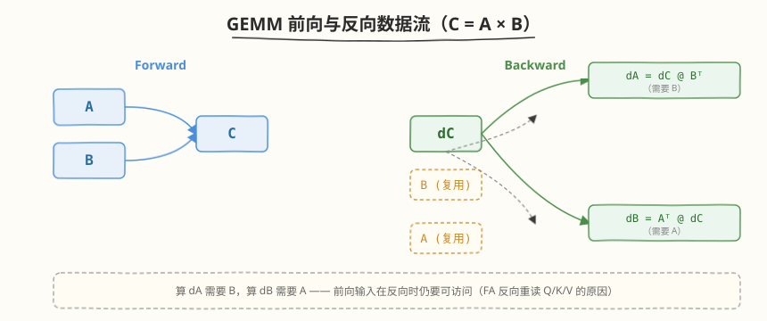

## Day 4：FlashAttention Backward 与 GEMM Backward

### 🎯 目标

通过今天的学习，你将：

1. 掌握 **GEMM 反向**的数据流——`C = A @ B` 时 `dA = dC @ B^T`、`dB = A^T @ dC`，理解"反向即两个转置 GEMM"的对称性<br>
2. 理解为什么 FlashAttention **不能直接反传**——前向丢弃了中间 `S/P`，反向必须重算<br>
3. 能独立推导 **logsumexp trick**——$L_i = m_i + \log(l_i)$，证明 $P_{ij} = \exp(S_{ij} - L_i)$，从而用 O(N) 标量恢复整个 softmax 权重<br>
4. 掌握 **FA Backward 算法**（论文 Algorithm 2）：前向只存 `Q/K/V/O/L`，反向分块重算 `S/P` 的 Jacobian，IO 保持 O(Nd)<br>
5. 实现并运行 `gemm_backward.cu`（naive CUDA）与 `flash_attention_backward.py`（PyTorch 自定义 autograd），通过 `torch.autograd.gradcheck` 数值验证<br>
6. 能解释 `D_i = O_i \cdot dO_i` 这一关键化简，以及它如何让反向无需二次扫描 KV<br>

> 💡 **为什么重要**：Day 1-2 只解决了 forward——但训练要的是梯度。FlashAttention 真正的工程难点不在 forward 而在 backward：如何在"不存 N×N 中间矩阵"的前提下正确回传梯度。这道题是 AI Infra 面试里区分"读过论文"和"能落地实现"的分水岭，也是 Day 5 集成到 Mini 引擎后能否支持训练的前提。

---

### 学前导读：为什么 Forward 不够

Day 1-2 我们把 FlashAttention Forward 跑通了：$O = \mathrm{softmax}(QK^T/\sqrt{d}) @ V$，HBM IO 从 O(N²) 降到 O(Nd)。但训练时优化器要的是 dQ/dK/dV，它们来自上游 dO。问题来了——**标准 attention 的反向公式需要 P**：

```
dV = P^T @ dO
dP = dO @ V^T
dS = P * (dP - rowsum(P * dP))      ← softmax Jacobian，需要 P
dQ = dS @ K / √d
dK = dS^T @ Q / √d
```

而 FA Forward 为了省内存**根本没存 P**（O(N²)），只存了 `O` 和每行一个标量 `L`（O(N)）。这就形成了一个两难：

| 方案 | 内存 | 问题 |
|------|------|------|
| 标准 backward（物化 P） | O(N²) | 丢掉 FA 的全部内存优势 |
| FA backward（重算 P） | O(Nd) | 需要从 `Q/K/L` 重新构造 P |

FA 选择后者——**recomputation**：前向多存一个 O(N) 的 `L`，反向用 `L` 把 P 一块一块重算回来。代价是反向多做一次 `QK^T` 的 FLOPs，但 IO 仍是 O(Nd)，而 IO 才是瓶颈。今天的核心就是搞清楚：`L` 是什么？为什么 O(N) 就够？反向怎么用？

> 💡 **一句话总结**：Forward 用 online softmax 省掉 P 的存储，backward 用 logsumexp 把 P 重新"解压缩"出来——存的是 O(N) 的 `L`，恢复的是 O(N²) 的 P，这就是 FA 的内存魔法能延伸到训练阶段的根本原因。

---

### 理论学习

#### 1.1 GEMM Backward：反向即两个转置 GEMM

先从最简单的 GEMM 反向入手——attention 的前向和反向本质上都是 GEMM，理解 GEMM backward 的数据流是理解 FA backward 的前提。

> 💡 `dA = dC @ B^T`、`dB = A^T @ dC` 这两个公式已在 Week 4 Day 3 学过，这里快速过一遍数据流，重点放到 FA 特有的 recomputation 上。


##### 链式法则推导

前向 `C = A @ B`，其中 `A: M×K`，`B: K×N`，`C: M×N`。元素级：

$$C_{ij} = \sum_{k=0}^{K-1} A_{ik} B_{kj}$$

给定上游梯度 `dC: M×N`（即 $\partial \text{loss} / \partial C$），由链式法则：

$$\frac{\partial \text{loss}}{\partial A_{ik}} = \sum_j \frac{\partial \text{loss}}{\partial C_{ij}} \frac{\partial C_{ij}}{\partial A_{ik}} = \sum_j dC_{ij} \cdot B_{kj}$$

$$\frac{\partial \text{loss}}{\partial B_{kj}} = \sum_i \frac{\partial \text{loss}}{\partial C_{ij}} \frac{\partial C_{ij}}{\partial B_{kj}} = \sum_i A_{ik} \cdot dC_{ij}$$

写成矩阵形式：

```
dA = dC @ B^T      (M×N) @ (N×K) = M×K
dB = A^T @ dC      (K×M) @ (M×N) = K×N
```

##### 与 forward 的对称性

| 维度 | Forward `C=A@B` | Backward `dA` | Backward `dB` |
|------|----------------|---------------|---------------|
| 形状 | M×K @ K×N → M×N | dC(M×N) @ B^T(N×K) | A^T(K×M) @ dC(M×N) |
| 访问 A | 读 | — | 读（转置） |
| 访问 B | 读 | 读（转置） | — |
| 访问 dC | — | 读 | 读 |
| FLOPs | 2MNK | 2MNK | 2MNK |

> 💡 **关键洞察**：GEMM 反向 = 两个 GEMM，每个的 FLOPs 与 forward 相同，只是把某个输入转置。所以 **forward 能加速的 GEMM，backward 也能**——这正是 FA backward 能保持 O(Nd) IO 的基础：它的两个 `QK^T`、`PV` 反向 GEMM 和 forward 用的是同一套 tiling 机制。

##### 数据流图



注意：算 `dA` 需要 `B`，算 `dB` 需要 `A`——**前向的输入在反向时仍要可访问**。对 FA 而言，`Q/K/V` 在反向时必须重读，这正是反向 IO 比 forward 略高的原因。

#### 1.2 FlashAttention Backward 概述：为什么不能直接反传


##### 标准 backward 的内存灾难

标准 attention 的 backward 需要物化 `S = QK^T` 和 `P = softmax(S)` 两个 N×N 矩阵——因为 PyTorch autograd 默认把前向的中间张量存进计算图，反向时直接读取。以 N=4096, d=64, FP32 为例：

| 中间量 | 大小 | 是否必须 |
|--------|------|---------|
| S (N×N) | 64 MB | 标准 backward 需要 |
| P (N×N) | 64 MB | softmax Jacobian 需要 |
| Q/K/V/O (各 Nd) | 各 1 MB | 必须 |
| **标准 backward 总存** | **~130 MB** | |
| **FA backward 总存** | **~4 MB**（Q/K/V/O + L） | |

如果直接用标准 autograd，FA 的内存优势在训练时**全部归零**——前向省下的 64MB×2 在反向时又得物化回来。

##### Recomputation 策略

FA 的解法：**前向多存一个 O(N) 的 `L`，反向重算 S/P**。

```
前向（存）:  Q, K, V, O, L          ← O(Nd) + O(N) = O(Nd)
反向（重算）: for each (Q_tile, KV_tile):
                S_ij = Qi @ Kj^T * scale      ← 重算，留 SRAM
                P_ij = exp(S_ij - L_i)        ← 用 L 恢复，留 SRAM
                累加 dQ/dK/dV                  ← 写回 HBM
```

代价：反向多做一次 `QK^T` 的 FLOPs（约 +50% 总 FLOPs）。收益：内存 O(Nd)，IO O(Nd)。由于 attention 的瓶颈是 IO 而非 FLOPs，这是划算的——**用算力换内存带宽**。

> ⚠️ **注意**：recomputation 不是"把前向再跑一遍"。前向只算 `O`，反向要算的是 `dQ/dK/dV` 三个梯度，重算的只是 `S/P` 这两个中间量，梯度公式本身与前向无关。

#### 1.3 logsumexp Trick：用 O(N) 标量恢复整个 softmax

这是 FA backward 的数学核心。我们要回答：**前向只存了 O(N) 的什么东西，能让反向恢复出 O(N²) 的 P？**

##### 从 safe softmax 说起

朴素 softmax `P_ij = exp(S_ij) / Σ_k exp(S_ik)` 有数值溢出风险（exp 大数 → inf）。safe softmax 先减行最大值：

$$m_i = \max_j S_{ij}, \quad l_i = \sum_j \exp(S_{ij} - m_i), \quad P_{ij} = \frac{\exp(S_{ij} - m_i)}{l_i}$$

Day 1 的 online softmax 就是在分块时维护 running 的 `(m_i, l_i)`，最终得到全局的 `m_i` 和 `l_i`。

##### 定义 logsumexp

令：

$$L_i = \log \left( \sum_j \exp(S_{ij}) \right)$$

由 safe softmax 的 `m_i`、`l_i` 展开：

$$\sum_j \exp(S_{ij}) = \sum_j \exp(S_{ij} - m_i + m_i) = \exp(m_i) \cdot \sum_j \exp(S_{ij} - m_i) = \exp(m_i) \cdot l_i$$

两边取 log：

$$\boxed{L_i = m_i + \log(l_i)}$$

这就是 **logsumexp**——它把"行最大值"和"行归一化常数"压缩进一个标量。

##### 用 L 恢复 P

由 `P_ij = exp(S_ij - m_i) / l_i` 和 `L_i = m_i + log(l_i)`：

$$\exp(S_{ij} - L_i) = \exp\left(S_{ij} - m_i - \log(l_i)\right) = \frac{\exp(S_{ij} - m_i)}{l_i} = P_{ij}$$

即：

$$\boxed{P_{ij} = \exp(S_{ij} - L_i)}$$

**结论**：只要存了每行的 `L_i`（一个标量），加上能重算的 `S_ij`（从 `Q_i, K_j` 即可），就能恢复任意 `P_ij`。存储从 O(N²) 降到 O(N)。

##### Online softmax 天然产出 L

Day 1 的 online softmax 三公式在处理完所有 KV tile 后，得到的就是全局 `m_i` 和 `l_i`，取 `L_i = m_i + log(l_i)` 即可。前向 kernel 每个 Q 行写回 `O_i` 的同时多写一个 `L_i`，代价仅 +4 bytes/行。

##### 数值稳定性

- `L_i = logsumexp(S_i)` 是数学上严格等于 `log(Σ exp(S))` 的，但计算时全程在 `exp(S - m)` 域里操作，`m` 是行 max，所以 `exp` 的参数 ≤ 0，不溢出。
- 反向 `P_ij = exp(S_ij - L_i)`：`S_ij - L_i ≤ 0`（因为 `L_i ≥ S_ij`，logsumexp ≥ 任意一项），同样不溢出。
- `l_i` 可能为 0（整行 -inf，如全 mask），需 `log(l_i)` 时加一个极小值 `ε` 保护，或在线 softmax 里保留 `l_i > 0` 的不变式。

##### 如何实现 O(Nd) 的 backward IO

| 反向需要的量 | 来源 | 大小 |
|-------------|------|------|
| `S_ij` | 重算 `Qi @ Kj^T * scale` | 不存（SRAM 内） |
| `P_ij` | `exp(S_ij - L_i)` | 不存（SRAM 内） |
| `L_i` | 前向保存 | O(N) |
| `Q, K, V, O` | 前向保存 | O(Nd) |
| `dO` | 上游 | O(Nd) |
| `dQ, dK, dV` | 反向写出 | O(Nd) |

**HBM 常驻量** = Q/K/V/O/dO/dQ/dK/dV (8·Nd) + L (N) = **O(Nd)**。重算的 S/P 只在 SRAM 里短暂存在，从不落 HBM。对比标准 backward 的 O(N²)，N=8192 时从 ~264MB 降到 ~8MB（32x）。

> 💡 **一句话总结**：`L_i = m_i + log(l_i)` 是 softmax 的"无损压缩"——把 N 个归一化常数压成 1 个标量，反向用 `exp(S - L)` 解压。配合 `S` 的重算，FA backward 在不存任何 N×N 矩阵的前提下恢复了完整的 softmax Jacobian。

#### 1.4 FA Backward 算法：Algorithm 2 详解


##### 反向梯度公式

attention 的前向（per row）：`O_i = Σ_j P_ij V_j`，其中 `P = softmax(S)`，`S = QK^T * scale`。给定 `dO`，五个梯度（推导见 1.1 的链式法则 + softmax Jacobian）：

```
(1) dV_j = Σ_i P_ij dO_i              → dV = P^T @ dO
(2) dP_ij = dO_i · V_j                → dP = dO @ V^T
(3) D_i  = Σ_j P_ij dP_ij             ← softmax Jacobian 的对角项
(4) dS_ij = P_ij (dP_ij - D_i)
(5) dQ_i = Σ_j dS_ij K_j * scale      → dQ = dS @ K * scale
    dK_j = Σ_i dS_ij Q_i * scale      → dK = dS^T @ Q * scale
```

##### 关键化简：D_i = O_i · dO_i

公式 (3) 的 `D_i` 看起来需要对整行 P、dP 求和——反向又得扫一遍所有 KV。但有个漂亮的化简：

$$D_i = \sum_j P_{ij} dP_{ij} = \sum_j P_{ij} (dO_i \cdot V_j) = dO_i \cdot \underbrace{\left(\sum_j P_{ij} V_j\right)}_{= O_i} = dO_i \cdot O_i$$

即 **`D_i = rowsum(O_i * dO_i)`**，直接用前向保存的 `O` 和上游 `dO` 一次算出，**无需在 tile 循环里累加**。这是 FA backward 能单 pass 完成的关键。

##### Algorithm 2：分块重算循环

```
前向存: Q, K, V, O, L          # O(Nd) + O(N)
反向输入: dO                   # O(Nd)

# 预计算 D_i = O_i · dO_i  (全局，一次)
D = rowsum(O * dO)

for q_tile i in 0..N step Br:
    Qi, dOi, Li, Di = Q[i:i+Br], dO[i:i+Br], L[i:i+Br], D[i:i+Br]
    dQi = 0
    for kv_tile j in 0..N step Bc:
        Kj, Vj = K[j:j+Bc], V[j:j+Bc]
        # 重算 S/P（只用 Q/K/L，不落 HBM）
        Sij = Qi @ Kj^T * scale
        Pij = exp(Sij - Li)
        # 累加三个梯度
        dV[j:j+Bc] += Pij^T @ dOi
        dPij = dOi @ Vj^T
        dSij = Pij * (dPij - Di)
        dQi += dSij @ Kj * scale
        dK[j:j+Bc] += dSij^T @ Qi * scale
    dQ[i:i+Br] = dQi
```

##### IO 复杂度

每个 `Q tile` 在内层循环中被所有 `KV tile` 复用（常驻 SRAM），每个 `KV tile` 被 `N/Br` 个 Q tile 重读。总 HBM IO：

$$\text{IO}_{\text{bwd}} = \Theta\left(\frac{N^2 d^2}{M}\right) \quad \text{（M = SRAM 大小）}$$

当 `M = Θ(Nd)` 时简化为 **O(Nd)**，与 forward 同阶。常数比 forward 大（需重读 Q/K/V 算 S/P），但渐近类相同——这就是 FA 训练时也能省内存的原因。

> ⚠️ **注意**：严格界是 `Θ(N²d²/M)`，与 forward 一样（见 [Day 1 注释](../day1/README.md)）。教程中统一说 O(Nd) 是取 `M=Θ(Nd)` 的简化形式。

---

### Coding 任务：GEMM Backward 与 FlashAttention Backward

#### 任务 1：编写 gemm_backward.cu

完整文件：[kernels/gemm_backward.cu](https://github.com/hzchenxiaobin/ai-infra-notes/blob/main/aiinfra/daily/week5/day4/kernels/gemm_backward.cu)

```cuda
// gemm_backward.cu —— Naive GEMM Backward: dA = dC @ B^T, dB = A^T @ dC
// 编译命令: nvcc -o gemm_backward gemm_backward.cu -O3 -arch=sm_120
// 运行命令: ./gemm_backward
// 前向: C = A @ B, A: M×K, B: K×N, C: M×N
// 反向: dA = dC @ B^T (M×K), dB = A^T @ dC (K×N)

#include <cuda_runtime.h>
#include <cstdio>
#include <cstdlib>
#include <cmath>

// dA[i,k] = sum_j dC[i,j] * B[k,j]
__global__ void gemm_backward_dA_kernel(const float* __restrict__ dC,
                                        const float* __restrict__ B,
                                        float* __restrict__ dA,
                                        int M, int N, int K) {
    int i = blockIdx.x * blockDim.x + threadIdx.x;
    int k = blockIdx.y * blockDim.y + threadIdx.y;
    if (i >= M || k >= K) return;
    float sum = 0.0f;
    for (int j = 0; j < N; j++) sum += dC[i * N + j] * B[k * N + j];
    dA[i * K + k] = sum;
}

// dB[k,j] = sum_i A[i,k] * dC[i,j]
__global__ void gemm_backward_dB_kernel(const float* __restrict__ A,
                                        const float* __restrict__ dC,
                                        float* __restrict__ dB,
                                        int M, int N, int K) {
    int k = blockIdx.x * blockDim.x + threadIdx.x;
    int j = blockIdx.y * blockDim.y + threadIdx.y;
    if (k >= K || j >= N) return;
    float sum = 0.0f;
    for (int i = 0; i < M; i++) sum += A[i * K + k] * dC[i * N + j];
    dB[k * N + j] = sum;
}
```

naive 版每线程算一个输出元素，重点是把"`dA = dC @ B^T`、`dB = A^T @ dC`"两个转置 GEMM 落到具体的索引寻址——注意 `B[k*N+j]`（B 转置后第 k 行就是原 B 第 k 行）和 `A[i*K+k]`（A 转置后第 k 列就是原 A 第 k 列）。完整文件含 CPU 参考实现 + **有限差分验证**（取 `loss = sum(C)`，则 `dC = ones`，`dA[i,k] = sum_j B[k,j]`，用中心差分核对）。

#### 任务 2：编译运行

```bash
nvcc -o gemm_backward kernels/gemm_backward.cu -O3 -arch=sm_120
./gemm_backward
```

**预期输出**：

```text
=== Naive GEMM Backward ===
A: 64x32, B: 32x64, C: 64x64

[dA = dC @ B^T] GPU vs CPU ref:
  maxDiff = 0.00e+00 (PASS)
[dA] CPU ref vs finite-diff:
  maxDiff = 0.00e+00 (PASS)
[dB = A^T @ dC] GPU vs CPU ref:
  maxDiff = 0.00e+00 (PASS)
GPU Time (dA + dB kernels): 0.059 ms   (RTX 5090, CUDA 12.8, 2026-08-06 实测)
```

> 💡 三个 PASS 全过即说明：① GPU kernel 与 CPU 解析解一致；② 解析解与有限差分一致（链式法则正确）。`dC = ones` 时 `dA`、`dB` 的解析值都退化成 `B`/`A` 的列和，正好用中心差分 `f(A+h·e) - f(A-h·e)` / `2h` 一一验证。

#### 任务 3：编写 flash_attention_backward.py 并 gradcheck

完整文件：[kernels/flash_attention_backward.py](https://github.com/hzchenxiaobin/ai-infra-notes/blob/main/aiinfra/daily/week5/day4/kernels/flash_attention_backward.py)

```python
# flash_attention_backward.py —— Simplified FlashAttention Backward (PyTorch, teaching)
# 运行命令: python3 flash_attention_backward.py
import torch, math

class FlashAttentionFunction(torch.autograd.Function):
    @staticmethod
    def forward(ctx, Q, K, V, Br=64, Bc=64):
        N, d = Q.shape[-2], Q.shape[-1]
        scale = 1.0 / math.sqrt(d)
        S = torch.matmul(Q, K.transpose(-2, -1)) * scale
        L = torch.logsumexp(S, dim=-1)                 # (..., N) ← 只存这个 O(N)
        P = torch.exp(S - L.unsqueeze(-1))             # softmax(S)，不保存
        O = torch.matmul(P, V)
        ctx.save_for_backward(Q, K, V, O, L)           # O(Nd) + O(N)
        ctx.scale = scale; ctx.Br, ctx.Bc = Br, Bc
        return O

    @staticmethod
    def backward(ctx, dO):
        Q, K, V, O, L = ctx.saved_tensors
        scale, Br, Bc = ctx.scale, ctx.Br, ctx.Bc
        N = Q.shape[-2]
        dQ = torch.zeros_like(Q); dK = torch.zeros_like(K); dV = torch.zeros_like(V)
        # 关键化简: D_i = rowsum(P*dP) = O_i · dO_i
        Di = (O * dO).sum(dim=-1, keepdim=True)        # (..., N, 1)
        for q0 in range(0, N, Br):
            q1 = min(q0 + Br, N)
            Qi, Li, Di_q = Q[..., q0:q1, :], L[..., q0:q1], Di[..., q0:q1, :]
            dOi = dO[..., q0:q1, :]; dQi = torch.zeros_like(Qi)
            for kv0 in range(0, N, Bc):
                kv1 = min(kv0 + Bc, N)
                Kj, Vj = K[..., kv0:kv1, :], V[..., kv0:kv1, :]
                # 重算 S/P（recomputation 核心）
                Sij = torch.matmul(Qi, Kj.transpose(-2, -1)) * scale
                Pij = torch.exp(Sij - Li.unsqueeze(-1))
                # 反向五公式
                dV[..., kv0:kv1, :] += torch.matmul(Pij.transpose(-2, -1), dOi)
                dPij = torch.matmul(dOi, Vj.transpose(-2, -1))
                dSij = Pij * (dPij - Di_q)
                dQi += torch.matmul(dSij, Kj) * scale
                dK[..., kv0:kv1, :] += torch.matmul(dSij.transpose(-2, -1), Qi) * scale
            dQ[..., q0:q1, :] = dQi
        return dQ, dK, dV, None, None
```

运行：

```bash
python3 kernels/flash_attention_backward.py
```

**预期输出**：

```text
=== torch.autograd.gradcheck ===
gradcheck: PASS

=== Correctness vs standard attention (fwd + bwd) ===
  fwd maxDiff = 5.00e-16
  dQ maxDiff = 9.99e-16
  dK maxDiff = 7.77e-16
  dV maxDiff = 5.55e-16

=== Saved-tensor memory (forward) ===
     N    d     FA(MB)    Std(MB)    ratio
  1024   64      1.004      5.000      5.0x
  4096   64      4.016     68.000     16.9x
  8192   64      8.031    264.000     32.9x

FA 仅存 Q/K/V/O + L = O(Nd)；标准 autograd 额外物化 P = O(N²)。
```

四个 `maxDiff` 全在 1e-15 量级（float64 机器精度），说明 `gradcheck` 认可我们的手写 backward 与 PyTorch 数值微分完全一致。内存表直观展示 N=8192 时 FA 的 saved tensor 比标准 autograd 少 32.9x——这就是不存 P 的收益。

> ⚠️ **gradcheck 要求**：输入必须是 `dtype=torch.float64`（float32 精度不够），尺寸要小（本例 N=8, d=4），否则数值微分误差淹没真值。生产用 FP16/BF16 训练时，backward 内部用 FP32 累加（与 forward 一致）。

#### 任务 4：LeetGPU 在线题目 —— Dot Product

**题目链接**：<https://leetgpu.com/challenges/dot-product>

**与今日知识的关联**：

GEMM backward 的两个 kernel（`dA = dC @ B^T`、`dB = A^T @ dC`）以及 FA backward 里的 `S_ij = Qi @ Kj^T`、`dQ_i = dS_ij @ Kj`，本质上都是**点积的批量并行**——每个输出元素就是一组向量的点积。LeetGPU 的 Dot Product 题目是这一原子操作的最纯粹练习：把两个向量的点积拆给一个 block 的多线程，每线程算一段部分和，再用 warp/block reduce 汇总。掌握了它，就能把任意 GEMM（无论 forward 还是 backward）拆成"每线程若干点积 + 归约"的模板——今天 `gemm_backward.cu` 的最内层 `for (j) sum += dC[i*N+j]*B[k*N+j]` 正是一个单线程版点积，用 Dot Product 题解的 warp reduce 替换掉就能并行加速。

> 💡 提交后在 [LeetGPU Dot Product 题目](https://leetgpu.com/challenges/dot-product)上记录通过耗时。完整题解（含 `warpReduceSum` + `blockReduceSum` 两级归约、shared memory 中转、向量化加载）见 [Dot Product 题解](https://hzchenxiaobin.github.io/leetgpu/leetgpu-dot-product-solution.html)。本题与 Day 3 共享，但今日视角是"反向 GEMM 的原子内核"——把题解里的 reduce 原语套到 `gemm_backward_dA_kernel` 的内层循环上，就是从 naive 走向高性能的第一步。

#### 任务 5：LeetCode 面试题（10 周计划 · 第 5 周 Day 4 复盘）

> 📅 今日为 [10 周算法面试刷题计划](https://hzchenxiaobin.github.io/leetcode/problems/10-week-plan.html) 第 5 周「堆、贪心与区间」复盘日。重做本周错题、总结模板笔记；没做完的题目今天补上。

---

### 扩展实验

#### 实验 1：给 gemm_backward 加 shared memory tiling

当前 `gemm_backward_dA_kernel` 的内层 `for (j)` 是单线程顺序累加，每个 `dC[i,j]` 和 `B[k,j]` 都从 HBM 直接读，且对同一行 `dC` 被多个 k 线程重复读。仿照 Week 2 Day 2 的 GEMM tiling，把 `dC` 的 Br×Bc 子块和 `B` 的 Bc×Bk 子块加载到 shared memory，让一个 block 协作算 `Br×Bk` 个 `dA` 输出。

> 提示：`dA = dC @ B^T` 等价于把 `B` 转置后做标准 GEMM。可以直接复用 Week 2 Day 2 的 `gemm` kernel 模板，把 `B` 的读取索引从 `B[k*N+j]` 改成转置加载即可。目标：M=N=K=512 时达到 Week 2 Day 3 整合版的水平（~63% cuBLAS，FP32 口径）。

#### 实验 2：对比 recomputation vs 物化 P 的内存与速度

修改 `flash_attention_backward.py`，加一个 `standard_attention_double_backward` 函数：前向用 `torch.matmul` + `torch.softmax`（PyTorch autograd 自动物化 P），用 `torch.cuda.max_memory_allocated()` 对比两种实现峰值显存。再用 `torch.cuda.Event` 对比反向耗时。

> 提示：CPU 跑不出显存差异，需在 CUDA 上测。预期：N=4096 时 FA 版峰值显存比标准版低 ~16x（对应 P 的 64MB），但反向耗时可能略高（recomputation 多算一次 QK^T）。这正是"用算力换内存"的量化体现。

#### 实验 3：logsumexp 在长序列下的数值稳定性

把 `flash_attention_backward.py` 的 `N` 调到 2048、4096、8192（`d=64`，float64→float32），观察 `dQ maxDiff` 随 N 增长的变化。再试一种"不用 logsumexp、直接存 m 和 l 两个标量"的变体，对比两者在 `S` 含大值（如 score ~ 50）时的稳定性。

> 提示：`L = m + log(l)` 与 `(m, l)` 分存在数学上等价，但 `log(l)` 把 `l` 的动态范围压缩（`l ∈ (0, ∞)` → `log(l) ∈ (-∞, ∞)`），FP32 下大 N 累加更稳。预期：N=8192, float32 时 `(m,l)` 版的 `dQ maxDiff` 比 `L` 版高 1-2 个数量级。

---

### 今日总结

Day 4 我们补上了 FlashAttention 的训练侧拼图——backward pass：

1. **GEMM Backward 对称性**：`C=A@B` 的反向是两个转置 GEMM `dA=dC@B^T`、`dB=A^T@dC`，FLOPs 与 forward 相同，forward 的加速手段可直接迁移
2. **Forward 不够**：标准 backward 需要物化 `S/P`（O(N²)），会让 FA 的内存优势在训练时归零
3. **logsumexp trick**：`L_i = m_i + log(l_i)`，由此 `P_ij = exp(S_ij - L_i)`——O(N) 标量无损压缩 O(N²) 的 softmax 权重
4. **D_i = O_i · dO_i**：softmax Jacobian 的对角项可由保存的 `O` 和上游 `dO` 一次算出，反向无需二次扫描 KV
5. **Algorithm 2**：前向存 `Q/K/V/O/L`（O(Nd)），反向分块重算 `S/P` 累加 `dQ/dK/dV`，IO 保持 O(Nd)
6. **代码验证**：`gemm_backward.cu` 用有限差分核对链式法则，`flash_attention_backward.py` 用 `gradcheck` 数值验证 backward，四项 maxDiff 全在 1e-15

掌握这些后，你就具备了把 FA 接入训练循环的能力。Day 6 读官方源码（另见 `_supplementary/from_w4d7` 的源码导读）时会发现，今天的手写 backward 与官方的差距和 forward 一样——主要在 async copy、双缓冲和 Tensor Core。

---

### 面试要点

1. **FlashAttention 的反向传播为什么不能直接用标准 autograd？**

<details>
<summary>点击查看答案</summary>

 - 标准 attention 的 backward 公式需要 `P = softmax(S)`（N×N），而 FA Forward 为了省内存**根本没存 P**——它用 online softmax 在 SRAM 里算完就丢弃了
 - 如果反向时再物化 P（O(N²)），FA 前向省下的内存（N=4096 时 64MB×2）在反向时全部还回去，训练峰值显存和标准 attention 一样
 - FA 的解法是 **recomputation**：前向多存一个 O(N) 的 `L`（logsumexp），反向用 `L` 把 P 一块一块重算回来，代价是多一次 `QK^T` 的 FLOPs，但 IO 仍是 O(Nd)
 - 本质是"用算力换内存带宽"——attention 的瓶颈是 IO 不是 FLOPs，所以划算

</details>


2. **请推导 logsumexp trick，并说明为什么它能让 backward 内存降到 O(Nd)。**

<details>
<summary>点击查看答案</summary>

 - safe softmax：`m_i = max_j S_ij`，`l_i = Σ_j exp(S_ij - m_i)`，`P_ij = exp(S_ij - m_i) / l_i`
 - 定义 `L_i = log(Σ_j exp(S_ij))`，展开：`Σ_j exp(S_ij) = exp(m_i) · l_i`，取 log 得 `L_i = m_i + log(l_i)`
 - 由此 `exp(S_ij - L_i) = exp(S_ij - m_i - log(l_i)) = exp(S_ij - m_i)/l_i = P_ij`
 - **结论**：存一个标量 `L_i`，加上可重算的 `S_ij`（从 `Q_i, K_j`），就能恢复任意 `P_ij`
 - 内存：`L` 是 O(N)（每行一个标量），替代 P 的 O(N²)；saved tensor 只剩 `Q/K/V/O/L` = O(Nd) + O(N) = O(Nd)
 - N=8192, d=64 时，P 占 264MB，L 只占 32KB——8 个数量级的压缩

</details>


3. **FA backward 里 `D_i = Σ_j P_ij dP_ij` 怎么算？为什么不用在 tile 循环里累加？**

<details>
<summary>点击查看答案</summary>

 - 推导：`dP_ij = dO_i · V_j`（点积 over d），所以 `D_i = Σ_j P_ij (dO_i · V_j) = dO_i · (Σ_j P_ij V_j) = dO_i · O_i`
 - 因为 `O_i = Σ_j P_ij V_j` 正是前向的输出，已被保存
 - 所以 `D_i = rowsum(O_i * dO_i)`，用 saved `O` 和上游 `dO` 一次算出，**全局预算一次**，不依赖任何 tile
 - 好处：① 反向只需单 pass 扫 KV（不用先扫一遍算 D 再扫一遍算梯度）；② `D_i` 的精度只依赖 `O/dO`（O(Nd)），不引入 N×N 的中间量
 - 这是 FA backward 比"朴素重算"更高效的精髓

</details>


4. **GEMM 的反向传播公式是什么？与 forward 有什么对称性？**

<details>
<summary>点击查看答案</summary>

 - `C = A @ B`（A: M×K, B: K×N, C: M×N），给定 `dC`：
   - `dA = dC @ B^T`（M×K）—— `dA_ik = Σ_j dC_ij B_kj`
   - `dB = A^T @ dC`（K×N）—— `dB_kj = Σ_i A_ik dC_ij`
 - 对称性：每个反向 GEMM 的 FLOPs（2MNK）与 forward 相同，只是把某个输入转置；算 `dA` 需要前向的 `B`，算 `dB` 需要前向的 `A`
 - 工程意义：forward 的 GEMM 加速手段（tiling、Tensor Core、async copy）可直接套到 backward——FA 的 `QK^T`、`PV` 反向 GEMM 与 forward 用同一套 kernel 模板，只是累加方向不同
 - 有限差分验证：取 `loss = sum(C)`，则 `dC = ones`，`dA_ik = Σ_j B_kj`（B 的行和），可用中心差分核对

</details>


5. **FA backward 的 IO 复杂度是多少？为什么比 forward 高但仍是 O(Nd)？**

<details>
<summary>点击查看答案</summary>

 - 严格界：`Θ(N²d²/M)`（M = SRAM 大小），与 forward 相同；取 `M = Θ(Nd)` 简化为 O(Nd)
 - 比 forward 常数大的原因：反向要重算 `S/P`，需重读 `Q/K`（forward 每个 Q tile 只读一次，反向每个 KV tile 循环都要读对应的 Q/K 子块），读次数约 `N/Br` 或 `N/Bc` 倍
 - 但渐近类仍是 O(Nd)——因为 saved tensor 总量 O(Nd)，每个元素被访问常数次（取决于 tiling），没有 O(N²) 的物化矩阵
 - 实测：N=8192 时标准 backward ~264MB HBM IO，FA backward ~8-16MB，加速 16-32x（比 forward 的 32-100x 略低，因常数更大）

</details>
