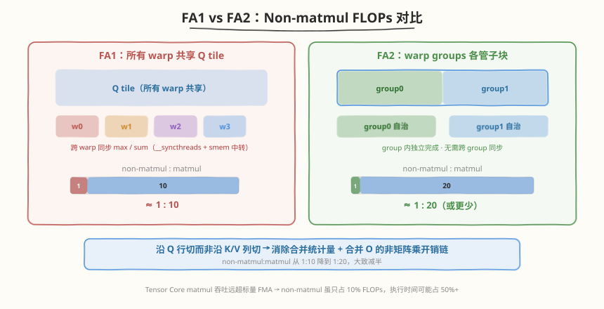
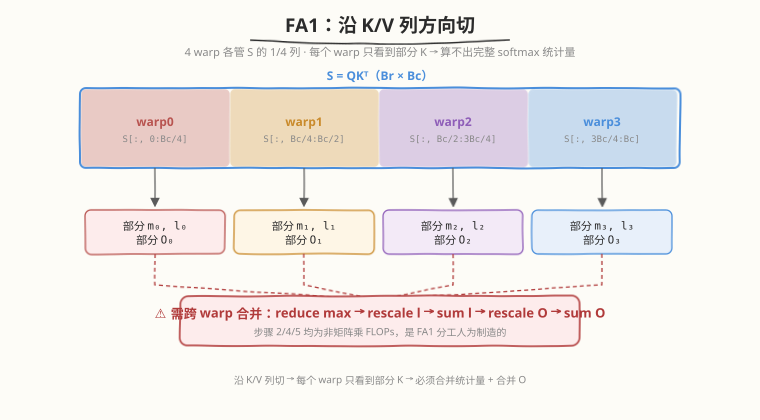
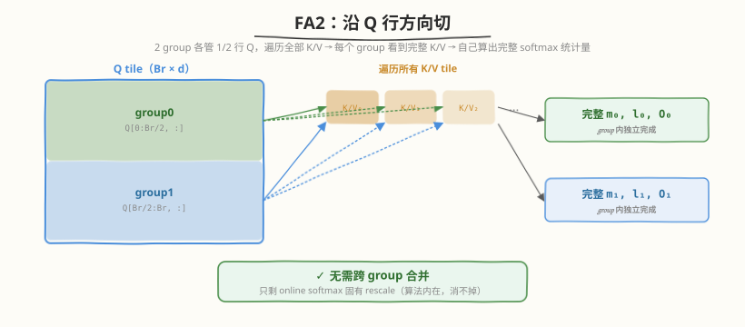
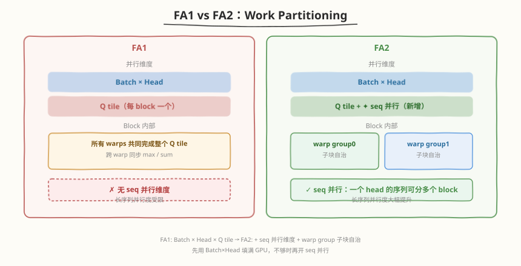
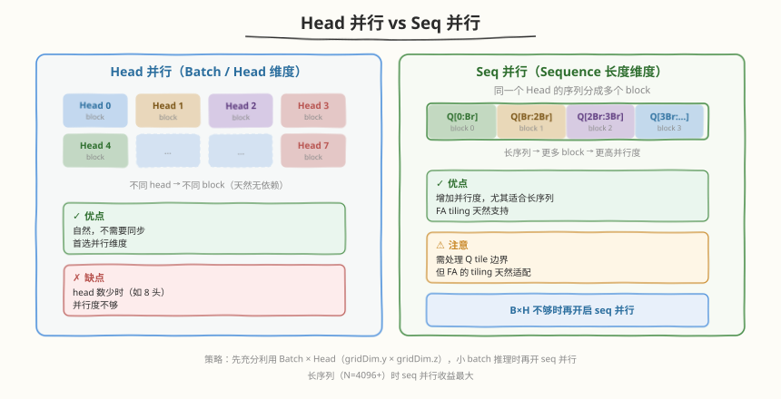
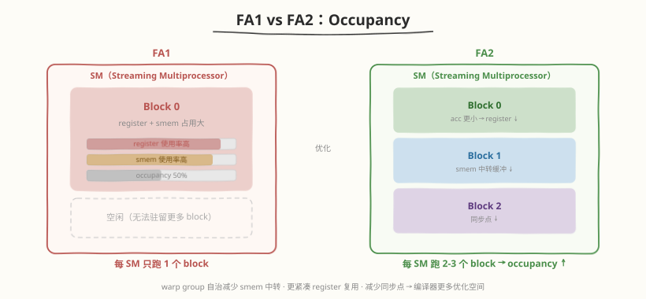
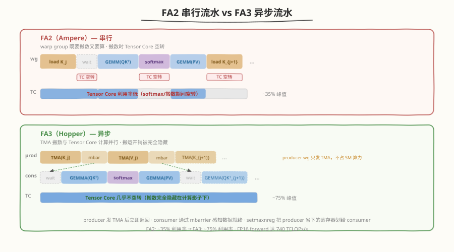
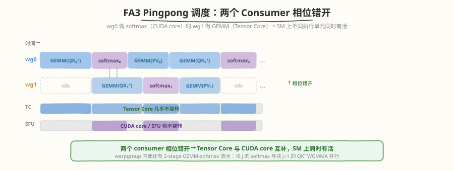
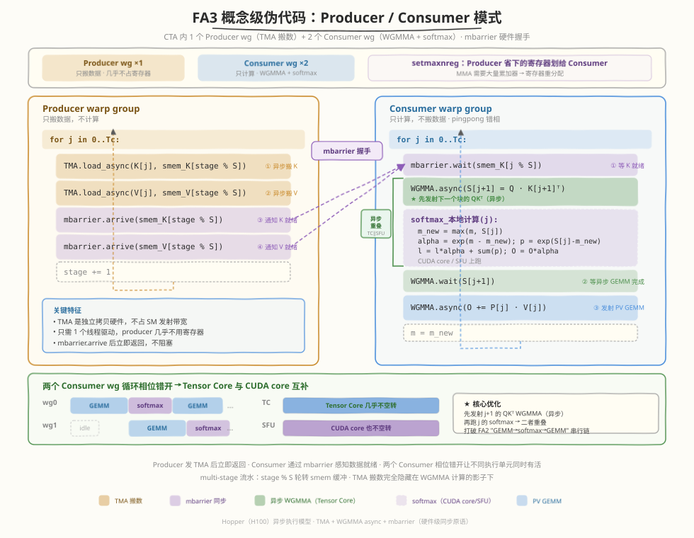

## Day 6：FlashAttention-2 论文与源码差异

### 🎯 目标

通过今天的学习，你将：

1. 理解 FlashAttention-2 相对 FA1 的三大关键改进：**减少 non-matmul FLOPs**、**更好的 work partitioning**、**更高的 occupancy**<br>
2. 掌握 FA2 的 **warp group 子块划分**策略，对比 Day 3 的"每 warp 若干 Q 行"划分<br>
3. 理解 **seq 并行 vs head 并行**的 trade-off，知道什么时候该用 seq 并行<br>
4. 能列出 FA1 vs FA2 的至少 5 个关键差异，解释每个改进的收益来源<br>
5. 能基于 FA2 思想优化 Day 3 手写 Kernel 的至少一项（warp group 分工或减少同步）<br>

> 💡 **为什么重要**：FA2 是当前 FlashAttention 的主流版本，面试中"FA1 vs FA2 区别"是高频追问。Day 3 我们手写了完整 FA Forward Kernel。今天聚焦 FA2 的算法改进——理解"为什么 FA2 比 FA1 快约 2x"，是从"读过源码"到"理解演进"的关键一步。明天 Day 7 做本周复盘与限时手撕。

---

### 学前导读：FA1 跑对了，但为什么还能更快

Day 3 手写 Kernel 时我们注意到，FA1 的 warp 分工是"所有 warp 共同完成一个 Q tile"，这导致跨 warp 之间存在冗余的 softmax 统计量同步。FA2 的核心洞察是：**如果把 Q tile 在行方向进一步划分给不同 warp groups，每个 group 独立完成自己子块的全部 online softmax，就能消除跨 group 同步**。

| 维度 | FA1 的问题 | FA2 的改进 | 收益 |
|------|-----------|-----------|------|
| Non-matmul FLOPs | softmax/rescale 跨 warp 冗余 | warp group 内独立完成 | ~2x 减少 |
| Work partitioning | 按 Q tile，warp 共享 | 按 Q tile 子块 + seq 并行 | 更高并行度 |
| Warp 同步 | 较多 block 级同步 | warp group 内自治 | 更少同步点 |
| Occupancy | register/smem 压力大 | 优化用量，更多 block 驻留 | 更高 occupancy |

> 💡 **一句话总结**：FA2 不是算法变了（三公式不变），而是把"谁做什么"重新分配——让 warp group 自治，减少不必要的通信和重复计算。这跟管理学一样：减少跨团队同步，让小组自治，效率更高。

---

### 理论学习

#### 4.1 FA1 的不足


FA1 存在三个效率问题：

```
FA1 的问题：
1. 不同 warp group 之间存在冗余的 softmax 统计量同步
2. 非 matmul 计算（online softmax 的 reduce/rescale）没有充分并行
3. Q tile 行 block 内部的 warp 分工不够细，导致部分 warp 空闲
```

##### 问题 1：跨 warp 冗余同步

FA1 中，一个 Block 的所有 warp 共同处理 Q tile。每个 warp 计算部分 S=QK^T，然后需要跨 warp 汇总 max 和 sum——这引入了 `__syncthreads` 和 shared memory 中转。

##### 问题 2：Non-matmul FLOPs 占比高

FA1 的 non-matmul FLOPs（softmax 的 exp/sum/rescale）与 matmul FLOPs 之比约为 1:10。在现代 GPU 上，matmul 有 Tensor Core 加速（吞吐远超 FMA），而 non-matmul 只能跑标量指令——non-matmul 成了瓶颈。

#### 4.2 FA2 改进一：减少 Non-Matmul FLOPs


FA2 的核心改进：**让一个 warp group 负责输出 tile 的一个子块（sub-tile），在 group 内部独立完成该子块的全部 online softmax 计算**。



##### 为什么沿 Q 行切能减少 non-matmul FLOPs？

上面的"group 内自治"听起来只是"换种分工"，为什么 FLOPs 会减少？关键不在"独立做"本身，而在于 **FA1 的分工方式强制引入了额外的非矩阵乘 FLOPs**，FA2 换一种切法就把这部分消掉了。

**FA1：沿 K/V 列方向切**——Block 内 4 个 warp 共同处理 $B_r$ 行 Q，但每个 warp 只负责 K/V 的一部分列：



每个 warp 只看到 K 的一部分，**算不出完整的 softmax 归一化常数**。每处理完一个 K/V tile，必须做跨 warp 合并：

1. **reduce max**：$m_{\text{global}} = \max(m_0, m_1, m_2, m_3)$（跨 warp 通信）
2. **rescale 每个 $l$**：$l_{\text{warp}} \mathrel{*}= \exp(m_{\text{warp}} - m_{\text{global}})$（每个 warp 都要做）
3. **sum $l$**：$l_{\text{global}} = l_0' + l_1' + l_2' + l_3'$（跨 warp 归约）
4. **rescale 每个 $O$**：$O_{\text{warp}} \mathrel{*}= l_{\text{warp}}' / l_{\text{global}}$（每个 warp 都要做，$B_r \times d$ 个元素）
5. **sum $O$**：$O = O_0' + O_1' + O_2' + O_3'$（跨 warp 归约 $B_r \times d$ 个元素）

步骤 2、4、5 都是**非矩阵乘 FLOPs**，且是 FA1 分工**人为制造**的——不切 K/V 就不需要合并。

**FA2：沿 Q 行方向切**——每个 warp group 负责若干行 Q，遍历全部 K/V 列：



每个 group 看到完整 K/V，**自己就能算出完整的 softmax 统计量**，不存在"部分 max/l/O 需要合并"。只剩 online softmax 本身固有的 rescale（每来一个新 K/V tile 更新 $m$、rescale $l$ 和 $O$）——这是算法内在的，消不掉。

| 非矩阵乘 FLOPs | FA1 | FA2 |
|---------------|-----|-----|
| online softmax 固有 rescale（更新 $m$/$l$/$O$） | 有 | 有（算法固有，消不掉） |
| 跨 warp 合并 max/$l$ | 有 | **无** |
| 合并触发的 $O$ rescale | 有 | **无** |
| 跨 warp 归约 $O$（$B_r \times d$ 元素求和） | 有 | **无** |

FA2 消掉的是后半部分——这些是 FA1 沿 K/V 列切**额外引入**的非矩阵乘工作。所以 non-matmul:matmul 从 1:10 降到 1:20，大致减半。

> 💡 **本质**：不是"自治"减少了 FLOPs，而是**沿 Q 行切而非沿 K/V 列切**，消除了"每个 warp 只看到部分 K → 必须合并统计量 + 合并 $O$"这一整条非矩阵乘开销链。

##### 为什么减少 non-matmul 很重要？

现代 GPU 的 Tensor Core matmul 吞吐远超标量 FMA（RTX 5090 上 FP16 Tensor Core matmul 远高于 FP32 FMA 104.75 TFLOPS，存在数量级差距）。因此即使 non-matmul FLOPs 只占 10%，它的执行时间可能占 50%+——因为标量指令慢得多。FA2 把 non-matmul 减半，直接缩小了这个瓶颈。

#### 4.3 FA2 改进二：更好的 Work Partitioning



##### 三层并行维度

| 并行维度 | FA1 | FA2 | 说明 |
|---------|-----|-----|------|
| Batch × Head | ✅ `blockIdx.z/y` | ✅ | 首选，天然无依赖 |
| Sequence length | ❌ | ✅ 新增 | 长 sequence 分多个 block |
| Warp group 内部 | 简单共享 | ✅ 子块自治 | 减少跨 warp 同步 |

##### Seq 并行 vs Head 并行



**选择策略**：先充分利用 Batch × Head 并行（gridDim.y × gridDim.z）。如果 B×H 不够大（如小 batch 推理），再开启 seq 并行。

#### 4.4 FA2 改进三：更高的 Occupancy



FA2 通过以下方式减少资源占用：
- warp group 自治减少了 shared memory 中转缓冲
- 更紧凑的 register 复用（子块划分让 acc 更小）
- 减少同步点 → 编译器有更多优化空间

#### 4.5 FA1 vs FA2 关键差异总结

| 维度 | FlashAttention-1 | FlashAttention-2 |
|------|------------------|------------------|
| Non-matmul 并行 | 不够充分（跨 warp 共享） | warp group 内独立完成 |
| Work partitioning | 按 Q tile，warp 共享 | 按 Q tile 子块 + seq 并行 |
| Warp 同步 | 较多 block 级 `__syncthreads` | 较少（group 内自治） |
| Occupancy | 较低（1 block/SM） | 较高（2-3 blocks/SM） |
| Non-matmul:matmul 比 | ~1:10 | ~1:20 |
| 反向传播 | 支持 | 更高效 |
| 长序列收益 | 好 | 更好 |
| 整体加速（vs FA1） | 基准 | ~2x |

#### 4.6 FlashAttention-3：Hopper 架构的终极优化

FA2 的设计面向 Ampere（A100）的同步执行模型——warp 同步发射 GEMM、串行 softmax。但搬到 Hopper（H100）后，FA2 **只有 ~35% 的利用率**：H100 新增的异步 Tensor Core（WGMMA）、异步拷贝引擎（TMA）、FP8 单元全部闲置。FA3 的目标就是**让 attention kernel 原生于 Hopper 的异步执行模型**，把利用率和精度同时推到极限。

> 📄 **深入阅读**：FA3 的 warp 特化、pingpong 调度、FP8 布局手术等完整分析见 [FA3 论文笔记](https://hzchenxiaobin.github.io/ai-infra-notes/paper/flashattention3/index.html)。

##### 改进一：Async Pipeline（异步数据加载）

FA2 中，一个 warp group 既要搬数据又要算——搬数时 Tensor Core 空转，算时搬运单元空闲。FA3 利用 Hopper 的 **TMA（Tensor Memory Accelerator）**——一个独立的拷贝硬件，不占 SM 发射带宽：



TMA 只需 1 个线程驱动，producer 几乎不用寄存器；`setmaxnreg` 把省下的寄存器划给 consumer（MMA 需要大量累加器）。producer/consumer 之间用 **mbarrier**（硬件级同步原语）做块级握手的多 stage 流水。

##### 改进二：Warp Specialization（producer-consumer 模式）

FA3 把 CTA 内的 warp group 分为两种角色：

| 角色 | 数量 | 职责 | 硬件通路 |
|------|------|------|---------|
| **Producer** | 1 个 wg | 只发 TMA 搬 K/V tile 到 shared memory | TMA（拷贝硬件） |
| **Consumer** | 2 个 wg | 只做 GEMMA + softmax | WGMMA（Tensor Core）+ CUDA core/SFU |

两个 consumer 以 **pingpong 调度**交替：wg0 做 softmax（CUDA core/SFU）时 wg1 做 GEMM（Tensor Core），反之亦然——**一个 SM 的 Tensor Core 与 CUDA core 同时有活干**。



此外，warpgroup 内部还有 **2-stage GEMM-softmax 流水**：块 $j$ 的 softmax 在 CUDA core 上执行的同时，块 $j+1$ 的 QKᵀ WGMMA 在 Tensor Core 上异步执行——打破 FA2 "GEMM→softmax→GEMM" 的串行链。

##### 改进三：FP8 支持（吞吐翻倍）

H100 的 FP8 Tensor Core 吞吐是 FP16 的 **2×**（989 → ~1979 TFLOPs/s）。FA3 支持 FP8（E4M3/E5M2）输入：

| 精度 | FA2 | FA3 | 吞吐（H100） |
|------|-----|-----|-------------|
| FP16 | ✅ | ✅ | ~989 TFLOPs/s |
| FP8 | ❌ | ✅ | ~1979 TFLOPs/s（2×） |

FP8 的难点不在算法而在**数据布局工程**——FP8 WGMMA 只接受 k-major 操作数，而 V 通常按 head dim 连续存储。FA3 在 kernel 内用 LDSM/STSM 指令做片上转置，全部安排在异步 WGMMA 的影子下执行。精度侧用**分块量化**（每 block 独立 scale factor）+ **incoherent processing**（Hadamard 旋转摊平 outlier），FP8 误差比 per-tensor 量化基线低 **2.6×**。

> 💡 FA3 的 FP8 中间计算（softmax 的 exp/sum/rescale）保持 **FP32**——这与 FA1/FA2 "中间结果留高精度" 的原则一脉相承。

##### 概念级伪代码：producer/consumer 模式



```text
# === Producer warp group ===（只搬数据，不计算）
for j in 0..Tc:
    TMA.load_async(K[j], smem_K[stage % S])     # 异步搬 K tile
    TMA.load_async(V[j], smem_V[stage % S])     # 异步搬 V tile
    mbarrier.arrive(smem_K[stage % S])           # 通知 consumer：数据就绪
    mbarrier.arrive(smem_V[stage % S])
    stage += 1

# === Consumer warp group ===（只计算，不搬数据，pingpong 错相）
for j in 0..Tc:
    mbarrier.wait(smem_K[j % S])                 # 等 producer 搬完
    WGMMA.async(S[j+1] = Q · K[j+1]ᵀ)          # ← 先发射下一个块的 QKᵀ（异步）
    softmax_本地计算(j):                          # CUDA core/SFU 上跑
        m_new = max(m, S[j])
        alpha = exp(m - m_new); p = exp(S[j] - m_new)
        l = l * alpha + sum(p); O = O * alpha
    WGMMA.wait(S[j+1])                           # 等异步 GEMM 完成
    WGMMA.async(O += P[j] · V[j])               # 发射 PV GEMM
    m = m_new
# 两个 consumer wg 的循环相位错开 → Tensor Core 与 CUDA core 互补
```

##### FA1 → FA2 → FA3 演进对比

| 维度 | FlashAttention-1 | FlashAttention-2 | FlashAttention-3 |
|------|------------------|------------------|------------------|
| 目标硬件 | A100（Ampere） | A100（Ampere） | H100（Hopper） |
| 核心优化 | IO 复杂度（tiling） | work partitioning | 异步流水 + 低精度 |
| Non-matmul:matmul | ~1:10 | ~1:20 | softmax 完全隐藏 |
| Warp 分工 | 共享 Q tile | warp group 子块自治 | producer/consumer 特化 |
| 并行维度 | Batch×Head | + seq 并行 | + warp group pingpong |
| 异步执行 | ❌ | ❌ | ✅ TMA + WGMMA async |
| FP8 支持 | ❌ | ❌ | ✅ E4M3/E5M2 |
| Occupancy（H100） | — | ~35% 峰值 | ~75% 峰值 |
| FP16 forward 峰值 | 基准 | ~570 TFLOPs/s | **740 TFLOPs/s** |
| vs 前代加速 | 基准 | ~2× vs FA1 | ~1.5–2× vs FA2 |
| 同步原语 | `__syncthreads` | warp group 内自治 | mbarrier（硬件级） |

> 💡 **一句话总结**：FA1 解决了 IO（tiling），FA2 解决了分工（warp group 自治），FA3 解决了异步（producer/consumer 流水）+ 低精度（FP8）。三代演进的核心线索是：**把越来越多的"非计算"工作藏进计算的影子**——先是减少 non-matmul FLOPs，再是把搬数和 softmax 完全异步化。

##### FA3 面试速问

1. **FA3 相比 FA2 的关键差异是什么？**
2. **Warp specialization 的 producer-consumer 模式是怎么工作的？**
3. **FP8 对精度有什么影响？FA3 如何应对？**

<details>
<summary>点击查看答案</summary>

  1. **FA3 vs FA2 关键差异**：① **异步流水**——用 TMA 异步搬数 + WGMMA 异步 GEMM，producer 搬数与 consumer 计算重叠，消除 FA2 的串行等待；② **Warp 特化**——producer/consumer 分工 + pingpong 调度，两个 consumer warpgroup 交替执行 GEMM 和 softmax，Tensor Core 不空转；③ **FP8 支持**——FP8 Tensor Core 吞吐翻倍，配合分块量化和 Hadamard 旋转控制误差。FA3 在 H100 上从 FA2 的 35% 利用率提升到 75%，FP16 forward 达 740 TFLOPs/s。

  2. **Warp specialization 原理**：CTA 内 warp group 分为 1 个 producer（用 TMA 搬 K/V tile 到 shared memory）和 2 个 consumer（做 WGMMA + softmax）。Producer 发 TMA 后立即返回（不占 SM 算力），consumer 通过 mbarrier 感知数据就绪后开始计算。两个 consumer 以 pingpong 交替——wg0 做 softmax（CUDA core）时 wg1 做 GEMM（Tensor Core），让 SM 上不同执行单元同时有活。`setmaxnreg` 把 producer 省下的寄存器划给 consumer。

  3. **FP8 对精度的影响**：FP8（E4M3）只有 3 位尾数，精度脆弱——LLM 激活的 outlier 会导致大量量化误差。FA3 用两招应对：① **分块量化**——Q/K/V 按 block 各自一个 scale factor（而非 per-tensor 一个），FA3 的分块结构天然按块反缩放 S，零计算成本；② **Incoherent processing**——Q、K 先乘随机正交矩阵 $M$（$O(d\log d)$，融入 RoPE），因 $MM^\top=I$ 不改变 $QK^\top$ 输出，但 outlier 被摊平到所有维度。最终 FP8 误差比 per-tensor 量化基线低 2.6×，且 softmax 全程保持 FP32。

</details>

---

### Coding 任务：基于 FA2 思想优化手写 Kernel

#### 任务 1：阅读 FA2 论文 Section 3

**论文**："FlashAttention-2: Faster Attention with Better Parallelism and Work Partitioning" (Dao, 2023)

**地址**：https://arxiv.org/abs/2307.08691

**阅读范围**：
- Section 3.1：减少 non-matmul FLOPs（warp group 子块划分）
- Section 3.2：更好的 work partitioning（seq 并行）

**记录要点**：在 `notes/fa2_paper_notes.md`（自行创建）中记录 FA2 的三大改进和你的理解。

#### 任务 2：修改 Day 3 Kernel 的 warp 分工

将 Day 3 的 `flash_attention_v2.cu` 修改为 FA2 风格的 warp group 划分：

```cuda
// Day 3 原版：每 warp 负责 ROWS_PER_WARP 行
// FA2 风格：把 warps 分成 groups，每 group 负责一个子块

// 修改示例：ROWS_PER_WARP 从 8 改为 4，增加 warp 间并行度
constexpr int WARPS_PER_BLOCK_FA2 = 16;                     // 16 warps = 512 threads
constexpr int ROWS_PER_WARP_FA2 = Br / WARPS_PER_BLOCK_FA2; // 64/16 = 4
// 每 warp 负责更少的行，但更多 warp 并行
// acc 从 [8][64] 缩小到 [4][64]，register 压力降低
```

编译运行，对比修改前后的 latency 和 register 使用量：

```bash
# 编译原版
nvcc -o flash_attention_v2 ../day3/kernels/flash_attention_v2.cu -O3 -arch=sm_120 -Xptxas -v

# 编译 FA2 风格版
nvcc -o flash_attention_fa2 kernels/flash_attention_fa2.cu -O3 -arch=sm_120 -Xptxas -v

# 对比 register 使用量（-Xptxas -v 输出）
# 预期：FA2 版 register/thread 更少，occupancy 更高
```

#### 任务 3：用 ncu 对比 occupancy 和同步开销

```bash
ncu --metrics \
 sm__occupancy.avg.pct_of_peak_sustained_elapsed,\
 sm__throughput.avg.pct_of_peak_sustained_elapsed,\
 launch__registers_per_thread \
 --kernel-name regex:flashAttention \
 ./flash_attention_v2 # 原版

ncu --metrics \
 sm__occupancy.avg.pct_of_peak_sustained_elapsed,\
 sm__throughput.avg.pct_of_peak_sustained_elapsed,\
 launch__registers_per_thread \
 --kernel-name regex:flashAttention \
 ./flash_attention_fa2 # FA2 风格版
```

**观察重点**：

| 指标 | 原版 (Day 3) | FA2 风格版 | 预期变化 |
|------|-------------|-----------|---------|
| Registers/thread | ~88-120 | ~60-80 | ↓（acc 更小） |
| Occupancy | ~50-75% | ~60-85% | ↑（register 减少后更多 block 驻留） |
| SM Throughput | ~30-40% | ~35-45% | ↑（并行度更高） |

#### 任务 4：LeetGPU 在线题目 —— Batched Matrix Multiplication

**题目链接**：<https://leetgpu.com/challenges/batched-matrix-multiplication>

**与今日知识的关联**：

FlashAttention-2 相比 FA1 的一大改进是 **更好的 work partitioning**：把 batch 维和 head 维提升到 grid 的最高维度，让每个 thread block 处理更小的子任务，从而减少同步、提高 occupancy。本题 Batched Matrix Multiplication 正是练习这种"多维 grid + batch offset 寻址"的最简场景——用 `blockIdx.z` 区分 batch，`blockIdx.x/y` 处理 M/N tile，与 FA2 官方 kernel 的 launch 策略同构。

> 💡 提交后在 [LeetGPU Batched GEMM 题目](https://leetgpu.com/challenges/batched-matrix-multiplication)上记录通过耗时，重点观察 batch size 增大时 latency 的增长曲线。完整题解（含 batched kernel launch、batch offset 寻址、与单矩阵 GEMM 的对比）见 [Batched Matrix Multiplication 题解](https://hzchenxiaobin.github.io/leetgpu/leetgpu-batched-matrix-multiplication-solution.html)。

#### 任务 5：LeetCode 面试题（10 周计划 · 第 5 周机动补漏）

> 📅 第 5 周计划共 16 题，已分配至 Day 1 - Day 3。今日不新增题目：补齐本周未完成的题目、重做本周错题，Day 7 统一复盘。

---

### 扩展实验

#### 实验 1：手动计算 non-matmul FLOPs

对于 N=1024, d=64, Br=Bc=128，计算 FA1 和 FA2 的 non-matmul FLOPs 占比。

> 提示：matmul FLOPs = 2×N²×d（QK^T + PV）。non-matmul = exp/add/rescale，约 3×N×(N/Bc) 次。FA2 通过 group 自治减半。

#### 实验 2：实现 seq 并行

修改 Day 3 Kernel，当 B×H 较小时（如 B=1, H=1），在 x 维度使用更多 block 处理同一个 head 的不同 Q tile 段。

> 提示：FA 的 tiling 天然支持——每个 block 处理 Br 行 Q，不同 block 处理不同段，无需额外同步。

#### 实验 3：对比 FA1 和 FA2 官方性能

如果环境允许（`pip install flash-attn`），用官方 FA1 和 FA2 跑同一组 N/B/H/d，记录加速比。

> 提示：长序列（N=4096+）时 FA2 优势最明显，因为 seq 并行和 reduced non-matmul 的收益随 N 增长。

---

### 今日总结

Day 6 我们深入理解了 FlashAttention-2 相对 FA1 的三大改进：

1. **减少 non-matmul FLOPs**：warp group 子块划分，让 softmax/rescale 在 group 内独立完成，non-matmul:matmul 从 1:10 降到 1:20
2. **更好的 work partitioning**：新增 seq 并行维度，长序列下并行度更高；warp group 自治减少跨 group 同步
3. **更高的 occupancy**：优化 register/smem 用量，每 SM 从 1 block 提升到 2-3 blocks
4. **核心思想**：算法不变（三公式不变），改进全在"谁做什么"——减少跨团队同步，让小组自治
5. **Seq 并行 vs Head 并行**：先用 Batch×Head 并行，不够时再开 seq 并行；长序列场景 seq 并行收益最大
6. **实践验证**：修改 Day 3 Kernel 的 warp 分工（ROWS_PER_WARP 减小），用 ncu 验证 occupancy 提升

掌握这些后，你就理解了 FlashAttention 从 FA1 到 FA2 的演进逻辑。明天 Day 7 做本周复盘与限时手撕。

---

### 面试要点

1. **FlashAttention-2 相比 FlashAttention-1 有哪些关键改进？**

<details>
<summary>点击查看答案</summary>

 1. **减少 non-matmul FLOPs**：通过 warp group 子块划分，让 softmax/rescale 计算在 warp group 内独立完成，减少冗余。non-matmul:matmul 从 1:10 降到 1:20
 2. **更好的 work partitioning**：除了 batch/head 并行，还引入 sequence 长度方向并行，提高长序列下的并行度
 3. **更高的 occupancy**：优化 register 和 shared memory 使用，每个 SM 可驻留更多 block（1→2-3）
 4. **更少的 warp 同步**：减少 block 级同步点，warp group 内自治
 5. **反向传播更高效**

</details>


2. **FlashAttention-2 中，seq 并行和 head 并行有什么区别？什么时候用 seq 并行？**

<details>
<summary>点击查看答案</summary>

 - **Head 并行**：不同 attention head 在不同 block 上并行，天然无依赖，是首选
 - **Seq 并行**：同一个 head 的序列分成多个 block 并行，增加并行度
 - **使用时机**：当 batch×head 数量不足以填满 GPU 时使用 seq 并行，尤其长序列场景
 - **注意**：seq 并行需要处理 Q tile 的边界，但 FlashAttention 的 tiling 天然适合这种划分

</details>


3. **为什么减少 non-matmul FLOPs 对性能影响这么大？**

<details>
<summary>点击查看答案</summary>

 - 现代 GPU 的 Tensor Core matmul 吞吐远超标量 FMA（RTX 5090 FP16 Tensor Core 远高于 FP32 FMA 104.75 TFLOPS，存在数量级差距）
 - 即使 non-matmul FLOPs 只占总 FLOPs 的 10%，它的执行时间可能占 50%+——因为标量指令慢 16x
 - FA2 把 non-matmul 减半，直接缩小了这个瓶颈
 - FA2 论文目标：让 non-matmul 占比降到 ~1:20，使 matmul 主导

</details>


4. **FA2 的 warp group 子块划分与 FA1 的 warp 共享有什么具体区别？**

<details>
<summary>点击查看答案</summary>

 - FA1：一个 Block 的所有 warp 共同处理 Q tile，跨 warp 需要同步 max/sum（`__syncthreads` + shared memory 中转）
 - FA2：把 Q tile 在行方向划分给不同 warp groups，每个 group 独立完成自己子块的全部 online softmax
 - 区别：FA2 的 group 内自治，消除跨 group 同步；acc 更小（子块行数少），register 压力降低
 - 收益：non-matmul FLOPs 减半 + occupancy 提升 + 同步点减少

 - 核心一致：都是"减少跨组同步，让计算单元自治"

</details>


5. **如果让你继续优化 FlashAttention（FA3 方向），你会怎么做？**

<details>
<summary>点击查看答案</summary>

 - **异步量化**：在 KV tile 加载时就做量化（FP16→INT8），减少 HBM 带宽
 - **更细粒度的 seq 并行**：结合 KV block 级并行，类似 PagedAttention 的分块
 - **Tensor Core 利用率**：确保 QK^T 和 PV 的 GEMM 形状适合 WMMA（M/N/K 对齐 16）
 - **减少 register spilling**：用 `__launch_bounds__` 控制编译器寄存器分配
 - **硬件感知调度**：根据 SM 数量、L2 cache 大小动态选择 Br/Bc

</details>

