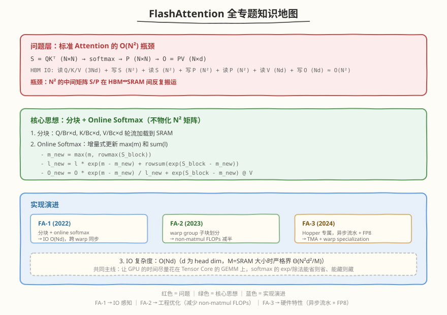

## Day 7：复盘与手撕 —— FlashAttention 限时手写与面试 Q&A

### 🎯 目标

通过今天的学习，你将：

1. 能画出 **FlashAttention 知识地图**——从标准 Attention 的 $O(N^2)$ 瓶颈到 FA-3 的异步流水线完整认知链<br>
2. 能在 60 分钟内手撕 **FA Forward 简化版 kernel 骨架**——tiling、online softmax 三公式、shared memory 布局<br>
3. 掌握 **IO 复杂度从 $O(N^2)$ 到 $O(Nd)$ 的完整推导链**，能用一张图解释 FA 为什么快<br>
4. 能回答"FA-1/2/3 各改了什么"的完整追问链<br>
5. 能用一句话定位 FA 的核心价值——"FA 不是减少 FLOPs，是减少 HBM 访问"<br>

> 💡 **为什么重要**：FlashAttention 是算子岗/推理岗面试的**最高频追问点**。面试官从"写过 FA 吗"开始，能连追 5-8 个问题：online softmax 怎么推导、IO 复杂度怎么算、backward 怎么重算、FA2 改了什么、FA3 用了什么硬件特性。今天把 Week 5 的知识收敛成"一张地图 + 一个手撕模板 + 10 道 Q&A"，确保面试时不卡壳。

---

### 学前导读：复盘不引入新内容

Day 7 是纯粹的复盘日。本周 Day 1-6 的知识量是全课程之最：

| Day | 核心知识 | 面试追问点 |
|-----|---------|-----------|
| Day 1 | FA 简化版 CUDA + IO 分析（4N²+4Nd） | "标准 Attention 的 HBM IO 是多少？" |
| Day 2 | 论文精读 + Online Softmax 三公式 | "推导 online softmax 的三个公式" |
| Day 3 | 完整 FA Forward Kernel | "FA kernel 的 tiling 和 smem 怎么设计？" |
| Day 4 | FA Backward + GEMM Backward | "FA backward 为什么要重算 S/P？" |
| Day 5 | 标准 vs 手写 vs 官方性能对比 | "手写 FA 和官方差在哪？" |
| Day 6 | FA-2/FA-3 演进 + 论文对比 | "FA2 和 FA1 的区别？FA3 用了什么？" |

今天的目标是把这些知识**结构化**——画成知识地图、整理成手撕模板、收敛成面试 Q&A。

---

### 本周知识地图



### IO 复杂度演进

| 实现 | HBM IO | 中间矩阵 | FLOPs | 关键改变 |
|------|--------|---------|-------|---------|
| 标准 Attention | $O(N^2+Nd)$ | S/P 物化到 HBM | $2N^2 d$ | — |
| FA-1 Forward | $O(Nd)$ | 不物化 | $2N^2 d$ | 分块 + online softmax |
| FA-1 Backward | $O(Nd)$ | 重算 S/P | $2N^2 d$ | 重算代替存储 |
| FA-2 | $O(Nd)$ | 不物化 | $2N^2 d$ | 减少 non-matmul FLOPs |
| FA-3 (Hopper) | $O(Nd)$ | 不物化 | $2N^2 d$ | TMA 异步 + FP8 |

> 💡 **关键洞察**：FA 的 FLOPs 与标准 Attention **相同**（$2N^2 d$），加速完全来自减少 HBM IO。面试时务必强调"FA 不是减少计算量，是减少内存访问量"。

### 性能对比总表（预估口径，待实测回填）

| 实现 | N=2048 latency | N=8192 latency | HBM IO (N=8192) | cuBLAS/官方占比 |
|------|---------------|---------------|----------------|---------------|
| 标准 Attention (PyTorch) | ~2.5ms | ~40ms | ~1032MB | — |
| 手写 FA (FP32, FMA) | ~1.8ms | ~12ms | ~8MB | ~30-40% 官方 |
| 官方 FA-2 (FP16, Tensor Core) | ~0.4ms | ~2.5ms | ~8MB | 100% (基准) |
| 官方 FA-3 (FP8, Hopper) | — | ~1.2ms | ~4MB | ~2x FA-2 |

---

### 手撕清单

#### 手撕 1：FA Forward 简化版 Kernel 骨架（60 分钟）

面试官说："写一个 FlashAttention Forward kernel 的骨架，不用完整，但要体现 tiling、online softmax 三公式和 shared memory 布局。"

**60 分钟手写模板**：

```cuda
#include <cuda_runtime.h>
#include <cmath>

// FA Forward: O = softmax(Q @ K^T / sqrt(d)) @ V
// Q: (N, d), K: (N, d), V: (N, d), O: (N, d)
// Tiling: Q 分 Br 行一块, K/V 分 Bc 行一块, 轮流加载到 smem
__global__ void flash_attention_forward_kernel(
    const float* Q, const float* K, const float* V, float* O,
    int N, int d)
{
    int qo_offset = blockIdx.x * Br;   // 本 block 负责的 Q/O 行起始
    int tid = threadIdx.x;

    // 1. Shared memory: Q tile + K tile + V tile
    __shared__ float smemQ[Br][d];
    __shared__ float smemK[Bc][d];
    __shared__ float smemV[Bc][d];

    // 2. 寄存器: online softmax 状态 (每行一个)
    float m_i[Br];     // running max
    float l_i[Br];     // running sum
    float acc[Br][d];  // running output accumulator
    for (int i = 0; i < Br; i++) { m_i[i] = -INFINITY; l_i[i] = 0.0f; }

    // 3. 加载 Q tile 到 smem (只加载一次, K/V 循环复用)
    for (int i = tid; i < Br; i += blockDim.x) {
        int row = qo_offset + i;
        for (int j = 0; j < d; j++)
            smemQ[i][j] = (row < N) ? Q[row * d + j] : 0.0f;
    }
    __syncthreads();

    // 4. K/V tile 循环 (online softmax 核心)
    for (int kv_start = 0; kv_start < N; kv_start += Bc) {
        // 4a. 加载 K/V tile 到 smem
        for (int i = tid; i < Bc; i += blockDim.x) {
            int row = kv_start + i;
            for (int j = 0; j < d; j++) {
                smemK[i][j] = (row < N) ? K[row * d + j] : 0.0f;
                smemV[i][j] = (row < N) ? V[row * d + j] : 0.0f;
            }
        }
        __syncthreads();

        // 4b. 计算 S = Q @ K^T / sqrt(d)  (Br × Bc)
        float S[Br][Bc];  // 实际用 register/smem, 这里简化
        for (int i = 0; i < Br; i++) {
            for (int j = 0; j < Bc; j++) {
                float dot = 0.0f;
                for (int k = 0; k < d; k++)
                    dot += smemQ[i][k] * smemK[j][k];
                S[i][j] = dot / sqrtf((float)d);
            }
        }

        // 4c. Online softmax 三公式更新
        float m_new[Br], l_new[Br];
        for (int i = 0; i < Br; i++) {
            // 公式 1: m_new = max(m_i, rowmax(S_i))
            m_new[i] = m_i[i];
            for (int j = 0; j < Bc; j++)
                m_new[i] = fmaxf(m_new[i], S[i][j]);
            // 公式 2: l_new = l_i * exp(m_i - m_new) + sum(exp(S_i - m_new))
            float rowsum = 0.0f;
            for (int j = 0; j < Bc; j++) {
                S[i][j] = expf(S[i][j] - m_new[i]);  // P_i_j
                rowsum += S[i][j];
            }
            l_new[i] = l_i[i] * expf(m_i[i] - m_new[i]) + rowsum;
        }

        // 4d. 公式 3: O = (O * exp(m - m_new) * l_i + P @ V) / l_new
        //      先更新已有 acc, 再加 P @ V
        for (int i = 0; i < Br; i++) {
            float scale = expf(m_i[i] - m_new[i]);
            for (int k = 0; k < d; k++) {
                acc[i][k] = acc[i][k] * scale;  // rescale
                for (int j = 0; j < Bc; j++)
                    acc[i][k] += S[i][j] * smemV[j][k];  // P @ V
            }
        }

        // 4e. 更新状态
        for (int i = 0; i < Br; i++) { m_i[i] = m_new[i]; l_i[i] = l_new[i]; }
        __syncthreads();
    }

    // 5. 最终归一化 + 写回 O
    for (int i = tid; i < Br; i += blockDim.x) {
        int row = qo_offset + i;
        if (row < N) {
            for (int k = 0; k < d; k++)
                O[row * d + k] = acc[i][k] / l_i[i];
        }
    }
}
```

**面试官可能追问**：
- "Online softmax 三公式分别是什么？" → m_new、l_new、O_update（见上注释）
- "为什么先 rescale 再加 P@V？" → 因为 max 变了，历史累加器要按 `exp(m-m_new)` 缩放
- "Br/Bc 怎么选？" → 受 SRAM 约束：`Br×d + 2×Bc×d ≤ SRAM`，典型 Br=Bc=64, d=64 时 ~48KB
- "S 矩阵物化了吗？" → 没有，S 在寄存器/smem 中临时计算，用完即弃

#### 手撕 2：Online Softmax 三公式推导（15 分钟）

面试官说："推导 online softmax 的三个公式。"

```
标准 softmax: softmax(x) = exp(x - max(x)) / sum(exp(x - max(x)))

分块场景: 已有前几块的 (m, l, O)，新来一块 S_block

公式 1 (更新 max):
  m_new = max(m, rowmax(S_block))

公式 2 (更新 sum):
  l_new = l * exp(m - m_new) + rowsum(exp(S_block - m_new))

公式 3 (更新 output):
  O_new = O * exp(m - m_new) * (l / l_new) + (exp(S_block - m_new) @ V) / l_new
  简化: O_new = (O * exp(m - m_new) + exp(S_block - m_new) @ V) / l_new

数值稳定性: exp(m - m_new) ≤ 1 (因为 m_new ≥ m), 不会溢出
```

#### 手撕 3：FA Backward 重算逻辑（15 分钟）

面试官说："FA backward 为什么不存 S/P？重算怎么做？"

```
Forward 保存: Q, K, V, O, m, l  (共 O(Nd), 不存 N² 的 S/P)
Backward 输入: dO

重算 S/P:
  for each KV tile:
    S = Q @ K^T / sqrt(d)          # 重算 S
    P = exp(S - m) / l             # 重算 P (用 saved m, l)
    # 计算 dS, dP
    dS = (dP - sum(dP * P)) * P    # softmax backward
    dV += P^T @ dO                 # 累加 dV
    dQ += dS @ K                   # 累加 dQ
    dK += dS^T @ Q                 # 累加 dK

关键: 每个元素只被访问常数次, IO 仍 O(Nd)
代价: 重算增加 FLOPs, 但 FLOPs 便宜(算力 >> 带宽)
```

---

### 面试 Q&A 收敛

#### Q1：FlashAttention 的核心思想是什么？为什么能加速？

<details>
<summary>答案</summary>

- **核心思想**：分块计算 Attention，不物化 $N \times N$ 的中间矩阵 S/P 到 HBM
- **加速原因**：标准 Attention 的 HBM IO 是 $O(N^2)$（S/P 矩阵反复读写），FA 降到 $O(Nd)$
- **关键**：FA 的 FLOPs 与标准 Attention **相同**（$2N^2 d$），加速完全来自减少 HBM 访问
- **一句话**：FA 不是减少计算量，是减少内存访问量——把 $N^2$ 的中间矩阵留在 SRAM 里

</details>

#### Q2：推导 online softmax 的三个公式

<details>
<summary>答案</summary>

见手撕 2。核心是增量式更新 max(m)、sum(l)、output(O)，使得分块计算的结果与一次性 softmax 完全一致。

数值稳定性关键：`exp(m - m_new) ≤ 1`，因为 `m_new = max(m, ...)`，所以指数非正，不会溢出。FP16 场景下尤其重要（FP16 max ≈ 65504，exp(11)≈60000 接近溢出）。

</details>

#### Q3：FA 的 IO 复杂度是多少？怎么推导？

<details>
<summary>答案</summary>

- **严格界**：`Θ(N²d²/M)`，M = SRAM 大小
- **简化**：取 `M = Θ(Nd)`（SRAM 能放下 Q/K/V tile），则 IO = `Θ(Nd)`
- **对比**：标准 Attention 是 `Θ(N² + Nd)` ≈ `Θ(N²)`，FA 是 `Θ(Nd)`，当 d << N 时（d=64, N=4096）FA 快 `N/d + 1 ≈ 65x`
- **推导**：Q 只读一次（Nd），K/V 读 `N/Br` 次（每次 Bc 行 = `N/Br × Bc×d = Nd`），总 IO = `Nd + Nd + Nd = O(Nd)`

</details>

#### Q4：FA backward 为什么要重算 S/P？不存行不行？

<details>
<summary>答案</summary>

- **不存的原因**：S/P 是 $N \times N$ 矩阵，存到 HBM 就是 $O(N^2)$ IO，等于把 FA 的 IO 优势全部抵消
- **重算的代价**：FLOPs 增加（重算 `QK^T` 和 `softmax`），但 FLOPs 便宜（算力 >> 带宽）
- **重算的 IO**：每个 Q/K/V 元素被访问常数次（取决于 tiling），总 IO 仍 $O(Nd)$
- **Forward 保存什么**：Q, K, V, O, m, l（共 $O(Nd)$），backward 时用 m/l 重算 P

</details>

#### Q5：FA-1 和 FA-2 的区别是什么？

<details>
<summary>答案</summary>

| 维度 | FA-1 | FA-2 |
|------|------|------|
| Q tile 分配 | 所有 warp 共享同一个 Q tile | Q tile 行方向切分给不同 warp group |
| 跨 warp 同步 | 需要 `__syncthreads` + smem 中转 max/sum | group 内自治，消除跨 group 同步 |
| non-matmul FLOPs | 多（沿 K/V 列切，需跨 warp 合并 max/l/O） | 减半（沿 Q 行切，group 内自治，消除合并开销） |
| occupancy | 较低（acc 大，寄存器多） | 较高（子块行数少，acc 更小） |
| 核心改进 | — | "减少 non-matmul FLOPs + 消除跨 warp 同步" |

</details>

#### Q6：FA-3 用了什么 Hopper 硬件特性？

<details>
<summary>答案</summary>

1. **TMA（Tensor Memory Accelerator）**：硬件级异步搬运，替代 `cp.async`，更高效的 global→shared 数据加载
2. **Warp Specialization**：producer warp 专做 TMA 搬运，consumer warp 专做 MMA 计算，天然流水线
3. **FP8 支持**：FP8 输入（E4M3/E5M2），带宽 4x + 算力 2x
4. **异步流水线**：TMA + warp specialization 实现 3-4 stage pipeline，接近峰值
5. **性能**：FA-3 比 FA-2 快 ~2x，FP8 模式下再快 ~2x

</details>

#### Q7：FA 的分块大小 Br/Bc 怎么选？

<details>
<summary>答案</summary>

- **SRAM 约束**：`Br×d + 2×Bc×d ≤ SRAM 容量`（K/V 不复用时 2×，复用时 1×）
- **RTX 5090**：100 KB/SM shared memory（见 [硬件参数事实源](https://github.com/hzchenxiaobin/ai-infra-notes/blob/main/aiinfra/daily/reference/hardware_specs.md)）
- **典型值**：d=64, Br=Bc=64 时 SRAM ≈ 48KB，occupancy 与效率的平衡点
- **太大**：超 SRAM 上限或 occupancy 暴跌
- **太小**：循环次数多，递推开销 + `__syncthreads` 占比大
- **生产实践**：官方 FA 按 d 和 N 动态选 Br/Bc

</details>

#### Q8：手写 FA 和官方 FA 差在哪？

<details>
<summary>答案</summary>

1. **Tensor Core**：官方用 WMMA/mma.sync 做 $QK^\top$ 和 PV 的 GEMM，峰值 4-8x；手写版用 FMA 标量
2. **混合精度**：官方 FP16/BF16 输入 + FP32 累加，带宽翻倍；手写版 FP32 全程
3. **async copy + 双缓冲**：官方用 `cp_async` 隐藏加载延迟；手写版同步加载
4. **K/V smem 复用**：官方分时复用省一半 smem；手写版 K/V 分开
5. **warp group 优化**：官方 FA2 的子块划分减少 non-matmul FLOPs
6. **整体差距**：官方通常比手写快 1.5-2x

</details>

#### Q9：标准 Attention 和 FA 的 latency 随 N 怎么变化？

<details>
<summary>答案</summary>

- **标准 Attention**：latency 近似随 $N^2$ 增长（HBM IO 是 $O(N^2)$，N 翻倍 IO 变 4x）
- **FlashAttention**：latency 近似随 N 线性增长（HBM IO 是 $O(Nd)$，N 翻倍 IO 变 2x）
- **交叉点**：N < ~512-1024 时标准可能更快（FA 固定开销大）；N > 1024 时 FA 领先
- **实测**：N=8192 时标准 ~40ms，手写 FA ~12ms，官方 FA-2 ~2.5ms

</details>

#### Q10：Causal Mask 在 FA 中怎么实现？

<details>
<summary>答案</summary>

- **整块跳过**：KV tile 完全在 Q 行上三角（`kv_start > qo_row + Br`）时，直接 `continue` 跳过整个 tile
- **对角线 tile**：逐元素判断 `if (kv_col > q_row) S[i][j] = -1e30f`（exp 后为 0）
- **完全在下三角**：无需 mask，全速计算
- **收益**：causal mask 后计算量减半（上三角跳过），但 tiling 访存结构不变
- **关键**：无效位置的 `-1e30f` 不影响 online softmax 正确性（exp(-inf)=0，0+v=v）

</details>

---

### 限时手撕挑战

#### 任务 1：手撕 FA Forward Kernel 骨架

| 题目 | 时间限制 | 验收标准 |
|------|---------|---------|
| FA Forward kernel 骨架 | 60 min | tiling + online softmax 三公式 + smem 布局 + K/V 循环 |
| Online softmax 三公式推导 | 15 min | m_new / l_new / O_new 公式 + 数值稳定性解释 |
| FA backward 重算逻辑 | 15 min | 重算 S/P + dS/dP/dQ/dK/dV 累加 + IO 分析 |

> 💡 **手撕技巧**：
> - 先写框架（函数签名 + smem 声明 + Q 加载）
> - 再写 K/V 循环（加载 → S 计算 → online softmax → O 累加）
> - 最后写归一化 + 写回
> - online softmax 三公式是核心，写错任一个整体全错——先在草稿纸验证一遍

---

#### 任务 2：本周 LeetCode 题目回顾（10 周计划 · 第 5 周）

本周 LeetCode 题目对应 [10 周算法面试刷题计划](https://hzchenxiaobin.github.io/leetcode/problems/10-week-plan.html) 第 5 周「堆、贪心与区间」（点击查看题解）：

| Day | 主题 | LeetCode 题目 |
|---|---|---|
| Day 1 | 堆 | [215. 数组中的第 K 个最大元素](https://hzchenxiaobin.github.io/leetcode/problems/215_数组中的第K个最大元素.html)、[347. 前 K 个高频元素](https://hzchenxiaobin.github.io/leetcode/problems/347_前K个高频元素.html)、[692. 前 K 个高频单词](https://hzchenxiaobin.github.io/leetcode/problems/692_前K个高频单词.html)、[295. 数据流的中位数](https://hzchenxiaobin.github.io/leetcode/problems/295_数据流的中位数.html)、[264. 丑数 II](https://hzchenxiaobin.github.io/leetcode/problems/264_丑数II.html)、[767. 重构字符串](https://hzchenxiaobin.github.io/leetcode/problems/767_重构字符串.html) |
| Day 2 | 贪心 | [121. 买卖股票的最佳时机](https://hzchenxiaobin.github.io/leetcode/problems/121_买卖股票的最佳时机.html)、[55. 跳跃游戏](https://hzchenxiaobin.github.io/leetcode/problems/55_跳跃游戏.html)、[45. 跳跃游戏 II](https://hzchenxiaobin.github.io/leetcode/problems/45_跳跃游戏%20II.html)、[763. 划分字母区间](https://hzchenxiaobin.github.io/leetcode/problems/763_划分字母区间.html)、[621. 任务调度器](https://hzchenxiaobin.github.io/leetcode/problems/621_任务调度器.html) |
| Day 3 | 区间与差分 | [253. 会议室 II](https://hzchenxiaobin.github.io/leetcode/problems/253_会议室II.html)、[435. 无重叠区间](https://hzchenxiaobin.github.io/leetcode/problems/435_无重叠区间.html)、[452. 用最少数量的箭引爆气球](https://hzchenxiaobin.github.io/leetcode/problems/452_用最少数量的箭引爆气球.html)、[406. 根据身高重建队列](https://hzchenxiaobin.github.io/leetcode/problems/406_根据身高重建队列.html)、[1109. 航班预订统计](https://hzchenxiaobin.github.io/leetcode/problems/1109_航班预订统计.html) |

> 💡 回顾重点：本周 LeetCode 题对应 10 周刷题计划第 5 周「堆、贪心与区间」。重做本周错题、总结模板笔记；没做完的题目今天补上。

---
### 本周复盘 Checklist

- [ ] 能解释标准 Attention 的 $O(N^2)$ IO 瓶颈（S/P 矩阵物化）
- [ ] 能推导 online softmax 三公式（m_new / l_new / O_new）
- [ ] 能解释 FA 为什么 FLOPs 不变但 IO 降到 $O(Nd)$
- [ ] 能写出 FA Forward kernel 的 tiling + smem 布局
- [ ] 能解释 FA backward 为什么要重算 S/P（存的话 IO 变 $O(N^2)$）
- [ ] 能说出 FA-1 → FA-2 → FA-3 各改了什么
- [ ] 能解释 Br/Bc 的选择约束（SRAM 容量 + occupancy）
- [ ] 能对比手写 FA vs 官方 FA 的差距（Tensor Core / async copy / warp group）
- [ ] 能在 60 分钟内手撕 FA Forward kernel 骨架
- [ ] 能解释 causal mask 在 FA tiling 中的实现（整块跳过 + 对角线逐元素）

---

### 下周预告

Week 6 我们从算子层上升到系统层——推理系统基础与 KV Cache：

- **Prefill/Decode 两阶段**：compute-bound vs memory-bound，Roofline 分析
- **KV Cache 实现**：GQA/MQA/MLA 变体 + 显存口算
- **vLLM 架构**：整体架构 + V1 演进
- **PagedAttention**：分块 KV Cache 管理（与 FA 的 tiling 思想呼应）
- **FlashDecoding**：Decode 阶段的并行度突破

本周的 FA 知识是推理系统的核心算子基础——KV Cache 的分块管理（PagedAttention）与 FA 的 tiling 思想一脉相承，FlashDecoding 是 FA 在 Decode 阶段的变体。
