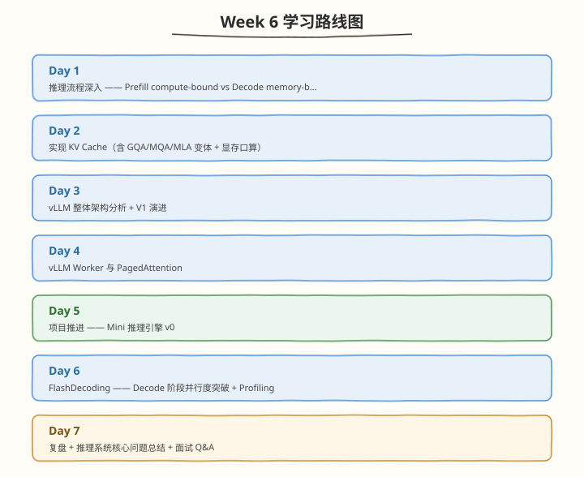

# Week 6：推理系统基础与 KV Cache

> 核心目标：掌握 Prefill/Decode 推理流程、KV Cache（GQA/MQA/MLA）、vLLM 架构、PagedAttention、FlashDecoding 与 Mini 引擎 v0

| 项目　　　 | 说明　　　　　　　　　　　　　　　　　　　　　　　　　　　　　|
| ------------| ------------------------------------------------------------|
| 前置要求　 | 已完成 Week 5，掌握 FlashAttention 全专题、C++ Extension　　　　　　　　　　　　　　　　　　　　　　　|
| 建议时长　 | 工作日每天 2.5h，周末每天 6h，周计 24.5h　　　　　　　　　　|
| 本周产出　 | KV Cache kernel（含 GQA/MQA/MLA）、PagedAttention kernel、FlashDecoding kernel、Mini 引擎 v0、vLLM 架构分析　　　　　　　　　　　　　　　　　　　　　　　　　|
| 周日里程碑 | Mini 引擎 v0 端到端可跑，KV Cache kernel PASS，理解 vLLM 三层架构与 PagedAttention block table　　　　　　　　　　　　　　　　　　　　　　　|

---

## 🧭 本周学习地图

---

## 📚 每日学习材料

| Day | 主题 | 目录 |
|-----|------|------|
| Day 1 | 推理流程 —— Prefill vs Decode | [day1/](https://hzchenxiaobin.github.io/ai-infra-notes/week6/day1.html) |
| Day 2 | 实现 KV Cache（含 GQA/MQA/MLA 变体） | [day2/](https://hzchenxiaobin.github.io/ai-infra-notes/week6/day2.html) |
| Day 3 | vLLM 整体架构分析 | [day3/](https://hzchenxiaobin.github.io/ai-infra-notes/week6/day3.html) |
| Day 4 | vLLM Worker 与 PagedAttention | [day4/](https://hzchenxiaobin.github.io/ai-infra-notes/week6/day4.html) |
| Day 5 | 项目推进 —— Mini 推理引擎 v0 | [day5/](https://hzchenxiaobin.github.io/ai-infra-notes/week6/day5.html) |
| Day 6 | FlashDecoding —— Decode 阶段并行度突破 | [day6/](https://hzchenxiaobin.github.io/ai-infra-notes/week6/day6.html) |
| Day 7 | 推理系统核心问题总结 | [day7/](https://hzchenxiaobin.github.io/ai-infra-notes/week6/day7.html) |
