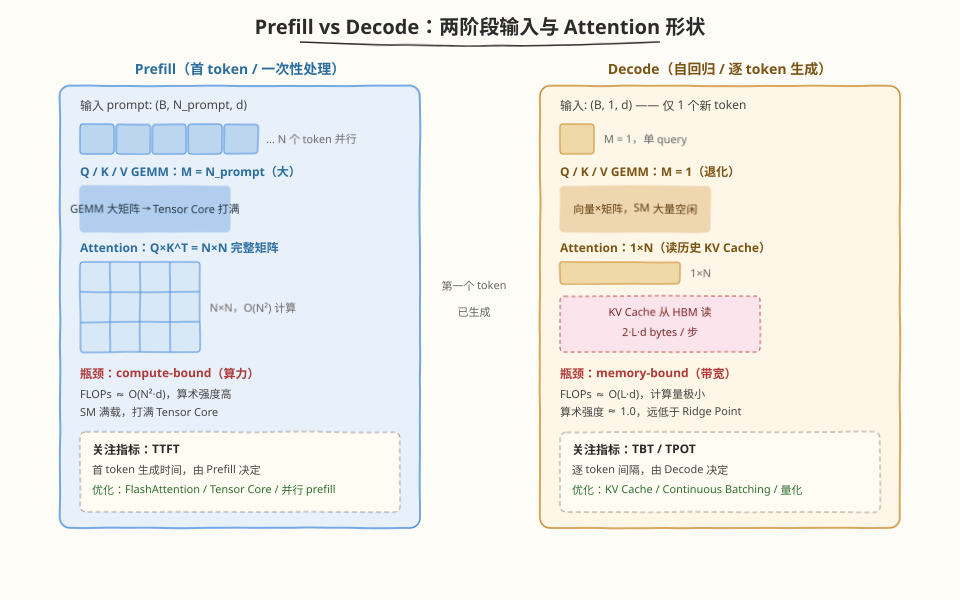
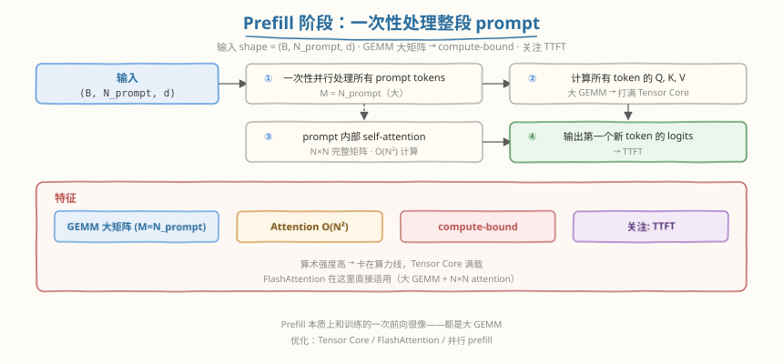
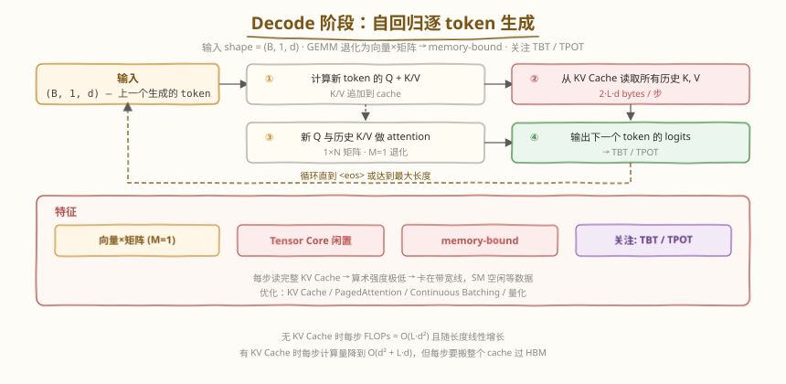
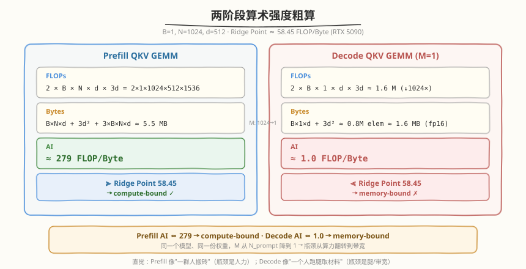
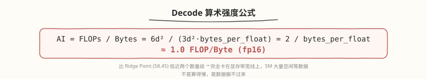
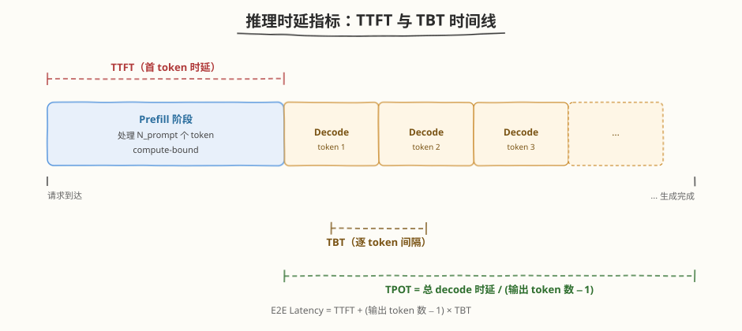

## Day 1：推理流程 —— Prefill vs Decode

### 🎯 目标

通过今天的学习，你将：

1. 理解 LLM 推理的 **Prefill 与 Decode 两阶段本质差异**——输入形状、Attention 矩阵形状、瓶颈类型完全不同<br>
2. 掌握 **TTFT / TBT / TPOT** 三大推理时延指标的定义，能说清各自由哪个阶段决定、如何优化<br>
3. 能用 **Arithmetic Intensity + Roofline** 解释为什么 Decode 是 memory-bound、Prefill 是 compute-bound<br>
4. 学会用 PyTorch 手写一个最小 Transformer Block，模拟 **Prefill + KV Cache + Decode 循环**，实测两阶段 latency<br>
5. 理解 KV Cache 的收益直觉（每步 FLOPs 从 $O(L \cdot d^2)$ 降到 $O(d^2 + L \cdot d)$），为 Day 2 手写 KV Cache 打基础<br>

> 💡 **为什么重要**：Week 5 我们把 FlashAttention 这个算子彻底吃透，但那只是推理系统里的"一颗螺丝"。从 Week 6 开始进入 AI Infra 的核心战场——**推理系统**。"Prefill vs Decode"是推理系统入门第一考点：所有后续优化（KV Cache、PagedAttention、Continuous Batching、量化）都在回答一个问题——"如何让 memory-bound 的 Decode 跑得更快"。今天把两阶段算清楚，后面整周才有支点。

---

### 学前导读：为什么"推理"和"训练"是两回事，且推理更难优化

训练时，模型一次吞进一大批数据（`batch` 大、序列长），GEMM 都是"大矩阵乘"，Tensor Core 打满，瓶颈在算力——这正是 Week 1-4 我们反复优化的场景。但**推理（inference / serving）完全不同**：用户输入一段 prompt，模型要**一个一个 token 自回归地吐出来**。

这两件事的硬件特征天差地别：

| 场景 | 每步处理的 token 数 | GEMM 形状 | 瓶颈 |
|------|------------------|-----------|------|
| 训练 | 一整批（M 很大） | 大矩阵乘 | compute-bound |
| 推理 Prefill | 整段 prompt（M = N_prompt） | 大矩阵乘 | compute-bound |
| 推理 Decode | **1 个 token（M = 1）** | 向量×矩阵（退化） | **memory-bound** |

关键矛盾在于：Decode 每步只算 1 个新 token 的 Q，却要把**所有历史 K/V 从 HBM 搬过来看一遍**。计算量极小，数据搬运量巨大，SM 大量时间在"等数据"——这就是推理系统优化的全部出发点。Week 4 Day 1 我们第一次画过 Prefill/Decode 的草图，今天要把它的计算/访存特征**量化**出来。

> 💡 **一句话总结**：推理难优化，是因为 Decode 把"大矩阵乘的 compute-bound"退化成了"M=1 的 memory-bound"——Tensor Core 使不上劲，瓶颈从算力变成了带宽。本周所有技术都在和这个矛盾搏斗。

---

### 理论学习

#### 1.1 Prefill 阶段：一次性处理整段 prompt



Prefill 是推理的第一步：把用户输入的 `N_prompt` 个 prompt token **一次性并行**喂进模型，计算每个 token 的 Q/K/V，做完整的 $N \times N$ self-attention，输出**第一个新 token** 的 logits。



Prefill 本质上和训练的一次前向很像——都是大 GEMM，Week 5 的 FlashAttention 在这里直接适用。所以 Prefill 的优化我们相对熟悉：用 Tensor Core、用 FlashAttention 减少 $O(N^2)$ 的 HBM 读写、必要时并行 prefill 多个请求。

#### 1.2 Decode 阶段：自回归逐 token 生成

第一个 token 由 Prefill 产出后，接下来就是 Decode：每次只输入**上一步生成的 1 个 token**，计算它的 Q，从 **KV Cache** 读取所有历史 K/V，做一次 1×N 的 attention，输出下一个 token。如此循环直到 `<eos>` 或达到最大长度。



> ⚠️ **注意**：如果没有 KV Cache，Decode 每步都要把"prompt + 已生成部分"重新跑一遍前向来算历史 K/V，FLOPs 是 $O(L \cdot d^2)$ 且随长度线性增长。KV Cache 把历史 K/V 存下来直接读，让每步计算量降到 $O(d^2 + L \cdot d)$（projection 部分 $O(d^2)$，attention 部分 $O(L \cdot d)$）——但代价是每步要从 HBM 把整个 cache 搬一遍。Day 2 我们会亲手实现这个 cache。

#### 1.3 两大阶段对比表

| 维度 | Prefill | Decode |
|------|---------|--------|
| 输入形状 | (B, N_prompt, d) | (B, 1, d) |
| 每步处理 token 数 | N_prompt（大） | 1 |
| QKV GEMM 的 M | N_prompt | **1**（退化为向量×矩阵） |
| Attention 矩阵形状 | $N \times N$ | **1×N** |
| 每步 FLOPs | $O(N^2 \cdot d)$ | $O(d^2 + L \cdot d)$ |
| 每步 HBM 读取 | 一次性读 Q/K/V | **每步读完整 KV Cache** |
| 算术强度 AI | ≈ 279 FLOP/Byte | ≈ 1.0 FLOP/Byte（fp16） |
| 瓶颈类型 | **compute-bound** | **memory-bound** |
| 关注指标 | TTFT | TBT / TPOT |
| 代表优化 | FlashAttention、Tensor Core | KV Cache、PagedAttention、Continuous Batching、量化 |

##### 两阶段算术强度的粗算（B=1, N=1024, d=512）



> 💡 直觉类比：Prefill 像"一群人一起搬砖"，人多活也多，瓶颈是人力（算力）；Decode 像"一个人重复跑腿取材料"，每次只干一点活，却要从仓库（HBM）取一大堆材料——瓶颈是腿（带宽）。

#### 1.4 Decode 为什么 memory-bound：Roofline 视角


Decode 每步处理 1 个新 token：QKV GEMM 退化为 M=1（FLOPs `6d²`、读权重 `3d²·bytes`），attention 要读完整 KV Cache（`2·L·d·bytes`、FLOPs `4·L·d`）。两者算术强度都在 ~1 FLOP/Byte 量级：



RTX 5090 的 Ridge Point 约在 **58.45 FLOP/Byte**（104.75 TFLOPS ÷ 1.792 TB/s）。Decode 的 AI ≈ 1.0，**比 Ridge Point 低近两个数量级**，完全卡在显存带宽线上，SM 大量空闲等数据。这就是为什么 Decode 是 memory-bound——不是算得慢，是数据搬不过来。

反观 Prefill，AI ≈ 279 远高于 Ridge Point，卡在算力线上，Tensor Core 满载。同一个模型、同一份权重，仅仅因为 M 从 N_prompt 降到 1，瓶颈就从算力翻转到带宽——这是推理系统优化最核心的认知。

##### Decode 的四大优化方向

| 方向 | 目标 | 代表技术 | 本周对应 |
|------|------|---------|---------|
| ① 减少 KV Cache 读取 | 降低 Bytes | KV Cache 量化（INT8/FP8）、PagedAttention、滑动窗口 | Day 2 / Day 4 |
| ② 抬高 M | 让 GEMM 变大 | Continuous Batching、Inflight Batching | Day 3 |
| ③ 减调度开销 | 降低 launch 成本 | CUDA Graph、torch.compile | Day 6 |
| ④ 隐藏传输延迟 | overlap 计算与通信 | Pipeline Parallelism、Async | Day 7 |

> 💡 方向②（Continuous Batching）尤其巧妙：既然 Decode 单请求 M=1 浪费算力，那就把**多个正在 decode 的请求拼成一个大 batch**，让 M 从 1 变成几十——同样是 memory-bound，但带宽利用率成倍提高。这是 vLLM 的核心 trick，Day 3-4 详读。

#### 1.5 推理时延指标：TTFT / TBT / TPOT



| 指标 | 全称 | 含义 | 决定阶段 |
|------|------|------|---------|
| **TTFT** | Time To First Token | 从请求进入到输出第一个 token 的时间 | Prefill |
| **TBT** | Time Between Tokens | 相邻输出 token 之间的间隔 | Decode |
| **TPOT** | Time Per Output Token | 每个输出 token 的平均时间 | Decode |
| **TPS** | Tokens Per Second | 吞吐（token/秒） | Decode |
| **E2E Latency** | End-to-End Latency | 总延迟 | 全程 |

关键关系式：


- **TTFT 由 Prefill 决定**：优化方向是 FlashAttention、Tensor Core、减少 prompt 长度、并行 prefill。
- **TBT/TPOT 由 Decode 决定**：优化方向是 KV Cache、PagedAttention、Continuous Batching、CUDA Graph、量化 KV Cache。

> ⚠️ **注意**：TTFT 和 TBT 的优化手段**几乎不重叠**——前者是算力问题，后者是带宽问题。这就是为什么推理系统要分别对待两个阶段。vLLM 的 **chunked prefill** 是另一个角度的解法：把长 Prefill 切成小块，和 Decode **混在同一个 batch** 里调度（mixed batching），避免长 Prefill 阻塞正在生成的请求。Day 3 读 vLLM 时会看到这一点。

### Coding 任务：PyTorch 模拟 Prefill/Decode 流程

#### 任务 1：创建 prefill_decode_simulation.py

创建文件 [kernels/prefill_decode_simulation.py](https://github.com/hzchenxiaobin/ai-infra-notes/blob/main/aiinfra/daily/week6/day1/kernels/prefill_decode_simulation.py)，它实现一个最小 Transformer Block，并模拟完整的 Prefill + KV Cache + Decode 循环：

```python
# prefill_decode_simulation.py —— 模拟 Transformer 推理的 Prefill/Decode 两阶段
# 运行命令: python prefill_decode_simulation.py
# 依赖: pip install torch

import torch
import torch.nn as nn
import torch.nn.functional as F
import math
import time


class MiniTransformer(nn.Module):
    """最小 Transformer Block，用于演示 Prefill/Decode"""

    def __init__(self, d_model=512, n_heads=8, d_ff=2048):
        super().__init__()
        self.d_model = d_model
        self.n_heads = n_heads
        self.d_head = d_model // n_heads
        self.qkv = nn.Linear(d_model, 3 * d_model)
        self.out = nn.Linear(d_model, d_model)
        self.norm1 = nn.LayerNorm(d_model)
        self.norm2 = nn.LayerNorm(d_model)
        self.ffn = nn.Sequential(
            nn.Linear(d_model, d_ff),
            nn.GELU(),
            nn.Linear(d_ff, d_model),
        )

    def forward(self, x, use_cache=False, k_cache=None, v_cache=None):
        """
        x: (B, N, d_model)
        use_cache: 是否使用 KV Cache
        k_cache/v_cache: 历史 KV，shape (B, H, L, d_head)
        返回: output, (new_k_cache, new_v_cache)
        """
        B, N, _ = x.shape

        # LayerNorm + QKV
        x_norm = self.norm1(x)
        qkv = self.qkv(x_norm)
        qkv = qkv.reshape(B, N, 3, self.n_heads, self.d_head).permute(2, 0, 3, 1, 4)
        q, k, v = qkv[0], qkv[1], qkv[2]

        # Attention
        scale = self.d_head ** -0.5
        if use_cache and k_cache is not None:
            # Decode: 把新 K/V 拼到历史 cache 后面
            k = torch.cat([k_cache, k], dim=2)  # (B, H, L+1, d_head)
            v = torch.cat([v_cache, v], dim=2)

        attn = torch.matmul(q, k.transpose(-2, -1)) * scale
        attn = F.softmax(attn, dim=-1)
        out = torch.matmul(attn, v)

        out = out.transpose(1, 2).reshape(B, N, self.d_model)
        x = x + self.out(out)

        # FFN
        x = x + self.ffn(self.norm2(x))

        return x, (k, v)


def simulate_inference(model, prompt, max_new_tokens=20):
    """模拟完整推理流程：Prefill + Decode"""
    device = next(model.parameters()).device
    B, N = prompt.size(0), prompt.size(1)

    # warmup：排除 CUDA 初始化 / cudnn autotuning 的一次性开销
    with torch.no_grad():
        _ = model(prompt, use_cache=False)
    torch.cuda.synchronize()

    # ========== Prefill 阶段 ==========
    torch.cuda.synchronize()
    t_start = time.time()

    with torch.no_grad():
        logits, (k_cache, v_cache) = model(prompt, use_cache=False)
        first_token_logits = logits[:, -1, :]  # 取最后一个位置的 logits

    torch.cuda.synchronize()
    ttft = (time.time() - t_start) * 1000  # ms

    print(f"=== Prefill Phase ===")
    print(f"  Input shape: {tuple(prompt.shape)}")
    print(f"  TTFT: {ttft:.3f} ms")
    print(f"  KV Cache shape: {tuple(k_cache.shape)}")

    # ========== Decode 阶段 ==========
    generated = []
    decode_times = []

    # 简化：用 argmax 采样；decode 的输入用随机向量模拟新生成 token 的 embedding
    next_token = first_token_logits.argmax(dim=-1, keepdim=True)
    generated.append(next_token.item())

    for step in range(max_new_tokens - 1):
        next_token_emb = model.qkv.weight.new_zeros(B, 1, model.d_model).normal_(0, 0.02)

        torch.cuda.synchronize()
        t_start = time.time()

        with torch.no_grad():
            logits, (k_cache, v_cache) = model(
                next_token_emb, use_cache=True, k_cache=k_cache, v_cache=v_cache
            )
            next_token = logits[:, -1, :].argmax(dim=-1, keepdim=True)

        torch.cuda.synchronize()
        decode_times.append((time.time() - t_start) * 1000)
        generated.append(next_token.item())

    print(f"\n=== Decode Phase ===")
    print(f"  Generated {len(generated)} tokens")
    print(f"  Mean TBT: {sum(decode_times)/len(decode_times):.3f} ms")
    print(f"  Max TBT: {max(decode_times):.3f} ms")
    print(f"  Min TBT: {min(decode_times):.3f} ms")
    print(f"  Generated token IDs: {generated}")

    return ttft, decode_times


def profile_phase(model, x, name, n_iter=10, use_cache=False, k_cache=None, v_cache=None):
    """Profile 一个阶段"""
    for _ in range(3):
        _ = model(x, use_cache=use_cache, k_cache=k_cache, v_cache=v_cache)
    torch.cuda.synchronize()

    start = torch.cuda.Event(enable_timing=True)
    end = torch.cuda.Event(enable_timing=True)
    start.record()
    for _ in range(n_iter):
        with torch.no_grad():
            _ = model(x, use_cache=use_cache, k_cache=k_cache, v_cache=v_cache)
    end.record()
    torch.cuda.synchronize()
    ms = start.elapsed_time(end) / n_iter
    print(f"{name}: {ms:.3f} ms")
    return ms


def main():
    torch.manual_seed(42)
    device = "cuda"
    d_model, n_heads = 512, 8
    model = MiniTransformer(d_model, n_heads).to(device).eval().half()

    # Prefill: 处理长 prompt
    N = 1024
    prompt = torch.randn(1, N, d_model, device=device, dtype=torch.float16)

    print(f"Model: d_model={d_model}, n_heads={n_heads}")
    print(f"Prompt length: {N}\n")

    simulate_inference(model, prompt, max_new_tokens=10)

    # 单独 profile prefill vs decode
    print("\n=== Standalone Profiling ===")
    profile_phase(model, prompt, f"Prefill (N={N})")

    # Decode profile：先跑一次 prefill 得到长度为 N 的 KV Cache，再测真实 decode 步
    with torch.no_grad():
        _, (k_cache, v_cache) = model(prompt, use_cache=False)
    decode_input = torch.randn(1, 1, d_model, device=device, dtype=torch.float16)
    profile_phase(model, decode_input, f"Decode single token (L={N})",
                  use_cache=True, k_cache=k_cache, v_cache=v_cache)


if __name__ == "__main__":
    main()
```

代码要点：
- `MiniTransformer.forward` 通过 `use_cache` 参数区分 Prefill/Decode：Prefill 时 `use_cache=False` 算完整 attention；Decode 时把新 K/V `torch.cat` 到历史 cache 上，做 1×(L+1) attention。
- `simulate_inference` 用 `torch.cuda.synchronize()` + `time.time()` 分别测 TTFT 和每步 TBT。
- `profile_phase` 用 `cuda.Event` 做更稳的多轮计时（warmup 3 次 + 平均 10 次）。

#### 任务 2：运行并观察输出

```bash
# 需 CUDA GPU + PyTorch
python kernels/prefill_decode_simulation.py
```

预期输出（数值因 GPU 型号而异）：

```text
Model: d_model=512, n_heads=8
Prompt length: 1024

=== Prefill Phase ===
  Input shape: (1, 1024, 512)
  TTFT: 0.152 ms
  KV Cache shape: (1, 8, 1024, 64)

=== Decode Phase ===
  Generated 10 tokens
  Mean TBT: 0.187 ms
  Max TBT: 0.213 ms
  Min TBT: 0.165 ms
  Generated token IDs: [348, 264, 264, 264, 357, 304, 475, 264, 264, 357]

=== Standalone Profiling ===
Prefill (N=1024): 0.132 ms
Decode single token (L=1024): 0.178 ms
```

##### 观察重点

1. **Prefill 处理 1024 个 token 仅 ~0.13ms，而 Decode 处理 1 个 token 就要 ~0.18ms**：每 token 成本 Decode 是 Prefill 的上千倍，正是 memory-bound 的体现（算得少但数据搬运慢）。注意 TTFT 与单步 TBT 绝对值接近，但 Prefill 摊到了 1024 个 token 上。
2. **TBT 基本稳定**：每步 Decode 都只多读一个 token 的 KV，TBT 不随步数显著增长（前提是用了 KV Cache）。
3. **Standalone Profiling 中 Decode (L=1024) > Prefill (N=1024)**：Decode 虽只算 1 个 token，却要读完整 KV Cache，带宽瓶颈使其单步耗时反超处理 1024 个 token 的 Prefill。

> ⚠️ **注意**：本脚本用随机向量模拟 decode 的输入 embedding（`next_token_emb`），所以生成的 token ID 没有语义意义——我们只关心**时延特征**，不关心生成内容。Day 5 的 Mini 引擎会接入真正的 tokenizer + embedding。

#### 任务 3：用 torch.profiler 对比两阶段的算子特征

用 `torch.profiler` 观察 Prefill 和 Decode 触发的算子与显存特征差异：

```bash
python -c "
import torch, torch.nn.functional as F
from kernels.prefill_decode_simulation import MiniTransformer

torch.manual_seed(42)
model = MiniTransformer(512, 8).to('cuda').eval().half()
prompt = torch.randn(1, 1024, 512, device='cuda', dtype=torch.float16)
decode_in = torch.randn(1, 1, 512, device='cuda', dtype=torch.float16)

with torch.profiler.profile(activities=[torch.profiler.ProfilerActivity.CUDA]) as prof:
 with torch.no_grad():
 model(prompt)
print('=== Prefill (N=1024) 算子 ===')
print(prof.key_averages().table(sort_by='cuda_time', row_limit=8))

with torch.profiler.profile(activities=[torch.profiler.ProfilerActivity.CUDA]) as prof:
 with torch.no_grad():
 model(decode_in)
print('=== Decode (N=1) 算子 ===')
print(prof.key_averages().table(sort_by='cuda_time', row_limit=8))
"
```

**观察重点**：
- Prefill 的 `gemm` 算子（`addmm`/`bmm`）尺寸大、耗时长，是主角；
- Decode 的同样 `gemm` 算子尺寸极小（M=1），FLOPs 极低，单算子耗时短但**算子 launch 开销占比上升**——大量时间花在启动/等数据上，体现 memory-bound。
- Decode 的 attention `bmm` 是 1×N，FLOPs 极低，但每次都要读 KV。

#### 任务 4：LeetGPU 在线题目 —— INT8 KV-Cache Attention

**题目链接**：<https://leetgpu.com/challenges/int8-kv-cache-attention>

**与今日知识的关联**：

这道题就是**今天 Decode 阶段的核心算子**——单 query 对 KV Cache 做 1×N attention，是典型的 memory-bound。更关键的是，题目把 KV Cache 存成 **int8 + per-token scale**，这正是今天"减少 KV Cache 读取"优化方向里的**KV Cache 量化**：int8 相比 fp32 把 KV 的 HBM 流量直接砍到 1/4，Decode 的带宽瓶颈立刻缓解。生产级推理系统（TensorRT-LLM、vLLM）都用这套。

> 💡 提交后在 [LeetGPU INT8 KV-Cache Attention](https://leetgpu.com/challenges/int8-kv-cache-attention) 上记录通过耗时。完整题解（含 int8 反量化、decode attention kernel、ncu 带宽 profiling、与 prefill 的算术强度对比）见 [INT8 KV-Cache Attention 题解](https://hzchenxiaobin.github.io/leetgpu/leetgpu-int8-kv-cache-attention-solution.html)。

#### 任务 5：LeetCode 面试题（10 周计划 · 第 6 周 Day 1）

> 📅 今日题目来自 [10 周算法面试刷题计划](https://hzchenxiaobin.github.io/leetcode/problems/10-week-plan.html) 第 6 周「二叉树（上）——遍历、形态与 BST」Day 1（遍历），共 5 题。简单题快速过、中等题精做、困难题吃透；卡壳 20 分钟就看题解，看懂后自己默写一遍。

| 题目 | 难度 | 核心套路 | 题解 |
|------|------|---------|------|
| [94. 二叉树的中序遍历](https://leetcode.cn/problems/binary-tree-inorder-traversal/) | 简单 | 递归 / 栈迭代 / Morris | [题解](https://hzchenxiaobin.github.io/leetcode/problems/94_二叉树的中序遍历.html) |
| [144. 二叉树的前序遍历](https://leetcode.cn/problems/binary-tree-preorder-traversal/) | 简单 | 栈迭代 / Morris | [题解](https://hzchenxiaobin.github.io/leetcode/problems/144_二叉树的前序遍历.html) |
| [145. 二叉树的后序遍历](https://leetcode.cn/problems/binary-tree-postorder-traversal/) | 简单 | 栈迭代（根右左逆序） | [题解](https://hzchenxiaobin.github.io/leetcode/problems/145_二叉树的后序遍历.html) |
| [102. 二叉树的层序遍历](https://leetcode.cn/problems/binary-tree-level-order-traversal/) | 中等 | BFS 队列 | [题解](https://hzchenxiaobin.github.io/leetcode/problems/102_二叉树的层序遍历.html) |
| [103. 二叉树的锯齿形层序遍历](https://leetcode.cn/problems/binary-tree-zigzag-level-order-traversal/) | 中等 | BFS + 奇偶层反向 | [题解](https://hzchenxiaobin.github.io/leetcode/problems/103_二叉树的锯齿形层序遍历.html) |

---

### 扩展实验

#### 实验 1：扫描 prompt 长度，绘制 TTFT 曲线

修改 `main()` 中的 `N`，分别在 `N = 256, 512, 1024, 2048` 下测量 TTFT，记录成表：

| N | TTFT (ms) | 理论 FLOPs ($O(N^2 \cdot d)$) |
|---|-----------|----------------------|
| 256 | | |
| 512 | | |
| 1024 | | |
| 2048 | | |

> 思考：TTFT 随 N 大致呈什么关系？为什么？（提示：Prefill 的 attention 是 $O(N^2)$，但 QKV GEMM 是 $O(N \cdot d^2)$；N 较大时 attention 主导，TTFT ≈ $O(N^2)$。）

#### 实验 2：对比 use_cache=True / False 的 Decode latency

修改 `simulate_inference`，加一个分支：每步 Decode 不用 cache，而是把"prompt + 已生成 token"全部重新喂进 `model(..., use_cache=False)`，测量这种"无 cache"模式的 TBT，与有 cache 的 TBT 对比。

> 思考：无 cache 时 TBT 应该随生成步数**线性增长**（每步都要重算越来越长的前向），而有 cache 时 TBT 基本稳定。这正解释了 KV Cache 能让 decode latency 降低 10x+。Day 2 会量化这个收益。

#### 实验 3：用 nsys 抓 Prefill/Decode 的时间线

```bash
nsys profile -o prefill_decode --force-overwrite=true \
 python kernels/prefill_decode_simulation.py
nsys stats prefill_decode.nsys-rep --report cuda_gpu_kern_sum
```

> 思考：在 nsys 时间线上，Prefill 是一坨大块的 GEMM kernel，Decode 是一连串极小的 kernel——观察 Decode 阶段 kernel 之间的 **gap（空闲）**，那就是 memory-bound 下 SM 等数据的时间。这个 gap 占比越大，说明带宽瓶颈越严重。

---

### 今日总结

Day 1 我们把推理系统的"地基"——Prefill 与 Decode 两阶段——彻底拆解清楚了：

1. **Prefill vs Decode 的本质差异**：Prefill 输入 (B, N, d) 一次并行处理，大 GEMM + $N \times N$ attention，compute-bound；Decode 输入 (B, 1, d) 逐 token 生成，GEMM 退化为向量×矩阵，memory-bound
2. **瓶颈翻转的根因**：Decode 的 M=1 让算术强度从 ~279 降到 ~1.0，跨过 Ridge Point，瓶颈从算力翻转到带宽
3. **三大时延指标**：TTFT（由 Prefill 决定）、TBT/TPOT（由 Decode 决定），优化手段几乎不重叠，所以推理系统要分阶段调度
4. **KV Cache 的收益直觉**：把历史 K/V 存下来直接读，每步 FLOPs 从 $O(L \cdot d^2)$ 降到 $O(d^2 + L \cdot d)$，但代价是每步要搬整个 cache 过 HBM
5. **Decode 四大优化方向**：减少读取（量化/PagedAttention）、抬高 M（Continuous Batching）、减调度开销（CUDA Graph）、隐藏延迟（overlap）
6. **PyTorch 实测**：手写 MiniTransformer 模拟 Prefill+Decode 循环，实测 TTFT 与单步 TBT 绝对值接近（Decode 因 memory-bound 单步耗时反超）、TBT 基本稳定（Prefill 摊到 1024 个 token 上）

掌握这些后，你就有了 Day 2 手写 KV Cache 的全部动机和算法直觉——明天我们用 C++/CUDA 把这个 cache 真正实现出来，支持多轮对话的历史复用。

---

### 面试要点

1. **LLM 推理的 Prefill 和 Decode 阶段有什么区别？各自的瓶颈是什么？**

<details>
<summary>点击查看答案</summary>

 - **Prefill**：输入 `(B, N_prompt, d)`，一次性并行处理所有 prompt tokens，计算完整 $N \times N$ attention，输出第一个 token。GEMM 的 M=N_prompt 较大，打满 Tensor Core，算术强度高（~279），**compute-bound**，关注 TTFT
  - **Decode**：输入 `(B, 1, d)`，自回归逐个生成 token，用 KV Cache 避免重算历史 K/V。GEMM 退化为向量×矩阵（M=1），算术强度极低（~1.0），**memory-bound**，关注 TBT/TPOT
 - **根本原因**：Decode 阶段 M=1，计算量小但每步都要从 HBM 读完整 KV Cache，算术强度远低于 Ridge Point，SM 大量空闲等数据

</details>


2. **什么是 TTFT 和 TBT？在系统优化中分别如何优化？**

<details>
<summary>点击查看答案</summary>

 - **TTFT (Time To First Token)**：从请求进入到输出第一个 token 的时间，主要由 Prefill 决定。优化：FlashAttention、Tensor Core、减少 prompt 长度、并行 prefill
 - **TBT (Time Between Tokens)**：相邻输出 token 之间的间隔，主要由 Decode 决定。优化：KV Cache、PagedAttention、Continuous Batching、CUDA Graph、KV Cache 量化
 - 两者优化手段几乎不重叠（一个算力问题、一个带宽问题），所以推理系统要分别对待两个阶段；vLLM 的 chunked prefill 则是把长 Prefill 切块后与 Decode 混在同一 batch 调度（mixed batching），避免长 Prefill 阻塞 Decode

</details>


3. **为什么 Decode 是 memory-bound？请用 Roofline / 算术强度解释。**

<details>
<summary>点击查看答案</summary>

  - Decode 每步处理 1 个新 token：需读历史 KV Cache（`2·L·d·bytes`）+ 模型权重（`3·d²·bytes`），计算量只有 `O(L·d + d²)`
  - 算术强度 `AI = FLOPs/Bytes ≈ 1.0 FLOP/Byte (fp16)`
  - RTX 5090 的 Ridge Point ≈ 58.45 FLOP/Byte（104.75 TFLOPS ÷ 1.792 TB/s），Decode 的 AI 比它低近两个数量级
 - 因此 Decode 完全卡在显存带宽线上，SM 空闲等数据——是 bandwidth-bound，而非 compute-bound

</details>


4. **KV Cache 解决了什么问题？它的代价是什么？**

<details>
<summary>点击查看答案</summary>

  - **解决的问题**：没有 KV Cache 时，Decode 第 t 步要重算前 t−1 步的 K/V，每步 FLOPs 是 $O(L \cdot d^2)$ 且随长度线性增长；KV Cache 把历史 K/V 存下来直接读，每步计算量降到 $O(d^2 + L \cdot d)$，decode latency 降低 10x+
  - **代价是显存**：每 token KV Cache = `2 × num_layers × num_heads × d_head × bytes`。如 LLaMA-7B（32 层、32 头、d_head=128、fp16）每 token 约 0.5 MB，4096 tokens 约 2 GB，batch=16 就 32 GB
 - 这正是后续 PagedAttention（Day 4）、KV Cache 量化要解决的"显存爆炸"问题

</details>


5. **同一个模型，为什么 Prefill 能打满 Tensor Core 而 Decode 不能？**

<details>
<summary>点击查看答案</summary>

 - Tensor Core 靠"大矩阵乘"摊销指令开销：M 越大，每 byte 数据能做的 FLOPs 越多，算术强度越高
 - Prefill 的 M=N_prompt（几百到几千），GEMM 是真正的大矩阵乘，算术强度远超 Ridge Point，卡在算力线，Tensor Core 满载
 - Decode 的 M=1，GEMM 退化成"向量×矩阵"，每个 byte 数据只做极少 FLOPs，算术强度极低，卡在带宽线，Tensor Core 大量空闲
 - 这也解释了 Continuous Batching 的原理：把多个 decode 请求拼成大 batch，把 M 从 1 抬到几十，让 Tensor Core 重新有事可做

</details>

