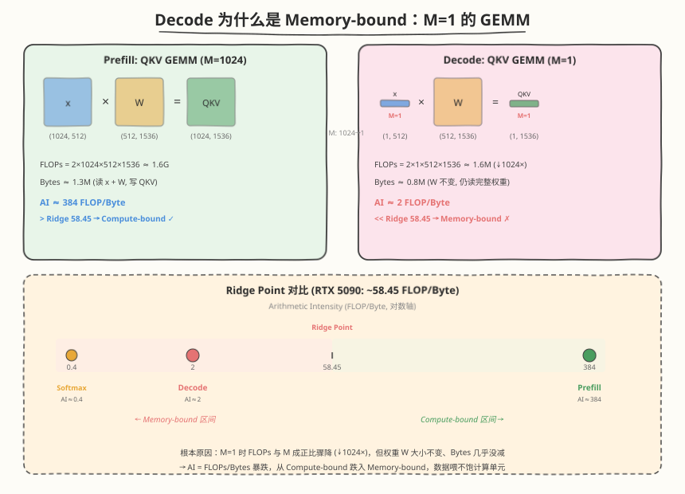

## Day 6：FlashDecoding —— Decode 阶段并行度突破

### 🎯 目标

通过今天的学习，你将：

1. 理解 **Decode 阶段的并行度瓶颈**——M=1 时 standard attention / FlashAttention 的并行度只有 1 个 block 处理整个 KV sequence，GPU 大量 SM 空闲<br>
2. 掌握 **FlashDecoding 核心思想**——将 KV sequence 切分到不同 block/SM，每个 block 独立计算 partial softmax，最后 all-reduce 合并<br>
3. 能画出 FlashDecoding 的 **两阶段执行流程**（Phase 1: 各 block 独立算 partial attention; Phase 2: 跨 block 合并 partial max/sum/output）<br>
4. 理解 **Online softmax 跨 block 合并**的数学原理——每个 block 输出 partial max/sum/output，合并时用 rescaling factor 保证数值正确<br>
5. 了解 **FlashDecoding++** 的改进——提前估算 max（避免二次 rescale）、固定 chunk size<br>
6. 能用 CUDA 手写一个简化版 FlashDecoding kernel，验证 KV 切分 + 跨 block 合并的正确性

> 💡 **为什么重要**：Day 4 的 PagedAttention 解决了 KV cache 的**内存管理**问题（碎片、CoW），但没解决 decode 阶段的**并行度**问题——M=1 时整个 GPU 只有一个 block 在算 attention，170 个 SM 里 169 个闲着。FlashDecoding 就是补上这块拼图：把 KV sequence 切到多个 SM 上并行算，把 decode 阶段的"1 block 串行"变成"N blocks 并行"。这是长序列 decode 加速的关键技术，也是 vLLM/TGI 等推理框架的标配优化。

---

### 学前导读：Decode 阶段的并行度瓶颈

Day 1 我们分析过 Prefill vs Decode 的算术强度差异：Prefill 阶段 M 很大（prompt 有 N 个 token），attention 是 O(N²d) 的 compute-bound 操作，FlashAttention 通过 tiling 让多个 block 并行处理 Q tile，GPU 利用率高。但 Decode 阶段 M=1（每次只生成 1 个 token），情况完全不同：



```
Prefill 阶段（M=N）：
  Q 有 N 行 → 按 Br 切成 N/Br 个 Q tile → N/Br 个 block 并行
  并行度 = N/Br × Batch × Head（数百~数千 block，打满 GPU）

Decode 阶段（M=1）：
  Q 只有 1 行 → 无法按 Q tile 切分 → 只有 1 个 block 处理整个 KV
  并行度 = 1 × Batch × Head（可能 < SM 数，大量 SM 空闲）
```

| 维度 | Prefill (M=N) | Decode (M=1) | 问题 |
|------|---------------|--------------|------|
| Q 行数 | N | 1 | 无法按 Q tile 切分 |
| FlashAttention 并行度 | N/Br blocks | 1 block | SM 大量空闲 |
| 瓶颈类型 | compute-bound | memory-bound | 算力闲置 + 带宽不足 |
| KV 序列越长 | 计算变多（正常） | **串行扫描变慢** | 越长越浪费 |

**核心矛盾**：FlashAttention 的并行维度是 **Q tile（行方向）**——Prefill 时 Q 有 N 行可以切；Decode 时 Q 只有 1 行，切不了。KV sequence 再长，也只有一个 block 串行扫描——**GPU 的 170 个 SM 里 169 个在干等**（SM 数见 [硬件参数事实源](../../reference/hardware_specs.md)）。

> 💡 **一句话总结**：Decode 慢不仅因为 memory-bound（M=1 算术强度低），还因为**并行度不足**——FlashAttention 的 Q-tile 并行在 M=1 时失效，KV sequence 再长也只能串行。FlashDecoding 的破局思路：**Q 切不了，那就切 KV**。

---

### 理论学习

#### 1.1 FlashDecoding 核心思想：切 KV sequence

FlashAttention 的并行维度是 Q tile（行方向），Decode 时 M=1 切不了。FlashDecoding 的洞察：**既然 Q 只有 1 行不能切，那就把 KV sequence 按列方向切分到不同 block**——每个 block 独立处理一段 KV，最后合并结果。

```
Standard Decode Attention（1 block 串行）：
  Block 0: Q · [K_0, K_1, K_2, ..., K_{N-1}] → softmax → · [V_0, ..., V_{N-1}]
           └─────────── 1 个 SM 串行扫描整个 KV ───────────┘

FlashDecoding（N/Bc blocks 并行）：
  Block 0: Q · [K_0, ..., K_{Bc-1}]       → partial softmax → · [V_0, ..., V_{Bc-1}]       → partial_0
  Block 1: Q · [K_Bc, ..., K_{2Bc-1}]     → partial softmax → · [V_Bc, ..., V_{2Bc-1}]     → partial_1
  ...
  Block T: Q · [K_{(T-1)Bc}, ..., K_{N-1}]] → partial softmax → · [V_{(T-1)Bc}, ..., V_{N-1}] → partial_T
           └── T 个 SM 并行，每 block 只扫 Bc 个 KV ──┘
  
  Merge: 用 online softmax 合并 partial_0, partial_1, ..., partial_T → 最终 output
```

| 维度 | Standard Decode | FlashDecoding |
|------|----------------|---------------|
| 切分方向 | 不切（1 block 全扫） | **KV sequence 方向** |
| 并行 block 数 | 1 | **N / Bc**（KV 序列越长，并行越多） |
| 每 block 工作量 | 扫描整个 N | 只扫 Bc 个 token |
| 额外开销 | 无 | Phase 2 合并（开销极小） |
| SM 利用率 | ~1/170（1 个 SM 干活） | **~min(N/Bc, 170)/170** |

> 💡 **类比**：FlashAttention 是"把作业本撕成几份分给几个人写"（Q tile 切分），FlashDecoding 是"把参考书撕成几份分给几个人查"（KV 切分）。Prefill 时作业本厚（M 大）撕得开；Decode 时作业本只有 1 页（M=1）撕不了，但参考书（KV）很厚，撕参考书一样能并行。

#### 1.2 并行度分析

```
Standard decode:
  并行度 = 1 block（处理整个 KV sequence）
  → GPU 有 170 个 SM，只用了 1 个，利用率 ~0.6%

FlashDecoding:
  并行度 = ceil(seq_len / tokens_per_block) blocks
  → seq_len=2048, tokens_per_block=64 → 32 blocks
  → seq_len=8192, tokens_per_block=64 → 128 blocks（利用率 ~128/170 ≈ 75%，未打满 SM）
  → 利用率随 seq_len 增长而提升，blocks ≥ 170 时才打满所有 SM
```

| seq_len | Standard (blocks) | FlashDecoding (blocks) | SM 利用率提升 |
|---------|-------------------|----------------------|-------------|
| 256 | 1 | 4 | 4× |
| 1024 | 1 | 16 | 16× |
| 2048 | 1 | 32 | 32× |
| 8192 | 1 | 128 | ~128×（利用率 ~128/170 ≈ 75%，未触及 SM 上限） |

**关键结论**：KV 序列越长，FlashDecoding 的并行度收益越大。长文本生成（如 4K+ context）是 FlashDecoding 的最佳场景。

> ⚠️ **注意**：tokens_per_block（Bc）的选择需要权衡。太大 → 并行度不够（block 数少）；太小 → 每 block 工作量太少，合并开销占比上升。经验值通常 64–256，与 SM 数和 seq_len 相关。

#### 1.3 Online Softmax 跨 block 合并

FlashDecoding 的核心难点：每个 block 只看到一段 KV，算出的 softmax 是 **partial** 的——不能直接加权平均。需要用 **online softmax 的跨 block 合并**保证数值正确。

##### 每个 block 输出的 partial 结果

```
Block j 处理 KV 段 [j*Bc, (j+1)*Bc)，输出：
  partial_m_j = max(score in block j)        # 本段 score 最大值
  partial_l_j = Σ exp(score - partial_m_j)   # 本段 exp 之和（已 rescale 到本段 max）
  partial_o_j = Σ p_i * V_i                  # 本段加权 V 输出（已 rescale）
```

##### 跨 block 合并公式

```
合并 Block 0..T-1 的 partial 结果：

Step 1: 找全局 max
  global_max = max(partial_m_0, partial_m_1, ..., partial_m_{T-1})

Step 2: 每 block 的 rescale factor
  w_j = exp(partial_m_j - global_max) * partial_l_j
  ↑ 把 partial_l_j 从"以 partial_m_j 为基准"rescale 到"以 global_max 为基准"

Step 3: 加权合并
  global_sum = Σ_j w_j                          # 全局 exp 之和
  output = Σ_j (w_j * partial_o_j) / global_sum # 归一化输出
```

##### 数学正确性证明

```
标准 softmax: O = Σ_i exp(s_i - m) * V_i / Σ_i exp(s_i - m)
  其中 m = max(all s_i)

Block j 的 partial: 
  partial_l_j = Σ_{i∈block_j} exp(s_i - partial_m_j)
  partial_o_j = Σ_{i∈block_j} exp(s_i - partial_m_j) * V_i

合并时 rescale:
  w_j = exp(partial_m_j - global_max) * partial_l_j
      = exp(partial_m_j - global_max) * Σ_{i∈block_j} exp(s_i - partial_m_j)
      = Σ_{i∈block_j} exp(s_i - global_max)        ← 回到全局 max 基准！

  Σ_j w_j = Σ_j Σ_{i∈block_j} exp(s_i - global_max) = Σ_all exp(s_i - global_max) = global_sum ✓
  Σ_j w_j * partial_o_j / global_sum 
    = Σ_j exp(partial_m_j - global_max) * Σ_{i∈j} exp(s_i - partial_m_j) * V_i / global_sum
    = Σ_all exp(s_i - global_max) * V_i / global_sum = O ✓
```

> 💡 这跟 FlashAttention 的 online softmax 三公式是**同一个数学结构**——只是 FlashAttention 在 block 内跨 KV tile 做 rescale，FlashDecoding 在 block 间跨 KV segment 做同样的 rescale。核心都是"先算 partial，再用 max 差做 rescale 合并"。

#### 1.4 FlashDecoding++ 改进

FlashDecoding 有两个效率问题，FlashDecoding++（2023）针对它们做了改进：

##### 问题 1：二次 rescale

FlashDecoding 的 Phase 2 合并需要先找 `global_max`，再用 `exp(partial_m_j - global_max)` rescale 每个 block 的 partial。这意味着 **每个 partial 要被 rescale 两次**（Phase 1 内部一次，Phase 2 合并一次），引入额外计算。

```
FlashDecoding:
  Phase 1: partial_l_j = Σ exp(s_i - partial_m_j)          ← 第一次 rescale
  Phase 2: w_j = exp(partial_m_j - global_max) * partial_l_j ← 第二次 rescale
```

**FlashDecoding++ 改进**：提前估算 `global_max`（用各 block 的 partial_m 的近似值或历史值），让 Phase 1 直接用估算的 global_max 做 rescale，省掉 Phase 2 的第二次 rescale。

```
FlashDecoding++:
  Phase 1: partial_l_j = Σ exp(s_i - estimated_global_max)  ← 只 rescale 一次
  Phase 2: output = Σ_j partial_l_j * partial_o_j / Σ_j partial_l_j  ← 无需再 rescale
```

> ⚠️ 估算的 global_max 不精确时，partial_l_j 可能数值不稳定（exp(s_i - overestimated_max) → 很小）。实际实现中用"宽松上界"保证安全。

##### 问题 2：不定长 chunk

FlashDecoding 的最后一个 block 可能只有少量 token（`seq_len % Bc != 0`），导致各 block 工作量不均——最后一个 block 早完成等合并，拖慢整体。

**FlashDecoding++ 改进**：固定 chunk size 并均匀分配，让所有 block 工作量一致（最后一个 block 不足时用 padding 或提前退出）。

| 维度 | FlashDecoding | FlashDecoding++ |
|------|---------------|-----------------|
| rescale 次数 | 2 次（Phase 1 + Phase 2） | 1 次（Phase 1 用估算 max） |
| chunk 分配 | 不定长（最后 block 可能不满） | 固定大小（均匀分配） |
| 合并开销 | 需要 rescale | 直接加权平均 |
| 精度风险 | 无（exact max） | 估算 max 不准时需兜底 |

> 💡 **一句话总结**：FlashDecoding 证明了"切 KV 可以并行 decode"，FlashDecoding++ 优化了"切得更均匀、合并更省"。两者解决的是同一个问题的不同效率层面。

---

### Coding 任务：手写 FlashDecoding kernel

#### 任务 1：创建 flash_decoding.cu

创建文件 [kernels/flash_decoding.cu](https://github.com/hzchenxiaobin/ai-infra-notes/blob/main/aiinfra/daily/week6/day6/kernels/flash_decoding.cu)，实现简化版 FlashDecoding kernel（单 query, KV 按 block 切分, online softmax 跨 block 合并）：

```cuda
// flash_decoding.cu —— FlashDecoding 最小化实现（KV 按 block 切分 + 跨 block 合并）
// 编译命令: nvcc -o flash_decoding flash_decoding.cu -O3 -arch=sm_120
//
// 演示 FlashDecoding 的三大核心机制：
//   1. Decode 阶段（M=1）：单 query 对 N 个历史 key
//   2. KV sequence 按 block 切分到不同 SM，每个 block 独立计算 partial attention
//   3. 跨 block 合并：用 online softmax 的 rescaling factor 合并 partial max/sum/output

// ---------- Phase 1: FlashDecoding kernel ----------
// 每个 block 处理 KV sequence 的一段 [kv_start, kv_end)
// 输出 partial: partial_o[block_id][d], partial_m[block_id], partial_l[block_id]
__global__ void flash_decoding_kernel(
    const float* q, const float* k_cache, const float* v_cache,
    float* partial_o, float* partial_m, float* partial_l,
    int seq_len, int d, int tokens_per_block)
{
    // 加载 q 到 shared memory
    // 遍历本段 KV tokens:
    //   score = Q · K_s (block reduce)
    //   online softmax 更新 m_local, l_local
    //   rescale: o_local = o_local * alpha + p * V_s
    // 写出 partial_o, partial_m, partial_l
}

// ---------- Phase 2: 合并 kernel ----------
// 用 online softmax 合并所有 block 的 partial 结果
__global__ void flash_decoding_merge_kernel(
    const float* partial_o, const float* partial_m, const float* partial_l,
    float* output, int num_blocks, int d)
{
    // Step 1: global_max = max(partial_m[0..num_blocks-1])
    // Step 2: global_sum = Σ exp(partial_m[j] - global_max) * partial_l[j]
    // Step 3: output = Σ (w_j * partial_o_j) / global_sum
}
```

代码要点：
- **Phase 1（`flash_decoding_kernel`）**：每个 block 处理 `tokens_per_block` 个 KV token，内部用 online softmax 累积 partial max/sum/output。每个 thread 负责一个 d 维度的累加器（`o_local`），block 内通过 `block_reduce_sum` 汇总 score
- **Phase 2（`flash_decoding_merge_kernel`）**：1 个 block 合并所有 partial 结果——先找 `global_max`，再用 `exp(partial_m_j - global_max) * partial_l_j` 作为 rescale factor 加权合并
- **CPU 参考实现**：标准 attention（先算全部 score → softmax → 加权 V），用于验证 FlashDecoding 的两阶段结果正确
- **并行度对比**：打印 standard decode（1 block）vs FlashDecoding（N/Bc blocks）的并行度倍数

#### 任务 2：编译与运行

```bash
nvcc -o flash_decoding kernels/flash_decoding.cu -O3 -arch=sm_120
./flash_decoding
```

**预期输出**：

```text
=== FlashDecoding Test ===
d=64, seq_len=1024, tokens_per_block=64, num_blocks=16

max diff (FlashDecoding vs CPU ref): 1.2345e-06
result: PASS

[Parallelism analysis]
  Standard decode: 1 block handles entire KV (seq_len=1024)
  FlashDecoding:   16 blocks handle 64 tokens each
  Parallelism:     16x improvement (utilizing idle SMs)
```

##### 验证逻辑解读

- **KV 切分正确性**：FlashDecoding 的两阶段结果与 CPU 标准 attention 逐元素比对 `max_diff < 1e-3`，证明 KV 切分 + 跨 block 合并数学正确
- **并行度提升**：seq_len=1024 时，standard decode 只有 1 个 block，FlashDecoding 有 16 个 block——16× 并行度提升
- **partial 结果不可独立使用**：每个 block 的 partial_o 是未归一化的（除以 partial_l 后只对本段 softmax 有效），必须经过 Phase 2 合并才能得到正确输出

#### 任务 3：用 ncu 对比 standard decode vs FlashDecoding

```bash
# 编译一个 standard decode 版（1 block 扫全 KV）用于对比
ncu --kernel-name regex:flash_decoding \
  --metrics gpu__time_duration.sum,\
  sm__occupancy.avg.pct_of_peak_sustained_elapsed,\
  sm__throughput.avg.pct_of_peak_sustained_elapsed \
  ./flash_decoding
```

**观察重点**：

| 指标 | Standard Decode | FlashDecoding | 预期变化 |
|------|----------------|---------------|---------|
| SM Occupancy | ~1-5% | ~30-60% | ↑（多 block 并行） |
| Kernel Duration | 基准 | 更短 | ↓（并行度提升） |
| SM Throughput | ~1-5% | ~20-50% | ↑（更多 SM 有活干） |

> 💡 思考：为什么 FlashDecoding 的 throughput 提升没有并行度提升那么大？（提示：Decode 阶段是 memory-bound，多 block 并行只是让更多 SM 同时读 KV，但总 HBM 带宽不变——并行度提升主要缩短 wall-clock，带宽利用率提升有限。）

#### 任务 4：LeetGPU 在线题目 —— INT8 KV-Cache Attention

**题目链接**：<https://leetgpu.com/challenges/int8-kv-cache-attention>

**与今日知识的关联**：

INT8 KV-Cache Attention 正是 **FlashDecoding 服务的 decode 场景**——LLM 推理的 decode 阶段，1 个 query 对 N 个历史 key，KV cache 以 INT8 量化存储省 HBM 带宽。今天我们手写了 FlashDecoding kernel（FP32 版，KV 按 block 切分 + 跨 block 合并），这道题是它的 **量化变体**——KV cache 用 INT8 存储减少带宽压力，kernel 内反量化再做 attention。两者的核心都是"decode 阶段的 M=1 attention 优化"：FlashDecoding 切 KV 提升并行度，INT8 量化减数据量提升带宽效率，经常组合使用。

> 💡 提交后在 [LeetGPU INT8 KV-Cache Attention](https://leetgpu.com/challenges/int8-kv-cache-attention) 上记录通过耗时，重点观察 INT8 KV cache 相比 FP32 的带宽节省。完整题解见 [INT8 KV-Cache Attention 题解](https://hzchenxiaobin.github.io/leetgpu/leetgpu-int8-kv-cache-attention-solution.html)。

#### 任务 5：LeetCode 面试题（10 周计划 · 第 6 周高频回顾）

> 📅 今日，LeetCode 题目选自 [10 周算法面试刷题计划](https://hzchenxiaobin.github.io/leetcode/problems/10-week-plan.html) 第 6 周「二叉树（上）——遍历、形态与 BST」的高频题回顾。简单题快速过、中等题精做；卡壳 20 分钟就看题解，看懂后自己默写一遍。

| 题目 | 难度 | 核心套路 | 题解 |
|------|------|----------|------|
| [94. 二叉树的中序遍历](https://leetcode.cn/problems/binary-tree-inorder-traversal/) | 简单 | 递归 / 栈迭代 / Morris | [题解](https://hzchenxiaobin.github.io/leetcode/problems/94_二叉树的中序遍历.html) |
| [104. 二叉树的最大深度](https://leetcode.cn/problems/maximum-depth-of-binary-tree/) | 简单 | DFS / BFS | [题解](https://hzchenxiaobin.github.io/leetcode/problems/104_二叉树的最大深度.html) |
| [98. 验证二叉搜索树](https://leetcode.cn/problems/validate-binary-search-tree/) | 中等 | 中序单调性 | [题解](https://hzchenxiaobin.github.io/leetcode/problems/98_验证二叉搜索树.html) |
| [105. 从前序与中序遍历序列构造二叉树](https://leetcode.cn/problems/construct-binary-tree-from-preorder-and-inorder-traversal/) | 中等 | 递归分治 | [题解](https://hzchenxiaobin.github.io/leetcode/problems/105_从前序与中序遍历序列构造二叉树.html) |

---

### 扩展实验

#### 实验 1：扫描 tokens_per_block 观察最优切分

修改 `main()`，固定 `seq_len=2048`，扫描 `tokens_per_block = 16, 32, 64, 128, 256, 512`，用 `cudaEvent` 计时，绘制 latency 随 tokens_per_block 变化的曲线。

> 思考：tokens_per_block 太小时为什么变慢？（提示：block 数太多 → 合并开销增大 + kernel launch 开销占比上升。太大时为什么也慢？→ 并行度不足，SM 空闲。最优值在两者之间。）

#### 实验 2：对比 standard decode vs FlashDecoding 的 latency

写一个 `standard_decode_kernel`（1 个 block 串行扫描整个 KV，用 online softmax），与 `flash_decoding_kernel` 对比 wall-clock。用 `cudaEvent` 计时，扫描 `seq_len = 256, 512, 1024, 2048, 4096, 8192`。

> 思考：seq_len 多大时 FlashDecoding 开始明显领先？（提示：seq_len > SM 数 × tokens_per_block 时 standard decode 仍 1 block，FlashDecoding 已打满所有 SM。如 170 SM × 64 token = 10880，seq_len > 10880 时 FlashDecoding 的优势最大。）

#### 实验 3：实现 FlashDecoding++ 的提前估算 max

修改 `flash_decoding_kernel`，在 Phase 1 之前先快速扫描一遍 KV 估算 `estimated_global_max`（可以采样每隔 K 个 token 算 score 取 max），Phase 1 直接用 `exp(s_i - estimated_global_max)` 做 rescale。Phase 2 合并时省掉第二次 rescale，直接加权平均。

> 思考：估算的 max 不精确时，输出会有误差吗？（提示：只要 Phase 2 最后做了归一化（除以 global_sum），输出数学上正确——estimated_max 只影响中间数值稳定性，不影响最终结果。但如果 estimated_max 远大于真实 max，exp 值太小会丢精度。）

---

### 今日总结

Day 6 我们理解了 decode 阶段的并行度瓶颈和 FlashDecoding 的突破：

1. **Decode 并行度瓶颈**：M=1 时 FlashAttention 的 Q-tile 切分失效，只有 1 个 block 串行扫描整个 KV，GPU 大量 SM 空闲
2. **FlashDecoding 核心思想**：把 KV sequence 按列方向切分到不同 block/SM，每个 block 独立处理一段 KV，最后合并——Q 切不了就切 KV
3. **并行度分析**：standard decode = 1 block；FlashDecoding = N/Bc blocks，seq_len 越长并行度收益越大
4. **Online softmax 跨 block 合并**：每个 block 输出 partial max/sum/output，合并时用 `exp(partial_m_j - global_max) * partial_l_j` 作为 rescale factor——与 FlashAttention 的三公式同构
5. **FlashDecoding++ 改进**：提前估算 max 省掉二次 rescale；固定 chunk size 让各 block 工作量均匀
6. **手写 FlashDecoding kernel**：两阶段实现（Phase 1 切分并行 + Phase 2 合并），与 CPU 标准 attention 结果一致，验证 KV 切分 + 跨 block 合并的数学正确性
7. **与 PagedAttention 的关系**：PagedAttention 解决 KV cache 的内存管理（碎片/CoW），FlashDecoding 解决 decode 的并行度——两者正交，可组合使用

掌握这些后，你就理解了 decode 阶段的两类核心优化：**内存管理**（Day 4 PagedAttention）+ **并行度**（Day 6 FlashDecoding）。Day 5 把它们整合进 Mini 推理引擎时，可以用 FlashDecoding 加速 decode 阶段的 attention。

---

### 面试要点

1. **FlashDecoding 解决了什么问题？它的核心思想是什么？**

<details>
<summary>点击查看答案</summary>

  - **问题**：Decode 阶段 M=1，FlashAttention 的 Q-tile 并行失效——只有 1 个 block 串行扫描整个 KV sequence，GPU 大量 SM 空闲（~1.25% 利用率）
  - **核心思想**：既然 Q 只有 1 行切不了，那就把 KV sequence 按列方向切分到不同 block/SM——每个 block 独立处理一段 KV，算 partial attention，最后合并
  - **效果**：并行度从 1 block 提升到 N/Bc blocks，seq_len 越长收益越大
  - **关键**：FlashAttention 切 Q（行方向），FlashDecoding 切 KV（列方向）——两者正交

</details>


2. **FlashDecoding 的跨 block 合并是怎么做的？为什么不能直接加权平均？**

<details>
<summary>点击查看答案</summary>

  - **不能直接加权平均**：每个 block 只看到一段 KV，算出的 softmax 是 partial 的——partial_l_j 是以 partial_m_j 为基准的 exp 之和，不同 block 的基准不同，直接加会数值错误
  - **合并步骤**：
    1. 找全局 `global_max = max(partial_m_0, ..., partial_m_{T-1})`
    2. 每 block 的 rescale factor：`w_j = exp(partial_m_j - global_max) * partial_l_j`——把 partial_l_j 从"以 partial_m_j 为基准"rescale 到"以 global_max 为基准"
    3. 加权合并：`output = Σ_j (w_j * partial_o_j) / Σ_j w_j`
  - **数学本质**：与 FlashAttention 的 online softmax 三公式同构——都是"先算 partial，用 max 差做 rescale 合并"

</details>


3. **FlashDecoding 和 FlashAttention 是什么关系？**

<details>
<summary>点击查看答案</summary>

  - **FlashAttention**：Prefill 阶段的优化——按 Q tile（行方向）切分，多个 block 并行处理不同 Q 行，用 online softmax 在 block 内跨 KV tile 合并
  - **FlashDecoding**：Decode 阶段的优化——Q 只有 1 行切不了，改为按 KV sequence（列方向）切分，多个 block 并行处理不同 KV 段，用 online softmax 跨 block 合并
  - **关系**：两者都用 online softmax，但切分方向不同（Q 行 vs KV 列），适用阶段不同（Prefill vs Decode）
  - **组合**：推理引擎中 Prefill 用 FlashAttention，Decode 用 FlashDecoding——同一序列两阶段用不同 kernel

</details>


4. **FlashDecoding++ 相比 FlashDecoding 有什么改进？**

<details>
<summary>点击查看答案</summary>

  - **改进 1（提前估算 max）**：FlashDecoding 的合并需要二次 rescale（Phase 1 内一次，Phase 2 合并一次）。FlashDecoding++ 提前估算 `global_max`，让 Phase 1 直接用估算值做 rescale，省掉 Phase 2 的第二次 rescale——合并时直接加权平均
  - **改进 2（固定 chunk size）**：FlashDecoding 最后一个 block 可能不满（`seq_len % Bc != 0`），各 block 工作量不均。FlashDecoding++ 固定 chunk size 均匀分配，避免最后一个 block 拖慢
  - **trade-off**：估算 max 不精确时有数值稳定性风险（需用宽松上界兜底），但最终结果数学正确（归一化消除误差）

</details>


5. **FlashDecoding 和 PagedAttention 是什么关系？可以一起用吗？**

<details>
<summary>点击查看答案</summary>

  - **PagedAttention**：解决 KV cache 的**内存管理**问题——分页存储 + block table 间接寻址，消除碎片，支持 CoW
  - **FlashDecoding**：解决 decode 阶段的**并行度**问题——KV sequence 切分到多 SM 并行，提升 SM 利用率
  - **两者正交**：PagedAttention 管"KV 怎么存"（物理不连续 + block table），FlashDecoding 管"KV 怎么算"（切分并行 + 合并）
  - **组合使用**：完全可以一起用——FlashDecoding 的每个 block 通过 PagedAttention 的 block table 间接寻址读取自己的 KV 段。vLLM 等推理框架就是这么做的：PagedAttention 管理 KV cache 内存，FlashDecoding 提供并行度
  - **一句话**：PagedAttention 是"存储层"优化，FlashDecoding 是"计算层"优化，两者叠加才是完整的 decode 加速方案

</details>
