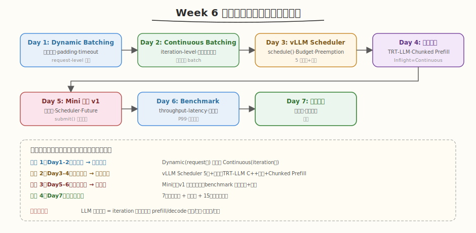
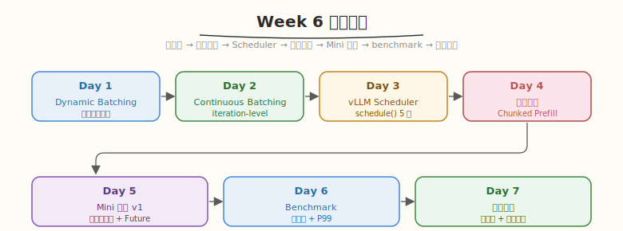
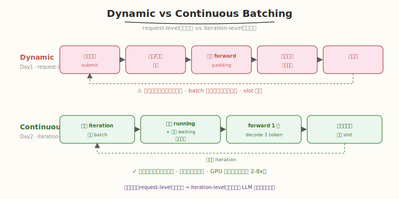
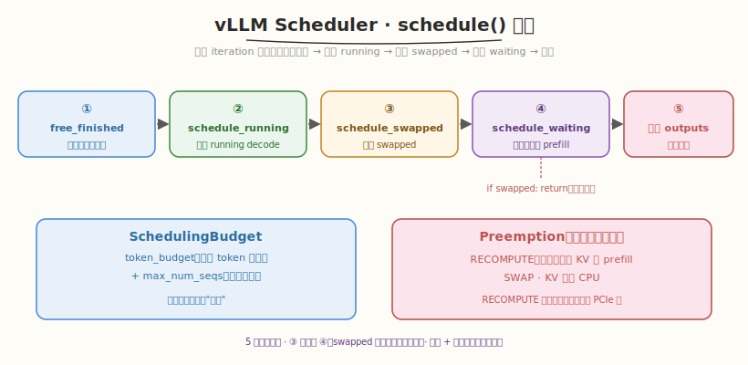
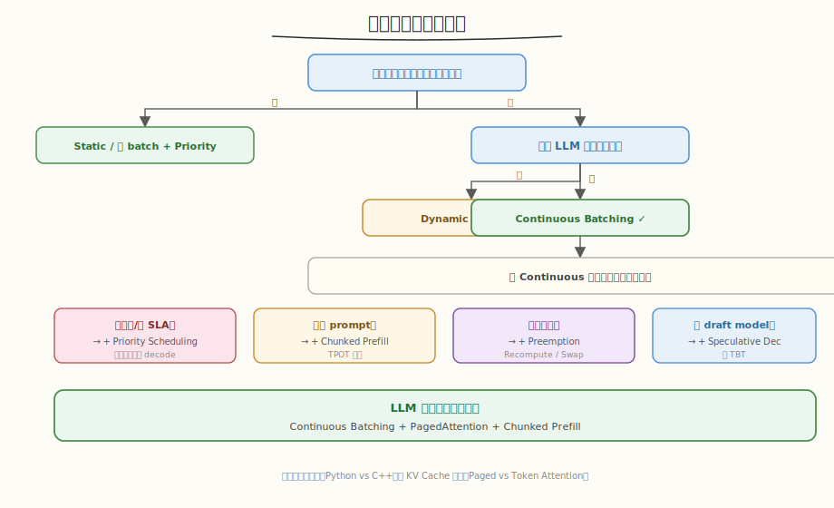
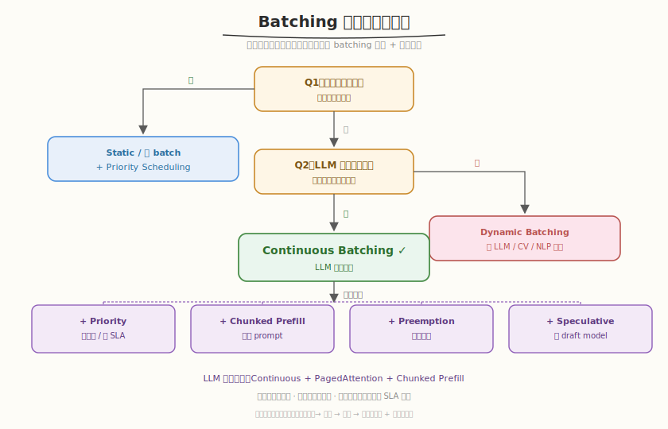
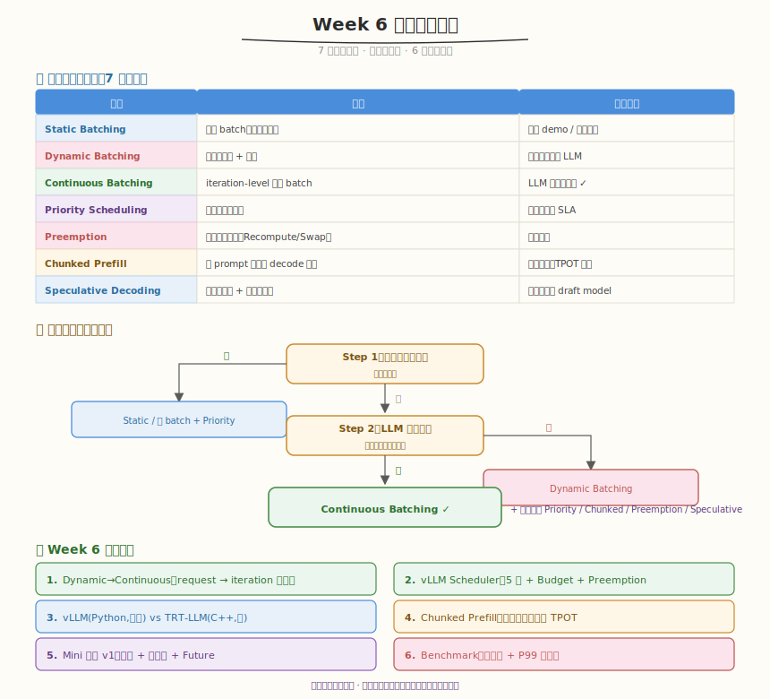

## Day 7：调度优化策略总结与 Week 6 收官

### 🎯 目标

通过今天的学习，你将：

1. 系统梳理 Week 6 的知识链——从 Dynamic Batching 到 Continuous Batching 到 vLLM Scheduler 到框架对比到 Mini 引擎 v1 到 benchmark，把碎片知识连成**一张完整地图**<br>
2. 掌握 **7 种调度策略**的原理、适用场景、优缺点，建立**策略选择决策树**，拿到任意推理服务需求能选对 batching 策略<br>
3. 复盘本周 **15 道面试题**，建立调度专题的答题框架（定性→机制→量化→方案→跨平台）<br>
4. 整理本周所有产出（Dynamic/Continuous Batcher、vLLM Scheduler 复刻、Chunked Prefill 模拟器、Mini 引擎 v1、benchmark 框架），形成可复用的工程资产<br>
5. 澄清 **6 个常见误区**——Continuous≠Dynamic、PagedAttention 非直接加速、RECOMPUTE 默认非因快、chunked 非越小越好等<br>
6. 为 Week 7（系统整合）做好知识衔接，明确把前六周所有组件联调成完整 Mini AI Infra 系统的前置基础

> 💡 **为什么重要**：Day 1-6 我们分别学了调度的各个机制——Dynamic 凑批、Continuous 每轮重建、vLLM Scheduler 5 步、Chunked Prefill 分块、Mini 引擎 v1 并发、benchmark 量性能。但"各个机制都懂"不等于"系统全局掌握"——今天用策略对比表和决策树把碎片连成网络。这张决策树是调度优化的通用工具箱：看到任何推理服务需求，你能立刻判断该用哪种 batching、叠哪些策略。Week 7 的系统整合建立在这张地图上。

---

### Week 6 知识地图



Week 6 围绕一条主线展开：**从单请求串行到多请求高吞吐服务**。



| Day | 主题 | 核心产出 | 关键概念 |
|-----|------|---------|---------|
| Day 1 | Dynamic Batching | dynamic_batcher.py | 请求聚合、padding、timeout、throughput-latency 曲线 |
| Day 2 | Continuous Batching | continuous_batcher.py | iteration-level 调度、动态加入退出、Scheduler 状态机 |
| Day 3 | vLLM Scheduler | vllm_scheduler_analyzer.py | schedule() 5 步、SchedulingBudget、Preemption |
| Day 4 | 框架对比 | chunked_prefill_simulator.py | Inflight=Continuous、Chunked Prefill、Token Attention |
| Day 5 | Mini 引擎 v1 | mini_engine_v1.py | 多请求并发、Scheduler、Future 异步、优先级 |
| Day 6 | Benchmark | benchmark_engine_v1.py | throughput-latency 曲线、饱和点、P99、瓶颈分析 |
| **Day 7** | **策略总结** | **7 策略对比 + 决策树** | **决策树、面试复盘、误区澄清** |

> 💡 **一句话总结**：Week 6 的本质是"从凑批到并发服务"。Day 7 的策略决策树就是这 7 天学习的最终答卷——它是推理调度选型的通用工具箱。

---

### 核心概念串讲

#### 1. Dynamic → Continuous：request-level 到 iteration-level



| 维度 | Dynamic（Day1） | Continuous（Day2） |
|------|----------------|-------------------|
| 调度粒度 | request-level（整批） | **iteration-level**（每轮） |
| 请求退出 | 整批完成一起退 | **完成即退** |
| 短请求等待长请求 | 是（阻塞） | **否** |
| 吞吐提升 | 中 | **2-8x** |

#### 2. vLLM Scheduler：5 步 + 预算 + 抢占（Day3）



> 关键防饿死：`_schedule_waiting` 中 `if self.swapped: return`——swapped 非空时不接纳新请求。

#### 3. 框架对比与 Chunked Prefill（Day4）

```
Inflight Batching = Continuous Batching（术语不同，本质同一）
vLLM: Python 调度，灵活 TensorRT-LLM: C++ 调度，快但需重编译
Chunked Prefill: 长 prompt 拆 chunk 与 decode 交错 → TPOT 平滑（实测尖峰降 40%）
```

#### 4. Mini 引擎 v1：多请求并发（Day5）

```
submit() → Future（异步）→ 后台 worker 做 Continuous Batching
四组件：Request Queue + Scheduler + Worker + Future
实测：4 请求 8 轮完成（v0 串行需 23 次），并发收益 2.9x
```

#### 5. Benchmark：找饱和点（Day6）

```
固定并发扫描 → throughput-latency 曲线 → 饱和点（throughput 增长<5%）
四瓶颈：Compute-bound / Memory-bound / Launch overhead / Scheduling overhead
P99 > 平均延迟 → 尾延迟是 SLA 关键
```

---

### 调度策略对比表

| 策略 | 原理 | 适用场景 | 优点 | 缺点 | Day |
|------|------|---------|------|------|-----|
| Static Batching | 固定 batch，凑齐才开始 | 简单 demo/请求等长 | 实现最简单 | 吞吐低、长请求阻塞 | Day1 |
| Dynamic Batching | 请求级聚合+超时 | 吞吐优先、非 LLM | 提 GPU 利用率 | request-level 阻塞、padding | Day1 |
| **Continuous Batching** | iteration-level 重建 batch | **LLM 自回归推理** | **吞吐+延迟兼顾** | 实现复杂、需 PagedAttention | Day2 |
| Priority Scheduling | 高优先级先调度 | 多租户、多 SLA | 保障关键延迟 | 低优先级饥饿 | Day5 |
| Preemption | 显存不足抢占 | 显存压力 | 过载优雅降级 | 重算/PCIe 开销 | Day3 |
| Chunked Prefill | 长 prompt 拆块交错 | 长短混合、TPOT 敏感 | 平滑 latency | 调度复杂、TTFT 增 | Day4 |
| Speculative Decoding | 小模型预测+大模型验证 | 低延迟、有 draft model | 降 TBT | 需 draft model | 进阶 |

---

### 策略选择决策树





---

### 总结任务 / Coding 任务

#### 任务 1：运行总结自测脚本

运行 [kernels/week6_summary.py](kernels/week6_summary.py)，复盘 7 种策略对比 + 决策树 + 15 道面试题自测：

```bash
python kernels/week6_summary.py
```

脚本依次打印：7 种调度策略对比表、策略选择决策树、15 道面试题清单（按主题分组），然后可选随机抽 5 题做自测（先看问题，按回车看参考答案）。

**预期输出**（节选）：



#### 任务 2：LeetGPU 综合题 —— FP16 Dot Product

**题目链接**：<https://leetgpu.com/challenges/fp16-dot-product>

**题目概述**：给定两个长度为 `N` 的 FP16 向量，计算点积 `sum(a[i] × b[i])`，要求用 FP32 累加保证精度、最终转回 FP16 输出。

**与本周总结的关联**：FP16 Dot Product 是**归约**（reduction）的半精度变体——block 内归约 + 跨 block 归约的结构与普通 dot product 一致，但引入了"低精度输入 + 高精度累加 + 低精度输出"的混合精度模式。这正是 Week 6 优化方向的微缩版：饱和点后用 INT8/FP16 量化提吞吐（Day 6 benchmark 的 compute-bound 优化），但 reduce 必须升精度累加以控误差。本周所有"累加/统计"操作（`percentile()`、token budget 累加、batch 聚合）的本质都是归约，这道题额外练习 `__half` 类型转换 + warp shuffle 归约——Week 7 系统整合中 FP16 混合精度会频繁用到。

> 💡 完整题解（含 FP16 输入 + FP32 累加 kernel、warp shuffle 归约、与混合精度量化的类比）见 [FP16 Dot Product 题解](../../../../leetgpu/week6/day7/leetgpu-fp16-dot-product-solution.md)。

#### 任务 3：LeetCode 面试题 —— 最小覆盖子串

**题目链接**：[76. 最小覆盖子串](https://leetcode.cn/problems/minimum-window-substring/)

**题目概述**：给你字符串 `s` 和 `t`，找 `s` 中涵盖 `t` 所有字符的最小子串。

**与本周总结的关联**：最小覆盖子串的**滑动窗口**与本周 Scheduler 的 token budget 窗口控制同构——Scheduler 每轮维护一个"活动窗口"（running 序列），窗口大小（batch）动态变化，窗口内元素满足约束（token budget + 显存）。滑动窗口的"扩张-收缩"对应 Scheduler 的"补入 waiting - 退出 finished"，都是**动态窗口 + 约束满足**问题。

> 💡 完整题解（含 C++/Python 参考代码、滑动窗口图解、与 Scheduler 窗口控制的类比）见 [最小覆盖子串题解](../../../../leetcode/daily/week6/day7/最小覆盖子串.md)。

---

### 面试准备框架

#### 本周 15 道核心面试题（按主题分组）

**Dynamic Batching（Day1）**
1. Dynamic Batching 的原理和优缺点？
2. Padding 有什么问题？如何优化？

**Continuous Batching（Day2）**
1. Continuous Batching 和 Dynamic Batching 的区别？
2. Continuous Batching 为什么适合 LLM 推理？
3. Prefill + Decode 混合调度的挑战？

**vLLM Scheduler（Day3）**
1. vLLM Scheduler 的 schedule() 流程？
2. SchedulingBudget 的两个核心参数？
3. Preemption 的两种模式？默认哪个？为什么？

**框架对比（Day4）**
1. Inflight Batching 和 Continuous Batching 区别？
2. Chunked Prefill 是什么？解决什么问题？

**Mini 引擎 v1（Day5）**
1. 多请求并发需要解决哪些问题？
2. 优先级调度的优缺点？

**Benchmark（Day6）**
1. 如何做 throughput-latency benchmark？
2. 如何识别饱和点？

**总结（Day7）**
1. 调度策略如何选择？

#### 答题框架

```
1. 先定性：这属于哪类策略（Dynamic/Continuous/Priority/Chunked）？
2. 给机制：底层原理（request vs iteration 级、token budget、preemption）
3. 量化：数据支撑（吞吐 2-8x、延迟尖峰降 40%、P99 vs 平均）
4. 给方案：3 个以上方向，分"标配"和"按需叠加"
```

---

### 常见误区澄清

1. **"Continuous Batching 就是 Dynamic Batching"** —— 错。Dynamic 是 request-level（整批一起开始结束），Continuous 是 iteration-level（每轮重建 batch，完成即走）。后者才是 LLM 推理标配，吞吐 2-8x。

2. **"PagedAttention 是为了加速"** —— 错。PagedAttention 是内存管理（解决 KV Cache 碎片），不直接加速单次 attention。它让 Continuous Batching 的 slot 回收无碎片化，间接提吞吐。两者是 vLLM 双支柱，缺一不可。

3. **"RECOMPUTE 是因为重算快"** —— 不全对。RECOMPUTE 默认是因为**通常重算比 PCIe 换入快**（GPU 算力 >> PCIe 带宽，尤其 prompt 不长时），且不需 CPU 内存。但 prompt 极长时重算代价超过 PCIe 换入，此时 SWAP 更优。

4. **"chunk_size 越小越好（TPOT 最平滑）"** —— 错。chunk_size 太小 → prefill 要很多轮 → TTFT（首 token 延迟）增加。要在 TPOT 平滑和 TTFT 间权衡，经验值 512-2048。

5. **"饱和点就是 GPU 利用率 100%"** —— 不全对。饱和点的标志是 throughput 不再增长（增长率<5%）+ latency 开始飙升。GPU util≈100% 是必要条件但非充分——也可能是 max_num_seqs 限制导致排队，而非算力打满。

6. **"benchmark 只看平均延迟"** —— 错。必须看 P99——超载时 P99 增长远快于平均（conc=64 时 P99 是 avg 的 1.8x，QPS 超载时 P99 飙到 3167ms）。只看平均会误判系统稳定性。

---

### Week 6 → Week 7 衔接

Week 6 建立了调度系统的"全景地图"和第一个多请求并发引擎。Week 7 进入**系统整合**：

| Week 6（调度 + 并发） | Week 7（系统整合） |
|----------------------|-------------------|
| Mini 引擎 v1（多请求） | 联调所有组件成完整系统 |
| Continuous Batching | 端到端服务 + API |
| benchmark 框架 | 完整 throughput-latency 报告 |
| 调度策略对比 | 生产级调度策略选型 |
| 单卡推理 | 多卡 TP/PP 扩展（进阶） |

> 💡 Week 7 的核心问题：怎么把前六周的零件（GEMM、FlashAttention、Softmax/LayerNorm、KV Cache、PagedAttention、Continuous Batching、Scheduler）联调成一个完整的 Mini AI Infra 系统？这是 8 周学习的收官。

---

### 弹性安排

- **时间紧（≤4h）**：跑 `week6_summary.py` 自测 15 题 + 过一遍策略对比表 + 决策树
- **标准（6h）**：+ 整理 GitHub 仓库（按 day1-7 归档）+ 生成 Week 6 性能报告
- **充裕（8h+）**：+ 重做 Day3 的 vLLM Scheduler 抢占实验 + Day6 的 benchmark 调参 + 写 Week 6 学习总结博客

---

### 今日总结

Day 7 我们把 Week 6 的碎片知识连成了调度系统的完整地图：

1. **知识地图**：Day1 Dynamic 凑批 → Day2 Continuous 每轮重建 → Day3 vLLM Scheduler 5步 → Day4 框架对比/Chunked Prefill → Day5 Mini 引擎 v1 → Day6 benchmark → Day7 策略总结
2. **7 种策略对比**：Static/Dynamic/Continuous/Priority/Preemption/Chunked Prefill/Speculative，各有适用场景
3. **决策树**：最低延迟→小batch+优先级；LLM自回归→Continuous；再按需叠加 Priority/Chunked/Preemption/Speculative
4. **15 道面试题复盘**：分 Dynamic/Continuous/Scheduler/框架/引擎/Benchmark/总结七组，建立答题框架
5. **6 个误区澄清**：Continuous≠Dynamic、PagedAttention 非直接加速、RECOMPUTE 非因快、chunked 非越小越好、饱和点非仅 util=100%、P99 不可忽略
6. **Week7 衔接**：从调度系统到完整 AI Infra 系统整合，把六周零件联调成端到端服务

掌握这些后，你就有了推理调度的全局视角——Week 7 我们把所有组件联调成完整的 Mini AI Infra 系统，完成 8 周学习的收官。

---

### 面试要点

1. **对比 Static Batching、Dynamic Batching、Continuous Batching，分别适用于什么场景？**（⭐⭐⭐⭐⭐ 必考）

<details>
<summary>点击查看答案</summary>

 - **Static Batching**：固定 batch size，一起开始一起结束。适用于简单 demo 或请求长度完全相同
 - **Dynamic Batching**：请求级聚合，超时等待。适用于吞吐优先、非 LLM 自回归场景
 - **Continuous Batching**：iteration-level 调度，请求动态加入/退出。适用于 LLM 自回归生成（生成长度差异大）
 - **选择**：LLM 推理服务用 Continuous Batching；传统 CV/NLP 用 Dynamic Batching

</details>


2. **在 LLM 推理服务中，如何平衡 throughput 和 latency？**（⭐⭐⭐⭐⭐ 必考）

<details>
<summary>点击查看答案</summary>

 - **Continuous Batching**：基础，本身就在平衡吞吐和延迟
 - **Token budget 控制**：限制每轮 token 数，避免 prefill 阻塞 decode
 - **Chunked Prefill**：拆分长 prefill，平滑 decode latency（实测尖峰降 40%）
 - **优先级调度**：保障关键请求延迟
 - **饱和点控制**：不超过 benchmark 找到的饱和并发数
 - **关键**：根据 SLA 做 trade-off，没有绝对最优

</details>


3. **vLLM 的 Continuous Batching 为什么需要 PagedAttention？**

<details>
<summary>点击查看答案</summary>

 - Continuous Batching 每轮有请求完成退出、新请求加入——KV Cache 频繁分配/释放
 - 连续分配会产生外部碎片——完成的请求释放的空洞拼不回来，新请求放不下 OOM
 - PagedAttention 的 block 粒度分配/回收让 slot 回收无碎片化——空闲 block 随时被任意序列复用
 - 两者是 vLLM 双支柱：Continuous 提吞吐，PagedAttention 让吞吐可持续

</details>


4. **调度策略如何选择？给出你的决策流程**

<details>
<summary>点击查看答案</summary>

 - 决策树：①最低延迟→小batch+Priority ②LLM自回归→Continuous ③非LLM→Dynamic
 - 在 Continuous 基础上按需叠加：多租户→+Priority；长prompt→+Chunked Prefill；显存紧→+Preemption；有draft model→+Speculative
 - LLM 推理标配：Continuous + PagedAttention + Chunked Prefill

</details>


5. **如何识别推理系统的饱和点？饱和后怎么优化？**

<details>
<summary>点击查看答案</summary>

 - **识别**：throughput 增长率<5% + latency 开始飙升 + GPU util≈100% + 队列堆积
 - 超过后 throughput 封顶、latency 因排队线性涨（conc 翻倍→latency 翻倍）
 - **优化**（按瓶颈类型）：
 - Compute-bound：量化(INT8/FP8)、模型蒸馏、更大 batch
 - Memory-bound：KV Cache 量化、PagedAttention、FlashAttention
 - Launch overhead：CUDA Graph、kernel fusion
 - Scheduling overhead：C++ scheduler（TensorRT-LLM）、预分配 buffer

---

</details>

## 📁 本周目录结构

```
aiinfra/week6/
├── README.md # 周概览
├── day1/kernels/dynamic_batcher.py # Dynamic Batching 实现
├── day2/kernels/continuous_batcher.py # Continuous Batching 实现
├── day3/kernels/vllm_scheduler_analyzer.py # vLLM Scheduler 复刻
├── day4/kernels/chunked_prefill_simulator.py # Chunked Prefill 延迟模拟
├── day5/kernels/mini_engine_v1.py # Mini 推理引擎 v1
├── day6/kernels/benchmark_engine_v1.py # Latency/Throughput benchmark
├── day7/kernels/week6_summary.py # 总结日自测脚本
└── images/ # 18 张 SVG
leetgpu/week6/day1-7/ # 7 道 LeetGPU 题解
leetcode/daily/week6/day1-7/ # 7 道 LeetCode 题解
```

## 🔗 推荐资源

- **vLLM 论文**：Efficient Memory Management for LLM Serving with PagedAttention (SOSP 2023)
- **vLLM 源码**：<https://github.com/vllm-project/vllm>（重点 `vllm/core/scheduler.py`）
- **TensorRT-LLM 文档**：Inflight Batching / Chunked Prefill
- **Continuous Batching 博客**：AnyScale "Continuous Batching" / vLLM blog
- **Orca 论文**：Iteration-level Scheduling (OSDI 2022)——Continuous Batching 理论基础
- **LightLLM 仓库**：<https://github.com/ModelTC/lightllm>（Token Attention / Dynamic Split Fuse）

## ✅ Week 6 完成标准

- [ ] 能实现 Dynamic Batching，多个请求正确聚合（Day1）
- [ ] 能实现 Continuous Batching，新请求可任意 iteration 加入（Day2）
- [ ] 能解释 vLLM Scheduler 的 schedule() 5 步流程与 Preemption（Day3）
- [ ] 能对比 vLLM / TensorRT-LLM / LightLLM 调度策略，说清 Chunked Prefill（Day4）
- [ ] Mini 引擎 v1 能同时处理多个请求，支持优先级与 Future 异步（Day5）
- [ ] 能绘制 throughput-latency 曲线并识别饱和点（Day6）
- [ ] 能用决策树选择合适的 batching 策略，给出场景选型建议（Day7）
- [ ] 完成本周 15 道面试题的自问自答
- [ ] 整理 GitHub 仓库，生成 Week 6 性能报告
- [ ] 规划 Week 7（系统整合）的学习重点
