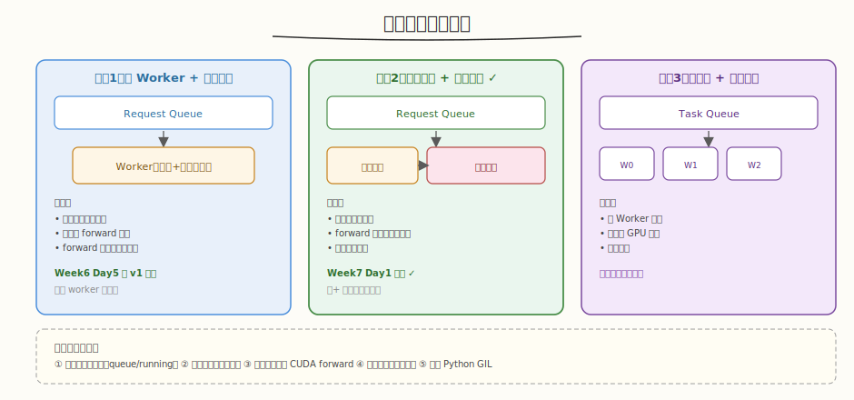
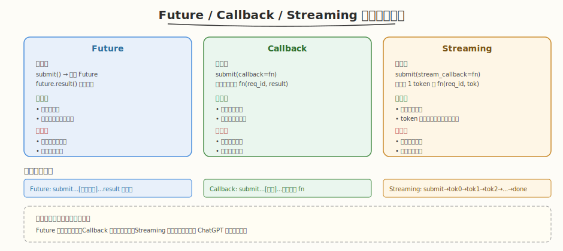
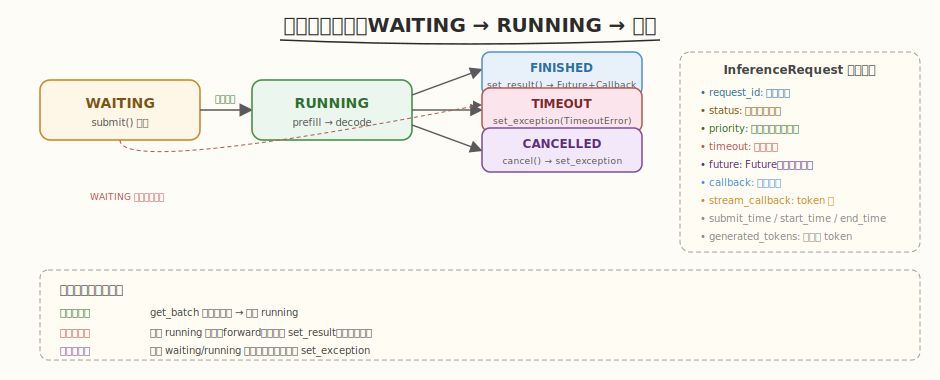

## Day 1：多请求并发支持

### 🎯 目标

通过今天的学习，你将：

1. 理解 **多请求并发系统的五大核心组件**——线程安全请求队列、异步处理线程、结果返回机制、请求生命周期管理、错误处理与超时控制<br>
2. 掌握 **三种并发模型**——单 Worker+共享队列、调度线程+执行线程分离、线程池+任务队列，各自适用场景与权衡<br>
3. 能实现 **ThreadSafeRequestQueue**——条件变量 + 优先级插入 + 批量获取，理解锁的粒度（锁内只做队列操作，锁外做 forward）<br>
4. 理解 **Future / Callback / Streaming** 三种结果返回方式的优缺点，实际系统通常同时支持<br>
5. 掌握 **请求生命周期**——WAITING → RUNNING → FINISHED/TIMEOUT/CANCELLED，超时线程自动清理过期请求<br>
6. 用 Python 手写一个 **ConcurrentEngine**，实测 Future 阻塞等待、Callback 事件触发、Streaming token 流式、优先级调度、超时取消

> 💡 **为什么重要**：Week 6 Day 5 的 MiniEngineV1 已支持 `submit()` 异步并发，但它的并发模型较简单（单 worker 线程，只有 Future）。Week 7 系统整合的第一步是把并发能力做"实"——加入条件变量、优先级队列、Streaming、超时控制、三线程协作。这是推理系统从"能跑的 demo"到"可用的产品"的关键一步，也是面试高频题"多请求并发如何实现、线程安全问题"。

---

### 学前导读：Week 6 引擎的并发"不够实"

Week 6 Day 5 的 MiniEngineV1 已有 `submit()` → Future 异步返回，但存在几个不足：

```
Week 6 v1 的并发短板：
 1. 请求队列是普通 deque + Lock，无条件变量 → worker 空转 sleep(0.001) 浪费 CPU
 2. 只有 Future，无 Callback / Streaming → 不支持流式输出（ChatGPT 打字机效果）
 3. 无优先级插入 → 队列纯 FIFO，高优先级请求不能插队
 4. 无超时控制 → 请求堆积时无法自动取消过期请求
 5. 单 worker 线程 → forward 时无法接收新请求
```

| 维度 | Week 6 v1 | Week 7 Day1 |
|------|----------|-------------|
| 队列 | deque + Lock | **条件变量 + 优先级插入** |
| 结果返回 | Future | **Future + Callback + Streaming** |
| 优先级 | schedule 内排序 | **入队即按优先级插** |
| 超时 | 无 | **超时线程自动取消** |
| 线程模型 | 单 worker | **调度线程 + 执行线程 + 超时线程** |

> 💡 **一句话总结**：Day 1 把 Week 6 的"单 worker + Future"升级为"三线程协作 + 条件变量 + 三种返回 + 超时控制"——从"能并发"到"并发可控"。

---

### 理论学习

#### 1.1 五大核心组件

多请求并发推理系统需要五大组件，缺一不可：

| 组件 | 职责 | Week7 实现 |
|------|------|-----------|
| 线程安全请求队列 | 接收并发提交的请求 | `ThreadSafeRequestQueue`（条件变量+优先级） |
| 异步处理线程 | 后台处理请求 | 调度线程 + 执行线程 |
| 结果返回机制 | 异步返回结果 | Future / Callback / Streaming |
| 请求生命周期 | 状态管理 | WAITING→RUNNING→FINISHED/TIMEOUT/CANCELLED |
| 错误处理与超时 | 异常恢复 | 超时线程 + `set_exception` |

#### 1.2 三种并发模型



| 模型 | 结构 | 优点 | 缺点 | 适用 |
|------|------|------|------|------|
| 模型1：单 Worker + 共享队列 | 一个线程做调度+执行 | 最简单 | forward 时无法接收请求 | 教学（Week6 v1） |
| **模型2：调度线程 + 执行线程** | 调度凑批 + 执行 forward 分离 | 调度与执行并行 | 线程间需同步 | **Week7 选此** |
| 模型3：线程池 + 任务队列 | 多 Worker 并行 | 多卡并行 | 调度复杂 | 多 GPU 扩展 |

##### 为什么选模型2？

```
模型1的问题：worker 正在 forward（10ms），此时 submit() 的请求要等 forward 完成才能入队
 → 高并发下 submit 被阻塞，请求丢失风险

模型2：调度线程专门 get_batch，执行线程专门 forward
 → forward 期间调度线程仍可接收新请求，无阻塞
 → 代价：两线程需同步 running map（用锁）
```

##### 形象类比

- **模型1** = 单人餐厅（老板一人接单+做菜，做菜时没人接单）
- **模型2** = 前台+后厨（前台接单，后厨做菜，接单做菜并行）
- **模型3** = 多窗口餐厅（多个窗口同时接单做菜，适合高峰）

#### 1.3 ThreadSafeRequestQueue：条件变量 + 优先级

```python
class ThreadSafeRequestQueue:
 def __init__(self):
 self._queue = deque()
 self._cond = threading.Condition() # Lock + wait/notify

 def put(self, request):
 with self._cond:
 # 按优先级插入（高优先级在前）
 for i, req in enumerate(self._queue):
 if request.priority > req.priority:
 self._queue.insert(i, request)
 break
 else:
 self._queue.append(request)
 self._cond.notify() # 唤醒等待的 worker

 def get_batch(self, max_size, max_wait):
 with self._cond:
 while len(batch) < max_size:
 if not self._queue:
 self._cond.wait(remaining) # 无请求时挂起（不空转）
 batch.append(self._queue.popleft())
```

##### 条件变量 vs 轮询

| 方式 | Week6 v1（轮询） | Week7（条件变量） |
|------|-----------------|------------------|
| 无请求时 | `sleep(0.001)` 空转 | `cond.wait()` 挂起 |
| CPU 占用 | 持续轮询浪费 CPU | 挂起零 CPU |
| 响应延迟 | ≤1ms（轮询间隔） | 立即（notify 唤醒） |

> ⚠️ **线程安全要点**：①锁保护共享状态 ②条件变量通知新请求 ③**避免锁内执行 CUDA forward**（防死锁+性能下降）④原子操作更新计数器 ⑤注意 Python GIL

#### 1.4 Future / Callback / Streaming



| 方式 | 机制 | 优点 | 缺点 | 适合 |
|------|------|------|------|------|
| **Future** | `submit()`→Future，`result()`阻塞 | 接口简单 | 不适合流式 | 简单调用 |
| **Callback** | 完成时自动调 `fn(req_id, result)` | 不阻塞调用方 | 嵌套回调复杂 | 事件驱动 |
| **Streaming** | 每生成 1 token 调 `fn(req_id, token)` | 体验最好（打字机） | 需维护流状态 | 流式输出 |

##### 三者时间线对比

```
Future: submit...[等待全部完成]...result 一次性返回
Callback: submit...[后台处理]...完成时触发 fn
Streaming: submit → tok0 → tok1 → tok2 → ... → done（逐个返回）
```

> 💡 实际系统（vLLM/OpenAI API）通常同时支持三种：Future 用于简单调用，Callback 用于事件驱动，Streaming 用于流式输出（ChatGPT 的 SSE 打字机效果）。

#### 1.5 请求生命周期



```
submit() → WAITING（入队，等调度）
 → RUNNING（调度选中，prefill→decode）
 ├── 正常完成 → FINISHED（set_result → Future+Callback）
 ├── 超时 → TIMEOUT（set_exception）
 └── 取消 → CANCELLED（cancel() → set_exception）
```

##### 三线程协作

| 线程 | 职责 |
|------|------|
| **调度线程** | `get_batch` 从队列凑批 → 加入 running |
| **执行线程** | 处理 running 请求（forward），完成 `set_result`（锁外执行） |
| **超时线程** | 检查 waiting/running 中的过期请求，自动 `set_exception` |

> 💡 锁的粒度：调度线程和执行线程都操作 `running` map，用 `running_lock` 保护。但 forward（sleep/CUDA）在锁外执行——避免 forward 期间阻塞调度。

### Coding 任务：实现 ConcurrentEngine

#### 任务 1：创建 concurrent_engine.py

创建文件 [kernels/concurrent_engine.py](kernels/concurrent_engine.py)，实现三线程协作的并发推理引擎：

```python
# concurrent_engine.py —— 多请求并发支持（线程安全队列 + Future/Callback/Streaming + 生命周期）
# 运行命令: python concurrent_engine.py
# 依赖: 仅标准库

import threading
from collections import deque
from concurrent.futures import Future

class RequestStatus:
 WAITING = "waiting"
 RUNNING = "running"
 FINISHED = "finished"
 TIMEOUT = "timeout"
 CANCELLED = "cancelled"

class InferenceRequest:
 """一个推理请求，支持 Future / Callback / Streaming 三种结果返回。"""
 def __init__(self, prompt, max_new_tokens=8, priority=0,
 timeout=None, callback=None, stream_callback=None):
 self.future = Future()
 self.status = RequestStatus.WAITING
 # ... priority, timeout, callback, stream_callback

 def emit_token(self, token):
 """Streaming：每生成一个 token 调用 stream_callback。"""
 self.generated_tokens.append(token)
 if self.stream_callback:
 self.stream_callback(self.request_id, token)

 def set_result(self, result):
 """完成时：Future + Callback。"""
 self.status = RequestStatus.FINISHED
 self.future.set_result(result)
 if self.callback:
 self.callback(self.request_id, result)

class ThreadSafeRequestQueue:
 """条件变量 + 优先级插入 + 批量获取。"""
 def put(self, request):
 with self._cond:
 # 按优先级插入，notify 唤醒 worker
 def get_batch(self, max_size, max_wait):
 with self._cond:
 # 批量获取，无请求时 cond.wait 挂起

class ConcurrentEngine:
 """模型2：调度线程 + 执行线程 + 超时线程。"""
 def submit(self, prompt, ..., callback=None, stream_callback=None):
 # 入队，返回 InferenceRequest（含 Future）
 def _scheduler_loop(self):
 # get_batch → 加入 running
 def _worker_loop(self):
 # forward（锁外）→ set_result（Future+Callback+Streaming）
 def _timeout_loop(self):
 # 检查过期请求 → set_exception
```

完整代码（含 5 个 demo）见 [kernels/concurrent_engine.py](kernels/concurrent_engine.py)。

代码要点：
- `ThreadSafeRequestQueue`：`Condition` 保护队列，`put` 按优先级插入 + `notify`，`get_batch` 批量获取 + `wait` 挂起（不空转）
- `InferenceRequest`：同时支持 Future（`future.result()` 阻塞）、Callback（`set_result` 时触发）、Streaming（`emit_token` 每 token 触发）
- `ConcurrentEngine`：三线程协作——调度线程凑批、执行线程 forward（锁外）、超时线程清理
- **锁的粒度**：`running_lock` 保护 running map，forward 在锁外执行（避免阻塞 submit/scheduler）
- **与 Week6 v1 的区别**：v1 单 worker + 轮询 + 仅 Future；本文件三线程 + 条件变量 + 三种返回 + 优先级 + 超时

#### 任务 2：运行并观察五种机制

```bash
python kernels/concurrent_engine.py
```

**预期输出**（节选）：

```text
Demo 1: Future（阻塞等待结果）
 Submitted request 1, waiting...
 Result: tok0 tok1 tok2 tok3 tok4
 Latency: 21.0ms, status=finished

Demo 2: Callback（结果到达时触发）
 [Callback] Request 2 done: tok0 tok1 tok2 tok3...
 Callback triggered 3 times

Demo 3: Streaming（token 逐个返回）
 [Stream] Request 5 -> tok0
 [Stream] Request 5 -> tok1
 ...
 Total streamed tokens: 5

Demo 4: 优先级调度（高优先级先处理）
 Completion order: [8, 6, 7]
 HIGH(priority=10) 应该最先完成

Demo 5: 超时控制（0.05s 超时，forward 需0.1s）
 Expected timeout: Request 9 timed out
 status=timeout
```

##### 观察重点

1. **Demo 1 Future**：`future.result()` 阻塞直到完成，返回全部 token
2. **Demo 2 Callback**：3 个请求完成时各自触发 callback，无需手动等待
3. **Demo 3 Streaming**：5 个 token 逐个通过 `stream_callback` 返回（打字机效果）
4. **Demo 4 优先级**：HIGH(priority=10) 虽后提交但最先完成（优先级插入队列）
5. **Demo 5 超时**：timeout=0.05s 但 forward 需 0.1s → 超时线程自动取消，`future.result()` 抛 TimeoutError

#### 任务 3：对比 Week 6 v1 的并发模型

思考：同样 3 个请求，Week 6 v1（单 worker + 轮询）和 Week 7（三线程 + 条件变量）在 CPU 占用和响应延迟上有什么区别？

> 思考：v1 的 `sleep(0.001)` 轮询每秒 1000 次，CPU 浪费；Week7 的 `cond.wait()` 无请求时挂起零 CPU，有请求时 `notify` 立即唤醒。

#### 任务 4：LeetGPU 在线题目 —— Color Inversion

**题目链接**：<https://leetgpu.com/challenges/color-inversion>

**题目概述**：给定 RGBA 图像（`height*width*4` 的 uint8 数组，每像素 4 字节），对每个像素反转 RGB 三通道（`255 - v`），保留 alpha 通道不变。

**约束条件**：`1 ≤ height, width ≤ 4096`；性能测试取大图。

**与今日知识的关联**：Color Inversion 是**elementwise 内存受限 kernel** 的典型——每个像素独立处理、无计算依赖，瓶颈在显存带宽而非算力。这与并发引擎的"请求独立搬运"同构：队列的 `put`/`get_batch` 把每个请求从 submit 线程搬到 worker 线程，请求间无依赖（像像素间无依赖），搬运效率（coalesced 访存 + 条件变量 notify 的及时性）决定整体吞吐。Color Inversion 练习 coalesced 访存和 grid-stride 循环——这是并发引擎高效处理海量独立请求的底层模式：把"每个请求独立处理"映射到 GPU 就是"每个像素独立计算"。

> 💡 提交后在 [LeetGPU Color Inversion](https://leetgpu.com/challenges/color-inversion) 上记录通过耗时。完整题解（含 elementwise kernel、coalesced 访存、与请求独立搬运的类比）见 [Color Inversion 题解](../../../../leetgpu/week7/day1/leetgpu-color-inversion-solution.md)。

#### 任务 5：LeetCode 面试题 —— 最长连续序列

**题目链接**：[128. 最长连续序列](https://leetcode.cn/problems/longest-consecutive-sequence/)

**题目概述**：给定未排序整数数组 `nums`，找出最长连续序列的长度（要求 `O(n)` 时间）。

**与今日知识的关联**：最长连续序列的**哈希集合 + 序列起点枚举**与并发引擎的请求 ID 管理同构——引擎用 `request_id` 唯一标识每个请求（类似集合中的元素），连续序列的"从起点向后查"对应引擎按 ID 顺序处理请求。哈希集合的 `O(1)` 查找对应引擎用 dict（哈希表）`O(1)` 索引 `running[request_id]`。两者都是**用哈希实现 O(1) 查找**的核心模式：集合查元素存在性，引擎查请求状态。

**核心套路**：

```
全部数入哈希集合 → 枚举每个数：
 若 num-1 不在集合（num 是序列起点）→ 向后查 num+1, num+2... 计长度
 更新 max_len
O(n)：每个数最多被查 2 次（起点枚举 + 被后续查到）
```

> 💡 完整题解（含 C++/Python 参考代码、哈希集合图解、与引擎 request_id 索引的类比）见 [最长连续序列题解](../../../../leetcode/daily/week7/day1/最长连续序列.md)。

---

### 扩展实验

#### 实验 1：实现 Streaming 的真实流式输出

当前 `emit_token` 在 forward 内一次性调用 `max_new_tokens` 次。修改为每轮 decode 调用一次（模拟真实逐 token 生成），观察 stream_callback 的触发节奏更接近打字机效果。

> 思考：真实 Streaming 输出对前端有什么要求？（提示：SSE/WebSocket 长连接，前端逐 token 渲染。OpenAI API 用 SSE。）

#### 实验 2：实现请求取消 API

当前 `cancel()` 已实现骨架。测试：提交 3 个请求后立即 cancel 第 2 个，验证它的 `future.result()` 抛异常、且不影响 1 和 3。

> 思考：cancel 一个正在 running 的请求需要注意什么？（提示：worker 可能正在 forward 它，需标记 status=CANCELLED，worker 检查后跳过；KV Cache 释放。）

#### 实验 3：模型3 线程池实现

将模型2（调度+执行两线程）扩展为模型3（多 Worker 线程池）：`ThreadPoolExecutor` 中多个 worker 并行处理 running 请求。测试：多 worker 能否真正并行（在多核 CPU 上）？

> 思考：Python GIL 对多线程推理有什么影响？（提示：Python 线程无法真并行 CPU 任务，但 CUDA forward 会释放 GIL，所以多线程+GPU 能并行。纯 Python 模拟则受 GIL 限制。）

---

### 今日总结

Day 1 我们把 Week 6 的并发引擎从"单 worker + Future"升级为"三线程协作 + 条件变量 + 三种返回 + 超时控制"：

1. **五大核心组件**：线程安全队列、异步处理线程、结果返回（Future/Callback/Streaming）、请求生命周期、错误处理与超时
2. **三种并发模型**：单 Worker（简单）、调度+执行分离（Week7 选此）、线程池（多卡）；选模型2因 forward 时仍可接收请求
3. **ThreadSafeRequestQueue**：条件变量（`wait`/`notify`，不空转）+ 优先级插入 + 批量获取；锁内只做队列操作
4. **三种结果返回**：Future（阻塞等待）、Callback（事件触发）、Streaming（token 逐个返回）；实际系统同时支持
5. **请求生命周期**：WAITING→RUNNING→FINISHED/TIMEOUT/CANCELLED；超时线程自动清理过期请求
6. **三线程协作**：调度线程凑批 + 执行线程 forward（锁外）+ 超时线程清理
7. **实测验证**：Future 阻塞等待、Callback 3 次触发、Streaming 5 token 流式、优先级 HIGH 先完成、超时自动取消

掌握这些后，你就有了推理引擎的并发骨架——明天 Day 2 实现完整调度器（优先级+超时+资源预算+抢占），让并发引擎有"调度大脑"。

---

### 面试要点

1. **推理系统中如何实现多请求并发？需要注意哪些线程安全问题？**（⭐⭐⭐⭐ 高频）

<details>
<summary>点击查看答案</summary>

 - **核心组件**：线程安全请求队列（条件变量）、异步处理线程、结果返回（Future/Callback/Streaming）、生命周期管理、超时控制
 - **线程安全要点**：
 1. 锁保护共享状态（waiting queue、running map、KV cache metadata）
 2. 条件变量通知新请求到达（避免轮询空转）
 3. **避免锁内执行 CUDA forward**（防死锁+性能下降）
 4. 原子操作更新计数器
 5. 注意 Python GIL 对多线程的限制（CUDA forward 释放 GIL 可并行，纯 Python 受限）
 - **生命周期**：waiting → running → finished / timeout / cancelled

</details>


2. **Future、Callback、Streaming 三种结果返回方式各有什么优缺点？**

<details>
<summary>点击查看答案</summary>

 - **Future**：接口简单，调用方阻塞等待；不适合大结果或流式输出
 - **Callback**：不阻塞调用方，结果到达即触发；嵌套回调复杂、错误处理麻烦
 - **Streaming**：体验最好（token 逐个返回，打字机效果）；需维护流状态、连接管理复杂
 - **实际系统**：同时支持三种——Future 用于简单调用，Callback 用于事件驱动，Streaming 用于流式输出（OpenAI SSE）

</details>


3. **为什么选择调度线程+执行线程分离的模型，而不是单 Worker？**

<details>
<summary>点击查看答案</summary>

 - 单 Worker：forward 时无法接收新请求 → 高并发下 submit 被阻塞
 - 调度+执行分离：调度线程专门 get_batch，执行线程专门 forward → forward 期间仍可接收请求
 - 代价：两线程需同步 running map（用锁保护）
 - 多 Worker 线程池适合多 GPU，但调度更复杂

</details>


4. **条件变量相比轮询（sleep+check）有什么优势？**

<details>
<summary>点击查看答案</summary>

 - 轮询：无请求时 `sleep(0.001)` 空转，每秒 1000 次检查，浪费 CPU
 - 条件变量：无请求时 `cond.wait()` 挂起，零 CPU 占用；有请求时 `notify()` 立即唤醒
 - 响应延迟：轮询 ≤1ms（sleep 间隔），条件变量立即（notify 即唤醒）
 - 生产环境必用条件变量，轮询只适合教学

</details>


5. **如何实现请求超时自动取消？**

<details>
<summary>点击查看答案</summary>

 - 给 `InferenceRequest` 加 `timeout` 字段和 `submit_time`
 - 后台超时线程定期扫描 waiting 和 running 中的请求
 - `is_expired()`：`(time.time() - submit_time) > timeout`
 - 过期则移除 + `set_exception(TimeoutError)`，future.result() 抛异常
 - 注意：running 中超时的请求需标记 status=TIMEOUT，worker 检查后跳过

</details>

