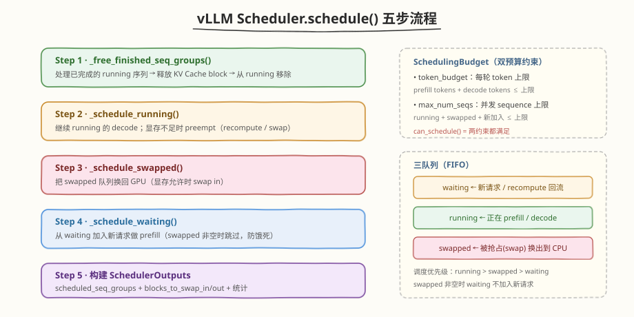
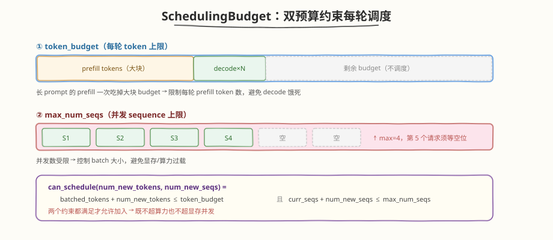
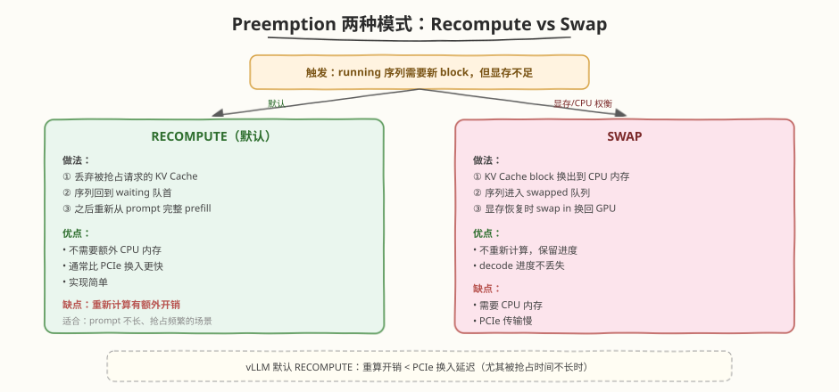

## Day 2：vLLM Scheduler 源码分析

### 🎯 目标

通过今天的学习，你将：

1. 理解 vLLM `Scheduler` **类的整体结构**——三个 FIFO 队列（waiting/running/swapped）+ BlockSpaceManager，每轮 `schedule()` 决定哪些序列参与本轮 forward<br>
2. 掌握 `schedule()` **的 5 步流程**——处理完成 → 调度 running → 调度 swapped → 调度 waiting → 构建 SchedulerOutputs，每一步的输入输出与约束<br>
3. 理解 `SchedulingBudget` **双预算约束**——`token_budget`（每轮 token 上限）+ `max_num_seqs`（并发 sequence 上限），`can_schedule()` 如何同时卡算力与显存并发<br>
4. 掌握 **Preemption 的两种模式**——RECOMPUTE（丢弃 KV Cache 重算，默认）与 SWAP（KV Cache 换出到 CPU），各自的适用场景与权衡<br>
5. 能追踪 `_schedule_running` **/** `_schedule_swapped` **/** `_schedule_waiting` 三个内部方法的核心逻辑，理解"swapped 非空时不接纳新请求"的防饿死策略<br>
6. 用 Python 手写一个 **教学级** `Scheduler` **复刻**，实测 RECOMPUTE 与 SWAP 两种抢占模式下请求被抢占、恢复、完成的完整时间线

> 💡 **为什么重要**：Day 2 我们手写了 Continuous Batcher，但那个实现只有 `token_budget` 约束、没有显存预算和抢占——一旦显存不够就直接拒绝新请求。真实 vLLM 的 Scheduler 远比这复杂：它要在显存压力下**抢占**正在运行的请求（而不是简单拒绝），并通过 RECOMPUTE/SWAP 两种策略恢复。`Scheduler.schedule()` 是 vLLM 推理调度的"心脏"，也是面试必考题（⭐⭐⭐⭐⭐）。今天我们逐行拆解它的源码逻辑，并复刻一个能真正触发抢占的教学模型。

---

### 学前导读：Day 2 的 Continuous Batcher 缺了什么

Day 2 的 `_schedule()` 逻辑很朴素：每轮保留 running + 从 waiting 补入，唯一的约束是 `token_budget`。它有个致命假设——**显存永远够用**。但真实场景里 KV Cache 显存是有限的：

```
Day 2 ContinuousBatcher 的盲区：
 - running 序列不断 decode → KV Cache 持续增长
 - 新请求 prefill → 突然需要一大块显存
 - 显存满了怎么办？Day 2 的实现：直接不加入（waiting 继续等）
 - 但 running 也在增长 → 显存迟早爆 → OOM 崩溃
```

vLLM 的 Scheduler 用 **Preemption（抢占）** 解决这个问题：显存不足时，**主动抢占**部分 running 请求，腾出显存给高优先级或已快完成的请求。被抢占的请求不会丢失——通过 RECOMPUTE（重算）或 SWAP（换出）在显存恢复后继续。

| 维度 | Day 2 ContinuousBatcher | Day 3 vLLM Scheduler |
|------|------------------------|----------------------|
| 队列数 | 2（waiting/running） | **3**（waiting/running/**swapped**） |
| 显存管理 | 无（假设无限） | **BlockSpaceManager**（block 粒度分配） |
| 显存不足时 | 拒绝新请求（waiting 等） | **Preemption**（抢占 running，腾显存） |
| 预算约束 | 仅 token_budget | **token_budget + max_num_seqs + 显存 block** |
| 恢复机制 | 无 | **RECOMPUTE / SWAP** |

> 💡 **一句话总结**：Day 2 的 Continuous Batcher 是"只管加不管抢"的简化版；vLLM Scheduler 多了 **显存预算 + 抢占机制**，在显存压力下主动腾挪，让系统在过载时优雅降级而非 OOM 崩溃。

---

### 理论学习

#### 3.1 Scheduler 的整体结构



vLLM 的 `Scheduler` 类（`vllm/core/scheduler.py`）维护三个 FIFO 队列和一个块管理器：

```python
class Scheduler:
 def __init__(self, scheduler_config, cache_config, ...):
 self.waiting = deque() # 新请求 / recompute 回流
 self.running = deque() # 正在 prefill / decode
 self.swapped = deque() # 被 swap 抢占、换出到 CPU 的请求
 self.block_manager = BlockSpaceManager(...) # KV Cache block 管理
```

##### 三队列的职责

| 队列 | 谁会进这里 | 状态 |
|------|-----------|------|
| **waiting** | 新到达的请求；RECOMPUTE 被抢占后回流 | `WAITING` |
| **running** | 通过 `schedule()` 被选中参与本轮 forward 的请求 | `RUNNING` |
| **swapped** | SWAP 模式下被抢占、KV Cache 换出到 CPU 的请求 | `SWAPPED` |

调度优先级：**running > swapped > waiting**。也就是说，每轮先把 running 跑完，再尝试恢复 swapped，最后才从 waiting 接纳新请求。一个关键防饿死策略：**swapped 非空时不接纳新 waiting 请求**——否则新请求会不断插队，被抢占的请求永远恢复不了。

##### 形象类比：把 Scheduler 想象成餐厅调度员

- **waiting** = 门外排队等位的客人（新到的 + 被请出又回来的）
- **running** = 正在桌上吃饭的客人（每轮上一道菜 = decode 一个 token）
- **swapped** = 被请到包厢暂存行李的客人（KV Cache 存 CPU，桌子让给别人）
- 每轮调度员决定：哪些客人继续吃（running decode）、哪些从包厢请回来（swap in）、哪些新客人入座（prefill）
- 显存 = 桌子数；桌子满了，要么让吃到一半的客人退到包厢（swap），要么让他重新排队从头点菜（recompute）

#### 3.2 schedule() 的 5 步流程

`schedule()` 是 Scheduler 的主入口，每轮 iteration 调用一次，严格按 5 步执行：

```python
def schedule(self) -> SchedulerOutputs:
 budget = SchedulingBudget(token_budget=..., max_num_seqs=...)
 outputs = SchedulerOutputs()

 # Step 1: 处理已完成的 running 序列（释放 KV Cache block）
 self._free_finished_seq_groups()

 # Step 2: 调度 running 队列（继续 decode），显存不足则 preempt
 self._schedule_running(budget, outputs)

 # Step 3: 调度 swapped 队列（尝试 swap in 换回 GPU）
 self._schedule_swapped(budget, outputs)

 # Step 4: 从 waiting 加入新请求做 prefill（swapped 非空时跳过）
 self._schedule_waiting(budget, outputs)

 # Step 5: 构建 SchedulerOutputs
 outputs.num_batched_tokens = budget.num_batched_tokens
 return outputs
```

##### 每一步做什么

| 步骤 | 方法 | 作用 | 关键约束 |
|------|------|------|---------|
| 1 | `_free_finished_seq_groups` | 移除 `FINISHED` 的 running 序列，释放其 block | — |
| 2 | `_schedule_running` | 继续 running 的 decode；block 不足时 preempt | block 可分配 + budget |
| 3 | `_schedule_swapped` | 把 swapped 序列 swap in 回 GPU | block 可分配 + budget |
| 4 | `_schedule_waiting` | 从 waiting prefill 新请求 | **swapped 为空** + block + budget |
| 5 | 构建 outputs | 汇总本轮要跑的序列 + swap 记录 | — |

##### 为什么是这个顺序？

1. **先处理完成**：释放显存，给后续步骤腾空间
2. **再调度 running**：已运行的优先保留（避免无谓抢占）
3. **然后 swapped**：恢复被抢占的请求（公平性，防饿死）
4. **最后 waiting**：新请求优先级最低（已运行的不能被新请求挤掉）

#### 3.3 SchedulingBudget：双预算约束



`SchedulingBudget` 是每轮调度的"资源账本"，跟踪两个上限：

```python
@dataclass
class SchedulingBudget:
    token_budget: int # 每轮最多处理的 token 数
    max_num_seqs: int # 每轮最多并发的 sequence 数
    _num_batched_tokens: int = 0 # 已消耗 token
    _num_curr_seqs: int = 0 # 已占用 seq 槽

    def can_schedule(self, num_new_tokens, num_new_seqs=0):
        return (self._num_batched_tokens + num_new_tokens <= self.token_budget
        and self._num_curr_seqs + num_new_seqs <= self.max_num_seqs)
```

##### 两个预算的作用

| 预算 | 限制什么 | 为什么需要 |
|------|---------|-----------|
| `token_budget` | 每轮 prefill + decode 的总 token 数 | 长 prompt 的 prefill 一次吃掉大块算力 → 限制它，避免 decode 饿死、latency 抖动 |
| `max_num_seqs` | 并发 sequence 数 | 控制批量大小，避免显存/算力过载、attention 计算爆炸 |

> 💡 **token_budget 的精妙之处**：prefill 一个 prompt=2048 的请求消耗 2048 token budget，而 decode 一个请求只消耗 1。如果 `token_budget=2048`，一轮要么跑 1 个长 prefill，要么跑 2048 个 decode。这个约束让 prefill 不会霸占整轮——配合 **chunked prefill**（Day 4 详讲），长 prompt 被拆成小块与 decode 交错。

#### 3.4 Preemption：显存压力下的抢占



当 Step 2 `_schedule_running` 发现某个 running 序列需要新 block 但显存不足时，触发 **preemption**。vLLM 提供两种模式：

```python
class PreemptionMode:
    RECOMPUTE = "recompute" # 默认
    SWAP = "swap"

    def _preempt(self, seq_group, blocks_to_swap_out):
        if self.scheduler_config.preemption_mode == PreemptionMode.RECOMPUTE:
            self._preempt_by_recompute(seq_group)
        else:
            self._preempt_by_swap(seq_group, blocks_to_swap_out)
```

##### 两种模式对比

| 维度 | RECOMPUTE（默认） | SWAP |
|------|------------------|------|
| **做法** | 丢弃 KV Cache，序列回 waiting 重 prefill | KV Cache 换出到 CPU，序列进 swapped |
| **恢复** | 重新从 prompt 完整 prefill | swap in 换回 GPU，从断点继续 |
| **CPU 内存** | 不需要 | 需要（存 KV Cache） |
| **恢复速度** | 重算开销（与 prompt 长度成正比） | PCIe 传输延迟 |
| **实现** | 简单 | 复杂（需 swap 映射表） |
| **适合** | prompt 不长、抢占频繁 | prompt 很长、抢占时间久 |

##### 为什么默认 RECOMPUTE？

vLLM 默认用 RECOMPUTE，核心原因：**重算开销通常小于 PCIe 换入延迟**。

```
假设：prompt=512 tokens，被抢占后立即恢复
 RECOMPUTE：重 prefill 512 tokens ≈ 几 ms（GPU 算力快）
 SWAP： 换出 + 换入 2 × PCIe 传输 ≈ 几十 ms（PCIe 带宽 ~30GB/s）

→ 重算反而更快，且不占 CPU 内存
```

但如果 prompt 极长（如 32K tokens）且被抢占时间久，重算代价超过 PCIe 换入，此时 SWAP 更划算。

#### 3.5 关键源码追踪：三个内部方法

##### `_schedule_running`：继续 decode，不够就抢占

```python
def _schedule_running(self, budget, outputs):
    # 遍历 running 队列（注意：从队尾抢占，最后加入的最先被 preempt）
    for seq_group in self.running:
        seq = seq_group.seq
        # 1. 检查 decode 是否需要新 block（跨过 block 边界）
        if self._needs_new_block(seq):
            if not self.block_manager.can_allocate(...):
                self._preempt(seq_group, outputs) # 显存不足 → 抢占
                continue
                self.block_manager.allocate(...)
                # 2. 检查 token/seq 预算
                if not budget.can_schedule(num_new_tokens, 0):
                    self._preempt(seq_group, outputs) # 预算不足 → 抢占
                    continue
                    budget.consume(num_new_tokens, 0)
                    outputs.scheduled_seq_groups.append(seq_group)
```

##### `_schedule_swapped`：恢复被换出的请求

```python
def _schedule_swapped(self, budget, outputs):
    for seq_group in self.swapped:
        seq = seq_group.seq
        # swap in 需要重新分配 block + 占 1 个 seq 槽
        if (self.block_manager.can_allocate(seq.total_tokens)
                and budget.can_schedule(1, num_new_seqs=1)):
            self.block_manager.swap_in(seq.seq_id, seq.total_tokens)
            budget.consume(1, 1)
            seq.status = SeqStatus.RUNNING
            outputs.swapped_in += 1
            self.running.append(seq_group)
        # 否则继续留在 swapped，下轮再试
```

##### `_schedule_waiting`：防饿死的关键

```python
def _schedule_waiting(self, budget, outputs):
    if self.swapped:   # ★ 关键：swapped 非空时不接纳新请求
        return
    for seq_group in self.waiting:
        seq = seq_group.seq
        num_new = seq.prompt_len   # prefill 消耗 prompt_len token
        if (self.block_manager.can_allocate(seq.total_tokens)
                and budget.can_schedule(num_new, 1)):
            self.block_manager.allocate(seq.seq_id, seq.total_tokens)
            budget.consume(num_new, 1)
            seq.status = SeqStatus.RUNNING
            self.running.append(seq_group)
        # 否则留在 waiting
```

> ⚠️ **防饿死策略**：`if self.swapped: return` 这一行是关键。如果允许在有 swapped 请求时接纳新 waiting 请求，新请求会不断占用显存，被抢占的 swapped 请求永远等不到恢复。所以 vLLM 强制：**先把 swapped 清空，才接纳新请求**。

### Coding 任务：手写 vLLM Scheduler 教学复刻

#### 任务 1：创建 vllm_scheduler_analyzer.py

创建文件 [kernels/vllm_scheduler_analyzer.py](https://github.com/hzchenxiaobin/ai-infra-notes/blob/main/aiinfra/daily/week10/day7/kernels/vllm_scheduler_analyzer.py)，复刻 vLLM Scheduler 的三大核心机制——`schedule()` 5 步流程、`SchedulingBudget` 双预算、Preemption 两种模式：

```python
# vllm_scheduler_analyzer.py —— vLLM Scheduler 源码分析教学模型
# 运行命令: python vllm_scheduler_analyzer.py
# 依赖: 仅标准库
#
# 本文件是对 vLLM `vllm/core/scheduler.py` 的教学级简化复刻，聚焦三个核心机制：
#   1. schedule() 的 5 步流程（处理完成 → running → swapped → waiting → 构建 outputs）
#   2. SchedulingBudget（token_budget + max_num_seqs 双预算约束）
#   3. Preemption 两种模式（RECOMPUTE 丢弃 KV Cache 重算 / SWAP 换出到 CPU）
#
# 与 Day2 ContinuousBatcher 的区别：
#   - Day2 只实现 token_budget 约束，没有显存预算和抢占
#   - 本文件加入 BlockSpaceManager（显存 block 预算）+ 完整抢占逻辑
#   - 三队列：waiting / running / swapped（Day2 只有 waiting / running）

from collections import deque
from dataclasses import dataclass, field
from enum import Enum
from typing import Deque, Dict, List, Optional


class SeqStatus(Enum):
    WAITING = "waiting"
    RUNNING = "running"
    SWAPPED = "swapped"
    FINISHED = "finished"


class PreemptionMode(Enum):
    RECOMPUTE = "recompute"   # 默认：丢弃 KV Cache，之后从 prompt 重算
    SWAP = "swap"             # 把 KV Cache 换出到 CPU，之后换入


@dataclass
class SchedulingBudget:
    """调度预算：每轮 iteration 的两类资源上限。

    对应 vLLM 的 `vllm.core.scheduling_budget.SchedulingBudget`：
      - token_budget：每轮最多处理的 token 数（prefill tokens + decode tokens）
      - max_num_seqs：每轮最多并发的 sequence 数
    """
    token_budget: int = 256
    max_num_seqs: int = 4
    # 已消耗（运行中累加，本轮调度结束时归零）
    _num_batched_tokens: int = field(default=0, repr=False)
    _num_curr_seqs: int = field(default=0, repr=False)

    def can_schedule(self, num_new_tokens: int, num_new_seqs: int = 0) -> bool:
        return (self._num_batched_tokens + num_new_tokens <= self.token_budget and
                self._num_curr_seqs + num_new_seqs <= self.max_num_seqs)

    def consume(self, num_new_tokens: int, num_new_seqs: int = 0):
        self._num_batched_tokens += num_new_tokens
        self._num_curr_seqs += num_new_seqs

    def remaining_tokens(self) -> int:
        return self.token_budget - self._num_batched_tokens

    def remaining_seqs(self) -> int:
        return self.max_num_seqs - self._num_curr_seqs

    def reset(self):
        self._num_batched_tokens = 0
        self._num_curr_seqs = 0


@dataclass
class SchedulerOutputs:
    """对应 vLLM 的 `vllm.core.scheduler.SchedulerOutputs`：记录本轮调度结果。"""
    scheduled_seq_groups: List["SequenceGroup"] = field(default_factory=list)
    num_batched_tokens: int = 0
    preempted: int = 0
    swapped_out: int = 0
    swapped_in: int = 0
    blocks_to_swap_out: List[tuple] = field(default_factory=list)   # [(seq_id, blocks)]
    blocks_to_swap_in: List[tuple] = field(default_factory=list)

    def summary(self) -> str:
        return (f"batched_tokens={self.num_batched_tokens}, "
                f"seqs={len(self.scheduled_seq_groups)}, "
                f"preempted={self.preempted}, "
                f"swap_out={self.swapped_out}, swap_in={self.swapped_in}")


class BlockSpaceManager:
    """简化版 BlockSpaceManager：管理 KV Cache block 的分配/释放。

    对应 vLLM 的 `vllm.core.block_manager.BlockSpaceManager`。
    PagedAttention 把 KV Cache 切成固定大小的 block（如 16 token/block），
    按需分配给各 sequence，避免连续分配的碎片化。
    """

    def __init__(self, num_total_blocks: int, block_size: int = 4):
        self.num_total_blocks = num_total_blocks
        self.block_size = block_size
        self.free_blocks: Deque[int] = deque(range(num_total_blocks))
        # seq_id -> list of block ids
        self.block_table: Dict[int, List[int]] = {}

    def num_free_blocks(self) -> int:
        return len(self.free_blocks)

    def can_allocate(self, num_tokens: int) -> bool:
        """能否为 num_tokens 个 token 分配足够的 block。"""
        needed = (num_tokens + self.block_size - 1) // self.block_size
        return len(self.free_blocks) >= needed

    def allocate(self, seq_id: int, num_tokens: int):
        needed = (num_tokens + self.block_size - 1) // self.block_size
        if len(self.free_blocks) < needed:
            raise MemoryError(f"OOM: need {needed} blocks, only {len(self.free_blocks)} free")
        blocks = [self.free_blocks.popleft() for _ in range(needed)]
        # 若已有 block 表项（decode 增长），追加而非覆盖，避免泄漏已分配 block
        if seq_id in self.block_table:
            self.block_table[seq_id].extend(blocks)
        else:
            self.block_table[seq_id] = blocks

    def free(self, seq_id: int):
        for b in self.block_table.pop(seq_id, []):
            self.free_blocks.append(b)

    def swap_out(self, seq_id: int) -> tuple:
        """把 seq 的 block 换出到 CPU：释放 block 但保留映射记录（标记 swapped）。"""
        blocks = self.block_table.pop(seq_id, [])
        for b in blocks:
            self.free_blocks.append(b)
        return (seq_id, list(blocks))

    def swap_in(self, seq_id: int, num_tokens: int):
        """从 CPU 换入：重新分配 block（swap_out 已清空表项，此处新建）。"""
        self.allocate(seq_id, num_tokens)


class Sequence:
    """一个推理序列（对应 vLLM 的 Sequence）。"""

    def __init__(self, seq_id: int, prompt_len: int, max_new_tokens: int = 8):
        self.seq_id = seq_id
        self.prompt_len = prompt_len
        self.max_new_tokens = max_new_tokens
        self.generated_count = 0
        self.status = SeqStatus.WAITING
        # 逻辑 KV token 数 = prompt_len + generated_count（决定需要多少 block）
        self.start_iter = -1
        self.finish_iter = -1
        self.preempt_count = 0   # 被抢占次数（用于追踪开销）

    @property
    def total_tokens(self) -> int:
        return self.prompt_len + self.generated_count

    def is_prefill(self) -> bool:
        return self.generated_count == 0

    def append_token(self):
        self.generated_count += 1
        if self.generated_count >= self.max_new_tokens:
            self.status = SeqStatus.FINISHED

    def __repr__(self):
        return (f"S{self.seq_id}(p={self.prompt_len},g={self.generated_count},"
                f"{self.status.value})")


class SequenceGroup:
    """对应 vLLM 的 SequenceGroup：一组共享 prompt 的 sequence（beam search 等）。

    本教学模型简化为 1 group = 1 sequence，保留类名是为了对齐 vLLM 源码概念。
    """

    def __init__(self, request_id: int, seq: Sequence):
        self.request_id = request_id
        self.seq = seq
        self.seqs = [seq]

    @property
    def status(self) -> SeqStatus:
        return self.seq.status

    def get_num_new_tokens(self) -> int:
        """本轮需要计算的新 token 数：prefill = prompt_len，decode = 1。"""
        return self.seq.prompt_len if self.seq.is_prefill() else 1


class Scheduler:
    """vLLM Scheduler 教学级复刻。

    核心方法 schedule() 严格按 5 步流程（对应 vLLM 源码 schedule()）：
      1. 处理已完成的 running 序列（释放 block）
      2. _schedule_running：继续 running 队列的 decode（显存不足则 preempt）
      3. _schedule_swapped：把 swapped 队列换回 GPU（显存允许时）
      4. _schedule_waiting：从 waiting 加入新请求做 prefill
      5. 构建 SchedulerOutputs
    """

    def __init__(self, scheduler_config: dict, cache_config: dict,
                 preemption_mode: PreemptionMode = PreemptionMode.RECOMPUTE):
        self.max_token_budget: int = scheduler_config["max_num_batched_tokens"]
        self.max_num_seqs: int = scheduler_config["max_num_seqs"]
        self.preemption_mode = preemption_mode

        self.waiting: Deque[SequenceGroup] = deque()
        self.running: Deque[SequenceGroup] = deque()
        self.swapped: Deque[SequenceGroup] = deque()

        self.block_manager = BlockSpaceManager(
            num_total_blocks=cache_config["num_gpu_blocks"],
            block_size=cache_config["block_size"],
        )
        self.iteration = 0
        self.history: List[dict] = []

    # ---------- 公开接口 ----------
    def add_request(self, sg: SequenceGroup):
        sg.seq.status = SeqStatus.WAITING
        self.waiting.append(sg)

    def schedule(self) -> SchedulerOutputs:
        """每轮调度的核心入口（对应 vLLM Scheduler.schedule()）。"""
        budget = SchedulingBudget(
            token_budget=self.max_token_budget,
            max_num_seqs=self.max_num_seqs,
        )
        outputs = SchedulerOutputs()

        # Step 1: 处理已完成的 running 序列，释放其 KV Cache block
        self._free_finished_seq_groups()

        # Step 2: 调度 running 队列（继续 decode），显存不足时 preempt
        self._schedule_running(budget, outputs)

        # Step 3: 调度 swapped 队列（尝试换回 GPU）
        self._schedule_swapped(budget, outputs)

        # Step 4: 从 waiting 队列加入新请求（做 prefill）
        self._schedule_waiting(budget, outputs)

        # Step 5: 构建 outputs
        outputs.num_batched_tokens = budget._num_batched_tokens
        self.iteration += 1
        self._record_history(outputs)
        return outputs

    # ---------- Step 1 ----------
    def _free_finished_seq_groups(self):
        still_running: Deque[SequenceGroup] = deque()
        for sg in self.running:
            if sg.status == SeqStatus.FINISHED:
                self.block_manager.free(sg.seq.seq_id)
                sg.seq.finish_iter = self.iteration
            else:
                still_running.append(sg)
        self.running = still_running
    # ---------- Step 2 ----------
    def _schedule_running(self, budget: SchedulingBudget, outputs: SchedulerOutputs):
        """继续 running 的 decode。若 block 不足，按 RECOMPUTE/SWAP 抢占。"""
        still_running: Deque[SequenceGroup] = deque()
        # 注意：从队尾抢占（最后加入的最先被 preempt，近似 LIFO / vLLM 默认行为）
        running_list = list(self.running)
        for sg in running_list:
            seq = sg.seq
            # decode 每步 +1 token，检查是否需要新 block
            needs_alloc = self._needs_new_block(seq)
            if needs_alloc and not self.block_manager.can_allocate(self.block_manager.block_size):
                # 显存不足 → 抢占当前序列
                self._preempt(sg, outputs)
                continue
            if needs_alloc:
                self.block_manager.allocate(seq.seq_id, self.block_manager.block_size)
            # 检查 token/seq 预算
            num_new = sg.get_num_new_tokens()
            if not budget.can_schedule(num_new, num_new_seqs=0):
                # 预算不足也算抢占（vLLM 中通常是显存先触顶）
                self._preempt(sg, outputs)
                continue
            budget.consume(num_new, num_new_seqs=0)
            outputs.scheduled_seq_groups.append(sg)
            still_running.append(sg)
        self.running = still_running

    def _needs_new_block(self, seq: Sequence) -> bool:
        """decode 生成新 token 后是否跨过了 block 边界（需要新 block）。"""
        bs = self.block_manager.block_size
        allocated = len(self.block_manager.block_table.get(seq.seq_id, [])) * bs
        return seq.total_tokens >= allocated

    # ---------- Step 3 ----------
    def _schedule_swapped(self, budget: SchedulingBudget, outputs: SchedulerOutputs):
        """尝试把 swapped 队列的请求换回 GPU。"""
        still_swapped: Deque[SequenceGroup] = deque()
        for sg in self.swapped:
            seq = sg.seq
            num_new = 1   # 换入后是 decode
            if (self.block_manager.can_allocate(seq.total_tokens) and
                    budget.can_schedule(num_new, num_new_seqs=1)):
                self.block_manager.swap_in(seq.seq_id, seq.total_tokens)
                budget.consume(num_new, num_new_seqs=1)
                seq.status = SeqStatus.RUNNING
                outputs.scheduled_seq_groups.append(sg)
                outputs.swapped_in += 1
                self.running.append(sg)
            else:
                still_swapped.append(sg)
        self.swapped = still_swapped

    # ---------- Step 4 ----------
    def _schedule_waiting(self, budget: SchedulingBudget, outputs: SchedulerOutputs):
        """从 waiting 队列加入新请求做 prefill。

        vLLM 关键策略：仅当 swapped 为空时才从 waiting 加入新请求——
        优先恢复被抢占的请求，避免新请求"插队"导致 swapped 队列饿死。
        """
        if self.swapped:
            return  # 有 swapped 请求未恢复，不接纳新请求
        still_waiting: Deque[SequenceGroup] = deque()
        for sg in self.waiting:
            seq = sg.seq
            num_new = sg.get_num_new_tokens()   # prefill = prompt_len
            if (self.block_manager.can_allocate(seq.total_tokens) and
                    budget.can_schedule(num_new, num_new_seqs=1)):
                self.block_manager.allocate(seq.seq_id, seq.total_tokens)
                budget.consume(num_new, num_new_seqs=1)
                seq.status = SeqStatus.RUNNING
                seq.start_iter = self.iteration + 1
                outputs.scheduled_seq_groups.append(sg)
                self.running.append(sg)
            else:
                still_waiting.append(sg)
        self.waiting = still_waiting

    # ---------- Preemption ----------
    def _preempt(self, sg: SequenceGroup, outputs: SchedulerOutputs):
        """根据 preemption_mode 选择 recompute 或 swap。"""
        if self.preemption_mode == PreemptionMode.RECOMPUTE:
            self._preempt_by_recompute(sg)
        else:
            self._preempt_by_swap(sg, outputs)
        outputs.preempted += 1
        sg.seq.preempt_count += 1

    def _preempt_by_recompute(self, sg: SequenceGroup):
        """RECOMPUTE：丢弃 KV Cache，序列回到 waiting 重新 prefill。

        vLLM 默认模式。优点：不需要 CPU 内存；通常比 PCIe 换入更快
        （尤其被抢占时间不长、prompt 不长时）。
        """
        seq = sg.seq
        self.block_manager.free(seq.seq_id)
        seq.generated_count = 0          # 重置：之后重新从 prompt prefill
        seq.status = SeqStatus.WAITING
        self.waiting.appendleft(sg)      # 放回 waiting 队首，优先重调度

    def _preempt_by_swap(self, sg: SequenceGroup, outputs: SchedulerOutputs):
        """SWAP：把 KV Cache 换出到 CPU，序列进入 swapped 队列。

        优点：不重新计算；缺点：需要 CPU 内存，PCIe 传输慢。
        """
        seq = sg.seq
        swap_record = self.block_manager.swap_out(seq.seq_id)
        outputs.blocks_to_swap_out.append(swap_record)
        outputs.swapped_out += 1
        seq.status = SeqStatus.SWAPPED
        self.swapped.append(sg)

    # ---------- 运行 & 记录 ----------
    def run_iteration(self, outputs: SchedulerOutputs):
        """模拟执行一轮 forward：每个 scheduled 序列生成 1 个 token。"""
        for sg in outputs.scheduled_seq_groups:
            seq = sg.seq
            if seq.status == SeqStatus.RUNNING:
                seq.append_token()

    def _record_history(self, outputs: SchedulerOutputs):
        states = [repr(sg.seq) for sg in outputs.scheduled_seq_groups]
        self.history.append({
            "iter": self.iteration,
            "batch": states,
            "free_blocks": self.block_manager.num_free_blocks(),
            "summary": outputs.summary(),
            "waiting": len(self.waiting),
            "running": len(self.running),
            "swapped": len(self.swapped),
        })

    # ---------- 仪表盘 ----------
    def has_work(self) -> bool:
        return bool(self.waiting or self.running or self.swapped)


def _print_timeline(scheduler: Scheduler):
    print(f"\n{'Iter':>4} | {'Batch':>4} | {'FreeBlk':>7} | "
          f"{'W/R/S':>9} | {'Output':<46}")
    print("-" * 80)
    for h in scheduler.history:
        wrs = f"{h['waiting']}/{h['running']}/{h['swapped']}"
        print(f"{h['iter']:>4} | {len(h['batch']):>4} | {h['free_blocks']:>7} | "
              f"{wrs:>9} | {h['summary']:<46}")
        if h["batch"]:
            print(f"{'':>4} |   batch = {', '.join(h['batch'])}")


def demo_recompute_preemption():
    """场景 1：显存不足触发 RECOMPUTE 抢占。

    配置：4 个 block（block_size=4 → 16 token 显存）。
    2 个长请求(prompt=8,gen=3 各需 3 block) + 1 个短请求(prompt=4,gen=1)。
    两个长请求 prefill 占满 4 block，decode 增长时显存不足 → 抢占其一（RECOMPUTE），
    短请求先完成后释放显存，被抢占的长请求重新 prefill 并跑完。
    """
    print("=" * 80)
    print("Demo 1: RECOMPUTE Preemption（默认模式）")
    print("=" * 80)

    scheduler = Scheduler(
        scheduler_config={"max_num_batched_tokens": 64, "max_num_seqs": 4},
        cache_config={"num_gpu_blocks": 4, "block_size": 4},
        preemption_mode=PreemptionMode.RECOMPUTE,
    )
    scheduler.add_request(SequenceGroup(1, Sequence(1, prompt_len=8, max_new_tokens=3)))
    scheduler.add_request(SequenceGroup(2, Sequence(2, prompt_len=8, max_new_tokens=3)))
    scheduler.add_request(SequenceGroup(3, Sequence(3, prompt_len=4, max_new_tokens=1)))

    print("\n提交 3 个请求：S1/S2 长(prompt=8,gen=3)，S3 短(prompt=4,gen=1)")
    print("GPU 只有 4 个 block(4 token/blk)=16 token 显存，2 个长请求 prefill 即占满")
    print("→ 预期：decode 增长时触发 RECOMPUTE 抢占，短请求先完成释放显存后恢复\n")

    step = 0
    while scheduler.has_work() and step < 30:
        out = scheduler.schedule()
        scheduler.run_iteration(out)
        step += 1
        if out.preempted:
            print(f"  ⚡ iter {scheduler.iteration}: 触发 RECOMPUTE 抢占！"
                  f"被抢占序列丢弃 KV Cache，回到 waiting 队首重新 prefill")

    _print_timeline(scheduler)
    print(f"\n  总 iterations: {scheduler.iteration}")
    print(f"  RECOMPUTE 模式：被抢占序列丢弃 KV Cache，重新 prefill（无 CPU 换出）")


def demo_swap_preemption():
    """场景 2：SWAP 抢占，KV Cache 换出到 CPU。"""
    print("\n" + "=" * 80)
    print("Demo 2: SWAP Preemption（KV Cache 换出到 CPU）")
    print("=" * 80)

    scheduler = Scheduler(
        scheduler_config={"max_num_batched_tokens": 64, "max_num_seqs": 4},
        cache_config={"num_gpu_blocks": 4, "block_size": 4},
        preemption_mode=PreemptionMode.SWAP,
    )
    scheduler.add_request(SequenceGroup(1, Sequence(1, prompt_len=8, max_new_tokens=3)))
    scheduler.add_request(SequenceGroup(2, Sequence(2, prompt_len=8, max_new_tokens=3)))
    scheduler.add_request(SequenceGroup(3, Sequence(3, prompt_len=4, max_new_tokens=1)))

    print("\n同样 3 个请求，但用 SWAP 模式：被抢占序列的 KV Cache 换出到 CPU\n")

    step = 0
    while scheduler.has_work() and step < 30:
        out = scheduler.schedule()
        scheduler.run_iteration(out)
        step += 1
        if out.swapped_out:
            print(f"  🔄 iter {scheduler.iteration}: SWAP OUT！"
                  f"{out.swapped_out} 个序列的 KV Cache 换出到 CPU")
        if out.swapped_in:
            print(f"  🔁 iter {scheduler.iteration}: SWAP IN！"
                  f"{out.swapped_in} 个序列从 CPU 换回 GPU")

    _print_timeline(scheduler)
    print(f"\n  总 iterations: {scheduler.iteration}")
    print(f"  SWAP 模式：被抢占序列保留进度（不重 prefill），但需 PCIe 传输")


def demo_budget_constraint():
    """场景 3：token_budget 约束新请求加入。"""
    print("\n" + "=" * 80)
    print("Demo 3: SchedulingBudget 约束（token_budget 限制每轮 token 数）")
    print("=" * 80)

    scheduler = Scheduler(
        scheduler_config={"max_num_batched_tokens": 16, "max_num_seqs": 4},
        cache_config={"num_gpu_blocks": 8, "block_size": 4},
        preemption_mode=PreemptionMode.RECOMPUTE,
    )
    # token_budget=16：一轮只能 prefill 一个 prompt=12 的请求（+decode 会被卡）
    scheduler.add_request(SequenceGroup(1, Sequence(1, prompt_len=12, max_new_tokens=2)))
    scheduler.add_request(SequenceGroup(2, Sequence(2, prompt_len=12, max_new_tokens=2)))

    print("\n2 个请求(prompt=12)，token_budget=16 → 每轮只能 prefill 1 个，第 2 个等\n")

    step = 0
    while scheduler.has_work() and step < 15:
        out = scheduler.schedule()
        scheduler.run_iteration(out)
        step += 1

    _print_timeline(scheduler)
    print(f"\n  token_budget={scheduler.max_token_budget} 限制每轮 prefill token 数")
    print(f"  → 长请求的 prefill 不能一次塞满，避免 decode 请求被饿死")


def main():
    print("vLLM Scheduler 源码分析 —— 教学级复刻")
    print("对应源码: vllm/core/scheduler.py 的 schedule() / SchedulingBudget / Preemption\n")

    demo_recompute_preemption()
    demo_swap_preemption()
    demo_budget_constraint()

    print("\n" + "=" * 80)
    print("✅ 三大核心机制验证完毕：")
    print("  1. schedule() 5 步流程：free_finished → running → swapped → waiting → outputs")
    print("  2. SchedulingBudget：token_budget + max_num_seqs 双约束")
    print("  3. Preemption：RECOMPUTE（默认，丢弃 KV 重算）/ SWAP（换出 CPU）")
    print("=" * 80)


if __name__ == "__main__":
    main()

```

完整代码（含三个内部方法、抢占逻辑、三个 demo 场景）见 [kernels/vllm_scheduler_analyzer.py](https://github.com/hzchenxiaobin/ai-infra-notes/blob/main/aiinfra/daily/week10/day7/kernels/vllm_scheduler_analyzer.py)。

代码要点：
- `SchedulingBudget`：`can_schedule()` 同时检查 token 和 seq 两个约束，任一不满足就拒绝调度
- `BlockSpaceManager`：`allocate()` 对 decode 增长是**追加**而非覆盖（否则会泄漏已分配的 block）；`swap_out/in` 配对使用
- `_schedule_running`：检查 `_needs_new_block`（decode 跨过 block 边界时需要新 block），显存不足则 `_preempt`
- `_schedule_waiting` 的 `if self.swapped: return`：防饿死关键，swapped 非空时不接纳新请求
- **与 Day 2 ContinuousBatcher 的区别**：多了显存预算 + 完整抢占逻辑 + 第三个 swapped 队列

#### 任务 2：运行并观察抢占时间线

```bash
python kernels/vllm_scheduler_analyzer.py
```

**预期输出**（Demo 1 RECOMPUTE，节选）：

```text
Demo 1: RECOMPUTE Preemption（默认模式）

提交 3 个请求：S1/S2 长(prompt=8,gen=3)，S3 短(prompt=4,gen=1)
GPU 只有 4 个 block(4 token/blk)=16 token 显存，2 个长请求 prefill 即占满
→ 预期：decode 增长时触发 RECOMPUTE 抢占，短请求先完成释放显存后恢复

 ⚡ iter 2: 触发 RECOMPUTE 抢占！被抢占序列丢弃 KV Cache，回到 waiting 队首重新 prefill

Iter | Batch | FreeBlk | W/R/S | Output
----------------------------------------------------------------------
 1 | 2 | 0 | 1/2/0 | batched_tokens=16, seqs=2, preempted=0 ...
 | batch = S1(p=8,g=0,running), S2(p=8,g=0,running)
 2 | 2 | 0 | 1/2/0 | batched_tokens=5, seqs=2, preempted=1 ...
 | batch = S2(p=8,g=1,running), S3(p=4,g=0,running)
 3 | 1 | 1 | 1/1/0 | batched_tokens=1, seqs=1, preempted=0 ...
 | batch = S2(p=8,g=2,running)
 4 | 1 | 2 | 0/1/0 | batched_tokens=8, seqs=1, preempted=0 ...
 | batch = S1(p=8,g=0,running) ← S1 重新 prefill（g 归零）
 ...
 7 | 0 | 4 | 0/0/0 | batched_tokens=0 ... ← 全部完成

 总 iterations: 7
 RECOMPUTE 模式：被抢占序列丢弃 KV Cache，重新 prefill（无 CPU 换出）
```

##### 观察重点

1. **iter 1**：S1/S2 同时 prefill，各占 2 block，显存占满（FreeBlk=0），S3 在 waiting
2. **iter 2**：S1 decode 需要第 3 个 block，显存不足 → **抢占 S1**（RECOMPUTE，g 归零回 waiting）；S3 借机 prefill
3. **iter 4**：S1 重新 prefill（注意 `g=0`，进度丢失），从 prompt 重算
4. **iter 7**：全部完成，显存全释放（FreeBlk=4）

**Demo 2 SWAP** 对比输出（节选）：

```text
Demo 2: SWAP Preemption（KV Cache 换出到 CPU）

 🔄 iter 2: SWAP OUT！1 个序列的 KV Cache 换出到 CPU
 🔁 iter 4: SWAP IN！1 个序列从 CPU 换回 GPU

 3 | 1 | 1 | 1/1/1 | ... preempted=1, swap_out=1 ...
 5 | 2 | 0 | 0/2/0 | ... swap_in=1 ...
 | batch = S1(p=8,g=1,running), S3(p=4,g=0,running) ← S1 保留进度(g=1)
 总 iterations: 6
```

##### RECOMPUTE vs SWAP 关键差异

| 现象 | RECOMPUTE | SWAP |
|------|-----------|------|
| 被抢占后 g 值 | **归零**（iter 4 的 S1 `g=0`） | **保留**（iter 5 的 S1 `g=1`） |
| 恢复方式 | 重新 prefill | swap in 换回 |
| 总 iterations | 7 | 6（少一次重 prefill） |
| 队列流转 | waiting → running | swapped → running |

> 💡 本例中 SWAP 比 RECOMPUTE 少 1 个 iteration，因为 S1 保留了 decode 进度。但真实场景下 SWAP 的 PCIe 传输开销可能抵消这个优势——这正是 vLLM 默认选 RECOMPUTE 的原因。

#### 任务 3：对比两种抢占模式

修改 `main()`，用相同请求集合分别跑 RECOMPUTE 和 SWAP，对比：
- 总 iterations 数（哪个更快完成）
- 被抢占序列的 `g` 值变化（RECOMPUTE 归零、SWAP 保留）
- 队列流转路径（waiting↔running vs swapped↔running）

> 思考：什么场景下 SWAP 会比 RECOMPUTE 更优？（提示：prompt 极长且被抢占时间久时，重算代价超过 PCIe 换入延迟。）

#### 任务 4：LeetGPU 在线题目 —— Prefix Sum

**题目链接**：<https://leetgpu.com/challenges/prefix-sum>

**与今日知识的关联**：

这道题的**前缀和（scan）**是 vLLM Scheduler 每轮"过滤已完成序列"（stream compaction）的核心步骤——Scheduler 每轮 iteration 都要把 `FINISHED` 的序列从 running 队列移除、把仍活跃的紧凑保留，GPU 上做这件事就是"谓词标记 + 前缀和算新位置 + scatter"三段式，其中前缀和是唯一的并行难点。`_free_finished_seq_groups()` 的 GPU 化本质就是先做一次 scan 再按新下标重排。这道题的 GPU 实现用 warp scan `__shfl_up_sync` 算前缀和，对应 Scheduler 用预算计数器累加决定每个序列的槽位。

> 💡 提交后在 [LeetGPU Prefix Sum](https://leetgpu.com/challenges/prefix-sum) 上记录通过耗时。完整题解（含 warp scan kernel、Hillis-Steele 扫描、与 Scheduler 过滤/重排 running 队列的类比）见 [Prefix Sum 题解](https://hzchenxiaobin.github.io/leetgpu/leetgpu-prefix-sum-solution.html)。

#### 任务 5：LeetCode 面试题（8 周计划 · 第 6 周 Day 3）

> 📅 今日题目来自 [8 周算法面试刷题计划](https://hzchenxiaobin.github.io/leetcode/problems/8-week-plan.html) 第 6 周「二叉树（下）+ 回溯 + 网格搜索」Day 3（序列化与宽度），共 3 题。简单题快速过、中等题精做、困难题吃透；卡壳 20 分钟就看题解，看懂后自己默写一遍。

| 题目 | 难度 | 核心套路 | 题解 |
|------|------|----------|------|
| [297. 二叉树的序列化与反序列化](https://leetcode.cn/problems/serialize-and-deserialize-binary-tree/) | 困难 | 前序 + 队列 | [题解](https://hzchenxiaobin.github.io/leetcode/problems/297_二叉树的序列化与反序列化.html) |
| [662. 二叉树最大宽度](https://leetcode.cn/problems/maximum-width-of-binary-tree/) | 中等 | BFS/DFS + 节点编号 | — |
| [958. 二叉树的完全性检验](https://leetcode.cn/problems/check-completeness-of-a-binary-tree/) | 中等 | 层序遍历判空节点 | — |

---

### 扩展实验

#### 实验 1：实现优先级抢占

当前 Scheduler 抢占"最后加入的 running 序列"（近似 LIFO）。给 `Sequence` 加 `priority` 字段，修改 `_preempt` 选择**优先级最低**的 running 序列抢占。测试：高优先级短请求后到但先完成，低优先级长请求被抢占。

> 思考：优先级调度可能产生什么问题？（提示：低优先级 starvation 饿死。解决：aging 老化策略——等待越久优先级越高。）

#### 实验 2：对比 RECOMPUTE 与 SWAP 的总开销

修改 demo，让被抢占的请求 prompt 长度从 8 递增到 128，绘制"prompt 长度 vs 总 iterations"曲线。验证：prompt 短时 RECOMPUTE 更优，prompt 长到某阈值后 SWAP 反超。

> 思考：这个阈值受什么影响？（提示：GPU prefill 算力 vs PCIe 带宽。`重算时间 ≈ prompt_len / GPU吞吐`，`换入时间 ≈ KV_size / PCIe带宽`。）

#### 实验 3：实现 Chunked Prefill

当前 `_schedule_waiting` 一次性 prefill 整个 prompt。修改为把长 prompt 拆成 `chunk_size` 大小的块，每轮只 prefill 一个 chunk（消耗 `chunk_size` token budget），多轮完成。测试：长 prompt 的 prefill 不再一次性吃满 budget，decode 请求的 latency 更平滑。

> 思考：chunked prefill 为什么能平滑 latency？（提示：每轮 prefill 的 token 数被 `chunk_size` 封顶，不再出现"一轮 prefill 占满整轮"的抖动。Day 4 详讲。）

---

### 今日总结

Day 3 我们逐行拆解了 vLLM `Scheduler.schedule()` 的源码逻辑，并复刻了能真正触发抢占的教学模型：

1. **Scheduler 结构**：三 FIFO 队列（waiting/running/swapped）+ BlockSpaceManager，调度优先级 running > swapped > waiting
2. **schedule() 5 步**：处理完成 → 调度 running → 调度 swapped → 调度 waiting → 构建 outputs，顺序保证"已运行优先、被抢占先恢复、新请求最后"
3. **SchedulingBudget**：`token_budget`（每轮 token 上限）+ `max_num_seqs`（并发上限）双约束，`can_schedule()` 同时卡算力与显存并发
4. **Preemption 两种模式**：RECOMPUTE（默认，丢弃 KV 重算）/ SWAP（换出 CPU），默认 RECOMPUTE 因重算开销通常 < PCIe 换入延迟
5. **防饿死策略**：`_schedule_waiting` 中 `if self.swapped: return`——swapped 非空时不接纳新请求，避免新请求插队饿死被抢占请求
6. **BlockSpaceManager**：PagedAttention 的 block 粒度分配/回收，`allocate` 对 decode 增长是追加而非覆盖（避免 block 泄漏）
7. **手写复刻**：实测 RECOMPUTE 下被抢占序列 g 归零重 prefill（7 iter），SWAP 下保留进度（6 iter），验证两种模式的差异

掌握这些后，你就理解了 vLLM 推理调度的"心脏"——明天 Day 4 对比 TensorRT-LLM 的 Inflight Batching 和 Chunked Prefill，看不同推理框架如何实现同一套调度思想。

---

### 面试要点

1. **vLLM 的 Scheduler 每轮** `schedule()` **做哪些事情？**（⭐⭐⭐⭐⭐ 必考）

<details>
<summary>点击查看答案</summary>

 - ① `_free_finished_seq_groups`：处理已完成的 running 序列，释放 KV Cache block
 - ② `_schedule_running`：继续 running 的 decode；显存不足时 preempt（recompute/swap）
 - ③ `_schedule_swapped`：把 swapped 队列的请求 swap in 换回 GPU（显存允许时）
 - ④ `_schedule_waiting`：从 waiting 加入新请求做 prefill（swapped 非空时跳过）
 - ⑤ 构建 `SchedulerOutputs`：本轮要跑的 sequence groups + swap 记录
 - 约束：token_budget、max_num_seqs、显存 block 数

</details>


2. **vLLM 中的 preemption 有哪两种模式？默认用哪种？为什么？**（⭐⭐⭐⭐ 高频）

<details>
<summary>点击查看答案</summary>

 - **RECOMPUTE**：丢弃被抢占请求的 KV Cache，序列回 waiting 重新从 prompt 完整 prefill
 - **SWAP**：KV Cache 换出到 CPU 内存，序列进 swapped 队列，显存恢复时 swap in
 - **默认 RECOMPUTE**，原因：
 - 不需要额外 CPU 内存
 - 通常重算比 PCIe 换入更快（GPU 算力 >> PCIe 带宽，尤其 prompt 不长时）
 - 实现更简单
 - **SWAP 适用**：prompt 极长、被抢占时间久，重算代价超过 PCIe 换入延迟

</details>


3. **SchedulingBudget 的两个核心参数是什么？分别限制什么？**

<details>
<summary>点击查看答案</summary>

 - `token_budget`：每轮最多处理的 token 数（prefill tokens + decode tokens）。防止长 prompt 的 prefill 一次吃满整轮算力，饿死 decode 请求
 - `max_num_seqs`：每轮最多并发的 sequence 数。控制 batch 大小，避免显存/算力过载、attention 计算爆炸
 - `can_schedule(num_new_tokens, num_new_seqs)`：两个约束都满足才允许调度
 - prefill 消耗 `prompt_len` token + 1 seq 槽；decode 消耗 1 token + 0 seq 槽

</details>


4. **为什么** `_schedule_waiting` **中要先检查** `if self.swapped: return`**？**

<details>
<summary>点击查看答案</summary>

 - 防饿死：如果有 swapped 请求未恢复却接纳新 waiting 请求，新请求会持续占用显存，被抢占的 swapped 请求永远等不到恢复
 - 强制优先级：running > swapped > waiting，先把 swapped 清空才接纳新请求
 - 公平性：被抢占的请求已经"吃亏"过一次，不能让新请求再插队

</details>


5. **RECOMPUTE 和 SWAP 各自的恢复过程有什么区别？被抢占序列的进度是否保留？**

<details>
<summary>点击查看答案</summary>

 - **RECOMPUTE**：`generated_count` 归零，序列回到 waiting 队首，重新从 prompt 完整 prefill——**进度丢失**，但无需 CPU 内存
 - **SWAP**：`generated_count` 保留，KV Cache 换出到 CPU，序列进 swapped 队列，显存恢复时 swap in 从断点继续 decode——**进度保留**，但需 PCIe 传输
 - 在我们的教学模型中：RECOMPUTE 模式被抢占序列恢复时 `g=0`（重 prefill），SWAP 模式恢复时 `g` 保留原值
 - 选择依据：`重算时间 ≈ prompt_len / GPU吞吐` vs `换入时间 ≈ KV_size / PCIe带宽`，谁小用谁

 - Scheduler 是纯软件调度逻辑，与硬件无关——三队列 + 预算 + 抢占的决策框架跨平台通用

</details>


---

### 附录：vLLM V1 Scheduler 演进

> Day 3 分析的 `Scheduler.schedule()` 5 步流程是 vLLM V0 的实现。V1 重构后有以下变化：

| V0 Scheduler | V1 Scheduler |
|-------------|-------------|
| 5 步：running → swapped → waiting → preempt → execute | 统一调度：prefill/decode 混合，无显式 swapped 队列 |
| `SchedulingBudget`（token + block） | 统一 token budget（block 管理内置 prefix caching） |
| Prefix caching 可选（`--enable-prefix-caching`） | **默认启用**（block hash 匹配内置） |
| Chunked prefill 可选 | **默认启用**（chunk_size=2048） |
| 抢占：Recompute/Swap 二选一 | 优先 Recompute，Swap 作为 fallback |

**V1 简化的核心**：V0 的 3 队列（waiting/running/swapped）在 V1 中被合并为统一调度——prefix caching 命中后不需要 swap（直接复用 block），chunked prefill 让长 prompt 不会阻塞 decode，因此 swapped 队列几乎不再需要。

> 💡 **面试技巧**：被问"vLLM 调度器"时，先讲 V0 的 5 步流程（展示原理理解），再补充"V1 简化为统一调度，默认启用 prefix caching + chunked prefill"。
