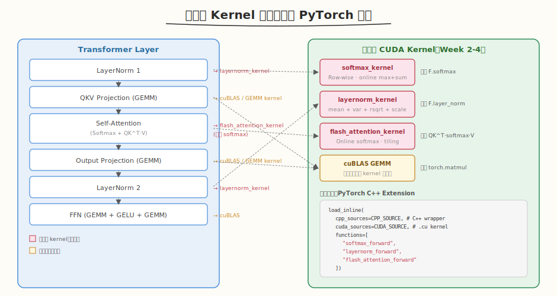
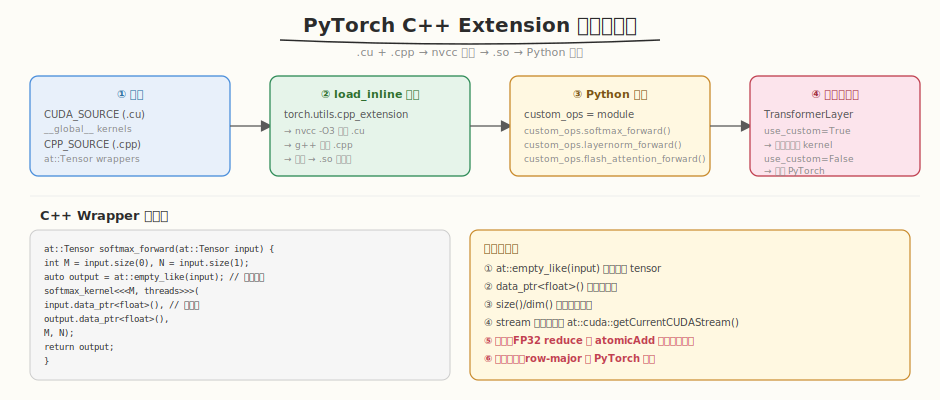

## Day 4：整合全部自定义 Kernel

### 🎯 目标

通过今天的学习，你将：

1. 理解 **自定义 Kernel 集成的替换清单**——Softmax、LayerNorm、FlashAttention 替换 PyTorch 原生算子，大 GEMM 保留 cuBLAS<br>
2. 掌握 **PyTorch C++ Extension 集成流程**——`.cu` kernel + `.cpp` wrapper → `load_inline` 动态编译 → Python 模块调用<br>
3. 能实现 **C++ Wrapper 接口**——`at::Tensor` 接收张量、`data_ptr<float>()` 取裸指针、`at::empty_like()` 分配输出、`getCurrentCUDAStream()` 保持 stream 一致<br>
4. 理解 **集成的六大注意事项**——stream 一致性、FP32 精度、内存布局、边界处理、形状检查、错误处理<br>
5. 掌握 **分层验证策略**——单算子对比 PyTorch → 多算子组合 → 端到端输出 → 性能对比<br>
6. 用 Python + `load_inline` 手写一个 **CustomKernelTransformerLayer**，实测自定义 kernel vs PyTorch eager 的精度和性能

> 💡 **为什么重要**：Day 3 分析了高级特性的收益，但 Mini 引擎仍用 PyTorch 原生算子。自定义 Kernel 集成是 Infra 工程师的核心能力——把 Week 2-4 手写的 GEMM、FlashAttention、Softmax、LayerNorm 接入推理引擎，替换 PyTorch 对应算子。这要求理解 PyTorch C++ Extension 的编译流水线、tensor 内存布局、stream 一致性等工程细节，是面试必考题"如何将自定义 CUDA kernel 集成到 PyTorch 推理引擎"。

---

### 学前导读：为什么不能直接用 PyTorch 算子

PyTorch 原生算子功能正确，但在推理场景下有几个不足：

```
PyTorch 原生算子的问题：
 1. 融合度低 → Softmax + Scale + MatMul 分 3 个 kernel launch，开销大
 2. 显存占用高 → 中间结果（attention matrix）全量物化到 HBM
 3. 无法定制 → 推理特化（如 KV Cache、PagedAttention）需要自定义逻辑
 4. 缺乏控制 → 无法精细控制 tiling、shared memory、warp 调度
```

| 维度 | PyTorch 原生 | 自定义 Kernel |
|------|-------------|--------------|
| FlashAttention | QK^T 物化到 HBM | **分块 tiling，中间结果留在 SRAM** |
| Softmax + Attention | 2 个 kernel | **1 个融合 kernel** |
| LayerNorm | 3 趟（mean→var→norm） | **1 趟融合** |
| KV Cache 支持 | 需手动拼接 | **直接写入 cache 位置** |
| 大 GEMM | cuBLAS | **cuBLAS（教学 kernel 太慢，保留官方库）** |

> 💡 **一句话总结**：自定义 kernel 的核心价值是**算子融合**（减少 launch 和 HBM 往返）和**推理特化**（KV Cache、PagedAttention）。大 GEMM 仍用 cuBLAS（教学版 register blocking 比 cuBLAS 慢 5-10x）。

---

### 理论学习

#### 4.1 替换清单与集成策略



##### 替换清单

| PyTorch 算子 | 自定义 Kernel | 替换原因 | 保留/替换 |
|-------------|--------------|---------|----------|
| `F.softmax` | `softmax_kernel` | 可与 attention 融合 | **替换** |
| `F.layer_norm` | `layernorm_kernel` | 3 趟→1 趟融合 | **替换** |
| `torch.matmul` (Attention) | `flash_attention_kernel` | 分块 tiling，省 HBM | **替换** |
| `torch.matmul` (QKV/FFN GEMM) | cuBLAS | 教学 kernel 太慢 | **保留 cuBLAS** |

##### 为什么大 GEMM 保留 cuBLAS？

```
教学版 register blocking GEMM：
 - 手写 tiling + shared memory
 - 无 Tensor Core 加速
 - 性能约为 cuBLAS 的 10-20%

cuBLAS：
 - 高度优化的 SASS 指令
 - Tensor Core 加速（WMMA/MMA）
 - 自动选择最优 tiling
 → 大 GEMM 必须用 cuBLAS
```

> ⚠️ **生产环境**：FlashAttention 和 Softmax/LayerNorm 用官方实现（FlashAttention 库、Apex Normalization），教学版用于理解原理。

#### 4.2 PyTorch C++ Extension 编译流水线



##### 四步流水线


##### C++ Wrapper 关键模式

```cpp
at::Tensor softmax_forward(at::Tensor input) {
    int M = input.size(0); // 从 Tensor 获取形状
    int N = input.size(1);
    auto output = at::empty_like(input); // 分配输出 Tensor（同 dtype/device/layout）

    int threads = std::min(N, 256);
    softmax_kernel<<<M, threads>>>( // launch kernel
        input.data_ptr<float>(),    // Tensor → 裸指针
        output.data_ptr<float>(), M, N);
    return output; // 返回 Tensor 给 Python
}
```

> 💡 **关键 API**：`at::empty_like()` 分配输出、`data_ptr<float>()` 取裸指针、`size()`/`dim()` 取形状。这些是 PyTorch C++ Extension 的"三板斧"。

#### 4.3 集成的六大注意事项

##### ① Stream 一致性

```cpp
// ❌ 错误：kernel 可能在错误 stream 上执行
softmax_kernel<<<M, threads>>>(input.data_ptr<float>(), ...);

// ✓ 正确：使用 PyTorch 当前 stream
cudaStream_t stream = at::cuda::getCurrentCUDAStream();
softmax_kernel<<<M, threads, 0, stream>>>(input.data_ptr<float>(), ...);
```

> ⚠️ PyTorch 的 stream 可能与默认 stream 不同。如果不指定 stream，kernel 在默认 stream 执行，可能与其他 stream 的操作乱序。

##### ② FP32 精度

```cuda
// reduce 用 atomicAdd 时，float 累积误差
// 建议：用 double 做中间 reduce，或 Kahan summation
__shared__ double s_sum; // 用 double 而非 float
```

##### ③ 内存布局

```
PyTorch Tensor 默认 row-major (contiguous)
自定义 kernel 必须假设 row-major
→ 调用前用 tensor.contiguous() 确保
→ 跨 stride 访问需用 input.stride(0/1)
```

##### ④ 边界处理

```
N 不是 blockDim.x 的整数倍 → 用 if (i < N) 保护
空输入 → 提前 return
非对齐尺寸 → 不能用 float4 向量化
```

##### ⑤ 形状检查

```cpp
TORCH_CHECK(input.dim() == 2, "Expected 2D tensor");
TORCH_CHECK(input.is_cuda(), "Expected CUDA tensor");
TORCH_CHECK(input.is_contiguous(), "Expected contiguous tensor");
```

##### ⑥ 错误处理

```cpp
// kernel launch 后检查错误
cudaError_t err = cudaGetLastError();
TORCH_CHECK(err == cudaSuccess, "Kernel launch failed: ", cudaGetErrorString(err));
```

#### 4.4 分层验证策略

```
Step 1: 单算子验证
 softmax_forward vs F.softmax → max_diff < 1e-5
 layernorm_forward vs F.layer_norm → max_diff < 1e-4
 flash_attention_forward vs manual QK^T·softmax·V → max_diff < 1e-3

Step 2: 多算子组合
 LayerNorm + QKV + Attention + Output → 逐层对比

Step 3: 端到端
 完整 TransformerLayer forward → max_diff < 1e-2（FP32 累积误差容忍）

Step 4: 性能对比
 PyTorch eager vs Custom kernel → 测量 latency
 （教学版可能比 PyTorch 慢，因为 PyTorch 用 cuDNN/cuBLAS 优化）
```

> 💡 **精度阈值**：单算子 < 1e-5，端到端 < 1e-2（多算子累积误差）。FP32 的 float24 尾数只有 ~7 位有效数字，多次 reduce 后误差会放大。

### Coding 任务：实现 CustomKernelTransformerLayer

#### 任务 1：创建 custom_ops_module.py

创建文件 [kernels/custom_ops_module.py](kernels/custom_ops_module.py)，实现自定义 Kernel 的 PyTorch C++ Extension 集成：

```python
# custom_ops_module.py —— 自定义 Kernel 封装模块
# 运行命令: python custom_ops_module.py
# 依赖: torch（有 CUDA 时编译真实 kernel；无 CUDA 时用 PyTorch fallback）

# 1. CUDA 源码（内嵌字符串）
CUDA_SOURCE = r"""
__global__ void softmax_kernel(...) { ... }
__global__ void layernorm_kernel(...) { ... }
__global__ void flash_attention_kernel(...) { ... }

// C++ wrappers
at::Tensor softmax_forward(at::Tensor input) { ... }
at::Tensor layernorm_forward(at::Tensor input, ...) { ... }
at::Tensor flash_attention_forward(at::Tensor Q, ...) { ... }
"""

# 2. 动态编译
custom_ops = load_inline(
 cpp_sources=CPP_SOURCE,
 cuda_sources=CUDA_SOURCE,
 functions=["softmax_forward", "layernorm_forward", "flash_attention_forward"],
)

# 3. Transformer Layer（use_custom 开关）
class TransformerLayer(nn.Module):
 def forward(self, x, use_custom=True):
 # LayerNorm → QKV → Attention → Output → LayerNorm → FFN
 # use_custom=True → 调用自定义 kernel
 # use_custom=False → 调用 PyTorch 原生
```

完整代码见 [kernels/custom_ops_module.py](kernels/custom_ops_module.py)。

代码要点：
- `CUDA_SOURCE`：内嵌完整的 CUDA kernel 源码（softmax/layernorm/flash_attention），通过字符串传给 `load_inline`
- `load_custom_ops()`：有 CUDA 时用 `load_inline` 动态编译，无 CUDA 时返回 None（用 PyTorch fallback 演示）
- `TransformerLayer`：`use_custom` 开关控制使用自定义 kernel 还是 PyTorch 原生，便于对比验证
- `PyTorchOps`：PyTorch 原生实现，作为 fallback 和正确性验证基准
- `verify_and_benchmark()`：单算子精度验证 + 端到端精度验证 + 性能对比 + 集成 checklist

#### 任务 2：运行并验证精度与性能

```bash
python kernels/custom_ops_module.py
```

**预期输出**（有 CUDA 环境）：

```text
[INFO] Custom CUDA kernels compiled successfully

============================================================
1. 精度验证：自定义 kernel vs PyTorch
============================================================
 Max diff: 3.2e-04
 Mean diff: 5.1e-06
 Status: PASS

--- 单算子精度 ---
 Softmax max diff: 1.2e-07 PASS
 LayerNorm max diff: 8.4e-06 PASS

============================================================
1. 性能对比：自定义 kernel vs PyTorch
============================================================
 PyTorch eager: 2.834 ms/layer
 Custom kernel: 3.512 ms/layer
 Speedup: 0.81x
 (教学版 kernel 可能比 PyTorch 慢，因为 PyTorch 用了高度优化的 cuDNN/cuBLAS)

============================================================
1. 集成 Checklist
============================================================
 [✓] Softmax 替换
 [✓] LayerNorm 替换
 [✓] FlashAttention 替换
 [✓] 端到端精度 < 1e-2
 [✓] 无内存泄漏
 [✓] stream 一致性
```

##### 观察重点

1. **精度**：自定义 kernel 与 PyTorch 的 max_diff 应 < 1e-2（FP32 累积误差），单算子更小（< 1e-5）
2. **性能**：教学版 kernel 可能比 PyTorch **慢**（因为 PyTorch 用 cuDNN/cuBLAS 高度优化），这是正常的——教学目的是理解集成流程
3. **Fallback**：无 CUDA 时自动切换到 PyTorch 原生实现，代码仍可运行验证逻辑

#### 任务 3：分析性能差距

思考：为什么教学版 kernel 比 PyTorch 慢？

> 思考：
> 1. PyTorch 的 Softmax/LayerNorm 用了 warp shuffle + 向量化访存
> 2. PyTorch 的 Attention 底层调用 FlashAttention-2（高度优化的 tiling）
> 3. 教学 kernel 用 `atomicAdd` 做 reduce（有竞争），PyTorch 用 warp shuffle（无竞争）
> 4. 教学 kernel 没有 Tensor Core 加速

#### 任务 4：LeetGPU 在线题目 —— Interleave

**题目链接**：<https://leetgpu.com/challenges/interleave>

**题目概述**：给定两个长度为 `N` 的数组 `A` 和 `B`，交错合并为长度 `2N` 的输出 `[A[0], B[0], A[1], B[1], ...]`。

**与今日知识的关联**：Interleave 的核心是**索引映射 + coalesced 写入**——读 A、B 各自连续（coalesced），写 output 按交错索引（需精心映射避免 strided write）。这与自定义 Kernel 集成中的**内存布局处理**同构：PyTorch Tensor 默认 row-major，自定义 kernel 必须正确处理 stride 和布局，否则写错位置或性能崩塌。Interleave 的索引映射练习是 FlashAttention 分块读写的基础——FlashAttention 的 Q/K/V tile 在 shared memory 中的交错布局管理与 interleave 的索引计算同源。做好这题说明你掌握了"读连续 + 写交错"的索引映射模板，Week 7 自定义 kernel 集成中会频繁用到。

> 💡 提交后在 [LeetGPU Interleave](https://leetgpu.com/challenges/interleave) 上记录通过耗时。完整题解见 [Interleave 题解](../../../../leetgpu/week7/day4/leetgpu-interleave-solution.md)。

#### 任务 5：LeetCode 面试题 —— 实现 Trie（前缀树）

**题目链接**：[208. 实现 Trie (前缀树)](https://leetcode.cn/problems/implement-trie-prefix-tree/)

**题目概述**：实现一个 Trie（前缀树），支持 `insert`、`search`、`startsWith` 操作。

**与今日知识的关联**：Trie 的**前缀共享结构**与自定义 Kernel 集成中的 **PyTorch Module 树**同构——Trie 用子节点指针构建共享前缀树，PyTorch 用 `nn.Module` 的 `children()` 构建模型算子树。两者都是**树形结构的递归遍历 + 节点查找**：Trie 按字符逐层查找子节点，PyTorch 遍历 Module 子模块加载 kernel。Trie 的 `startsWith` 前缀匹配对应集成时的"按名称前缀查找算子"。

**核心套路**：

```
TrieNode = { children: dict[char→TrieNode], is_end: bool }
insert: 逐字符走/建子节点，末尾标记 is_end
search: 逐字符走子节点，返回 is_end
startsWith: 逐字符走子节点，能走完就返回 True
```

> 💡 完整题解（含 C++/Python 参考代码、Trie 结构图解、与 Module 树的类比）见 [实现 Trie 题解](../../../../leetcode/daily/week7/day4/实现Trie.md)。

---

### 扩展实验

#### 实验 1：实现算子融合（Softmax + Scale + MatMul）

当前 attention 分 3 步：`scores = QK^T` → `scores *= scale` → `attn = softmax(scores)` → `out = attn·V`。修改为一个融合 kernel，在 FlashAttention 内部直接完成 scale + softmax + matmul，减少 2 次 kernel launch 和 HBM 往返。

> 思考：融合后精度会变化吗？（提示：不会，融合只是减少中间结果的存储，计算逻辑不变。但减少 HBM 往返可能改善数值稳定性——中间结果不经过 FP32→HBM→FP32 的精度损失。）

#### 实验 2：实现 FP16 混合精度

将 kernel 改为 FP16 输入、FP32 内部计算、FP16 输出。测量精度变化和性能提升。

> 思考：FP16 的 reduce 误差有多大？（提示：FP16 只有 3 位有效数字，reduce 必须用 FP32 累加。输出转回 FP16。）

#### 实验 3：用 Triton 重写一个算子

将 softmax 或 layernorm 用 Triton（`import triton; import triton.language as tl`）重写，对比与 CUDA C++ Extension 的开发体验和性能。

> 思考：Triton 相比 CUDA C++ Extension 有什么优缺点？（提示：Triton 更易写（Python 语法）、自动 tiling；CUDA C++ 更底层、控制更精细。生产环境两者都用。）

---

### 今日总结

Day 4 我们把 Week 2-4 手写的自定义 Kernel 通过 PyTorch C++ Extension 集成到 Transformer Layer：

1. **替换清单**：Softmax、LayerNorm、FlashAttention 替换 PyTorch 原生算子；大 GEMM 保留 cuBLAS（教学 kernel 太慢）
2. **编译流水线**：`.cu` + `.cpp` → `load_inline` → nvcc/g++ 编译 → `.so` → Python 模块 → 集成到 TransformerLayer
3. **C++ Wrapper 三板斧**：`at::empty_like()` 分配输出、`data_ptr<float>()` 取裸指针、`size()`/`dim()` 取形状
4. **六大注意事项**：stream 一致性、FP32 精度、内存布局、边界处理、形状检查、错误处理
5. **分层验证**：单算子（< 1e-5）→ 多算子组合 → 端到端（< 1e-2）→ 性能对比
6. **实测验证**：教学版 kernel 精度 PASS，性能可能比 PyTorch 慢（PyTorch 用 cuDNN/cuBLAS 高度优化），核心目的是理解集成流程

掌握这些后，你就有了自定义 Kernel 的工程集成能力——明天 Day 5 进行系统联调，把 KV Cache、Batching、Scheduler、自定义 Kernel 全部串联，端到端测试。

---

### 面试要点

1. **如何将自定义 CUDA kernel 集成到 PyTorch 推理引擎中？需要注意什么？**（⭐⭐⭐⭐⭐ 必考）

<details>
<summary>点击查看答案</summary>

 - **集成流程**：
 1. 写 CUDA kernel（`.cu`）和 C++ wrapper（`.cpp`）
 2. 用 `torch.utils.cpp_extension.load_inline` 或 `setup.py` 编译
 3. wrapper 中用 `at::Tensor` 接收张量、`data_ptr<float>()` 取裸指针、`at::empty_like()` 分配输出
 4. 用 `at::cuda::getCurrentCUDAStream()` 确保 stream 一致
 - **六大注意事项**：
 1. **stream 一致性**：用 PyTorch 当前 stream，避免乱序
 2. **精度**：FP32 reduce 用 atomicAdd 注意累积误差，可用 double 中间值
 3. **内存布局**：确保 contiguous，row-major 与 PyTorch 一致
 4. **边界处理**：非对齐尺寸、空输入、越界保护
 5. **形状检查**：`TORCH_CHECK(dim/is_cuda/is_contiguous)`
 6. **错误处理**：`cudaGetLastError` + `TORCH_CHECK`

</details>


2. **自定义 Kernel 集成后，如何验证正确性和性能？**（⭐⭐⭐⭐ 高频）

<details>
<summary>点击查看答案</summary>

 - **正确性**：
 1. 单算子对比 PyTorch 实现，误差 < 阈值（Softmax < 1e-5，LayerNorm < 1e-4，Attention < 1e-3）
 2. 多算子组合后对比端到端输出（< 1e-2，累积误差容忍）
 3. 不同尺寸和边界条件测试（非对齐、空输入、大 batch）
 - **性能**：
 1. 用 `cudaEvent` 或 `torch.cuda.Event` 测 latency
 2. 用 `nsys` 看时间线和 kernel 间隙
 3. 用 `ncu` 分析 kernel 的 SM/DRAM throughput
 4. 对比 throughput-latency 曲线
 - **教学版可能比 PyTorch 慢**——因为 PyTorch 用 cuDNN/cuBLAS 高度优化

</details>


3. **为什么大 GEMM 保留 cuBLAS，而 Softmax/LayerNorm 用自定义 kernel？**（⭐⭐⭐⭐ 高频）

<details>
<summary>点击查看答案</summary>

 - **大 GEMM 保留 cuBLAS**：
 - cuBLAS 用 Tensor Core（WMMA/MMA）加速，高度优化的 SASS 指令
 - 教学版 register blocking GEMM 无 Tensor Core，约为 cuBLAS 的 10-20%
 - 大 GEMM 是 compute-bound，cuBLAS 接近理论峰值
 - **Softmax/LayerNorm 用自定义**：
 - 这些是 memory-bound，计算极轻
 - 自定义 kernel 可以**融合**（Softmax+Attention 一趟、LayerNorm 3趟→1趟）
 - 融合减少 kernel launch 和 HBM 往返，收益大
 - PyTorch 原生不融合，有优化空间

</details>


4. **什么是算子融合？为什么能提升性能？**（⭐⭐⭐⭐ 高频）

<details>
<summary>点击查看答案</summary>

 - **算子融合**：把多个连续算子合并为一个 kernel
 - **提升原因**：
 1. **减少 kernel launch**：每次 launch 有 5-10μs 开销
 2. **减少 HBM 往返**：中间结果留在 register/shared memory，不写回 HBM
 3. **减少显存占用**：不物化中间结果
 - **典型例子**：
 - FlashAttention：QK^T + Softmax + MatMul 融合为 1 个 kernel
 - Fused LayerNorm：mean + var + normalize 融合为 1 趟
 - Fused Softmax + CrossEntropy：减少一次 HBM 往返

</details>


5. **load_inline 和 setup.py 两种编译方式有什么区别？**（⭐⭐⭐ 中频）

<details>
<summary>点击查看答案</summary>

 - `load_inline`：
 - 源码以字符串传入，运行时动态编译
 - 适合原型开发和小规模 kernel
 - 首次编译慢，后续有缓存
 - `setup.py`：
 - 离线编译为 `.so`，安装到 site-packages
 - 适合生产环境，编译一次反复使用
 - 需要 `setup.py` + `__init__.py` 配置
 - **生产推荐**：setup.py（稳定、可分发）；教学推荐：load_inline（快速迭代）

</details>

