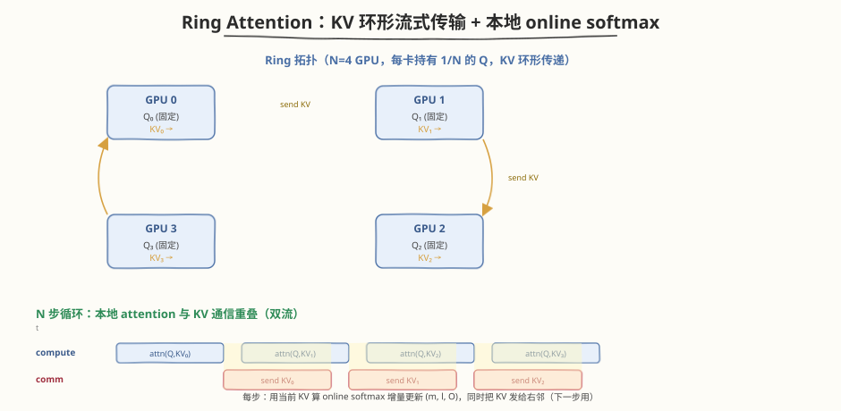

## Day 4b：Ring Attention —— 长上下文分布式注意力

### 🎯 目标

通过今天的学习，你将：

1. 理解**长上下文的显存墙**——百万 token context 下 KV Cache 显存压力线性膨胀（$O(Nd)$），单卡放不下，标准 FlashAttention 仍需在单卡 SRAM/HBM 内持有全量 KV<br>
2. 掌握 **Ring Attention 原理**——KV 跨 GPU 流式传输，每个 GPU 持有一部分 Q，KV 在 GPU 间环形传递，本地 attention 计算与通信重叠<br>
3. 理解**与 FlashAttention 的关系**——Ring Attention = FlashAttention + 分布式 KV 传输，**online softmax 天然支持跨 GPU 合并**（每块 KV 算完增量更新 $(m, l, O)$，无需物化全局 attention matrix）<br>
4. 掌握 **Ring Attention 实现细节**——NCCL `send/recv` 通信、双流重叠（compute stream + comm stream）、load balancing（按 Q 长度均衡切分）<br>
5. 学会**量化 Ring Attention 的收益**——KV buffer 峰值显存降至 $1/N$、通信与计算重叠把总时间从 $T_c + T_{comm}$ 降到 $\max(T_c, T_{comm}) \times N$ 步<br>
6. 用 Python + numpy 手写 **单机 Ring Attention 模拟器**（N=4 GPU 环形 KV 传递 + online softmax 增量合并），实测与标准 attention 数值一致

> 💡 **为什么重要**：Day 4 整合了自定义 Kernel（FlashAttention 等），但默认假设"KV Cache 能放进单卡"。当上下文长到百万 token（如长文档、长对话、RAG 拼接），KV Cache 显存会爆炸——70B 模型 1M token 的 KV Cache 单卡就要上百 GB，单卡必然 OOM。Ring Attention 是把"放不下"的 KV 切到多卡环形流式传输的标配方案（Lucasz 2023 论文后被 FlashAttention-3 / vLLM / Megatron-LM 集成）。它本质上是把 FlashAttention 的"分块扫描 + online softmax"从单卡 SRAM 内部扩展到多卡互联——这是面试"长上下文分布式注意力"的高频考点，也是 Day 3b TP/PP/DP 之外的第四种分布式并行维度。

---

### 学前导读：长上下文为什么撞墙

Day 4 集成的 FlashAttention 解决了"单卡内 attention 中间矩阵 $O(N^2)$ 显存爆炸"，但留下了另一个问题：**KV Cache 本身随上下文线性增长**，长到一定程度单卡就放不下。

```
KV Cache 显存估算（FP16，2(K+V) × n_layer × n_head × d_head × seq_len × batch × 2B）：
  Llama-7B  (32层, h=32, dh=128)  1M token, B=1 → 2×32×32×128×2B×1e6 ≈ 524 GB   （单卡 OOM）
  Llama-70B (80层, h=64, dh=128)  1M token, B=1 → 2×80×64×128×2B×1e6 ≈ 2.6 TB   （单卡 OOM）
  Llama-70B                       1M token, B=8 → 2.6 TB × 8 ≈ 21 TB            （多卡也吃紧）
  → 百万 token + 多请求并发，KV Cache 远超单卡 80GB
```

| 上下文长度 | KV Cache / 卡（7B, B=1） | 单卡能否放下 | 方案 |
|-----------|--------------------------|-------------|------|
| 32K | ~17 GB | ✅ 轻松 | 标准 FlashAttention |
| 128K | ~69 GB | ⚠️ 紧张 | FlashAttention + PagedAttention |
| 1M | ~524 GB | ❌ OOM | **Ring Attention**（KV 切多卡） |
| 1M + B=8 | ~4.2 TB | ❌ OOM | **Ring Attention**（必须） |

> 💡 **一句话总结**：FlashAttention 解决"attention 中间矩阵 $O(N^2)$"，Ring Attention 解决"KV Cache $O(Nd)$ 放不下"——两者叠加才能撑百万 token 长上下文。

---

### 理论学习

#### 4b.1 长上下文挑战

##### KV Cache 显存压力

Attention 的核心计算是 $O = \text{softmax}(QK^T / \sqrt{d}) V$。推理时 Q 随 query 变化，但 K/V 是**历史 token 的缓存**（KV Cache），随序列长度 $N$ 线性增长：

$$
\text{KV Cache 显存} = 2 \times n_{\text{layer}} \times n_{\text{head}} \times d_{\text{head}} \times N \times B \times \text{bytes}
$$

百万 token（$N=10^6$）下，单层 KV Cache 就可达几十 GB，**单卡 HBM（80GB）放不下**整个模型的 KV。

##### 标准 FlashAttention 仍是"单卡内"优化

FlashAttention（Day 4）用**分块 tiling + online softmax**把 attention 中间矩阵 $N \times N$ 从 HBM 移到 SRAM，避免 $O(N^2)$ 显存。但它假设**所有 Q, K, V 都在同一张卡上**：

```
FlashAttention 的隐性前提：
  - Q, K, V 全部在单卡 HBM
  - 分块在单卡 SRAM 内扫描
  - 单卡 HBM 必须装得下全部 KV
```

当 KV 超过单卡 HBM 时，FlashAttention 也无能为力——需要**跨卡分布 KV**，这就是 Ring Attention 的动机。

> ⚠️ **常见误解**："FlashAttention 已经解决了长上下文显存问题"。错——它解决的是 attention **中间结果**的 $O(N^2)$，不是 **KV Cache** 的 $O(Nd)$。后者随 $N$ 线性增长，百万 token 时单卡仍放不下。

#### 4b.2 Ring Attention 原理



Ring Attention 的核心思想：**把 Q 和 KV 沿 sequence 维切分到 N 张 GPU，KV 块在 GPU 间环形传递，每张 GPU 用本地 Q + 当前到达的 KV 块做局部 attention，online softmax 增量合并结果**。

##### 数据切分与环形传递

```
切分：Q, K, V 沿 sequence 维均分到 N 张 GPU
  GPU 0 持有 Q₀, K₀, V₀  （Q₀ 固定不动，KV₀ 每步传给右邻）
  GPU 1 持有 Q₁, K₁, V₁
  GPU 2 持有 Q₂, K₂, V₂
  GPU 3 持有 Q₃, K₃, V₃

环形传递（每步）：
  GPU i 把当前持有的 KV 块 send 给 GPU (i+1) % N
  GPU i 从 GPU (i-1) % N recv 新的 KV 块
  → N 步后，每张 GPU 都"看过"全部 N 个 KV 块
```

##### 本地 attention + online softmax 增量合并

每张 GPU 维护一个**在线 softmax 状态** $(m, l, O)$（同 FlashAttention），每收到一个 KV 块就增量更新：

$$
\begin{aligned}
m_{\text{new}} &= \max(m_{\text{old}},\ \max(S_{\text{block}})) \\
\alpha &= \exp(m_{\text{old}} - m_{\text{new}}) \\
l_{\text{new}} &= l_{\text{old}} \cdot \alpha + \sum_j \exp(S_{\text{block},j} - m_{\text{new}}) \\
O_{\text{new}} &= O_{\text{old}} \cdot \alpha + \sum_j \exp(S_{\text{block},j} - m_{\text{new}}) \cdot V_{\text{block},j}
\end{aligned}
$$

其中 $S_{\text{block}} = Q_{\text{local}} \cdot K_{\text{block}}^T / \sqrt{d}$。N 步后 $O / l$ 即为完整 attention 输出。

> 💡 **关键洞察**：online softmax 的"增量累加 + 末尾归一化"特性，使得**每个 KV 块的 attention 可以独立计算再合并**，无需看到全局 softmax 分母。这正是 Ring Attention 能跨 GPU 流式合并的数学基础。

#### 4b.3 与 FlashAttention 的关系


Ring Attention 与 FlashAttention 的关系可以用一句话概括：

> **Ring Attention = FlashAttention + 分布式 KV 传输**

| 维度 | FlashAttention | Ring Attention |
|------|---------------|----------------|
| 分块扫描 | 单卡 SRAM 内扫描 KV tile | 多卡环形传输 KV block，每卡扫一个 block |
| online softmax | $(m, l, O)$ 在单卡内更新 | $(m, l, O)$ 在每卡内跨 block 更新（**同样的数学**） |
| KV 存放 | 单卡 HBM | 分布式：每卡只持 $1/N$，环形轮转 |
| 通信 | 无（单卡） | NCCL `send/recv` 环形传 KV |
| 解决的瓶颈 | attention 中间矩阵 $O(N^2)$ | KV Cache $O(Nd)$ 放不下 |
| 适用场景 | 单卡能放下全量 KV | 单卡放不下 KV（长上下文） |

##### 为什么 online softmax 天然支持跨 GPU 合并

FlashAttention 的 online softmax 把"全局 softmax"拆成"每块算局部 exp + 增量更新 $m, l$"，**每块的贡献可独立累加**。Ring Attention 把这个"块"从单卡 SRAM 内的 tile，扩展到多卡间的 KV block——**数学完全相同**，只是块的粒度从"SRAM tile"变成"GPU 持有的 KV shard"。

```
FlashAttention：Q 在单卡，扫 N 个 SRAM tile 的 KV  → 每块更新 (m, l, O)
Ring Attention：Q 在本卡，扫 N 个跨 GPU 的 KV block → 每块更新 (m, l, O)
                  ↑ 数学完全相同，只是"块"的粒度不同 ↑
```

> 💡 **一句话总结**：Ring Attention 不是新算法，而是把 FlashAttention 的"分块 + online softmax"从单卡扩展到多卡——SRAM tile → GPU shard，同样的增量合并公式。

#### 4b.4 实现细节

##### NCCL send/recv 通信

Ring Attention 用 NCCL 的**点对点通信**（不是 collectives）实现环形传递：

```python
# 每步：GPU i 把当前 KV 发给右邻 (i+1)%N，同时从左邻 (i-1)%N 收新 KV
# 用 nccl.send / nccl.recv（需要 send/recv 配对，否则死锁）
k_send, v_send = cur_k, cur_v           # 要发出的 KV
k_recv = torch.empty_like(k_send)
v_recv = torch.empty_like(v_send)

# 双缓冲：send 和 recv 并行（避免 send 等 recv 的死锁）
req_k = dist.isend(k_send, dst=(rank+1) % N)
req_v = dist.isend(v_send, dst=(rank+1) % N)
dist.recv(k_recv, src=(rank-1) % N)
dist.recv(v_recv, src=(rank-1) % N)
req_k.wait(); req_v.wait()
cur_k, cur_v = k_recv, v_recv
```

##### 双流重叠（compute stream + comm stream）

参考 Day 3b 的通信-计算重叠，Ring Attention 把"用当前 KV 算 attention"和"把当前 KV 发给右邻"放到两个 stream 并发：

| Stream | 每步做的事 |
|--------|-----------|
| **compute_stream** | $S = Q \cdot K_{\text{cur}}^T$，online softmax 更新 $(m, l, O)$ |
| **comm_stream** | `isend(K_cur, V_cur)` 给右邻，`recv` 左邻的下一块 KV |

```
串行：  |attn KV0|send KV0|attn KV1|send KV1| ...   total = (Tc+Ta) × N
重叠：  |attn KV0|attn KV1|attn KV2| ...             total ≈ max(Tc,Ta) × N
        ........|send KV0|send KV1|send KV2| ..
        （compute 用 KV[t]，同时 comm 发 KV[t] 给右邻，右邻下一步用）
```

> ⚠️ **重叠前提**：compute 用的 KV 与 comm 发送的 KV **是同一份只读数据**（compute 读、comm 发，无写冲突），所以可安全并发。多卡场景下通信走 NVLink/IB 独立硬件，与计算 SM 完全解耦，重叠效果远好于单卡双流。

##### Load Balancing

理想情况下每卡持有等长的 Q shard（compute 均衡）和等长的 KV shard（comm 均衡）。但实际场景（变长请求拼接、causal mask 导致下三角不均匀）需要**按 Q 长度均衡切分**：

- **均衡切分**：按每卡 Q 行数相等切，保证 compute 均衡
- **causal mask 处理**：下三角 mask 使得前面的 Q 行计算量更大（要 attend 更多 KV），需用斜对角切分（striped partitioning）让每卡总计算量均衡
- **通信均衡**：KV shard 等大则 comm 均衡；变长时按 KV token 数切分

> 💡 **生产实现**：Megatron-LM 的 `ring_attention` 支持变长序列的均衡切分；FlashAttention-3 在 H100 上用 TMA + async copy 实现更高效的重叠。完整实现远比本 Day 的模拟复杂，但核心数学（online softmax 跨块合并）不变。

### Coding 任务：单机模拟 Ring Attention

#### 任务 1：创建 ring_attention_sim.py

创建文件 [kernels/ring_attention_sim.py](https://github.com/hzchenxiaobin/ai-infra-notes/blob/main/aiinfra/daily/week7/day4b/kernels/ring_attention_sim.py)，用 numpy 单机模拟 N=4 GPU 的 Ring Attention（无需真实多卡 / GPU）：

```python
# ring_attention_sim.py —— 单机模拟 Ring Attention（N GPU 环形 KV 传输 + online softmax）
# 运行命令: python ring_attention_sim.py
# 依赖: numpy（无需 GPU / torch，纯 CPU 模拟分布式逻辑）

def online_softmax_update(m_old, l_old, o_old, s_block, v_block):
    m_block = s_block.max(axis=-1)
    m_new = np.maximum(m_old, m_block)
    alpha = np.exp(m_old - m_new)[:, None]
    beta = np.exp(s_block - m_new[:, None])
    l_new = l_old * alpha[:, 0] + beta.sum(axis=-1)
    o_new = o_old * alpha + beta @ v_block
    return m_new, l_new, o_new

def ring_attention(Q, K, V, n=N_GPUS, log=False):
    q_shards = np.array_split(Q, n, axis=0)    # 每卡持 1/N 的 Q（固定）
    k_shards = np.array_split(K, n, axis=0)    # 每卡持 1/N 的 KV（环形轮转）
    v_shards = np.array_split(V, n, axis=0)
    states = [(np.full((q.shape[0],), -np.inf),
               np.zeros(q.shape[0]),
               np.zeros((q.shape[0], D))) for q in q_shards]
    cur_k, cur_v = list(k_shards), list(v_shards)

    for step in range(n):                      # N 步环形轮转
        for i in range(n):                     # 每卡本地算 attn
            q = q_shards[i]
            s = (q @ cur_k[i].T) * SCALE
            m, l, o = states[i]
            states[i] = online_softmax_update(m, l, o, s, cur_v[i])
        # ring comm: GPU i 的新 KV = GPU (i-1) 的旧 KV
        cur_k = [cur_k[(i - 1) % n] for i in range(n)]
        cur_v = [cur_v[(i - 1) % n] for i in range(n)]

    outs = [states[i][2] / states[i][1][:, None] for i in range(n)]
    return np.concatenate(outs, axis=0)
```

完整代码见 [kernels/ring_attention_sim.py](https://github.com/hzchenxiaobin/ai-infra-notes/blob/main/aiinfra/daily/week7/day4b/kernels/ring_attention_sim.py)。

代码要点：
- **数据切分**：`np.array_split` 沿 sequence 维把 Q/K/V 均分到 N=4 个"GPU"
- **online softmax**：`online_softmax_update` 实现 $(m, l, O)$ 三元组增量更新，与 FlashAttention 公式一致
- **环形通信**：每步 `cur_k = [cur_k[(i-1)%n] ...]` 模拟"GPU i 收到左邻的 KV"（等价于 GPU i 发给右邻 (i+1)%N）
- **正确性校验**：与 `standard_attention`（全量 Q@K^T softmax @V）逐元素比对 `max_diff`

#### 任务 2：运行并对比 standard vs ring

```bash
python kernels/ring_attention_sim.py
```

**预期输出**（节选，数值固定因 seed=42）：

```text
==============================================================
  Ring Attention 单机模拟（N=4 GPU）
==============================================================
  seq=16, d=8, scale=0.3536, N_GPUS=4

[1] standard attention（全部在一张卡上）:
    output[0, :3] = [0.3300225  0.29101914 0.25489855]

[2] ring attention（KV 环形传输 + online softmax 增量合并）:
    step 0 GPU0: 用 KV0 本地算 attn → 更新 (m,l,O)
  step 0 完成: 各卡把 KV 发给右邻 (i+1)%4
    step 1 GPU0: 用 KV3 本地算 attn → 更新 (m,l,O)
  ...
    output[0, :3] = [0.33002249 0.29101917 0.25489856]

[3] 正确性校验:
    max|ref - ring| = 1.888e-07
    结果: PASS ✅

[4] 显存与通信分析:
    全量 KV = 1024 B, 每块 KV = 1024/4 = 256 B
    Ring 每卡峰值 KV buffer = 1 块 = 256 B（流式轮转，只留当前块）
    朴素(全量 gather)每卡 KV buffer = 1024 B → Ring 省 75%
    → 核心收益: KV buffer 显存省 (N-1)/N + comm/compute 重叠, 而非总通信量减少

[5] compute / comm 重叠示意（双流）:
    compute: |attn KV0|attn KV1|attn KV2|attn KV3|
    comm:    ........|send KV0|send KV1|send KV2|..
    重叠后:  total ≈ max(T_compute, T_comm) × N 步
```

##### 观察重点

1. **正确性 PASS**：`max_diff = 1.888e-07`（FP32 浮点误差量级），证明环形 N 步 online softmax 合并等价于一次性全量 attention
2. **KV 轮转路径**：GPU0 依次用 KV0 → KV3 → KV2 → KV1（每步从左邻收到新块），N 步后看完全部
3. **显存省 75%**：Ring 每卡峰值 KV buffer = 256 B vs 朴素 1024 B，省 $(N-1)/N = 75\%$
4. **通信量未减**：总通信量与"全量 gather"相同（≈ $N \times KV$），但 Ring 切成分块与计算重叠，且每卡峰值 buffer 更小

> 思考：为什么 Ring Attention 的总通信量并不比"全量 gather KV 到每卡"少，却仍是大长上下文的首选？（提示：核心收益不在总通信量，而在①每卡峰值 KV buffer 降至 $1/N$（显存），②通信切成分块与计算重叠（延迟隐藏），③无需先 gather 再计算，可流式启动。）

#### 任务 3：验证 / 分析

修改 `ring_attention_sim.py`，做以下验证：

1. **改 N=8**：把 `N_GPUS = 8`（确保 `SEQ % N == 0`），重跑正确性，确认 `max_diff` 仍 $< 10^{-5}$
2. **改 SEQ=64**：增大序列长度，观察 `max_diff` 是否仍稳定（online softmax 数值稳定性）
3. **数值稳定性**：把 `D=8` 改成 `D=64`（logit 更大），观察不带 `scale` 时的数值溢出，理解 `SCALE = D**-0.5` 的作用

```bash
# 改参数后重跑
python kernels/ring_attention_sim.py
```

> 思考：N=8 时 max_diff 会变大还是变小？（提示：浮点累加次数翻倍，误差略增但仍 $< 10^{-5}$。online softmax 的 $m$ rescale 保证了每步 exp 的最大值有界，数值稳定。）

#### 任务 4：LeetGPU 在线题目 —— Softmax Attention

**题目链接**：<https://leetgpu.com/challenges/softmax-attention>

**与今日知识的关联**：Ring Attention 的每一步本地计算，就是一道标准的 **Softmax Attention**——给定 Q, K, V，算 $\text{softmax}(QK^T/\sqrt{d})V$。Ring Attention 把这个 kernel 在 N 步里重复 N 次（每次用不同的 KV block），靠 online softmax 把 N 次的结果增量合并。换言之，**Ring Attention = N 次本地 Softmax Attention + online softmax 跨块合并**。把这道题做透（手写融合的 softmax + matmul kernel，避免物化 $N \times N$ attention matrix），你就掌握了 Ring Attention 每一步本地 kernel 的优化要点——分块 tiling、shared memory 复用、online softmax。这正是 Day 4 FlashAttention 集成时强调的"算子融合"在分布式场景的延伸。

> 💡 提交后在 [LeetGPU Softmax Attention](https://leetgpu.com/challenges/softmax-attention) 上记录通过耗时。完整题解见 [Softmax Attention 题解](https://hzchenxiaobin.github.io/leetgpu/leetgpu-softmax-attention-solution.html)。

#### 任务 5：LeetCode 面试题（8 周计划 · 第 7 周 补充）

> 📅 今日为 Ring Attention 长上下文专题补充日，LeetCode 从 [8 周算法面试刷题计划](https://hzchenxiaobin.github.io/leetcode/problems/8-week-plan.html) 第 7 周「二分查找与动态规划基础」中精选 4 道高频题（二分变种 + 一维 DP + 字符串 DP），巩固本周算法基础。简单题快速过、中等题精做；卡壳 20 分钟就看题解，看懂后自己默写一遍。

| 题目 | 难度 | 核心套路 | 题解 |
|------|------|----------|------|
| [74. 搜索二维矩阵](https://leetcode.cn/problems/search-a-2d-matrix/) | 中等 | 二分（二维展平为一维，$O(\log mn)$） | [题解](https://hzchenxiaobin.github.io/leetcode/problems/74_搜索二维矩阵.html) |
| [33. 搜索旋转排序数组](https://leetcode.cn/problems/search-in-rotated-sorted-array/) | 中等 | 旋转数组二分（判断哪半有序） | [题解](https://hzchenxiaobin.github.io/leetcode/problems/33_搜索旋转排序数组.html) |
| [70. 爬楼梯](https://leetcode.cn/problems/climbing-stairs/) | 简单 | 一维 DP（$f(n)=f(n-1)+f(n-2)$） | [题解](https://hzchenxiaobin.github.io/leetcode/problems/70_爬楼梯.html) |
| [139. 单词拆分](https://leetcode.cn/problems/word-break/) | 中等 | 字符串 DP（$dp[i]=$ 前 i 个字符可拆分） | [题解](https://hzchenxiaobin.github.io/leetcode/problems/139_单词拆分.html) |

> 💡 刷题建议：74 把二维坐标映射成一维index（`mid -> [mid//n, mid%n]`）即可套标准二分模板；33 是旋转数组二分经典题，关键判断"哪半边有序"再决定往哪缩；70 是 DP 入门，5 分钟默写，注意初始值 $f(0)=1, f(1)=1$；139 是字符串 DP，用集合存字典做 $O(n^2)$ 转移，理解"dp[i] 依赖于 dp[j] && s[j:i] in dict"。

---

### 扩展实验

#### 实验 1：把 N 改成 2 和 8，对比 max_diff 与显存收益

修改 `N_GPUS` 为 2 和 8（同步调整 `SEQ` 为 8 的倍数），重跑正确性测试。记录 `max_diff` 与"KV buffer 节省比例"，绘制"N vs max_diff"和"N vs 显存节省"曲线。

> 思考：N 增大时显存节省趋于多少？（提示：节省比例 = $(N-1)/N$，$N \to \infty$ 时趋近 100%，但通信步数也线性增长，实际 N 受拓扑限制通常 4-8。）

#### 实验 2：实现 causal mask 的 Ring Attention

长上下文推理通常是 **causal attention**（下三角 mask）。修改 `ring_attention`，在算 $S = Q \cdot K^T$ 后应用 causal mask（$S_{ij} = -\infty$ if $j > i$）。注意：Q 和 K 在不同卡上时，全局 index 需要偏移（Q 行的全局 index = `q_start + i`，KV 列的全局 index = `kv_start + j`）。

> 思考：causal mask 下，前面的 Q 行要 attend 更多 KV block，后面的 Q 行只需 attend 少数 block——如何切分 Q 才能让每卡 compute 均衡？（提示：striped partitioning，把 Q 行交错分配，让每卡的总 attend KV 数相近。）

#### 实验 3：用 torch.distributed 真实多卡跑 Ring Attention

若有 2+ GPU，把 numpy 模拟替换为 `torch.distributed` + NCCL：用 `dist.isend/irecv` 实现环形 KV 传递，双 `torch.cuda.Stream` 重叠 compute/comm。用 `torchrun --nproc_per_node=4 ring_attention_dist.py` 启动。用 nsys 验证 compute_stream 和 comm_stream 的 kernel 是否真的在时间轴上重叠。

> 思考：真实多卡下重叠效果为什么远好于单卡双流？（提示：通信走 NVLink/IB 独立硬件，与计算 SM 完全解耦；单卡双流共享 SM，大 GEMM 占满时通信 kernel 被迫排队。参考 Day 3b 通信-计算重叠实验。）

---

### 今日总结

Day 4b 我们学习了长上下文分布式注意力的核心方案 Ring Attention：

1. **长上下文显存墙**：百万 token 下 KV Cache 显存 $O(Nd)$ 线性膨胀，单卡放不下；FlashAttention 只解决 attention 中间矩阵 $O(N^2)$，不解决 KV Cache 放不下
2. **Ring Attention 原理**：Q 与 KV 沿 sequence 维切到 N 卡，KV 在 GPU 间环形传递，每卡用本地 Q + 当前 KV 块做局部 attention，N 步后看完全部 KV
3. **与 FlashAttention 的关系**：Ring Attention = FlashAttention + 分布式 KV 传输；online softmax 的"增量累加 + 末尾归一化"天然支持跨 GPU 合并，块粒度从 SRAM tile 扩展到 GPU shard
4. **实现细节**：NCCL `send/recv` 点对点通信（非 collectives）实现环形传递；双流重叠（compute stream 算 attention + comm stream 发 KV）；load balancing 按 Q/KV 长度均衡切分
5. **核心收益**：KV buffer 峰值显存降至 $1/N$（省 $(N-1)/N$）、通信与计算重叠把总时间从 $(T_c+T_{comm}) \times N$ 降到 $\max(T_c, T_{comm}) \times N$；总通信量不减，靠重叠和流式 buffer 取胜
6. **实测验证**：`ring_attention_sim.py` 量化 ring vs standard attention `max_diff = 1.9e-7`（PASS）、KV buffer 显存省 75%（N=4）

掌握这些后，你就有了长上下文分布式注意力的理论基础——后续可结合 Megatron-LM 的 `ring_attention` 实现和 FlashAttention-3 的 TMA + async copy 做真实多卡长上下文部署。

---

### 面试要点

1. **什么是 Ring Attention？为什么需要它？**（⭐⭐⭐⭐⭐ 必考）

<details>
<summary>点击查看答案</summary>

- **动机**：长上下文（百万 token）下 KV Cache 显存 $O(Nd)$ 单卡放不下，FlashAttention 只解决 attention 中间矩阵 $O(N^2)$，不解决 KV 放不下
- **原理**：Q 与 KV 沿 sequence 维切到 N 张 GPU，每卡持 $1/N$ 的 Q（固定）和 $1/N$ 的 KV（环形轮转）；每步 KV 块在 GPU 间环形传递（GPU i 发给 (i+1)%N），每卡用本地 Q + 当前 KV 块做局部 attention
- **合并机制**：online softmax 的 $(m, l, O)$ 增量更新，每收到一个 KV 块就更新一次，N 步后 $O/l$ 即完整 attention 输出
- **收益**：KV buffer 峰值显存降至 $1/N$（省 $(N-1)/N$）、通信与计算重叠
- **本质**：把 FlashAttention 的"分块扫描 + online softmax"从单卡 SRAM 扩展到多卡互联，块粒度从 SRAM tile 变成 GPU shard

</details>


2. **Ring Attention 和 FlashAttention 是什么关系？**（⭐⭐⭐⭐⭐ 必考）

<details>
<summary>点击查看答案</summary>

- **一句话**：Ring Attention = FlashAttention + 分布式 KV 传输
- **相同点**：
  - 都用 online softmax 的 $(m, l, O)$ 三元组增量更新，避免物化 $N \times N$ attention matrix
  - 都分块扫描 KV，每块算 $S = QK^T$ 后增量合并
- **不同点**：
  - FlashAttention：单卡内分块，KV tile 在 SRAM/HBM 间搬运，无跨 GPU 通信
  - Ring Attention：多卡间分块，KV block 在 GPU 间环形传递，用 NCCL send/recv
- **数学一致**：online softmax 的"每块独立累加 + 末尾归一化"使得块粒度可任意——SRAM tile 或 GPU shard 都行，这正是 Ring Attention 能跨 GPU 合并的数学基础
- **解决的瓶颈**：FlashAttention 解决 attention 中间矩阵 $O(N^2)$，Ring Attention 解决 KV Cache $O(Nd)$ 放不下

</details>


3. **online softmax 为什么能支持跨 GPU 合并？**（⭐⭐⭐⭐ 高频）

<details>
<summary>点击查看答案</summary>

- **核心性质**：online softmax 把"全局 softmax"拆成"每块算局部 exp + 增量更新 $m, l$"，**每块的贡献可独立累加**，无需先看到全局 softmax 分母
- **更新公式**（max 从 $m$ → $m_{\text{new}}$）：
  - $\alpha = \exp(m - m_{\text{new}})$（旧状态缩放因子）
  - $l = l \cdot \alpha + \sum_j \exp(s_j - m_{\text{new}})$
  - $O = O \cdot \alpha + \sum_j \exp(s_j - m_{\text{new}}) \cdot V_j$
- **跨 GPU 合并**：每个 GPU 独立维护一份 $(m, l, O)$，每收到一个 KV block 就用本地 $Q$ 算 $S$ 并更新——**N 步后每卡的 $(m, l, O)$ 等价于单卡扫完所有 KV 的结果**
- **数值稳定**：$m$ 一直在追踪全局最大值，每步 rescale 保证 exp 的输入有界，不会溢出
- **对比朴素方法**：朴素 attention 需要先算完全局 $S = QK^T$ 再做 softmax（必须看到所有 KV）；online softmax 把"看到所有 KV"拆成增量，天然支持流式

</details>


4. **Ring Attention 的通信怎么实现？如何与计算重叠？**（⭐⭐⭐⭐ 高频）

<details>
<summary>点击查看答案</summary>

- **通信实现**：NCCL 点对点 `send/recv`（不是 all-reduce 等 collectives）
  - 每步：GPU i `isend(KV, dst=(i+1)%N)` + `recv(KV, src=(i-1)%N)`
  - 用 `isend/irecv`（非阻塞）配合双缓冲，避免 send 等 recv 死锁
- **重叠实现**：双 CUDA Stream
  - `compute_stream`：用当前 KV 块算 $QK^T$ + online softmax 更新 $(m, l, O)$
  - `comm_stream`：把当前 KV 块 `isend` 给右邻 + `recv` 左邻的下一块
  - 两流并发：compute 读 KV[t]，comm 发 KV[t]（同一份只读数据，无冲突）
- **重叠前提**：
  1. compute 与 comm 操作的 KV 是同一份只读数据（无写冲突）
  2. 多卡场景通信走 NVLink/IB 独立硬件，与计算 SM 完全解耦（单卡双流共享 SM，重叠受限）
- **收益**：total 从 $(T_c + T_{\text{comm}}) \times N$ 降到 $\max(T_c, T_{\text{comm}}) \times N$
- **进阶**：H100 上用 TMA + async copy（FlashAttention-3）实现更细粒度的重叠，比 NCCL send/recv 更高效

</details>


5. **Ring Attention 的核心收益是什么？总通信量减少了吗？**（⭐⭐⭐ 中频）

<details>
<summary>点击查看答案</summary>

- **核心收益不是总通信量减少**，而是两点：
  1. **KV buffer 峰值显存降至 $1/N$**：每卡只需容纳 1 个 KV block（流式轮转），朴素 gather 需要全量 KV；省 $(N-1)/N$ 显存，是长上下文能放进多卡的关键
  2. **通信与计算重叠**：把全量通信切成 N 个小块，每块与本地 attention 并发，隐藏延迟
- **总通信量对比**：
  - Ring：每卡 N 步各发 1 块 KV（每块 $KV_{\text{total}}/N$），每卡总发 $KV_{\text{total}}$，N 卡共 $N \times KV_{\text{total}}$
  - 朴素 all-gather：每卡收全量 $KV_{\text{total}}$，N 卡共 $N \times KV_{\text{total}}$
  - **两者总通信量相同**，但 Ring 流式切分 + 重叠 + 小 buffer
- **类比**：像流水线 vs 批处理——总工作量一样，但流水线把每段切小并发，峰值资源占用低、延迟隐藏好
- **何时用 Ring Attention**：KV Cache 单卡放不下时（百万 token）；单卡能放下时用标准 FlashAttention 更简单（无通信开销）

</details>
