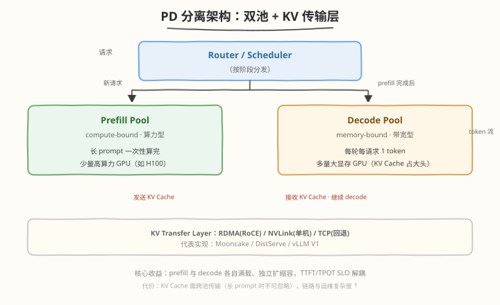

## Day 6：Prefill/Decode 分离推理（PD Disaggregated）

### 🎯 目标

通过今天的学习，你将：

1. 理解 **PD 分离的核心动机**——prefill（compute-bound）与 decode（memory-bound）的资源错配，TTFT/TPOT SLO 矛盾
2. 掌握 **Mooncake / DistServe / vLLM disaggregated** 的架构——KV 传输层、调度层、双池分离
3. 量化 **KV Cache 跨节点传输开销**——KV bytes/token × 序列长度 / RDMA 带宽
4. 通过模拟器对比 **colocated vs disaggregated** 的 TTFT/TPOT 改善，理解何时划算、何时不划算

> 💡 **为什么重要**：2024-2026 推理服务面试中，"PD 分离"几乎必问。它是 vLLM V1、Mooncake、DistServe 的核心架构，解决了长 prompt 与高并发 decode 的根本矛盾。理解 PD 分离 = 理解推理系统的资源调度本质。

---

### 学前导读：Day 5 Mini 引擎 v1 的"单机天花板"

Day 5 的 mini 引擎 v1 已经集成了 Continuous Batching + 优先级调度，单机表现不错。但它有三个绕不开的天花板——都源于"**prefill 和 decode 挤在同一块 GPU 上**"：

1. **互相干扰**：一个 32K 长 prompt 的 prefill 独占 GPU 数百 ms，期间所有在线用户的 decode 集体卡顿（TPOT 尖刺）——Day 3 的 chunked prefill 缓解了症状，但干扰仍在，只是被切小了
2. **无法各自扩容**：业务负载变化时，TTFT 恶化想加 prefill 算力、TPOT 恶化想加 decode 容量——colocated 下加卡是"一起加"，一半的钱花在不需要的资源上
3. **调度目标分裂**：scheduler 同一个循环里既要保 TTFT（prefill 优先）又要保 TPOT（decode 不被打断），两个 SLO 在同一个资源池里打架，怎么调参都顾此失彼

Day 1～5 的所有优化（continuous batching、chunked prefill、prefix caching）都是在"单机共享池"的前提下做精耕；今天换掉前提本身——**把 prefill 和 decode 拆到不同的 GPU 池**，让两种性质相反的负载各自独享资源。

| 维度 | Day 1～5（单机优化） | Day 6（跨机架构） |
|------|---------------------|------------------|
| 解决的问题 | 调度粒度、显存管理、重复计算 | 资源错配、SLO 矛盾 |
| 手段 | 更聪明的调度与缓存 | 物理隔离 + KV 跨节点传输 |
| 新代价 | 无（纯收益） | KV 传输开销 + 双池管理复杂度 |
| 适用规模 | 单机够用 | 多机集群、高 QPS |

> 💡 **一句话总结**：chunked prefill 是"合租时分时间表"，PD 分离是"直接分家各买各的房"——前者省成本，后者彻底解决干扰，但分家要付搬家费（KV 传输）。

---

### 1. 为什么分离？资源错配与 SLO 矛盾

#### 1.1 prefill vs decode 的资源画像

回顾 Day 1 与 Week3/Day1 的 Roofline 分析：

| 阶段 | 瓶颈 | 资源画像 | GPU 利用特征 |
|------|------|---------|------------|
| **Prefill** | compute-bound（大 GEMM，AI ≫ Ridge Point） | 吃算力，不吃带宽 | SM 利用率 60-85%，单次 forward 大块占用 GPU |
| **Decode** | memory-bound（M=1 GEMM，AI ≪ Ridge Point） | 吃带宽，不吃算力 | SM 利用率 10-30%，KV Cache 读取主导 |

**错配**：prefill 是"大块计算任务"，decode 是"小块访存任务"。两者混跑在同一 GPU 上：
- prefill 占用 SM 时，decode 的 slot 空等（compute-bound 任务不释放 SM）
- decode 请求多时，prefill 排队（memory-bound 任务占着 GPU 但 SM 闲置）

#### 1.2 TTFT / TPOT SLO 矛盾

| 指标 | 含义 | 受谁影响 |
|------|------|---------|
| **TTFT**（Time To First Token） | 首 token 延迟 | prefill 阶段（compute-bound） |
| **TPOT**（Time Per Output Token） | 每 token 延迟 | decode 阶段（memory-bound） |

**SLO 矛盾**：用户要 TTFT < 200ms（prefill 要快）+ TPOT < 50ms（decode 要稳）。但 colocated 下：
- 长 prompt 的 prefill 会阻塞 decode slot → TPOT 飙升
- 高并发 decode 会挤占 prefill 资源 → TTFT 排队

#### 1.3 用数字感受这个矛盾

拿一组典型参数算笔账（单卡 A100/H100 级别，LLaMA-7B）：

| 场景 | 计算 | 结果 |
|------|------|------|
| 一个 4K prompt 的 prefill | 4096 token ÷ ~3000 tok/s（compute-bound 时的 prefill 吞吐） | ~1.4 s 独占 |
| 这期间 decode 的 TPOT | 正常 20ms → 被 prefill 挤成 200ms+ | **10× 恶化** |
| 若 SLO 是 TPOT < 50ms | 一条长 prompt 进来就违约 | 调度器无解 |

这就是"调度器无解"的含义：资源就一块 GPU，prefill 占着的时候 decode 物理上没得跑——**不是调度算法不好，是资源模型错了**。chunked prefill 把 1.4s 切成 14 个 100ms 的块穿插进 decode，尖刺变小但依然存在；PD 分离让这个矛盾从根上消失。

> 💡 **一句话总结**：PD 分离不是"为了快"，而是"为了 SLO 解耦"——让 prefill 和 decode 各自追求自己的最优，互不干扰。

---

### 2. PD 分离架构：Mooncake / DistServe / vLLM V1

#### 2.1 核心架构：双池 + KV 传输层



| 组件 | 职责 | 代表实现 |
|------|------|---------|
| **Router/Scheduler** | 按阶段分发请求到对应池 | Mooncake Scheduler、vLLM V1 disaggregated scheduler |
| **Prefill Pool** | 专用处理 prefill（compute-bound） | 少量高算力 GPU（如 H100） |
| **Decode Pool** | 专用处理 decode（memory-bound） | 多量大显存 GPU（KV Cache 占大头） |
| **KV Transfer Layer** | prefill→decode 的 KV Cache 跨节点传输 | RDMA（RoCE）、NVLink（单机）、TCP（回退） |

#### 2.2 KV Cache 跨节点传输量计算

**公式**：

```
KV 传输 bytes = seq_len × kv_bytes_per_token
             = seq_len × 2 × n_layer × n_kv_head × d_head × dtype_bytes

传输时间 = KV bytes / RDMA 带宽
```

**LLaMA-7B 示例**（MHA, 512 KB/token, RDMA 100 GB/s）：

| 序列长度 | KV 传输量 | 传输时间（100 GB/s RDMA） |
|---------|----------|------------------------|
| 512 tokens | 256 MB | 2.6 ms |
| 4K tokens | 2 GB | 20 ms |
| 32K tokens | 16 GB | 160 ms |

> ⚠️ **长 prompt 时 KV 传输不可忽略**：32K prompt 的 KV 传输 160ms，可能抵消 PD 分离的 TTFT 改善。这就是为什么 Mooncake 强调"KV 传输层要用 RDMA/NVLink，不能用 TCP"。

#### 2.3 代表系统对比

| 系统 | KV 传输层 | 调度策略 | 特点 |
|------|---------|---------|------|
| **Mooncake**（Moonshot） | RDMA + 分层缓存 | prefill/decode 物理分离 + KV pool | 生产级，Kimi 一线实践 |
| **DistServe**（论文） | RDMA | 微批 prefill + decode 独立调度 | 学术原型，量化收益 |
| **vLLM V1 disaggregated** | NCCL / RDMA | 可选模式，默认仍 colocated | 开源实现，2024+ 主线 |

#### 2.4 Router 的调度策略：请求发给谁

PD 分离引入了 colocated 没有的新问题——**同一个请求要经过两跳**（先 prefill 实例、再 decode 实例），每一跳都要选机器。Router 的决策质量直接决定系统表现：

| 决策点 | 候选策略 | 考虑因素 |
|--------|---------|---------|
| **选哪个 prefill 实例** | 负载最轻 / 轮询 / **cache-aware（前缀命中优先）** | 实例负载 + prompt 前缀是否已在该实例的 KV 缓存里 |
| **选哪个 decode 实例** | 负载最轻 / KV 容量感知 | decode 实例的 KV 池余量（`#tokens` 还剩多少） |
| **何时迁移** | prefill 完成立即迁移 / 攒批迁移 | 迁移延迟 vs decode 实例利用率 |

**cache-aware 路由**是 Mooncake 的核心贡献之一：请求的 prompt 前缀若已缓存在某个 prefill 实例上，优先路由过去——命中则跳过大部分 prefill 计算，和 Day 4 prefix caching 的思想同源，只是把"命中判断"从引擎内部上移到了 Router 层。

> ⚠️ **路由与缓存的一致性难题**：前缀缓存在实例本地，Router 必须维护"哪台机器有哪些前缀"的全局视图（或近似视图）才能做 cache-aware 路由——缓存淘汰时视图要同步，否则路由到一台"以为有缓存其实没有"的机器，反而多算一次全量 prefill。这是 PD 分离系统里最容易被忽略的工程难点。

#### 2.5 KV 传输优化：让搬家费趋近于零

KV 传输是 PD 分离的唯一新增硬开销，工业界有三个层次的优化：

| 优化 | 思路 | 效果 |
|------|------|------|
| **逐层传输（layerwise）** | prefill 算完第 i 层就传第 i 层，不等全部算完 | 传输时间与计算时间 overlap，尾延迟 = 最后一层的传输时间 |
| **分层 KV 缓存** | KV 池分级：GPU 显存（热）→ CPU DRAM（温）→ SSD（冷） | decode 实例容量扩大数倍，代价是冷数据命中要走更慢的介质 |
| **传输卸载** | 传输走单独的 NIC/队列，不占用计算流 | 传输与前后计算完全并行 |

其中**逐层传输**最值得记住——它把 2.2 节的传输时间公式从"串行加在 TTFT 上"变成"藏在 prefill 计算的影子里"（和 Day 5 SGLang 零开销调度器是同一个 overlap 思想）。分层缓存则是 Mooncake 的另一半核心：Kimi 的生产负载里大量会话有"回访"模式，KV 留在 DRAM/SSD 里等第二次请求，比重新 prefill 便宜。

> 💡 **一句话总结**：PD 分离的架构三件套 = 双池（资源隔离）+ Router（两跳路由）+ KV 传输层（搬家费）——前两件创造收益，第三件决定收益剩多少。

---

### 3. Coding：PD 分离模拟器

#### 任务 1：运行模拟器对比 colocated vs disaggregated

运行 [kernels/pd_disaggregated_simulator.py](https://github.com/hzchenxiaobin/ai-infra-notes/blob/main/aiinfra/daily/week7/day6/kernels/pd_disaggregated_simulator.py)（仅标准库、无需 GPU），对比 colocated 与 disaggregated 两种部署的 TTFT / TPOT：

```bash
python kernels/pd_disaggregated_simulator.py
```

**预期输出**（RTX 5090 模拟参数,100 请求,avg prompt=512,avg decode=64）：

```text
===== Colocated（prefill+decode 共享 GPU） =====
  avg TTFT : 2373.1 ms  (p99 4722.2 ms)
  avg TPOT : 8.96 ms
  avg E2E  : 2964.2 ms

===== Disaggregated（prefill/decode 池分离） =====
  avg TTFT : 593.0 ms  (p99 901.1 ms)
  avg TPOT : 3.44 ms
  avg E2E  : 822.8 ms
  avg KV transfer : 2.8 ms

===== 对比 =====
  TTFT 改善: 2373.1 → 593.0 ms (75% 降低)
  TPOT 改善: 8.96 → 3.44 ms (62% 降低)
  E2E  改善: 2964.2 → 822.8 ms (72% 降低)
  KV 传输代价: 2.8 ms
```

##### 观察重点

1. **TTFT 大幅降低（75%）**：prefill 专用池不被 decode 拖慢，compute-bound 任务独占资源
2. **TPOT 大幅降低（62%）**：decode 专用池不被长 prefill 阻塞，memory-bound 任务稳定
3. **KV 传输代价（2.8 ms）**：avg prompt=512 的 KV 传输仅 2.8ms，远小于 TTFT 改善（2373→593=1780ms），**划算**
4. **p99 改善更显著**：colocated p99 TTFT 4722ms → disaggregated 901ms，尾延迟改善来自调度确定性

> ⚠️ **本模拟器为教学模型**：参数（prefill_tput、decode_tput、退化系数）为示意值，真实系统需用 ncu/nsys 实测。模拟器的价值在于**验证方向性结论**（PD 分离改善 TTFT/TPOT），而非绝对数字。

#### 任务 1.5：读懂模拟器的延迟模型（两个模拟器的差别在哪）

模拟器只有 171 行，但两个 `simulate_*` 函数的差异浓缩了 PD 分离的全部要点。先看 colocated 的核心：

```python
# colocated：互相干扰 + 资源争用损失
prefill_total = cfg.prefill_tput * cfg.colocated_gpus * 0.6   # ① 争用损失 40%
...
tpot_s = 1.0 / (decode_total / active_seqs) * cfg.colocated_decode_penalty  # ② 干扰退化 ×2.5
```

再看 disaggregated 的核心：

```python
# disaggregated：各自独享 + 新增 KV 传输
prefill_total = cfg.prefill_tput * cfg.prefill_gpus           # ① 无争用损失
kv_bytes = r.prompt_len * cfg.kv_bytes_per_token              # ② KV 搬家费
kv_transfer_s = kv_bytes / (cfg.rdma_bw_gbs * 1e9)
tpot_s = 1.0 / (decode_total / active_seqs)                   # ③ 无退化系数
```

三个关键差异对着读：

| 差异 | colocated | disaggregated | 对应的真实机制 |
|------|-----------|---------------|----------------|
| ① 吞吐损失 | `× 0.6`（两类任务共享 SM 的争用开销） | `× 1.0`（独享） | 混跑时 prefill 的 GEMM 和 decode 的访存互相打断 |
| ② decode 退化 | `× 2.5`（`colocated_decode_penalty`） | `× 1.0` | 长 prefill 块独占 GPU，decode 的 step 被拉长 |
| ③ 新增开销 | 无 | `kv_transfer_s` | KV Cache 跨节点搬运（2.2 节的公式） |

> ⚠️ **诚实对待参数**：`0.6` 和 `2.5` 是示意值——它们编码的是"干扰存在且显著"这个定性结论，不是精确测量。真实数值取决于模型结构、batch 组成、硬件代次。做任务 2 的扫描实验前，先想清楚：**结论里哪些部分依赖这两个系数的取值，哪些不依赖？**（答：定性结论不依赖——只要系数 > 1，分离就有收益；改善的百分比数字依赖。）

#### 任务 2：扫描 prompt 长度，找 PD 分离的"不划算"临界点

修改 [kernels/pd_disaggregated_simulator.py](https://github.com/hzchenxiaobin/ai-infra-notes/blob/main/aiinfra/daily/week7/day6/kernels/pd_disaggregated_simulator.py) 中的 `PDConfig.avg_prompt_len`，扫描 128/512/4K/32K，观察 KV 传输时间增长何时抵消 TTFT 改善。

> 思考：什么流量特征下 PD 分离不划算？（提示：短 prompt + 低 QPS 时，KV 传输开销占比大而 TTFT 改善小；长 prompt + 高 QPS 时反之。）

#### 扩展实验 1：池比例扫描——prefill 和 decode 怎么配比

固定 `colocated_gpus=8` 不变，把 `prefill_gpus` / `decode_gpus` 在 `(1,7)`、`(2,6)`、`(3,5)`、`(4,4)`、`(6,2)` 之间切换（注意两者之和保持 8，与 colocated 公平对比），观察哪个配比的 E2E / TPOT 最优：

| 配比（P:D） | 平均 TTFT | 平均 TPOT | 观察 |
|------------|-----------|-----------|------|
| 1:7 | | | prefill 排队 → TTFT 恶化 |
| 2:6 | | | |
| 3:5（默认） | | | |
| 4:4 | | | decode 容量不足 → TPOT 恶化 |
| 6:2 | | | |

**预期结论**：最优配比由**负载的 prompt/decode 长度比例**决定——`avg_prompt_len=512, avg_decode_len=64` 时 token 比是 8:1，但 prefill 吞吐（300 tok/s）比 decode（400 tok/s）低，最优比落在中间偏 prefill 的位置。这正是生产上"池比例规划"的基本方法：**按 token 流量比例 ÷ 各池单卡吞吐**反推 GPU 数，再用真实负载微调。

> ⚠️ **别忘了 `colocated_gpus`**：扫描时若不改它，colocated 基线仍是 8 卡、disaggregated 却只有 P+D 张卡——对比就不公平了（disaggregated 会"虚赢"）。

#### 扩展实验 2：干扰系数敏感性——colocated 其实没那么差？

把 `colocated_decode_penalty` 从 2.5 改成 1.0（假设混跑毫无干扰，比如 batch 组织得极好），再看对比结论：

**预期结论**：penalty=1.0 时 colocated 的 TPOT 与 disaggregated 接近，PD 分离的 TPOT 收益几乎消失——但 **TTFT 收益仍在**（来自 `× 0.6` 的争用损失消除与排队减少）。这个实验告诉你：PD 分离的收益里哪部分来自"消除干扰"、哪部分来自"资源独享"——面试被追问"收益的分解"时，这就是答案的骨架。

> 💡 **两个实验合起来的启示**：模拟器最有价值的用法不是跑默认参数看结论，而是**改参数看结论怎么变**——结论对哪些参数敏感、对哪些不敏感，就是你对系统的理解深度。

---

#### 任务 3：LeetCode 面试题（10 周计划 · 第 7 周 Day 6）

> 📅 今日题目来自 [10 周算法面试刷题计划](https://hzchenxiaobin.github.io/leetcode/problems/10-week-plan.html) 第 7 周「二叉树（下）+ 回溯 + 网格搜索」Day 6（回溯进阶），共 6 题。简单题快速过、中等题精做、困难题吃透；卡壳 20 分钟就看题解，看懂后自己默写一遍。

| 题目 | 难度 | 核心套路 | 题解 |
|------|------|---------|------|
| [22. 括号生成](https://leetcode.cn/problems/generate-parentheses/) | 中等 | 回溯剪枝 | [题解](https://hzchenxiaobin.github.io/leetcode/problems/22_括号生成.html) |
| [79. 单词搜索](https://leetcode.cn/problems/word-search/) | 中等 | DFS 回溯 | [题解](https://hzchenxiaobin.github.io/leetcode/problems/79_单词搜索.html) |
| [131. 分割回文串](https://leetcode.cn/problems/palindrome-partitioning/) | 中等 | 回溯 + 判断 | [题解](https://hzchenxiaobin.github.io/leetcode/problems/131_分割回文串.html) |
| [51. N 皇后](https://leetcode.cn/problems/n-queens/) | 困难 | 回溯 + 位运算 | [题解](https://hzchenxiaobin.github.io/leetcode/problems/51_N皇后.html) |
| [93. 复原 IP 地址](https://leetcode.cn/problems/restore-ip-addresses/) | 中等 | 回溯 + 分段合法性剪枝 | [题解](https://hzchenxiaobin.github.io/leetcode/problems/93_复原IP地址.html) |
| [89. 格雷编码](https://leetcode.cn/problems/gray-code/) | 中等 | 回溯 / 公式法（前缀补 1） | [题解](https://hzchenxiaobin.github.io/leetcode/problems/89_格雷编码.html) |

---
### 4. PD 分离 vs Chunked Prefill 的关系

| 维度 | Chunked Prefill | PD 分离 |
|------|----------------|--------|
| **解决的问题** | 长 prefill 阻塞 decode（同一 GPU 内） | prefill/decode 资源错配（跨 GPU/节点） |
| **粒度** | 把 prefill 切成 chunk，与 decode 交替跑 | prefill/decode 物理分池 |
| **KV 传输** | 无（同 GPU 内） | 有（跨节点） |
| **适用场景** | 中等 QPS、单机 | 高 QPS、多机集群 |
| **关系** | 互补——PD 分离的 prefill 池内部仍可用 chunked prefill | 互补——PD 分离的 prefill 池内部仍可用 chunked prefill |

> 💡 **面试要点**：Chunked Prefill 是"单机内调度优化"，PD 分离是"跨机架构优化"。两者不互斥——Mooncake 的 prefill 池内部就用 chunked prefill。

---

### 5. 池失衡与失败模式：生产视角的 PD 分离

架构图之外，PD 分离在生产上真正的难点是**双池的动态平衡**。colocated 只有一个池，不存在失衡；分离后两个池的消费速度独立波动，任何一边失衡都会拖垮全局：

| 失败模式 | 现象 | 根因 | 缓解手段 |
|---------|------|------|---------|
| **prefill 洞穴** | decode 池大量实例空转等 KV，吞吐骤降 | prefill 池过载 / 长 prompt 突增 → KV 产出速度跟不上 decode 消费速度 | 扩 prefill 池；Router 限流（控制 in-flight prefill 数） |
| **decode 洞穴** | prefill 完成的请求堆积在传输队列，TTFT 反而恶化 | decode 池 KV 容量不足 / 并发满 → 迁移目标找不到 | 扩 decode 池；抢占低优先级 decode 释放容量 |
| **传输队列堆积** | KV 传输延迟从 ms 级涨到秒级 | RDMA 网络拥塞 / 突发流量打满 NIC | 逐层传输 + 传输限速；KV 压缩（FP8 KV）减小传输量 |
| **池间迁移失败** | 请求卡在"prefill 完成但 decode 未接管"状态 | decode 实例宕机 / 容量检查误判 | 重试 + 回退（decode 实例上重新 prefill——保底但贵） |

**池比例规划的基本方法**（扩展实验 1 的方法论总结）：

```
所需 prefill GPU 数 ≈ (QPS × avg_prompt_len) ÷ (单卡 prefill 吞吐)
所需 decode  GPU 数 ≈ (QPS × avg_decode_len) ÷ (单卡 decode 吞吐)   再按 KV 容量校验
```

负载是变的（白天聊天 prompt 短、夜里摘要 prompt 长），所以生产系统还需要**动态调整**：Mooncake 的 scheduler 会按实时的两池水位迁移"伪实例"（prefill 实例临时改当 decode 用）——把静态配比问题变成动态调度问题。

> 💡 **一句话总结**：PD 分离把"一块 GPU 怎么分时"的调度问题，升级成了"两个池怎么配比、怎么防失衡、怎么传 KV"的分布式问题——收益是 SLO 解耦，代价是一整套新的状态管理。这就是为什么它是"高 QPS、多机集群"的选项而不是默认值。

---

### 6. 面试要点

1. **PD 分离的动机是什么？**（⭐⭐⭐⭐⭐ 必考）
   - prefill compute-bound vs decode memory-bound 的资源错配
   - TTFT/TPOT SLO 矛盾：colocated 下长 prefill 阻塞 decode → TPOT 飙升
   - 分离后 prefill/decode 各自追求最优，互不干扰

2. **KV Cache 跨节点传输开销怎么算？**（⭐⭐⭐⭐ 高频）
   - `传输量 = seq_len × 2 × n_layer × n_kv_head × d_head × dtype_bytes`
   - `传输时间 = 传输量 / RDMA 带宽`
   - LLaMA-7B 32K prompt：16GB / 100GB/s RDMA = 160ms，不可忽略

3. **什么流量特征下 PD 分离不划算？**（⭐⭐⭐ 中频）
   - 短 prompt：KV 传输量小但 TTFT 改善也小，传输开销占比大
   - 低 QPS：建池开销（专用 GPU）摊不薄
   - 单机够用：GPU 数不足以支撑双池分离

4. **PD 分离和 chunked prefill 的关系？**（⭐⭐⭐ 中频）
   - 互补：chunked 是单机内调度，PD 分离是跨机架构
   - Mooncake 的 prefill 池内部用 chunked prefill
   - chunked 解决"长 prefill 阻塞 decode"，PD 分离解决"prefill/decode 资源错配"

5. **Mooncake / DistServe / vLLM V1 的区别？**（⭐⭐⭐ 中频）
   - Mooncake：生产级（Kimi），RDMA + 分层 KV 缓存
   - DistServe：学术原型，量化 PD 分离收益
   - vLLM V1：开源，disaggregated 为可选模式，默认仍 colocated

6. **Router 怎么决定请求发给哪个实例？cache-aware 路由的难点是什么？**（⭐⭐⭐ 中频）
   - 两跳决策：选 prefill 实例（负载 + 前缀缓存命中）→ 选 decode 实例（负载 + KV 容量余量）
   - cache-aware 路由优先发给已缓存该前缀的实例——思想与 prefix caching 同源，命中判断上移到 Router
   - 难点：Router 需要"哪台机器有哪些前缀"的全局视图，缓存淘汰时视图必须同步——不同步会路由到无缓存实例，反而全量重算

7. **PD 分离有哪些失败模式？怎么缓解？**（⭐⭐⭐ 中频）
   - prefill 洞穴：decode 空转等 KV（prefill 过载）→ 扩池 / 限流
   - decode 洞穴：传输队列堆积（decode 容量不足）→ 扩池 / 抢占
   - 传输队列堆积：RDMA 拥塞 → 逐层传输 + 限速 + KV 压缩
   - 迁移失败：请求卡在中间态 → 重试 + 回退重 prefill
   - 本质：分离把调度问题升级成"双池配比 + 失衡防护"的分布式问题

8. **KV 传输的优化手段有哪些？逐层传输为什么有效？**（⭐⭐ 中频）
   - 逐层传输：算完第 i 层传第 i 层，传输与计算 overlap——尾延迟只剩最后一层
   - 分层 KV 缓存：显存 → DRAM → SSD 分级存放，容量换延迟（Mooncake 核心之一）
   - 传输卸载：独立 NIC 队列，不占计算流
   - 本质思想：让"搬家费"藏进"计算的影子"（与 overlap 调度同源）

---

### 今日总结

1. **PD 分离动机**：prefill/decode 资源错配 + TTFT/TPOT SLO 矛盾——不是"为了快"，是"为了 SLO 解耦"
2. **架构**：双池（prefill compute + decode memory）+ Router（两跳路由，cache-aware）+ KV 传输层（RDMA + 逐层传输 + 分层缓存）
3. **KV 传输**：seq_len × kv_bytes_per_token / RDMA 带宽，长 prompt 时不可忽略——决定收益剩多少的关键
4. **收益**：TTFT/TPOT 大幅改善（模拟器 75%/62%），p99 改善更显著；收益可分解为"消除干扰"+"资源独享"两部分（扩展实验 2）
5. **代价与失败模式**：KV 传输开销 + 双池失衡（prefill/decode 洞穴、传输堆积、迁移失败）+ 管理复杂度
6. **池比例规划**：按 token 流量 ÷ 各池单卡吞吐反推 GPU 数；负载波动要求动态调整
7. **与 chunked prefill 互补**：单机调度 + 跨机架构，Mooncake 两者都用

> 📖 延伸阅读：Mooncake 论文、DistServe 论文、vLLM V1 disaggregated RFC、SplitServe / Mooncake-Ice 后续工作
