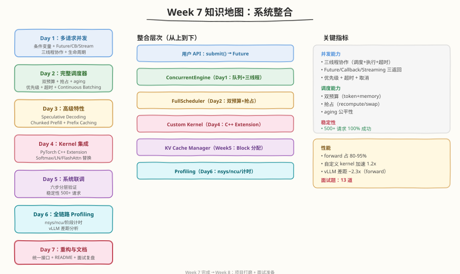
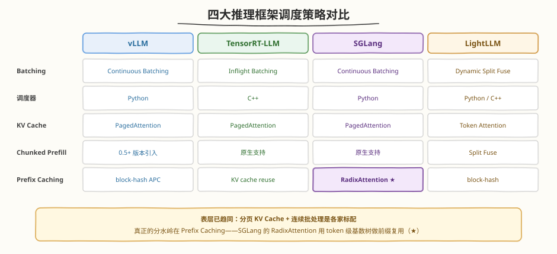
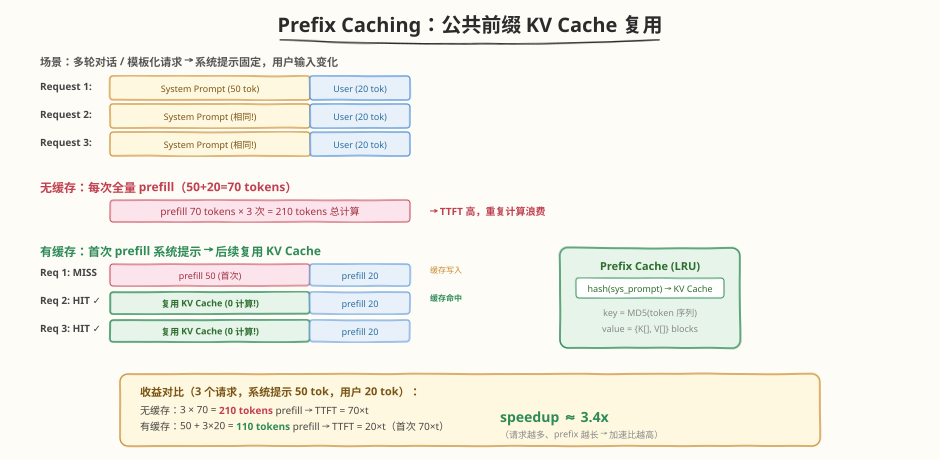

## Day 7：调度优化策略总结

### 🎯 目标

通过今天的学习，你将：

1. 系统梳理 Week 7 的知识链——从 Continuous Batching 到 vLLM Scheduler 到框架对比到 Chunked Prefill + Prefix Caching 到 Mini 引擎 v1 到 PD 分离，把碎片知识连成**一张完整地图**<br>
2. 掌握 **7 种调度策略 + 2 项架构级优化（Prefix Caching / PD 分离）**的原理、适用场景、优缺点，建立**策略选择决策树**，拿到任意推理服务需求能选对 batching 策略<br>
3. 复盘本周 **15 道面试题**，建立调度专题的答题框架（定性→机制→量化→方案→跨平台）<br>
4. 整理本周所有产出（Continuous Batcher、vLLM Scheduler 复刻、Chunked Prefill 模拟器、Prefix Cache 引擎、Mini 引擎 v1、PD 分离模拟器），形成可复用的工程资产<br>
5. 澄清 **6 个常见误区**——Continuous≠Dynamic、PagedAttention 非直接加速、RECOMPUTE 默认非因快、chunked 非越小越好、Prefix Caching 非总有益、PD 分离非总更快<br>
6. 为 Week 8（量化与加速）做好知识衔接，明确把前六周所有组件联调成完整 Mini AI Infra 系统的前置基础

> 💡 **为什么重要**：Day 1-6 我们分别学了调度的各个机制——Continuous 每轮重建、vLLM Scheduler 5 步、框架横评、Chunked Prefill 分块 + Prefix Caching 复用、Mini 引擎 v1 并发、PD 分离解耦 TTFT/TPOT。但"各个机制都懂"不等于"系统全局掌握"——今天用策略对比表和决策树把碎片连成网络。这张决策树是调度优化的通用工具箱：看到任何推理服务需求，你能立刻判断该用哪种 batching、叠哪些策略。Week 8 的量化与加速建立在这张地图上。

---

### Week 7 知识地图



Week 7 围绕一条主线展开：**从单请求串行到多请求高吞吐服务，再到跨机 PD 分离架构**。


| Day | 主题 | 核心产出 | 关键概念 |
|-----|------|---------|---------|
| Day 1 | Continuous Batching | continuous_batcher.py | iteration-level 调度、动态加入退出、Scheduler 状态机、prefill/decode 混合 |
| Day 2 | vLLM Scheduler 源码分析 | vllm_scheduler_analyzer.py | schedule() 5 步、SchedulingBudget 双预算、Preemption（RECOMPUTE/SWAP） |
| Day 3 | TRT-LLM / LightLLM / SGLang 调度对比 | chunked_prefill_simulator.py | Inflight=Continuous、Chunked Prefill、Token Attention、RadixAttention |
| Day 4 | Chunked Prefill 与 Prefix Caching 实操 | prefix_cache_engine.py | block hash、LRU 淘汰、命中率分析、两者协同 |
| Day 5 | Mini 引擎 v1（多请求并发） | mini_engine_v1.py | 四组件架构、Scheduler、Future 异步、优先级、锁粒度 |
| Day 6 | PD 分离推理（PD Disaggregated） | pd_disaggregated_simulator.py | prefill/decode 资源错配、双池 + KV 传输层、TTFT/TPOT SLO 解耦 |
| **Day 7** | **策略总结** | **9 项策略对比 + 决策树** | **决策树、面试复盘、误区澄清** |

> 💡 **一句话总结**：Week 7 的本质是"从凑批到并发服务，再到跨机架构"。Day 7 的策略决策树就是这 7 天学习的最终答卷——它是推理调度选型的通用工具箱。

> 📎 **Dynamic Batching 去哪了**：Dynamic Batching 是 Day 1 导读中的对比基线（request-level 聚合），其实现 `dynamic_batcher.py` 归档在 `_supplementary/from_w6d6/`（Week 6 Day 6 迁移而来），本周正篇从 Continuous Batching 起步。

---

### 核心概念串讲

#### 1. Dynamic → Continuous：request-level 到 iteration-level（Day1）


| 维度 | Dynamic（Day1 导读） | Continuous（Day1） |
|------|----------------|-------------------|
| 调度粒度 | request-level（整批） | **iteration-level**（每轮） |
| 请求退出 | 整批完成一起退 | **完成即退** |
| 短请求等待长请求 | 是（阻塞） | **否** |
| 吞吐提升 | 中 | **2-8x** |

实测：S3（短请求）在 iter 6 完成，比 Dynamic 节省 3 个 iteration 等待；极端例子 R1(gen=5) vs R2(gen=100)，Continuous 让 R1 节省 95 个 iteration 空等。

#### 2. vLLM Scheduler：5 步 + 预算 + 抢占（Day2）


> 关键防饿死：`_schedule_waiting` 中 `if self.swapped: return`——swapped 非空时不接纳新请求。
> 实测：RECOMPUTE 下被抢占序列 g 归零重 prefill（7 iter），SWAP 下保留进度（6 iter）。
> 附录视角：V0 的 5 步 / 3 队列在 V1 中简化为统一调度，prefix caching + chunked prefill 默认启用。

#### 3. 框架对比与 Chunked Prefill（Day3）



```
Inflight Batching = Continuous Batching（术语不同，本质同一）
vLLM: Python 调度，灵活   TensorRT-LLM: C++ 调度，快但需重编译
LightLLM: Token Attention（token 粒度内存池）+ Dynamic Split Fuse
SGLang: RadixAttention（前缀树管理共享前缀）
Chunked Prefill: 长 prompt 拆 chunk 与 decode 交错 → TPOT 平滑（实测尖峰 2.0ms → 1.2ms，降 40%）
```

#### 4. Prefix Caching：共享前缀的 KV 复用（Day4）



```
每个 KV block 用 token sequence 的 hash 作唯一标识 → O(1) 查表命中
ref_count=0 的 block 按 LRU 淘汰（引用中的不淘汰）
命中场景：多轮对话 80-95%、共享 system prompt 90-99%
实测：多轮对话 4x 加速、共享 system prompt 1.3x 加速
与 Chunked Prefill 协同：先 prefix 匹配跳过已知前缀，剩余再分块交错——正交互补
```

#### 5. Mini 引擎 v1：多请求并发（Day5）

```
submit() → Future（异步）→ 后台 worker 做 Continuous Batching
四组件：Request Queue + Scheduler + Worker + Future
锁内只做队列操作（快），锁外做 forward（慢但不阻塞 submit）
实测：4 请求 8 轮完成（v0 串行需 23 次 forward），并发收益 2.9x
```

#### 6. PD 分离：跨机解耦 TTFT/TPOT（Day6）

```
动机：prefill compute-bound vs decode memory-bound 资源错配 + TTFT/TPOT SLO 矛盾
架构：Router + Prefill Pool（算力型）+ Decode Pool（显存型）+ KV 传输层（RDMA）
KV 传输 = seq_len × kv_bytes_per_token / RDMA 带宽（LLaMA-7B 32K prompt：16GB → 160ms）
收益：模拟器 TTFT/TPOT 改善 75%/62%，p99 更显著；代价：传输开销 + 双池复杂度
不划算：短 prompt、低 QPS、单机够用；与 Chunked Prefill 互补（单机调度 vs 跨机架构）
```

---

### 调度策略对比表

| 策略 | 原理 | 适用场景 | 优点 | 缺点 | Day |
|------|------|---------|------|------|-----|
| Static Batching | 固定 batch，凑齐才开始 | 简单 demo/请求等长 | 实现最简单 | 吞吐低、长请求阻塞 | Day1 导读 |
| Dynamic Batching | 请求级聚合+超时 | 吞吐优先、非 LLM | 提 GPU 利用率 | request-level 阻塞、padding | Day1 导读 |
| **Continuous Batching** | iteration-level 重建 batch | **LLM 自回归推理** | **吞吐+延迟兼顾** | 实现复杂、需 PagedAttention | Day1 |
| Preemption | 显存不足抢占（RECOMPUTE/SWAP） | 显存压力 | 过载优雅降级 | 重算/PCIe 开销 | Day2 |
| Chunked Prefill | 长 prompt 拆块交错 | 长短混合、TPOT 敏感 | 平滑 latency | 调度复杂、TTFT 增 | Day3-4 |
| **Prefix Caching** | block hash 复用共享前缀 KV | 多轮对话、共享 system prompt | 省重复 prefill、降 TTFT | 无共享前缀无收益 | Day4 |
| Priority Scheduling | 高优先级先调度 | 多租户、多 SLA | 保障关键延迟 | 低优先级饥饿 | Day5 |
| **PD 分离** | prefill/decode 双池 + RDMA KV 传输 | 长 prompt + 高 QPS | TTFT/TPOT 解耦、p99 改善 | 传输开销、双池复杂度 | Day6 |
| Speculative Decoding | 小模型预测+大模型验证 | 低延迟、有 draft model | 降 TBT | 需 draft model | 进阶 |

---

### 策略选择决策树


```
最低延迟？     → 小 batch + Priority
LLM 自回归？   → Continuous Batching（否则 Dynamic）
多租户/SLA？   → + Priority
长 prompt？    → + Chunked Prefill
共享前缀？     → + Prefix Caching
显存紧？       → + Preemption
长 prompt + 高 QPS + 多机？ → PD 分离
标配：Continuous + PagedAttention + Chunked Prefill + Prefix Caching
```

---

### 总结任务 / Coding 任务

#### 任务 1：运行总结自测脚本

运行 [kernels/week7_summary.py](https://github.com/hzchenxiaobin/ai-infra-notes/blob/main/aiinfra/daily/week7/day7/kernels/week7_summary.py)，复盘 9 项策略对比 + 决策树 + 15 道面试题自测：

```bash
python kernels/week7_summary.py
```

脚本依次打印：9 项调度策略对比表（7 种调度策略 + Prefix Caching + PD 分离）、策略选择决策树、15 道面试题清单（按主题分组），然后可选随机抽 5 题做自测（先看问题，按回车看参考答案）。

**预期输出**（节选）：


#### 任务 2：LeetGPU 综合题 —— Reduction

**题目链接**：<https://leetgpu.com/challenges/reduction>

**与本周总结的关联**：Reduction 是所有归约类 kernel（softmax 分母、LayerNorm 均值方差、dot product、attention 分数累加）的基础组件——block 内归约 + 跨 block 归约的两段式结构是通用模板。本周调度层面的"累加/统计"操作（token budget 逐请求扣减、batch 聚合、命中率统计）在 kernel 层的本质都是归约。这道题还藏着一个精度要点：大 `N` 下必须用 `double` 高精度累加、最后一步才转回 FP32，否则累加误差直接超容差——这正是 Week 8 量化专题"低精度提吞吐、但累加必须升精度控误差"的前置练习。这道题练 warp shuffle 归约 + 两阶段汇总——Week 8 量化与加速中所有统计/归约 kernel 都会用到。

> 💡 完整题解（含 warp shuffle 归约、block 间两阶段汇总、double 高精度累加的精度处理）见 [Reduction 题解](https://hzchenxiaobin.github.io/leetgpu/leetgpu-reduction-solution.html)。

#### 任务 3：本周 LeetCode 题目回顾（8 周计划 · 第 6 周）

本周 LeetCode 题目对应 [8 周算法面试刷题计划](https://hzchenxiaobin.github.io/leetcode/problems/8-week-plan.html) 第 6 周「二叉树（下）+ 回溯 + 网格搜索」（点击查看题解）：

| Day | 主题 | LeetCode 题目 |
|-----|------|---------------|
| Day 1 | 路径问题 | [112. 路径总和](https://leetcode.cn/problems/path-sum/)、[113. 路径总和 II](https://hzchenxiaobin.github.io/leetcode/problems/113_路径总和II.html)、[129. 求根节点到叶节点数字之和](https://leetcode.cn/problems/sum-root-to-leaf-numbers/)、[222. 完全二叉树的节点个数](https://leetcode.cn/problems/count-complete-tree-nodes/)、[437. 路径总和 III](https://hzchenxiaobin.github.io/leetcode/problems/437_路径总和III.html) |
| Day 2 | LCA 与路径和 | [236. 二叉树的最近公共祖先](https://hzchenxiaobin.github.io/leetcode/problems/236_二叉树的最近公共祖先.html)、[124. 二叉树中的最大路径和](https://hzchenxiaobin.github.io/leetcode/problems/124_二叉树中的最大路径和.html)、[199. 二叉树的右视图](https://hzchenxiaobin.github.io/leetcode/problems/199_二叉树的右视图.html)、[114. 二叉树展开为链表](https://hzchenxiaobin.github.io/leetcode/problems/114_二叉树展开为链表.html) |
| Day 3 | 序列化与宽度 | [297. 二叉树的序列化与反序列化](https://hzchenxiaobin.github.io/leetcode/problems/297_二叉树的序列化与反序列化.html)、[662. 二叉树最大宽度](https://hzchenxiaobin.github.io/leetcode/problems/662_二叉树最大宽度.html)、[958. 二叉树的完全性检验](https://hzchenxiaobin.github.io/leetcode/problems/958_二叉树的完全性检验.html) |
| Day 4 | 网格 DFS/BFS | [200. 岛屿数量](https://hzchenxiaobin.github.io/leetcode/problems/200_岛屿数量.html)、[994. 腐烂的橘子](https://hzchenxiaobin.github.io/leetcode/problems/994_腐烂的橘子.html)、[695. 岛屿的最大面积](https://hzchenxiaobin.github.io/leetcode/problems/695_岛屿的最大面积.html)、[130. 被围绕的区域](https://hzchenxiaobin.github.io/leetcode/problems/130_被围绕的区域.html) |
| Day 5 | 回溯基础 | [46. 全排列](https://leetcode.cn/problems/permutations/)、[78. 子集](https://hzchenxiaobin.github.io/leetcode/problems/78_子集.html)、[39. 组合总和](https://hzchenxiaobin.github.io/leetcode/problems/39_组合总和.html)、[17. 电话号码的字母组合](https://hzchenxiaobin.github.io/leetcode/problems/17_电话号码的字母组合.html) |
| Day 6 | 回溯进阶 | [22. 括号生成](https://hzchenxiaobin.github.io/leetcode/problems/22_括号生成.html)、[79. 单词搜索](https://hzchenxiaobin.github.io/leetcode/problems/79_单词搜索.html)、[131. 分割回文串](https://hzchenxiaobin.github.io/leetcode/problems/131_分割回文串.html)、[51. N 皇后](https://hzchenxiaobin.github.io/leetcode/problems/51_N皇后.html)、[93. 复原 IP 地址](https://leetcode.cn/problems/restore-ip-addresses/) |

> 💡 回顾重点：本周 LeetCode 题对应 8 周刷题计划第 6 周「二叉树（下）+ 回溯 + 网格搜索」。重做本周错题、总结模板笔记；没做完的题目今天补上。

---

### 面试准备框架

#### 本周 15 道核心面试题（按主题分组）

**Continuous Batching（Day1）**
1. Continuous Batching 和 Dynamic Batching 的区别？
2. Continuous Batching 为什么适合 LLM 推理？
3. Prefill + Decode 混合调度的挑战？

**vLLM Scheduler（Day2）**
1. vLLM Scheduler 的 schedule() 流程？
2. SchedulingBudget 的两个核心参数？
3. Preemption 的两种模式？默认哪个？为什么？

**框架对比 + Chunked Prefill（Day3）**
1. Inflight Batching 和 Continuous Batching 区别？
2. Chunked Prefill 是什么？解决什么问题？chunk_size 怎么选？

**Prefix Caching（Day4）**
1. Prefix Caching 的 block hash 机制与 LRU 淘汰？
2. Prefix Caching 什么场景收益最大？和 Chunked Prefill 如何协同？

**Mini 引擎 v1（Day5）**
1. 多请求并发需要解决哪些问题？
2. 优先级调度的优缺点？

**PD 分离（Day6）**
1. PD 分离的动机是什么？
2. KV Cache 跨节点传输开销怎么算？什么场景不划算？

**总结（Day7）**
1. 调度策略如何选择？

#### 答题框架

```
1. 先定性：这属于哪类策略（Continuous/Priority/Chunked/Prefix Cache/PD 分离）？
2. 给机制：底层原理（request vs iteration 级、token budget、block hash、双池 + RDMA）
3. 量化：数据支撑（吞吐 2-8x、延迟尖峰降 40%、命中率 80-95%、TTFT/TPOT 改善 75%/62%）
4. 给方案：3 个以上方向，分"标配"和"按需叠加"
```

---

### 常见误区澄清

1. **"Continuous Batching 就是 Dynamic Batching"** —— 错。Dynamic 是 request-level（整批一起开始结束），Continuous 是 iteration-level（每轮重建 batch，完成即走）。后者才是 LLM 推理标配，吞吐 2-8x。

2. **"PagedAttention 是为了加速"** —— 错。PagedAttention 是内存管理（解决 KV Cache 碎片），不直接加速单次 attention。它让 Continuous Batching 的 slot 回收无碎片化，间接提吞吐。两者是 vLLM 双支柱，缺一不可。

3. **"RECOMPUTE 是因为重算快"** —— 不全对。RECOMPUTE 默认是因为**通常重算比 PCIe 换入快**（GPU 算力 >> PCIe 带宽，尤其 prompt 不长时），且不需 CPU 内存。但 prompt 极长时重算代价超过 PCIe 换入，此时 SWAP 更优。

4. **"chunk_size 越小越好（TPOT 最平滑）"** —— 错。chunk_size 太小 → prefill 要很多轮 → TTFT（首 token 延迟）增加。要在 TPOT 平滑和 TTFT 间权衡，经验值 512-2048。

5. **"Prefix Caching 开了总有收益"** —— 错。收益取决于请求间的前缀重叠度：多轮对话/共享 system prompt 命中率 80-99%，收益巨大；但单轮对话、请求间无共享前缀时，命中率≈0，只剩 cache 管理开销。开之前先看流量特征。

6. **"PD 分离一定比 colocated 快"** —— 错。PD 分离的收益来自 TTFT/TPOT 解耦，代价是 KV 跨节点传输（LLaMA-7B 32K prompt 要 160ms @ 100GB/s RDMA）+ 双池管理复杂度。短 prompt、低 QPS、单机够用的场景，传输开销占比大、建池成本摊不薄，反而不划算。

---

### Week 7 → Week 8 衔接

Week 7 建立了调度系统的"全景地图"和第一个多请求并发引擎，并把视野扩展到跨机 PD 分离架构。Week 8 进入**量化与加速**：

| Week 7（调度 + 并发 + 架构） | Week 8（量化与加速） |
|----------------------|-------------------|
| Mini 引擎 v1（多请求） | 联调所有组件成完整系统 |
| Continuous Batching + Scheduler | 端到端服务 + API |
| Chunked Prefill + Prefix Caching | 量化（W8A16/INT8 KV/FP8）叠加到调度之上 |
| PD 分离（跨机架构） | CUDA Graph 降 launch overhead（单机加速） |
| 调度策略对比 + 决策树 | 生产级调度策略选型 |
| 单卡推理 | 多卡 TP/PP 扩展（进阶） |

> 💡 Week 8 的核心问题：怎么把前六周的零件（GEMM、FlashAttention、Softmax/LayerNorm、KV Cache、PagedAttention、Continuous Batching、Scheduler）联调成一个完整的 Mini AI Infra 系统？这是推理调度阶段的收官。

---

### 弹性安排

- **时间紧（≤4h）**：跑 `week7_summary.py` 自测 15 题 + 过一遍策略对比表 + 决策树
- **标准（6h）**：+ 整理 GitHub 仓库（按 day1-7 归档）+ 生成 Week 7 学习总结
- **充裕（8h+）**：+ 重做 Day2 的 vLLM Scheduler 抢占实验 + Day6 的 PD 分离临界点扫描 + 写 Week 7 学习总结博客

---

### 今日总结

Day 7 我们把 Week 7 的碎片知识连成了调度系统的完整地图：

1. **知识地图**：Day1 Continuous 每轮重建 → Day2 vLLM Scheduler 5步+抢占 → Day3 框架对比/Chunked Prefill → Day4 Prefix Caching 复用共享前缀 → Day5 Mini 引擎 v1 并发 → Day6 PD 分离跨机架构 → Day7 策略总结
2. **9 项策略对比**：Static/Dynamic/Continuous/Preemption/Chunked Prefill/Prefix Caching/Priority/PD 分离/Speculative，各有适用场景
3. **决策树**：最低延迟→小batch+优先级；LLM自回归→Continuous；再按需叠加 Priority/Chunked/Prefix Caching/Preemption/PD 分离/Speculative
4. **15 道面试题复盘**：分 Continuous/Scheduler/框架对比/Prefix Caching/引擎/PD 分离/总结七组，建立答题框架
5. **6 个误区澄清**：Continuous≠Dynamic、PagedAttention 非直接加速、RECOMPUTE 非因快、chunked 非越小越好、Prefix Caching 非总有益、PD 分离非总更快
6. **Week 8 衔接**：从调度系统到完整 AI Infra 系统整合，把六周零件联调成端到端服务

掌握这些后，你就有了推理调度的全局视角——Week 8 我们把所有组件联调成完整的 Mini AI Infra 系统，完成推理调度阶段的学习收官。

---

### 面试要点

1. **对比 Static Batching、Dynamic Batching、Continuous Batching，分别适用于什么场景？**（⭐⭐⭐⭐⭐ 必考）

<details>
<summary>点击查看答案</summary>

 - **Static Batching**：固定 batch size，一起开始一起结束。适用于简单 demo 或请求长度完全相同
 - **Dynamic Batching**：请求级聚合，超时等待。适用于吞吐优先、非 LLM 自回归场景
 - **Continuous Batching**：iteration-level 调度，请求动态加入/退出。适用于 LLM 自回归生成（生成长度差异大）
 - **选择**：LLM 推理服务用 Continuous Batching；传统 CV/NLP 用 Dynamic Batching

</details>


2. **在 LLM 推理服务中，如何平衡 throughput 和 latency？**（⭐⭐⭐⭐⭐ 必考）

<details>
<summary>点击查看答案</summary>

 - **Continuous Batching**：基础，本身就在平衡吞吐和延迟
 - **Token budget 控制**：限制每轮 token 数，避免 prefill 阻塞 decode
 - **Chunked Prefill**：拆分长 prefill，平滑 decode latency（实测尖峰降 40%）
 - **Prefix Caching**：复用共享前缀 KV，减少重复 prefill 计算（多轮对话命中率 80-95%）
 - **优先级调度**：保障关键请求延迟
 - **PD 分离**：长 prompt + 高 QPS 时把 prefill/decode 拆到双池，TTFT/TPOT 各自最优
 - **关键**：根据 SLA 做 trade-off，没有绝对最优

</details>


3. **vLLM 的 Continuous Batching 为什么需要 PagedAttention？**

<details>
<summary>点击查看答案</summary>

 - Continuous Batching 每轮有请求完成退出、新请求加入——KV Cache 频繁分配/释放
 - 连续分配会产生外部碎片——完成的请求释放的空洞拼不回来，新请求放不下 OOM
 - PagedAttention 的 block 粒度分配/回收让 slot 回收无碎片化——空闲 block 随时被任意序列复用
 - 两者是 vLLM 双支柱：Continuous 提吞吐，PagedAttention 让吞吐可持续

</details>


4. **调度策略如何选择？给出你的决策流程**

<details>
<summary>点击查看答案</summary>

 - 决策树：①最低延迟→小batch+Priority ②LLM自回归→Continuous ③非LLM→Dynamic
 - 在 Continuous 基础上按需叠加：多租户→+Priority；长prompt→+Chunked Prefill；有共享前缀→+Prefix Caching；显存紧→+Preemption；长prompt+高QPS+多机→PD 分离；有draft model→+Speculative
 - LLM 推理标配：Continuous + PagedAttention + Chunked Prefill + Prefix Caching

</details>


5. **为什么需要 PD 分离？KV Cache 跨节点传输开销怎么算？**（⭐⭐⭐⭐⭐ 必考）

<details>
<summary>点击查看答案</summary>

 - **动机**：prefill 是 compute-bound（大 GEMM）、decode 是 memory-bound（M=1，KV 读取主导），colocated 混跑互相干扰；TTFT/TPOT SLO 矛盾——长 prefill 阻塞 decode → TPOT 飙升
 - **架构**：Router + Prefill Pool（算力型 GPU）+ Decode Pool（显存型 GPU）+ KV 传输层（RDMA/NVLink）
 - **传输开销**：`seq_len × 2 × n_layer × n_kv_head × d_head × dtype_bytes / RDMA 带宽`；LLaMA-7B 32K prompt：16GB / 100GB/s = 160ms，不可忽略
 - **收益**：TTFT/TPOT 大幅改善（模拟器 75%/62%），p99 更显著；**不划算**：短 prompt、低 QPS、单机够用
 - **代表系统**：Mooncake（生产级，RDMA + 分层 KV 缓存）、DistServe（学术原型）、vLLM V1 disaggregated（开源可选模式）

</details>

## 📁 本周目录结构

```
aiinfra/daily/week7/
├── README.md # 周概览
├── day1/kernels/continuous_batcher.py # Continuous Batching 实现
├── day2/kernels/vllm_scheduler_analyzer.py # vLLM Scheduler 教学复刻
├── day3/kernels/chunked_prefill_simulator.py # Chunked Prefill vs Naive 延迟模拟
├── day4/kernels/prefix_cache_engine.py # Prefix Caching 推理引擎
├── day5/kernels/mini_engine_v1.py # Mini 推理引擎 v1（多请求并发）
├── day6/kernels/pd_disaggregated_simulator.py # PD 分离模拟器（colocated vs disaggregated）
├── day7/kernels/week7_summary.py # 总结日自测脚本
├── _supplementary/from_w6d6/ # Dynamic Batching 归档（Day 1 导读对比基线）
│   └── kernels/dynamic_batcher.py
└── images/ # 本周 SVG 插图
```

> 📎 LeetGPU / LeetCode 题解已迁移至独立站点：<https://hzchenxiaobin.github.io/leetgpu/> 、<https://hzchenxiaobin.github.io/leetcode/>

## 🔗 推荐资源

- **vLLM 论文**：Efficient Memory Management for LLM Serving with PagedAttention (SOSP 2023)
- **vLLM 源码**：<https://github.com/vllm-project/vllm>（重点 `vllm/core/scheduler.py`）
- **TensorRT-LLM 文档**：Inflight Batching / Chunked Prefill
- **Continuous Batching 博客**：AnyScale "Continuous Batching" / vLLM blog
- **Orca 论文**：Iteration-level Scheduling (OSDI 2022)——Continuous Batching 理论基础
- **LightLLM 仓库**：<https://github.com/ModelTC/lightllm>（Token Attention / Dynamic Split Fuse）
- **SGLang 仓库**：<https://github.com/sgl-project/sglang>（RadixAttention）
- **Mooncake 论文**：Moonshot 的 PD 分离生产实践（KV-cache-centric 架构 + RDMA 传输层）
- **DistServe 论文**：PD 分离收益的学术量化分析
- **vLLM V1 disaggregated RFC**：开源 PD 分离实现

## ✅ Week 7 完成标准

- [ ] 能实现 Continuous Batching，新请求可任意 iteration 加入（Day1）
- [ ] 能解释 vLLM Scheduler 的 schedule() 5 步流程与 Preemption 两种模式（Day2）
- [ ] 能对比 vLLM / TensorRT-LLM / LightLLM / SGLang 调度策略，说清 Chunked Prefill（Day3）
- [ ] 能讲清 Prefix Caching 的 block hash 机制与 LRU 淘汰，量化命中场景加速比（Day4）
- [ ] Mini 引擎 v1 能同时处理多个请求，支持优先级与 Future 异步（Day5）
- [ ] 能讲清 PD 分离的动机、双池架构与 KV 传输开销计算，判断何时不划算（Day6）
- [ ] 能用决策树选择合适的 batching 策略，给出场景选型建议（Day7）
- [ ] 完成本周 15 道面试题的自问自答
- [ ] 整理 GitHub 仓库，生成 Week 7 学习总结
- [ ] 规划 Week 8（量化与加速）的学习重点
