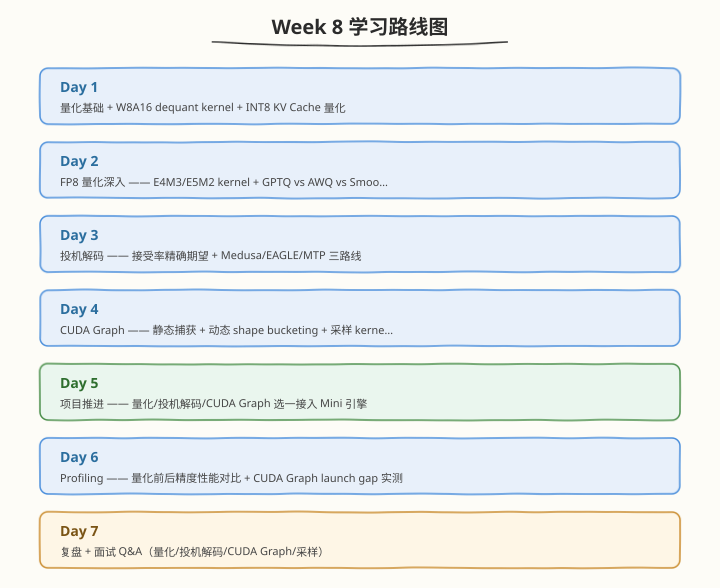

# Week 8：推理加速技术

> 核心目标：掌握量化（W8A16/INT8 KV/FP8）、投机解码（Medusa/EAGLE/MTP）、CUDA Graph 与采样 kernel

| 项目　　　 | 说明　　　　　　　　　　　　　　　　　　　　　　　　　　　　　|
| ------------| ------------------------------------------------------------|
| 前置要求　 | 已完成 Week 7，掌握 Continuous Batching、Scheduler、PD 分离、Mini 引擎 v1　　　　　　　　　　　　　　　　　　　　　　　|
| 建议时长　 | 工作日每天 2.5h，周末每天 6h，周计 24.5h　　　　　　　　　　|
| 本周产出　 | W8A16/FP8 dequant kernel、投机解码模拟器（接受率扫描）、CUDA Graph 集成、top-p 采样 kernel、量化前后性能对比表　　　　　　　　　　　　　　　　　　　　　　　　　|
| 周日里程碑 | 量化 kernel PASS，投机解码接受率扫描数据留档，CUDA Graph launch gap 实测留档　　　　　　　　　　　　　　　　　　　　　　　|

---

## 🧭 本周学习地图

---

## 📚 每日学习材料

| Day | 主题 | 目录 |
|-----|------|------|
| Day 1 | 量化推理专题 —— W8A16/INT8 KV/FP8 | [day1/](https://hzchenxiaobin.github.io/ai-infra-notes/week8/day1.html) |
| Day 2 | FP8 量化深入 —— E4M3/E5M2 kernel 与 GPTQ vs AWQ 对比 | [day2/](https://hzchenxiaobin.github.io/ai-infra-notes/week8/day2.html) |
| Day 3 | 投机解码专题 —— 原理与三路线（Medusa/EAGLE/MTP） | [day3/](https://hzchenxiaobin.github.io/ai-infra-notes/week8/day3.html) |
| Day 4 | CUDA Graph 实操 —— 消除 Launch Overhead | [day4/](https://hzchenxiaobin.github.io/ai-infra-notes/week8/day4.html) |
| Day 5 | 项目推进 —— 量化/投机解码/CUDA Graph 接入 Mini 引擎 | [day5/](https://hzchenxiaobin.github.io/ai-infra-notes/week8/day5.html) |
| Day 6 | Profiling —— 量化前后精度性能对比与 CUDA Graph Launch Gap | [day6/](https://hzchenxiaobin.github.io/ai-infra-notes/week8/day6.html) |
| Day 7 | 复盘与面试 Q&A —— 量化/投机解码/CUDA Graph/采样 | [day7/](https://hzchenxiaobin.github.io/ai-infra-notes/week8/day7.html) |
