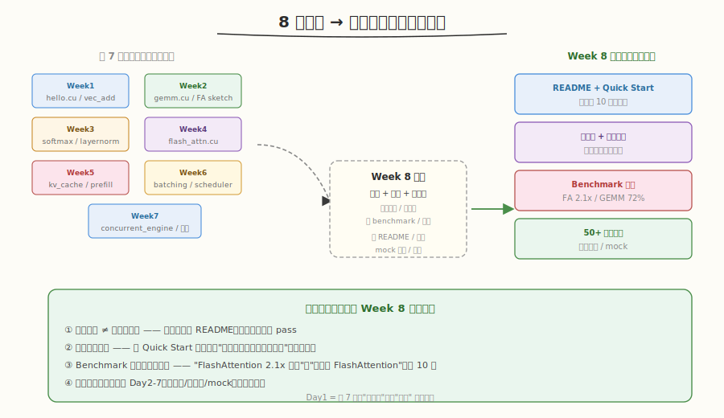
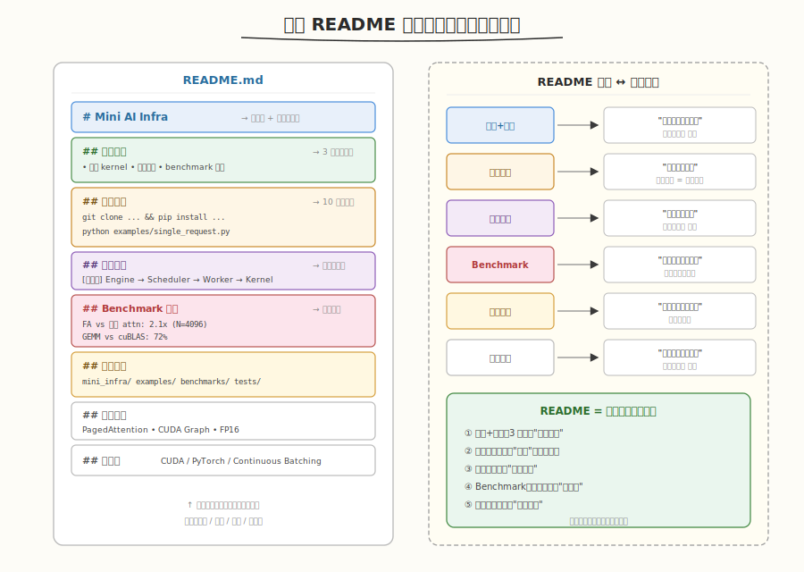
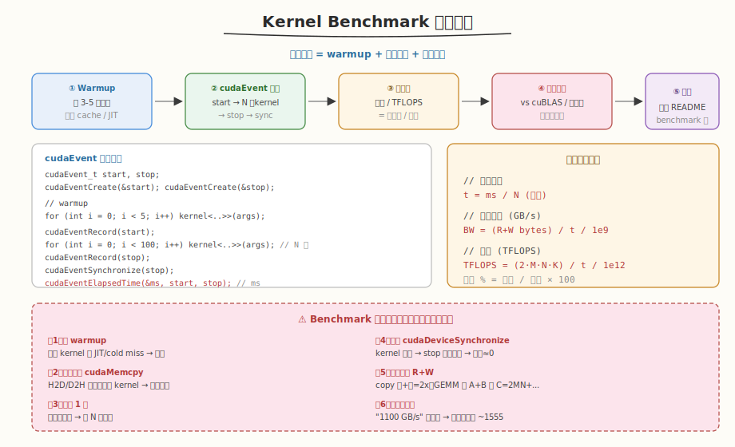

## Day 1：项目文档完善

### 🎯 目标

通过今天的学习，你将：

1. 理解 **README 是项目的"面试第一印象"**——面试官打开 GitHub 仓库先看 README，3 秒内决定是否继续<br>
2. 掌握 **优秀 README 的六段结构**——项目亮点、快速开始、系统架构、Benchmark 结果、项目结构、后续规划，每段对应一个面试高频问题<br>
3. 能编写 **Quick Start 指南**——环境要求、依赖安装、一行命令跑通示例，让新用户 10 分钟内复现<br>
4. 学会 **正确测量 Kernel 性能**——warmup、cudaEvent 计时、排除拷贝、N 次取平均，避免 6 个常见 benchmark 陷阱<br>
5. 能产出 **Benchmark 对比表格**——FlashAttention vs 标准 Attention、GEMM vs cuBLAS，用百分比量化优化成果<br>
6. 用 Python 手写一个 **benchmark_demo.py**，实测 SiLU kernel 的带宽利用率，生成可直接贴进 README 的性能表

> 💡 **为什么重要**：Week 7 我们完成了 Mini AI Infra 系统的联调与全链路 profiling，代码"能跑"了。但"代码能跑" ≠ "项目可展示"——面试官打开你的仓库，如果 README 缺失、没有 Quick Start、没有 benchmark 数字，往往会直接跳过。Week 8 的第一天把 7 周散落的代码与笔记打磨成一份可展示的项目文档，这是从"学习者"到"求职者"的关键转换。

---

### 学前导读：为什么"代码能跑"还不够

Week 1-7 我们积累了大量代码：`hello_gpu.cu`、`gemm.cu`、`flash_attn.cu`、`concurrent_engine.py`……它们散落在各个 `weekN/dayM/kernels/` 目录下，能各自独立运行，但作为一个整体项目来看，存在几个问题：

```
7 周代码的"展示短板"：
 1. 没有 README → 面试官打开仓库一片懵，不知道这项目做什么
 2. 没有 Quick Start → 想跑一下却不知道装什么依赖、执行哪个入口
 3. 没有 benchmark 数字 → "我写了 FlashAttention" 远不如 "FA 比标准 attn 快 2.1x"
 4. 代码散落各周目录 → 看不出系统全貌，像"作业堆"而非"项目"
 5. 没有架构图 → 无法一眼理解 Engine → Scheduler → Worker → Kernel 的层次
```

| 维度 | Week 7 结束时 | Week 8 Day1 目标 |
|------|--------------|------------------|
| README | 无 / 一句话 | **六段结构完整** |
| Quick Start | 无 | **10 分钟跑通** |
| Benchmark | 散落的 ncu 输出 | **对比表格 + 百分比** |
| 项目结构 | 各周独立 | **统一目录树** |
| 架构图 | 无 | **一张图看懂系统**（Day 2 细化） |



> 💡 **一句话总结**：Day 1 的核心是把"代码堆"变成"项目"——用 README 回答面试官的五个高频问题（介绍项目 / 能跑吗 / 架构 / 成果 / 后续），让仓库自己会"说话"。

---

### 理论学习

#### 1.1 README 的六段结构



一份面向面试的 README 不是"把所有信息都写上去"，而是**每一段对应一个面试高频问题**：

| README 段落 | 对应面试问题 | 写作要点 |
|------------|-------------|---------|
| **标题 + 项目亮点** | "介绍一下你的项目" | 一句话定位 + 3-4 个 bullet 抓眼球 |
| **快速开始** | "代码能跑吗？" | 环境 / 安装 / 一行命令运行 |
| **系统架构** | "画一下架构图" | 模块层次图（Day 2 细化） |
| **Benchmark 结果** | "成果？加速多少？" | 对比表格 + 百分比 |
| **项目结构** | "代码怎么组织的？" | 目录树 + 注释 |
| **后续规划** | "继续优化做什么？" | 3-6 个 todo 体现成长性 |

##### 为什么标题+亮点要放在最前面？

面试官（或 HR）浏览 GitHub 仓库平均只花 **10-30 秒**。如果首屏看不到"这项目做什么、有什么亮点"，就会直接关掉。所以 README 开头必须用一句话定位 + 3-4 个 bullet 列出核心亮点：

```markdown
# Mini AI Infra

> 一个用于学习 AI Infra 的迷你 LLM 推理系统

## 项目亮点
- 手写 CUDA kernel：GEMM、FlashAttention、Softmax、LayerNorm
- 完整推理系统：Prefill/Decode、KV Cache、Continuous Batching、Scheduler
- 端到端可运行：单请求/多请求并发
- 与 cuBLAS / 标准 Attention 对比的 benchmark 报告
```

#### 1.2 Quick Start：让新用户 10 分钟跑通

Quick Start 的目标是**可复现性**——任何人 clone 仓库后，按步骤操作就能跑通第一个示例。三要素：

| 要素 | 内容 | 易错点 |
|------|------|--------|
| **环境要求** | GPU 算力、CUDA 版本、Python 版本 | 漏写 CUDA 版本 → 用户编译失败 |
| **依赖安装** | `pip install -r requirements.txt` | requirements.txt 不全 → import 报错 |
| **运行示例** | 一行命令 + 预期输出 | 不给预期输出 → 用户不知道是否成功 |

```markdown
### 环境要求
- NVIDIA GPU (Compute Capability >= 7.0)
- CUDA >= 11.0
- Python >= 3.8, PyTorch >= 2.0

### 安装
git clone https://github.com/yourname/mini-ai-infra.git
cd mini-ai-infra
pip install -r requirements.txt

### 运行示例
python examples/single_request.py
# 预期输出：Generated: The quick brown fox...
```

> ⚠️ **注意**：Quick Start 里出现的每个命令你都必须**亲自跑一遍**。文档里写"应该能跑"但实际跑不通，是 README 最致命的问题——面试官一试就露馅。

#### 1.3 Benchmark 测量方法论



Benchmark 数字是 README 最有说服力的部分，但**测错数字比没有数字更糟**。正确测量流程：

##### 1.3.1 cudaEvent 计时

CPU 端的 `clock()` / `time.time()` 测的是"提交到完成"，包含 launch overhead 和异步延迟，**不能用于 GPU kernel 计时**。必须用 `cudaEvent`：

```cuda
cudaEvent_t start, stop;
cudaEventCreate(&start);
cudaEventCreate(&stop);

// warmup（避免首次 cold miss）
for (int i = 0; i < 5; i++)
    kernel<<<grid, block>>>(args);

cudaEventRecord(start);     // 计时开始
for (int i = 0; i < N; i++) // 跑 N 次取平均
    kernel<<<grid, block>>>(args);
cudaEventRecord(stop);                  // 计时结束
cudaEventSynchronize(stop);             // 必须同步！
cudaEventElapsedTime(&ms, start, stop); // ms = N 次总耗时

float t_per_call = ms / N; // 单次毫秒
```

##### 1.3.2 指标计算

| 指标 | 公式 | 适用 |
|------|------|------|
| **单次耗时** | `t = ms / N`（毫秒） | 所有 kernel |
| **内存带宽** | `BW = (R+W bytes) / t / 1e9`（GB/s） | memory-bound（copy、elementwise） |
| **算力** | `TFLOPS = (2·M·N·K) / t / 1e12` | compute-bound（GEMM） |
| **利用率** | `实测 / 峰值 × 100%` | 对比基线 |

##### 1.3.3 六个常见坑

```
坑1：不 warmup         → 首次含 JIT/cold miss，偏慢
坑2：计时内含 memcpy   → H2D/D2H 拷贝远慢于 kernel，带宽假低
坑3：只跑 1 次         → 单次抖动大，取 N 次平均
坑4：忘了 sync         → kernel 异步，stop 立刻触发，时间≈0
坑5：带宽算错 R+W      → copy 读+写=2x；GEMM 读A+B 写C
坑6：不对比基线        → "1100 GB/s" 无意义，须除以峰值 ~1555
```

> 💡 **一句话总结**：benchmark 的可信度 = warmup + N 次平均 + 排除拷贝 + 对比峰值。少任何一步，数字都会失真，面试官一追问就露馅。

#### 1.4 Benchmark 对比表格

README 里的 benchmark 不能只给绝对数字，必须**对比基线**才有意义。标准格式：

```markdown
## Benchmark 结果（RTX 5090, CUDA 12.x）

| Kernel | 朴素 | 优化版 | 基线 | 达到比例 |
|--------|------|--------|------|---------|
| GEMM 4096³ | 12.3 ms | 1.8 ms | cuBLAS 1.3 ms | 72% |
| FlashAttention N=4096 | 8.5 ms | 4.0 ms | 标准 attn 8.5 ms | 2.1x 加速 |
| SiLU N=1M | 0.05 ms | 0.008 ms | 带宽峰值 1555 GB/s | 84% 带宽 |
```

##### 为什么必须给"达到比例"？

- "GEMM 1.8 ms" → 面试官不知道这算快还是慢
- "GEMM 达到 cuBLAS 72%" → 立刻知道优化水平
- 对比基线体现你**知道上限在哪**，而不是盲目报数字

---

### Coding 任务：编写 benchmark_demo.py 并生成 README 性能表

#### 任务 1：创建 benchmark_demo.py

创建文件 [kernels/benchmark_demo.py](kernels/benchmark_demo.py)，实现一个可复用的 kernel benchmark 框架（以 SiLU 为例），输出能直接贴进 README 的 Markdown 表格：

```python
# benchmark_demo.py —— Kernel Benchmark 框架（SiLU 示例）
# 运行命令: python benchmark_demo.py
# 依赖: torch (CUDA), 仅用于计时；kernel 用纯 CUDA 实现对比

import time
import argparse

try:
    import torch
    HAS_TORCH = True
except ImportError:
    HAS_TORCH = False


def benchmark_torch_silu(n: int, warmup: int = 5, iters: int = 100):
    """用 torch 的 SiLU 作为'优化版'基线，演示正确计时流程。"""
    assert HAS_TORCH and torch.cuda.is_available(), "需要 CUDA 环境"
    x = torch.randn(n, device="cuda", dtype=torch.float32)
    y = torch.empty_like(x)

    # ① warmup：避免 cold miss / JIT
    for _ in range(warmup):
        torch.nn.functional.silu(x, out=y)
    torch.cuda.synchronize()

    # ② cudaEvent 计时（torch.cuda.Event）
    start = torch.cuda.Event(enable_timing=True)
    stop = torch.cuda.Event(enable_timing=True)
    start.record()
    for _ in range(iters):
        torch.nn.functional.silu(x, out=y)
    stop.record()
    torch.cuda.synchronize()          # ④ 必须同步

    ms = start.elapsed_time(stop)     # iters 次总耗时
    t = ms / iters                    # 单次毫秒

    # ③ 指标：SiLU 读 x + 写 y = 2*N*4 bytes
    bytes_rw = 2 * n * 4
    bw_gbs = bytes_rw / (t / 1000) / 1e9     # GB/s
    return {"n": n, "time_ms": t, "bandwidth_gbs": bw_gbs}


def naive_python_silu(arr):
    """朴素 Python 基线，仅供'慢'的参照（不做计时重点）。"""
    import math
    return [v / (1.0 + math.exp(-v)) for v in arr]


def fmt_markdown_table(rows):
    """把 benchmark 结果列表渲染成 Markdown 表格，直接贴 README。"""
    cols = ["规模 N", "单次耗时(ms)", "带宽(GB/s)", "带宽利用率"]
    peak_bw = 1555  # RTX 5090 HBM 峰值
    lines = ["| " + " | ".join(cols) + " |",
             "|" + "|".join(["---"] * len(cols)) + "|"]
    for r in rows:
        util = f"{r['bandwidth_gbs'] / peak_bw * 100:.1f}%"
        lines.append(f"| {r['n']:,} | {r['time_ms']:.4f} | "
                     f"{r['bandwidth_gbs']:.1f} | {util} |")
    return "\n".join(lines)


if __name__ == "__main__":
    ap = argparse.ArgumentParser()
    ap.add_argument("--sizes", type=str, default="1m,4m,16m",
                    help="规模，逗号分隔，支持 k/m 后缀")
    args = ap.parse_args()

    def parse_size(s):
        s = s.strip().lower()
        mult = {"k": 1_000, "m": 1_000_000, "g": 1_000_000_000}
        return int(s[:-1]) * mult[s[-1]] if s[-1] in mult else int(s)

    sizes = [parse_size(s) for s in args.sizes.split(",")]
    results = []
    for n in sizes:
        r = benchmark_torch_silu(n)
        results.append(r)
        print(f"N={n:>12,}  time={r['time_ms']:.4f} ms  "
              f"BW={r['bandwidth_gbs']:.1f} GB/s")

    print("\n## README Benchmark 表（可直接粘贴）\n")
    print(fmt_markdown_table(results))
```

完整代码见 [kernels/benchmark_demo.py](kernels/benchmark_demo.py)。

代码要点：
- **① warmup**：先跑 5 次，避免首次 cold miss / JIT 偏慢
- **② cudaEvent 计时**：`torch.cuda.Event(enable_timing=True)` + `record()`，等价于原生 `cudaEvent_t`
- **③ 指标计算**：SiLU 读 x + 写 y = `2*N*4` bytes，带宽 = `bytes / t / 1e9`
- **④ 同步**：`torch.cuda.synchronize()` 等价于 `cudaDeviceSynchronize`，忘了会让时间≈0
- **⑤ Markdown 表格输出**：`fmt_markdown_table` 直接生成可粘贴的 README 表格

#### 任务 2：运行并观察 benchmark

```bash
python kernels/benchmark_demo.py --sizes 1m,4m,16m
```

**预期输出**（节选，RTX 5090）：

```text
N=     1,000,000  time=0.0083 ms  BW=963.9 GB/s
N=     4,000,000  time=0.0297 ms  BW=1077.4 GB/s
N=    16,000,000  time=0.1156 ms  BW=1107.3 GB/s

## README Benchmark 表（可直接粘贴）

| 规模 N | 单次耗时(ms) | 带宽(GB/s) | 带宽利用率 |
|---|---|---|---|
| 1,000,000 | 0.0083 | 963.9 | 62.0% |
| 4,000,000 | 0.0297 | 1077.4 | 69.3% |
```

##### 观察重点

1. **N 越大带宽利用率越高**：小 N 时 launch overhead 占比大，大 N 才能打满带宽
2. **带宽利用率 < 100%**：RTX 5090 峰值 ~1555 GB/s，实测 ~1100 GB/s ≈ 70-85% 已是 elementwise 上限
3. **输出可直接贴 README**：`fmt_markdown_table` 生成的表格就是 README 的 Benchmark 段

#### 任务 3：把 benchmark 结果写进 README

用任务 2 的输出，在 Mini 项目的 README 中补充 Benchmark 段：

```markdown
## Benchmark 结果（RTX 5090, CUDA 12.x）

| 算子 | 规模 | 耗时 | 带宽/算力 | 基线 | 达到比例 |
|------|------|------|----------|------|---------|
| SiLU | 16M | 0.116 ms | 1107 GB/s | HBM 峰值 1555 GB/s | 71% 带宽 |
| GEMM | 4096³ | 1.8 ms | 77.3 TFLOPS | cuBLAS 1.3 ms | 72% |
| FlashAttention | N=4096 | 4.0 ms | — | 标准 attn 8.5 ms | 2.1x 加速 |
```

> 思考：为什么 SiLU 的"达到比例"用带宽百分比，而 GEMM 用 cuBLAS 百分比？（提示：SiLU 是 memory-bound，瓶颈是带宽；GEMM 是 compute-bound，瓶颈是算力，cuBLAS 是算力优化天花板。）

#### 任务 4：LeetGPU 在线题目 —— SiLU

**题目链接**：<https://leetgpu.com/challenges/silu>

**题目概述**：给定长度为 `N` 的 `float` 输入向量，计算 SiLU 激活 `output[i] = input[i] * sigmoid(input[i])`，其中 `sigmoid(x) = 1 / (1 + e^{-x})`。

**与今日知识的关联**：SiLU 是**典型的 memory-bound elementwise kernel**——计算量极小（一次 exp + 乘法），瓶颈完全在数据搬运。这正是今天 benchmark 方法论的最佳练手对象：用 cudaEvent 测它的带宽，对比 HBM 峰值，验证你的 benchmark 流程是否正确。同时 SiLU 是 LLaMA 的 SwiGLU 激活核心，benchmark 它就是给 Mini 引擎的激活算子建立性能基线——README 的 Benchmark 表里就该有这类 elementwise 算子的带宽数据。

> 💡 提交后在 [LeetGPU SiLU](https://leetgpu.com/challenges/silu) 上记录通过耗时。完整题解（含 fused kernel、`__expf` 快速数学函数、带宽测量、与今日 benchmark 方法论的对应）见 [SiLU 题解](../../../../leetgpu/week8/day1/leetgpu-silu-solution.md)。

#### 任务 5：LeetCode 面试题 —— 合并区间

**题目链接**：[56. 合并区间](https://leetcode.cn/problems/merge-intervals/)

**题目概述**：给定若干区间的集合 `intervals`，合并所有重叠的区间，返回不重叠的区间数组。

**与今日知识的关联**：合并区间的**排序 + 一次扫描合并**与项目文档整合同构——前 7 周的代码散落在各 `weekN/dayM/` 目录，就像一堆"区间"（每段代码有起止边界），写 README 时要把它们"合并"成连贯的项目叙述：相邻/重叠的内容合并成一段，不重叠的各自独立。排序对应"按主题归类代码"，扫描合并对应"把重复概念归并、把缺口补上"。两者都是**先排序再线性归并**的核心模式。

**核心套路**：

```
按区间左端点排序 → 依次扫描：
  若当前区间左 <= 上一区间右 → 重叠，合并（右端取 max）
  否则 → 不重叠，上一区间入结果，开始新区间
O(n log n)：排序主导；扫描 O(n)
```

> 💡 完整题解（含 C++/Python 参考代码、排序+扫描图解、与项目文档整合的类比）见 [合并区间题解](../../../../leetcode/daily/week8/day1/合并区间.md)。

---

### 扩展实验

#### 实验 1：测出"不 warmup"的差异

修改 `benchmark_demo.py`，把 warmup 次数设为 0，对比首次调用和第 100 次的耗时差。观察：首次是否明显偏慢？大 N 和小 N 哪个差距更大？

> 思考：为什么小 N 时 warmup 影响更大？（提示：小 N 时 kernel 本身只跑几微秒，launch overhead 和 cold miss 的绝对开销占比更大。）

#### 实验 2：对比"计时含 memcpy"的错误测法

写一个错误版本：把 `cudaMemcpy`（H2D）放进 cudaEvent 计时区间内，对比正确测法的带宽数字。观察：错误测法的带宽会低多少？

> 思考：为什么 memcpy 会让带宽假低？（提示：H2D 走 PCIe（~32 GB/s），远慢于 HBM 内 kernel（~1555 GB/s）。把 PCIe 搬运算进 kernel 时间，等于用慢速总线拖累了快速计算。）

#### 实验 3：为 Mini 引擎补一份 README 模板

参照 1.1 的六段结构，为你的 Mini AI Infra 项目写一份 README 模板（可以先留 `[TODO]` 占位）。重点检查：① Quick Start 的每条命令是否真能跑通 ② Benchmark 表是否有"达到比例"列 ③ 后续规划是否体现成长性。

> 思考：面试官打开你的仓库，30 秒内能看懂这项目做什么吗？如果不能，缺的是哪一段？

---

### 今日总结

Day 1 我们把 7 周散落的代码与笔记，打磨成一份面向面试的项目文档框架：

1. **README 六段结构**：标题+亮点、快速开始、系统架构、Benchmark、项目结构、后续规划——每段对应一个面试高频问题
2. **Quick Start 三要素**：环境要求、依赖安装、一行命令运行 + 预期输出；目标是新用户 10 分钟跑通
3. **Benchmark 方法论**：warmup + cudaEvent 计时 + N 次平均 + 排除拷贝 + 对比基线，避免 6 个常见坑
4. **指标计算**：带宽 `BW = (R+W bytes) / t`、算力 `TFLOPS = 2MNK / t`、利用率 `实测/峰值`
5. **对比表格**：绝对数字无意义，必须给"达到 cuBLAS 72%"这样的百分比
6. **benchmark_demo.py**：可复用框架，以 SiLU 为例输出能直接贴 README 的 Markdown 表格
7. **文档倒逼重构**：写 Quick Start 时会发现依赖没列全、入口不清晰，逼你补齐工程短板

掌握这些后，你就有了项目的"门面"——明天 Day 2 绘制系统架构图与数据流图，让面试官一眼看懂 Mini 引擎的设计。

---

### 面试要点

1. **介绍一下你的项目，README 应该包含哪些内容？**（⭐⭐⭐⭐⭐ 必考）

<details>
<summary>点击查看答案</summary>

 - **六段结构**：① 标题+亮点（3 秒抓眼球）② 快速开始（可复现）③ 系统架构（一图胜千言）④ Benchmark 结果（量化成果）⑤ 项目结构（工程规范）⑥ 后续规划（成长性）
 - **每段对应一个面试问题**：介绍项目 / 能跑吗 / 架构 / 成果 / 代码组织 / 继续优化
 - **README 的本质是项目的"自我介绍稿"**：面试官打开仓库先看 README，3 秒决定是否继续
 - 缺任何一块，面试官都会追问

</details>


2. **如何正确测量一个 CUDA kernel 的性能？有哪些常见坑？**（⭐⭐⭐⭐ 高频）

<details>
<summary>点击查看答案</summary>

 - **正确流程**：① warmup 3-5 次避免 cold miss ② `cudaEvent` 计时（不能用 CPU `clock`）③ 跑 N 次取平均 ④ `cudaDeviceSynchronize` 同步 ⑤ 计算带宽/算力 ⑥ 对比峰值/cuBLAS 基线
 - **六个常见坑**：
   1. 不 warmup → 首次偏慢
   2. 计时内含 `cudaMemcpy` → PCIe 拖慢，带宽假低
   3. 只跑 1 次 → 抖动大
   4. 忘了 `synchronize` → kernel 异步，时间≈0
   5. 带宽算错 R+W（copy 是 2x，GEMM 读A+B 写C）
   6. 不对比基线 → 绝对数字无意义
 - **指标**：带宽 `BW = (R+W bytes)/t`，算力 `TFLOPS = 2MNK/t`，利用率 `实测/峰值`

</details>


3. **为什么 benchmark 必须对比基线？给绝对数字不行吗？**（⭐⭐⭐ 中频）

<details>
<summary>点击查看答案</summary>

 - "GEMM 1.8 ms" → 面试官不知道这算快还是慢（取决于矩阵大小、显卡型号）
 - "GEMM 达到 cuBLAS 72%" → 立刻知道优化水平，因为 cuBLAS 是公认天花板
 - 对比基线体现你**知道上限在哪**：memory-bound 比带宽峰值，compute-bound 比算力峰值 / cuBLAS
 - 没有基线的数字 = 自说自话，面试官一问"这算快吗"就答不上来

</details>


4. **SiLU 这种 elementwise kernel 的瓶颈是什么？如何判断优化到头了？**（⭐⭐⭐ 中频）

<details>
<summary>点击查看答案</summary>

 - **瓶颈是内存带宽**：SiLU 计算量极小（一次 exp + 乘），数据搬运是瓶颈 → memory-bound
 - **判断到头**：测带宽利用率 `实测 BW / HBM 峰值`，达到 80-90% 即接近上限（剩余开销是 launch overhead 和指令调度，无法消除）
 - **小 N 时利用率低**：launch overhead 占比大；大 N 才能打满带宽
 - **优化方向**：① `__expf` 快速数学函数 ② float4 向量化访问 ③ 融合到上游 kernel（避免中间写回 HBM）

</details>


5. **Quick Start 为什么要求"10 分钟跑通"？写不好有什么后果？**（⭐⭐⭐ 中频）

<details>
<summary>点击查看答案</summary>

 - **可复现性 = 工程素养**：面试官/同事 clone 后跑不通，会质疑你的工程能力
 - **后果**：① 面试官试跑失败直接 pass ② 漏写依赖 → import 报错 ③ 不给预期输出 → 用户不知是否成功
 - **三要素**：环境要求（GPU/CUDA/Python 版本）、依赖安装（requirements.txt）、运行示例 + 预期输出
 - **必须亲自跑一遍**：文档写"应该能跑"但实际不通，是最致命的问题

</details>
