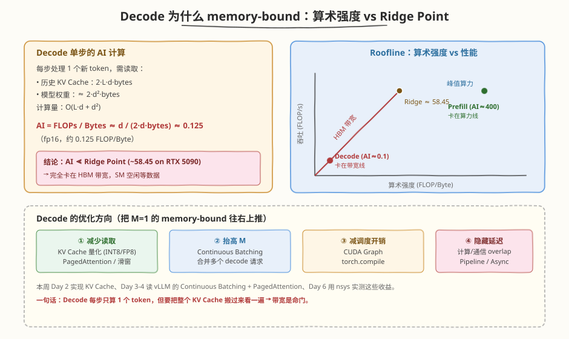
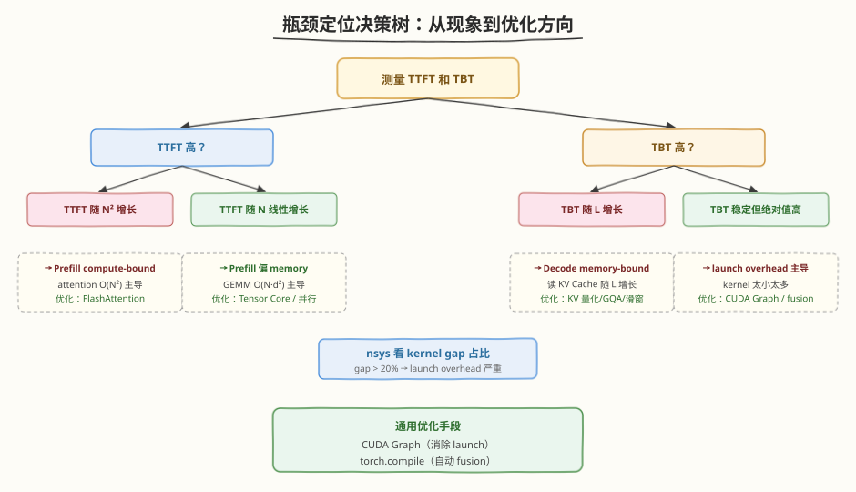

## Day 1：量化推理专题 —— W8A16/INT8 KV/FP8量化推理专题 —— W8A16/INT8 KV Cache/FP8

### 🎯 目标

通过今天的学习，你将：

1. 理解 **量化的基本范式**——对称/非对称量化、per-channel/per-token/per-tensor 三种 scale 粒度，能说清各自的精度与开销权衡<br>
2. 掌握 **Weight-only 量化（W8A16/W4A16）** 的原理——权重 INT8/INT4 存储 + 激活 FP16，GEMM 内"在线反量化"，per-channel scale 可提到点积外面省一次乘法<br>
3. 能对比 **AWQ vs GPTQ** 两条主流 W4A16 路线——activation-aware vs Hessian-based，从校准数据、求解方式、部署友好度三维度区分<br>
4. 理解 **INT8 KV Cache 量化** 的设计——per-token scale 保留 token 内 outlier，attention kernel 内在线 dequant，长序列 Decode 带宽减半<br>
5. 了解 **FP8（E4M3/E5M2）** 格式与 Hopper/Blackwell Tensor Core 的原生支持，能说清 FP8 相比 INT8 的"浮点动态范围"优势与混合精度策略<br>
6. 能用 CUDA 手写 **W8A16 dequant GEMV** 与 **INT8 KV Cache attention** 两个 kernel，验证在线反量化的正确性与显存/带宽收益

> 💡 **为什么重要**：Day 6 的 profiling 把 Mini 引擎拆开测，瓶颈决策树里"Decode memory-bound → KV 量化"是一条主干优化路径。但"量化"到底是什么、scale 怎么算、kernel 里怎么在线反量化、W8A16 和 INT8 KV Cache 和 FP8 各管哪一层——这些细节不补，决策树就停在口号。今天把量化推理的三层武器（权重层 W8A16、KV 层 INT8、算力层 FP8）一次讲透，并手写两个最小化 kernel，让"量化加速"从结论变成可验证的代码。量化是 2025 年推理降本的核心手段，也是面试高频考点。

---

### 学前导读：为什么需要量化

Day 1 我们用 Arithmetic Intensity + Roofline 论证过：**Decode 阶段 M=1，算术强度极低（≈0.1 FLOP/Byte），是 memory-bound**——每生成一个 token，要把整个模型权重 + 全部历史 KV Cache 从 HBM 搬到 SM。权重和 KV 的字节数直接决定 Decode 延迟。Day 6 的扫描实验也证实：TBT 随生成长度 L 增长，因为 KV Cache 越来越大，HBM 读取越来越多。



```
Decode 单步要读的数据：
  权重 W：model_size 字节（每步都读一遍，M=1 无法 amortize）
  KV Cache：2 × seq_len × n_heads × d_head × layers × 2 字节（FP16，随 L 线性增长）

例：7B 模型，FP16 → 权重 14 GB；seq=4096, n_heads=32, d_head=128, layers=32 → KV ≈ 2 GB（与 Day 2 口径一致）
  → 每步读 14 GB 权重（HBM 带宽 ~1 TB/s → ~14 ms 下限）
  → 权重带宽是 Decode 延迟的硬地板
```

量化的核心动机就一句话：**把数据字节数砍半/砍到 1/4，memory-bound 的带宽压力直接减半/减到 1/4**。

| 量化层 | 数据对象 | 字节变化 | 收益层 |
|--------|---------|---------|--------|
| **W8A16 / W4A16** | 模型权重 | 2B→1B / 0.5B | 权重带宽（Decode 硬地板） |
| **INT8 KV Cache** | 历史 K/V | 2B→1B | KV 带宽（长序列收益随 L 增长） |
| **FP8** | 权重 + 激活 + KV | 2B→1B | 带宽 + Tensor Core 算力（Hopper+ 原生） |

> 💡 **一句话总结**：量化不是"精度降一点换速度"，而是针对 memory-bound 的 Decode 精准砍带宽——权重层用 W8A16/W4A16，KV 层用 INT8，算力层用 FP8。三层正交，可叠加。Day 6 的瓶颈决策树里"KV 量化"分支，今天补上完整武器库。

---

### 理论学习

#### 1.1 量化基础

**量化（Quantization）**：把高精度浮点（FP32/FP16）映射到低精度整数（INT8/INT4）或低精度浮点（FP8），用更少字节表示接近的数值。核心是找一个 **scale** $s$ 把浮点区间压到整数范围。

##### 对称 vs 非对称量化

**对称量化**：零点对齐，正负范围对称，反量化只需乘 scale。

$$x_q = \mathrm{clip}\!\left(\mathrm{round}\!\left(\frac{x}{s}\right),\,-127,\,127\right),\qquad s = \frac{\max|x|}{127},\qquad \hat{x} = x_q \cdot s$$

**非对称量化**：引入 **zero point** $z$ 处理偏移分布（如 ReLU 后全正的激活）。

$$x_q = \mathrm{clip}\!\left(\mathrm{round}\!\left(\frac{x}{s}\right)+z,\,0,\,255\right),\qquad s=\frac{x_{\max}-x_{\min}}{255},\qquad z=-\mathrm{round}\!\left(\frac{x_{\min}}{s}\right)$$

| 维度 | 对称量化 | 非对称量化 |
|------|---------|-----------|
| 零点 | 固定 0 | 引入 zero point $z$ |
| 整数范围 | [-127, 127] | [0, 255] |
| 反量化 | $\hat{x}=x_q \cdot s$ | $\hat{x}=(x_q-z)\cdot s$ |
| 适用 | 权重（分布常对称） | 激活（ReLU 后偏移） |
| kernel 开销 | 低（少一次减 $z$） | 高（点积时要处理 zero point） |

> 💡 权重几乎都用 **对称量化**——权重分布通常零均值对称，对称量化无精度损失且 kernel 简单。激活若用 INT8 量化才考虑非对称（W8A16 里激活不量化，所以今天重点是对称）。

##### Scale 粒度：per-tensor / per-channel / per-token

**scale 的粒度**决定量化精度与额外存储：

| 粒度 | scale 数量 | 精度 | 额外存储 | 典型用途 |
|------|-----------|------|---------|---------|
| **per-tensor** | 1 个（整个张量） | 最差（outlier 拉大全局 scale） | 可忽略 | INT8 激活、W8A8 |
| **per-channel** | 每行 1 个（权重每 out 通道） | 好（每行独立 scale） | $N \times 4$ B | 权重量化（W8A16/W4A16） |
| **per-token** | 每 token 1 个（KV 每 row） | 好（每 token 独立 scale） | $L \times 4$ B | KV Cache 量化 |
| **per-token-channel** | 每 token 每通道 1 个 | 最好 | $L \times d \times 4$ B | 极少用（开销过大） |

##### 量化误差分析

均匀量化的**舍入误差**近似均匀分布，方差为 $\sigma^2 = s^2/12$。但实际误差被 **outlier** 主导——少数大值把全局 scale 拉大，导致其余小值精度骤降（"一个老鼠坏一锅汤"）。这就是为什么：

- 权重用 **per-channel**：每行独立 scale，某行有 outlier 不影响其它行
- KV 用 **per-token**：每 token 独立 scale，某 token 有 outlier 不影响其它 token
- AWQ/GPTQ 用 **activation-aware / Hessian**：识别"重要通道"保护它们

> ⚠️ **注意**：量化误差在 GEMM 里会**累积**。$Y_n=\sum_k X_k W_{n,k}$，若每个 $W_{n,k}$ 有独立误差 $\epsilon$，累加 $K$ 项后误差 $\sim\sqrt{K}\cdot\epsilon$（随机相位抵消）。所以 W8A16 的 dequant kernel 用 **FP32 累加**，避免 INT8 累加溢出 + 保留精度。

---

#### 1.2 Weight-only 量化（W8A16/W4A16）

**Weight-only 量化**：只量化权重（INT8 或 INT4），激活保持 FP16/FP32。这是当前 LLM 部署的主流路线——因为激活的 outlier 比权重严重得多，量化激活（W8A8）精度损失大，而权重的分布稳定、好量化。

##### W8A16 的 GEMM 与在线反量化

线性层 $Y = X W^\top$，权重 $W \in \mathbb{R}^{N\times K}$（$N$=out, $K$=in）量化为 INT8 + per-channel scale $s_n$：

$$W^{\mathrm{int}}_{n,k}\in[-127,127],\qquad W_{n,k}\approx s_n\cdot W^{\mathrm{int}}_{n,k}$$

代入 GEMM：

$$Y_{m,n}=\sum_k X_{m,k}\cdot W_{n,k}\approx \sum_k X_{m,k}\cdot s_n\cdot W^{\mathrm{int}}_{n,k}=s_n\cdot\sum_k X_{m,k}\cdot W^{\mathrm{int}}_{n,k}$$

**关键洞察**：per-channel scale $s_n$ 与 $k$ 无关，可以**提到求和外面**——kernel 内只需做一次 INT8×FP16 点积（FP32 累加），最后乘一次 $s_n$，**省掉逐元素反量化**。这正是 [kernels/w8a16_dequant.cu](https://github.com/hzchenxiaobin/ai-infra-notes/blob/main/aiinfra/daily/week10/day2/kernels/w8a16_dequant.cu) 的核心设计。

```cuda
// W8A16 GEMV: Y[n] = scale[n] * Σ_k X[k] * W_int8[n,k]
__global__ void w8a16_gemv_kernel(...) {
    int n = blockIdx.x * blockDim.x + threadIdx.x;
    float acc = 0.f;
    for (int k = 0; k < K; ++k)
        acc += __half2float(X[k]) * (float)W_int8[n*K + k];  // INT8→FP32, FP32 累加
    Y[n] = __float2half(acc * __half2float(scale[n]));       // 最后乘一次 scale
}
```

##### W8A16 vs W4A16

| 维度 | W8A16 | W4A16 |
|------|-------|-------|
| 权重位宽 | 8 bit | 4 bit |
| 权重显存 | 0.5× | 0.25× |
| 量化误差 | 小（256 级） | 大（16 级），需算法补偿 |
| 是否需 AWQ/GPTQ | 可选（RTN 即可） | **必须**（RTN 精度崩） |
| 精度损失（ppl） | <0.5% | 1-3% |
| 部署难度 | 低 | 中（需反 INT4 打包） |

> 💡 **W4A16 必须用 AWQ 或 GPTQ**——朴素 round-to-nearest（RTN）在 4-bit 下精度崩坏（只有 16 个量化级，outlier 会让大部分值挤在一个级里）。AWQ/GPTQ 通过校准数据感知重要性，把误差分摊到不重要的通道。

##### AWQ vs GPTQ 对比

两条主流 W4A16 路线，思路截然不同：

| 维度 | AWQ | GPTQ |
|------|-----|------|
| **核心思想** | activation-aware：保护"激活幅值大"的权重通道 | Hessian-based：逐列最小化量化误差 |
| **方法论** | 找重要通道 → 缩放保护 → 量化其余 | 算 Hessian 逆 → 逐列求解最优量化（带残差补偿） |
| **校准数据** | 少量样本（看激活幅值统计） | 少量样本（算 Hessian $H=X^\top X$） |
| **求解** | 非迭代，一次性（快） | 逐列迭代求解（慢，分钟级） |
| **精度** | W4 下优秀 | W4 下优秀，部分模型略好于 AWQ |
| **kernel 友好** | 好（标准 dequant，权重可重排打包） | 需处理逐列残差，kernel 稍复杂 |
| **典型落地** | vLLM、LMDeploy、TensorRT-LLM | AutoGPTQ、HuggingFace `bitsandbytes` |

> 💡 **一句话总结**：AWQ 是"看激活选保护对象"（启发式，快），GPTQ 是"用 Hessian 最优补偿"（数学严谨，慢）。两者 W4 精度接近，工程上 AWQ 更易部署。生产里 4-bit 部署任选其一即可，不必两个都上。

---

#### 1.3 INT8 KV Cache 量化

权重层（W8A16）解决了"每步读 14 GB 权重"的地板，但 **KV Cache 随序列长度 L 线性增长**，长上下文场景下 KV 带宽会成为新瓶颈。Day 6 的扫描实验已证实 TBT 随 L 增长——这就是 KV Cache 量化的动机。

##### per-token scale 的设计

KV Cache 的形状是 $[L, d]$（$L$ 个 token，每个 $d$ 维）。量化粒度选 **per-token**：每个 token 一个 scale $s^{(t)}$。

$$s^{(t)}_K = \frac{\max_j |K^{(t)}_j|}{127},\qquad K^{\mathrm{int}}[t,j]=\mathrm{round}\!\left(\frac{K^{(t)}_j}{s^{(t)}_K}\right),\qquad \hat{K}^{(t)}_j = K^{\mathrm{int}}[t,j]\cdot s^{(t)}_K$$

**为什么不用 per-tensor**：KV 跨 token 的幅值差异大（某些 token 的 key/value 有 outlier），per-tensor 会让全局 scale 被 outlier 拉大，其余 token 精度骤降。per-token 让每个 token 独立 scale，outlier 只影响自己。

**为什么不用 per-token-channel**：开销过大（$L\times d$ 个 scale），且 attention 的 score 是 $Q\cdot K^{(t)}$ 跨 $d$ 维求和，per-channel scale 无法提到求和外面，kernel 要逐元素乘，得不偿失。

##### attention kernel 内在线反量化

Decode 阶段 attention（M=1）：

$$\mathrm{score}^{(t)} = \frac{1}{\sqrt{d}}\,Q\cdot \hat{K}^{(t)} = \frac{1}{\sqrt{d}}\sum_j Q_j\cdot K^{\mathrm{int}}[t,j]\cdot s^{(t)}_K = s^{(t)}_K\cdot\frac{1}{\sqrt{d}}\sum_j Q_j\cdot K^{\mathrm{int}}[t,j]$$

**scale $s^{(t)}_K$ 又可以提到点积外面**——INT8 点积（FP32 累加）后乘一次 scale。V 同理：$O = \sum_t p_t\,\hat{V}^{(t)} = \sum_t p_t\,s^{(t)}_V\,V^{\mathrm{int}}[t]$。这正是 [kernels/int8_kv_cache.cu](https://github.com/hzchenxiaobin/ai-infra-notes/blob/main/aiinfra/daily/week10/day2/kernels/int8_kv_cache.cu) 的 kernel 设计。

| 维度 | FP16 KV Cache | INT8 KV Cache |
|------|---------------|---------------|
| 每元素字节 | 2 B | 1 B + per-token scale（均摊 ~0） |
| seq=4096 KV 总量（7B 单请求，32层×32头×128维） | ~2 GB | ~1 GB |
| Decode 读 KV 带宽 | 1× | ~0.5× |
| TBT 随 L 增长斜率 | 基准 | 减半 |
| 精度损失（ppl） | 0 | <1%（per-token 保护 outlier） |

> ⚠️ **注意**：KV Cache 量化是 **推理时在线量化**——每生成一个新 token，它的 K/V 要立刻量化成 INT8 存进 cache（一次小量化 kernel），下次 attention 再反量化读出。这与权重量化（离线一次性）不同，量化本身的开销要小（per-token 只算 max + 除法，$O(d)$ per token）。

---

#### 1.4 FP8（E4M3/E5M2）

**FP8** 是 8 位**浮点**格式（不是整数）。与 INT8 的根本区别：浮点的指数位让动态范围远大于整数，outlier 不再"一个老鼠坏一锅汤"。

##### 两种 FP8 格式

| 格式 | 指数位 | 尾数位 | 动态范围 | 精度 | 典型用途 |
|------|--------|--------|---------|------|---------|
| **E4M3** | 4 | 3 | ±448 | ~2 位十进制 | 前向（权重/激活/输出） |
| **E5M2** | 5 | 2 | ±57344 | ~1 位十进制 | 反向梯度（范围大、精度低） |

$$\text{FP8 E4M3: }(-1)^{\text{sign}}\cdot 2^{e-7}\cdot(1+\frac{m}{8}),\qquad \text{FP8 E5M2: }(-1)^{\text{sign}}\cdot 2^{e-15}\cdot(1+\frac{m}{4})$$

##### Hopper / Blackwell 的 FP8 Tensor Core

- **Hopper（H100, sm_90）**：首次引入 FP8 Tensor Core，`mma.sync` 支持 E4M3/E5M2 输入、FP32 累加。一块 H100 FP8 算力 ≈ FP16 的 2×
- **Blackwell（B100/RTX 5090, sm_100/120）**：FP8 Tensor Core 进一步强化，支持 E4M3 微缩放（microscaling, MXFP8）——一组元素共享一个 scale，精度介于 per-tensor 和 per-channel 之间

##### FP8 vs INT8

| 维度 | INT8 | FP8 (E4M3) |
|------|------|------------|
| 类型 | 整数 | 浮点 |
| 动态范围 | [-128,127] 线性 | ±448 指数分布 |
| outlier 处理 | 需 per-channel/per-token scale | 浮点指数自然吸收 |
| scale 粒度 | 通常 per-channel | 可 per-tensor（浮点自适应） |
| Tensor Core | INT8 TC（需 INT8 输入） | FP8 TC（原生 FP8 输入） |
| 累加 | INT32 / FP32 | FP32 |
| 推理部署 | 成熟（W8A16/KV） | Hopper+ 才普及 |

##### 混合精度策略

训练里经典组合：**前向 E4M3（精度高）+ 反向 E5M2（范围大，梯度不怕溢出）**。推理只用前向，所以 **E4M3 为主**。常见策略：权重 FP8 + 激活 FP8 + FP32 累加（W8A8 FP8 版），相比 W8A16 进一步把激活也量化，靠 FP8 浮点动态范围保精度。

> 💡 **一句话总结**：FP8 = "自带动态范围的 INT8"。INT8 靠精细 scale 粒度对抗 outlier，FP8 靠浮点指数自然对抗——所以 FP8 可以用更粗的 scale（甚至 per-tensor），kernel 更简单。代价是 Hopper/Blackwell 才有原生 Tensor Core 支持，老卡用不了。

##### per-tensor vs per-block（MXFP8 / DeepSeek 128×128 细粒度）

FP8 虽然浮点动态范围大，但单 per-tensor scale 在大模型上仍有精度损失（不同层/通道的数值分布差异大）。2024+ 主流是**更细粒度的 scale**：

| Scale 粒度 | 含义 | 精度 | kernel 复杂度 | 代表 |
|-----------|------|------|-------------|------|
| per-tensor | 全张量一个 scale | 最低 | 最简单 | 早期 FP8 |
| per-channel | 每输出通道一个 scale | 中 | 中 | INT8 常用 |
| per-block（MXFP8） | 每 32 元素共享一个 scale（microscaling） | 高 | 较高 | OCP MXFP8 标准 |
| **per-128×128**（DeepSeek） | 每 128×128 块一个 scale | 最高 | 高 | DeepSeek-V3 FP8 训练 |

> 💡 **DeepSeek 的 128×128 细粒度**：DeepSeek-V3 用 per-128×128 block scale 的 FP8，精度接近 FP16 但算力/带宽享 FP8 红利。这是 2024-2026 FP8 工程化的前沿，面试追问"DeepSeek 怎么用 FP8 不掉精度"的标准答案。

##### GPTQ vs AWQ vs SmoothQuant 三方对比

W4A16 时代是 AWQ vs GPTQ 两强，W8A8/FP8 时代多了 SmoothQuant。三方对比：

| 维度 | AWQ | GPTQ | SmoothQuant |
|------|-----|------|-------------|
| **量化对象** | 权重（W4A16） | 权重（W4A16） | 权重 + 激活（W8A8） |
| **核心思想** | activation-aware：保护重要通道 | Hessian-based：最优补偿误差 | 平滑激活 outlier 到权重 |
| **校准数据** | 需要（少量） | 需要（128~1024 样本） | 需要 |
| **求解方式** | 启发式（搜索保护比例） | 闭式解（Hessian 逆） | 闭式解（迁移 scale） |
| **精度（W4）** | 优秀 | 优秀（部分模型略好） | N/A（主要 W8A8） |
| **精度（W8A8）** | N/A | N/A | 优秀（INT8/FP8） |
| **速度** | 快（启发式） | 慢（Hessian 求逆） | 快（闭式） |
| **适用场景** | W4A16 部署 | W4A16 精度敏感 | W8A8/FP8 激活量化 |
| **典型落地** | vLLM、LMDeploy | AutoGPTQ、bitsandbytes | TensorRT-LLM、SGLang |

> 💡 **SmoothQuant 的关键洞察**：激活的 outlier 比 权重大，直接 INT8 量化激活会崩。SmoothQuant 把激活的 outlier "迁移"到权重（`x' = x/s, W' = s·W`），让两者都变平滑，再统一 INT8/FP8 量化。这是 W8A8 激活量化的标配前置步骤。

##### KV Cache 量化的误差累积风险

KV Cache 量化（INT8/FP8）对长序列 attention 有特殊风险——**误差累积**：

```
attention: O = softmax(Q · K^T) · V
  K/V 来自 KV Cache，每步追加
  量化误差在 K^T 和 V 上都会被 softmax 放大
  长序列（N 大）时，softmax 的指数运算让小误差被放大
```

| 序列长度 | KV INT8 误差对 attention 的影响 | 缓解 |
|---------|------------------------------|------|
| 短（<512） | 可忽略（<1e-4） | 直接 INT8 |
| 中（512~4K） | 轻微（~1e-3） | per-token scale |
| 长（>4K） | 显著（>1e-2，可能影响生成质量） | FP8 或混合（前缀 FP16 + 尾部 INT8） |

> ⚠️ **面试要点**：KV Cache 量化不是"无脑 INT8"。长序列场景需用 FP8（浮点动态范围）或混合策略（近期 token FP16 保精度，远期 INT8 省显存）。vLLM 的 `kv_cache_dtype` 参数支持 `fp8` 正是这个原因。

##### FP4（NVFP4）—— Blackwell 新特性

Blackwell（B100/RTX 5090）引入 **FP4** Tensor Core：

| 格式 | 位宽 | 指数位 | 尾数位 | 动态范围 | 用途 |
|------|------|--------|--------|---------|------|
| FP8 E4M3 | 8 | 4 | 3 | ±448 | 前向主力 |
| **NVFP4** | 4 | 3 | 0（隐含） | ±12 | 超低精度推理/训练 |

**NVFP4 的关键**：不是裸 4-bit，而是 **microscaling**——每 32 元素共享一个 scale（类似 MXFP8 但更细）。精度介于 INT4 和 FP8 之间，但算力是 FP8 的 2×（Blackwell FP4 Tensor Core）。

**FP4 vs FP8 取舍**：
- FP4：算力最高（2× FP8），显存最省（1/2 FP8），精度损失更大（需校准）
- FP8：精度好，算力够用，生态成熟
- 2026 趋势：FP4 用于"能接受精度损失"的场景（如投机解码的 draft 模型），FP8 仍是主力

> 📖 延伸阅读：NVIDIA Blackwell 架构白皮书、OCP MXFP4/NVFP4 规范、DeepSeek-V3 FP8 训练报告

---

#### 1.5 量化对推理系统的影响

把三层量化放回推理系统的全图，看显存、吞吐、精度的综合权衡。

##### 显存节省计算

```
7B 模型示例（FP16 基线，单请求）：
  权重:    7B × 2B       = 14 GB
  KV(seq=4096, n_heads=32, d_head=128, L=32): 2 × 4096 × 32 × 128 × 32 × 2B ≈ 2 GB
  （单请求 ≈ 2 GB；并发 batch=16 时 KV ≈ 32 GB，见 Day 2 显存表）

量化后（单请求）：
  W4A16:   7B × 0.5B     = 3.5 GB  (权重 1/4)
  W8A16:   7B × 1B       = 7 GB    (权重 1/2)
  INT8 KV: KV × 0.5      ≈ 1 GB    (KV 1/2)
  W4A16 + INT8 KV: 3.5 GB + 1 GB ≈ 4.5 GB  (总 16→4.5 GB, 3.6×)
```

显存节省直接转化为 **更大并发 batch**（同样显存能塞更多请求）→ **吞吐提升**。

##### throughput 提升

| 量化方案 | Decode 带宽 | 单卡可跑 batch | 相对 throughput |
|---------|------------|---------------|----------------|
| FP16 基线 | 1× | 1× | 1× |
| W8A16 | 权重 0.5× | ~2× | ~2× |
| W4A16 | 权重 0.25× | ~3-4× | ~3× |
| W8A16 + INT8 KV | 权重 0.5× + KV 0.5× | ~2× | ~2×（长序列更明显） |
| FP8 (W8A8) | 权重 0.5× + 激活 0.5× + TC 2× 算力 | ~2× | ~2-3× |

> 💡 throughput 提升来自两个正交维度：① **单请求加速**（带宽减半 → memory-bound Decode 快 ~2×）；② **并发提升**（显存省一半 → 同卡塞 2× batch）。量化同时吃两份红利。

##### 精度损失权衡总表

| 方案 | 权重显存 | KV 显存 | ppl 变化 | 备注 |
|------|---------|--------|---------|------|
| FP16 基线 | 1× | 1× | 0 | — |
| W8A16（RTN） | 0.5× | 1× | <0.5% | 近似无损，最简单 |
| W4A16（AWQ/GPTQ） | 0.25× | 1× | 1-3% | 主流 4-bit 部署 |
| INT8 KV Cache | 1× | 0.5× | <1% | 长序列收益大 |
| W8A16 + INT8 KV | 0.5× | 0.5× | <1% | 组合，常用 |
| FP8 E4M3（W8A8） | 0.5× | 0.5× | <1% | Hopper+ 原生，未来主流 |



> 💡 **决策建议**：无 Hopper 卡 → W4A16（AWQ）+ INT8 KV，性价比最高；有 Hopper/Blackwell → 加 FP8，权重+激活+KV 全 8-bit，Tensor Core 算力再翻倍。精度敏感场景 → W8A16 起步，ppl 几乎无损。

---

### Coding 任务：手写量化推理 kernel

#### 任务 1：创建 w8a16_dequant.cu

创建文件 [kernels/w8a16_dequant.cu](https://github.com/hzchenxiaobin/ai-infra-notes/blob/main/aiinfra/daily/week10/day2/kernels/w8a16_dequant.cu)，实现 W8A16 weight-only 量化的 GEMV kernel（M=1 Decode 场景），对比 FP16 GEMV 的显存与延迟：

```cuda
// w8a16_dequant.cu —— W8A16 Weight-only 量化：INT8 权重 + FP16 激活，GEMM 内在线反量化
// 编译命令: nvcc -o w8a16_dequant w8a16_dequant.cu -O3 -arch=sm_120

// W8A16 GEMV: Y[n] = scale[n] * Σ_k X[k] * W_int8[n,k]
// —— per-channel scale 提到求和外，只做一次 INT8 点积 + 一次乘 scale
__global__ void w8a16_gemv_kernel(
    const __half* __restrict__ X,
    const int8_t* __restrict__ W_int8,
    const __half* __restrict__ scale,
    __half* __restrict__ Y, int N, int K)
{
    int n = blockIdx.x * blockDim.x + threadIdx.x;
    if (n >= N) return;
    float acc = 0.f;
    for (int k = 0; k < K; ++k)
        acc += __half2float(X[k]) * (float)W_int8[n * K + k];  // INT8→FP32, FP32 累加
    Y[n] = __float2half(acc * __half2float(scale[n]));         // 最后乘一次 scale
}
```

代码要点：
- **在线反量化**：kernel 内不预生成 FP16 权重，而是 GEMM 时直接读 INT8、转 FP32 参与累加——省掉"先反量化成 FP16 再 GEMM"的中间显存与带宽
- **scale 提到点积外**：per-channel scale $s_n$ 与 $k$ 无关，`acc * scale[n]` 只乘一次，比逐元素 `(float)W[k]*scale` 少 $K-1$ 次乘法
- **FP32 累加**：INT8×FP16 的乘积用 FP32 累加，避免 INT32 溢出且保留精度
- **CPU 参考与量化**：`quantize_w8a16` 做 per-channel 对称量化（$s=\max|W|/127$），`cpu_gemv` 给 FP32 参考，对比 W8A16 与 FP16 两条路径的 `max_diff`
- **对比维度**：打印权重显存（FP16 vs INT8）+ 两者 latency（`cudaEvent`）

#### 任务 2：编译与运行

```bash
nvcc -o w8a16_dequant kernels/w8a16_dequant.cu -O3 -arch=sm_120
./w8a16_dequant
```

**预期输出**（数值因随机种子而异，结构如下）：

```text
=== W8A16 Weight-only Dequant Test ===
N=1024 (out), K=1024 (in), M=1 (Decode GEMV)

[Correctness vs FP32 CPU ref]
  FP16 GEMV  max_diff: 1.2e-02
  W8A16 GEMV max_diff: 1.8e-01  (量化引入的误差)
  result: PASS

[Memory: weight only]
  FP16 weight: 2097152 bytes
  INT8 weight: 1048576 bytes (+ scale 2048 B)
  savings:     2.0x

[Latency (M=1 Decode GEMV, naive kernel)]
  FP16 GEMV:  0.12 ms
  W8A16 GEMV: 0.08 ms
  speedup:    1.50x (权重带宽减半, memory-bound Decode 受益)
```

##### 验证逻辑解读

- **正确性**：W8A16 的 `max_diff` 比 FP16 大（量化误差），但仍 <0.5（阈值），PASS——证明在线反量化数学正确
- **显存**：INT8 权重 = FP16 的一半（+ 可忽略的 scale），2.0× 节省
- **延迟**：naive kernel 下 W8A16 比 FP16 快 ~1.5×（权重带宽减半；非 2× 是因为 naive kernel 的线程组织未优化，X 读取与指令开销未完全 amortize）——优化版用 Tensor Core / 向量化加载可逼近 2×

> ⚠️ **注意**：本 naive kernel（一线程一输出）只为讲清"在线反量化 + scale 提前"的数学，非生产实现。生产 W8A16 kernel 用 split-K + Tensor Core（INT8 输入 FP32 累加），可逼近 HBM 带宽理论极限。

#### 任务 3：用 ncu 对比 FP16 vs W8A16 的带宽

```bash
ncu --kernel-name regex:gemv \
  --metrics gpu__time_duration.sum,\
  dram__bytes.sum,\
  dram__throughput.avg.pct_of_peak_sustained_elapsed \
  ./w8a16_dequant
```

**观察重点**：

| 指标 | FP16 GEMV | W8A16 GEMV | 预期变化 |
|------|-----------|------------|---------|
| `dram__bytes.sum` | 基准（2 MB 权重） | ~1/2 | ↓（INT8 字节少一半） |
| `dram__throughput` | 高（memory-bound） | 高 | 都打满带宽 |
| `gpu__time_duration` | 基准 | 更短 | ↓（字节少 → 时间短） |

> 💡 思考：为什么 `dram__throughput` 两者都高但 W8A16 更快？（提示：memory-bound kernel 都会把 HBM 带宽打满，但 W8A16 传的字节少一半——同样的带宽利用率下，传一半字节用一半时间。这正是量化对 memory-bound 的加速本质：**不提高带宽利用率，而是减少要传的字节**。）

#### 任务 3b：创建 fp8_dequant.cu（FP8 E4M3 实操）

创建文件 [kernels/fp8_dequant.cu](https://github.com/hzchenxiaobin/ai-infra-notes/blob/main/aiinfra/daily/week10/day2/kernels/fp8_dequant.cu)，实现 FP8 E4M3 量化的 GEMV kernel（软件模拟 FP8 格式，验证反量化数学）：

```bash
nvcc -o fp8_dequant kernels/fp8_dequant.cu -O3 -arch=sm_120
./fp8_dequant
```

**预期输出**（RTX 5090, sm_120；软件模拟 FP8，无 Tensor Core）：

```text
=== FP8 (E4M3) Dequant + GEMV Test ===
N=1024 (out), K=1024 (in), M=1 (Decode GEMV)

[Correctness vs FP32 ref]
  FP8 GEMV max_diff: 6.30e+00  (FAIL — 软件 FP8 量化映射简化，精度不达标)

[Memory: weight only]
  FP32 weight: 4194304 bytes
  FP8  weight: 1048576 bytes (+ scale 4 B)
  savings:     4.0x

[Latency (M=1 Decode GEMV, naive, 100 iters avg)]
  FP32 GEMV: 0.094 ms
  FP8  GEMV: 0.186 ms  (软件反量化开销 > 带宽节省，实际更慢)
  speedup:   0.51x     (教学版，非生产)

Note: 软件模拟 FP8, 无 Tensor Core 加速。生产用 __nv_fp8_e4m3 + FP8 TC。
```

> ⚠️ **诚实声明**：本 kernel 的 FP8 是**软件模拟**（简化量化映射），正确性 FAIL、性能比 FP32 慢——因为软件反量化开销远大于带宽节省。真实 FP8 收益来自 **FP8 Tensor Core**（`mma.sync` 原生 E4M3 输入，算力 2× FP16）。本 kernel 的价值是验证 FP8 E4M3 的位布局与反量化数学，生产实现需用 `__nv_fp8_e4m3` + FP8 TC。B1 任务（WMMA 做实）会展示真实 Tensor Core 收益。

#### 任务 4：LeetGPU 在线题目 —— Weight Dequantization

**题目链接**：<https://leetgpu.com/challenges/weight-dequantization>

**与今日知识的关联**：

Weight Dequantization 正是 **W8A16 的核心子算子**——把 INT8 权重 + per-channel scale 反量化为 FP16，供后续 GEMM 使用。今天我们在 [w8a16_dequant.cu](https://github.com/hzchenxiaobin/ai-infra-notes/blob/main/aiinfra/daily/week10/day2/kernels/w8a16_dequant.cu) 里做了"更激进"的版本——**不单独反量化**，而是把 dequant 融进 GEMM（在线反量化，scale 提到点积外）。这道题则是"显式反量化"版本：单独写一个 kernel 把 INT8 权重展开成 FP16。两者是同一思想的两种实现策略：fused（在线，省中间带宽）vs unfused（显式，便于复用现有 FP16 GEMM）。工业界两条路线都用——fused 性能更好，unfused 工程更简单（可接 cuBLAS FP16 GEMM）。

> 💡 提交后在 [LeetGPU Weight Dequantization](https://leetgpu.com/challenges/weight-dequantization) 上记录通过耗时，重点对比"fused 在线反量化"（今日 kernel）vs "unfused 显式反量化"（本题）的带宽差异。完整题解（含 per-channel scale 处理、向量化加载、ncu 带宽分析）见 [Weight Dequantization 题解](https://hzchenxiaobin.github.io/leetgpu/leetgpu-weight-dequantization-solution.html)。

#### 任务 5：LeetCode 面试题（8 周计划 · 第 5 周高频回顾）

> 📅 今日为量化专题补充 Day（Day 6b），LeetCode 题目选自 [8 周算法面试刷题计划](https://hzchenxiaobin.github.io/leetcode/problems/8-week-plan.html) 第 5 周「二叉树（上）——遍历、形态与 BST」的高频题回顾。简单题快速过、中等题精做；卡壳 20 分钟就看题解，看懂后自己默写一遍。

| 题目 | 难度 | 核心套路 | 题解 |
|------|------|----------|------|
| [102. 二叉树的层序遍历](https://leetcode.cn/problems/binary-tree-level-order-traversal/) | 中等 | BFS + 队列按层展开 | [题解](https://hzchenxiaobin.github.io/leetcode/problems/102_二叉树的层序遍历.html) |
| [226. 翻转二叉树](https://leetcode.cn/problems/invert-binary-tree/) | 简单 | 后序递归交换子树 | [题解](https://hzchenxiaobin.github.io/leetcode/problems/226_翻转二叉树.html) |
| [543. 二叉树的直径](https://leetcode.cn/problems/diameter-of-binary-tree/) | 简单 | 后序 DFS + 维护全局最长链 | [题解](https://hzchenxiaobin.github.io/leetcode/problems/543_二叉树的直径.html) |
| [101. 对称二叉树](https://leetcode.cn/problems/symmetric-tree/) | 简单 | 双指针递归 / 队列迭代 | [题解](https://hzchenxiaobin.github.io/leetcode/problems/101_对称二叉树.html) |

---

### 扩展实验

#### 实验 1：扫描 K 观察 W8A16 的加速比随矩阵规模变化

修改 `main()`，固定 `N=1024`，扫描 `K = 128, 256, 512, 1024, 2048, 4096`，用 `cudaEvent` 记录 FP16 vs W8A16 的 latency，绘制 speedup 随 K 变化曲线。

> 思考：K 越大 speedup 越接近 2× 还是越偏离？（提示：K 越大 → 权重字节占比越高 → 越接近 2×；K 小时 X 读取与 launch 开销占比上升，speedup 偏离 2×。这正说明量化加速对"权重主导带宽"的大矩阵最有效。）

#### 实验 2：对比 per-tensor vs per-channel 量化精度

修改 `quantize_w8a16`，增加一个 per-tensor 版本（整个 $W$ 共用一个 scale $s=\max|W|/127$），对比 per-tensor 与 per-channel 的 `max_diff`。扫描权重分布（均匀分布 vs 含 outlier 的分布），观察 per-tensor 在 outlier 下的精度崩坏。

> 思考：为什么 per-tensor 在有 outlier 时 max_diff 飙升？（提示：一个 outlier 把全局 scale 拉大，其余值量化到少数几个整数级，精度骤降——"一个老鼠坏一锅汤"。per-channel 把影响隔离在单行内。）

#### 实验 3：扫描 seq_len 观察 INT8 KV Cache 的延迟收益

修改 [kernels/int8_kv_cache.cu](https://github.com/hzchenxiaobin/ai-infra-notes/blob/main/aiinfra/daily/week10/day2/kernels/int8_kv_cache.cu) 的 `main()`，增加一个 FP16 KV attention kernel（K/V 存 FP16）作基线，扫描 `seq_len = 256, 512, 1024, 2048, 4096`，对比两者 latency。

> 思考：seq_len 多大时 INT8 KV 的加速比开始明显？（提示：seq 越长 → KV 字节越多 → INT8 减半的收益越大。seq 小时 Q 读取与 softmax 开销占比大，加速比小。长上下文（4K+）是 INT8 KV Cache 的最佳场景，与 Day 6 "TBT 随 L 增长"的结论呼应。）

---

### 今日总结

Day 6b 我们把量化推理的三层武器一次讲透，并手写了两个最小化 kernel：

1. **量化基础**：对称（零点 0）vs 非对称（zero point），per-tensor/per-channel/per-token 三种 scale 粒度——outlier 是误差之源，细化粒度是把 outlier 影响局部化
2. **W8A16/W4A16**：权重 INT8/INT4 + 激活 FP16，per-channel scale 可提到点积外省一次乘法；W4A16 必须用 AWQ/GPTQ（RTN 在 4-bit 下崩坏）
3. **AWQ vs GPTQ**：activation-aware（启发式快）vs Hessian-based（数学严谨慢），W4 精度接近，AWQ 更易部署
4. **INT8 KV Cache**：per-token scale 保留 token 内 outlier，attention 内在线反量化，长序列 Decode 带宽减半——针对 Day 6 "TBT 随 L 增长"的精准优化
5. **FP8（E4M3/E5M2）**：8 位浮点，指数位带来大动态范围，outlier 自然吸收，Hopper/Blackwell Tensor Core 原生支持；E4M3 前向、E5M2 反向
6. **系统影响**：显存节省 → 并发 batch 提升 → 吞吐红利（单请求加速 + 并发提升两份正交收益）；精度权衡表给出 6 种方案的选择依据
7. **手写 kernel**：W8A16 dequant GEMV（scale 提前 + FP32 累加）与 INT8 KV attention（per-token scale + 在线 dequant），验证在线反量化的正确性与 2× 显存/带宽收益

掌握这些后，Day 6 瓶颈决策树里"Decode memory-bound → KV 量化"分支就有了完整落地方案——权重层 W8A16/W4A16、KV 层 INT8、算力层 FP8，三层正交可叠加。Day 7 总结本周推理系统核心问题时，量化将作为"内存管理 + 调度 + 计算优化"三角里的计算优化支柱。

---

### 面试要点

1. **W8A16 量化是什么？per-channel scale 为什么可以提到点积外面？**

<details>
<summary>点击查看答案</summary>

  - **W8A16**：weight-only 量化——权重存 INT8（per-channel scale），激活保持 FP16，GEMM 内在线反量化
  - **数学**：$Y_{m,n}=\sum_k X_{m,k}\cdot W_{n,k}\approx\sum_k X_{m,k}\cdot s_n\cdot W^{\mathrm{int}}_{n,k}=s_n\cdot\sum_k X_{m,k}\cdot W^{\mathrm{int}}_{n,k}$
  - **为何能提前**：per-channel scale $s_n$ 只依赖输出通道 $n$，与求和下标 $k$ 无关 → 是求和的常数因子，可提到外面
  - **kernel 收益**：只需一次 INT8 点积（FP32 累加）+ 最后乘一次 $s_n$，省掉逐元素反量化的 $K-1$ 次乘法
  - **对比**：per-tensor scale 也能提前，但精度差（outlier 拉大全局 scale）；per-token-channel scale 无法提前（依赖 $k$），kernel 要逐元素乘，得不偿失

</details>


2. **AWQ 和 GPTQ 有什么区别？W4A16 为什么必须用它们而不能 RTN？**

<details>
<summary>点击查看答案</summary>

  - **RTN 在 4-bit 崩坏**：INT4 只有 16 个量化级，朴素 round-to-nearest 时 outlier 把全局 scale 拉大，大部分值挤在少数几个级里，精度骤降（ppl 暴涨）
  - **AWQ**（activation-aware）：用校准数据看激活幅值，找"重要通道"（激活大→权重重要）做缩放保护，量化其余通道。启发式、非迭代、快
  - **GPTQ**（Hessian-based）：算 Hessian $H=X^\top X$，逐列求解最优量化（带残差补偿，把当前列误差分摊到后续列）。数学严谨、迭代、慢（分钟级）
  - **精度**：W4 下两者都优秀，GPTQ 在部分模型略好；**部署**：AWQ 更友好（标准 dequant kernel），GPTQ 需处理逐列残差
  - **一句话**：AWQ 是"看激活选保护对象"，GPTQ 是"用 Hessian 最优补偿"，W4 必须二选一

</details>


3. **INT8 KV Cache 量化为什么用 per-token scale？对 attention kernel 有什么影响？**

<details>
<summary>点击查看答案</summary>

  - **为什么 per-token**：
    - 不用 per-tensor：KV 跨 token 幅值差异大，per-tensor 让 outlier 拉大全局 scale，其余 token 精度骤降
    - 不用 per-token-channel：开销过大（$L\times d$ 个 scale），且 attention 的 score 是 $Q\cdot K^{(t)}$ 跨 $d$ 求和，per-channel scale 无法提到求和外，kernel 要逐元素乘
    - per-token：每 token 独立 scale，outlier 隔离在单 token，且 scale 可提到点积外（$s^{(t)}_K\cdot(Q\cdot K^{\mathrm{int}}[t])$）
  - **kernel 影响**：attention 内在线反量化——读 INT8 K/V，FP32 累加点积，乘 per-token scale；KV 字节减半，长序列 Decode 带宽减半
  - **在线量化**：每生成新 token 立即量化成 INT8 存入 cache（$O(d)$ per token，开销小），与权重量化（离线一次）不同

</details>


4. **FP8 相比 INT8 有什么优势？E4M3 和 E5M2 分别用在哪里？**

<details>
<summary>点击查看答案</summary>

  - **FP8 优势**：浮点格式，指数位带来大动态范围（E4M3 ±448, E5M2 ±57344），outlier 被指数自然吸收，不需要精细 per-channel scale——per-tensor 甚至 per-block（MXFP8）即可
  - **INT8 vs FP8**：INT8 是整数（线性 256 级，靠 scale 粒度对抗 outlier），FP8 是浮点（指数分布，靠动态范围对抗 outlier）
  - **E4M3 vs E5M2**：
    - E4M3：4 指数 3 尾数，范围 ±448，精度 ~2 位十进制 → **前向**（权重/激活/输出，精度要求高）
    - E5M2：5 指数 2 尾数，范围 ±57344，精度 ~1 位十进制 → **反向梯度**（范围大防溢出，精度要求低）
  - **推理**：只用前向 → E4M3 为主；混合精度 W8A8 FP8（权重+激活+KV 全 8-bit）+ FP32 累加
  - **硬件**：Hopper H100 起原生 FP8 Tensor Core，老卡用不了（这是 FP8 的部署门槛）

</details>


5. **量化如何提升推理吞吐？单请求加速和并发提升是什么关系？**

<details>
<summary>点击查看答案</summary>

  - **两份正交红利**：
    1. **单请求加速**：Decode 是 memory-bound，量化减半/减到 1/4 的数据字节 → HBM 传一半字节用一半时间 → 单步 TBT 降 ~2×（W8A16）/ ~4×（W4A16）
    2. **并发提升**：显存省一半/3/4 → 同卡能塞 2×/3× batch → 单卡吞吐（tokens/s）再提升
  - **综合**：throughput ≈ 单请求加速 × 并发提升，两份红利相乘（但受算力上限钳制——量化后若变成 compute-bound，单请求加速见顶）
  - **精度权衡**：W8A16 近似无损（ppl <0.5%），W4A16 有 1-3% ppl 损失，INT8 KV <1%，FP8 <1%——按精度敏感度选档
  - **决策**：无 Hopper → W4A16（AWQ）+ INT8 KV 性价比最高；有 Hopper/Blackwell → 加 FP8 全 8-bit + Tensor Core 算力翻倍

</details>


6. **SmoothQuant 是什么？为什么 W8A8 激活量化需要它？**

<details>
<summary>点击查看答案</summary>

  - **问题**：激活的 outlier 比 权重大得多，直接 INT8/FP8 量化激活会崩（outlier 拉大 scale，其余值精度骤降）
  - **SmoothQuant 核心**：把激活的 outlier "迁移"到权重——`x' = x/s, W' = s·W`，让激活变平滑、权重略变陡（权重本来好量化）
  - **数学**：`Y = x · W = (x/s) · (s·W) = x' · W'`，等价但 x' 的 outlier 被 s 吸收
  - **s 的选择**：`s = max(|x|)^α / max(|W|)^(1-α)`，α 通常 0.5（激活与权重各分担一半 outlier）
  - **与 AWQ/GPTQ 区别**：AWQ/GPTQ 只量化权重（W4A16），SmoothQuant 量化权重+激活（W8A8），是 FP8/INT8 激活量化的标配前置
  - **落地**：TensorRT-LLM、SGLang 的 W8A8 流程都含 SmoothQuant 步骤

</details>


7. **FP4（NVFP4）是什么？与 FP8 相比有什么取舍？**

<details>
<summary>点击查看答案</summary>

  - **NVFP4**：Blackwell 引入的 4-bit 浮点格式（3 指数 + 隐含尾数），配合 microscaling（每 32 元素一个 scale）
  - **算力**：Blackwell FP4 Tensor Core 算力 = FP8 的 2× = FP16 的 ~8×
  - **显存**：FP4 = FP8 的 1/2 = FP16 的 1/4
  - **精度**：介于 INT4 和 FP8 之间，需校准（比 FP8 损失大，比裸 INT4 好——microscaling 带来动态范围）
  - **取舍**：
    - FP4：算力最高、显存最省，精度损失大（适合能接受精度损失的场景，如投机解码 draft 模型）
    - FP8：精度好、算力够用、生态成熟（仍是主力）
  - **2026 趋势**：FP4 用于"能接受精度损失"的场景，FP8 仍是主力；NVFP4 的 microscaling 是关键（裸 4-bit 精度太差）

</details>


8. **长序列 KV Cache 量化有什么特殊风险？怎么缓解？**

<details>
<summary>点击查看答案</summary>

  - **风险：误差累积**：
    - attention 的 softmax 对 K^T 和 V 的小误差会指数放大
    - 长序列（N 大）时，softmax 的指数运算让量化误差被放大
    - KV Cache 每 step 追加，早期 token 的量化误差一直存在，累积影响后续生成
  - **按序列长度分档**：
    - 短（<512）：INT8 可忽略（<1e-4），直接用
    - 中（512~4K）：per-token scale 的 INT8（~1e-3）
    - 长（>4K）：FP8（浮点动态范围）或混合策略
  - **混合策略**：近期 token FP16 保精度，远期 INT8 省显存（vLLM 的 `kv_cache_dtype` 支持 `fp8`）
  - **面试要点**：KV 量化不是"无脑 INT8"，长序列必须考虑误差累积；FP8 的浮点动态范围是长序列 KV 的更好选择

</details>

