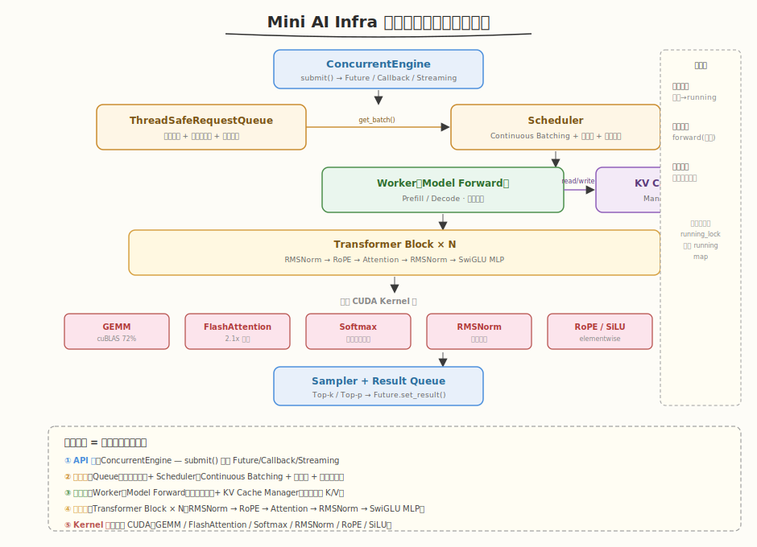
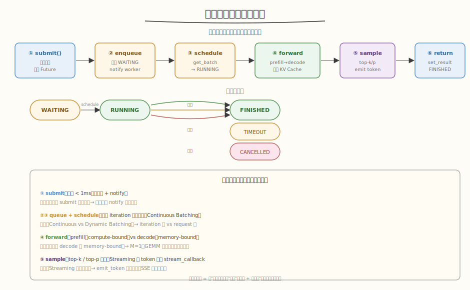
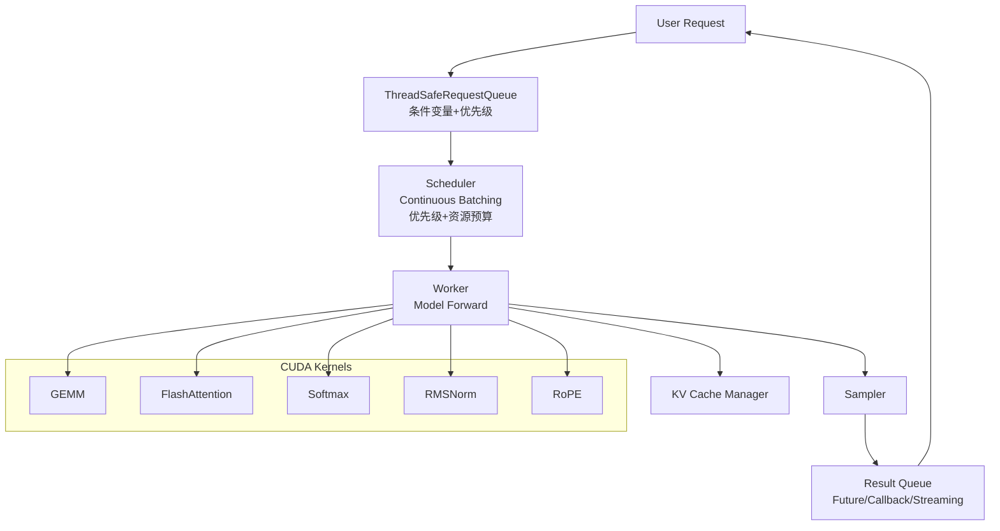
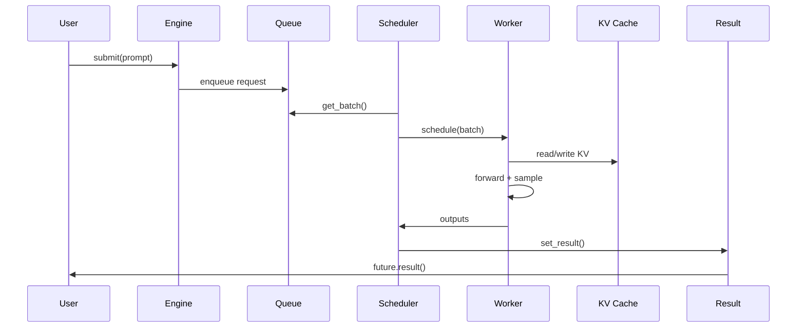

## Day 2：架构图与数据流图

### 🎯 目标

通过今天的学习，你将：

1. 理解 **系统架构图的五层分层设计**——API 层、调度层、执行层、模型层、Kernel 层，每层职责清晰、接口明确<br>
2. 掌握 **请求生命周期数据流图**——从 `submit()` 到 `set_result()` 的六个阶段，以及 WAITING→RUNNING→FINISHED/TIMEOUT/CANCELLED 状态机<br>
3. 能绘制 **Continuous Batching 时间线**——横轴 iteration、纵轴请求，展示请求动态加入/退出、batch size 随时间变化<br>
4. 学会用 **Mermaid 在 Markdown 中内嵌图表**——graph TD（架构图）、sequenceDiagram（时序图）、gantt（时间线），方便版本控制<br>
5. 理解 **架构图是面试中的"白板利器"**——面试官说"画一下你的系统架构"，你能 30 秒内画出五层图并讲解<br>
6. 用 Mermaid + 手绘 SVG 产出 **Mini AI Infra 的完整架构图集**，可直接贴进 README 和面试展示

> 💡 **为什么重要**：Day 1 我们完善了 README 文字框架，但"系统架构"一段如果只有文字没有图，面试官很难快速理解。面试中"画一下架构图"是⭐⭐⭐⭐⭐必考题——能画出来说明你真正理解了系统设计，画不出来说明只是"堆代码"而不懂全局。Day 2 把 Day 1 的文字架构变成**可视化图表**，让 Mini 引擎的设计一目了然。

---

### 学前导读：为什么文字描述不够

Day 1 的 README 已有"系统架构"一段文字，但纯文字描述系统有致命缺陷：

```
纯文字描述系统的三个问题：
 1. 层次关系不直观 —— "Engine 调用 Scheduler，Scheduler 调用 Worker"
    → 读完还是不知道谁在上谁在下
 2. 数据流向模糊 —— "请求从队列到调度器到 Worker"
    → 经过了几步？每步做什么？文字说不清
 3. 动态行为无法表达 —— "Continuous Batching 动态凑批"
    → 怎么动态？什么时候加入？什么时候退出？文字无法展示时间线
```

| 维度 | 纯文字 | 架构图 |
|------|--------|--------|
| 层次关系 | "A 调用 B，B 调用 C" | **分层框图，一眼看出上下层** |
| 数据流向 | "请求经过队列→调度→执行" | **箭头流程图，步骤清晰** |
| 动态行为 | "动态加入退出" | **时间线图，iteration × 请求** |
| 面试展示 | 口述 2 分钟仍懵 | **白板画 30 秒就懂** |

> 💡 **一句话总结**：架构图是把"系统怎么工作"从"一段话"变成"一张图 + 状态机"——面试官一眼看懂，胜过千言万语。

---

### 理论学习

#### 1.1 五层系统架构图



Mini AI Infra 的系统架构分为五层，从上到下依次为：

| 层级 | 模块 | 职责 | 关键设计 |
|------|------|------|---------|
| **① API 层** | `ConcurrentEngine` | `submit()` 返回 Future/Callback/Streaming | 三种结果返回方式 |
| **② 调度层** | `ThreadSafeRequestQueue` + `Scheduler` | 接收请求、凑批、优先级、资源预算 | 条件变量 + Continuous Batching |
| **③ 执行层** | `Worker` + `KV Cache Manager` | Model Forward（锁外执行）、读写 KV | 锁粒度：forward 在锁外 |
| **④ 模型层** | `Transformer Block × N` | RMSNorm → RoPE → Attention → RMSNorm → SwiGLU MLP | 标准 LLaMA 架构 |
| **⑤ Kernel 层** | GEMM / FlashAttention / Softmax / RMSNorm / RoPE / SiLU | 手写 CUDA kernel | 各自优化到 cuBLAS 72% / 2.1x 等 |

##### 为什么分五层？

分层架构的核心好处是**每层只关心自己的职责**：
- API 层不关心怎么调度（只管 `submit()` 返回 Future）
- 调度层不关心怎么 forward（只管凑批、分给 Worker）
- 执行层不关心 kernel 怎么实现（只管调 forward、读写 KV）
- Kernel 层不关心系统怎么调度（只管把一个算子算对、算快）

> ⚠️ **面试要点**：面试官问"画一下架构图"时，**从上到下画**——先画 API 层（用户接口），再画调度层（核心），最后画 Kernel 层（底层）。这个顺序符合"从用户视角到实现细节"的认知逻辑。

#### 1.2 请求生命周期数据流图



一个请求从提交到返回，经过六个阶段：


##### 状态机


##### 每阶段的关键指标

| 阶段 | 关键指标 | 面试考点 |
|------|---------|---------|
| submit | 延迟 < 1ms | 为什么不阻塞？→ 条件变量 notify |
| queue+schedule | 每轮 iteration 重新凑批 | Continuous vs Dynamic Batching |
| forward | prefill=compute-bound, decode=memory-bound | 为什么 decode 是 memory-bound？ |
| sample | top-k/p 采样 | Streaming 如何实现？ |

#### 1.3 Continuous Batching 时间线图


Continuous Batching 的核心是**每轮 iteration 重新凑批**——请求可以动态加入和退出。时间线图用横轴表示 iteration、纵轴表示请求：

```
         iter0   iter1   iter2   iter3   iter4   iter5
R1:      prefill  decode  decode  done✓
R2:      prefill  decode  decode  decode  done✓
R3:                       prefill decode  decode  dec...
batch:     2       2       3       2       2       1
```

##### 三个关键特征

1. **请求动态加入**：R3 在 iter2 才 prefill，不需等 R1/R2 完成 → 对比 Dynamic Batching（必须等一批一起开始）
2. **请求动态退出**：R1 在 iter3 完成后退出，batch slot 立即释放 → batch size 动态变化（2→2→3→2→2→1）
3. **每轮重新凑批**：Scheduler 每 step 从 WAITING 队列取新请求加入 RUNNING

> 💡 **面试画图要点**：横轴=iteration，纵轴=请求，标注 prefill/decode/done，新请求用不同颜色。30 秒画完，面试官立刻理解 Continuous Batching 的动态性。

#### 1.4 用 Mermaid 在 Markdown 中内嵌图表

除了手绘 SVG，Mermaid 是 Markdown 内嵌图表的利器，适合版本控制。

##### 系统架构图（graph TD）



##### 模块交互时序图（sequenceDiagram）



##### Mermaid vs 手绘 SVG

| 维度 | Mermaid | 手绘 SVG |
|------|---------|---------|
| 写法 | 代码生成，版本可控 | 手绘，直观但难维护 |
| 风格 | 统一模板 | 自由定制（Excalidraw 风） |
| 适合 | README 内嵌、Git diff | 面试白板、PPT 展示 |
| 推荐 | 架构图、时序图 | 时间线、概念图 |

> 💡 **实践建议**：README 中用 Mermaid（版本可控），面试展示用手绘 SVG（更直观）。两者互补。

---

### Coding 任务：绘制 Mini 引擎架构图集并验证

#### 任务 1：创建 architecture_diagrams.py
创建文件 [kernels/architecture_diagrams.py](kernels/architecture_diagrams.py)，用 Python 生成 Mini 引擎的 Mermaid 架构图集，可直接贴进 README。

> 💡 完整代码见 [kernels/architecture_diagrams.py](kernels/architecture_diagrams.py)。运行 `python kernels/architecture_diagrams.py` 输出 4 张 Mermaid 图（系统架构 / 请求时序 / 状态机 / Batching 时间线）的 Markdown 代码，可直接贴进 README。

完整代码见 [kernels/architecture_diagrams.py](kernels/architecture_diagrams.py)。

#### 任务 2：运行并生成架构图集

```bash
python kernels/architecture_diagrams.py
```

**预期输出**（节选）：

> 程序输出 4 段 Markdown 代码，每段是一张 Mermaid 图（系统架构 / 请求时序 / 状态机 / Batching 时间线），可直接贴进 README。GitHub 原生渲染 Mermaid。

##### 观察重点

1. **四张图覆盖系统全貌**：架构图（模块层次）、时序图（交互顺序）、状态机（生命周期）、时间线（动态行为）
2. **Mermaid 代码可直接贴 README**：GitHub 原生渲染 Mermaid，无需额外工具
3. **时间线用表格模拟**：Mermaid 的 gantt 图不够灵活，用表格更清晰

#### 任务 3：白板模拟——30 秒画架构图

不看任何资料，在纸上画 Mini 引擎的五层架构图。计时 30 秒，检查：
- ① 是否画出五层（API → 调度 → 执行 → 模型 → Kernel）
- ② 是否标注每层关键模块名（Engine / Queue+Scheduler / Worker+KV / Transformer Block / GEMM+FA+...）
- ③ 是否画出数据流方向（submit → queue → schedule → forward → sample → return）

> 思考：如果 30 秒画不完，是哪一层不熟？反复练习直到能在白板上流畅画出——面试中"画架构图"的限时通常就是 1-2 分钟。

#### 任务 4：LeetGPU 在线题目 —— Rotary Positional Embedding

**题目链接**：<https://leetgpu.com/challenges/rope-embedding>

**题目概述**：给定 `M×D` 的 query 矩阵 `Q`、预计算的 `cos` 和 `sin` 向量（均为 `M×D`），计算 RoPE：`output = Q * cos + rotate_half(Q) * sin`，其中 `rotate_half` 将向量前半与后半交换并对前半取反。

**与今日知识的关联**：RoPE 是 LLaMA 架构的核心组件——在今天画的五层架构图中，RoPE 位于第④层（模型层）的 Attention 之前。理解 RoPE 的数据流（Q 分两路：一路乘 cos，一路 rotate_half 后乘 sin，再相加）就是画一张"微型数据流图"，与今日的系统级数据流图同构。面试中"画一下 Transformer Block 的数据流"时，RoPE 这一步必须画对——它位于 RMSNorm 之后、Attention 之前，是位置编码注入点。

> 💡 提交后在 [LeetGPU RoPE](https://leetgpu.com/challenges/rope-embedding) 上记录通过耗时。完整题解（含 rotate_half 详解、elementwise kernel、与架构图中位置编码数据流的对应）见 [RoPE 题解](../../../../leetgpu/week8/day2/leetgpu-rope-embedding-solution.md)。

#### 任务 5：LeetCode 面试题 —— 腐烂的橘子

**题目链接**：[994. 腐烂的橘子](https://leetcode.cn/problems/rotting-oranges/)

**题目概述**：给定 `m×n` 网格，`2`=腐烂橘子，`1`=新鲜橘子，`0`=空。每分钟腐烂橘子会感染四邻居。返回所有橘子腐烂的最少分钟数；若不可能返回 `-1`。

**与今日知识的关联**：多源 BFS 的**逐层 frontier 扩展**与 Continuous Batching 的**每轮 iteration 凑批**同构——BFS 中多个腐烂橘子同时入队（多源），每轮 frontier 中的橘子同时感染邻居（如同每轮 RUNNING 中的请求同时 forward）；新感染的橘子加入下一轮 frontier（如同新请求每轮加入 batch）。画 BFS 的层级扩展图 = 画 Continuous Batching 的时间线图，两者都是"多源 + 逐层 + 动态更新"的核心模式。

**核心套路**：

```
所有腐烂橘子同时入队（多源 BFS）→ 逐层扩展：
  每轮 pop 当前 frontier，感染四邻居
  新感染的入队，fresh_count--
  层数 = 经过的分钟数
  结束后若 fresh_count > 0 → 返回 -1（有孤立橘子）
```

> 💡 完整题解（含 C++/Python 参考代码、多源 BFS 图解、与 Continuous Batching 时间线的类比）见 [腐烂的橘子题解](../../../../leetcode/daily/week8/day2/腐烂的橘子.md)。

---

### 扩展实验

#### 实验 1：画 FlashAttention 的 tiling 示意图

不看资料，在纸上画 FlashAttention 的 tiling 数据流：Q/K/V 分块加载到 SRAM → 计算 S=QK^T → online softmax → 乘 V → 写回 HBM。标注每步的内存层次（HBM / SRAM / register）。

> 思考：FlashAttention 的 tiling 图与系统架构图有什么共同模式？（提示：都是"数据流 + 层次"——一个是内存层次，一个是系统层次。）

#### 实验 2：用 Mermaid 画 Continuous Batching 的 Gantt 图

尝试用 Mermaid 的 `gantt` 图表示 Continuous Batching 时间线（R1/R2/R3 的 prefill/decode/done 阶段）。对比 gantt 图和表格，哪个更清晰？

> 思考：为什么表格比 gantt 图更适合表示 batching？（提示：gantt 图强调"持续时间"，而 batching 强调"每轮 batch 的组成"，表格更能展示 batch size 变化。）

#### 实验 3：画 Module 交互的详细时序图

扩展任务 1 的时序图，加入：① 超时线程的检查逻辑 ② KV Cache 的 block 分配/释放 ③ Streaming 的 emit_token 调用。检查：你能画出完整的三线程协作时序吗？

> 思考：超时线程和执行线程同时操作一个请求时，时序图上需要怎么表示？（提示：用 `alt` 分支表示"正常完成"vs"超时中断"两条路径。）

---

### 今日总结

Day 2 我们把 Day 1 的文字架构变成可视化图表，产出了 Mini 引擎的完整架构图集：

1. **五层架构图**：API（Engine）→ 调度（Queue+Scheduler）→ 执行（Worker+KV Cache）→ 模型（Transformer Block）→ Kernel（GEMM/FA/Softmax/...），从上到下画
2. **请求生命周期数据流**：submit → enqueue → schedule → forward → sample → return，六阶段 + WAITING/RUNNING/FINISHED/TIMEOUT/CANCELLED 状态机
3. **Continuous Batching 时间线**：横轴 iteration、纵轴请求，展示动态加入（R3 iter2 prefill）、动态退出（R1 iter3 done）、batch size 变化（2→2→3→2→2→1）
4. **Mermaid 内嵌图表**：graph TD（架构）、sequenceDiagram（时序）、stateDiagram（状态机），版本可控、GitHub 原生渲染
5. **Mermaid vs 手绘 SVG**：README 用 Mermaid（diff 友好），面试展示用手绘 SVG（直观），两者互补
6. **30 秒白板画图**：面试"画架构图"必考，反复练习直到流畅画出五层图
7. **architecture_diagrams.py**：生成 4 张 Mermaid 图，可直接贴 README

掌握这些后，你就有了系统的"可视化表达能力"——明天 Day 3 进入高频面试题基础篇（GPU/Kernel/CUDA/Profiling），用文字和图配合回答面试题。

---

### 面试要点

1. **画一下你的 Mini AI Infra 系统架构图。**（⭐⭐⭐⭐⭐ 必考）

<details>
<summary>点击查看答案</summary>

 - **从上到下画五层**：
   1. API 层：`ConcurrentEngine`，`submit()` 返回 Future/Callback/Streaming
   2. 调度层：`ThreadSafeRequestQueue`（条件变量+优先级）+ `Scheduler`（Continuous Batching + 资源预算）
   3. 执行层：`Worker`（Model Forward，锁外执行）+ `KV Cache Manager`
   4. 模型层：Transformer Block × N（RMSNorm → RoPE → Attention → RMSNorm → SwiGLU MLP）
   5. Kernel 层：手写 CUDA（GEMM 72% / FlashAttention 2.1x / Softmax / RMSNorm / RoPE）
 - **关键流程**：submit → enqueue → schedule → forward → sample → return
 - **画图要点**：30 秒内画完，先画五层框架再填模块名，箭头表示数据流方向

</details>


2. **Continuous Batching 的时间线是怎样的？画一下。**（⭐⭐⭐⭐ 高频）

<details>
<summary>点击查看答案</summary>

 - **横轴=iteration，纵轴=请求**，标注 prefill/decode/done
 - 示例：R1(iter0 prefill → iter1-2 decode → iter3 done)，R3(iter2 才 prefill 加入)
 - **三个特征**：① 请求动态加入（不需等前一批完成）② 请求动态退出（完成后 slot 释放）③ 每轮重新凑批（batch size 变化）
 - **对比 Dynamic Batching**：Dynamic 是 request 级（一起开始一起结束），Continuous 是 iteration 级（动态加入退出）
 - 画图时新请求用不同颜色，标注 batch size 行

</details>


3. **为什么 Worker 的 forward 要在锁外执行？**（⭐⭐⭐ 中频）

<details>
<summary>点击查看答案</summary>

 - `running_lock` 保护 running map，但 forward（含 CUDA kernel）耗时 10-100ms
 - 若在锁内执行：forward 期间调度线程无法访问 running map → 无法凑批 → 吞吐下降
 - 锁外执行：forward 期间调度线程仍可 get_batch、新请求仍可 submit
 - 代价：执行线程完成后需重新获取锁更新 running map（set_result）
 - 这是"锁粒度"设计的经典案例：**锁内只做轻量操作，锁外做重计算**

</details>


4. **Mermaid 和手绘 SVG 各有什么优缺点？面试展示用哪个？**（⭐⭐ 中频）

<details>
<summary>点击查看答案</summary>

 - **Mermaid**：代码生成、版本可控（Git diff 友好）、GitHub 原生渲染；但风格固定、不够灵活
 - **手绘 SVG**：自由定制（Excalidraw 风）、直观适合展示；但难维护、无法 diff
 - **README**：用 Mermaid（版本可控）
 - **面试白板/PPT**：用手绘风（更直观、更有"人味"）
 - 两者互补：Mermaid 做文档，SVG 做展示

</details>


5. **请求的生命周期有哪些状态？超时和取消怎么处理？**（⭐⭐⭐⭐ 高频）

<details>
<summary>点击查看答案</summary>

 - **状态机**：WAITING → RUNNING → FINISHED / TIMEOUT / CANCELLED
 - **超时处理**：超时线程定期扫描 waiting/running 中的过期请求，`is_expired()` 判断 `(now - submit_time) > timeout`，过期则 `set_exception(TimeoutError)`
 - **取消处理**：用户调 `cancel()`，标记 status=CANCELLED，`set_exception(CancelledError)`
 - **running 中超时/取消**：标记后 worker 检查 status，若已取消则跳过 forward，释放 KV Cache
 - Future 的 `result()` 会抛出对应异常

</details>
