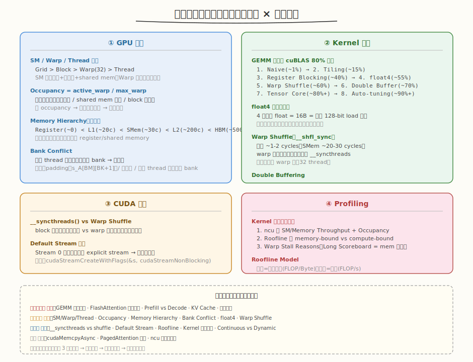
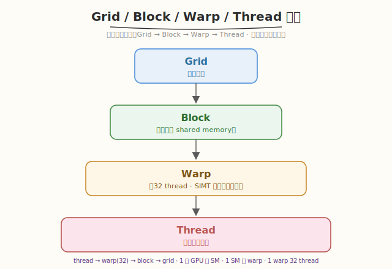
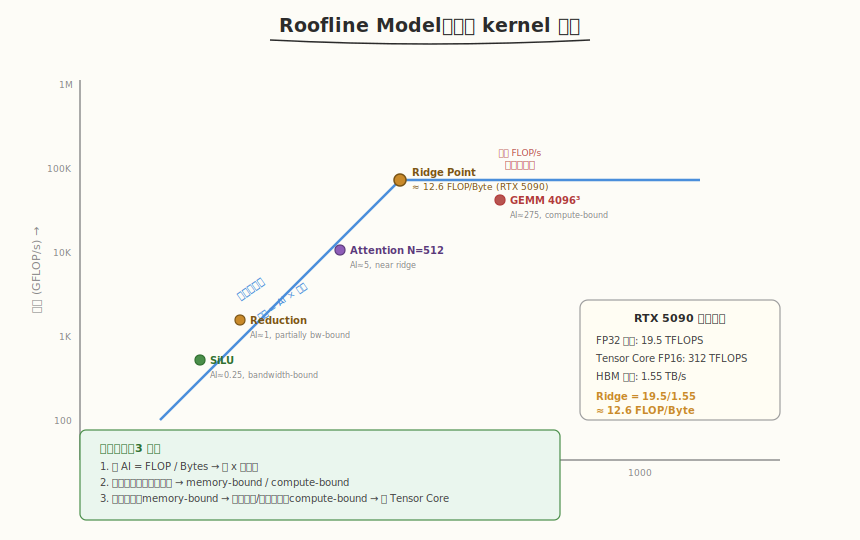

## Day 3：高频面试题基础篇

### 🎯 目标

通过今天的学习，你将：

1. 复习 **GPU 基础四大考点**——SM/Warp/Thread 层次结构、Occupancy 与影响因素、Memory Hierarchy 延迟层次、Bank Conflict 与 padding<br>
2. 掌握 **Kernel 优化八层路径**——从 Naive(1%) 到 Tensor Core(80%+) 的 GEMM 优化阶梯，float4 向量化、Warp Shuffle、Double Buffering 原理<br>
3. 理解 **CUDA 编程三个陷阱**——`__syncthreads()` vs Warp Shuffle 同步差异、Default Stream 隐式同步坑、`cudaMemcpyAsync` 与 pinned memory<br>
4. 学会 **Roofline Model 分析法**——算术强度定位 memory-bound/compute-bound，RTX 5090 ridge point 计算<br>
5. 能用 **ncu 三步法分析 kernel 瓶颈**——看 SM/Memory Throughput → Roofline 定位 → Warp Stall Reasons<br>
6. 产出一份 **基础篇面试题自问自答笔记**，每道题限时 3 分钟口述，录音回放修正卡壳点

> 💡 **为什么重要**：Day 1-2 我们完善了项目文档和架构图，面试官接下来会深挖技术细节。"基础篇"是面试的敲门砖——SM/Warp/Thread、Occupancy、Memory Hierarchy、GEMM 优化路径、Roofline 这些问题几乎每场 AI Infra 面试都会出现。答不上来直接出局，答得流畅是进入下一轮的入场券。

---

### 学前导读：为什么面试要考"基础"

面试官问 GPU 基础不是为了背书，而是验证你**是否真正理解了底层原理**：

```
"会写 kernel" ≠ "理解 GPU"
  会写 kernel → 能完成任务（工程师水平）
  理解 GPU → 能解释为什么快/慢、能做 trade-off（专家水平）

面试官的逻辑：
  问 Occupancy → 你是否知道寄存器/shared mem 对性能的影响
  问 Bank Conflict → 你是否真正写过 shared memory kernel
  问 Roofline → 你是否会用数据驱动的方式分析瓶颈
  问 GEMM 优化路径 → 你是否理解从 1% 到 80% 每步优化的原理
```

| 层级 | 问题示例 | 考察点 |
|------|---------|--------|
| 记忆层 | "SM 是什么？" | 概念是否清晰 |
| 理解层 | "Occupancy 低会怎样？" | 因果关系 |
| 应用层 | "怎么把 GEMM 优化到 72%？" | 实战经验 |
| 分析层 | "这个 kernel 的瓶颈在哪？" | Roofline + ncu |

> 💡 **一句话总结**：基础篇面试题不是"背答案"，而是"证明你理解了 GPU 的工作原理"——每个答案都要能画出图、给出数字、解释因果。

---

### 理论学习

#### 1.1 知识地图总览



基础篇覆盖四大主题，每个主题 3-4 个核心考点：

| 主题 | 核心考点 | 面试高频度 |
|------|---------|-----------|
| **① GPU 基础** | SM/Warp/Thread、Occupancy、Memory Hierarchy、Bank Conflict | ⭐⭐⭐⭐ |
| **② Kernel 优化** | GEMM 八层路径、float4、Warp Shuffle、Double Buffering | ⭐⭐⭐⭐⭐ |
| **③ CUDA 编程** | `__syncthreads` vs Shuffle、Default Stream、`cudaMemcpyAsync` | ⭐⭐⭐ |
| **④ Profiling** | ncu 三步法、Roofline Model、Warp Stall Reasons | ⭐⭐⭐⭐ |

#### 1.2 GPU 基础

##### SM / Warp / Thread 层次



- **SM（Streaming Multiprocessor）**：GPU 的基本计算单元，含多个 CUDA 核心、寄存器文件、shared memory
- **Warp**：32 个 thread 组成，是 GPU 调度的最小单位，warp 内所有 thread 执行相同指令（SIMT）
- **关系**：一个 GPU 有多个 SM，一个 SM 可同时运行多个 warp，一个 warp 内 32 thread 同步执行

##### Occupancy

```
Occupancy = active_warp / max_warp_per_SM
```

| 降低 Occupancy 的原因 | 机制 |
|---------------------|------|
| 每 thread 寄存器过多 | SM 寄存器总量固定，寄存器多 → 每 SM 能装的 warp 少 |
| 每 block shared mem 过多 | SM shared mem 总量固定 |
| block size 非 32 倍数 | 不足 32 的尾部 thread 浪费一个 warp |
| grid size 不足 | SM 数量多但 block 不够分 |

> ⚠️ Occupancy 低 → SM 上的 active warp 少 → 无法通过 warp 切换隐藏延迟 → 性能下降。但**不是越高越好**——100% occupancy 但寄存器不足导致 spilling 反而更慢。

##### Memory Hierarchy

| 层级 | 延迟 | 带宽 | 容量 |
|------|------|------|------|
| Register | ~0 cycle | 极高 | ~256KB/SM |
| Shared Memory / L1 | ~20-30 cycles | ~128B/clock/SM | 164KB/SM (5090) |
| L2 Cache | ~200 cycles | — | ~64MB |
| Global Memory (HBM) | ~400-800 cycles | 1.55 TB/s (5090) | 24-32GB |

优化原则：**让热点数据驻留在 register/shared memory，合并访问 global memory**。

##### Bank Conflict

Shared Memory 分为 32 个 bank（对应 warp 内 32 thread）。同一 warp 的多个 thread 同时访问同一 bank → 串行化（bank conflict）。

```
无 conflict：thread i 访问 bank i（连续地址）→ 1 次完成
2-way conflict：2 个 thread 访问同一 bank → 2 次完成
32-way conflict：32 个 thread 访问同一 bank → 32 次完成（最差）
```

避免方法：① padding（`s_A[BM][BK+1]`，加一列打乱 bank 对齐）② 向量化访问 ③ 连续 thread 访问不同 bank。

#### 1.3 Kernel 优化：GEMM 八层路径

| 层级 | 优化手段 | 达到比例 | 关键原理 |
|------|---------|---------|---------|
| 1 | Naive（1 thread 1 元素） | ~1% | 无复用，全走 global memory |
| 2 | Shared Memory Tiling | ~15% | K 维 tile 加载到 SMem 复用 |
| 3 | Register Blocking（TM×TN） | ~40% | 每 thread 算一个小块，复用 register |
| 4 | float4 向量化加载 | ~55% | 一次读 16B，减少指令数 |
| 5 | Warp Shuffle | ~60% | warp 内直接传寄存器，不经 SMem |
| 6 | Double Buffering | ~70% | 前台算 + 后台加载，隐藏延迟 |
| 7 | Tensor Core (WMMA/mma) | ~80%+ | 矩阵乘加速单元 |
| 8 | Auto-tuning | ~90%+ | 参数搜索（tile 大小、block 维度） |

##### float4 向量化

GPU global memory 以 128-byte cache line 访问。4 个连续 float（16 bytes）可用一条 128-bit load 指令完成 → 减少指令数、提升带宽利用率。需地址对齐。

##### Warp Shuffle

| 维度 | Warp Shuffle | Shared Memory |
|------|-------------|---------------|
| 延迟 | ~1-2 cycles | ~20-30 cycles |
| 同步 | warp 内隐式 | 需 `__syncthreads()` |
| 范围 | warp 内（32 thread） | block 内 |

#### 1.4 CUDA 编程三个陷阱

##### `__syncthreads()` vs Warp Shuffle

- `__syncthreads()`：block 级同步，所有 thread 必须到达，有性能开销
- Warp Shuffle：warp 内隐式同步，硬件自动完成，开销极小
- 局限：Shuffle 只限 warp 内（32 thread），block 级通信仍需 `__syncthreads()`

##### Default Stream 的坑

Default Stream（Stream 0）会**隐式同步**所有 explicit stream。如果在 explicit stream 中做并发，然后调用 `cudaMemcpy`（走 default stream），所有并发被打断。

```cpp
// 解决：创建 non-blocking stream
cudaStreamCreateWithFlags(&stream, cudaStreamNonBlocking);
// 或编译选项
nvcc-- default - stream per - thread
```

##### `cudaMemcpyAsync` vs `cudaMemcpy`

- `cudaMemcpy`：同步，阻塞 host
- `cudaMemcpyAsync`：异步，需要 pinned memory（`cudaMallocHost`），可与其他 kernel overlap

#### 1.5 Profiling：Roofline Model



##### Roofline 三步法

1. **算 AI**：`Arithmetic Intensity = FLOP / Bytes`（每字节搬运做多少次运算）
2. **定位**：AI < ridge point → memory-bound；AI > ridge point → compute-bound
3. **优化方向**：memory-bound → 减少访存/提升带宽；compute-bound → 用 Tensor Core/减少计算

##### RTX 5090 关键参数

```
FP32 峰值: 19.5 TFLOPS
HBM 带宽: 1.55 TB/s
Ridge Point = 19.5 / 1.55 ≈ 12.6 FLOP/Byte
```

##### Kernel 瓶颈分析三步

1. `ncu --set full` 看 **SM Throughput** 和 **Memory Throughput**
   - Memory >> SM → memory-bound
   - SM >> Memory → compute-bound
2. 看 **Achieved Occupancy**：是否过低（< 50%）
3. 看 **Warp Stall Reasons**：
   - Long Scoreboard → global memory 延迟
   - Math Pipe Throttle → FMA 饱和

---

### Coding 任务：基础篇面试题自问自答笔记

#### 任务 1：创建 interview_basics.py

创建文件 [kernels/interview_basics.py](kernels/interview_basics.py)，将 12 道基础篇高频题整理为可自测的 Q&A 系统：

```python
# interview_basics.py —— 基础篇面试题自测系统
# 运行命令: python interview_basics.py
# 依赖: 仅标准库

import random
import time

QUESTIONS = [
    {
        "id": 1,
        "topic": "GPU 基础",
        "question": "什么是 SM、Warp、Thread？它们之间的关系是什么？",
        "answer": (
            "SM（Streaming Multiprocessor）：GPU 基本计算单元，含多核心+寄存器+shared memory\n"
            "Warp：32 thread 组成，是 GPU 调度基本单位（SIMT）\n"
            "Thread：最细粒度执行单元\n"
            "关系：Grid > Block > Warp > Thread；一个 SM 可同时运行多个 warp"
        ),
        "freq": 4,
    },
    {
        "id": 2,
        "topic": "GPU 基础",
        "question": "什么是 Occupancy？什么情况下会降低？",
        "answer": (
            "Occupancy = active_warp / max_warp_per_SM\n"
            "降低原因：① 寄存器过多 ② shared mem 过多 ③ block 非对齐 ④ grid 不足\n"
            "影响：低 occupancy → 无法隐藏延迟 → 性能下降"
        ),
        "freq": 4,
    },
    {
        "id": 3,
        "topic": "GPU 基础",
        "question": "解释 GPU 的 memory hierarchy。",
        "answer": (
            "Register(~0c) < Shared Mem/L1(~20c) < L2(~200c) < HBM(~500c)\n"
            "优化目标：热点数据驻留 register/shared mem，合并访问 global memory"
        ),
        "freq": 4,
    },
    {
        "id": 4,
        "topic": "GPU 基础",
        "question": "什么是 bank conflict？如何避免？",
        "answer": (
            "Shared memory 分 32 bank；同 warp 多 thread 访问同一 bank → 串行化\n"
            "避免：padding（s_A[BM][BK+1]）、向量化、连续 thread 访问不同 bank"
        ),
        "freq": 4,
    },
    {
        "id": 5,
        "topic": "Kernel 优化",
        "question": "如何把 GEMM 优化到 cuBLAS 80%？",
        "answer": (
            "Naive(1%) → Tiling(15%) → Register Blocking(40%) → float4(55%)\n"
            "→ Warp Shuffle(60%) → Double Buffer(70%) → Tensor Core(80%+)\n"
            "→ Auto-tuning(90%+)"
        ),
        "freq": 5,
    },
    {
        "id": 6,
        "topic": "Kernel 优化",
        "question": "float4 向量化加载为什么能提升性能？",
        "answer": (
            "4 个连续 float=16B=一条 128-bit load 指令\n"
            "减少指令数、提升带宽利用率；需地址对齐 + coalesced"
        ),
        "freq": 4,
    },
    {
        "id": 7,
        "topic": "Kernel 优化",
        "question": "Warp Shuffle 比 Shared Memory 快多少？为什么？",
        "answer": (
            "Shuffle ~1-2 cycles，SMem ~20-30 cycles\n"
            "原因：warp 内专用交换网络直接读寄存器，不经 SMem 读写路径\n"
            "局限：只限 warp 内（32 thread）"
        ),
        "freq": 4,
    },
    {
        "id": 8,
        "topic": "CUDA 编程",
        "question": "__syncthreads() 和 warp shuffle 的同步区别？",
        "answer": (
            "__syncthreads()：block 级同步，所有 thread 必须到达，有开销\n"
            "Warp shuffle：warp 内隐式同步，硬件自动完成，开销极小\n"
            "Shuffle 只限 warp 内，block 级仍需 __syncthreads()"
        ),
        "freq": 3,
    },
    {
        "id": 9,
        "topic": "CUDA 编程",
        "question": "Default Stream 有什么坑？",
        "answer": (
            "Stream 0 隐式同步所有 explicit stream → 并发被打断\n"
            "解决：cudaStreamCreateWithFlags(&s, cudaStreamNonBlocking)\n"
            "或 nvcc --default-stream per-thread"
        ),
        "freq": 3,
    },
    {
        "id": 10,
        "topic": "CUDA 编程",
        "question": "cudaMemcpyAsync 和 cudaMemcpy 的区别？",
        "answer": (
            "cudaMemcpy：同步，阻塞 host\n"
            "cudaMemcpyAsync：异步，需 pinned memory，可与其他 kernel overlap"
        ),
        "freq": 3,
    },
    {
        "id": 11,
        "topic": "Profiling",
        "question": "如何分析一个 CUDA kernel 的瓶颈？",
        "answer": (
            "1. ncu 看 SM/Memory Throughput + Achieved Occupancy\n"
            "2. Roofline 判 memory-bound / compute-bound\n"
            "3. Warp Stall Reasons（Long Scoreboard = mem 延迟）"
        ),
        "freq": 4,
    },
    {
        "id": 12,
        "topic": "Profiling",
        "question": "什么是 Roofline Model？RTX 5090 的 ridge point 是多少？",
        "answer": (
            "横轴=算术强度(FLOP/Byte)，纵轴=性能(FLOP/s)\n"
            "斜线=带宽限制，水平线=算力限制，交点=ridge point\n"
            "RTX 5090: 19.5 TFLOPS / 1.55 TB/s ≈ 12.6 FLOP/Byte"
        ),
        "freq": 4,
    },
]


def self_test(num=5):
    """随机抽题，限时口述自测。"""
    print(f"=== 基础篇面试自测（随机 {num} 题）===\n")
    sample = random.sample(QUESTIONS, min(num, len(QUESTIONS)))
    for i, q in enumerate(sample, 1):
        stars = "⭐" * q["freq"]
        print(f"[{i}/{num}] {stars} [{q['topic']}]")
        print(f"Q: {q['question']}")
        input("口述答案后按回车查看参考...")
        print(f"A: {q['answer']}")
        print()


def list_all():
    """列出所有题目。"""
    for q in QUESTIONS:
        stars = "⭐" * q["freq"]
        print(f"#{q['id']:>2} {stars} [{q['topic']}] {q['question']}")


if __name__ == "__main__":
    print("=== AI Infra 面试基础篇自测系统 ===")
    print(f"共 {len(QUESTIONS)} 道题\n")
    print("命令：")
    print("  list  — 列出所有题目")
    print("  test  — 随机抽 5 题自测（默认）")
    print("  test N — 随机抽 N 题自测")
    cmd = input("\n输入命令: ").strip()
    if cmd == "list":
        list_all()
    elif cmd.startswith("test"):
        n = int(cmd.split()[1]) if len(cmd.split()) > 1 else 5
        self_test(n)
    else:
        list_all()
```

完整代码见 [kernels/interview_basics.py](kernels/interview_basics.py)。

代码要点：
- **12 道题** 覆盖四大主题（GPU 基础 4 题 + Kernel 优化 3 题 + CUDA 编程 3 题 + Profiling 2 题）
- **自测模式**：随机抽题 → 口述答案 → 按回车看参考 → 自评
- **高频度标记**：`freq` 字段（3-5 星），5 星 = 必考
- **交互式**：`input()` 暂停让你口述，模拟真实面试节奏

#### 任务 2：运行自测系统

```bash
python kernels/interview_basics.py
```

**预期输出**（节选）：

```text
=== AI Infra 面试基础篇自测系统 ===
共 12 道题

命令：
  list  — 列出所有题目
  test  — 随机抽 5 题自测（默认）
  test N — 随机抽 N 题自测

输入命令: test 5

=== 基础篇面试自测（随机 5 题）===

[1/5] ⭐⭐⭐⭐⭐ [Kernel 优化]
Q: 如何把 GEMM 优化到 cuBLAS 80%？
口述答案后按回车查看参考...
A: Naive(1%) → Tiling(15%) → Register Blocking(40%) → float4(55%)
→ Warp Shuffle(60%) → Double Buffer(70%) → Tensor Core(80%+)
→ Auto-tuning(90%+)
```

##### 观察重点

1. **限时 3 分钟**：每道题口述不超过 3 分钟，超时说明不熟
2. **录音回放**：录下自己的口述，回放找卡壳点
3. **反复练习**：同一道题练 3 遍，直到流畅无卡顿

#### 任务 3：白板默写 Roofline 图

不看资料，在纸上画出 Roofline Model：横轴（算术强度）、纵轴（性能）、斜线（带宽限制）、水平线（算力限制）、ridge point（标注 RTX 5090 的 12.6 FLOP/Byte）。标注 SiLU（memory-bound）和 GEMM（compute-bound）的大致位置。

> 思考：为什么 SiLU 的 AI 只有 ~0.25 而 GEMM 的 AI 有 ~275？（提示：SiLU 每元素只做几次运算但需读写 8B；GEMM 每 tile 做 2MNK 次运算但只读写 A+B+C。）

#### 任务 4：LeetGPU 在线题目 —— SwiGLU

**题目链接**：<https://leetgpu.com/challenges/swiglu>

**题目概述**：给定长度为 `N` 的 `float` 输入向量，将其分为两半 `x₁ = x[:N/2]`、`x₂ = x[N/2:]`，计算 `output = SiLU(x₁) * x₂`，输出长度为 `N/2`。其中 `SiLU(x) = x * sigmoid(x)`。

**与今日知识的关联**：SwiGLU 是 LLaMA MLP 的核心激活函数——它把 SiLU 和 elementwise 乘法**融合**在一个 kernel 中，正是今日"Kernel 优化"主题的典型案例：不融合需要 3 个 kernel（SiLU → 临时矩阵 → 乘法 → 输出），3 次 HBM 往返；融合后 1 个 kernel 读写各 1 次。面试问"为什么要做 kernel fusion"时，SwiGLU 是最好的例子。同时它是 memory-bound elementwise kernel，AI ≈ 0.42，正好用 Roofline 验证"远低于 ridge point → 带宽瓶颈"。

> 💡 提交后在 [LeetGPU SwiGLU](https://leetgpu.com/challenges/swiglu) 上记录通过耗时。完整题解（含融合 kernel、SiLU+gate 数据流、与 kernel fusion 面试题的对应）见 [SwiGLU 题解](../../../../leetgpu/week8/day3/leetgpu-swiglu-solution.md)。

#### 任务 5：LeetCode 面试题 —— 零钱兑换

**题目链接**：[322. 零钱兑换](https://leetcode.cn/problems/coin-change/)

**题目概述**：给定硬币面额数组 `coins` 和总金额 `amount`，求凑成该金额所需的最少硬币数。无法凑出返回 `-1`。

**与今日知识的关联**：零钱兑换的 **DP 子问题复用** 与 GPU **shared memory tile 复用** 同构——DP 中 `dp[i]` 查 `dp[i-coin]`（已算好的子问题解），避免重算；GPU kernel 从 shared memory 读 tile（已从 HBM 加载），避免重读。两者都是"缓存已计算/已加载的结果，避免重复"的核心模式。面试中"为什么 DP 比暴力快"和"为什么 tiling 比 naive 快"是同一个答案：复用缓存。

**核心套路**：

```
dp[0] = 0, dp[1..amount] = INF
for i in 1..amount:
    for coin in coins:
        if i >= coin: dp[i] = min(dp[i], dp[i-coin] + 1)
return dp[amount] if dp[amount] != INF else -1
完全背包：外层金额，内层硬币，每硬币可重复用
```

> 💡 完整题解（含 C++/Python 参考代码、DP 表演算、与 shared memory tile 复用的类比）见 [零钱兑换题解](../../../../leetcode/daily/week8/day3/零钱兑换.md)。

---

### 扩展实验

#### 实验 1：限时口述 GEMM 八层优化

不看资料，限时 5 分钟，口述 GEMM 从 Naive 到 cuBLAS 80% 的八层优化路径，每层说明：① 做了什么 ② 为什么快 ③ 达到多少比例。录音回放，检查是否遗漏关键层。

> 思考：哪一层优化你讲得最不流畅？针对那一层重读 Week2 Day2 的教程和代码。

#### 实验 2：用 ncu 分析自己写过的 kernel

挑一个你之前写过的 kernel（如 Week2 的 GEMM 或 Week4 的 FlashAttention），用 `ncu --set full` 跑一次，找到 SM Throughput、Memory Throughput、Achieved Occupancy 三个指标，用 Roofline 判断瓶颈类型。

> 思考：你的 kernel 是 memory-bound 还是 compute-bound？优化方向应该是什么？

#### 实验 3：默写 Memory Hierarchy 延迟表

不看资料，默写 GPU 五级存储层次的延迟（Register、L1/Shared Memory、L2、HBM），标注数量级。标注 RTX 5090 的 HBM 带宽（1.55 TB/s）和 shared memory 容量（164KB/SM）。

> 思考：为什么 shared memory 延迟只有 ~30 cycles 而 HBM 要 ~500 cycles？（提示：shared memory 在 SM 内部，HBM 在芯片外部需走内存总线。）

---

### 今日总结

Day 3 我们系统复习了 AI Infra 面试基础篇的四大主题：

1. **GPU 基础**：SM/Warp/Thread 层次（Grid>Block>Warp>Thread，warp=32 是调度单位）；Occupancy（active_warp/max_warp，寄存器/SMem 过多会降低）；Memory Hierarchy（Register~0c < SMem~30c < L2~200c < HBM~500c）；Bank Conflict（32 bank，padding 避免）
2. **Kernel 优化**：GEMM 八层路径（Naive 1% → Tiling 15% → Reg Blocking 40% → float4 55% → Shuffle 60% → Double Buffer 70% → Tensor Core 80%+ → Auto-tuning 90%+）；float4 = 一条 128-bit load；Shuffle ~1-2 cycles vs SMem ~30 cycles
3. **CUDA 编程**：`__syncthreads()` block 级 vs Shuffle warp 级同步；Default Stream 隐式同步坑（用 non-blocking flag 解决）；`cudaMemcpyAsync` 需 pinned memory
4. **Profiling**：Roofline 三步法（算 AI → 定位 memory/compute-bound → 定优化方向）；RTX 5090 ridge point = 19.5/1.55 ≈ 12.6 FLOP/Byte；ncu 三步法（SM/Mem Throughput → Roofline → Warp Stall Reasons）
5. **自测系统**：12 道题覆盖四大主题，随机抽题 + 限时口述 + 录音回放
6. **SwiGLU**：kernel fusion 的典型案例（3 kernel → 1 kernel，省 2 次 HBM 往返），memory-bound AI≈0.42
7. **零钱兑换**：完全背包 DP，子问题复用 ↔ shared memory tile 复用

掌握这些后，你就有了面试基础篇的"弹药库"——明天 Day 4 进入进阶篇（Attention/推理系统/vLLM/调度），用更深入的问题区分"懂"和"精通"。

---

### 面试要点

1. **什么是 SM、Warp、Thread？它们之间的关系是什么？**（⭐⭐⭐⭐ 高频）

<details>
<summary>点击查看答案</summary>

 - **SM（Streaming Multiprocessor）**：GPU 的基本计算单元，包含多个 CUDA 核心、寄存器文件、shared memory
 - **Warp**：32 个 thread 组成，是 GPU 调度的最小单位，warp 内所有 thread 执行相同指令（SIMT）
 - **Thread**：最细粒度的执行单元
 - **层次关系**：Grid > Block > Warp > Thread
 - 一个 GPU 有多个 SM，一个 SM 可同时运行多个 warp，一个 warp 内 32 thread 同步执行

</details>


2. **如何把 GEMM 优化到 cuBLAS 80%？**（⭐⭐⭐⭐⭐ 必考）

<details>
<summary>点击查看答案</summary>

 - 八层优化路径：
   1. Naive（~1%）：1 thread 算 1 元素
   2. Shared Memory Tiling（~15%）：K 维 tile 加载到 SMem 复用
   3. Register Blocking（~40%）：TM×TN thread tile，复用 register
   4. float4 向量化（~55%）：一次读 16B
   5. Warp Shuffle（~60%）：warp 内直接传寄存器
   6. Double Buffering（~70%）：前台算+后台加载
   7. Tensor Core / WMMA（~80%+）：矩阵乘加速单元
   8. Auto-tuning（~90%+）：参数搜索
 - 每层的关键：减少 global memory 访问、提高数据复用、隐藏延迟

</details>


3. **什么是 Roofline Model？RTX 5090 的 ridge point 是多少？**（⭐⭐⭐⭐ 高频）

<details>
<summary>点击查看答案</summary>

 - **Roofline Model**：横轴 = 算术强度（FLOP/Byte），纵轴 = 性能（FLOP/s）
 - 斜线 = 带宽限制区（性能 = AI × 带宽），水平线 = 算力限制区（峰值 FLOP/s）
 - **交点 = ridge point**：AI < ridge → memory-bound，AI > ridge → compute-bound
 - **RTX 5090**：FP32 峰值 19.5 TFLOPS，HBM 带宽 1.55 TB/s
 - **Ridge Point = 19.5 / 1.55 ≈ 12.6 FLOP/Byte**
 - 用法：算 kernel 的 AI → 定位瓶颈 → 定优化方向

</details>


4. **Warp Shuffle 比 Shared Memory 快多少？为什么？有什么局限？**（⭐⭐⭐⭐ 高频）

<details>
<summary>点击查看答案</summary>

 - **延迟对比**：Shuffle ~1-2 cycles，Shared Memory ~20-30 cycles
 - **原因**：Shuffle 通过 warp 内部专用交换网络直接读取源寄存器，不需要经过 shared memory 读写路径，也不需要 `__syncthreads()`
 - **局限**：只适用于 warp 内（最多 32 线程），block 级通信仍需 shared memory + `__syncthreads()`
 - **常用原语**：`__shfl_down_sync`（归约）、`__shfl_xor_sync`（蝴蝶交换）、`__shfl_up_sync`（prefix scan）

</details>


5. **如何分析一个 CUDA kernel 的瓶颈？**（⭐⭐⭐⭐ 高频）

<details>
<summary>点击查看答案</summary>

 - **三步法**：
   1. 用 `ncu --set full` 获取 **SM Throughput** 和 **Memory Throughput**
      - Memory >> SM → memory-bound
      - SM >> Memory → compute-bound
   2. 看 **Achieved Occupancy**：是否过低（< 50%）→ 寄存器/SMem 限制
   3. 看 **Warp Stall Reasons**：
      - Long Scoreboard → global memory 延迟 → 优化访存
      - Math Pipe Throttle → FMA 饱和 → 用 Tensor Core
 - 针对性优化后重新 profile，迭代直到接近峰值

</details>
