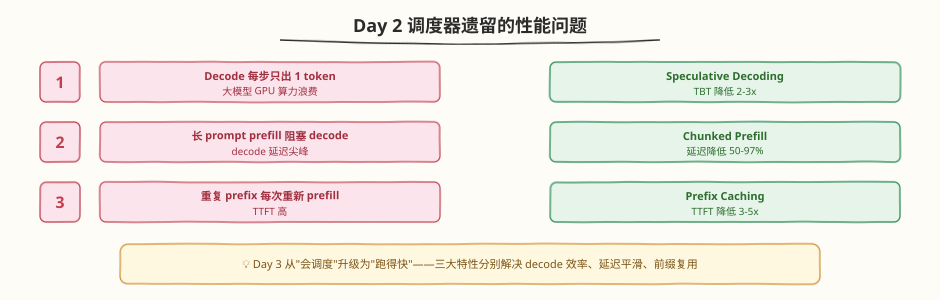
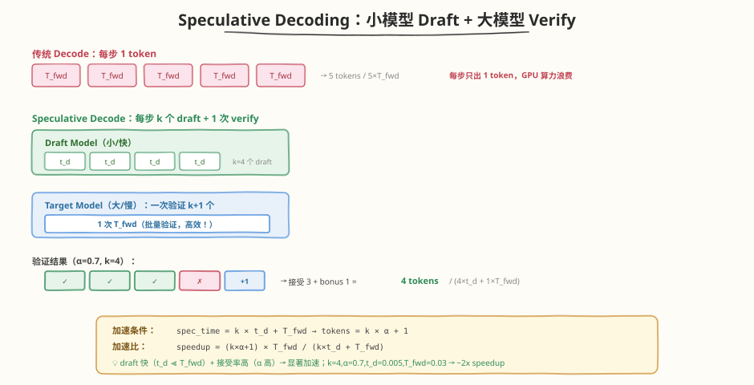
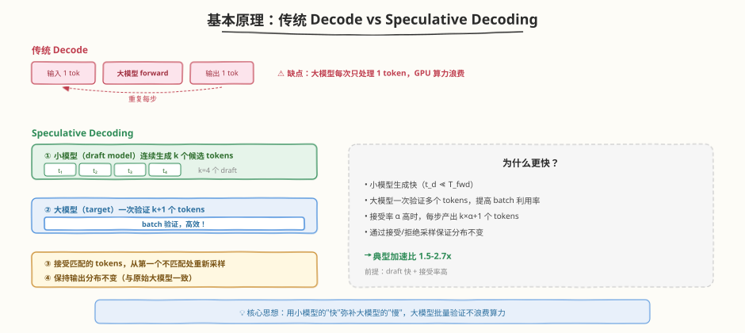

## Day 3：投机解码专题 —— 原理与三路线（Medusa / EAGLE / MTP）

### 🎯 目标

通过今天的学习，你将：

1. 理解 **Speculative Decoding（投机采样）**——小模型 draft 生成 k 个候选 token，大模型一次验证，接受率 α 高时每步产出多个 token<br>
2. 掌握 **加速理论**——`k×α+1` 是近似上界，精确期望为 `(1-α^(k+1))/(1-α)`；α 决定加速比上限，k 是杠杆，两者必须匹配<br>
3. 对比 **三条 draft 路线**——独立小模型 / Medusa / EAGLE / MTP（DeepSeek-V3），理解"draft 质量决定接受率上限"的 2024+ 趋势<br>
4. 能识别 **失效边界**——α 低 + k 大时 draft 开销超过收益，实测变慢（0.86x）<br>
5. **复测** Chunked Prefill 与 Prefix Caching 的收益——两大特性 Week 7 Day 3/4 已学过并落盘实现，今天只做收益复测，不重复学习<br>
6. 掌握 **三大特性集成优先级**——Prefix Caching 和 Chunked Prefill 优先（Week 7 已实现），Speculative Decoding 可选（复杂度高）<br>

> 💡 **为什么重要**：Week 7 的调度器解决了"怎么调度"，Week 8 Day 1-2 的量化解决了"减少访存量"，但它们都动不了 decode 的一个根本瓶颈：**每步 forward 只产出 1 个 token**。Speculative Decoding 用"小模型打草稿 + 大模型批量批改"打破这个瓶颈，把 TBT（token 间延迟）降低 1.5-2.7x，是 vLLM / SGLang / TensorRT-LLM 的高级加速特性，也是面试"高级推理优化"的高频加分题。至于三大特性中的另外两个（Chunked Prefill、Prefix Caching），Week 7 已完整学过——今天聚焦增量，不复述旧课。

---

### 学前导读：decode 的"每步 1 token"瓶颈

Week 7 的调度器（Continuous Batching → vLLM Scheduler → Chunked Prefill → Prefix Caching → PD 分离）解决了"怎么调度"；Week 8 Day 1-2 的量化解决了"减少访存量"。但 decode 还有一个调度和量化都动不了的效率问题——**每步 1 次 forward 只出 1 个 token**，且 M=1 时是 memory-bound（Week 7 Day 1 算过，算力利用率仅 1-3%），大量算力在空转：



| 瓶颈 | 表现 | 解决方案 | 收益 | 状态 |
|------|------|---------|------|------|
| Decode 算力浪费 | 每步 1 token，GPU 利用率低 | Speculative Decoding | TBT 降低 1.5-2.7x | **今天** |
| Prefill 阻塞 decode | 长 prompt 导致 decode 延迟尖峰 | Chunked Prefill | 延迟降低 50-97% | Week 7 Day 3 已实现 |
| 重复 prefix 计算 | 多轮对话重复 prefill 系统提示 | Prefix Caching | TTFT 降低 3-5x | Week 7 Day 4 已实现 |

> 💡 **一句话总结**：今天是"三大高级特性"拼图的最后一块——decode 效率。前两块（延迟平滑、前缀复用）Week 7 已落盘，收益复测即可。

---

### 理论学习

#### 3.1 Speculative Decoding（投机采样）



##### 基本原理



##### 加速原理

```
假设：
 t_d = draft model 生成 1 个 token 的时间（小，如 0.005s）
 T_fwd = target model 一次 forward 的时间（大，如 0.03s）
 α = 平均接受率（如 0.7）

传统每 token 时间 ≈ T_fwd
Speculative 每步：k × t_d + T_fwd → 产出 k × α + 1 个 tokens（近似上界）
Speculative 每 token 时间 ≈ (k × t_d + T_fwd) / (k × α + 1)

当 t_d ≪ T_fwd 且 α 高时，加速明显。

> ⚠️ **k×α+1 是近似上界**：它假设 k 个 draft token 各自独立以概率 α 被接受，忽略了验证时的顺序停止规则（第一个拒绝即停止）。精确期望为 `(1-α^(k+1))/(1-α)`（等比级数求和），该值 ≤ k×α+1。例如 k=4, α=0.7 时，近似值 kα+1=3.8，精确期望 ≈ 2.77，对应加速比分别为 ~2.28x 和 ~1.66x。模拟结果（1.94x）介于两个加速比之间，受随机种子影响。
```

##### 关键属性

| 属性 | 说明 |
|------|------|
| **输出一致性** | 通过特殊的接受/拒绝采样，保证输出分布与大模型自回归采样一致 |
| **加速条件** | draft 快（t_d ≪ T_fwd）+ 接受率高（α > 0.5） |
| **k 的选择** | k 太小加速不够，k 太大 draft 开销大；必须与 α 匹配（见 3.2） |
| **适用场景** | decode 延迟敏感、有合适 draft model |
| **限制** | 需要额外内存放 draft model；α 低时可能变慢 |

> ⚠️ **保持分布不变的原理**：对每个 draft token，大模型计算其概率分布 p_target。若 draft 的采样值在 p_target 下有足够概率（≥ p_draft），则接受；否则以 (p_target - p_draft) 的残差概率重新采样。这保证最终分布 = p_target。

##### 模拟结果（k=4, α=0.7, t_d=0.005, T_fwd=0.03）

| k | α | 传统时间 | Spec 时间 | 加速比 |
|---|---|---------|----------|--------|
| 2 | 0.7 | 3.00s | 1.72s | 1.74x |
| 4 | 0.7 | 3.00s | 1.55s | 1.94x |
| 4 | 0.9 | 3.00s | 1.20s | 2.50x |
| 8 | 0.9 | 3.00s | 1.12s | 2.68x |
| 8 | 0.5 | 3.00s | 3.50s | **0.86x（变慢！）** |

> 💡 **k=8, α=0.5 时变慢**——draft token 太多但接受率低，draft 开销超过了加速收益。这说明 k 和 α 必须匹配（精确分析见 3.2）。

#### 3.2 接受率与加速比：α 是上限，k 是杠杆

**精确期望公式**（k 个 draft token，接受率 α）：

```
E[tokens/step] = (1 - α^(k+1)) / (1 - α)
加速比 ≈ E[tokens/step] × T_fwd / (k × t_d + T_fwd)
```

##### 接受率扫描（k=1..8, α=0.5..0.9）

| k \ α | 0.5 | 0.6 | 0.7 | 0.8 | 0.9 |
|-------|-----|-----|-----|-----|-----|
| 1 | 1.50 | 1.60 | 1.70 | 1.80 | 1.90 |
| 2 | 1.75 | 1.96 | 2.19 | 2.44 | 2.71 |
| 4 | 1.94 | 2.31 | 2.77 | 3.36 | 4.10 |
| 8 | 2.00 | 2.47 | 3.20 | 4.33 | 6.13 |

**关键观察**：
- α=0.5 时 k 从 4 到 8 收益递减（1.94 → 2.00），draft 开销超过收益
- α=0.9 时 k=8 仍有收益（4.10 → 6.13），高接受率下大 k 划算
- **结论**：k 和 α 必须匹配——低 α 用小 k（2-4），高 α 用大 k（4-8）

> 💡 **面试口述**：接受率决定加速比上限。α=0.7、k=4 时 E[tokens/step] ~2.77（精确期望），近似上界 kα+1=3.8；对应加速比分别为 ~1.66x 和 ~2.28x。draft 质量是决定性因素——Medusa α~0.5，EAGLE/MTP α~0.7+。

#### 3.3 三条 draft 路线：独立小模型 / Medusa / EAGLE / MTP

| 路线 | draft 来源 | 代表 | 特点 |
|------|-----------|------|------|
| **独立小模型** | 单独训练的小 LLM | 传统 speculative decoding | 需维护两个模型，draft 质量依赖小模型能力 |
| **Medusa** | target 模型的多个额外 head | Medusa | 无需独立小模型，target 模型加几个 head 并行预测 k 个 token |
| **EAGLE** | target 模型的特征层草稿 | EAGLE | 在 target 的 hidden states 上建草稿，质量更高 |
| **MTP** | target 模型的 MTP head | DeepSeek-V3 | DeepSeek 的 Multi-Token Prediction，训练时联合优化 |

##### Medusa vs EAGLE vs MTP 详细对比

| 维度 | Medusa | EAGLE | MTP（DeepSeek） |
|------|--------|-------|----------------|
| draft 位置 | target 顶层加 head | target 隐藏层后接草稿网络 | target 的 MTP head（训练联合） |
| 额外参数 | 几个 head（小） | 草稿网络（中等） | MTP head（与 target 同量级） |
| draft 质量 | 中（token 级预测） | 高（特征级，更准） | 高（训练时联合优化） |
| 接受率 α | ~0.5-0.6 | ~0.6-0.7 | ~0.7-0.8 |
| 加速比 | 2-3x | 2.5-3.5x | 3-4x |
| 训练成本 | 微调加 head | 需训练草稿网络 | 联合训练（成本高） |
| 部署复杂度 | 低（加 head） | 中（加网络） | 高（改训练流程） |

> 💡 **面试要点**：Medusa 是"最简单的投机解码"（加 head 即可），EAGLE 是"质量更高的 Medusa"（特征层草稿），MTP 是"DeepSeek 的训练时联合优化"（质量最高但改训练）。2024+ 趋势是 EAGLE/MTP，因为 draft 质量决定接受率上限。

> 📖 **品读论文**：Speculative Decoding 原始论文（[arXiv:2302.01318](https://arxiv.org/abs/2302.01318)）、Medusa（[arXiv:2401.10774](https://arxiv.org/abs/2401.10774)）、EAGLE（[arXiv:2401.15077](https://arxiv.org/abs/2401.15077)）、DeepSeek-V3 技术报告（[arXiv:2412.19437](https://arxiv.org/abs/2412.19437)）的 MTP 章节

#### 3.4 复习速查：Chunked Prefill 与 Prefix Caching（Week 7 已实现）

> 两大特性 Week 7 已完整学习并落盘实现，今天不复述理论，只留速查 + 收益复测。

- **Chunked Prefill**（[Week 7 Day 3](https://github.com/hzchenxiaobin/ai-infra-notes/blob/main/aiinfra/daily/week7/day3/README.md)）：长 prompt 拆成 chunk 与 decode 交错，decode 最大延迟从"整个 prefill"降到"一个 chunk"（降低 50-97%）。chunk 大小是 TTFT/TPOT 权衡：太小 prefill 效率低（小 batch GEMM），太大失去平滑效果，经验值 512-2048（vLLM 默认 2048）
- **Prefix Caching**（[Week 7 Day 4](https://github.com/hzchenxiaobin/ai-infra-notes/blob/main/aiinfra/daily/week7/day4/README.md)）：缓存公共前缀的 KV Cache，block hash 匹配 + LRU 淘汰，命中时跳过 prefill，TTFT 降低 3-5x；多轮对话、模板化请求收益最大。vLLM PagedAttention 天然支持 block 级 prefix caching，SGLang RadixAttention 用基数树管理（W7D4 对比过）

##### 收益复测（1 分钟，在仓库根目录运行）

```bash
python aiinfra/daily/week7/day3/kernels/chunked_prefill_simulator.py
python aiinfra/daily/week7/day4/kernels/prefix_cache_engine.py
```

```text
# prefix_cache_engine.py 输出节选
--- Scenario 3: Multi-turn dialogue ---
  Turn 1: prefill 40 tokens (cache miss), latency = 4.0 ms
  Turn 2: prefill 16 tokens (32 prefix hit), latency = 1.6 ms
  Turn 3: prefill 8 tokens (48 prefix hit), latency = 0.8 ms
  Total with cache: 6.4 ms / Total without cache: 14.4 ms / Speedup: 2.25x
```

#### 3.5 特性收益对比与集成优先级

| 特性 | 收益 | 复杂度 | 依赖 | 状态 |
|------|------|--------|------|------|
| **Prefix Caching** | TTFT 降低 3-5x | 中 | KV Cache 管理 | **Week 7 Day 4 已实现** |
| **Chunked Prefill** | 延迟降低 50-97% | 中 | 调度器改造 | **Week 7 Day 3 已实现** |
| **CUDA Graph** | launch 开销降低 | 中 | 静态 shape | 明天 Day 4 |
| **Speculative Decoding** | TBT 降低 1.5-2.7x | 高 | Draft model | **今天** |

> 💡 **集成建议**：Prefix Caching 和 Chunked Prefill 收益高、复杂度中等且已落地，构成 Phase 1。Speculative Decoding 收益可观，但需要 draft model 和分布对齐，实现复杂度高，适合作为 Phase 2 的可选优化。

### Coding 任务：投机解码模拟与接受率扫描

#### 任务 1：创建 spec_decode_simulator.py

创建文件 [kernels/spec_decode_simulator.py](https://github.com/hzchenxiaobin/ai-infra-notes/blob/main/aiinfra/daily/week8/day3/kernels/spec_decode_simulator.py)，模拟投机解码并量化收益：

```python
# spec_decode_simulator.py —— 投机解码模拟器（draft + verify Monte Carlo + 接受率理论扫描）
# 运行命令: python spec_decode_simulator.py
# 依赖: 仅标准库

# 1. Monte Carlo 模拟
def simulate_speculative_decoding(num_tokens=100, draft_k=4, accept_rate=0.7, ...):
    """模拟 draft+verify 过程（顺序验证，第一个拒绝即停），测量加速比"""

# 2. 理论分析
def expected_tokens_per_step(draft_k, accept_rate):
    """精确期望 (1-α^(k+1))/(1-α)"""
def approx_tokens_per_step(draft_k, accept_rate):
    """近似上界 k·α+1"""
def theoretical_speedup(draft_k, accept_rate, ...):
    """理论加速比 = E[tokens/step] × T_fwd / (k·t_d + T_fwd)"""

# 3. 收益评估报告
def evaluate():
    """MC 扫描 + 理论 vs 模拟对比 + 接受率扫描 + 失效边界"""
```

完整代码见 [kernels/spec_decode_simulator.py](https://github.com/hzchenxiaobin/ai-infra-notes/blob/main/aiinfra/daily/week8/day3/kernels/spec_decode_simulator.py)。

代码要点：
- `simulate_speculative_decoding`：模拟 draft 生成 k 个 token + target 顺序验证（第一个拒绝即停止），统计接受/拒绝数和加速比——验证规则与真实一致，这正是 MC 结果会偏离 `k·α+1` 近似的原因
- `expected_tokens_per_step`：等比级数求和的精确期望，与 `approx_tokens_per_step` 对比可量化"近似上界"高估了多少
- `evaluate`：四部分报告——MC 参数扫描、理论 vs 模拟、接受率扫描（周里程碑留档）、失效边界

#### 任务 2：运行并分析收益报告

```bash
python kernels/spec_decode_simulator.py
```

**预期输出**（节选）：

```text
📊 1. Monte Carlo 模拟（num_tokens=100, t_d=0.005s, T_fwd=0.03s）
   k    α      传统    spec     加速比    接受    拒绝
   4  0.7   3.00s   1.55s    1.94x     69     55
   8  0.5   3.00s   3.50s    0.86x     50    350

📊 2. 理论 vs 模拟：k·α+1 是上界，不是期望（k=4, α=0.7 展开）
  k=4, α=0.7: E[tokens/step] 精确=2.77 vs 近似上界=3.80
    加速比：理论(精确期望)=1.66x, 理论(近似上界)=2.28x, MC 模拟=1.94x

📊 3. 接受率扫描：每步产出 token 的精确期望 E = (1-α^(k+1))/(1-α)
  k\α       0.5    0.6    0.7    0.8    0.9
  4      1.94   2.31   2.77   3.36   4.10
  8      2.00   2.47   3.20   4.33   6.13

📊 4. 失效边界：α 低 + k 大 → draft 开销超过收益，变慢
  k=8, α=0.3: traditional=3.00s, spec=4.48s, speedup=0.67x (变慢！)
  k=8, α=0.5: traditional=3.00s, spec=3.50s, speedup=0.86x (变慢！)
```

##### 观察重点

1. **理论 vs 模拟**：`k·α+1` 恒大于精确期望（忽略了顺序停止规则）；MC 结果（1.94x）介于理论精确（1.66x）与近似上界（2.28x）之间，受随机种子影响
2. **失效边界**：α=0.3 时 k=4 已变慢（0.94x），k=8 大幅变慢（0.67x）——draft 开销超过收益
3. **扫描表**：α=0.5 时 k 从 4 到 8 收益递减（1.94 → 2.00）；α=0.9 时 k=8 仍有大幅收益（4.10 → 6.13）
4. **集成优先级**：Prefix Caching / Chunked Prefill 已落地（Week 7），CUDA Graph 明天，投机解码可选

#### 任务 3：修改参数观察失效边界

```python
# 实验 A：Speculative Decoding 失效条件
# 设置 accept_rate=0.3, draft_k=8 → draft 开销大但接受少，应变慢
result = simulate_speculative_decoding(num_tokens=100, draft_k=8, accept_rate=0.3)

# 实验 B：t_d 变大（draft model 不够小）
# 设置 time_draft_forward=0.02 → k×t_d 接近 T_fwd，加速比急剧下降
result = simulate_speculative_decoding(num_tokens=100, draft_k=4, accept_rate=0.7,
                                       time_draft_forward=0.02)
```

> 思考：draft model 应该多大？（提示：t_d ≪ T_fwd 是硬条件，通常 draft 参数量是 target 的 1/10 以下；Medusa/EAGLE 用"加 head/草稿网络"避开独立模型的维护成本。）

#### 任务 4：LeetGPU 在线题目 —— Speculative Decoding Verification

**题目链接**：<https://leetgpu.com/challenges/speculative-decoding-verification>

**与今日知识的关联**：这道题就是 verify 阶段的 kernel 实现——大模型一次 forward 验证 k+1 个 draft token。Q 是 k+1 个 token（draft + 1），K/V 是历史 + draft 的 K/V；causal mask 的关键细节：draft token 之间是 causal、与历史是 full attention，块级跳过可省一半计算。学完今天的理论再手写这个 kernel，正好把"接受/拒绝采样"和"verify kernel 要点"（面试题 5）落到代码上。

> 💡 提交后在 [LeetGPU Speculative Decoding Verification](https://leetgpu.com/challenges/speculative-decoding-verification) 上记录通过耗时。完整题解见 [Speculative Decoding Verification 题解](https://hzchenxiaobin.github.io/leetgpu/leetgpu-speculative-decoding-verification-solution.html)。

#### 任务 5：LeetCode 面试题（10 周计划 · 第 8 周 Day 3）

> 📅 今日题目来自 [10 周算法面试刷题计划](https://hzchenxiaobin.github.io/leetcode/problems/10-week-plan.html) 第 8 周「二分查找与动态规划基础」Day 3（二分答案），共 3 题。简单题快速过、中等题精做、困难题吃透；卡壳 20 分钟就看题解，看懂后自己默写一遍。

| 题目 | 难度 | 核心套路 | 题解 |
|------|------|---------|------|
| [875. 爱吃香蕉的珂珂](https://leetcode.cn/problems/koko-eating-bananas/) | 中等 | 二分答案 + O(n) 验证 | [题解](https://hzchenxiaobin.github.io/leetcode/problems/875_爱吃香蕉的珂珂.html) |
| [1011. 在 D 天内送达包裹的能力](https://leetcode.cn/problems/capacity-to-ship-packages-within-d-days/) | 中等 | 二分答案 + 贪心验证 | [题解](https://hzchenxiaobin.github.io/leetcode/problems/1011_在D天内送达包裹的能力.html) |
| [378. 有序矩阵中第 K 小的元素](https://leetcode.cn/problems/kth-smallest-element-in-a-sorted-matrix/) | 中等 | 二分值域 + 左下角计数 / 小顶堆 k 路归并 | [题解](https://hzchenxiaobin.github.io/leetcode/problems/378_有序矩阵中第K小的元素.html) |

---

### 扩展实验

#### 实验 1：实现 Speculative Decoding 的接受/拒绝采样

当前模拟用随机数模拟接受/拒绝。修改为真实分布对齐：draft 和 target 各自输出概率分布，按论文公式接受/拒绝，验证最终分布与 target 一致。

> 思考：为什么"接受/拒绝采样"能保证分布不变？（提示：对 draft 采样值 x，若 p_target(x) ≥ p_draft(x) 则接受；否则以 (p_target - p_draft) 残差概率拒绝并重新采样。）

#### 实验 2：动态 draft 长度

当前 k 固定。修改为动态：维护最近若干步的实测接受率（滑动窗口平均），α 高时调大 k（如 4→8），α 低时调小 k（如 8→2），避免低接受率下浪费 draft 开销。

> 思考：k 的调整窗口和频率怎么定？（提示：窗口太短会被随机波动带偏，太长跟不上分布变化——可以对比固定 k 与动态 k 在 α 随生成进度变化的场景下的总时间。）

#### 实验 3：verify 阶段的 batch 化

当前模拟单请求 verify。修改为多请求：把多个请求各自的 draft token 拼成一个 batch 一起 verify——M=1 的 memory-bound 变成 M=batch，与 Week 7 Day 1 Continuous Batching 的"凑批摊薄带宽"思想同源。

> 思考：verify batch 与普通 decode batch 拼批时 token budget 怎么算？（提示：每个请求的 verify 占 k+1 个 token 位，而不是 decode 的 1 个。）

---

### 今日总结

Day 3 聚焦投机解码——三大高级特性中唯一未学的一块：

1. **原理**：小模型 draft k 个 token + 大模型一次 verify，接受/拒绝采样保证输出分布与 target 一致
2. **加速理论**：`k×α+1` 是近似上界，精确期望 `(1-α^(k+1))/(1-α)`；α 决定加速比上限，k 是杠杆，两者必须匹配——低 α 用小 k，高 α 用大 k
3. **三路线**：独立小模型（维护成本高）→ Medusa（加 head，α~0.5）→ EAGLE（特征层草稿，α~0.7）→ MTP（训练联合优化，α~0.8）；draft 质量决定接受率上限
4. **失效边界**：α=0.5 + k=8 实测 0.86x，α=0.3 + k=8 实测 0.67x——draft 开销超过收益时变慢
5. **复测**：Week 7 的 Chunked Prefill（延迟平滑）与 Prefix Caching（前缀复用）收益已验证，无需重复实现
6. **集成优先级**：Phase 1（Prefix Caching + Chunked Prefill，已落地）→ Phase 2（CUDA Graph + Speculative Decoding）

掌握这些后，你就有了推理系统的"加速武器库"的最后一块——明天 Day 4 用 CUDA Graph 消除 kernel launch 开销，Day 5 把量化、投机解码、CUDA Graph 接入 Mini 引擎。

---

### 面试要点

1. **什么是 Speculative Decoding？它为什么能加速 LLM 推理？**（⭐⭐⭐⭐ 高频）

<details>
<summary>点击查看答案</summary>

  - **原理**：小模型（draft）快速生成 k 个候选 tokens，大模型（target）一次验证这 k+1 个 tokens
  - **加速原因**：
  - 小模型生成速度快（t_d ≪ T_fwd）
  - 大模型一次验证多个 tokens，提高 batch 利用率
  - 如果 draft 质量高（α 高），每步可接受多个 tokens
  - **加速比**：`(k×α+1) × T_fwd / (k×t_d + T_fwd)`（近似上界，精确期望用 `(1-α^(k+1))/(1-α)` 替换 k×α+1），典型 1.5-2.7x
  - **保持分布不变**：通过接受/拒绝采样，确保最终分布与 target 一致
  - **失效条件**：α 低 + k 大 → draft 开销超过收益，可能变慢

</details>


2. **Speculative Decoding 如何保证输出分布不变？**（⭐⭐⭐ 中频）

<details>
<summary>点击查看答案</summary>

  - 对每个 draft token，target 计算其概率分布 p_target
  - 若 draft 采样值 x 满足 p_target(x) ≥ p_draft(x) → 接受
  - 否则以 (p_target - p_draft) 的残差概率拒绝，从残差分布重新采样
  - 数学上可证明：最终输出分布 = p_target（与纯 target 自回归一致）
  - 这保证了 speculative decoding 不会牺牲输出质量

</details>


3. **为什么接受率 α 决定加速比上限？**（⭐⭐⭐⭐ 高频）

<details>
<summary>点击查看答案</summary>

  - 加速比 ≈ E[tokens/step] × T_fwd / (k × t_d + T_fwd)
  - E[tokens/step] = (1 - α^(k+1)) / (1 - α)，随 α 增大趋近 k+1（上界）
  - α 低时 E[tokens/step] 小，k 大反而被 t_d 拖累（draft 开销 k×t_d 增长）
  - α=0.5、k=8 时 E[tokens/step]=2.00，但 k×t_d=8×t_d，若 t_d 不够小则变慢
  - **结论**：α 是上限，k 是杠杆——α 高才适合大 k

</details>


4. **draft 模型怎么选？独立小模型 vs Medusa vs EAGLE vs MTP？**（⭐⭐⭐⭐ 高频）

<details>
<summary>点击查看答案</summary>

  - **独立小模型**：需维护两模型，draft 质量受小模型能力限制，部署复杂
  - **Medusa**：target 加 head，无独立模型，但 token 级预测质量中等（α~0.5-0.6）
  - **EAGLE**：特征层草稿，质量更高（α~0.6-0.7），但需训练草稿网络
  - **MTP**：训练时联合优化，质量最高（α~0.7-0.8），但改训练流程，成本高
  - **选择**：快速验证用 Medusa，质量要求用 EAGLE，训练可控用 MTP（DeepSeek 路线）

</details>


5. **verify 阶段的 kernel 实现要点？**（⭐⭐⭐ 中频）

<details>
<summary>点击查看答案</summary>

  - verify 是"大模型一次 forward 验证 k+1 个 token"，本质是 batch=GEMM
  - 关键：Q 是 k+1 个 token（draft + 1），K/V 是历史 + draft 的 K/V
  - kernel 要点：causal mask 的块级跳过（draft token 间是 causal，与历史是 full attention）
  - 优化：FlashAttention 的 causal 变体可省一半块计算（见 C2 任务）
  - **接受/拒绝采样**：verify 后用 target 的 logits 做接受/拒绝，保持分布不变

</details>


6. **三大高级特性的集成优先级怎么排？为什么？**（⭐⭐⭐⭐ 高频）

<details>
<summary>点击查看答案</summary>

  - **Phase 1（优先）**：Prefix Caching + Chunked Prefill
  - 收益高（3-5x TTFT / 50-97% 延迟降低）、复杂度中等
  - 不需要额外模型，只需改造调度器和 KV Cache 管理
  - **Phase 2（可选）**：CUDA Graph + Speculative Decoding
  - CUDA Graph 降低 launch 开销，复杂度中等
  - Speculative Decoding 收益高但需要 draft model + 分布对齐，复杂度高
  - **排序逻辑**：按"收益/复杂度"性价比排序，优先做性价比高的

</details>

> 📚 Chunked Prefill / Prefix Caching 的专项面试题（key 设计、LRU 淘汰、block 级匹配、与 RadixAttention 对比）见 [Week 7 Day 4 面试要点](https://github.com/hzchenxiaobin/ai-infra-notes/blob/main/aiinfra/daily/week7/day4/README.md)，此处不重复。
